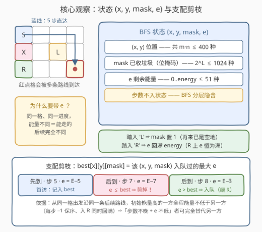
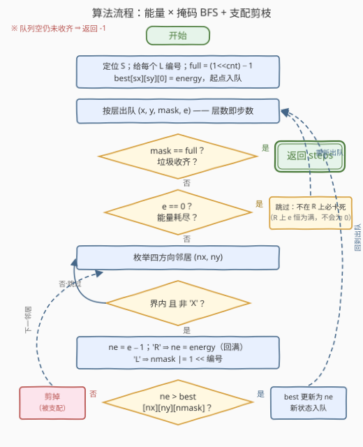

# LeetCode 清理教室的最少移动 题解

## 1. 题目概述

- **标题 / 题号**：清理教室的最少移动（#3568，medium）
- **链接**：https://leetcode.cn/problems/minimum-moves-to-clean-the-classroom/
- **难度**：中等
- **标签**：位运算, 广度优先搜索, 数组, 哈希表, 矩阵

**题意**：给你一个 $m \times n$ 的网格 `classroom`，一名学生志愿者负责清理教室里散落的垃圾。每个单元格是以下字符之一：

- `'S'`：学生的起点（全图恰好一个）；
- `'L'`：必须收集的垃圾（收集后该格变为空地，可再次经过）；
- `'R'`：重置区域——踏入后能量恢复到最大值 `energy`，**无论当前能量是多少**，可反复使用；
- `'X'`：无法通过的障碍物；
- `'.'`：空地。

同时给定整数 `energy` 表示最大能量容量，学生从 `'S'` 出发时能量为满。**每移动一步（上/下/左/右相邻格）消耗 1 单位能量**；能量为 0 时学生无法继续移动——除非正站在 `'R'` 上（而踏上 `'R'` 时能量已经回满）。返回收集**所有**垃圾所需的最少移动次数；无法完成返回 $-1$。

**示例 1**：

```text
输入：classroom = ["S.", "XL"], energy = 2
输出：2
解释：(0,0) → (0,1) → (1,1)，第二步踏上 'L' 完成收集，共 2 次移动。
```

**示例 2**：

```text
输入：classroom = ["LS", "RL"], energy = 4
输出：3
解释：(0,1) → (0,0) 收集第 1 个垃圾（剩 3 能量）→ (1,0) 踏入 'R' 回满 → (1,1) 收集第 2 个垃圾。
```

**示例 3**：

```text
输入：classroom = ["L.S", "RXL"], energy = 3
输出：-1
解释：无论先收哪个垃圾，能量都会在半路耗尽，且赶不到任何 'R' 补给。
```

**约束**：

- $1 \le m, n \le 20$
- `classroom[i][j]` 是 `'S'`、`'L'`、`'R'`、`'X'`、`'.'` 之一
- $1 \le energy \le 50$
- 恰好一个 `'S'`，至多 10 个 `'L'`

> 💡 **读题关键**：① 求**最少步数**且每步代价相同 → BFS 帧架；② 「'L' 收集后变空地」+「至多 10 个垃圾」→ 已收集集合用**位掩码**进状态；③ 踏入 'R' **无条件回满**（"无论当前能量是多少"）→ R 格上的能量恒为 `energy`；④ 能量为 0 只可能出现在非 R 格上，此时该状态**永久卡死**。

## 2. 解题思路

### 2.1 暴力思路：普通 BFS 为什么不够

如果没有能量限制，这就是「864. 获取所有钥匙」的换皮：状态定义为 (位置, 已收集垃圾掩码)，BFS 一趟搞定。能量把问题变复杂了——**同一个格子、同一个进度，剩余能量不同，能走的后续完全不同**：剩 1 格能量的状态只能再挪一步，满能量的状态还能绕远路折返。若只按 $(x, y)$ 或 $(x, y, mask)$ 去重，会把「晚到但更满」的状态错误地挡在门外。

老实的做法是把能量也塞进状态，visited 按 $(x, y, mask, e)$ 去重。状态数上界 $m \cdot n \cdot 2^{L} \cdot (energy+1) \approx 400 \times 1024 \times 51 \approx 2 \times 10^{7}$——正确但臃肿：其中大量状态是「同位置、同进度，步数更晚、能量还更少」的劣质状态，纯属浪费。我们需要一个把它们识别出来扔掉的判据。

### 2.2 核心观察：支配关系剪枝（bestEnergy）



**状态**：$(x, y, mask, e)$——位置、已收集垃圾的位掩码、剩余能量；步数由 BFS 分层隐含，不占状态维。转移规则：

- 移动一步：$e \leftarrow e - 1$（要求 $e \ge 1$，否则卡死）；
- 踏入 `'L'`：$mask$ 对应位置 1（幂等——再来时已是空地）；
- 踏入 `'R'`：$e \leftarrow energy$（**无条件回满**，因此 R 格上的 $e$ 恒为满）。

**关键性质（支配关系）**：固定 $(x, y, mask)$，未来完全由 $e$ 决定，与「怎么来的」无关。而且沿**任意一条固定的后续路线**，初始能量高的一方全程能量都不低于低的一方——每步 $-1$ 保持大小关系，踏入 R 时双方同时回满。于是：

> **若状态 A、B 处于同一 $(x, y, mask)$，A 步数不晚于 B 且 $e_A \ge e_B$，则 A 支配 B**：B 能走通的任何后续路线，A 都能照走一遍，且总步数不多。

**剪枝实现**：维护三维数组 $best[x][y][mask]$ = 该 $(x,y,mask)$ **入队过的最大能量**。生成新状态时，若 $ne \le best[nx][ny][nmask]$，直接丢弃；否则更新 best 并入队。

> ⚠️ **为什么入队时比较是安全的**：BFS 按层推进，生成第 $d+1$ 层新状态时，$best$ 里已记录的状态步数必然 $\le d+1$——「步数不晚 + 能量不低」，恰好构成支配，剪掉不丢解。顺带一个福利：同一槽位的 best 单调递增，故每个 $(x,y,mask,e)$ 至多入队一次。

### 2.3 算法流程图



初始化扫描全图：定位 `'S'`、给每个 `'L'` 编号、算出 `full = (1 << cnt) - 1`；起点状态 $(sx, sy, 0, energy)$ 入队。主循环**按层处理**（层编号即步数）：出队后先判 `mask == full`（收齐即答案——0 个垃圾的边界也天然覆盖），再判 $e = 0$（卡死，丢弃），然后对四方向邻居做转移 + 支配剪枝。队列耗尽仍未收齐，返回 $-1$。

### 2.4 示例演算

以示例 2 `classroom = ["LS", "RL"]`、`energy = 4` 为例（垃圾编号：$L_0$ 在 (0,0)，$L_1$ 在 (1,1)，`full = 11`）：

| 层 | 出队状态 (x, y, mask, e) | 有效转移（剪枝后） |
|---|---|---|
| 0 | (0,1,00,4) | → (1,1,10,3)、(0,0,01,3) |
| 1 | (1,1,10,3) | → (0,1,10,2)、(1,0,10,4)（R 回满） |
| 1 | (0,0,01,3) | → (0,1,01,2)、(1,0,01,4)（R 回满） |
| 2 | (0,1,10,2) | → (0,0,11,1)、(1,1,11,1) |
| 2 | (1,0,10,4) | → (0,0,11,3)、(1,1,11,3) ← 把 best 从 1 抬到 3 |
| 2 | (0,1,01,2) | 全剪：(0,0) 处 ne=1 ≤ best=3；(1,1,11) 处 ne=1 ≤ best=3 |
| 2 | (1,0,01,4) | 同上：ne=3 ≤ best=3，全剪 |
| 3 | (0,0,11,1) | mask == full → **返回 3** ✓ |

注意第 2 层的两处剪枝：`(0,1,01,2)` 与 `(1,0,01,4)` 想去的 `(0,0,11)`，已被「步数相同、能量更高」的 `(1,0,10,4)`（经 R 回满）占住——这正是支配关系在省状态。（本题还有一条不绕 R 的 3 步路线 (0,1)→(1,1)→(0,1)→(0,0)，与官方解释的 R 路线并列最优，BFS 先弹出谁就返回谁。）

## 3. 参考代码

### C++

```cpp
class Solution {
  public:
    int minMoves(vector<string>& classroom, int energy) {
        int m = classroom.size(), n = classroom[0].size();
        int sx = 0, sy = 0, cnt = 0;
        vector<vector<int>> lit(m, vector<int>(n, -1));        // 'L' -> 编号
        for (int i = 0; i < m; ++i)
            for (int j = 0; j < n; ++j) {
                char c = classroom[i][j];
                if (c == 'S') { sx = i; sy = j; }
                else if (c == 'L') lit[i][j] = cnt++;
            }
        int full = (1 << cnt) - 1;

        // best[i][j][mask]：以 (i, j, mask) 入队过的最大剩余能量
        vector<vector<vector<int>>> best(m, vector<vector<int>>(n, vector<int>(full + 1, -1)));
        queue<tuple<int, int, int, int>> q;    // (x, y, mask, e)，步数由 BFS 分层隐含
        best[sx][sy][0] = energy;
        q.emplace(sx, sy, 0, energy);

        const int dirs[4][2] = {{1, 0}, {-1, 0}, {0, 1}, {0, -1}};
        for (int steps = 0; !q.empty(); ++steps) {
            for (int sz = (int)q.size(); sz > 0; --sz) {       // 按层处理，steps 即层数
                auto [x, y, mask, e] = q.front();
                q.pop();
                if (mask == full) return steps;                 // 首次出队即最少步数
                if (e == 0) continue;                           // 能量耗尽且不在 R 上 -> 卡死
                for (auto& [dx, dy] : dirs) {
                    int nx = x + dx, ny = y + dy;
                    if (nx < 0 || nx >= m || ny < 0 || ny >= n) continue;
                    char c = classroom[nx][ny];
                    if (c == 'X') continue;
                    int nmask = mask, ne = e - 1;
                    if (c == 'L') nmask |= 1 << lit[nx][ny];    // 收集垃圾（幂等）
                    else if (c == 'R') ne = energy;             // 踏入 R：能量回满
                    if (ne > best[nx][ny][nmask]) {             // 支配剪枝
                        best[nx][ny][nmask] = ne;
                        q.emplace(nx, ny, nmask, ne);
                    }
                }
            }
        }
        return -1;
    }
};
```

### Python

```python
class Solution:
    def minMoves(self, classroom: List[str], energy: int) -> int:
        m, n = len(classroom), len(classroom[0])
        cnt = 0
        lit = [[-1] * n for _ in range(m)]            # 'L' -> 编号
        for i in range(m):
            for j in range(n):
                if classroom[i][j] == 'S':
                    sx, sy = i, j
                elif classroom[i][j] == 'L':
                    lit[i][j] = cnt
                    cnt += 1
        full = (1 << cnt) - 1

        best = [[[-1] * (full + 1) for _ in range(n)] for _ in range(m)]
        best[sx][sy][0] = energy
        q = deque([(sx, sy, 0, energy)])               # (x, y, mask, e)
        steps = 0
        while q:
            for _ in range(len(q)):                    # 按层处理，steps 即层数
                x, y, mask, e = q.popleft()
                if mask == full:                       # 首次出队即最少步数
                    return steps
                if e == 0:                             # 能量耗尽且不在 R 上 -> 卡死
                    continue
                for nx, ny in ((x + 1, y), (x - 1, y), (x, y + 1), (x, y - 1)):
                    if 0 <= nx < m and 0 <= ny < n and classroom[nx][ny] != 'X':
                        c = classroom[nx][ny]
                        nmask, ne = mask, e - 1
                        if c == 'L':
                            nmask |= 1 << lit[nx][ny]  # 收集垃圾（幂等）
                        elif c == 'R':
                            ne = energy                # 踏入 R：能量回满
                        if ne > best[nx][ny][nmask]:   # 支配剪枝
                            best[nx][ny][nmask] = ne
                            q.append((nx, ny, nmask, ne))
            steps += 1
        return -1
```

## 4. 复杂度分析

| 维度 | 复杂度 | 说明 |
|------|--------|------|
| 时间 | $O(m \cdot n \cdot 2^L \cdot E)$ | 每个 $(x,y,mask)$ 槽位的 best 至多被抬高 $E+1$ 次（每次入队严格抬高），总入队量 $\le m n \, 2^L (E{+}1) \approx 2 \times 10^7$；每次出队做 $O(4)$ 次转移 |
| 空间 | $O(m \cdot n \cdot 2^L)$ | best 三维数组约 $20 \times 20 \times 1024$ 个 int（$\approx 1.6\,\mathrm{MB}$）；队列阶同入队量 |

实测：C++ 在 20×20、10 个垃圾、`energy = 50` 的开放网格上约 20 ms；Python 同场景约 1~1.5 s。

## 5. 扩展：资源什么时候必须进状态？

把几道「BFS + 资源」题放在一起看，判据就清晰了：

- **864（获取所有钥匙）**：钥匙是**离散可达性**资源——只有「拿没拿到」之分，不随步数消耗。状态 (位置, 钥匙掩码) 足够，无须资源数值维。
- **1293（网格中的最短路径，可消除障碍）**：$k$ 是**消耗性**资源，其解法「`visited[x][y]` 记见过的最大剩余 $k$，新 $k$ 不大于之则剪」与本题的 bestEnergy **完全同构**——都是支配剪枝。
- **本题**：能量是消耗性资源，且 'R' 提供补给——能量必须进状态，同时靠支配剪枝压状态数。

另一个思考：能否不剪枝、直接以 $(x,y,mask)$ 为点跑 Dijkstra？不行——同一个 $(x,y,mask)$ 可能存在多条互不支配的 (步数, 能量) 组合（早而穷、晚而富），单点的最短路结构装不下，必须为每个点维护 (步数, 能量) 的 **Pareto 前沿**。层序 BFS + bestEnergy 正是维护这个前沿的最简方式——best 的每次抬高，就是前沿上多了一个新点。

## 6. 面试要点

- **Q1：为什么状态里必须带能量？只按 (x, y, mask) 去重行不行？**
  答：不行。同一格同一进度的两个状态，剩余能量不同则未来不同：剩 1 能量的只能再走一步，满能量的还能绕路折返。只按 (x, y, mask) 记 visited，先到的低能量状态会把后到的高能量状态挡在门外——例如「必须先绕去 R 回满再折返」的最优路线会被误判为不可行或非最优。
- **Q2：bestEnergy 剪枝为什么是安全的？**
  答：同一 $(x, y, mask)$ 下，「步数不晚 + 能量不低」的状态支配另一方：沿任意固定后续路线，初始能量高者全程能量不低于低者（每步 $-1$ 保序、入 R 同时回满），被剪状态能完成的路线，支配者都能以不多步数完成。BFS 按层生成，入队时 best 里的记录步数必不晚于新状态，支配条件恒成立。
- **Q3：能量为 0 时会发生什么？为什么代码里 `e == 0` 直接 continue？**
  答：踏入 R 会无条件回满，所以 R 格上的 $e$ 恒为 `energy` ≥ 1；$e = 0$ 只出现在非 R 格，此时一步都走不了，状态永久卡死，直接丢弃。（若恰在此刻 `mask == full`，目标已达成——所以判 full 必须放在判 `e == 0` 之前。）
- **Q4：一个垃圾都没有的边界怎么处理？**
  答：`full = (1 << 0) - 1 = 0`，起点状态 `mask = 0 == full`，第一次出队即返回 0。「按层计步 + 出队时判 full」的写法天然覆盖，无须特判。
- **Q5：与 864（获取所有钥匙）的本质差异在哪？**
  答：框架同为「位掩码进状态的 BFS」，但 864 的钥匙是离散资源（拿不拿、开不开得了门），不随移动消耗；本题能量是随移动消耗的数值资源，且 R 可补充。因此 864 的状态只须 (位置, 掩码)，本题还要加能量维，并靠支配剪枝控制状态数——1293 的「剩余消除次数」是同一套路。

## 同类练习题

| # | 题目 | 与本题的关联 |
|---|------|-------------|
| 864 | [获取所有钥匙的最短路径](https://leetcode.cn/problems/shortest-path-to-get-all-keys/) | 位掩码进状态 BFS 的经典题，无能量维，可对照理解什么时候能省掉资源维 |
| 1293 | [网格中的最短路径](https://leetcode.cn/problems/shortest-path-in-a-grid-with-obstacles-elimination/) | visited 记见过的最大剩余消除次数、新值不大于之则剪——与本题 bestEnergy 完全同构的支配剪枝 |
| 847 | [访问所有节点的最短路径](https://leetcode.cn/problems/shortest-path-visiting-all-nodes/) | (节点, 访问掩码) 的经典状态设计，掩码维的状态空间估计方法通用 |
| 1263 | [推箱子](https://leetcode.cn/problems/minimum-moves-to-move-a-box-to-their-target-location/) | 把 (箱子位置, 玩家位置) 打包进状态的 BFS，训练「什么必须进状态」的判断 |
