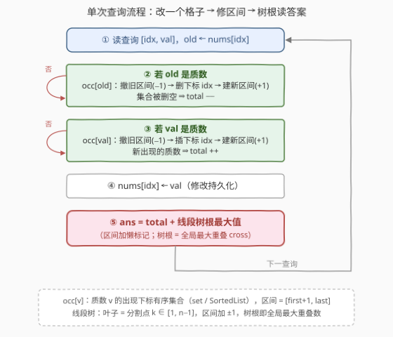

# 分割数组后不同质数的最大数目

- **题目名称**：分割数组后不同质数的最大数目
- **链接**：[3569. 分割数组后不同质数的最大数目](https://leetcode.cn/problems/maximize-count-of-distinct-primes-after-split/)
- **难度**：困难
- **标签**：线段树、数论、哈希表、有序集合

## 1. 题目概述

给定长度为 $n$ 的整数数组 `nums` 与二维数组 `queries`，其中 `queries[i] = [idx, val]`。对每个查询依次执行：

1. **修改**：令 `nums[idx] = val`（修改持久化，影响后续所有查询）；
2. **分割**：选一个整数 $k$（$1 \le k < n$），把数组切成非空前缀 $\text{nums}[0..k-1]$ 与后缀 $\text{nums}[k..n-1]$，使**两半各自包含的不同质数个数之和最大**。

返回每个查询的答案构成的数组。

**示例 1**：

```text
输入：nums = [2,1,3,1,2], queries = [[1,2],[3,3]]
输出：[3,4]
解释：
查询 1 后 nums = [2,2,3,1,2]，取 k=1 分成 [2] 与 [2,3,1,2]，1 + 2 = 3；
查询 2 后 nums = [2,2,3,3,2]，取 k=3 分成 [2,2,3] 与 [3,2]，2 + 2 = 4。
```

**示例 2**：

```text
输入：nums = [2,1,4], queries = [[0,1]]
输出：[0]
解释：查询后 nums = [1,1,4]，数组中没有任何质数，答案为 0。
```

**约束条件**：

- $2 \le n \le 5 \times 10^4$，$1 \le \text{queries.length} \le 5 \times 10^4$
- $1 \le \text{nums}[i],\ val \le 10^5$，$0 \le idx < n$

> 💡 **读题关键**：① 「不同质数」**按值去重**——$2$ 出现三次也只算一种，所以答案只与「每个质数值出现在哪些下标」有关，与出现次数无关；② 每次查询是「先改一个格子，再全局选最优分割点」的**在线动态问题**，$n, q$ 都是 $5 \times 10^4$ 量级，必须把单次查询压到 $O(\log n)$。

---

## 2. 解题思路

### 2.1 暴力思路

每个查询后枚举所有 $k \in [1, n-1]$，对每个 $k$ 分别统计两半的不同质数个数。用「last-seen 哈希 + 一遍扫描」可以把单次查询压到 $O(n)$（前缀、后缀各扫一遍），但总计 $O(nq) = 2.5 \times 10^9$ 仍然超时——而且每次修改都让所有前缀统计失效，无法增量维护。

暴力揭示了两个关键结构：

1. 答案只依赖每个质数值 $p$ 的**出现位置集合**（其实只依赖 $first(p)$ 与 $last(p)$）；
2. 答案是 $\max_k$ 的形式——若能把「每个 $k$ 的得分」维护成支持快速修改的数据结构，每次查询就是读一个最值。

### 2.2 核心观察：答案 = 全局质数种数 +「跨界质数」的最大重叠数

![核心观察：跨界质数对应区间 [first+1, last]，答案 = total + 最大重叠数](../images/p3569_split_overlap_concept.svg)

**观察一：按质数值拆解贡献。**

固定分割点 $k$，记前缀、后缀的不同质数集合为 $L(k), R(k)$，则答案为 $|L(k)| + |R(k)|$。逐个质数值 $p$ 看它对答案的贡献，只有三档：

| $p$ 的出现情况 | 对 $|L(k)| + |R(k)|$ 的贡献 |
|---|---|
| 整个数组都没有 $p$ | $0$ |
| $p$ 只出现在一侧 | $1$ |
| $p$ 两侧都出现（**跨界**） | $2$（被左右各数一次） |

设 $\text{total}$ 为当前整个数组的不同质数种数，$\text{cross}(k)$ 为跨界质数个数，由容斥 $|L| + |R| = |L \cup R| + |L \cap R|$ 且 $L \cup R$ 恰为全局质数集合，得

$$
\text{answer}(k) = \text{total} + \text{cross}(k)
$$

**观察二：跨界条件天然是「区间」。**

$p$ 跨界 $\iff$ 前缀中至少有一个 $p$ **且** 后缀中至少有一个 $p$ $\iff first(p) < k \le last(p)$。于是每个**出现至少两次**的质数 $p$ 都贡献一条关于 $k$ 的区间

$$
I_p = [\,first(p)+1,\ last(p)\,] \subseteq [1,\, n-1],
$$

而 $\text{cross}(k)$ 就是**覆盖 $k$ 的区间条数**。所求化为经典模型：

$$
\max_{1 \le k \le n-1} \text{answer}(k) = \text{total} + \max_{1 \le k \le n-1} \text{cross}(k)
$$

**观察三：区间加 + 全局最大值 → 懒标记线段树。**

给每个 $I_p$ 做「区间 $+1$」，问全局最大重叠数——这是「区间修改 + 区间最值」的招牌场景（与 [732. 我的日程安排表 III](https://leetcode.cn/problems/my-calendar-iii/) 同款）。线段树下标 $1 \sim n-1$ 即分割点 $k$；由于查询永远取全局，**树根的最大值就是答案**，连区间查询都不用写。

> ⚠️ 注意 $I_p$ 非空且落在界内：$|occ(p)| \ge 2$ 时 $first < last$，故 $first+1 \le last$；又 $last \le n-1$、$first + 1 \ge 1$，天然包含于 $[1, n-1]$。只出现一次的质数没有区间，只贡献 $\text{total}$。

### 2.3 算法流程图



**静态结构**：

- 埃氏筛预处理 $\le 10^5$ 的质数表，$O(1)$ 判定；
- 有序集合 $occ[v]$：质数值 $v$ 的全部出现下标（C++ `set<int>` / Python `SortedList`）；
- 线段树：叶子为分割点 $k \in [1, n-1]$，维护区间加 + 区间 max（懒标记）。

**初始化**：按初始 `nums` 建好所有 $occ[v]$；每个 $|occ[v]| \ge 2$ 的质数对区间 $[first+1, last]$ 整体 $+1$；$\text{total} = $ 非空集合个数。

**单次查询 $[idx, val]$**（记 $old = \text{nums}[idx]$，$old \ne val$ 时才有结构变化）：

1. 若 $old$ 是质数：对 $occ[old]$ 的旧区间 $-1$，删除下标 $idx$，再对新区间 $+1$；若集合被删空，$\text{total} \mathrel{-}= 1$；
2. 若 $val$ 是质数：对 $occ[val]$ 的旧区间 $-1$，插入下标 $idx$，再对新区间 $+1$；若是新出现的质数，$\text{total} \mathrel{+}= 1$；
3. 令 $\text{nums}[idx] = val$，答案 $= \text{total} + $ 线段树根的最大值。

> 💡 **「先撤后建」而非精细 diff**：区间只由集合的 $first/last$ 决定，删除中间下标时区间其实不变，但代码无需分类讨论端点变化——先按旧集合撤、再按新集合建，两次操作自然抵消差量。每次查询至多 4 次区间加 + 一次根读取，全部 $O(\log n)$。

### 2.4 示例演算

以示例 1 演算（$n = 5$，分割点 $k \in \{1,2,3,4\}$，$\text{total}$ 与区间随查询演变）：

| 时刻 | nums | occ[2] | occ[3] | active 区间 | total | cross(k) k=1..4 | 答案 |
|------|------|--------|--------|-------------|-------|-----------------|------|
| 初始 | [2,1,3,1,2] | {0,4} | {2} | 2:[1,4] | 2 | 1,1,1,1 | — |
| 查询 1 [1,2] | [2,2,3,1,2] | {0,1,4} | {2} | 2:[1,4]（撤了又建，净零） | 2 | 1,1,1,1 | $2+1=\mathbf{3}$ ✓ |
| 查询 2 [3,3] | [2,2,3,3,2] | {0,1,4} | {2,3} | 2:[1,4]，3:[3,3] | 2 | 1,1,**2**,1 | $2+2=\mathbf{4}$ ✓ |

查询 2 中 $k=3$ 处两条区间重叠：分割 $[2,2,3] \mid [3,2]$，左 $\{2,3\}$、右 $\{3,2\}$，$2 + 2 = 4$，与表格一致。

---

## 3. 参考代码

### C++

```cpp
class Solution {
    int m;                                   // 分割点 k ∈ [1, n-1]
    vector<int> mx, lz;                      // 区间加 + 区间 max（懒标记）

    void apply(int p, int v) { mx[p] += v; lz[p] += v; }
    void push_up(int p) { mx[p] = max(mx[p << 1], mx[p << 1 | 1]); }
    void push_down(int p) {
        if (lz[p]) { apply(p << 1, lz[p]); apply(p << 1 | 1, lz[p]); lz[p] = 0; }
    }
    void add(int p, int l, int r, int ql, int qr, int v) {
        if (ql <= l && r <= qr) { apply(p, v); return; }
        push_down(p);
        int mid = (l + r) >> 1;
        if (ql <= mid) add(p << 1, l, mid, ql, qr, v);
        if (qr > mid) add(p << 1 | 1, mid + 1, r, ql, qr, v);
        push_up(p);
    }

    unordered_map<int, set<int>> occ;        // 质数值 -> 出现下标有序集合
    vector<char> isP;

    void rebuild(const set<int>& s, int delta) {   // |s| ≥ 2 时维护区间 [first+1, last]
        if (s.size() >= 2) add(1, 1, m, *s.begin() + 1, *s.rbegin(), delta);
    }
    void eraseOcc(int v, int i) {
        auto& s = occ[v];
        rebuild(s, -1);
        s.erase(i);
        rebuild(s, +1);
        if (s.empty()) occ.erase(v);
    }
    void insertOcc(int v, int i) {
        auto& s = occ[v];
        rebuild(s, -1);
        s.insert(i);
        rebuild(s, +1);
    }

  public:
    vector<int> maximumCount(vector<int>& nums, vector<vector<int>>& queries) {
        int n = nums.size();
        m = n - 1;
        int V = 100000;
        isP.assign(V + 1, 1);
        isP[0] = isP[1] = 0;
        for (int i = 2; i * i <= V; ++i)
            if (isP[i])
                for (int j = i * i; j <= V; j += i) isP[j] = 0;

        mx.assign(4 * m + 4, 0);
        lz.assign(4 * m + 4, 0);

        for (int i = 0; i < n; ++i)
            if (isP[nums[i]]) occ[nums[i]].insert(i);
        for (auto& [v, s] : occ) rebuild(s, +1);

        int total = occ.size();
        vector<int> ans;
        for (auto& q : queries) {
            int i = q[0], val = q[1], old = nums[i];
            if (old != val) {
                if (isP[old]) {
                    eraseOcc(old, i);
                    if (!occ.count(old)) total--;
                }
                if (isP[val]) {
                    bool fresh = !occ.count(val);
                    insertOcc(val, i);
                    if (fresh) total++;
                }
            }
            nums[i] = val;
            ans.push_back(total + mx[1]);    // 根节点 = 全局最大重叠数
        }
        return ans;
    }
};
```

### Python

```python
from collections import defaultdict
from sortedcontainers import SortedList


class Solution:
    def maximumCount(self, nums: List[int], queries: List[List[int]]) -> List[int]:
        n = len(nums)
        m = n - 1                                    # 分割点 k ∈ [1, n-1]

        V = 100000                                   # 值域上限
        isp = bytearray([1]) * (V + 1)               # 埃氏筛：O(1) 判质数
        isp[0] = isp[1] = 0
        for i in range(2, int(V ** 0.5) + 1):
            if isp[i]:
                isp[i * i::i] = bytearray((V - i * i) // i + 1)

        # 迭代式线段树：区间加 + 全局最大值；t[1] 恒为当前全局最大重叠数
        size = 1
        while size < m:
            size <<= 1
        t = [0] * (2 * size)                         # 子树最大值（含自身懒标记）
        d = [0] * size                               # 内部节点懒标记

        def apply_(x, v):
            t[x] += v
            if x < size:
                d[x] += v

        def build(x):                                # 自底向上重算 x 的祖先
            x >>= 1
            while x:
                t[x] = max(t[2 * x], t[2 * x + 1]) + d[x]
                x >>= 1

        def update(l, r, v):                         # [l, r] 闭区间（0 起下标）
            l0, r0 = l + size, r + size + 1
            l, r = l0, r0
            while l < r:
                if l & 1:
                    apply_(l, v); l += 1
                if r & 1:
                    r -= 1; apply_(r, v)
                l >>= 1; r >>= 1
            build(l0); build(r0 - 1)

        occ = defaultdict(SortedList)                # 质数值 -> 出现下标有序集合
        for i, v in enumerate(nums):
            if isp[v]:
                occ[v].add(i)
        total = len(occ)

        def rebuild(s, delta):                       # |s| ≥ 2 才有区间
            if len(s) >= 2:
                update(s[0], s[-1] - 1, delta)       # k∈[first+1,last] -> 0 起下标

        for s in occ.values():
            rebuild(s, 1)

        ans = []
        for i, val in queries:
            old = nums[i]
            if old != val:
                if isp[old]:                         # 下标 i 从 old 的集合移除
                    s = occ[old]
                    rebuild(s, -1)
                    s.remove(i)
                    rebuild(s, 1)
                    if not s:
                        del occ[old]
                        total -= 1
                if isp[val]:                         # 下标 i 加入 val 的集合
                    if val in occ:
                        s = occ[val]
                        rebuild(s, -1)
                        s.add(i)
                        rebuild(s, 1)
                    else:
                        occ[val].add(i)
                        total += 1
            nums[i] = val
            ans.append(total + t[1])                 # 根节点 = 全局最大重叠
        return ans
```

> 💡 **实现细节**：① Python 用迭代式线段树避免递归开销，且「区间加 + 只读树根」无需 pushdown——`t[x]` 存子树最大值（含自身懒标记），修改后 `build` 沿边界路径自底向上重算即可；② C++ 版 `apply` 同步更新 `mx` 与 `lz`，树根 `mx[1]` 恒为全局最大；③ `bytearray` 切片赋值做筛法，比逐点循环快一个量级；④ 力扣 Python 环境预装 `sortedcontainers`，`SortedList` 的首尾读取 `s[0] / s[-1]` 为 $O(\log n)$。

---

## 4. 复杂度分析

| 维度 | 复杂度 | 说明 |
|------|--------|------|
| 时间 | $O(V \log\log V + (n+q)\log n)$ | 埃氏筛 $V = 10^5$；初始化 $n$ 次有序集合插入；每个查询至多 4 次区间加 + 2 次集合增删 + 1 次根读取，均为 $O(\log n)$ |
| 空间 | $O(V + n)$ | 筛表 $O(V)$；所有 $occ$ 集合合计 $n$ 个下标；线段树 $O(n)$；$\text{total} \le$ 不同质数数 $\le n$，计数用 `int` 即可 |

---

## 5. 扩展：这条「值 → 下标集合 → 区间 → 线段树」流水线

本题的维护范式值得提炼：单点改值 `nums[idx] = val` 本身与区间无关，但把它翻译成「值 $v$ 的下标集合的增删」，再翻译成「区间 $[first+1, last]$ 的撤销与重建」，就让线段树接住了。[3161. 物块放置查询](https://leetcode.cn/problems/block-placement-queries/) 的「有序集合找邻居 + 区间加」是同族套路。

两个自然变体：

- **要输出达到最大值的分割点 $k$（方案）**：从树根出发下钻——先把根到叶路径上的懒标记下传，每层走向 $\max$ 较大的儿子，$O(\log n)$ 定位一个最优 $k$。
- **重叠数相同的处理**：多条区间同时在最大值处重叠时，任意一个被最大覆盖的 $k$ 都对应一种最优分割；若题目改成「最小化两半不同质数之差」之类的非对称目标，贡献拆解就不再成立，需回到对 $L(k), R(k)$ 的直接维护。

---

## 6. 面试要点

- **Q1：为什么 $\text{answer}(k) = \text{total} + \text{cross}(k)$？**
  答：按质数值拆贡献，每个 $p$ 对 $|L(k)| + |R(k)|$ 贡献 $0/1/2$ 三档；$\text{total}$ 让每个出现的 $p$ 各记一次，$\text{cross}(k)$ 给跨界者再补一次。形式化即容斥：$|L| + |R| = |L \cup R| + |L \cap R|$，而 $L \cup R$ 恰是全局质数集合。
- **Q2：跨界条件为什么是 $first(p) < k \le last(p)$？**
  答：$p$ 进前缀 $\iff$ 存在出现下标 $< k \iff first(p) < k$；进后缀 $\iff$ 存在出现下标 $\ge k \iff last(p) \ge k$。两条件同时成立即 $k \in (first, last]$，是一条关于 $k$ 的闭区间，与 $k$ 的取值域 $[1, n-1]$ 天然相容。
- **Q3：单点修改如何影响区间？为什么「先撤后建」是安全的？**
  答：区间只由集合的 min/max 决定，删/插一个下标至多改变一端（删中间元素区间不变）。「先按旧集合 −1、再按新集合 +1」的净效应恰等于真实差量，无需分类讨论端点变化；代价是每次查询至多 4 次区间加，复杂度仍是 $O(\log n)$。
- **Q4：为什么答案直接读树根，不用 pushdown？**
  答：懒标记线段树中 `apply` 时同步更新节点自身的 max，因此任何时刻 `mx[根]` 就是含全部未下传标记的全局最大值；只有需要访问**子节点内部**（真区间查询/修改）时才必须 pushdown。本题查询永远取全局，根即答案。Python 迭代版同理，`t[1]` 恒有效。
- **Q5：有序集合可以换成什么？**
  答：需要的是「插入 / 删除 / 取 min / 取 max」各 $O(\log n)$：C++ `std::set` 用 `begin()/rbegin()` 一次拿到两端最直接；Python 用 `SortedList`；也可用大根 + 小根两个懒删除堆维护动态最值，均摊同阶。普通排序数组插入删除是 $O(n)$，不可用。

---

## 7. 同类练习题

- [732. 我的日程安排表 III](https://leetcode.cn/problems/my-calendar-iii/)：区间加 + 查全局最大值的裸版，本题线段树的最纯形态
- [3161. 物块放置查询](https://leetcode.cn/problems/block-placement-queries/)：有序集合定位邻居 + 线段树区间加区间 max 的同款组合
- [715. Range 模块](https://leetcode.cn/problems/range-module/)：区间赋值 / 查询的线段树模板，巩固懒标记语义
- [218. 天际线问题](https://leetcode.cn/problems/the-skyline-problem/)：「最大重叠区间」的扫描线经典（离线版），对照本题的在线版
- [1109. 航班预订统计](https://leetcode.cn/problems/corporate-flight-bookings/)：区间加 + 单点查的差分入门，体会为什么本题「带修改 + 查最值」必须上懒标记线段树
