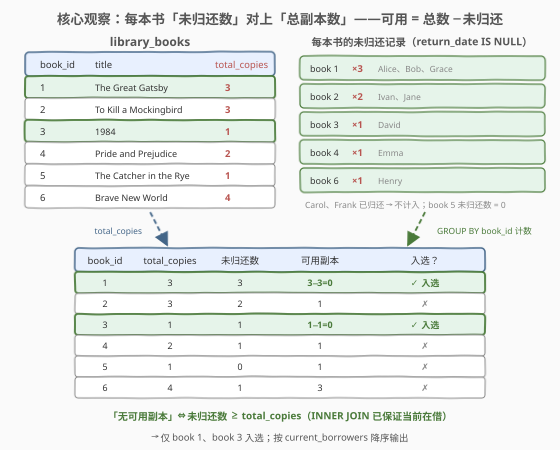
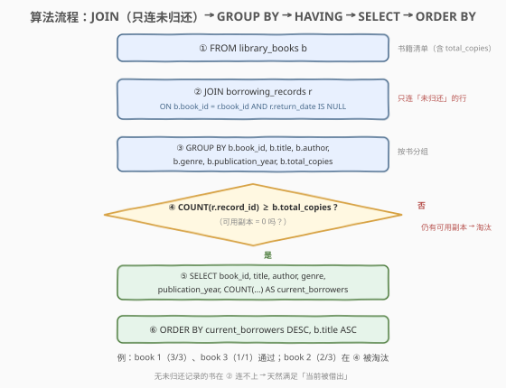

# 查找无可用副本的书籍

- **题目名称**：查找无可用副本的书籍
- **链接**：[3570. 查找无可用副本的书籍](https://leetcode.cn/problems/find-books-with-no-available-copies/)
- **难度**：简单
- **标签**：SQL、数据库、JOIN、GROUP BY、HAVING、聚合、`IS NULL`、双键排序

## 1. 题目概述

图书馆有两张表：`library_books` 记录馆藏书目（每本书的**总副本数**），`borrowing_records` 记录借阅交易（`return_date` 为 `NULL` 表示该书**当前被借出且尚未归还**）。编写 SQL 查询，找出**所有当前被借出（未归还）且馆藏已无可用副本**的书籍，返回书籍的五个信息列外加当前借阅者数量 `current_borrowers`，按 `current_borrowers` **降序**、书名 `title` **升序**排列。

**表结构**：

```text
表: library_books
+------------------+---------+
| Column Name      | Type    |
+------------------+---------+
| book_id          | int     |   ← 主键
| title            | varchar |
| author           | varchar |
| genre            | varchar |
| publication_year | int     |
| total_copies     | int     |   ← 馆藏总副本数
+------------------+---------+
book_id 是这张表的唯一主键。
每一行包含图书馆中一本书的信息，包括图书馆拥有的副本总数。

表: borrowing_records
+---------------+---------+
| Column Name   | Type    |
+---------------+---------+
| record_id     | int     |   ← 主键
| book_id       | int     |   ← 指向 library_books.book_id
| borrower_name | varchar |
| borrow_date   | date    |
| return_date   | date    |   ← NULL = 当前借出未归还
+---------------+---------+
record_id 是这张表的唯一主键。
每一行代表一笔借阅交易；如果这本书目前被借出且未归还，return_date 为 NULL。
```

> 💡 **关键语义**：一本书「当前被借出」⇔ 存在一条 `return_date IS NULL` 的借阅记录；「无可用副本」⇔ 可用副本数 $= \text{total\_copies} - \text{当前借阅者数}$ 为 $0$。**两个条件要同时成立**。

**示例 1**：

```text
输入：
library_books 表:
+---------+------------------------+------------------+-----------+------------------+--------------+
| book_id | title                  | author           | genre     | publication_year | total_copies |
+---------+------------------------+------------------+-----------+------------------+--------------+
| 1       | The Great Gatsby       | F. Scott         | Fiction   | 1925             | 3            |
| 2       | To Kill a Mockingbird  | Harper Lee       | Fiction   | 1960             | 3            |
| 3       | 1984                   | George Orwell    | Dystopian | 1949             | 1            |
| 4       | Pride and Prejudice    | Jane Austen      | Romance   | 1813             | 2            |
| 5       | The Catcher in the Rye | J.D. Salinger    | Fiction   | 1951             | 1            |
| 6       | Brave New World        | Aldous Huxley    | Dystopian | 1932             | 4            |
+---------+------------------------+------------------+-----------+------------------+--------------+

borrowing_records 表:
+-----------+---------+---------------+-------------+-------------+
| record_id | book_id | borrower_name | borrow_date | return_date |
+-----------+---------+---------------+-------------+-------------+
| 1         | 1       | Alice Smith   | 2024-01-15  | null        |   ← 未归还
| 2         | 1       | Bob Johnson   | 2024-01-20  | null        |   ← 未归还
| 3         | 2       | Carol White   | 2024-01-10  | 2024-01-25  |   ← 已归还
| 4         | 3       | David Brown   | 2024-02-01  | null        |   ← 未归还
| 5         | 4       | Emma Wilson   | 2024-01-05  | null        |   ← 未归还
| 6         | 5       | Frank Davis   | 2024-01-18  | 2024-02-10  |   ← 已归还
| 7         | 1       | Grace Miller  | 2024-02-05  | null        |   ← 未归还
| 8         | 6       | Henry Taylor  | 2024-01-12  | null        |   ← 未归还
| 9         | 2       | Ivan Clark    | 2024-02-12  | null        |   ← 未归还
| 10        | 2       | Jane Adams    | 2024-02-15  | null        |   ← 未归还
+-----------+---------+---------------+-------------+-------------+

输出：
+---------+------------------+---------------+-----------+------------------+-------------------+
| book_id | title            | author        | genre     | publication_year | current_borrowers |
+---------+------------------+---------------+-----------+------------------+-------------------+
| 1       | The Great Gatsby | F. Scott      | Fiction   | 1925             | 3                 |
| 3       | 1984             | George Orwell | Dystopian | 1949             | 1                 |
+---------+------------------+---------------+-----------+------------------+-------------------+
```

**解释**：

| 书 | total_copies | 当前借阅者 | 可用副本 | 判定 |
|----|--------------|-----------|----------|------|
| 1 The Great Gatsby | 3 | Alice、Bob、Grace（3 人） | $3-3=0$ | ✓ 入选（借阅者最多，排第一） |
| 2 To Kill a Mockingbird | 3 | Ivan、Jane（2 人；Carol 已还） | $3-2=1$ | ✗ |
| 3 1984 | 1 | David（1 人） | $1-1=0$ | ✓ 入选（排第二） |
| 4 Pride and Prejudice | 2 | Emma（1 人） | $2-1=1$ | ✗ |
| 5 The Catcher in the Rye | 1 | 无（Frank 已还） | $1-0=1$ | ✗ |
| 6 Brave New World | 4 | Henry（1 人） | $4-1=3$ | ✗ |

**约束条件**：

- `book_id`、`record_id` 分别是两表主键；`borrowing_records.book_id` 指向 `library_books.book_id`
- `return_date` 为 `NULL` 表示未归还，非 `NULL` 表示已归还
- 结果按 `current_borrowers` **降序**、`title` **升序**排序

> 💡 **读题关键**：① 「当前借阅者数」= 每本书 `return_date IS NULL` 的记录条数——分组计数；② 「无可用副本」= 计数追平 `total_copies`——组级条件，天然属于 `HAVING`；③ 「当前被借出」= 计数 $\ge 1$——用 **INNER JOIN** 顺手就解决了。三个条件各归其位，题目就解完了。

---

## 2. 解题思路

### 2.1 暴力思路：逐本书人工对账

过程式直觉：对 `library_books` 里每本书，遍历 `borrowing_records` 数出 `book_id` 相同且 `return_date IS NULL` 的行数 $c$；若 $c \ge 1$（当前在借）且 $\text{total\_copies} - c \le 0$（没有可用副本），就把它连同 $c$ 一起输出，最后按 $c$ 降序、书名升序排。

```text
for each book b in library_books:
    c = count(rows r in borrowing_records
              where r.book_id = b.book_id and r.return_date is NULL)
    if c >= 1 and b.total_copies - c <= 0:
        output(b, c)
sort output by c desc, title asc
```

- **正确性**：与题意一一对应，没有遗漏。
- **效率**：双重循环 $O(n \cdot m)$（$n$ 书数、$m$ 记录数）；且纯 SQL 没有显式循环——「按 `book_id` 分桶、桶内计数、按计数与 `total_copies` 的关系筛组」的模式要翻译成 `JOIN` + `GROUP BY` + `HAVING`。

> ⚠️ 瓶颈不在效率而在**表达方式**：把三个业务条件（数未归还、当前在借、可用为 0）各自映射到正确的 SQL 子句，是本题唯一的考点。

### 2.2 核心观察：把「无可用副本」翻译成 HAVING 计数不等式



**核心等式**：

$$\text{可用副本} = \text{total\_copies} - \text{current\_borrowers}$$

于是三个业务条件全部翻译成 SQL：

| 业务语言 | SQL 语言 |
|----------|----------|
| 每本书的当前借阅者数 | `COUNT(r.record_id)`（按 `book_id` 分组后） |
| 只统计未归还的记录 | JOIN 条件 `r.return_date IS NULL` |
| 当前被借出（至少一条未归还记录） | **INNER JOIN** 天然排除没有任何未归还记录的书 |
| 无可用副本 | `HAVING COUNT(r.record_id) >= b.total_copies` |

> 💡 **为什么用 `>=` 而不是 `=`？** 正常数据下未归还数不会超过总副本数（借不出去不存在的副本），`=` 与 `>=` 等价；但若数据异常（未归还记录数超过馆藏），`>=` 依然正确表达「没有可用副本」。用 `>=` 更稳。
>
> ⚠️ **`r.return_date IS NULL` 要写在 ON 里**：它是**连接条件**（决定哪些借阅行有资格参与连接），不是事后过滤。INNER JOIN 下放 ON 与放 WHERE 等价；但若改用 LEFT JOIN，位置不同结果就不同——详见 5.1 节的陷阱分析。

### 2.3 算法流程图



**逻辑执行顺序**：

| 阶段 | 子句 | 作用 |
|------|------|------|
| ① | `FROM library_books b` | 确定左表：书籍清单（含 `total_copies`） |
| ② | `JOIN borrowing_records r ON b.book_id = r.book_id AND r.return_date IS NULL` | 只连「未归还」的借阅行；无未归还记录的书直接出局 |
| ③ | `GROUP BY b.book_id, b.title, ...` | 按书分组，每组 = 一本书的所有未归还记录 |
| ④ | `HAVING COUNT(r.record_id) >= b.total_copies` | 组级过滤：可用副本 $\le 0$ 的书留下 |
| ⑤ | `SELECT ... COUNT(...) AS current_borrowers` | 产出五个书籍列 + 当前借阅者数 |
| ⑥ | `ORDER BY current_borrowers DESC, b.title ASC` | 双键排序收尾 |

> 💡 **逻辑执行顺序**：`FROM → ON → JOIN → WHERE → GROUP BY → HAVING → SELECT → ORDER BY`。`HAVING` 在 `GROUP BY` 之后、`SELECT` 之前——可以直接用聚合函数（分组已完成），但不能用 `SELECT` 里定义的别名。「可用副本 $\le 0$」是对**每本书分组**的统计值做判断，属于组级条件，必须 `HAVING` 而非 `WHERE`。

### 2.4 示例演算

以示例数据走一遍「连接 → 分组 → 过滤 → 排序」链路（$c$ = 未归还记录数）：

| book_id | title | total_copies | $c$（未归还） | 可用 = total − $c$ | 判定 |
|---------|-------|--------------|---------------|---------------------|------|
| 1 | The Great Gatsby | 3 | 3（Alice、Bob、Grace） | **0** | ✓ $3 \ge 3$ 入选 |
| 2 | To Kill a Mockingbird | 3 | 2（Ivan、Jane；Carol 已还） | 1 | ✗ $2 < 3$ 淘汰 |
| 3 | 1984 | 1 | 1（David） | **0** | ✓ $1 \ge 1$ 入选 |
| 4 | Pride and Prejudice | 2 | 1（Emma） | 1 | ✗ 淘汰 |
| 5 | The Catcher in the Rye | 1 | 0（Frank 已还） | 1 | ✗ ② 阶段即出局（连不上任何未归还行） |
| 6 | Brave New World | 4 | 1（Henry） | 3 | ✗ 淘汰 |

- **② 阶段（JOIN）**：book 5 唯一的记录已归还，`return_date IS NULL` 连不上 → 不产生任何行，直接出局——「当前被借出」条件由此隐式满足；
- **④ 阶段（HAVING）**：book 1（$3 \ge 3$）与 book 3（$1 \ge 1$）通过，其余淘汰；
- **⑥ 阶段（ORDER BY）**：book 1 借阅者 3 人 > book 3 借阅者 1 人 → 降序输出 book 1 在前。与预期输出一致。

---

## 3. 参考代码

### SQL（解法 A：INNER JOIN + GROUP BY + HAVING，推荐）

```sql
SELECT b.book_id,
       b.title,
       b.author,
       b.genre,
       b.publication_year,
       COUNT(r.record_id) AS current_borrowers
FROM library_books b
JOIN borrowing_records r
  ON b.book_id = r.book_id
 AND r.return_date IS NULL
GROUP BY b.book_id, b.title, b.author, b.genre, b.publication_year, b.total_copies
HAVING COUNT(r.record_id) >= b.total_copies
ORDER BY current_borrowers DESC, b.title ASC;
```

> 💡 **写法要点**：
> - `AND r.return_date IS NULL` 写在 **ON** 里：连接时就只保留未归还的借阅行，使 `COUNT` 直接数出「当前借阅者数」。
> - **INNER JOIN 兼职「当前被借出」过滤**：没有任何未归还记录的书（如示例的 book 5）连接不上任何行、根本不进组——无需手写 `COUNT >= 1`。
> - `HAVING COUNT(r.record_id) >= b.total_copies`：组级条件「可用副本 $\le 0$」。`COUNT(r.record_id)` 只统计 `record_id` 非 NULL 的行——INNER JOIN 后不存在 NULL 扩展行，它等价于 `COUNT(*)`，但语义上更能表达「数的是借阅记录条数」。
> - `GROUP BY` 末尾带上 `b.total_copies`：因为 HAVING 引用了它，一并分组最稳妥、跨数据库通用。事实上 `b.book_id` 是 `library_books` 的主键，`total_copies` 函数依赖于它，MySQL 在 `ONLY_FULL_GROUP_BY` 模式下允许省略。
> - `ORDER BY current_borrowers DESC, b.title ASC`：`ORDER BY` 在 `SELECT` 之后执行，可以直接引用列别名 `current_borrowers`；双键排序与题面一一对应。

### SQL（解法 B：LEFT JOIN + 双条件，展示 ON/WHERE 的位置差异）

```sql
SELECT b.book_id,
       b.title,
       b.author,
       b.genre,
       b.publication_year,
       COUNT(r.record_id) AS current_borrowers
FROM library_books b
LEFT JOIN borrowing_records r
  ON b.book_id = r.book_id
 AND r.return_date IS NULL
GROUP BY b.book_id, b.title, b.author, b.genre, b.publication_year, b.total_copies
HAVING COUNT(r.record_id) >= 1
   AND COUNT(r.record_id) >= b.total_copies
ORDER BY current_borrowers DESC, b.title ASC;
```

> 💡 **与解法 A 的差异**：LEFT JOIN 让**所有书**都进组（无未归还记录的书计 0），因此必须显式补 `COUNT(r.record_id) >= 1` 表达「当前被借出」——否则一本 `total_copies = 0` 且无人借阅的书会因 $0 \ge 0$ 误入结果。注意 `r.return_date IS NULL` **必须留在 ON 中**：挪到 WHERE 语义就变了（见 5.1 节）。本题更推荐解法 A——INNER JOIN 免去额外条件，语义也更贴题。

### Python（pandas）

```python
import pandas as pd

def find_books_with_no_available_copies(library_books: pd.DataFrame,
                                        borrowing_records: pd.DataFrame) -> pd.DataFrame:
    active = borrowing_records[borrowing_records['return_date'].isna()]
    cnt = active.groupby('book_id').size().reset_index(name='current_borrowers')
    df = library_books.merge(cnt, on='book_id', how='inner')
    ans = df[df['current_borrowers'] >= df['total_copies']]
    ans = ans.sort_values(['current_borrowers', 'title'], ascending=[False, True])
    return ans[['book_id', 'title', 'author', 'genre', 'publication_year',
                'current_borrowers']].reset_index(drop=True)
```

> 💡 **pandas 对照**：
> - `borrowing_records['return_date'].isna()` 对应 `WHERE return_date IS NULL`——pandas 里 NULL 是 `None`/`NaT`，**必须用 `isna()` 判断**，写 `== None` 会得到全 False 的掩码；
> - `groupby('book_id').size()` 对应 `GROUP BY book_id` + `COUNT(*)`；
> - `merge(..., how='inner')` 对应 INNER JOIN——无未归还记录的书自动出局，「当前被借出」隐式满足；
> - 布尔筛选 `df['current_borrowers'] >= df['total_copies']` 对应 `HAVING`；
> - `sort_values(..., ascending=[False, True])` 一行实现「借阅者降序 + 书名升序」双键排序。

---

## 4. 复杂度分析

设 $n$ = `library_books` 行数，$m$ = `borrowing_records` 行数，$k$ = 结果行数（无可用副本的书数）。

| 维度 | 复杂度 | 说明 |
|------|--------|------|
| **时间** | $O(n + m + k \log k)$ ~ $O((n+m)\log(n+m))$ | JOIN 借 `book_id` 哈希/索引近似线性；GROUP BY 分组线性；排序只作用于结果集 $k$ 行 |
| **空间** | $O(n + m)$ | JOIN 与分组的中间结果集 |
| **中间行数** | $\le m_{\text{active}}$ | 连接后行数 = 未归还记录数（每条未归还记录恰好连上一本书） |
| **是否需排序** | 是 | `ORDER BY current_borrowers DESC, b.title ASC` |

> ⚠️ SQL 复杂度取决于**执行计划**：`borrowing_records.book_id` 有索引时 JOIN 走索引嵌套循环或 Hash Join 近似线性；无索引则需排序/建哈希，多一个 $\log$ 因子。`GROUP BY book_id` 在有索引时可走有序扫描。面试中说清「JOIN + 分组各扫一遍数据、排序只作用于结果集」即可。

---

## 5. 扩展

### 5.1 ON vs WHERE：LEFT JOIN 下的位置之争

`r.return_date IS NULL` 放 ON 还是 WHERE？

- **INNER JOIN 下两者等价**——无论放哪，语义都是「未归还的行才参与/保留」，优化器会生成相同计划。
- **LEFT JOIN 下差别巨大**——放 ON 是「**筛选谁能参与连接**」：无未归还记录的书保留一条 NULL 扩展行、计 0；放 WHERE 是「**连接之后再过滤**」：
  - 本题的 `IS NULL` 谓词恰好对 NULL 扩展行求值为 TRUE（无记录的书得以保留），但会把「**有借阅记录、却全部已归还**」的书整个删掉（它们的匹配行全被 WHERE 过滤，又不会生成 NULL 扩展行）——与放 ON 的语义已然不同；
  - 真正经典的退化陷阱是 `WHERE r.borrow_date > '2024-01-01'` 这类**对 NULL 求值为 UNKNOWN** 的谓词：NULL 扩展行全部被 WHERE 丢弃，LEFT JOIN 名存实亡、退化成 INNER JOIN。

> 💡 **口诀**：右表的**连接匹配条件**放 ON，**与右表无关的行级过滤**才放 WHERE。拿不准时问自己：这条 NULL 扩展行（右表全空的行）应该被这个条件留下吗？

### 5.2 `IS NULL` 判断：`= NULL` 为什么不行

`return_date = NULL` 对任何行都求值为 `UNKNOWN`（NULL 与任何值比较结果都是 UNKNOWN），`WHERE` 把 UNKNOWN 当假——一行都选不出来。判断 NULL **只能**用 `IS NULL` / `IS NOT NULL`。对应到 pandas 就是 `isna()` / `notna()`（NULL 在 pandas 里是 `None`/`NaN`/`NaT`）。本题若误写 `= NULL`，「未归还」一本书都数不出来，`current_borrowers` 全为 0。

### 5.3 变体：先聚合再连接（派生表写法）

「先连接后聚合」也可以倒过来——先在派生表里把每本书的未归还数算好，再连接回书表：

```sql
SELECT b.book_id, b.title, b.author, b.genre, b.publication_year,
       t.cnt AS current_borrowers
FROM library_books b
JOIN (SELECT book_id, COUNT(*) AS cnt
      FROM borrowing_records
      WHERE return_date IS NULL
      GROUP BY book_id) t
  ON t.book_id = b.book_id          -- INNER JOIN：隐含 cnt ≥ 1（当前被借出）
WHERE t.cnt >= b.total_copies       -- 无可用副本（行级条件即可，无需 HAVING）
ORDER BY current_borrowers DESC, b.title ASC;
```

> 💡 **两种范式对照**：先连接后聚合（解法 A）一次扫描完成，但分组键要列全；先聚合再连接（本写法）子查询里 `WHERE return_date IS NULL` 天然合法（此时还没有分组，行级过滤正当其位），连接后过滤条件退化为普通 `WHERE`——因为 `cnt` 已经是**普通列**而非聚合函数。聚合过的结果再筛选不需要 HAVING，这是很多初学者容易混淆的点。

---

## 6. 面试要点

**Q1：「无可用副本」怎么翻译成 SQL 条件？为什么用 HAVING 而不是 WHERE？**

> 可用副本 $= \text{total\_copies} - \text{未归还数}$，无可用副本 $\Leftrightarrow$ 未归还数 $\ge$ total_copies。这是对**每个书分组**的 `COUNT` 统计值做判断——聚合值只有分组后（`GROUP BY` 之后）才存在，`WHERE` 在分组前执行写不了聚合函数，必须 `HAVING COUNT(r.record_id) >= b.total_copies`。行级条件用 WHERE、组级条件用 HAVING。

**Q2：「当前被借出」这个条件去哪了？为什么解法 A 没有显式写？**

> 「当前被借出」$\Leftrightarrow$ 至少一条 `return_date IS NULL` 的记录 $\Leftrightarrow$ `COUNT >= 1`。INNER JOIN 本身要求书能连上至少一条未归还记录——连不上的书（如示例 book 5）根本不产生分组，条件被 JOIN **隐式满足**。若改用 LEFT JOIN，则必须显式补 `HAVING COUNT >= 1`，否则 `total_copies = 0` 且无人借阅的书会因 $0 \ge 0$ 误入。

**Q3：`r.return_date IS NULL` 为什么放 ON 而不是 WHERE？**

> INNER JOIN 下两者完全等价。LEFT JOIN 下：放 ON 是「筛选谁能参与连接」，无未归还记录的书保留 NULL 扩展行、计 0；放 WHERE 是「连接后再过滤」，本题的 `IS NULL` 会保留 NULL 扩展行、却删掉「有记录但全部已归还」的书，语义已经不同。更经典的陷阱是对 NULL 求值为 UNKNOWN 的谓词（如 `WHERE r.borrow_date > x`）：NULL 扩展行全被过滤，LEFT JOIN 退化成 INNER JOIN。原则：右表匹配条件放 ON。

**Q4：HAVING 里用了 `b.total_copies`，它不在 SELECT 列表里，合法吗？**

> 合法。`total_copies` 出现在 GROUP BY 中，是分组键之一，HAVING/SELECT 均可引用。即便不写进 GROUP BY，`b.book_id` 是 `library_books` 的**主键**、`total_copies` 函数依赖于它，MySQL 的 `ONLY_FULL_GROUP_BY` 模式也允许引用；但其他数据库（如老版本 PostgreSQL/SQL Server 的严格模式）会报错——写进 GROUP BY 最稳妥、跨库通用。

**Q5：`COUNT(r.record_id)`、`COUNT(*)`、`COUNT(r.return_date)` 有区别吗？**

> INNER JOIN 后无 NULL 扩展行，`record_id` 是右表主键恒非 NULL，故 `COUNT(r.record_id) = COUNT(*)`。但 `COUNT(r.return_date)` 数的是「return_date 非 NULL 的行」= **已归还**的记录数——恰好数反了！`COUNT(col)` 只统计该列非 NULL 的行，选错列语义全变。在 LEFT JOIN 版本里这个区别是实质性的：`COUNT(r.record_id)` 对 NULL 扩展行计 0（正确），`COUNT(*)` 会把它计 1（错误）。

> 💡 **一句话总结**：3570 是「JOIN + GROUP BY + HAVING」的基础应用题——把「无可用副本」翻译成 `HAVING COUNT(未归还记录) >= total_copies`，用 INNER JOIN 顺带表达「当前被借出」，最后 `current_borrowers DESC, title ASC` 双键排序。考点在业务条件的 SQL 翻译、`IS NULL` 判断放 ON、以及 HAVING 引用分组列的合法性。

---

## 7. 同类练习题

- [511. 游戏玩法分析 I](https://leetcode.cn/problems/game-play-analysis-i/)（[站内题解](../0501-0600/511_游戏玩法分析I.md)）：单表 `GROUP BY` + 聚合的最简母题，本题在其基础上加 JOIN 与 HAVING
- [1075. 项目员工 I](https://leetcode.cn/problems/project-employees-i/)（[站内题解](../1001-1100/1075_项目员工I.md)）：两表 JOIN + 分组计数的入门组合，与本题解法 A 骨架相同（只是没有 HAVING 阈值）
- [586. 订单最多的客户](https://leetcode.cn/problems/customer-placing-the-largest-number-of-orders/)（[站内题解](../0501-0600/586_订单最多的客户.md)）：`GROUP BY` + `COUNT` + 排序取最值，可对比本题「双键排序 + 全量输出」的排序规则差异
- [570. 至少有5名直接下属的经理](https://leetcode.cn/problems/managers-with-at-least-5-direct-reports/)（[站内题解](../0501-0600/570_至少有5名直接下属的经理.md)）：`HAVING COUNT >= 5` 常量阈值过滤；本题把阈值换成**列** `total_copies`，且多一层两表 JOIN
- [619. 只出现一次的最大数字](https://leetcode.cn/problems/biggest-single-number/)：单表 `GROUP BY` + `HAVING COUNT = 1` + 空结果处理，练习 COUNT 配 HAVING 的手感
