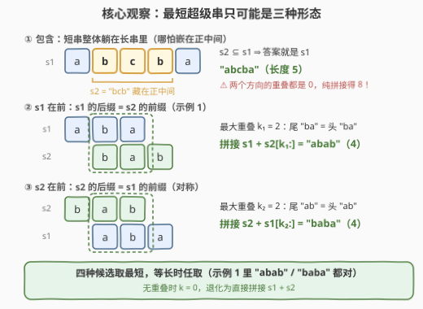
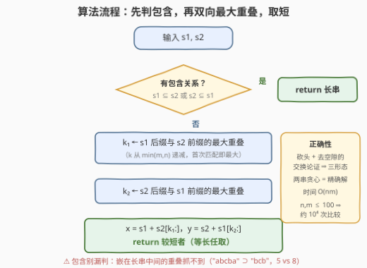

# 最短超级串 II

- **题目名称**：最短超级串 II
- **链接**：[3571. 最短超级串 II](https://leetcode.cn/problems/find-the-shortest-superstring-ii/)
- **难度**：简单
- **标签**：字符串、贪心

## 1. 题目概述

> ⚠️ 本题为 LeetCode 付费题（🔒），题意描述根据官方示例用例与外部资料重建，可能与官方题面有出入。（题面已与社区镜像 doocs/leetcode 的官方中文翻译交叉核对，示例输入输出与 GraphQL 接口返回一致，出入风险较低。）

给定**两**个字符串 `s1` 和 `s2`，返回同时包含 `s1` 和 `s2` 作为**子串**的**最短**字符串。如果有多个合法的答案，返回任意一个。

**子串**是字符串中**连续**的字符序列。

**示例 1**：

```text
输入：s1 = "aba", s2 = "bab"
输出："abab"
解释："abab" 是同时包含 "aba" 和 "bab" 作为子串的最短字符串。
```

**示例 2**：

```text
输入：s1 = "aa", s2 = "aaa"
输出："aaa"
解释："aa" 已经被包含在 "aaa" 中，所以最短超级串是 "aaa"。
```

**约束条件**：

- $1 \le s1.length \le 100$
- $1 \le s2.length \le 100$
- `s1` 和 `s2` 只包含小写英文字母

> 💡 **读题关键**：「子串」要求**连续**出现，不是子序列；「返回任意一个」意味着长度相同的不同拼接都算对，不必纠结字典序。本题是 [943. 最短超级串](../0901-1000/943_最短超级串.md)（N 个字符串的困难版，状压 DP）的**两串 Easy 缩小版**——只有两个串时，贪心取最大重叠就是精确最优，不需要任何 DP。

---

## 2. 解题思路

### 2.1 暴力思路：无脑拼接

直接返回 `s1 + s2`：它一定包含两串，永远合法，长度 $m + n$。但它通常远非最短——示例 2 会返回 `"aaaaaa"`（6）而不是 `"aaa"`（3）。想压缩长度，就得让两串**共享**一段字符：要么一个串整体被另一个包含，要么一个串的尾部与另一个串的头部咬合一截。问题变成：**共享多少，怎么共享最优？**

### 2.2 核心观察：最优解只有三种形态



设 $T$ 是任意一个最短超级串，`s1` 出现在 $T$ 的位置 $p$，`s2` 出现在位置 $q$，不妨 $p \le q$（否则交换两串角色）。记 $m = |s1|$，$n = |s2|$：

1. **$p$ 必为 0**：若 $p > 0$，把 $T$ 的前 $p$ 个字符砍掉，两串仍在（起点各左移 $p$），得到更短的合法超级串——与 $T$ 最短矛盾；
2. **$q \le m$（`s2` 不得晚于 `s1` 结束才开始）**：若 $q > m$，两串之间有一段「空隙」，删掉空隙后更短——矛盾；
3. 于是 `s2` 的区间 $[q, q+n)$ 与 `s1` 的区间 $[0, m)$ **必然搭接**，只有两种结果：
   - **搭接盖住了整个 `s2`**（$q + n \le m$）：`s2` 整体躺在 `s1` 里面——**包含关系**，$T = s1$；
   - **部分搭接**：重叠段 $[q, m)$ 上两串字符必须逐位相同，即 **`s1` 的后缀 = `s2` 的等长前缀**，$T = s1 + s2[m-q:]$；重叠越长（$q$ 越小）$T$ 越短——取**最大**重叠 $k_1$。

对称地还有 `s2` 在前的版本。结论：**候选只可能来自下表四种，逐一构造取最短**：

| 形态 | 条件 | 候选 | 长度 |
|------|------|------|------|
| 包含 | $s1 \subseteq s2$ | $s2$ | $n$ |
| 包含 | $s2 \subseteq s1$ | $s1$ | $m$ |
| s1 在前 | s1 后缀 = s2 前缀，最大重叠 $k_1$ | $s1 + s2[k_1:]$ | $m+n-k_1$ |
| s2 在前 | s2 后缀 = s1 前缀，最大重叠 $k_2$ | $s2 + s1[k_2:]$ | $m+n-k_2$ |

（$k = 0$ 时退化为直接拼接，已含在表内。）

> ⚠️ **包含必须单独检查**：「最大后缀-前缀重叠」只抓得住「短串贴在长串**两端**」的情形，抓不住「短串嵌在长串**正中间**」。反例 `s1 = "abcba"`、`s2 = "bcb"`：两个方向的重叠都是 0，拼接长度 8；但 `"bcb"` 就躺在 `"abcba"` 正中央，答案就是 `"abcba"`（长度 5）。

### 2.3 算法流程图



先判双向包含；再分别从 $k = \min(m, n)$ 递减到 1 探测两个方向的最大重叠（**首次匹配即最大**，可直接停）；构造两个候选拼接，返回较短者，等长时任取。

### 2.4 示例演算

**示例 1** `s1 = "aba"`、`s2 = "bab"`：

| 步骤 | 检查 | 结果 |
|------|------|------|
| 包含 | `"aba" ⊆ "bab"`？`"bab" ⊆ "aba"`？ | 都否 |
| s1 在前 | $k=3$: `aba`/`bab` ✗；$k=2$: `ba` = `ba` ✓ | 候选 `aba` + `b` = `"abab"`（4） |
| s2 在前 | $k=3$ ✗；$k=2$: `ab` = `ab` ✓ | 候选 `bab` + `a` = `"baba"`（4） |
| 取短 | 长度相同，任取一个 | `"abab"` ✓ |

**示例 2** `s1 = "aa"`、`s2 = "aaa"`：`"aa" ⊆ "aaa"` ✓ → 直接返回 `"aaa"`，连重叠探测都不用做。

**反例复核** `s1 = "abcba"`、`s2 = "bcb"`：包含检查命中（`"bcb"` 在下标 1 处）→ 返回 `"abcba"`（5）；若漏判包含、只做重叠，会得到长度 8 的拼接——差距 3。

---

## 3. 参考代码

### C++

```cpp
class Solution {
  public:
    string shortestSuperstring(string s1, string s2) {
        if (s1.find(s2) != string::npos) return s1;   // s2 整体已在 s1 中
        if (s2.find(s1) != string::npos) return s2;   // s1 整体已在 s2 中

        auto merge = [](const string& a, const string& b) {  // a 在前、最大重叠拼接
            int k = min(a.size(), b.size());
            while (k > 0 && a.substr(a.size() - k) != b.substr(0, k)) k--;
            return a + b.substr(k);
        };

        string x = merge(s1, s2), y = merge(s2, s1);
        return x.size() <= y.size() ? x : y;          // 等长任取（官方允许任意解）
    }
};
```

### Python

```python
class Solution:
    def shortestSuperstring(self, s1: str, s2: str) -> str:
        if s1 in s2:
            return s2                      # s1 整体已在 s2 中
        if s2 in s1:
            return s1                      # s2 整体已在 s1 中

        def merge(a: str, b: str) -> str:  # a 在前、重叠最大的拼接
            k = min(len(a), len(b))
            while k > 0 and a[-k:] != b[:k]:
                k -= 1                     # 重叠长度递减，首个匹配即最大
            return a + b[k:]

        x, y = merge(s1, s2), merge(s2, s1)
        return x if len(x) <= len(y) else y    # 等长任取（官方允许任意解）
```

---

## 4. 复杂度分析

| 维度 | 复杂度 | 说明 |
|------|--------|------|
| 时间 | $O(nm)$ | 包含检查（C++ `find` 朴素匹配）与重叠探测（$k$ 从 $\min(m,n)$ 递减、每次比较 $O(k)$，最坏如 `"aaa…a"` 全程失配）均为 $O(nm)$；$n, m \le 100$ 时至多约 $10^4$ 次字符比较 |
| 空间 | $O(n+m)$ | 仅为构造两个候选拼接的输出缓冲，无额外数据结构 |

---

## 5. 扩展：KMP 线性化与 N 个串的世界

**重叠探测的 $O(n+m)$ 做法**：求「`s1` 的最长后缀 = `s2` 的前缀」是 KMP 前缀函数的经典应用——对 `s2 + '#' + s1` 求前缀函数 $\pi$，**末尾位置的 $\pi$ 值**（分隔符保证它 $< n$）恰为最大重叠 $k_1$；方向二对称。包含检查同样可换成 KMP 匹配。本题 $n, m \le 100$ 无此必要，但数据放大后这就是标准武器（见 [1392. 最长快乐前缀](../1301-1400/1392_最长快乐前缀.md)、[214. 最短回文串](https://leetcode.cn/problems/shortest-palindrome/) 的同款套路）。

**为什么两个串贪心即精确、串一多就不行**：2.2 的论证只用了「砍头 + 去空隙」的交换论证，它本质依赖「只有两个串——搭接关系唯一」。串数 $\ge 3$ 时，多个串的咬合机会会**互相竞争**，贪心合并（每次挑节省最多的一对）不再保证最优：如 `{"bb", "cba", "aa", "bac"}`，任意贪心分支都得到长度 8，而最优解 `"bbacbaa"` 只有 7——四个串首尾咬合成一条链，贪心却可能先把链「咬断」的位置用掉。求 N 个串的最短超级串本质是 NP-hard（可归约自 TSP），[943. 最短超级串](../0901-1000/943_最短超级串.md) 把「串 $i$ 后缀匹配串 $j$ 前缀的最大重叠」当边权、用状压 DP 求精确解；工业界（如基因序列组装）则普遍用带近似比的贪心算法。

**与最短公共超序列的对照**：[1092. 最短公共超序列](../1001-1100/1092_最短公共超序列.md) 要求两串作为**子序列**（可不连续）出现，需二维 DP；本题要求**子串**（连续），贪心即最优。「连续」的约束更强，反而让最优结构简单到只有三种形态。

---

## 6. 面试要点

- **Q1：为什么两个串直接贪心最大重叠就是全局最优？**
  答：交换论证。设 $T$ 最短、`s1` 起点 $p \le$ `s2` 起点 $q$。$p>0$ 可砍头、$q>m$ 可去空隙，均与最短矛盾；故两串区间必然搭接——要么 `s2` 整体被盖住（包含），要么重叠段逐位相等（后缀-前缀匹配，重叠越大越短）。最优解只能落在这几种形态里，逐一构造取最短即精确解。
- **Q2：包含关系为什么必须单独判？最大重叠不是也能覆盖一部分吗？**
  答：后缀-前缀重叠只覆盖「短串贴在长串两端」的情形。短串嵌在长串中间（如 `"bcb"` 之于 `"abcba"`）时两个方向重叠都是 0，拼出长度 8，而答案 5。`in`/`find` 一次子串查找即可兜底。
- **Q3：多个答案时返回哪个？**
  答：官方允许返回任意一个（同 943 的风格），两方向等长时任取。若面试官追加「字典序最小」，在等长候选中取字典序小者即可——最短超级串至多只有两个（两个方向的拼接），不会漏。
- **Q4：复杂度多少？如何线性化？**
  答：朴素 $O(nm)$，本题 $n, m \le 100$ 足够。线性化：对 `s2 + '#' + s1` 求 KMP 前缀函数，末位 $\pi$ 值即最大重叠；包含检查同样 KMP，总体 $O(n+m)$。
- **Q5：和 943（N 个串）的本质区别在哪？**
  答：串数 $\ge 3$ 时「重叠搭接」在多个串之间竞争——贪心合并某一对会破坏其他串的咬合机会（`{"bb","cba","aa","bac"}` 贪心 8、最优 `"bbacbaa"` 7），精确解要把最大重叠当边权做状压 DP（TSP 型）；两个串时搭接关系唯一，交换论证直接闭合，贪心即精确解。

---

## 7. 同类练习题

- [943. 最短超级串](https://leetcode.cn/problems/find-the-shortest-superstring/)：本题的 N 串困难版，最大重叠当边权 + 状压 DP（题解见[最短超级串](../0901-1000/943_最短超级串.md)）
- [1092. 最短公共超序列](https://leetcode.cn/problems/shortest-common-supersequence/)：「子序列」版双串拼接，DP 求解，对照体会「子串（连续）⇒ 贪心 / 子序列（可断）⇒ DP」（题解见[最短公共超序列](../1001-1100/1092_最短公共超序列.md)）
- [1392. 最长快乐前缀](https://leetcode.cn/problems/longest-happy-prefix/)：KMP 前缀函数求「最长公共前后缀」，即第 5 节线性化重叠探测的核心技巧（题解见[最长快乐前缀](../1301-1400/1392_最长快乐前缀.md)）
- [28. 找出字符串中第一个匹配项的下标](https://leetcode.cn/problems/find-the-index-of-the-first-occurrence-in-a-string/)：子串查找（本题的包含检查），KMP 的标准应用场景（题解见[找出字符串中第一个匹配项的下标](../0001-0100/28_找出字符串中第一个匹配项的下标.md)）
- [214. 最短回文串](https://leetcode.cn/problems/shortest-palindrome/)：`s + '#' + rev(s)` 上求前缀函数拼「前缀 × 后缀」，与第 5 节线性化套路同宗
