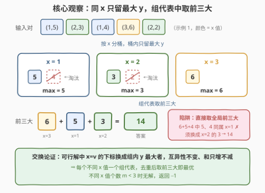
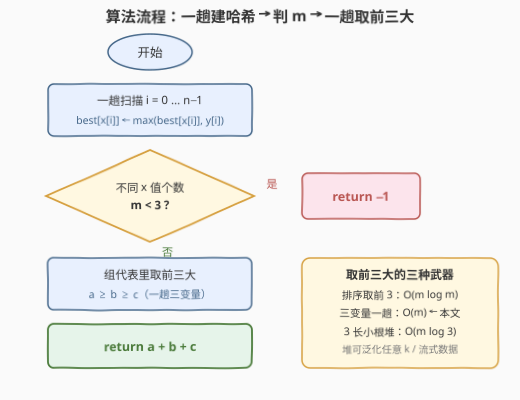

# 选择不同 X 值三元组使 Y 值之和最大

- **题目名称**：选择不同 X 值三元组使 Y 值之和最大
- **链接**：[3572. 选择不同 X 值三元组使 Y 值之和最大](https://leetcode.cn/problems/maximize-ysum-by-picking-a-triplet-of-distinct-xvalues/)
- **难度**：中等
- **标签**：贪心、数组、哈希表、排序、堆（优先队列）

## 1. 题目概述

给定两个长度均为 $n$ 的整数数组 `x` 与 `y`。需要选择三个**互不相同**的下标 $i$、$j$、$k$，满足：

- $x[i] \ne x[j]$
- $x[j] \ne x[k]$
- $x[k] \ne x[i]$

即三个下标对应的 **x 值互不相同**。目标是最大化 $y[i] + y[j] + y[k]$，返回这个最大和；若不存在满足条件的三元组，返回 `-1`。

**示例 1**：

```text
输入：x = [1,2,1,3,2], y = [5,3,4,6,2]
输出：14
解释：选 i=0（x=1, y=5）、j=1（x=2, y=3）、k=3（x=3, y=6），
     三个 x 值互不相同，5 + 3 + 6 = 14 为能取得的最大和。
```

**示例 2**：

```text
输入：x = [1,2,1,2], y = [4,5,6,7]
输出：-1
解释：x 中只有两个不同的值，凑不出三个互异的 x，返回 -1。
```

**约束条件**：

- $n = x.length = y.length$
- $3 \le n \le 10^5$
- $1 \le x[i], y[i] \le 10^6$

> 💡 **读题关键**：「三个下标互异」本身是免费的——真正起约束作用的是**三个 x 值互异**。于是同一 x 值的多个下标天然互斥，每个 x 值内部只需要关心最大的那个 y；且 $y$ 恒为正，暗示「每组取最大、再取最大的三组」的贪心方向。

---

## 2. 解题思路

### 2.1 暴力思路：枚举三元组

$O(n^3)$ 枚举所有下标组合 $(i, j, k)$，检查三个 x 互异后取最大和。$n = 10^5$ 时组合数约 $1.7 \times 10^{14}$，必然超时；即使优化到 $O(n^2)$（枚举两个下标、第三个取「与两者 x 均不同」的最大 y）也是十万平方量级。必须把候选集压缩到「每个 x 值一个代表」的规模。

### 2.2 核心观察：同 x 只留最大 y，组代表取前三大



**观察一（同 x 去重）**：若 $x[i] = x[j]$，两者永远不能同时入选。对任何一个可行解，其中「x 值为 $v$」的那个下标都可以换成 $x = v$ 组内 $y$ 最大的下标——x 值仍是 $v$，互异约束不受影响，其余两个下标不动，而和只增不减（**交换论证**）。因此每个 x 值只需保留**组内最大 y**，同组的其余下标全是冗余。

**观察二（取前三大）**：去重后问题变为——在 $m$ 个组代表（每个代表就是一个 y 值）中选 3 个使总和最大。答案显然是**前三大之和**。若 $m < 3$（不同 x 值不足 3 个），无解返回 `-1`。

> ⚠️ **核心陷阱**：不能直接对 y 数组取全局前三大！示例 1 中全局前三大 y 是 $6+5+4=15$，但 $5$ 和 $4$ 同属 $x=1$，不合法；正确答案是用 $x=2$ 组的 $3$ 替换掉 $4$，得 $14$。必须**先按 x 去重，再取前三大**。

实现上一趟扫描维护哈希表 `best[x[i]] = max(best[x[i]], y[i])`，再在 `best` 的值集合中一趟维护前三大变量 $a \ge b \ge c$（排序或长度 3 的小根堆亦可）。

### 2.3 算法流程图



整体只有两趟线性扫描：第一趟建哈希表完成「组内去重取最大」，第二趟取前三大求和；哈希表大小不足 3 时直接返回 `-1`。

### 2.4 示例演算

以**示例 1** `x = [1,2,1,3,2]`，`y = [5,3,4,6,2]` 走完全流程：

| 步骤 | i | x[i] | y[i] | 哈希表 best 变化 |
|------|---|------|------|------------------|
| ① | 0 | 1 | 5 | `best[1] = 5`（首次出现，直接放入） |
| ② | 1 | 2 | 3 | `best[2] = 3` |
| ③ | 2 | 1 | 4 | $4 < 5$，`best[1]` 保持 5 不变 |
| ④ | 3 | 3 | 6 | `best[3] = 6` |
| ⑤ | 4 | 2 | 2 | $2 < 3$，`best[2]` 保持 3 不变 |

扫描结束得 `best = {1: 5, 2: 3, 3: 6}`，$m = 3 \ge 3$；前三大为 $a=6,\ b=5,\ c=3$，返回 $6+5+3=14$ ✓。

**示例 2**：`best = {1: 6, 2: 7}`，$m = 2 < 3$，返回 `-1` ✓（注意虽然 $n=4$，但不同 x 值只有 2 个——判据是 $m$ 不是 $n$）。

---

## 3. 参考代码

### C++

```cpp
class Solution {
  public:
    int maxSumDistinctTriplet(vector<int>& x, vector<int>& y) {
        unordered_map<int, int> best;                  // x 值 → 组内最大 y
        for (int i = 0; i < (int)x.size(); ++i) {
            auto it = best.find(x[i]);
            if (it == best.end()) best.emplace(x[i], y[i]);
            else if (y[i] > it->second) it->second = y[i];
        }
        if (best.size() < 3) return -1;                // 不同 x 值不足 3 个，无解

        int a = INT_MIN, b = INT_MIN, c = INT_MIN;     // a ≥ b ≥ c：前三大
        for (auto& [kx, vy] : best) {
            if (vy > a)      { c = b; b = a; a = vy; }
            else if (vy > b) { c = b; b = vy; }
            else if (vy > c) { c = vy; }
        }
        return a + b + c;
    }
};
```

### Python

```python
class Solution:
    def maxSumDistinctTriplet(self, x: List[int], y: List[int]) -> int:
        best = {}                                   # x 值 → 组内最大 y
        for xi, yi in zip(x, y):
            if yi > best.get(xi, -1):
                best[xi] = yi
        if len(best) < 3:                           # 不同 x 值不足 3 个，无解
            return -1

        a = b = c = -1                              # a ≥ b ≥ c：前三大（y ≥ 1）
        for v in best.values():
            if v > a:
                a, b, c = v, a, b
            elif v > b:
                b, c = v, b
            elif v > c:
                c = v
        return a + b + c
```

> 💡 取前三大也可以一行解决：`return sum(sorted(best.values())[-3:])`（$O(m \log m)$）或 `sum(heapq.nlargest(3, best.values()))`。三变量写法只是把 $m \le 10^5$ 的排序降成了一趟 $O(m)$，面试里写哪种都算对。

---

## 4. 复杂度分析

| 维度 | 复杂度 | 说明 |
|------|--------|------|
| 时间 | $O(n)$ | 建哈希表一趟 $O(n)$；在 $m \le n$ 个组代表上一趟三变量取前三大 $O(m)$。若改排序取前三则为 $O(n + m \log m)$，同样可过 |
| 空间 | $O(m)$ | 哈希表存每个不同 x 值的组内最大 y，$m$ 为 x 中不同值的个数，最坏 $m = n$ |

---

## 5. 扩展：取前 k 大的实现选型

把「选 3 个」泛化为「选 $k$ 个不同 x 值使 y 和最大」：组内去重逻辑完全不变，只有「取前三大」变成「取前 k 大」：

| 实现 | 复杂度 | 适用场景 |
|------|--------|----------|
| 排序取前 k | $O(m \log m)$ | 最直白，$m \le 10^5$ 时毫无压力 |
| k 个变量一趟 | $O(m)$ | k 是很小的常数（本题 $k=3$，即 $a \ge b \ge c$） |
| 长度 k 小根堆 | $O(m \log k)$ | k 任意，或数据**流式**到达只能看一遍 |

两个值得记的变体讨论：

- **y 可为负数**：「恰好选 3 个」时结论不变——答案仍是组代表前三大之和（交换论证不依赖 y 的符号）；但若改成「**至多**选 3 个」，负数代表就不该硬选，需按正数代表的个数分类讨论。
- **换目标不换骨架**：若要求「最小化」就和，去重后取**前三小**；若像 628 那样目标是**乘积**，还要额外比较「两大 × 最小」与「三大」两条路线（负负得正）。

---

## 6. 面试要点

- **Q1：为什么每个 x 值只保留组内最大 y 是安全的？**
  答：交换论证。任何可行解若选中了 x 值为 $v$ 但 y 非组内最大的下标，把它换成 $x=v$ 组内 y 最大的下标：x 值仍为 $v$，互异约束不受影响，其余两个下标不动，总和只增不减。
- **Q2：什么时候返回 -1？判据是什么？**
  答：不同 x 值的个数 $m < 3$ 时。判据是哈希表的大小，不是 $n$——示例 2 中 $n=4$ 但只有 2 个不同 x 值，照样无解（约束已保证 $n \ge 3$，但 $n \ge 3$ 不代表有解）。
- **Q3：为什么不能直接对 y 取全局前三大？**
  答：前三大 y 可能来自相同的 x 值。示例 1 全局前三 $6+5+4$ 中 $5$、$4$ 同属 $x=1$，非法。必须先按 x 去重、再在组代表里取前三大——这是本题最核心的陷阱。
- **Q4：取前三大有哪些实现？各自适合什么场景？**
  答：① 排序取前 3：$O(m \log m)$ 最直白；② 一趟三变量 $a \ge b \ge c$：$O(m)$ 常数最小，适合 k 很小；③ 长度 3 小根堆：$O(m \log 3)$，可泛化任意 k，且是流式数据的标准武器。
- **Q5：本题的贪心与「排序取前三大」的平凡贪心差在哪一步？**
  答：平凡版直接作用在**原始 y 上**是错的（Q3 的陷阱）；正确做法先做一步**哈希分桶去重**，把候选集从「所有下标」坍缩成「每个不同 x 值一个组代表」，之后的取前三大才是平凡的。去重这一步才是本题的考点。

---

## 7. 同类练习题

- [2815. 数组中的最大数对和](https://leetcode.cn/problems/max-pair-sum-in-an-array/)：$k=2$ 版同款骨架——按数位和分组只留组内最大，再取两个最大相加（题解见[数组中的最大数对和](../2801-2900/2815_数组中的最大数对和.md)）
- [414. 第三大的数](https://leetcode.cn/problems/third-maximum-number/)：一趟三变量维护「前三大的**不同值**」，正是本文取前三大环节的裸用法（题解见[第三大的数](../0401-0500/414_第三大的数.md)）
- [628. 三个数的最大乘积](https://leetcode.cn/problems/maximum-product-of-three-numbers/)：同为「选三个数最优化」，但负负得正要比 $\max(\text{三大之积},\ \text{两大} \times \text{最小})$，比纯求和多一层分类（题解见[三个数的最大乘积](../0601-0700/628_三个数的最大乘积.md)）
- [1338. 数组大小减半](https://leetcode.cn/problems/reduce-array-size-to-the-half/)：哈希统计频次 + 贪心取最大桶，组内信息坍缩后贪心的又一实例（题解见[数组大小减半](../1301-1400/1338_数组大小减半.md)）
- [2558. 从数量最多的堆取走礼物](https://leetcode.cn/problems/take-gifts-from-the-richest-pile/)：大根堆反复取最大平方放回，堆式 top-k 贪心的流式变体（题解见[从数量最多的堆取走礼物](../2501-2600/2558_从数量最多的堆取走礼物.md)）
