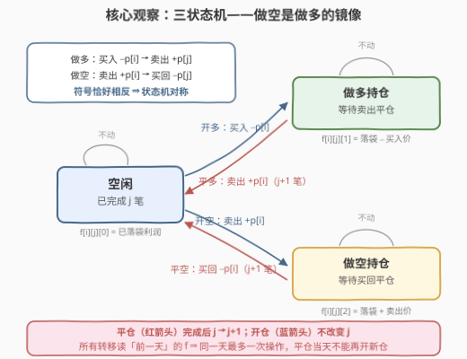
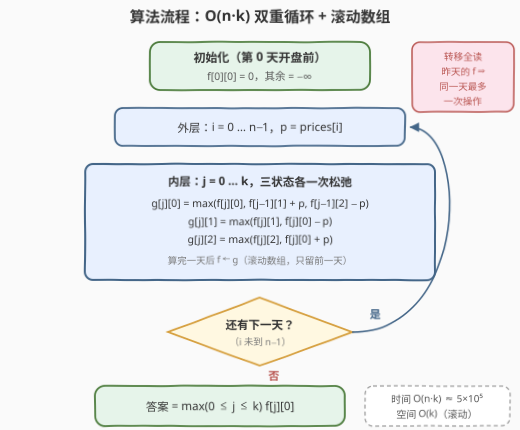

# LeetCode 买卖股票的最佳时机V 题解

## 1. 题目概述

- **标题 / 题号**：买卖股票的最佳时机V（#3573，medium）
- **链接**：https://leetcode.cn/problems/best-time-to-buy-and-sell-stock-v/
- **难度**：中等
- **标签**：数组、动态规划、状态机

**题意**：给定整数数组 `prices`（`prices[i]` 为第 $i$ 天的股价，美元）与整数 $k$，最多进行 $k$ 笔交易，每笔交易是以下两种类型之一：

- **普通交易（做多）**：第 $i$ 天买入，之后的第 $j$ 天卖出（$i < j$），利润为 $prices[j] - prices[i]$；
- **做空交易**：第 $i$ 天卖出，之后的第 $j$ 天买回（$i < j$），利润为 $prices[i] - prices[j]$。

约束有两条：**开始下一笔交易之前必须完成当前交易**（交易不重叠）；**同一天不能进行两次买入/卖出操作**（即平仓当天不能再开新仓，开仓当天也不能当天平仓）。求最大总利润。

**示例 1**：

```text
输入：prices = [1,7,9,8,2], k = 2
输出：14
解释：普通交易——第 0 天 1 买入、第 2 天 9 卖出（赚 8）；
     做空交易——第 3 天 8 卖出、第 4 天 2 买回（赚 6）。
```

**示例 2**：

```text
输入：prices = [12,16,19,19,8,1,19,13,9], k = 3
输出：36
解释：做多（12→19 赚 7）＋做空（19→8 赚 11）＋做多（1→19 赚 18）。
```

**约束**：

- $2 \le prices.length \le 10^3$
- $1 \le prices[i] \le 10^9$
- $1 \le k \le prices.length / 2$

> 💡 **读题关键**：做空交易「先卖后买」，每一步的现金流与做多**恰好符号相反**——把它纳入经典的股票状态机只需多一个「空头持仓」状态，不需要任何新技巧。真正容易漏的隐藏约束是**每天最多一次买/卖操作**：当天平仓不能立刻开新仓，这决定了转移必须全部「读前一天」的值。

## 2. 解题思路

### 2.1 暴力思路：枚举每天的动作

每天从「不动 / 买入 / 卖出 / 做空卖出 / 买回」中选一个**当前状态下合法**的动作（空闲才能开仓、持仓才能平仓），递归枚举所有动作序列，结束时取「以空闲收尾」的最大利润。动作序列数是指数级 $O(3^n)$，$n = 10^3$ 时天文数字。

对它做记忆化——状态 = （当前天数，已完成笔数，持仓状态）——就直接得到下面的状态机 DP。骨架与 188 题（买卖股票的最佳时机 IV）完全相同，只是多了一个做空状态和一个「隔天」细节。

### 2.2 核心观察：三状态机 DP



**观察一（三个状态足够）**：「交易不重叠」意味着任意时刻至多有一笔进行中的交易，其类型只有做多、做空两种，再加上空闲共三个状态；已完成笔数 $j \in [0, k]$ 单独作一维。定义：

$$f[i][j][s] = \text{前 } i+1 \text{ 天、已完成 } j \text{ 笔交易、处于状态 } s \text{ 时的最大账面值}$$

其中 $s=0$ 空闲、$s=1$ 做多持仓、$s=2$ 做空持仓。**记账口径**：持仓状态的值 = 已落袋利润 $\mp$ 开仓价格（做多扣买入价、做空加卖出价），平仓时一次结清——这是股票系列 DP 的标准技巧，避免去记录开仓日期。

**观察二（做空是做多的镜像）**：做多是「买入 $-p[i]$ → 卖出 $+p[j]$」，做空是「卖出 $+p[i]$ → 买回 $-p[j]$」，每一步符号都相反。因此做空状态的转移与做多完全对称，只是加减号互换。

**转移方程**（设第 $i$ 天价格 $p = prices[i]$）：

$$
\begin{aligned}
f[i][j][0] &= \max\big(f[i-1][j][0],\ \ f[i-1][j-1][1] + p,\ \ f[i-1][j-1][2] - p\big)\\
f[i][j][1] &= \max\big(f[i-1][j][1],\ \ f[i-1][j][0] - p\big)\\
f[i][j][2] &= \max\big(f[i-1][j][2],\ \ f[i-1][j][0] + p\big)
\end{aligned}
$$

三条方程依次读作：空闲 = 昨天空闲 / 昨天持多今天卖（完成第 $j$ 笔）/ 昨天持空今天买回（完成第 $j$ 笔）；持多 = 昨天持多 / 昨天空闲今天买入开多；持空 = 昨天持空 / 昨天空闲今天卖出开空。边界：开盘前 $f[\cdot][0][0] = 0$、其余 $-\infty$（代码里把「第 0 天开盘前」作为初始状态，让循环统一处理第 0 天的开仓）。

**观察三（为什么全部读 $f[i-1]$）**：方程右边**只引用前一天**，这天然保证了「每天最多一次操作」——

- 开仓只从「前一天就空闲」的状态转移（$f[i-1][j][0]$），排除「当天刚平仓、当天又开新仓」；
- 平仓只从「前一天就持仓」的状态转移（$f[i-1][j-1][1/2]$），排除「当天开仓、当天平仓」（同时满足 $i < j$）。

> ⚠️ **这一步不能省**：在只有做多的 188 题里，「当天卖了再买」与「继续持有」利润等价，所以读当天已更新的值也不出错；但加入做空后，「当天平多 + 当天开空」会把**同一天的价格凭空计两次**，题目已显式禁止。读前一天是本题正确性的关键，也是代码与 188 的唯一结构差异（309 题的冷冻期用的是同一招）。

**答案**：$\max_{0 \le j \le k} f[n-1][j][0]$。以空闲收尾，是因为未平仓的交易不计入利润，而「开了不关」的开仓操作只影响账面、不改变已落袋部分，删掉它不劣。

### 2.3 算法流程图



外层逐天、内层逐交易数，每个 $(i, j)$ 做 $O(1)$ 的三状态松弛；用滚动数组只保留前一天，空间降到 $O(k)$。$n \le 10^3$、$k \le n/2 \le 500$，总共约 $5 \times 10^5$ 次松弛，轻松通过。

### 2.4 示例演算

以示例 1 `prices = [1,7,9,8,2]`、`k = 2` 走完全流程（$\times$ 表示 $-\infty$，即该状态尚不可达；加粗为最优路径）：

| 天 $i$ | $p$ | $f[i][0]$（空闲 / 多 / 空） | $f[i][1]$（空闲 / 多 / 空） | $f[i][2]$（空闲 / 多 / 空） |
|--------|-----|---------------------------|---------------------------|---------------------------|
| 0 | 1 | 0 / **−1** / 1 | × / × / × | × / × / × |
| 1 | 7 | 0 / **−1** / 7 | 6 / × / × | × / × / × |
| 2 | 9 | 0 / −1 / 9 | **8** / −3 / 15 | × / × / × |
| 3 | 8 | 0 / −1 / 9 | 8 / 0 / **16** | 7 / × / × |
| 4 | 2 | 0 / −1 / 9 | 8 / 6 / 16 | **14** / 5 / 9 |

几个值得驻足的值：

- 第 0 天持多为 $-1$：买入花了 1，账面为「落袋 0 − 买入价 1」；
- 第 2 天 $f[2][1][0] = 8$：第 0 天 1 买入、第 2 天 9 卖出，第一笔落袋 8；
- 第 3 天 $f[3][1][2] = 16$：8 落袋 + 第 3 天做空卖出收到的 8；
- 第 4 天 $f[4][2][0] = 16 - 2 = 14$：第 4 天以 2 买回平空，第二笔赚 6。

最优路径回溯：$f[4][2][0] \leftarrow f[3][1][2] - 2$（第 4 天买回平空）$\leftarrow f[2][1][0] + 8$（第 3 天卖出开空）$\leftarrow f[1][0][1] + 9$（第 2 天卖出平多）$\leftarrow f[0][0][0] - 1$（第 0 天买入开多）。两笔交易 $8 + 6 = 14$ ✓，与官方解释一致。答案 $= \max(0, 8, 14) = 14$。

## 3. 参考代码

### C++

```cpp
class Solution {
  public:
    long long maximumProfit(vector<int>& prices, int k) {
        int n = prices.size();
        const long long NEG = LLONG_MIN / 2;        // −∞ 哨兵，±p 加法后仍远离有效值且不溢出
        // f[j][s]：已完成 j 笔、状态 s（0 空闲 / 1 做多持仓 / 2 做空持仓）的最大账面值
        vector<array<long long, 3>> f(k + 1, {NEG, NEG, NEG}), g(k + 1);
        f[0][0] = 0;                                // 第 0 天开盘前：空闲、0 笔、利润 0
        for (int i = 0; i < n; ++i) {
            long long p = prices[i];
            for (int j = 0; j <= k; ++j) {
                g[j][0] = f[j][0];                                        // 不操作
                if (j > 0) g[j][0] = max({g[j][0],                        // 平仓：完成第 j 笔
                                          f[j - 1][1] + p,                // 卖出平多
                                          f[j - 1][2] - p});              // 买回平空
                g[j][1] = max(f[j][1], f[j][0] - p);                      // 继续持多 / 买入开多
                g[j][2] = max(f[j][2], f[j][0] + p);                      // 继续持空 / 卖出开空
            }
            swap(f, g);                                                   // 滚动到下一天
        }
        long long ans = 0;
        for (int j = 0; j <= k; ++j) ans = max(ans, f[j][0]);             // 以空闲收尾
        return ans;
    }
};
```

### Python

```python
class Solution:
    def maximumProfit(self, prices: List[int], k: int) -> int:
        NEG = float('-inf')
        f = [[NEG] * 3 for _ in range(k + 1)]     # f[j][s]：j 笔已完成，s = 0/1/2
        f[0][0] = 0                               # 第 0 天开盘前：空闲、0 笔
        for p in prices:
            g = [[NEG] * 3 for _ in range(k + 1)]
            for j in range(k + 1):
                g[j][0] = f[j][0]                                 # 不操作
                if j > 0:                                         # 平仓：完成第 j 笔
                    g[j][0] = max(g[j][0], f[j - 1][1] + p, f[j - 1][2] - p)
                g[j][1] = max(f[j][1], f[j][0] - p)               # 持多 / 买入开多
                g[j][2] = max(f[j][2], f[j][0] + p)               # 持空 / 卖出开空
            f = g
        return max(f[j][0] for j in range(k + 1))
```

> 💡 两个实现细节：① 利润上界约 $k \times 10^9 \approx 5 \times 10^{11}$，超出 int32，C++ 必须用 `long long`；② 「全程不动」保证 $f[n-1][0][0] \ge 0$，所以答案一定是有限值，`max` 不会返回 $-\infty$。

## 4. 复杂度分析

| 维度 | 复杂度 | 说明 |
|------|--------|------|
| 时间 | $O(n \cdot k)$ | 外层 $n$ 天 × 内层 $k+1$ 个交易数，每个 $(i, j)$ 三状态各 $O(1)$ 松弛；$n \le 10^3$、$k \le 500$，约 $5 \times 10^5$ 次 |
| 空间 | $O(k)$ | 滚动数组只保留前一天的 $(k+1) \times 3$ 个状态 |

## 5. 扩展：股票系列的状态机全家桶

本题是「股票状态机」家族的新成员——它们共享同一副骨架（空闲/持仓 × 交易数），差别只在转移的**守卫条件**：

| 题目 | 与本题的差异 | 状态机上的改动 |
|------|--------------|----------------|
| 121 / 122 / 123 | 只有做多 | $k=1$ / $k=\infty$ / $k=2$ 的特例 |
| 188 | 至多 $k$ 笔、只有做多 | 去掉做空状态即退化为 188 |
| 309 | 卖出后冷冻一天 | 「读更早的状态」同一招的变体 |
| 714 | 每笔交易收手续费 | 在开/平仓转移上减 $fee$ |
| **3573（本题）** | **增加做空** | **加一个空头持仓状态，符号与做多相反** |

另一个值得想的变体：**若去掉「每天最多一次操作」的限制（允许当天平仓又开仓），答案会变大吗？**——只有做多时不变（当天卖了再买 $\equiv$ 继续持有，这正是 188 可以读当天值的原因）；但有做空时会变大，例如 $prices = [1,5,1]$、$k=2$：约束下只能赚 $4$（第 0 天 1 买入、第 1 天 5 卖出），若允许当天两连操作则「第 1 天平多 + 立刻开空、第 2 天 1 买回」可赚 $4+4=8$。同一天的价格被计了两次——这正是本题必须「读前一天」的本质原因。

## 6. 面试要点

- **Q1：为什么三个状态就够了？**
  答：「开始下一笔前必须完成当前交易」保证任意时刻至多一笔进行中的交易，其类型只有做多/做空两种，加上空闲共三个状态；已完成笔数 $j \in [0, k]$ 单独作一维。
- **Q2：转移为什么要全部读 $f[i-1]$，而不是读当天已更新的值？**
  答：题目规定同一天最多一次买/卖操作，读前一天天然排除「当天平仓又开新仓」「当天开仓又当天平仓」。只有做多时这一步不影响正确性（当天卖了再买 $\equiv$ 持有），但有做空时当天连做两次会重复计价、凭空生利——这是本题与 188 的关键差别。
- **Q3：答案为什么取 $\max_j f[n-1][j][0]$，不用看持仓状态吗？**
  答：未平仓交易不计入利润；记账口径下开仓只影响账面值、不动已落袋部分，所以任何「开了不关」的方案删掉开仓动作后不劣，最优解总可以空闲收尾。
- **Q4：实现上有哪些细节？**
  答：① 利润上界 $k \times 10^9 \approx 5 \times 10^{11}$ 超 int32，C++ 用 `long long`；② $-\infty$ 哨兵取 `LLONG_MIN / 2`，参与 $\pm p$ 加法不溢出；③ 滚动数组把空间降到 $O(k)$。
- **Q5：和 309（冷冻期）的「读前一天」是一回事吗？**
  答：思想一致、细节不同。309 是「卖出后下一天不能买」，只对买入转移隔天；本题是「任意操作每天最多一次」，所有转移统一隔天。两者都是用**转移的时间跨度**表达冷却/互斥约束，面试中可以互相印证。

## 同类练习题

| # | 题目 | 与本题的关联 |
|---|------|-------------|
| 188 | [买卖股票的最佳时机IV](https://leetcode.cn/problems/best-time-to-buy-and-sell-stock-iv/) | 去掉做空状态的本题，先写熟它再做本题事半功倍（题解见[买卖股票的最佳时机IV](../0101-0200/188_买卖股票的最佳时机IV.md)） |
| 309 | [买卖股票的最佳时机含冷冻期](https://leetcode.cn/problems/best-time-to-buy-and-sell-stock-with-cooldown/) | 同样靠「读更早的状态」表达时间约束（题解见[买卖股票的最佳时机含冷冻期](../0301-0400/309_买卖股票的最佳时机含冷冻期.md)） |
| 714 | [买卖股票的最佳时机含手续费](https://leetcode.cn/problems/best-time-to-buy-and-sell-stock-with-transaction-fee/) | 在开/平仓转移上加减费用的同款状态机（题解见[买卖股票的最佳时机含手续费](../0701-0800/714_买卖股票的最佳时机含手续费.md)） |
| 121 | [买卖股票的最佳时机](https://leetcode.cn/problems/best-time-to-buy-and-sell-stock/) | $k=1$ 的入门特例，一趟维护前缀最小值（题解见[买卖股票的最佳时机](../0101-0200/121_买卖股票的最佳时机.md)） |
| 3562 | [折扣价交易股票的最大利润](https://leetcode.cn/problems/maximum-profit-from-trading-stocks-with-discounts/) | 树上半价折扣的「买卖获利」建模，股票主题的另一类 DP（题解见[折扣价交易股票的最大利润](../3501-3600/3562_折扣价交易股票的最大利润.md)） |
