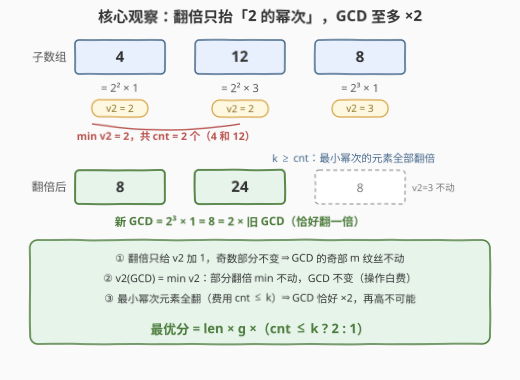
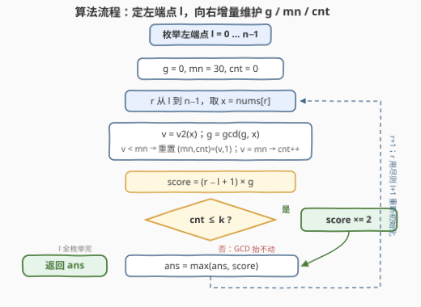

# LeetCode 最大子数组 GCD 分数 题解

## 1. 题目概述

- **标题 / 题号**：最大子数组 GCD 分数（#3574，hard）
- **链接**：https://leetcode.cn/problems/maximize-subarray-gcd-score/
- **难度**：困难
- **标签**：数组、数学、枚举、数论

**题意**：给定一个**正整数**数组 `nums` 和一个整数 $k$。最多可以执行 $k$ 次操作：每次操作选择数组中的一个元素并将其值**翻倍**；每个元素**至多**只能翻倍一次。

**连续子数组**的**分数**定义为其所有元素的最大公约数（GCD）与子数组**长度**的**乘积**。返回修改后的数组中，选择一个连续子数组可以取得的最大分数。

**示例 1**：

```text
输入：nums = [2,4], k = 1
输出：8
解释：将 nums[0] 翻倍到 4，数组变为 [4,4]，
      子数组 [4,4] 的 GCD 是 4、长度是 2，分数 = 2 × 4 = 8。
```

**示例 2**：

```text
输入：nums = [3,5,7], k = 2
输出：14
解释：将 nums[2] 翻倍到 14，取单元素子数组 [14]，分数 = 1 × 14 = 14。
```

**示例 3**：

```text
输入：nums = [5,5,5], k = 1
输出：15
解释：任何翻倍都无法提高分数，取整个数组，分数 = 3 × 5 = 15。
```

**约束**：

- $1 \le n = nums.length \le 1500$
- $1 \le nums[i] \le 10^9$
- $1 \le k \le n$

> 💡 **读题关键**：$n \le 1500$ 直接暗示 $O(n^2)$ 枚举子数组；真正的难点在「翻倍操作如何影响 GCD」。翻倍 = 乘 2，只改变因子 $2$ 的个数——把每个数拆成「$2$ 的幂次 × 奇数部分」后，操作的影响范围就被完全圈死了。

## 2. 解题思路

记 $v_2(x)$ 为 $x$ 中因子 $2$ 的个数（即 $x$ 二进制末尾 $0$ 的个数），$x = 2^{v_2(x)} \times (\text{奇数部分})$。

### 2.1 暴力思路：枚举子数组 + 枚举翻倍集合

枚举每个子数组 $O(n^2)$ 个，再枚举「哪些元素被翻倍」的子集 $2^{\text{len}}$ 种，对每种方案重算 GCD 取最大——指数级爆炸。即使想到「贪心地翻 GCD 短板元素」，没有数论层面的分析也无法证明正确性。突破口在于看清**翻倍操作到底能改变 GCD 的什么**。

### 2.2 核心观察：翻倍只抬「2 的幂次」，GCD 至多翻一倍



一切建立在一个经典数论恒等式上：对奇数 $u, v$，

$$\gcd(2^a u,\ 2^b v) = 2^{\min(a,b)} \times \gcd(u, v)$$

把它推广到整个子数组：**子数组的 GCD = $2^a \times m$**，其中 $a = \min_i v_2(x_i)$（最小幂次），$m$ = 所有元素奇数部分的 GCD。

**观察一（奇部不变）**：翻倍是乘 $2$，不改变奇数部分。所以无论怎么翻，GCD 的**奇数部分 $m$ 纹丝不动**——操作能染指的只有 $2$ 的幂次 $a$。

**观察二（幂次至多 +1）**：翻倍后 $v_2(x)$ 至多加 $1$。设子数组内最小幂次为 $a$、取到它的元素有 $cnt$ 个：

- **部分翻倍**：只要还有任何一个幂次为 $a$ 的元素没翻，$\min v_2$ 仍是 $a$，GCD 不变——这些操作**白费**；
- **全翻**（把这 $cnt$ 个全翻，费用恰好 $cnt$ 次操作）：$\min v_2$ 升到 $a+1$，GCD 变为 $2^{a+1} m = 2 \times \gcd$，**恰好翻一倍**；
- **想 +2**：幂次为 $a$ 的元素翻一次后是 $a+1 < a+2$，而每个元素至多翻一次——**不可能**。

> ⚠️ **核心陷阱**：不要试图「翻掉 GCD 之外的冗余」或「翻一半留着下次用」——翻倍只抬 $\min v_2$ 这一个旋钮，而旋钮只有「不动」和「+1（花 $cnt$ 次操作）」两个档位。于是每个子数组只有两个候选分数：
>
> $$\text{score} = \underbrace{(r-l+1)}_{\text{长度}} \times g \times \begin{cases} 2, & cnt \le k \\ 1, & cnt > k \end{cases} \qquad (g = 2^a m \text{ 为不翻倍时的 GCD})$$

顺手得到一个下界：$k \ge 1$ 恒成立，所以单元素子数组一定能翻倍，答案 $\ge 2 \max(nums)$。

### 2.3 算法流程图



固定左端点 $l$、向右扩展 $r$，**增量维护**三个量：GCD $g$、最小幂次 $mn$、最小幂次出现次数 $cnt$。新元素 $x$ 进来时：$g \gets \gcd(g, x)$；若 $v_2(x) < mn$ 则重置 $(mn, cnt) = (v_2(x), 1)$，若相等则 $cnt{+}{+}$。每个子数组用 2.2 的公式 $O(1)$ 打分，全程无需回退。

### 2.4 示例演算

以**示例 2** `nums = [3,5,7]`，`k = 2` 走完全流程。三个数全为奇数，$v_2$ 全是 $0$，故 $mn$ 恒为 $0$、$cnt$ 恒等于子数组长度：

| l | r | 新元素 x | g | mn | cnt | cnt ≤ k? | 该子数组最优分 |
|---|---|---------|---|----|-----|----------|----------------|
| 0 | 0 | 3 | 3 | 0 | 1 | ✓ | $1 \times 3 \times 2 = 6$ |
| 0 | 1 | 5 | 1 | 0 | 2 | ✓ | $2 \times 1 \times 2 = 4$（翻成 [6,10]，gcd=2）|
| 0 | 2 | 7 | 1 | 0 | 3 | ✗ | $3 \times 1 = 3$（翻不完 3 个，gcd 不动）|
| 1 | 1 | 5 | 5 | 0 | 1 | ✓ | $1 \times 5 \times 2 = 10$ |
| 1 | 2 | 7 | 1 | 0 | 2 | ✓ | $2 \times 1 \times 2 = 4$ |
| 2 | 2 | 7 | 7 | 0 | 1 | ✓ | $1 \times 7 \times 2 = \mathbf{14}$ ← 最大 |

答案 $14$ ✓——正是「单元素翻倍」这一最朴素的方案。示例 1 里 $[2,4]$ 的 $g=2$（$v_2$ 分别为 $1,2$），最小幂次元素只有 $2$ 一个，$cnt=1 \le k=1$，翻倍后 GCD 恰好 $\times 2$ 得 $2 \times 4 = 8$；示例 3 里整段 $cnt=3 > k=1$，GCD 抬不动，只能拿 $3 \times 5 = 15$。

## 3. 参考代码

### C++

```cpp
class Solution {
  public:
    long long maxGCDScore(vector<int>& nums, int k) {
        int n = nums.size();
        long long ans = 0;
        for (int l = 0; l < n; ++l) {
            int g = 0;                // gcd(0, x) = x，作单位元
            int mn = 30, cnt = 0;     // 子数组内最小 v2 及其出现次数
            for (int r = l; r < n; ++r) {
                int x = nums[r];
                int v = __builtin_ctz(x);         // v2(x)：二进制末尾 0 的个数
                g = std::gcd(g, x);
                if (v < mn) mn = v, cnt = 1;      // 出现更小幂次，重置
                else if (v == mn) ++cnt;          // 追平当前最小

                long long score = 1LL * (r - l + 1) * g;
                if (cnt <= k) score <<= 1;        // 最小幂次元素全翻，GCD 恰好 ×2
                ans = max(ans, score);
            }
        }
        return ans;
    }
};
```

### Python

```python
class Solution:
    def maxGCDScore(self, nums: List[int], k: int) -> int:
        n = len(nums)
        ans = 0
        for l in range(n):
            g = 0                    # gcd(0, x) = x，作单位元
            mn, cnt = 30, 0          # 子数组内最小 v2 及其出现次数
            for r in range(l, n):
                x = nums[r]
                v = (x & -x).bit_length() - 1    # v2(x)：最低位 1 的位号
                g = gcd(g, x)
                if v < mn:                       # 出现更小幂次，重置
                    mn, cnt = v, 1
                elif v == mn:                    # 追平当前最小
                    cnt += 1
                score = (r - l + 1) * g
                if cnt <= k:
                    score *= 2                   # 最小幂次元素全翻，GCD 恰好 ×2
                ans = max(ans, score)
        return ans
```

> 💡 两处实现细节：① `gcd(0, x) = x`，让 $g$ 从 $0$ 起步即可吸收第一个元素；② 答案上界 $1500 \times 2 \times 10^9 = 3 \times 10^{12}$ 超出 `int`，C++ 必须用 `long long`（Python 天然大整数无虞）。

## 4. 复杂度分析

| 维度 | 复杂度 | 说明 |
|------|--------|------|
| 时间 | $O(n^2 \log C)$ | 双重循环枚举 $\frac{n(n+1)}{2} \approx 1.1 \times 10^6$ 个子数组（$n = 1500$），每步摊还一次 gcd（$O(\log C)$，$C = 10^9$）与 $O(1)$ 的 $(mn, cnt)$ 增量维护 |
| 空间 | $O(1)$ | 仅 $g,\ mn,\ cnt,\ ans$ 四个滚动变量 |

## 5. 扩展：若元素允许翻倍多次会怎样

把「每个元素至多翻一次」放开成「$k$ 次操作任意分配、同一元素可翻多次」：单次翻倍仍只给 $v_2$ 加 $1$，奇部依旧不动，但幂次上限不再是 $a+1$。想把 $\min v_2$ 抬到 $a + b$，每个元素都要补齐缺口，费用为

$$\text{cost}(b) = \sum_{i}\max\bigl(0,\ a + b - v_2(x_i)\bigr)$$

对每个子数组从小到大试 $b = 1, 2, \dots$ 直到费用超预算，取最大的可行 $b$ 打分。$b$ 的上限是 $O(\log C) \approx 30$，整体仍是 $O(n^2 \log C)$——骨架完全不变，只是「两档旋钮」变成了「阶梯旋钮」。

另一个方向的推广：固定一端延伸时 GCD 单调不增、且只有 $O(\log C)$ 个不同取值（子数组 GCD 问题的经典结论，见 1819）。本题因需同步维护「最小幂次计数」而非单独的 gcd 值，直接双重循环增量维护反而最稳，不必套用值段压缩技巧。

## 6. 面试要点

- **Q1：为什么翻倍操作只需要考虑「最小 $v_2$ 的元素全部翻倍」这一种用法？**
  答：翻倍只给 $v_2$ 加 $1$、奇部不变。GCD 的 $v_2$ 是全体元素的 $\min$：部分翻倍时 $\min$ 不动、GCD 不变，操作白费；只有把幂次为 $\min$ 的元素**全部**翻掉，$\min$ 才升到 $a+1$，GCD 恰好 $\times 2$。其余任何方案都严格不优。
- **Q2：为什么 GCD 至多翻一倍，不可能 $\times 4$？**
  答：幂次为 $a$ 的元素翻一次后是 $a+1$，而每个元素至多翻一次，所以任何元素都到不了 $a+2$——$\min v_2$ 的天花板就是 $a+1$。奇部 $m$ 又纹丝不动，故 GCD 上界为 $2^{a+1} m = 2 \times \gcd$。
- **Q3：$n = 1500$ 的 $O(n^2)$ 为什么能过？如何避免每个子数组重算 GCD？**
  答：固定左端点 $l$ 向右扩展 $r$，新 GCD $= \gcd(g_{\text{旧}}, x_r)$，$O(1)$ 摊还一步；最小幂次 $(mn, cnt)$ 同样增量维护（更小则重置、相等则计数）。总计约 $1.1 \times 10^6$ 次 gcd，每次 $O(\log 10^9) \approx 30$，C++ 毫秒级、Python 数秒内可过。
- **Q4：什么时候「翻倍」完全失效？**
  答：子数组内最小幂次的元素个数 $cnt > k$ 时——预算不够把短板全翻掉，GCD 原地不动，此时直接拿 $(r-l+1) \times g$。示例 3（`[5,5,5]`, `k=1`）即整段 $cnt=3 > 1$，翻倍全部无意义。
- **Q5：这题哪里容易写挂？**
  答：① 溢出——分数上界 $3 \times 10^{12}$，C++ 忘写 `long long` / `1LL *` 直接爆 `int`；② $(mn, cnt)$ 在遇到**更小**幂次时要重置为 $(v, 1)$ 而不是累加；③ $g$ 的单位元用 $0$（$\gcd(0,x)=x$），别用 $1$。

## 同类练习题

| # | 题目 | 与本题的关联 |
|---|------|-------------|
| 1819 | [序列中不同最大公约数的数目](https://leetcode.cn/problems/number-of-different-subsequences-gcds/) | 同款「枚举 + 增量 gcd」骨架，把所有可能的 gcd 值收进集合，规模账同样卡在 $O(n^2 \log C)$（题解见[序列中不同最大公约数的数目](../1801-1900/1819_序列中不同最大公约数的数目.md)） |
| 2436 | [使子数组最大公约数大于一的最小分割数](https://leetcode.cn/problems/minimum-split-into-subarrays-with-gcd-greater-than-one/) | 子数组 gcd 的贪心切分——gcd 单调不增性质决定切点只能向左挪，增量 gcd 的又一应用（题解见[使子数组最大公约数大于一的最小分割数](../2401-2500/2436_使子数组最大公约数大于一的最小分割数.md)） |
| 2862 | [完全子集的最大元素和](https://leetcode.cn/problems/maximum-element-sum-of-a-complete-subset-of-indices/) | 同款「把因子中的 2 单独拎出来」的数论套路——位置按去 2 幂次后的奇核分桶，与本题 $v_2$/奇部拆分一脉相承（题解见[完全子集的最大元素和](../2801-2900/2862_完全子集的最大元素和.md)） |
| 1071 | [字符串的最大公因子](https://leetcode.cn/problems/greatest-common-divisor-of-strings/) | gcd 思想从数值迁移到字符串长度，$\gcd$ 整除结构的基础热身（题解见[字符串的最大公因子](../1001-1100/1071_字符串的最大公因子.md)） |
| 914 | [卡牌分组](https://leetcode.cn/problems/x-of-a-kind-in-a-deck-of-cards/) | 频次取 gcd 判「能否整组均分」，gcd 数论的入门级应用（题解见[卡牌分组](../0901-1000/914_卡牌分组.md)） |
