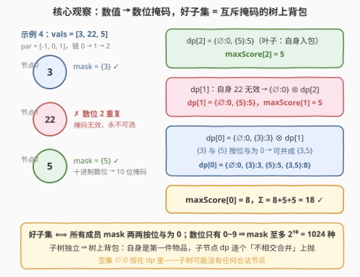
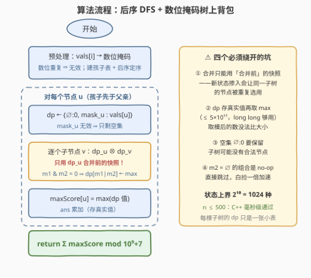

# 最大好子树分数

- **题目名称**：最大好子树分数
- **链接**：[3575. 最大好子树分数](https://leetcode.cn/problems/maximum-good-subtree-score/)
- **难度**：困难
- **标签**：位运算、树、深度优先搜索、数组、动态规划、状态压缩

## 1. 题目概述

给你一棵根节点为 0 的无向树，包含 $n$ 个节点。每个节点 $i$ 有整数值 $vals[i]$，父节点为 $par[i]$。

从某节点**子树**内选取部分节点组成**子集**，如果所选数值的十进制表示中，$0$ 到 $9$ 每个数字在所有数的数位上**合计至多出现一次**，则称它为**好子集**。好子集的**分数**是其节点值总和。

定义 $maxScore[u]$：以 $u$ 为根的子树（含 $u$ 及所有后代）中，好子集的最大可能分数。返回 $maxScore$ 中所有值的总和，对 $10^9+7$ 取模。

**示例 1**：

```text
输入：vals = [2,3], par = [-1,0]
输出：8
解释：节点 0 子树内 {2,3} 是好子集（数字 2、3 各出现一次），分数 5；
     节点 1 子树内 {3} 分数 3。maxScore = [5, 3]，总和 5 + 3 = 8。
```

**示例 4**：

```text
输入：vals = [3,22,5], par = [-1,0,1]
输出：18
解释：22 自身数位 2 出现两次，任何包含它的子集都不是好子集；
     maxScore = [8, 5, 5]（节点 0 取 {3,5}），总和 18。
```

**约束条件**：

- $1 \le n = vals.length \le 500$
- $1 \le vals[i] \le 10^9$
- $par[0] = -1$，且 $par$ 表示一棵有效的树

> 💡 **读题关键**：三个信号——①「好」的判定只看数值用了哪些**数位**，10 个数位天然对应 $2^{10}$ 的状态空间；② $maxScore[u]$ 只依赖子树内部，**子树独立**是树形 DP 的入场券；③ 答案是全体 $maxScore$ **求和后再取模**，说明每个节点各自的答案都要分别算清楚、且 dp 内部不能提前取模。

---

## 2. 解题思路

### 2.1 暴力思路：枚举子树节点子集

对每个 $u$ 枚举子树内节点的所有子集，检查数位互斥后取最大分数。代价 $\sum_u 2^{s_u}$，链状树上达到 $2^n$ 量级，$n = 500$ 是天文数字。

瓶颈在于「哪些数位被用过」这个信息没有被压缩——两个子集只要**数位集合相同**，它们面对的后续世界就完全一样，没必要分开枚举。

### 2.2 核心观察：数位掩码 + 树上背包



**观察一（数值 → 数位掩码）**：把每个数值抽象成一个 10 位掩码——第 $d$ 位为 1 当且仅当数位 $d$ 出现过。于是「好子集」$\iff$ 所有成员掩码**两两按位与为 0**。注意：**自身数位重复的数值（如 22、343）掩码无效**——它连单元素好子集都当不了，直接标记淘汰（示例 4 的 22）。

**观察二（子树独立 → 树上背包）**：定义 $dp_u[mask]$ = 子树 $u$ 内、数位集合**恰好为** $mask$ 的好子集的最大价值和。节点自身是第一件「物品」：

$$dp_u \leftarrow \{\varnothing: 0\} \cup \{mask_u: vals[u]\} \quad (\text{掩码无效则只剩空集})$$

随后自底向上逐个合并子节点 $v$（经典**树上背包**转移）：

$$dp_u[m_1 \mid m_2] = \max\big(dp_u[m_1 \mid m_2],\ dp_u[m_1] + dp_v[m_2]\big), \qquad m_1 \,\&\, m_2 = 0$$

合并完成后，$dp_u$ 里的最大值就是 $maxScore[u]$。

**观察三（状态空间极小）**：掩码至多 $2^{10} = 1024$ 种，因此每棵子树的 dp 只是一张至多 1024 项的小表，$n \le 500$ 毫无压力。

> ⚠️ **三个坑（代码里都有对应处理）**：
> 1. **合并只能用「合并前」的两侧状态**做组合——必须先给 $dp_u$ 拍快照再枚举；若让合并产生的新状态立即参与本轮组合，同一子树的节点会被重复选用；
> 2. **dp 必须存真实值**：单个状态最大 $500 \times 10^9 = 5 \times 10^{11}$，`long long` 安全；只有最终求和才取模——取模后的值失去大小语义，没法取 max；
> 3. **空集状态 $\varnothing:0$ 必须保留**：子树内可能没有任何合法节点（全是 22 这类），此时 $maxScore[u] = 0$。

### 2.3 算法流程图



整体 = 一次预处理（掩码 + 建树定序）+ 一趟后序扫描：每个节点先把自身入包，再逐个把子节点的 dp「不相交合并」进来，最后取 dp 最大值记入答案。

### 2.4 示例演算

以**示例 4** `vals = [3,22,5]`，`par = [-1,0,1]`（链 $0 \to 1 \to 2$）走完全流程：

| 节点 | 自身掩码 | dp 初始 | 合并过程 | 最终 dp | maxScore |
|------|----------|---------|----------|---------|----------|
| 2（值 5） | $\{5\}$ | $\{\varnothing:0,\ \{5\}:5\}$ | 叶子，无子节点 | $\{\varnothing:0,\ \{5\}:5\}$ | 5 |
| 1（值 22） | ✗ 无效 | $\{\varnothing:0\}$ | $\otimes\ dp[2]$：$\varnothing+\{5\} \to \{5\}:5$ | $\{\varnothing:0,\ \{5\}:5\}$ | 5 |
| 0（值 3） | $\{3\}$ | $\{\varnothing:0,\ \{3\}:3\}$ | $\otimes\ dp[1]$：$\varnothing+\{5\} \to \{5\}:5$；$\{3\}+\{5\} \to \{3,5\}:8$ | $\{\varnothing:0,\ \{3\}:3,\ \{5\}:5,\ \{3,5\}:8\}$ | 8 |

注意 $\varnothing \otimes \varnothing$、$\{3\} \otimes \varnothing$ 这类含空掩码的组合都是 no-op（不产生新状态），真正有效的组合只有 $\varnothing \times \{5\}$ 与 $\{3\} \times \{5\}$。最终 $\Sigma = 8 + 5 + 5 = 18$ ✓。

---

## 3. 参考代码

### C++

```cpp
class Solution {
  public:
    int goodSubtreeSum(vector<int>& vals, vector<int>& par) {
        int n = vals.size();
        vector<vector<int>> children(n);
        for (int i = 1; i < n; ++i) children[par[i]].push_back(i);

        vector<int> mask(n, -1);                       // -1：自身数位重复，永不可选
        for (int i = 0; i < n; ++i) {
            int m = 0, x = vals[i];
            while (x > 0) {
                int b = 1 << (x % 10);
                if (m & b) { m = -1; break; }          // 同一数位出现两次
                m |= b;
                x /= 10;
            }
            mask[i] = m;
        }

        const long long MOD = 1e9 + 7;
        long long ans = 0;

        // dfs(u)：计算并上抛子树 dp（mask → 最大真实和）
        function<unordered_map<int, long long>(int)> dfs = [&](int u) {
            unordered_map<int, long long> dp;
            dp[0] = 0;                                 // 空集兜底
            if (mask[u] >= 0) dp[mask[u]] = vals[u];   // 自身是第一件物品
            for (int v : children[u]) {
                auto dvc = dfs(v);
                vector<pair<int, long long>> cur(dp.begin(), dp.end());  // 合并前快照
                for (auto& [m2, w2] : dvc) {
                    if (m2 == 0) continue;             // 空掩码组合是 no-op
                    for (auto& [m1, w1] : cur) {
                        if (m1 & m2) continue;         // 数位撞车
                        long long w = w1 + w2;
                        auto it = dp.find(m1 | m2);
                        if (it == dp.end()) dp.emplace(m1 | m2, w);
                        else if (w > it->second) it->second = w;
                    }
                }
            }
            long long best = 0;
            for (auto& [m, w] : dp) best = max(best, w);
            ans = (ans + best) % MOD;                  // dp 内真实值，此处才取模
            return dp;
        };
        dfs(0);
        return (int)ans;
    }
};
```

### Python

```python
class Solution:
    def goodSubtreeSum(self, vals: List[int], par: List[int]) -> int:
        n = len(vals)
        children = [[] for _ in range(n)]
        for i in range(1, n):
            children[par[i]].append(i)

        mask = []                                      # 数值 → 10 位掩码
        for v in vals:
            m, x = 0, v
            while x:
                b = 1 << (x % 10)
                if m & b:
                    m = -1                             # 数位重复，永不可选
                    break
                m |= b
                x //= 10
            mask.append(m)

        MOD = 10 ** 9 + 7
        ans = 0

        order, stack = [], [0]                         # 迭代先序入栈
        while stack:
            u = stack.pop()
            order.append(u)
            stack.extend(children[u])

        dp = [None] * n
        for u in reversed(order):                      # 逆序 = 孩子先于父亲
            d = {0: 0}                                 # 空集兜底
            if mask[u] >= 0:
                d[mask[u]] = vals[u]                   # 自身是第一件物品
            for v in children[u]:
                dv, dp[v] = dp[v], None                # 合并完即释放，控内存
                snapshot = list(d.items())             # 只用合并前的状态组合
                for m2, w2 in dv.items():
                    if m2 == 0:
                        continue                       # 空掩码组合是 no-op
                    for m1, w1 in snapshot:
                        if (m1 & m2) == 0:             # 数位不撞车才可合并
                            m = m1 | m2
                            w = w1 + w2
                            if w > d.get(m, -1):
                                d[m] = w
            dp[u] = d
            ans += max(d.values())                     # maxScore[u]，真实值

        return ans % MOD
```

> 💡 Python 版用「先序入栈 + 逆序处理」代替递归，链状树也不怕爆栈；C++ 版递归深度 $\le 500$ 同样安全。跳过 `m2 == 0` 的组合是个小优化——空掩码配上任何状态都只是原样复制，直接跳过省一半枚举。

---

## 4. 复杂度分析

| 维度 | 复杂度 | 说明 |
|------|--------|------|
| 时间 | 预处理 $O(nL)$（$L \le 10$ 为数值位数）；合并总量 $\sum |dp_u| \cdot |dp_v|$，单次上界 $2^{20}$，总体实际远低于 $O(n \cdot 2^{20})$ | 子树状态数 $\le \min(2^{10}, 2^{s})$，且互斥约束使**可达**掩码远少于上界；$n \le 500$ 时 C++ 毫秒级、Python 秒级 |
| 空间 | 最坏 $O(n \cdot 2^{10})$ | 树结构 + 各子树 dp 表；子 dp 合并完即释放，峰值远低于最坏值 |

> 💡 合并代价的正确直觉：树上背包的每一步合并都是「两侧状态表的笛卡尔积」，而状态表被 $2^{10}$ 封顶且受互斥约束——子树越小表越小，自底向上滚上去时总量远小于「每层都满表」的悲观估计。

---

## 5. 扩展：还能更快吗

- **支配剪枝**：若 $m' \subseteq m$ 且 $dp[m'] \ge dp[m]$，则状态 $(m, dp[m])$ 可安全删除——用更少的数位拿到不小于的分数，未来兼容性只会更好。随机数据（数值大、掩码稀疏重叠）下剪枝显著；但对抗数据（全为 1~9 的单数位值）下所有状态形成反链，无增益。
- **(max,+) 子集卷积**：一次合并本质是「不相交并」卷积，理论上可用按秩分层的 zeta 变换做到单次 $O(2^{10} \cdot 10^2)$，但常数更大，在本题规模下属于杀鸡用牛刀。
- **变体讨论**：若把「数位互斥」换成 26 个字母互斥，$2^{26}$ 状态爆炸，状压不再可行，需转向贪心或独立集方向；若目标改为「最大好子集的节点个数」，骨架完全不变，只是把值的聚合从求和换成计数。

---

## 6. 面试要点

- **Q1：为什么自身数位重复的节点可以直接判死？**
  答：好子集要求每个数位在**全体成员合计**中至多出现一次；这类数值自己就占了两个相同数位，任何包含它的集合都不可能是好子集——连单元素子集都不行，所以预处理时直接标记无效。
- **Q2：dp 为什么定义在「子树 × 数位集合」上？合并时为什么要拍快照？**
  答：$maxScore[u]$ 只由子树内部决定（子树独立），跨子树唯一需要交换的信息就是数位集合。合并是 $dp_u \times dp_v$ 的笛卡尔积；若用「已合并部分子树」的新状态再与 $dp_v$ 组合，会让同一子树的节点被选两遍，所以必须固定合并前的快照做外层枚举。
- **Q3：为什么 dp 不能边算边取模？**
  答：转移要取 max，取模后的值失去大小语义。好在单状态最大 $\le 500 \times 10^9 = 5 \times 10^{11} < 2^{63}$，用 64 位整数存真实值，只在最终求和后取模即可。
- **Q4：状态数与总复杂度怎么估？**
  答：单棵子树状态 $\le \min(2^{10}, 2^{\text{子树大小}})$；一次父子合并代价为两侧状态数之积，上界 $2^{20}$，全树合计的实际量级远低于 $n \cdot 2^{20}$（互斥约束使可达掩码稀疏）。$n \le 500$ 时 C++ 毫秒级通过。
- **Q5：空集状态为什么必须保留？$maxScore$ 什么时候是 0？**
  答：空集是合法好子集（分数 0），是「什么都不选」的兜底；当子树内所有节点掩码都无效时，$dp_u = \{\varnothing: 0\}$，$maxScore[u] = 0$——这也是初始化必须写入 $\varnothing:0$ 的原因。

---

## 7. 同类练习题

- [337. 打家劫舍 III](https://leetcode.cn/problems/house-robber-iii/)：树形 DP 入门（选/不选两状态上抛），本题把两状态升级成 1024 种数位状态的树上背包（题解见[打家劫舍 III](../0301-0400/337_打家劫舍III.md)）
- [1125. 最小的必要团队](https://leetcode.cn/problems/smallest-sufficient-team/)：人 → 技能掩码、拼满目标掩码的最少选人，同为「掩码合并」的状压背包，只是从树搬到了一维（题解见[最小的必要团队](../1101-1200/1125_最小的必要团队.md)）
- [943. 最短超级串](https://leetcode.cn/problems/find-the-shortest-superstring/)：一维 bitmask DP 代表作，与本题共享「集合状态 + 逐个并入」的思维（题解见[最短超级串](../0901-1000/943_最短超级串.md)）
- [526. 优美的排列](https://leetcode.cn/problems/beautiful-arrangement/)：$n \le 15$ 的 bitmask 甜区题，体会「状态 = 已用集合」的通用压缩思想（题解见[优美的排列](../0501-0600/526_优美的排列.md)）
- [3544. 子树反转和](https://leetcode.cn/problems/subtree-inversion-sum/)：另一道「子树独立 + 状态上抛」的树形 DP，状态是 (奇偶, 距离) 二元组而非掩码（题解见[子树反转和](../3401-3500/3544_子树反转和.md)）
