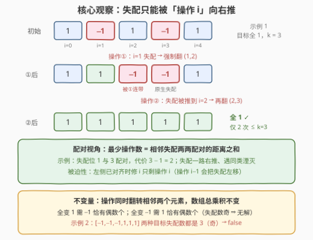
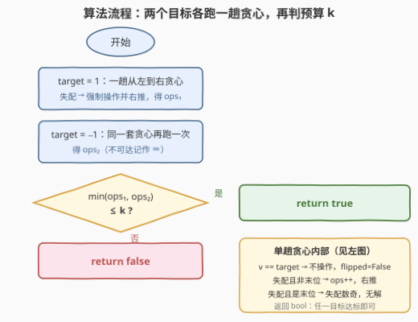

# 数组元素相等转换

- **题目名称**：数组元素相等转换
- **链接**：[3576. 数组元素相等转换](https://leetcode.cn/problems/transform-array-to-all-equal-elements/)
- **难度**：中等
- **标签**：贪心、数组

## 1. 题目概述

给定长度为 $n$、只含 $1$ 和 $-1$ 的整数数组 `nums` 与整数 $k$。一次操作可选择下标 $i$（$0 \le i < n-1$），将 `nums[i]` 与 `nums[i+1]` **同时乘以 $-1$**；同一下标可在不同操作中被多次选择。若**至多 $k$ 次**操作后能使数组**所有元素相等**，返回 `true`，否则返回 `false`。

**示例 1**：

```text
输入：nums = [1,-1,1,-1,1], k = 3
输出：true
解释：i=1 翻转得 [1,1,-1,-1,1]；i=2 再翻转得 [1,1,1,1,1]，2 次即可。
```

**示例 2**：

```text
输入：nums = [-1,-1,-1,1,1,1], k = 5
输出：false
解释：无论怎么操作都无法全等（两个目标的奇偶不变量都不满足）。
```

**约束条件**：

- $1 \le n = nums.length \le 10^5$
- `nums[i]` 的值为 $-1$ 或 $1$
- $1 \le k \le n$

> 💡 **读题关键**：元素只有 $\pm 1$，「全部相等」只有两个候选目标——**全变 1** 或 **全变 $-1$**。操作固定翻转**相邻两个**元素，天然携带「乘积不变量」与「从左往右传导」两个性质，这是全题的破局点。

---

## 2. 解题思路

### 2.1 暴力思路：BFS 所有数组形态

把每个数组形态视作状态、每次操作视作一条边（共 $n-1$ 种），BFS 求到达全等状态的最短步数再与 $k$ 比较。但状态数最坏 $2^n$（$n = 10^5$ 时天文数字），且同一下标可重复选择导致环极多。必须换视角：目标只有两个，操作高度局部化——直接求「变成每个目标的最少操作数」。

### 2.2 核心观察：贪心右推——失配只能被「操作 i」消灭



**观察一（目标坍缩为两个）**：值域是 $\{\pm 1\}$，全等数组只能是全 $1$ 或全 $-1$。分别求最少操作数 $\text{ops}_1$、$\text{ops}_2$，任一 $\le k$ 即 `true`。

**观察二（乘积不变量 ⇒ 可行性）**：操作同时翻转**两个**元素，数组总乘积不变。全 $1$ 的乘积为 $+1$，故「全变 1」可行当且仅当 $-1$ 的个数为**偶数**；同理「全变 $-1$」需要 $1$ 的个数为偶数。等价表述：相对目标的**失配位置必须两两成对**——这正是贪心能「配对湮灭」的根源。

**观察三（贪心的被迫性）**：从左到右扫描，设左侧已全部对齐目标。若当前位置 $i$ 失配，能修它的只有「操作 $i$」与「操作 $i-1$」；而操作 $i-1$ 会翻转已对齐的 $i-1$，等于把失配**左移**，失配总数不减、操作白费。于是**操作 $i$ 被迫执行**：它修好 $i$，但顺带翻转 $i+1$——失配被**右推**。一路推下去，失配最终与后面某个失配相遇而**湮灭**（两次翻转互相抵消）。

由此得到闭式刻画：设相对目标的失配位置为 $p_1 < p_2 < \dots < p_{2m}$（失配数为偶数），则

$$\text{最少操作数} = \sum_{j=1}^{m} \left( p_{2j} - p_{2j-1} \right)$$

即**相邻失配两两配对的距离和**（线段上配对最小化总距离，顺序相邻配对即最优，交换论证可得）。失配数为奇数时该目标不可达——扫描到末位必然剩一个修不掉。

### 2.3 算法流程图



对两个目标各跑一趟 $O(n)$ 贪心：一趟扫描维护操作数 `ops` 与「连带翻转」标记 `flipped`，得到 $\text{ops}_1$、$\text{ops}_2$（不可达记 $\infty$），$\min(\text{ops}_1, \text{ops}_2) \le k$ 即返回 `true`。

### 2.4 示例演算

**示例 1** `nums = [1,-1,1,-1,1]`，$k=3$：

| 目标 | 失配位置 | 最少操作数 | 判定 |
|------|----------|-----------|------|
| 全 $1$ | $1,\ 3$ | $(3-1) = 2 \le 3$ | ✅ → 答案 `true` |
| 全 $-1$ | $0,\ 2,\ 4$ | 失配数 3 为奇 | ❌ 不可达 |

「全 1」逐步走一遍（下划线为当前失配位）：$[1,\underline{-1},1,-1,1] \xrightarrow{\text{操作 }1} [1,1,\underline{-1},-1,1] \xrightarrow{\text{操作 }2} [1,1,1,1,1]$，共 2 次。注意 $n=5$ 为奇数，恰好只有一个目标可行（见面试要点 Q3）。

**示例 2** `nums = [-1,-1,-1,1,1,1]`，$k=5$：$-1$ 有 3 个（奇）⇒ 全 1 不可达；$1$ 有 3 个（奇）⇒ 全 $-1$ 不可达。两个目标全灭 → `false`。

---

## 3. 参考代码

### C++

```cpp
class Solution {
  public:
    bool canMakeEqual(vector<int>& nums, int k) {
        int n = nums.size();
        // 对指定目标求最少操作数；不可达返回 -1
        auto minOps = [&](int target) -> int {
            int ops = 0;
            bool flipped = false;              // nums[i] 是否已被操作 i-1 连带翻转
            for (int i = 0; i < n; ++i) {
                int v = flipped ? -nums[i] : nums[i];
                if (v != target) {
                    if (i == n - 1) return -1; // 末位失配：失配数为奇，不可达
                    ++ops;                     // 操作 i 被迫执行
                    flipped = true;            // 失配右推给 i+1
                } else {
                    flipped = false;           // 不操作，i+1 不被连带
                }
            }
            return ops;
        };
        int a = minOps(1), b = minOps(-1);
        return (a >= 0 && a <= k) || (b >= 0 && b <= k);
    }
};
```

### Python

```python
class Solution:
    def canMakeEqual(self, nums: List[int], k: int) -> bool:
        n = len(nums)

        def min_ops(target: int) -> int:       # 不可达返回 -1
            ops, flipped = 0, False            # flipped：nums[i] 已被操作 i-1 连带翻转
            for i, x in enumerate(nums):
                v = -x if flipped else x
                if v != target:
                    if i == n - 1:
                        return -1              # 末位失配：失配数为奇，不可达
                    ops += 1                   # 操作 i 被迫执行
                    flipped = True             # 失配右推给 i+1
                else:
                    flipped = False            # 不操作，i+1 不被连带
            return ops

        a, b = min_ops(1), min_ops(-1)
        return (0 <= a <= k) or (0 <= b <= k)
```

> 💡 上述贪心已用 BFS 暴力对拍验证：$n \le 7$ 的全部 $2^n$ 种数组 × 全部 $k$ 组合，外加大量随机用例，结果与 BFS 完全一致。

---

## 4. 复杂度分析

| 维度 | 复杂度 | 说明 |
|------|--------|------|
| 时间 | $O(n)$ | 两个目标各一趟线性扫描，每步 $O(1)$ 判断与转移 |
| 空间 | $O(1)$ | 只维护 `ops` 与 `flipped` 两个变量，不复制数组 |

---

## 5. 扩展：三个变体讨论

- **要输出最少操作数（而非 bool）**：直接返回 $\min(\text{ops}_1, \text{ops}_2)$（均不可达返回 $-1$）。用失配配对公式还能免模拟：一次遍历收集失配位置，隔位作差累加即可。
- **操作改为翻转相邻 $k$ 个元素**（$k > 2$）：「最左失配必须被覆盖它的操作修复」依旧成立，但连带范围变长，单个布尔标记不够，需**差分数组 / 滑动窗口**维护当前位置被翻转次数的奇偶——正是 995「K 连续位的最小翻转次数」的套路。
- **先剪枝再贪心**：先数一遍 $-1$ 的个数做奇偶预判，两种目标都不可达直接 `false`，省去扫描。本题量级下无所谓，但**奇偶不变量是证明无解的关键武器**（示例 2 一秒判负），面试中先说不变量再给贪心，层次感立刻出来。

---

## 6. 面试要点

- **Q1：为什么贪心扫描得到的就是最少操作数？**
  答：归纳 + 交换论证。左侧对齐后，位置 $i$ 失配时只有操作 $i$ 与操作 $i-1$ 能修它；操作 $i-1$ 会破坏已对齐的 $i-1$，等价于把失配左移、失配总数不减，可证明任一最优解都可改写为不含这种「左移」的形态。于是操作 $i$ 被迫出现在某个最优解中，逐位归纳即得贪心最优。
- **Q2：怎么快速判断某个目标根本不可达？**
  答：乘积不变量。操作每次翻转两个元素，总乘积不变；全 $1$ 要求乘积 $+1$（即 $-1$ 偶数个），全 $-1$ 要求 $1$ 偶数个。失配数不是偶数 ⇒ 末位必然剩一个修不掉，贪心扫描里体现为「最后一位失配且无处可翻」。
- **Q3：$n$ 的奇偶性对答案有什么影响？**
  答：$n$ 偶数时「$-1$ 偶数个」与「$1$ 偶数个」同时成立或同时不成立，两个目标同生共死；$n$ 奇数时恰好只有一个目标可行（示例 1 中全 $-1$ 便不可达），只需算它。
- **Q4：`flipped` 标记的含义是什么？为什么匹配时要清零？**
  答：`flipped` 表示当前位置已被「操作 $i-1$」连带翻转，读取时须取反。当前值与目标相等说明操作 $i$ 不执行，则 $i+1$ 不被连带，故清零；失配则操作 $i$ 执行、$i+1$ 被连带，故置真。
- **Q5：本题与 995（K 连续位的最小翻转次数）的核心区别？**
  答：骨架同为「最左失配强制修 + 连带状态右传」，但本题连带长度固定为 2，一个布尔标记即可；995 连带长度为 $k$，需差分数组/滑窗维护翻转次数的奇偶。本题可视为 995 的 $k=2$ 手写版。

---

## 7. 同类练习题

- [995. K 连续位的最小翻转次数](https://leetcode.cn/problems/minimum-number-of-k-consecutive-bit-flips/)：同款「最左失配强制修 + 连带右传」贪心，连带长度升为 k 后改用差分/滑窗维护（题解见[K连续位的最小翻转次数](../0901-1000/995_K连续位的最小翻转次数.md)）
- [319. 灯泡开关](https://leetcode.cn/problems/bulb-switcher/)：用奇偶性一步坍缩成因子个数问题，与本题「乘积不变量判可行性」同款思维（题解见[灯泡开关](../0301-0400/319_灯泡开关.md)）
- [1252. 奇数值单元格的数目](https://leetcode.cn/problems/cells-with-odd-values-in-a-matrix/)：行列操作对单元格各自成对作用 ⇒ 奇偶不变量的矩阵版（题解见[奇数值单元格的数目](../1201-1300/1252_奇数值单元格的数目.md)）
- [1526. 形成目标数组的子数组最少增加次数](https://leetcode.cn/problems/minimum-number-of-increments-on-subarrays-to-form-a-target-array/)：从左到右「涨差必付」的被迫贪心，与失配右推同一论证骨架（题解见[形成目标数组的子数组最少增加次数](../1501-1600/1526_形成目标数组的子数组最少增加次数.md)）
