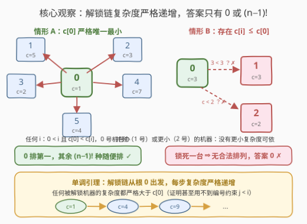
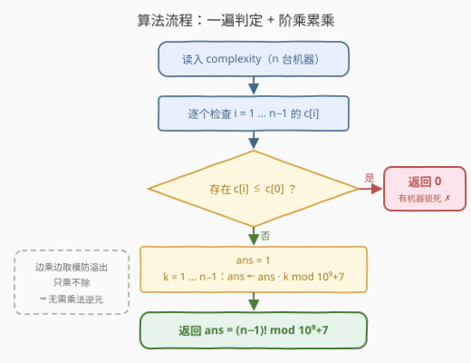

# LeetCode 统计计算机解锁顺序排列数 题解

## 1. 题目概述

- **标题 / 题号**：统计计算机解锁顺序排列数（#3577，medium）
- **链接**：https://leetcode.cn/problems/count-the-number-of-computer-unlocking-permutations/
- **难度**：中等
- **标签**：脑筋急转弯、数组、数学、组合数学

**题意**：房间里有 $n$ 台**上锁**的计算机，编号 $0$ 到 $n-1$，每台都有一个唯一密码，编号 $i$ 的密码复杂度为 $complexity[i]$。解锁规则：

- 可以用编号 $j$ 的计算机的密码解锁编号 $i$ 的计算机，当且仅当 $j < i$ **且** $complexity[j] < complexity[i]$；
- 编号 $0$ 的计算机密码已经解锁（根节点），其余所有计算机必须经由它或其他**已解锁**的计算机来解锁。

求 $[0, 1, \cdots, n-1]$ 的排列中有多少个能表示「从 0 号机出发把所有计算机全部解锁」的有效顺序。答案对 $10^9 + 7$ 取余。

> ⚠️ **读题陷阱**：初始已解锁的是**编号 0** 的那台计算机（按下标固定），而**不是**排列中第一个位置上的那台——不能把排列的首元素当成「免费的根」。

**示例 1**：

```text
输入：complexity = [1,2,3]
输出：2
解释：有效排列是 [0,1,2] 和 [0,2,1]——先用根密码解锁 0 号机；
      之后每台机器都由「编号更小且复杂度更小」的已解锁机器解锁。
```

**示例 2**：

```text
输入：complexity = [3,3,3,4,4,4]
输出：0
解释：不存在任何有效排列。
```

**约束**：

- $2 \le n = complexity.length \le 10^5$
- $1 \le complexity[i] \le 10^9$

> 💡 **读题关键**：别急着把「排列」当成搜索对象。先把「什么样的排列合法」翻译成两条结构性质——**谁必须排第一**、**谁能解锁谁**——计数就会坍缩成一个 $O(n)$ 的判定。

## 2. 解题思路

### 2.1 暴力思路：枚举排列逐一模拟

最直接的做法是枚举全部 $n!$ 个排列，逐个模拟验证：第一个位置必须是 $0$；此后每台 $i$ 要求排列中**更早出现**过某台 $j$，满足 $j < i$ 且 $complexity[j] < complexity[i]$。

单个排列的验证可以做到 $O(n)$（维护「已出现机器的复杂度最小值」即可，因为还需要 $j < i$，故维护的是「编号小于 $i$ 的前缀最小值」）。但 $n!$ 本身就是天文数字，$n \le 10^5$ 下完全不可行——出路不是优化枚举，而是发现**答案只有两个可能取值**。

### 2.2 核心观察：答案要么是 $(n-1)!$，要么是 $0$



**观察一：合法排列的第一个位置必然是 $0$。**
开局唯一可用的是根密码，而它解锁的正是 0 号机。若某台 $i \ge 1$ 排在第一位，它前面没有任何已解锁的机器能为它提供解锁服务，排列立刻非法。

**观察二（单调引理）：任何被解锁的机器，复杂度必严格大于 $complexity[0]$。**
对解锁顺序做归纳：第一台被解锁的是 0 号机本身；此后每台 $i$ 都由某台更早解锁的 $j$ 解锁，要求 $complexity[j] < complexity[i]$——若 $j = 0$，直接得 $complexity[i] > complexity[0]$；若 $j \ne 0$，由归纳假设 $complexity[j] > complexity[0]$，传递下去依然 $complexity[i] > complexity[0]$。换言之，**解锁链从根出发，每一步复杂度严格递增**。

两条观察合起来，答案只剩两种情形：

- **存在 $i \ge 1$ 使 $complexity[i] \le complexity[0]$**（0 号机不是严格唯一的最小值）：由单调引理，这台机器**永远无法被解锁**，答案为 $0$。示例 2 正是如此——1 号机与 0 号机并列最小（$3 = 3$），解锁 1 号机只能靠 $j = 0$，而 $3 < 3$ 不成立。
- **$complexity[0]$ 是严格唯一最小值**（对一切 $i \ge 1$ 都有 $complexity[0] < complexity[i]$）：0 号机排第一后，任何一台 $i$ 在**任意时刻**都能由 0 号机单独解锁（$0 < i$ 且 $complexity[0] < complexity[i]$），后 $n-1$ 个位置**怎么排都合法**，恰好 $(n-1)!$ 种。

$$
\text{answer} =
\begin{cases}
(n-1)! \bmod (10^9+7), & complexity[0] < \min\limits_{i \ge 1} complexity[i] \\[4pt]
0, & \text{否则}
\end{cases}
$$

### 2.3 算法流程图



整个算法 = 一遍线性扫描做判定 + 一个阶乘累乘循环，乘法每一步取模。

### 2.4 示例演算

- $complexity = [1,2,3]$：$c[0]=1$ 严格最小 $\Rightarrow$ $2! = 2$，正是 $[0,1,2]$ 与 $[0,2,1]$。
- $complexity = [3,3,3,4,4,4]$：$c[1]=3 \le c[0]=3$ $\Rightarrow$ $0$（1 号机锁死）。
- $complexity = [2,5,3,7]$：$c[0]=2$ 严格最小 $\Rightarrow$ $3! = 6$。连 $[0,3,1,2]$ 这种「乱序」也合法——$3$、$1$、$2$ 号机每台都能随时由 0 号机（$c=2$）解锁。
- $complexity = [3,5,2,7]$：$c[2]=2 < c[0]=3$，解锁 2 号机需要某台 $c < 2$ 的机器，不存在 $\Rightarrow$ $0$。

## 3. 参考代码

### C++

```cpp
class Solution {
  public:
    int countPermutations(vector<int>& complexity) {
        const long long MOD = 1'000'000'007;
        int n = complexity.size();
        for (int i = 1; i < n; ++i) {
            if (complexity[i] <= complexity[0]) return 0;  // 0 号机不是严格唯一最小值
        }
        long long ans = 1;
        for (int k = 1; k <= n - 1; ++k) ans = ans * k % MOD;  // (n-1)! mod 1e9+7
        return (int)ans;
    }
};
```

### Python

```python
class Solution:
    def countPermutations(self, complexity: List[int]) -> int:
        MOD = 10**9 + 7
        if any(c <= complexity[0] for c in complexity[1:]):
            return 0                     # 0 号机不是严格唯一最小值
        ans = 1
        for k in range(1, len(complexity)):
            ans = ans * k % MOD          # (n-1)! mod 1e9+7
        return ans
```

> 💡 只乘不除，无需乘法逆元；边乘边取模防止溢出（C++ 用 `long long` 中转即可）。

## 4. 复杂度分析

| 维度 | 复杂度 | 说明 |
|------|--------|------|
| 时间 | $O(n)$ | 一遍判定扫描 + $n-1$ 步阶乘累乘，全程取模 |
| 空间 | $O(1)$ | 常数个变量（Python 的 `complexity[1:]` 切片为 $O(n)$ 临时空间，按下标遍历可省去） |

## 5. 扩展：规则微调后答案会变吗

**把严格不等号放宽成 $\le$**（即 $complexity[j] \le complexity[i]$ 即可解锁）：同样的归纳给出「解锁链复杂度**非降**」，被解锁机器的复杂度都 $\ge complexity[0]$。答案变为 $complexity[0]$ 是（非严格）最小值时 $(n-1)!$、否则 $0$——只是「唯一」二字换成「存在」。

**编号约束 $j < i$ 其实是烟雾弹**：注意上面两条引理的证明**都没用到** $j < i$。决定答案的只有「根 + 链上复杂度单调」这一结构——去掉编号约束，答案一字不差。这类「看似图论 / 拓扑序计数，实为一道判定」的落差，正是本题被归为脑筋急转弯的原因。

## 6. 面试要点

- **Q1：为什么排列第一台必须是 0 号机？**
  答：开局唯一可用的是根密码，而根密码解锁的就是 0 号机；任何其他机器排第一时，它之前没有任何已解锁机器，无从解锁。题目末尾的注意正是在强调「根是固定的 0 号，不是排列首元素」。
- **Q2：为什么 $complexity[0]$ 非严格唯一最小值时答案必为 $0$？**
  答：单调引理——对解锁顺序归纳，每台被解锁机器的复杂度严格大于 $complexity[0]$（解锁链从根出发每步严格递增）。于是复杂度 $\le complexity[0]$ 的机器永不可解锁。
- **Q3：为什么恰好是 $(n-1)!$，不多不少？**
  答：0 固定占第一位；其余 $n-1$ 台中每一台在任意时刻都能由 0 号机单独解锁，因此它们在剩余 $n-1$ 个位置上的**任意**排列都合法——共 $(n-1)!$ 种，其余 $n! - (n-1)!$ 个排列全因「首位非 0」非法。
- **Q4：大阶乘取模有什么注意点？**
  答：边乘边 `mod`（`ans = ans * k % MOD`）防溢出；本题只乘不除，不需要预处理阶乘表或乘法逆元。若题目改成「除掉某些排列」，才需要费马小定理求逆元。
- **Q5：数据范围 $10^5$ 提示了什么？**
  答：它否决了 $O(n!)$、$O(n^2)$ 的模拟做法，逼你挖掘结构性质；而答案只有 $0$ 与 $(n-1)!$ 两个取值，问题实质是**可行性判定**而非计数搜索。

## 同类练习题

| # | 题目 | 与本题的关联 |
|---|------|-------------|
| 210 | [课程表 II](https://leetcode.cn/problems/course-schedule-ii/) | 依赖约束下求一种合法顺序（拓扑排序）；本题相当于把「所有合法顺序的个数」退化成星形依赖的极端情形 |
| 1830 | [使字符串有序的最少操作次数](https://leetcode.cn/problems/minimum-number-of-operations-to-make-string-sorted/) | 用阶乘与乘法逆元做排列计数，是 $(n-1)!$ 之外更一般的进阶练习 |
| 2338 | [统计理想数组的数目](https://leetcode.cn/problems/count-the-number-of-ideal-arrays/) | 组合计数 + 取模的综合训练 |
| 2600 | [K 件物品的最大和](https://leetcode.cn/problems/k-items-with-the-maximum-sum/) | 同类脑筋急转弯——看似要过程模拟，实则一个判定加一行公式 |
| 96 | [不同的二叉搜索树](https://leetcode.cn/problems/unique-binary-search-trees/) | 经典计数 DP（卡特兰数），体会计数题为何常常存在封闭形式 |
