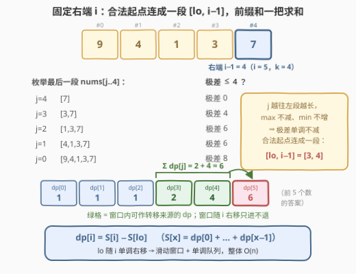
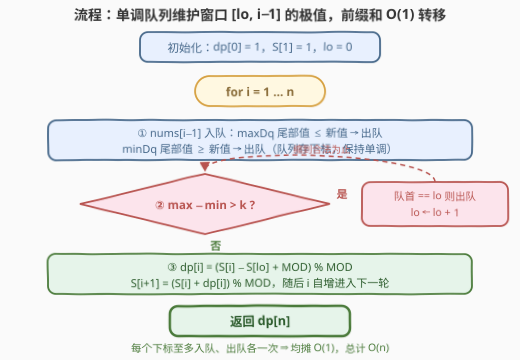

# 统计极差最大为 K 的分割方式数

- **题目名称**：统计极差最大为 K 的分割方式数
- **链接**：[3578. 统计极差最大为 K 的分割方式数](https://leetcode.cn/problems/count-partitions-with-max-min-difference-at-most-k/)
- **难度**：中等
- **标签**：动态规划、滑动窗口、单调队列、前缀和

## 1. 题目概述

给定整数数组 `nums` 与整数 `k`。把 `nums` 分割成**一个或多个非空连续子段**，要求每个子段内**最大值 − 最小值 ≤ k**，返回分割方案总数，结果对 $10^9 + 7$ 取模。

**示例 1**：

```text
输入：nums = [9,4,1,3,7], k = 4
输出：6
解释：6 种合法分割——
[[9],[4],[1],[3],[7]]、[[9],[4],[1],[3,7]]、[[9],[4],[1,3],[7]]、
[[9],[4,1],[3],[7]]、[[9],[4,1],[3,7]]、[[9],[4,1,3],[7]]。
```

**示例 2**：

```text
输入：nums = [3,3,4], k = 0
输出：2
解释：[[3],[3],[4]] 与 [[3,3],[4]]。k = 0 意味着每段内元素必须全相等。
```

**约束条件**：

- $2 \le n \le 5 \times 10^4$
- $1 \le \text{nums}[i] \le 10^9$
- $0 \le k \le 10^9$

> 💡 **读题关键**：① 「分割」是在 $n-1$ 个**间隙**里下刀、段必须**连续**——这是切划分计数，不是子集划分；② 单元素段极差为 $0$，而 $k \ge 0$，故**恒合法**——「全部单切」永远是一种方案，DP 转移永不落空；③ $n$ 达 $5 \times 10^4$ 而方案数可能指数级，必须计数 DP + 取模，且转移要压到均摊 $O(1)$。

---

## 2. 解题思路

### 2.1 暴力思路：枚举最后一段的起点

定义 $\text{dp}[i]$ 为**前 $i$ 个元素**（即 $\text{nums}[0..i-1]$）的合法分割数，$\text{dp}[0] = 1$（空前缀）。枚举**最后一段**的起点 $j$：若段 $\text{nums}[j..i-1]$ 的极差 $\le k$，则 $\text{dp}[i] \mathrel{+}= \text{dp}[j]$：

$$
\text{dp}[i] \;=\; \sum_{j:\ \max(\text{nums}[j..i{-}1]) - \min(\text{nums}[j..i{-}1]) \le k} \text{dp}[j]
$$

判定段合法不必每段重扫——从 $j = i-1$ 向左延伸时**增量维护** max/min，极差一超标就 break。但最坏情形（元素几乎全相等，永不 break）内层跑满 $i$ 次，总量 $O(n^2) \approx 1.25 \times 10^9$，Python 必超时。

暴力虽超时，却暴露了两个可优化的结构：**合法的 $j$ 总是连成一片**，且**合法性只与段的极值有关**。

### 2.2 核心观察：合法起点连成区间 + 单调队列滑窗 + 前缀和



**观察一（单调性 ⇒ 合法起点是一段区间）**。固定右端 $i-1$，把起点 $j$ 向左移动只会让段变长：候选集合变大，**max 只增不减、min 只减不增，极差单调不减**。于是合法起点必是连续区间 $[\,\text{lo}_i,\ i-1\,]$——$j = i-1$ 的单元素段恒合法，区间非空。示例 1 中 $i=5$ 时 $j=4,3$ 合法（极差 $0,4$），$j=2,1,0$ 全部非法（极差 $6,6,8$），合法段恰为 $[3,4]$。

**观察二（lo 单调右移 ⇒ 滑动窗口）**。$i$ 增大时 $\text{lo}_i$ 不会左移：若 $\text{lo}_{i+1} < \text{lo}_i$，则段 $\text{nums}[\text{lo}_{i+1}..i]$ 合法，其子段 $\text{nums}[\text{lo}_{i+1}..i-1]$ 极差只会更小、更合法，与 $\text{lo}_i$ 的最小性矛盾。于是 $(\text{lo},\, i-1)$ 是**只会整体右移的双指针窗口**；窗口 max/min 用**两条单调双端队列**维护（maxDq 值递减、minDq 值递增，均存下标，队首即最值）——与 [1438. 绝对差不超过限制的最长连续子数组](https://leetcode.cn/problems/longest-continuous-subarray-with-absolute-diff-less-than-or-equal-to-limit/) 完全同款。

**观察三（区间和 ⇒ 前缀和）**。转移是 dp 的**区间和**。定义 $S[x] = \text{dp}[0] + \cdots + \text{dp}[x-1]$（前 $x$ 项之和，$S[0] = 0$），则

$$
\text{dp}[i] \;=\; \sum_{j=\text{lo}_i}^{i-1} \text{dp}[j] \;=\; S[i] - S[\text{lo}_i]
$$

$S$ 随递推顺带维护，转移降至 $O(1)$。三者拼起来：**单调队列定界 + 前缀和取数**，总复杂度 $O(n)$。

> ⚠️ **取模减法陷阱**：$S[i]$ 与 $S[\text{lo}]$ 都是取模后的值，直接相减可能为负，必须 `(S[i] - S[lo] + MOD) % MOD`。C++/Java 的 `%` 对负数向零截断，不加 `MOD` 会得到负的残差。

### 2.3 算法流程图



| 步骤 | 动作 | 数据结构 |
|------|------|----------|
| ① | `nums[i-1]` 压入两条单调队列，尾部破坏单调性的先出队 | maxDq / minDq（存下标） |
| ② | 队首极差 `max − min > k` 时右移 `lo`；队首下标恰为 `lo` 的元素出队 | 双指针 + 队列 |
| ③ | `dp[i] = S[i] − S[lo]`（加 MOD 修正），随后滚动更新 `S[i+1]` | 前缀和数组 |

> 💡 **为什么缩窗时只弹队首**：队列里存的是**下标**且保持单调。`lo` 右移只可能淘汰「当前还待在队首」的元素——若 `lo` 经过的下标早已在尾部入队竞争中被淘汰，它根本不在队列里，无需任何操作。`if (front == lo) pop_front()` 一行即可，不存在按值查找。

### 2.4 示例演算

以示例 1（`nums = [9,4,1,3,7]`，`k = 4`）逐个右端演算（`lo` 为合法起点区间的左端）：

| i | 入窗元素 | 窗口 [lo, i−1] | 窗口 max / min | 合法起点 j | dp[i] |
|---|----------|----------------|----------------|------------|-------|
| 1 | 9（下标 0） | [0, 0] | 9 / 9 | {0} | dp[0] = **1** |
| 2 | 4 | [1, 1] | 4 / 4 | {1} | dp[1] = **1** |
| 3 | 1 | [1, 2] | 4 / 1 | {1, 2} | dp[1]+dp[2] = **2** |
| 4 | 3 | [1, 3] | 4 / 1 | {1, 2, 3} | 1+1+2 = **4** |
| 5 | 7 | [3, 4] | 7 / 3 | {3, 4} | 2+4 = **6** |

两处缩窗：$i=2$ 时 $[9,4]$ 极差 $5 > 4$，`lo` 右移到 1；$i=5$ 时 7 入窗后极差变成 6，`lo` 依次越过 1（该下标早已不在队列中）与 2（min=1 的持有者被挤出队首）停在 3。最终 $\text{dp}[5] = 6$ ✓。

---

## 3. 参考代码

### C++

```cpp
class Solution {
  public:
    int countPartitions(vector<int>& nums, int k) {
        const int MOD = 1'000'000'007;
        int n = nums.size();
        vector<long long> dp(n + 1), S(n + 2);   // S[x] = dp[0] + … + dp[x-1]
        dp[0] = 1;                                // 空前缀：1 种方案
        S[1] = 1;
        deque<int> maxDq, minDq;                  // 存下标：maxDq 值递减，minDq 值递增
        int lo = 0;                               // 合法起点区间 [lo, i-1] 的左端
        for (int i = 1; i <= n; ++i) {
            int r = i - 1;                        // 新入窗元素下标
            while (!maxDq.empty() && nums[maxDq.back()] <= nums[r]) maxDq.pop_back();
            maxDq.push_back(r);
            while (!minDq.empty() && nums[minDq.back()] >= nums[r]) minDq.pop_back();
            minDq.push_back(r);
            while (nums[maxDq.front()] - nums[minDq.front()] > k) {  // 缩窗
                if (maxDq.front() == lo) maxDq.pop_front();
                if (minDq.front() == lo) minDq.pop_front();
                ++lo;
            }
            dp[i] = (S[i] - S[lo] + MOD) % MOD;
            S[i + 1] = (S[i] + dp[i]) % MOD;
        }
        return dp[n];
    }
};
```

### Python

```python
from collections import deque


class Solution:
    def countPartitions(self, nums: List[int], k: int) -> int:
        MOD = 1_000_000_007
        n = len(nums)
        dp = [0] * (n + 1)          # dp[i]：前 i 个元素的合法分割数
        S = [0] * (n + 2)           # S[x] = dp[0] + … + dp[x-1]
        dp[0] = S[1] = 1            # 空前缀 1 种方案
        max_dq = deque()            # 存下标，对应值递减：队首即窗口 max
        min_dq = deque()            # 存下标，对应值递增：队首即窗口 min
        lo = 0                      # 合法起点区间 [lo, i-1] 的左端
        for i in range(1, n + 1):
            r = i - 1               # 新入窗元素下标
            while max_dq and nums[max_dq[-1]] <= nums[r]:
                max_dq.pop()
            max_dq.append(r)
            while min_dq and nums[min_dq[-1]] >= nums[r]:
                min_dq.pop()
            min_dq.append(r)
            while nums[max_dq[0]] - nums[min_dq[0]] > k:   # 缩窗直到合法
                if max_dq[0] == lo:
                    max_dq.popleft()
                if min_dq[0] == lo:
                    min_dq.popleft()
                lo += 1
            dp[i] = (S[i] - S[lo] + MOD) % MOD
            S[i + 1] = (S[i] + dp[i]) % MOD
        return dp[n]
```

> 💡 **实现细节**：① 前缀和取**异侧定义** $S[x] = \sum_{j<x} \text{dp}[j]$，转移式 $\text{dp}[i] = S[i] - S[\text{lo}]$ 无需特判 $\text{lo} = 0$（对比 $S[i-1] - S[\text{lo}-1]$ 要处理 $S[-1]$）；② `dp` 数组其实可以滚动成单个变量——$\text{dp}[i]$ 算出后只用于构造 $S[i+1]$，不再单独引用；$S$ 则必须保留，因为 `lo` 会跳跃查询历史；③ C++ 中 `nums[maxDq.front()] - nums[minDq.front()]` 上界约 $10^9$，`int` 不溢出，但 $S$ 累加链必须 `long long` 并逐步取模。

---

## 4. 复杂度分析

| 维度 | 复杂度 | 说明 |
|------|--------|------|
| **时间复杂度** | $O(n)$ | 每个下标在每条队列中至多入队一次、出队一次；`lo` 单向右移至多 $n$ 步；转移为前缀和之差 $O(1)$ |
| **空间复杂度** | $O(n)$ | `dp`、`S` 两个线性数组 + 两条队列（`dp` 可滚动省去，`S` 因随机访问必须保留） |

> - 暴力解为 $O(n^2)$：元素几乎全相等时内层枚举永不提前 break；
> - 把两条队列换成 `multiset` 或双懒删除堆，窗口极值查询变 $O(\log n)$，总量 $O(n \log n)$——正确性不变，但单调队列利用了「左端顺序出、右端入时可直接淘汰弱者」的性质，均摊 $O(1)$ 更优；
> - LeetCode 数据量（$5 \times 10^4$）下 Python 也只需几十毫秒。

---

## 5. 扩展：同一扇窗口的几种消费

「极差 ≤ k 的滑窗 + 双单调队列」是个**母题**，换一种对窗口的消费方式就是一道新题：

| 消费方式 | 题目 | 每个右端做什么 |
|----------|------|----------------|
| 最长窗口 | [1438. 绝对差不超过限制的最长连续子数组](https://leetcode.cn/problems/longest-continuous-subarray-with-absolute-diff-less-than-or-equal-to-limit/) | 记录 $i - \text{lo}$ 的最大值 |
| 数子数组 | [2762. 不间断子数组](https://leetcode.cn/problems/continuous-subarrays/) | 累加 $i - \text{lo} + 1$（以 $i$ 结尾的合法子数组个数） |
| 数分割方案 | **本题** | 对窗口内的 dp 值求和（前缀和之差） |
| 最少段数 | 本题变体 | 贪心：当前段能延伸就延伸到 `lo` 允许的最右处 |

其中「最少段数」的贪心正确性可用交换论证：任何合法分割的第一段都能延长到窗口允许的最右处而不增加段数（剩余部分是被覆盖后缀，段数不增），归纳即得最优。若要求**恰好 $m$ 段**的方案数，则给 dp 加一维：$\text{dp}[m][i] = \sum_{j \in [\text{lo}, i-1]} \text{dp}[m-1][j]$，前缀和照样 $O(1)$ 取数，总量 $O(nm)$。

---

## 6. 面试要点

1. **为什么合法起点构成连续区间？**

   > 固定右端，起点左移只会让段变长：max 不减、min 不增，极差单调不减。合法到非法的转折点只有一个，合法起点是后缀区间 $[\text{lo}, i-1]$。且单元素段极差为 0 恒合法，区间非空——DP 转移永不落空，这是「答案至少为 1」的结构性保证。

2. **为什么 lo 单调不减？缩窗为什么只弹队首？**

   > 反证：若 $\text{lo}_{i+1} < \text{lo}_i$，则段 $[\text{lo}_{i+1}, i]$ 合法，其子段 $[\text{lo}_{i+1}, i-1]$ 更合法，与 $\text{lo}_i$ 的最小性矛盾。缩窗时 `lo` 右移只会让「队首下标 == lo」的元素过期；`lo` 经过的下标若早被尾部淘汰，队列里根本没有它。所以 `if (front == lo) pop_front()` 足矣，不存在按值查找。

3. **为什么用单调双端队列而不是 multiset / 双堆？**

   > 需要的操作是「窗口两端进出 + 查 max/min」。multiset / 懒删除双堆查最值 $O(\log n)$，支持任意进出；单调队列额外利用了两个性质——左端只按 `lo` 顺序出、右端入队时可永久淘汰「注定当不了最值」的元素——从而均摊 $O(1)$。左端只会右移、右端逐格右移，正是单调队列的甜区。

4. **取模减法有什么坑？**

   > $\text{dp}[i] = S[i] - S[\text{lo}]$ 两边都是取模后的非负数，差可能为负；C++/Java 的 `%` 向零截断会得到负残差，必须 `+ MOD` 再 `%`。Python 的 `%` 地板取模天然落回 $[0, \text{MOD})$，但习惯上仍统一写 `+ MOD`，两种语言行为一致、可移植。

5. **dp 数组和前缀和能压缩吗？**

   > `dp` 可以：$\text{dp}[i]$ 算出后只参与构造 $S[i+1]$，滚动成单变量即可。$S$ 不行：转移要查 $S[\text{lo}]$，而 `lo` 每步跳跃的距离任意，随机访问历史需要线性空间。另外把前缀和定义为异侧（$S[x]$ 恰好覆盖前 $x$ 项）可以消掉 $\text{lo}=0$ 的边界特判，代码更干净。

---

## 7. 同类练习题

- [1438. 绝对差不超过限制的最长连续子数组](https://leetcode.cn/problems/longest-continuous-subarray-with-absolute-diff-less-than-or-equal-to-limit/)（[题解](../1401-1500/1438_绝对差不超过限制的最长连续子数组.md)）：同一套双单调队列窗口，消费「窗口长度」而非 dp 之和
- [2762. 不间断子数组](https://leetcode.cn/problems/continuous-subarrays/)（[题解](../2701-2800/2762_不间段子数组.md)）：同款窗口数合法子数组，消费「以右端结尾的子数组个数」
- [239. 滑动窗口最大值](https://leetcode.cn/problems/sliding-window-maximum/)（[题解](../0201-0300/239_滑动窗口最大值.md)）：单调队列原型题，本题两条队列维护逻辑的底层模板
- [2466. 统计构造好字符串的方案数](https://leetcode.cn/problems/count-ways-to-build-good-strings/)（[题解](../2401-2500/2466_统计构造好字符串的方案数.md)）：同为「dp 转移是区间求和 + 前缀和优化」的计数 DP
- [1043. 分隔数组以得到最大和](https://leetcode.cn/problems/partition-array-for-maximum-sum/)（[题解](../1001-1100/1043_分隔数组以得到最大和.md)）：连续子段划分 + 段内极值约束的最优化 DP，与本题计数版互为镜像
