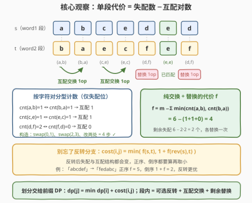
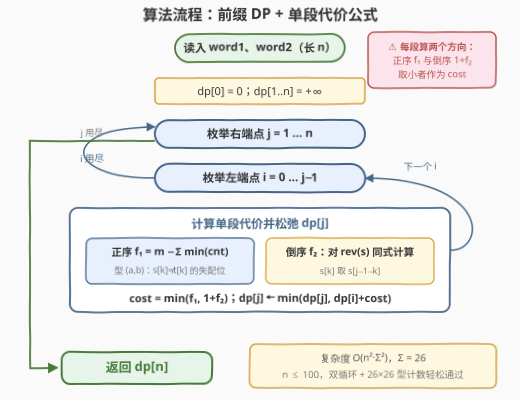

# LeetCode 字符串转换需要的最小操作数 题解

## 1. 题目概述

- **标题 / 题号**：字符串转换需要的最小操作数（#3579，hard）
- **链接**：https://leetcode.cn/problems/minimum-steps-to-convert-string-with-operations/
- **难度**：困难
- **标签**：字符串、动态规划

**题意**：给定两个长度相等的字符串 `word1` 与 `word2`，要求把 `word1` 转换成 `word2`。转换前可以把 `word1` **分割成一个或多个连续子串**，然后对每个子串独立执行下列操作：

- **替换**：将子串中任意一个下标处的字符替换为另一个小写字母；
- **交换**：交换子串中任意两个下标处的字符；
- **反转**：将整个子串反转。

每种操作计为 **1 次**；同一子串内每个字符在**每种操作**中最多参与一次（即一个下标不能参与两次替换、两次交换或两次反转，但「反转 + 替换」「反转 + 交换」这类**跨类型**的组合是允许的——见示例 1 与示例 3）。

**示例 1**：

```text
输入：word1 = "abcdf", word2 = "dacbe"
输出：4
解释：分割为 "ab" | "c" | "df"：
     "ab" 先反转得 "ba"，再把首字符替换成 d 得 "da"（2 次）；
     "c" 无需操作；
     "df" 两次替换得 "be"（2 次）。
```

**示例 2**：

```text
输入：word1 = "abceded", word2 = "baecfef"
输出：4
解释：分割为 "ab" | "ce" | "ded"：
     "ab" 一次交换得 "ba"（1 次）；
     "ce" 一次交换得 "ec"（1 次）；
     "ded" 两次替换得 "fef"（2 次）。
```

**示例 3**：

```text
输入：word1 = "abcdef", word2 = "fedabc"
输出：2
解释：整串先反转得 "fedcba"，再交换下标 3、5 处的字符得 "fedabc"（1 + 1 次）。
```

**约束**：

- $1 \le word1.length = word2.length \le 100$
- `word1`、`word2` 均仅由小写英文字母组成

> 💡 **读题关键**：操作是**子串级**的——反转只能整段反转、交换只能在同一段内进行，所以「怎么分割」本身就是决策的一部分；而每段内部「交换 / 替换 / 要不要反转」的最优组合是可以独立算清楚的小型子问题。整体是「划分型 DP + 段内贪心计数」的两层结构。

## 2. 解题思路

### 2.1 暴力思路

分割方案有 $2^{n-1}$ 种，每个子串内还要决定操作序列，直接枚举是天文数字。退一步：即使分割方案给定，「一段子串最少几步变成目标」本身也不平凡——交换可以一次修好两个位置、反转可以一次挪动一整段，三种操作还受「每个字符每种操作最多参与一次」的约束。所以先把**单段代价**算清楚，再回头做划分，是唯一出路。

### 2.2 核心观察：划分交给前缀 DP，单段代价 = 失配数 − 互配对数



**观察一（划分 → 前缀 DP）**：段与段互不影响，设

$$dp[j] = \text{把 } word1[0..j) \text{ 转换成 } word2[0..j) \text{ 的最小操作数}$$

枚举**最后一段** $[i, j)$：

$$dp[j] = \min_{0 \le i < j}\ \big(dp[i] + cost(i, j)\big), \qquad dp[0] = 0$$

**观察二（段内操作顺序可以规范化）**：替换、交换都能和反转**交换次序**——先在下标 $k$ 处替换再反转，等价于先反转再在镜像下标处替换，代价不变；交换同理（下标镜像）。而反转两次相互抵消。于是任何操作序列都等价于「先决定**是否反转**（0 或 1 次），再做若干交换 + 替换」：

$$cost(i, j) = \min\big(f(s, t),\ 1 + f(\mathrm{rev}(s), t)\big), \qquad s = word1[i{:}j),\ t = word2[i{:}j)$$

**观察三（纯交换 + 替换的代价 $f$）**：逐位对比 $s$ 与 $t$，把**失配**位置按字符对**分型**：位置 $k$ 的型为 $(s[k], t[k])$（$s[k] \ne t[k]$）。

- 一次交换只在两位置**互配**——型 $(a,b)$ 遇上型 $(b,a)$，即 $s[i]=t[j]$ 且 $s[j]=t[i]$——时才**严格划算**：1 次操作修好 2 个失配，而两个替换要 2 次操作；
- 「半配」交换（只修好一边，另一边仍要替换）合计 2 次操作修 2 个失配，与直接两个替换**打平**，可以不考虑；
- 每个下标最多参与一次交换 ⇒ 交换集合是一组**不相交的对换**。型 $(a,b)$ 与型 $(b,a)$ 的位置两两可配、不同型之间互不争抢下标（一个位置只有一种型），因此最大互配对数为

$$\#\mathrm{swap} = \sum_{a < b} \min\big(cnt(a,b),\ cnt(b,a)\big)$$

剩余 $m - 2\cdot\#\mathrm{swap}$ 个失配各需一次替换，合并得

$$f(s, t) = m - \sum_{a < b} \min\big(cnt(a,b),\ cnt(b,a)\big)$$

其中 $m$ 为失配位数，$cnt(a,b)$ 为型 $(a,b)$ 的位置个数。

> ⚠️ **为什么「尽量多互配交换」一定最优**：每多配成一对，恰好省 1 次操作（1 次交换顶 2 次替换）；互配对之间完全独立、无任何副作用，所以取到最大匹配就是最优。而半配交换不赚不亏，忽略它不影响正确性。

### 2.3 算法流程图



外层前缀 DP 枚举 $(i, j)$，每段分别按**正序**与**倒序**统计 $26 \times 26$ 的型计数，套用观察三的公式取小即可。

### 2.4 示例演算

以**示例 3** `word1 = "abcdef"`，`word2 = "fedabc"` 演算整串（$i=0,\ j=6$）这一段：

| 分支 | 对比串 | 失配型（每列一个） | $m$ | $\#\mathrm{swap}$ | 代价 |
|------|--------|--------------------|-----|-------------------|------|
| 正序 $f$ | `abcdef` vs `fedabc` | (a,f) (b,e) (c,d) (d,a) (e,b) (f,c) | 6 | 仅 (b,e)↔(e,b) 配成 1 对，其余 0 → 共 1 | $6-1=5$ |
| 倒序 $1+f$ | `fedcba` vs `fedabc` | (c,a) (a,c)（仅下标 3、5 失配） | 2 | (c,a)↔(a,c) 配成 1 对 → 共 1 | $1+(2-1)=2$ |

$cost(0,6) = \min(5,\ 2) = 2$，整段处理已经最优，故 $dp[6] = 2$ ✓——正序看是「一锅粥」的失配，反转后只剩一对互配字符，**反转分支**正是本题示例 3 的考点。

**示例 1** 同法可验：整段 `abcdf` vs `dacbe` 正序 $f = 4$（无互配对）、倒序 $1 + 3 = 4$；分割 `"ab"|"c"|"df"` 得 $2 + 0 + 2 = 4$，两条路同为最优，答案 4 ✓。

## 3. 参考代码

### C++

```cpp
class Solution {
  public:
    int minOperations(string word1, string word2) {
        int n = word1.size();
        vector<int> dp(n + 1, INT_MAX / 2);
        dp[0] = 0;
        for (int j = 1; j <= n; ++j)
            for (int i = 0; i < j; ++i)
                dp[j] = min({dp[j],
                             dp[i] + cost(word1, word2, i, j, false),
                             dp[i] + 1 + cost(word1, word2, i, j, true)});
        return dp[n];
    }
  private:
    // word1[i:j]（rev = true 时先整段反转）变成 word2[i:j] 所需
    // 「交换 + 替换」的最少次数 = 失配数 − 互配对数
    int cost(const string& w1, const string& w2, int i, int j, bool rev) {
        int cnt[26][26] = {};
        int m = 0;                                  // 失配位数
        for (int k = i; k < j; ++k) {
            char a = rev ? w1[j - 1 - (k - i)] : w1[k];
            char b = w2[k];
            if (a != b) { ++cnt[a - 'a'][b - 'a']; ++m; }
        }
        int swaps = 0;                              // 最大互配对数
        for (int x = 0; x < 26; ++x)
            for (int y = x + 1; y < 26; ++y)
                swaps += min(cnt[x][y], cnt[y][x]);
        return m - swaps;                           // 剩余失配逐个替换
    }
};
```

### Python

```python
class Solution:
    def minOperations(self, word1: str, word2: str) -> int:
        n = len(word1)

        def cost(i: int, j: int, rev: bool) -> int:
            cnt = {}                                # (a, b) 型 → 个数
            m = 0                                   # 失配位数
            for k in range(i, j):
                a = word1[j - 1 - (k - i)] if rev else word1[k]
                b = word2[k]
                if a != b:
                    cnt[(a, b)] = cnt.get((a, b), 0) + 1
                    m += 1
            swaps = 0                               # 最大互配对数
            for (x, y), c in cnt.items():
                if x < y:
                    swaps += min(c, cnt.get((y, x), 0))
            return m - swaps                        # 剩余失配逐个替换

        dp = [float('inf')] * (n + 1)
        dp[0] = 0
        for j in range(1, n + 1):
            for i in range(j):
                dp[j] = min(dp[j],
                            dp[i] + cost(i, j, False),
                            dp[i] + 1 + cost(i, j, True))
        return dp[n]
```

## 4. 复杂度分析

| 维度 | 复杂度 | 说明 |
|------|--------|------|
| 时间 | $O(n^2 \cdot \Sigma^2)$，$\Sigma = 26$ | 每对 $(i, j)$ 按正、倒两个方向各做一遍：失配统计 $O(段长)$（全部求和为 $O(n^3/6)$）+ 互配对求和 $O(\Sigma^2)$；$n \le 100$ 时毫秒级 |
| 空间 | $O(\Sigma^2 + n)$ | $26 \times 26$ 型计数表 + 长度 $n+1$ 的 dp 数组，常数级 |

## 5. 扩展：约束「每个字符每种操作最多一次」到底挡住了什么

若允许同一字符参与**任意多次**交换，段内代价会变成另一个经典问题：把失配位置按字符流向画出「置换环」，长为 $k$ 的环可用 $k-1$ 次交换解决（对比 $k$ 次替换省 1 次），代价函数从「互配对计数」变成「环分解计数」。本题约束恰好把多步交换链堵死——交换只能是一组**不相交的对换**，于是只剩下型 $(a,b)$ 与 $(b,a)$ 的直接互配。识别「约束把哪条路堵死、剩下的最优结构长什么样」，正是这类计数贪心题的破题点。

## 6. 面试要点

- **Q1：为什么反转只需在开头尝试 0 或 1 次？**
  答：替换/交换与反转可交换次序（下标镜像等价，代价不变），反转两次相互抵消，故任何方案都等价于「可选的一次反转 + 交换替换」。体现在代码里就是正序、倒序各算一次再取小。
- **Q2：互配交换为什么取最大匹配？贪心为什么对？**
  答：每对互配交换恰好省 1 次操作（顶 2 次替换）；一个位置只有一种型，互配对之间互不争抢下标，多配一对纯赚 1、无任何副作用，最大匹配即最优。半配交换 2 次操作修 2 个失配，与替换打平，忽略不影响答案。
- **Q3：划分为什么用前缀 DP 就够了？**
  答：段内代价只依赖该段自身的字符，与外部无关（无后效性）；枚举「最后一段」$[i, j)$ 即可完整覆盖所有分割方案，$dp[j] = \min_i dp[i] + cost(i,j)$。
- **Q4：「每个字符每种操作最多参与一次」在解法里体现在哪？**
  答：交换集合必须是不相交对换（一个下标至多参与一次交换）——这正是互配对计数公式的依据；同一位置替换两次没有意义，天然满足；反转至多一次由观察二规范化掉。
- **Q5：倒序分支具体怎么算？容易踩什么坑？**
  答：把 $s[k]$ 换成 $s[j-1-k]$ 后**重新**统计型计数——互配结构可能完全不同（如示例 3 正序 5 步、倒序 2 步）。最常见的错误是只算正序分支漏掉反转，或反转后仍沿用旧的失配统计。

## 同类练习题

| # | 题目 | 与本题的关联 |
|---|------|-------------|
| 72 | [编辑距离](https://leetcode.cn/problems/edit-distance/) | 单串逐位「插/删/改」的经典二维 DP，与本题的子串级操作互为对照（题解见[编辑距离](../0001-0100/72_编辑距离.md)） |
| 132 | [分割回文串 II](https://leetcode.cn/problems/palindrome-partitioning-ii/) | 同为「划分成段使总代价最小」的前缀 DP，段代价换成「是否回文」，预处理代价表的两阶段套路 |
| 813 | [最大平均值和的分组](https://leetcode.cn/problems/largest-sum-of-averages/) | 同款 $dp[j] = \min/\max\big(dp[i] + cost(i,j)\big)$ 骨架，从最小化切换为最大化 |
| 1278 | [分割回文串 III](https://leetcode.cn/problems/palindrome-partitioning-iii/) | 段代价为「改成回文串的最少修改数」，与本题 $f$ 函数的「分型计数」思路同源（题解见[分割回文串III](../1201-1300/1278_分割回文串III.md)） |
