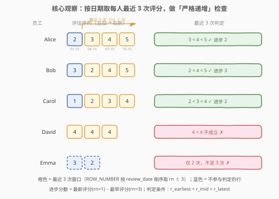
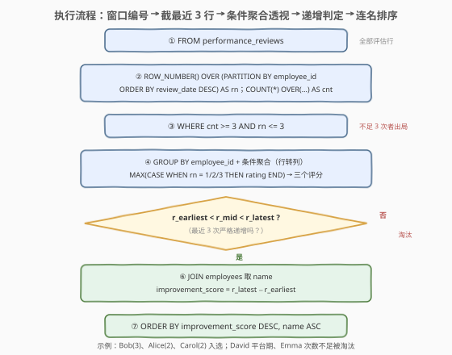

# LeetCode 寻找持续进步的员工 题解

## 1. 题目概述

- **标题 / 题号**：寻找持续进步的员工（#3580，medium）
- **链接**：https://leetcode.cn/problems/find-consistently-improving-employees/
- **难度**：中等
- **标签**：SQL、数据库、窗口函数、`ROW_NUMBER`、条件聚合、JOIN、双键排序

**题意**：两张表：`employees` 记录员工信息，`performance_reviews` 记录绩效评估（评分 1–5，5 分代表优秀，1 分代表较差）。编写一个解决方案，找出**最近三次评估评分严格递增**（每次都比上一次好）的员工，返回 `employee_id`、`name` 与**进步分数**，按进步分数**降序**、名字**升序**排序。

**表结构**：

```text
表: employees
+-------------+---------+
| Column Name | Type    |
+-------------+---------+
| employee_id | int     |   ← 主键
| name        | varchar |
+-------------+---------+
employee_id 是这张表的唯一主键。
每一行包含一名员工的信息。

表: performance_reviews
+-------------+------+
| Column Name | Type |
+-------------+------+
| review_id   | int  |   ← 主键
| employee_id | int  |   ← 指向 employees.employee_id
| review_date | date |
| rating      | int  |   ← 1-5
+-------------+------+
review_id 是这张表的唯一主键。
每一行表示一名员工的绩效评估。
```

**关键规则**：

1. 员工**至少需要 3 次评估**才能被考虑；
2. 根据 `review_date` 分析每位员工**最近的 3 次**评估，评分必须**严格递增**；
3. **进步分数** $=$ 最近 3 次中最后一次评分 $-$ 最早一次评分。

**示例 1**：

```text
输入：
employees 表:
+-------------+----------------+
| employee_id | name           |
+-------------+----------------+
| 1           | Alice Johnson  |
| 2           | Bob Smith      |
| 3           | Carol Davis    |
| 4           | David Wilson   |
| 5           | Emma Brown     |
+-------------+----------------+

performance_reviews 表:
+-----------+-------------+-------------+--------+
| review_id | employee_id | review_date | rating |
+-----------+-------------+-------------+--------+
| 1         | 1           | 2023-01-15  | 2      |
| 2         | 1           | 2023-04-15  | 3      |
| 3         | 1           | 2023-07-15  | 4      |
| 4         | 1           | 2023-10-15  | 5      |
| 5         | 2           | 2023-02-01  | 3      |
| 6         | 2           | 2023-05-01  | 2      |
| 7         | 2           | 2023-08-01  | 4      |
| 8         | 2           | 2023-11-01  | 5      |
| 9         | 3           | 2023-03-10  | 1      |
| 10        | 3           | 2023-06-10  | 2      |
| 11        | 3           | 2023-09-10  | 3      |
| 12        | 3           | 2023-12-10  | 4      |
| 13        | 4           | 2023-01-20  | 4      |
| 14        | 4           | 2023-04-20  | 4      |
| 15        | 4           | 2023-07-20  | 4      |
| 16        | 5           | 2023-02-15  | 3      |
| 17        | 5           | 2023-05-15  | 2      |
+-----------+-------------+-------------+--------+

输出：
+-------------+----------------+-------------------+
| employee_id | name           | improvement_score |
+-------------+----------------+-------------------+
| 2           | Bob Smith      | 3                 |
| 1           | Alice Johnson  | 2                 |
| 3           | Carol Davis    | 2                 |
+-------------+----------------+-------------------+
```

**解释**：

| 员工 | 全部评分（早→新） | 最近 3 次 | 严格递增？ | 进步分数 |
|------|------------------|-----------|------------|----------|
| Alice Johnson | 2, 3, 4, 5 | 3, 4, 5 | ✓ | $5-3=2$ |
| Bob Smith | 3, 2, 4, 5 | 2, 4, 5 | ✓ | $5-2=3$ |
| Carol Davis | 1, 2, 3, 4 | 2, 3, 4 | ✓ | $4-2=2$ |
| David Wilson | 4, 4, 4 | 4, 4, 4 | ✗（4 < 4 不成立） | — |
| Emma Brown | 3, 2 | —（仅 2 次） | ✗（不足 3 次） | — |

排序：Bob（3 分）最高排第一；Alice 与 Carol 同为 2 分，按名字升序 Alice 在前。

**约束**：

- `employee_id`、`review_id` 分别是两表主键；`performance_reviews.employee_id` 指向 `employees.employee_id`
- 评分范围 1–5
- 结果按 `improvement_score` **降序**、`name` **升序**排序

> 💡 **读题关键**：① 「最近 3 次」是按 `review_date` 每人取最新的 3 条——**组内 Top-K**，窗口函数 `ROW_NUMBER` 的主场；② 「严格递增」要逐对比较相邻评分（两个不等式），不能只看首尾；③ 「进步分数」只看这 3 条里的最新减最早。三件事层层递进，全部围着「每人最近 3 行」转。

## 2. 解题思路

### 2.1 暴力思路：逐员工人肉对账

过程式直觉：对每个员工，收集其全部评估按日期升序排列；不足 3 条直接跳过；否则取出最后 3 条 $(r_1, r_2, r_3)$（早→新），若 $r_1 < r_2 < r_3$ 则输出该员工及 $r_3 - r_1$；最后按分数降序、名字升序排序。

```text
for each employee e:
    rs = e 的评估按 review_date 升序
    if len(rs) < 3: skip            # 门槛：至少 3 次
    (r1, r2, r3) = rs[-3:]          # 最近 3 次（早→新）
    if r1 < r2 < r3:                # 严格递增：两个相邻对都成立
        output(e, r3 - r1)          # 进步分数 = 最新 − 最早
sort output by score desc, name asc
```

- **正确性**：与题意一一对应，没有遗漏。
- **效率**：排序每人 $O(m \log m)$（$m$ 为其评估次数），总量 $O(n \log n)$（$n$ 为评估总行数），并不慢。
- **表达方式**：瓶颈不在效率而在**翻译**——纯 SQL 没有显式循环，「每人按日期排序取最近 3 条、行内两两比较、再回表取名」这套流程要映射成**窗口函数 + 分组聚合 + JOIN** 的组合，这是本题唯一的考点。

> ⚠️ 两个易错点先记下：**「最近 3 条」依赖组内排序**（不是 `review_id` 最小/最大，更不是物理行序）；**「严格递增」是两个不等式**（$r_1 < r_2$ 且 $r_2 < r_3$），不是"首尾不相等"或"最小 < 最大"——详见 5.1 节的反例。

### 2.2 核心观察：窗口函数定序 + 条件聚合透视



把暴力思路的三个动作逐一翻译成 SQL：

| 业务语言 | SQL 语言 |
|----------|----------|
| 每人按日期**倒序**编号（最新一条 rn=1） | `ROW_NUMBER() OVER (PARTITION BY employee_id ORDER BY review_date DESC)` |
| 至少 3 次评估（组内总行数） | `COUNT(*) OVER (PARTITION BY employee_id) AS cnt`，过滤 `cnt >= 3` |
| 每人最近 3 条 | `WHERE rn <= 3`（倒序编号下 rn=1/2/3 恰好是最新/次新/第三新） |
| 3 条评分两两比较 | **条件聚合**透视成一行三列：`MAX(CASE WHEN rn=k THEN rating END)` |
| 严格递增 | `r_earliest < r_mid AND r_mid < r_latest` |
| 进步分数 | `r_latest - r_earliest` |

> 💡 **为什么倒序编号？** 正序编号下「最近 3 条」要说成 `rn >= cnt - 2`，必须先知道总数；倒序编号下 `rn <= 3` 恒成立地指向最新 3 条，**不用知道总数就能截窗口**，门槛条件（`cnt >= 3`）由窗口计数独立负责。两法等价（正序版见 5.3 节），倒序版更直观。
>
> 💡 **条件聚合（行转列）**：`MAX(CASE WHEN rn = 1 THEN rating END)` 在分组内把「rn=1 那一行的 rating」拎出来当一列——每组 rn=1 的行至多一条，`MAX` 只是在这至多一个非 NULL 值里取值，起到"抽取"作用。三列到手后，"逐对比较相邻评分"就退化成普通 `WHERE` 里的两个不等式。

### 2.3 算法流程图



**逻辑执行顺序**：

| 阶段 | 子句 | 作用 |
|------|------|------|
| ① | `FROM performance_reviews` | 确定输入：全部评估行 |
| ② | 窗口函数（CTE `ranked`） | 每人按日期倒序编号 `rn`；窗口计数 `cnt` |
| ③ | `WHERE cnt >= 3 AND rn <= 3` | 不足 3 次者整组出局；每人只留最近 3 行 |
| ④ | `GROUP BY employee_id` + 条件聚合 | 透视出 `r_latest / r_mid / r_earliest` 三列 |
| ⑤ | `WHERE r_earliest < r_mid AND r_mid < r_latest` | 严格递增判定（两个不等式都成立） |
| ⑥ | `JOIN employees` + 计算差值 | 取 `name`；`improvement_score = r_latest - r_earliest` |
| ⑦ | `ORDER BY improvement_score DESC, name ASC` | 双键排序收尾 |

> 💡 **窗口函数求值时机**：`ROW_NUMBER()`/`COUNT(*) OVER` 在 `SELECT` 阶段附近求值，**晚于 WHERE**——所以不能在同一个查询层里写 `WHERE ROW_NUMBER() ... <= 3`，必须先用 CTE（或派生表）物化窗口结果，再在外层 WHERE 过滤。这是窗口函数题的第一坑。

### 2.4 示例演算

对示例数据走一遍 ②→⑦ 链路（`rn` 按日期倒序，`cnt` 为评估总数）：

| 员工 | cnt | 最近 3 行（rn=3 → rn=1，早→新） | r_earliest | r_mid | r_latest | 递增判定 | 进步分数 |
|------|-----|--------------------------------|------------|-------|----------|----------|----------|
| Alice | 4 | 3, 4, 5 | 3 | 4 | 5 | $3<4$ 且 $4<5$ ✓ | $5-3=2$ |
| Bob | 4 | 2, 4, 5 | 2 | 4 | 5 | $2<4$ 且 $4<5$ ✓ | $5-2=3$ |
| Carol | 4 | 2, 3, 4 | 2 | 3 | 4 | $2<3$ 且 $3<4$ ✓ | $4-2=2$ |
| David | 3 | 4, 4, 4 | 4 | 4 | 4 | $4<4$ 不成立 ✗ | 淘汰 |
| Emma | 2 | —（③ 阶段出局） | — | — | — | cnt < 3 ✗ | 淘汰 |

- **③ 阶段（WHERE）**：Emma 仅 2 次评估，`cnt >= 3` 不满足，整组出局；
- **④ 阶段（透视）**：每人至多 3 行进组，条件聚合转成一行三列——注意 Alice 的第 1 次评估（评分 2，2023-01-15）因 `rn = 4 > 3` 被留在窗外，**不参与**递增判定与进步分数（这就是 Bob 拿 3 分而 Alice 只有 2 分的原因：Bob 窗内最早是低谷 2，Alice 的低谷 2 在窗外）；
- **⑤ 阶段（判定）**：David 三次全 4 分，$4 < 4$ 为假，淘汰；
- **⑦ 阶段（排序）**：Bob（3）> Alice（2）= Carol（2），同分按名字升序 Alice 在前 → `Bob, Alice, Carol`，与预期输出一致。

## 3. 参考代码

### SQL（解法 A：ROW_NUMBER 倒序 + 条件聚合，推荐）

```sql
WITH ranked AS (
    SELECT employee_id,
           rating,
           ROW_NUMBER() OVER (PARTITION BY employee_id
                              ORDER BY review_date DESC, review_id DESC) AS rn,
           COUNT(*)     OVER (PARTITION BY employee_id) AS cnt
    FROM performance_reviews
),
last3 AS (
    SELECT employee_id,
           MAX(CASE WHEN rn = 1 THEN rating END) AS r_latest,
           MAX(CASE WHEN rn = 2 THEN rating END) AS r_mid,
           MAX(CASE WHEN rn = 3 THEN rating END) AS r_earliest
    FROM ranked
    WHERE cnt >= 3 AND rn <= 3
    GROUP BY employee_id
)
SELECT e.employee_id,
       e.name,
       l.r_latest - l.r_earliest AS improvement_score
FROM last3 l
JOIN employees e ON e.employee_id = l.employee_id
WHERE l.r_earliest < l.r_mid
  AND l.r_mid < l.r_latest
ORDER BY improvement_score DESC, e.name ASC;
```

> 💡 **写法要点**：
> - **`ranked` 物化窗口结果**：`rn`/`cnt` 在 CTE 里算好后就是普通列，`last3` 的 WHERE 才能引用——绕开"窗口函数不能进 WHERE"的限制；
> - **`ORDER BY review_date DESC, review_id DESC`**：`review_id` 是次级排序键，日期相同的罕见情形下保证编号确定（见 5.2 节）；
> - **`WHERE cnt >= 3 AND rn <= 3` 一次完成两件事**：不足 3 次者连一行都进不了组（`rn=3` 的行不存在，透视出 `r_earliest` 为 NULL，后续不等式对 NULL 求值为 UNKNOWN，同样会被过滤——双保险）；每人恰好保留最近 3 行；
> - **`MAX(CASE WHEN ...)`** 是"抽取"而非"求最大"：每组中 `rn=k` 的行至多一条，MAX 只负责把这一个非 NULL 值取出来；
> - **严格递增写全两个不等式**：`r_earliest < r_mid AND r_mid < r_latest`，缺一不可（见 5.1 节反例）；
> - **`ORDER BY improvement_score DESC, e.name ASC`**：ORDER BY 在 SELECT 之后执行，可直接用列别名。

### SQL（解法 B：排名自连接——把 rn=1/2/3 三行 JOIN 到一起）

```sql
WITH ranked AS (
    SELECT employee_id,
           rating,
           ROW_NUMBER() OVER (PARTITION BY employee_id
                              ORDER BY review_date DESC, review_id DESC) AS rn
    FROM performance_reviews
)
SELECT e.employee_id,
       e.name,
       r1.rating - r3.rating AS improvement_score
FROM ranked r3
JOIN ranked r2  ON r2.employee_id = r3.employee_id AND r2.rn = 2
JOIN ranked r1  ON r1.employee_id = r3.employee_id AND r1.rn = 1
JOIN employees e ON e.employee_id = r3.employee_id
WHERE r3.rn = 3                       -- 有 rn=3 的行 ⇔ 至少 3 次评估
  AND r3.rating < r2.rating           -- 最早 < 中间
  AND r2.rating < r1.rating           -- 中间 < 最新
ORDER BY improvement_score DESC, e.name ASC;
```

> 💡 **与解法 A 的差异**：不再分组透视，而是让 `rn=3` 的行分别与同员工 `rn=2`、`rn=1` 的行连接成一行，三个评分自然并列成三列。**"至少 3 次"由 `r3.rn = 3` 隐式表达**——不足 3 次的员工没有 rn=3 的行，自然出局，连 `cnt` 窗口都省了。代价是自连接需要按 `(employee_id, rn)` 找配对行（有索引/小数据量时无压力）。两种范式都值得会：**透视版**好扩展成"取更多统计列"，**自连接版**好扩展成"比较任意两条"（如 197 题）。

### Python（pandas）

```python
import pandas as pd

def find_consistently_improving_employees(employees: pd.DataFrame,
                                          performance_reviews: pd.DataFrame) -> pd.DataFrame:
    pr = performance_reviews.sort_values(['employee_id', 'review_date'])
    pr['cnt'] = pr.groupby('employee_id')['rating'].transform('size')
    last3 = pr[pr['cnt'] >= 3].groupby('employee_id', sort=False).tail(3)
    seq = last3.groupby('employee_id', sort=False)['rating'].apply(list)
    seq = seq[seq.apply(lambda r: r[0] < r[1] < r[2])]
    score = seq.apply(lambda r: r[2] - r[0]).reset_index(name='improvement_score')
    ans = employees.merge(score, on='employee_id', how='inner')
    ans = ans.sort_values(['improvement_score', 'name'], ascending=[False, True])
    return ans[['employee_id', 'name', 'improvement_score']].reset_index(drop=True)
```

> 💡 **pandas 对照**：
> - `sort_values(['employee_id', 'review_date'])` 一步完成"分区 + 组内按日期升序"——之后 `groupby.tail(3)` 取每组**末尾** 3 行，恰好是日期最新的 3 条；
> - `transform('size')` 对应 `COUNT(*) OVER (PARTITION BY ...)`：按员工广播总行数，供布尔筛选 `cnt >= 3`；
> - `apply(list)` 把每组最近 3 个评分收成列表 `[早, 中, 新]`，`r[0] < r[1] < r[2]` 链式比较一行表达严格递增（Python 连写不等式即"两两比较"，与 SQL 的两个不等式等价）；
> - `merge(..., how='inner')` 对应 INNER JOIN：被筛掉的员工不会出现在结果里；
> - `sort_values(..., ascending=[False, True])` 一行实现双键排序。

## 4. 复杂度分析

设 $n$ = `performance_reviews` 行数，$m$ = `employees` 行数，$k$ = 结果行数。

| 维度 | 复杂度 | 说明 |
|------|--------|------|
| **时间** | $O(n \log n + k \log k)$ | 窗口函数按 `(employee_id, review_date)` 分区排序占大头；条件聚合线性扫过 $\le 3n'$ 行（$n'$ 为达标员工数 $\times 3$）；最终排序只作用于结果集 $k$ 行 |
| **空间** | $O(n)$ | CTE 物化窗口结果 + 透视后的每员工一行 |
| **中间行数** | $\le 3n'$ | `WHERE rn <= 3` 之后每员工至多 3 行，透视前规模已收缩 |
| **是否需排序** | 是 | 窗口排序（隐式）+ 结果 `ORDER BY`（显式）共两处 |

> ⚠️ 解法 B 的三个自连接若 `(employee_id, rn)` 上没有索引/哈希支撑，最坏退化为 $O(n^2)$；数据量大时解法 A 的"一次排序 + 一次分组"更稳。面试中说清"窗口排序是主要成本、判定与透视只线性扫一遍"即可。

## 5. 扩展

### 5.1 为什么不能只用 MIN < MAX（或首尾不等）判断递增

设最近 3 次评分为 $[2, 4, 3]$：$\min=2 < \max=4$，首尾 $2 \ne 3$，但序列**并非递增**（$4 \to 3$ 在下降）。**MIN/MAX 只能回答"首尾之间有涨幅"，不能回答"路径单调"**；"首尾不等"连方向都保证不了（可能整体在跌）。严格递增必须**逐对比较相邻元素**——3 个元素就是 2 个不等式 $r_1 < r_2$ 且 $r_2 < r_3$。推广到 $k$ 个元素需要 $k-1$ 个不等式都成立，这也是 180 题（连续三次相同）等"连续性判定"题的通用姿势。

### 5.2 review_date 相同怎么办（排序键并列）

`ROW_NUMBER` 的排序键并列时编号**不确定**，同一查询两次执行可能给出不同结果（不可重现）。工程习惯是补一个次级键保证确定性——本题用 `review_id DESC`（`review_id` 递增通常对应录入先后，与业务时间方向一致）。题面数据通常保证同一员工日期互不相同，加次级键属于**零成本保险**。另外注意 `ROW_NUMBER` / `RANK` / `DENSE_RANK` 在并列时的差异：本题要"恰好取 3 行"，必须用**唯一编号**的 `ROW_NUMBER`；`RANK` 并列会跳号、`DENSE_RANK` 并列不跳号，都可能让"rn ≤ 3"多取或少取行。

### 5.3 变体：正序编号 + LEAD 判定

正序编号（rn=1 最早）同样可解：「最近 3 行」变成 `rn >= cnt - 2`；严格递增可用 **LEAD** 相邻比较——最近 3 行中恰有 2 个相邻对（rn=cnt−2 与 rn=cnt−1），两对都"升"即递增：

```sql
WITH ordered AS (
    SELECT employee_id, rating,
           ROW_NUMBER() OVER (PARTITION BY employee_id ORDER BY review_date, review_id) AS rn,
           COUNT(*)     OVER (PARTITION BY employee_id) AS cnt,
           LEAD(rating) OVER (PARTITION BY employee_id ORDER BY review_date, review_id) AS next_rating
    FROM performance_reviews
)
SELECT e.employee_id, e.name,
       MAX(CASE WHEN o.rn = cnt THEN rating END)
     - MAX(CASE WHEN o.rn = cnt - 2 THEN rating END) AS improvement_score
FROM ordered o
JOIN employees e ON e.employee_id = o.employee_id
WHERE o.cnt >= 3
GROUP BY e.employee_id, e.name
HAVING SUM(CASE WHEN o.rn >= o.cnt - 2 AND o.rating < o.next_rating THEN 1 ELSE 0 END) = 2
ORDER BY improvement_score DESC, e.name ASC;
```

> 💡 **对照**：`LEAD(rating)` 取窗口排序中**下一行**的评分——正序排列下"下一行"就是"下一次评估"，`rating < next_rating` 即"这一次比上一次好"。最后一行（rn=cnt）的 `next_rating` 为 NULL，`rating < NULL` 求值为 UNKNOWN 归入 `ELSE 0`，恰好不计数。`HAVING ... = 2` 要求最近 3 行里的 2 个相邻对全部上升。这个写法把"递增判定"做成**可数的相邻对**，推广到"连续 $k$ 次递增"时只需把 `= 2` 改成 `= k-1`、`rn >= cnt-2` 改成 `rn >= cnt-k+1`，比条件聚合逐列展开更好扩展。

## 6. 面试要点

**Q1：「每人最近 3 次」怎么取？为什么用倒序 ROW_NUMBER？**

> 组内 Top-K 标准姿势：`ROW_NUMBER() OVER (PARTITION BY employee_id ORDER BY review_date DESC)` 给每人按日期倒序编号，最新一条恒是 rn=1，`rn <= 3` 即最近 3 次。倒序的好处是**截窗口不需要知道总数**；"至少 3 次"的门槛由 `COUNT(*) OVER (PARTITION BY ...)` 独立把关。注意窗口函数不能直接写进 WHERE，必须先经 CTE/派生表物化再过滤。

**Q2：判断"严格递增"为什么不能只比 MIN/MAX 或首尾？**

> 反例 $[2,4,3]$：MIN < MAX、首尾不等，但 $4 \to 3$ 在下降。MIN/MAX 只说明首尾有落差，不保证路径单调。严格递增必须**逐对比较相邻元素**——3 个元素即 $r_1 < r_2$ 且 $r_2 < r_3$ 两个不等式同时成立；$k$ 个元素要 $k-1$ 个。SQL 里可用条件聚合后的不等式（解法 A/B）或 LEAD 相邻比较（5.3 节）实现。

**Q3：`MAX(CASE WHEN rn = 1 THEN rating END)` 这行在干什么？为什么用 MAX？**

> 条件聚合"行转列"：分组内 rn=1 的行至多一条，CASE 把其余行的 rating 置为 NULL，聚合函数负责把这**唯一的非 NULL 值**拎出来。MAX/MIN/SUM/AVG 效果相同（都在"至多一个非 NULL 值"上运算），MAX 是惯例。它把"每人 3 行"透视成"每人 1 行 3 列"，让逐对比较退化成普通 WHERE 不等式。

**Q4：`COUNT(*) OVER (PARTITION BY ...)` 和 `GROUP BY + COUNT(*)` 有什么区别？**

> 前者是**窗口聚合**：不折叠行，每行都带上组内总数（本题还要用 `rn` 配合，行不能折叠）；后者是**分组聚合**：每组折叠成一行。本题需要"既保留每行（带编号）又知道组大小"，正是窗口函数的用武之地。窗口函数在 SELECT 阶段附近求值、晚于 WHERE，所以 `cnt`/`rn` 的过滤必须外包一层。

**Q5：进步分数为什么 Alice 是 2 而不是 3？**

> 进步分数只在**最近 3 次窗口内**计算：Alice 全程 2→3→4→5 总涨幅 3，但最早的评分 2（2023-01-15）在窗外，窗口内是 3→4→5，得分 $5-3=2$。Bob 的低谷评分 2 恰好落在窗内（2023-05-01），得分 $5-2=3$ 反超——**窗口边界直接决定分数**，这也是"先截窗、后计算"顺序不能颠倒的原因。

> 💡 **一句话总结**：3580 = 组内 Top-K（倒序 `ROW_NUMBER` 截 `rn ≤ 3`）+ 窗口计数把关门槛（`cnt ≥ 3`）+ 条件聚合透视成三列 + 两个不等式判严格递增 + JOIN 取名 + 双键排序。考点在窗口函数的求值时机、以及"递增判定必须逐对比较"这个易错点。

## 同类练习题

| # | 题目 | 与本题的关联 |
|---|------|-------------|
| 1549 | [每件商品的最新订单](https://leetcode.cn/problems/the-most-recent-orders-for-each-product/)（[站内题解](../1501-1600/1549_每件商品的最新订单.md)） | 组内按时间取最新一条（`rn = 1`）的母题，本题把「取 1 条」扩成「取 3 条并比较」 |
| 1070 | [产品销售分析III](https://leetcode.cn/problems/product-sales-analysis-iii/)（[站内题解](../1001-1100/1070_产品销售分析III.md)） | 组内取首条（`rn = 1` 过滤），同一 `ROW_NUMBER` 骨架的最简版 |
| 180 | [连续出现的数字](https://leetcode.cn/problems/consecutive-numbers/) | 判断连续 3 行满足条件（`LAG`/自连接），与本题「连续 3 次递增」同套路，可练 5.3 节的 LEAD 写法 |
| 197 | [上升的温度](https://leetcode.cn/problems/rising-temperature/) | 「比上一次高」的最小单元——相邻行比较（自连接或 `LAG`），是本题递增判定的原子操作 |
| 550 | [游戏玩法分析IV](https://leetcode.cn/problems/game-play-analysis-iv/)（[站内题解](../0501-0600/550_游戏玩法分析IV.md)） | 窗口函数 + 分组过滤的组合应用，练"窗口结果再聚合"的分层写法 |
