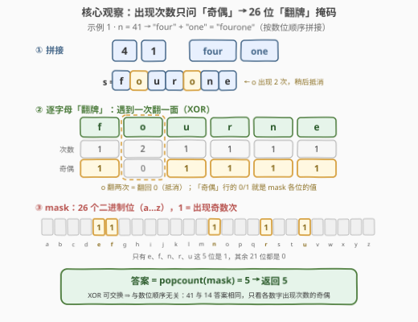
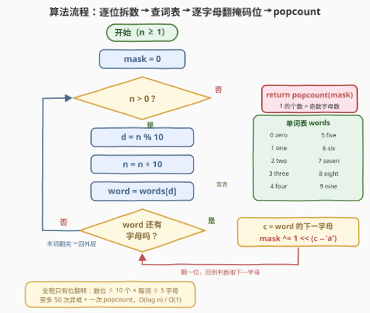

# LeetCode 计算数字中的奇数字母数量 题解

## 1. 题目概述

- **标题 / 题号**：计算数字中的奇数字母数量（#3581，easy）
- **链接**：https://leetcode.cn/problems/count-odd-letters-from-number/
- **难度**：简单
- **标签**：哈希表、字符串、位运算、计数、模拟

> ⚠️ 本题为 LeetCode 付费题，题意描述根据官方示例用例与 hints 重建，可能与官方题面有出入。

**题意**：给定一个整数 $n$，执行以下步骤：

1. 将 $n$ 的每个数位转换为它的小写英文单词（例如 $4 \to$ "four"，$1 \to$ "one"）；
2. 将这些单词按**原始数字顺序**拼接成字符串 $s$；
3. 返回 $s$ 中出现**奇数次**的**不同**字符的数量。

**示例 1**：

```text
输入：n = 41
输出：5
解释：41 → "four" + "one" = "fourone"
出现奇数次的字母：'f'、'u'、'r'、'n'、'e'（'o' 出现 2 次不算）→ 答案 5
```

**示例 2**：

```text
输入：n = 20
输出：5
解释：20 → "two" + "zero" = "twozero"
出现奇数次的字母：'t'、'w'、'z'、'e'、'r'（'o' 出现 2 次不算）→ 答案 5
```

**约束**：

- $1 \le n \le 10^9$（至多 10 个数位）

> 💡 **读题关键**：① 问的是「不同字符」的**个数**，不是奇数次出现的总次数；② 只关心每个字母出现次数的**奇偶性**，不关心具体次数——这是位运算掩码的典型信号；③ 单词按数位顺序拼接，但后面会看到：由于异或的可交换性，**顺序其实不影响答案**。

## 2. 解题思路

### 2.1 暴力思路：拼接字符串 + 逐字母计数

最直接的模拟：把 $n$ 的每个数位换成单词拼出 $s$，用计数表（`Counter`）统计每个字母的出现次数，最后数一数有多少个计数是奇数。

```text
words = ["zero","one","two","three","four","five","six","seven","eight","nine"]
s = "".join(words[int(c)] for c in str(n))     # 41 → "fourone"
cnt = Counter(s)                                # {f:1, o:2, u:1, r:1, n:1, e:1}
return sum(v % 2 for v in cnt.values())         # 5 个奇数计数
```

- **正确性**：与题意逐字对应，无遗漏；
- **效率**：$n \le 10^9$ 至多 10 位、每词至多 5 个字母，$|s| \le 50$，$O(|s|)$ 毫无压力；
- **可改进点**：计数表里 26 个计数，我们最终只用了每个值的**奇偶**（`v % 2`）——整个计数过程可以压缩进**一个整数**。

### 2.2 核心观察：奇偶性 → 26 位 XOR「翻牌」掩码



**关键想法**：不数「出现了几次」，只维护「出现次数是奇还是偶」。给 26 个字母各分配一个二进制位（`a` → 第 0 位，…，`z` → 第 25 位），用一个整数 `mask` 表示全部奇偶状态：

1. **遇到字母 `c` 就翻一面**：`mask ^= 1 << (c - 'a')`——某位被翻转奇数次即为 1（该字母出现奇数次），偶数次为 0；
2. **一次异或 = 计数 +1 再取模 2**：异或天然是「模 2 加法」，全程无需维护真实计数；
3. **答案 = `mask` 中 1 的个数**：`popcount(mask)`。

以 $n = 41$ 为例："four" 翻起 $f,o,u,r$ 四位，"one" 再翻 $o,n,e$——其中 $o$ 被翻第二次、**抵消**回 0，最终 mask 的 1 位恰好是 $\{f,u,r,n,e\}$，共 5 个。

> 💡 **再进一步：每个数字的掩码可以预计算**。单词固定 ⇒ 每个数字 $d$ 的「奇偶掩码」$\text{dmask}[d]$ 是常量（如 $\text{dmask}[3] = \{t,h,r\}$，"three" 中 $e$ 出现 2 次自动抵消）。主循环对每个数位做一次 `mask ^= dmask[d]` 即可。又因为 **XOR 满足交换律**，数位的处理顺序无关——答案只由「每个数字出现次数的奇偶」决定：41 与 14 答案相同。

| d | 单词 | 奇数字母（dmask 中为 1 的位） |
|---|------|------------------------------|
| 0 | zero | z, e, r, o |
| 1 | one | o, n, e |
| 2 | two | t, w, o |
| 3 | three | t, h, r（e × 2 抵消） |
| 4 | four | f, o, u, r |
| 5 | five | f, i, v, e |
| 6 | six | s, i, x |
| 7 | seven | s, v, n（e × 2 抵消） |
| 8 | eight | e, i, g, h, t |
| 9 | nine | i, e（n × 2 抵消） |

### 2.3 算法流程图



**流程要点**：

| 步骤 | 动作 | 说明 |
|------|------|------|
| ① | `mask = 0` | 26 位全 0：还没有任何字母出现 |
| ② | `d = n % 10; n /= 10` | 从**个位**开始逐位拆数，无需转字符串 |
| ③ | `word = words[d]` | 数位 → 单词，查常量表 |
| ④ | 遍历 `word` 的每个字母 `c` | `mask ^= 1 << (c - 'a')`，翻对应位 |
| ⑤ | 回到 ②，直到 `n == 0` | 外层循环跑完所有数位 |
| ⑥ | `return popcount(mask)` | 1 的个数 = 奇数字母数 |

> ⚠️ 循环条件用 `while (n > 0)`：本题保证 $n \ge 1$，至少会处理一位；若题目允许 $n = 0$，需改用 do-while 或特判（0 → "zero" → 4 个奇数字母），否则会一位都不处理。

### 2.4 示例演算

**示例 1：$n = 41$**

| 步骤 | word | 翻动的位 | mask 中为 1 的字母 |
|------|------|----------|--------------------|
| 初始 | — | — | （空） |
| 数位 4 | "four" | f, o, u, r | {f, o, u, r} |
| 数位 1 | "one" | o, n, e | {f, o, u, r} ⊕ {o, n, e} = {f, u, r, n, e}（o 抵消） |
| 收尾 | — | — | popcount = **5** ✓ |

**示例 2：$n = 20$**

| 步骤 | word | 翻动的位 | mask 中为 1 的字母 |
|------|------|----------|--------------------|
| 数位 2 | "two" | t, w, o | {t, w, o} |
| 数位 0 | "zero" | z, e, r, o | {t, w, o} ⊕ {z, e, r, o} = {t, w, z, e, r}（o 抵消） |
| 收尾 | — | — | popcount = **5** ✓ |

**再看一个「全抵消」的例子：$n = 11$** → "one" ⊕ "one" = 0，所有位翻偶数次回到 0，答案为 **0**——两个相同数位对答案的贡献必为 0，也印证了「顺序无关、只看奇偶」。

## 3. 参考代码

### C++

```cpp
class Solution {
public:
    int countOddLetters(int n) {
        static const array<string, 10> words = {
            "zero", "one", "two", "three", "four",
            "five", "six", "seven", "eight", "nine"};

        int mask = 0;
        while (n > 0) {
            for (char c : words[n % 10]) {
                mask ^= 1 << (c - 'a');   // 翻面：奇数次 → 1，偶数次 → 0
            }
            n /= 10;
        }
        return __builtin_popcount(mask);   // 1 的个数 = 奇数字母数
    }
};
```

### Python

```python
class Solution:
    def countOddLetters(self, n: int) -> int:
        words = ["zero", "one", "two", "three", "four",
                 "five", "six", "seven", "eight", "nine"]

        mask = 0
        while n:
            for c in words[n % 10]:
                mask ^= 1 << (ord(c) - ord('a'))   # 翻面（模 2 计数）
            n //= 10
        return mask.bit_count()                     # Python 3.10+
```

> 💡 **写法要点**：
> - **从个位拆数**（`n % 10` + `n //= 10`）避免字符串转换；$n \ge 1$ 保证 `while` 至少执行一轮；
> - `popcount` 各语言写法：C++ `__builtin_popcount` / C++20 `std::popcount`，Python 3.10+ `int.bit_count()`（低版本可用 `bin(mask).count('1')`），Java `Integer.bitCount`；
> - 掩码至多 26 位，`int` 足够，无溢出问题。

## 4. 复杂度分析

设 $d$ 为数位个数（$n \le 10^9 \Rightarrow d \le 10$），每个单词至多 5 个字母。

| 维度 | 复杂度 | 说明 |
|------|--------|------|
| **时间** | $O(d \times 5) = O(\log n)$ | 每个数位查一次词表 + 至多 5 次异或，至多 50 次位翻转 + 1 次 popcount |
| **空间** | $O(1)$ | 一个 `int` 掩码；词表为 10 个固定常量（也可预计算成 10 个掩码常量，见 5.1） |

> 💡 拼接法 $O(|s|)$ 与掩码法 $O(d)$ 同阶，本题规模下无差别；掩码版的价值在于**思路降维**（计数 → 奇偶）与 $O(1)$ 空间——这是能迁移到更难题目的通用套路。

## 5. 扩展

### 5.1 预计算数字掩码：每个数位只做一次异或

把 10 个数字的奇偶掩码预计算成表（见 2.2 的 dmask 表），主循环每位只需一次异或：

```python
class Solution:
    def countOddLetters(self, n: int) -> int:
        words = ["zero", "one", "two", "three", "four",
                 "five", "six", "seven", "eight", "nine"]
        dmask = [0] * 10
        for d, w in enumerate(words):      # 预计算：每个数字的奇偶掩码
            for c in w:
                dmask[d] ^= 1 << (ord(c) - 97)

        mask = 0
        while n:
            mask ^= dmask[n % 10]          # 每个数位只做一次异或
            n //= 10
        return mask.bit_count()
```

由「XOR 交换律 + dmask 常量表」可得一个漂亮推论：**答案与数位顺序无关**——$n$ 与其数位重排（41 与 14、123 与 321）答案相同，甚至与「哪些数位出现偶数次」也无关，只有出现**奇数次**的数字才对 mask 有贡献。

### 5.2 为什么「只问奇偶」就能丢掉计数？（正确性一句话证明）

归纳易证：处理完前 $k$ 个字母后，`mask` 的第 $i$ 位 $=$ （第 $i$ 个字母出现次数）$\bmod\ 2$——每次异或恰把对应位「+1 mod 2」，与计数器加一后取模完全同步。因此凡是最终只问**奇偶性**的统计问题（本题、136 只出现一次的数字、389 找不同），都可以用异或掩码把「计数数组」降维成「一个整数」。

## 6. 面试要点

**Q1：为什么用一个整数就能代替 26 个计数器？**

> 因为答案只依赖每个字母出现次数的**奇偶性**。把字母 $c$ 映射到 `mask` 的第 $c - 'a'` 位，`mask ^= 1 << (c - 'a')` 等价于「该字母计数 +1 后取模 2」：奇数次出现 ⇔ 对应位为 1，偶数次 ⇔ 0。

**Q2：`popcount(mask)` 数的是什么？**

> mask 中值为 1 的位数 = 出现奇数次的**不同**字母个数，正是题目所求。注意题目问的是「不同字符的数量」，不是「奇数次出现的总次数」——后者要把所有奇数计数加起来，两者只在每个奇计数都恰为 1 时才相等。

**Q3：从个位开始拆数（`n % 10`、`n /= 10`）有什么注意点？**

> 本题 $n \ge 1$，`while (n > 0)` 至少处理一位；若输入可能为 0（本题不会），需 do-while 或特判，否则 0 会一位都不处理（0 的正确输出是 "zero" → 4）。另外要先 `d = n % 10` 再 `n /= 10`，顺序颠倒会把 d 弄丢。

**Q4：两个相同的数位（如 n = 11）对答案的贡献是什么？**

> 贡献为 0：同一个单词翻两遍，每位都回到原状（$x \oplus x = 0$）。推论：答案与数位顺序无关（XOR 交换律），只由每个数字出现次数的奇偶决定——41 与 14 同答案。

**Q5：`popcount` 有哪些实现？**

> 内置：C++ `__builtin_popcount` / C++20 `std::popcount`，Python 3.10+ `int.bit_count()`（低版本 `bin(mask).count('1')`），Java `Integer.bitCount`，Go `bits.OnesCount`。手写经典是 Brian Kernighan 法：`mask &= mask - 1` 每次消去最低位的 1，循环计数，复杂度 $O(\text{1 的个数})$（见 191 题）。

> 💡 **一句话总结**：3581 = 逐位拆数 + 词表映射 + 「奇偶降维」——26 个计数器压成一个 XOR 翻牌掩码，popcount 收尾。考点在识别「只问奇偶」这一信号与位运算基本功。

## 同类练习题

| # | 题目 | 与本题的关联 |
|---|------|-------------|
| 389 | [找不同](https://leetcode.cn/problems/find-the-difference/)（[站内题解](../0301-0400/389_找不同.md)） | 同样是「计数只问奇偶」——两串拼接后恰有一个字母落单，26 位 XOR 掩码直接找出它 |
| 191 | [位 1 的个数](https://leetcode.cn/problems/number-of-1-bits/)（[站内题解](../0001-0100/191_位1的个数.md)） | popcount 母题，含 `mask &= mask - 1` 每次消一个 1 的手写写法 |
| 2595 | [奇偶位数](https://leetcode.cn/problems/number-of-even-and-odd-bits/)（[站内题解](../2501-2600/2595_奇偶位数.md)） | 按二进制位下标的奇偶统计 1 的个数，练逐位扫描与 popcount |
| 2180 | [统计各位数字之和为偶数的整数个数](https://leetcode.cn/problems/count-integers-with-even-digit-sum/)（[站内题解](../2101-2200/2180_统计各位数字之和为偶数的整数个数.md)） | 同样是「逐位拆整数 + 只关心奇偶」的数位模拟 |
| 1281 | [整数各位积和之差](https://leetcode.cn/problems/subtract-the-product-and-sum-of-digits-of-an-integer/)（[站内题解](../1201-1300/1281_整数各位积和之差.md)） | `n % 10` / `n //= 10` 逐位取数的最小练手题 |
