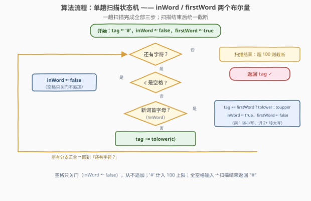

# LeetCode 为视频标题生成标签 题解

## 1. 题目概述

- **标题 / 题号**：为视频标题生成标签（#3582，easy）
- **链接**：https://leetcode.cn/problems/generate-tag-for-video-caption/
- **难度**：简单
- **标签**：字符串、模拟

**题意**：给你一个字符串 `caption`，表示一个视频的标题。要求**按顺序**执行以下三步，生成视频的有效标签：

1. **驼峰拼接**：将所有单词组合为单个**驼峰命名字符串**，并在最前面加上 `#`。驼峰命名指：**除第一个单词外**，其余单词的**首字母大写**；且**每个单词首字母之后的字符必须是小写**（第一个单词整体小写，见示例 1 的 `Leetcode → leetcode`）；
2. **清洗**：移除所有**不是英文字母**的字符，但保留第一个字符 `#`；
3. **截断**：将结果截断为**最多 100 个字符**。

对 `caption` 执行完上述操作后，返回生成的标签。

**示例 1**：

```text
输入：caption = "Leetcode daily streak achieved"
输出："#leetcodeDailyStreakAchieved"
解释：除 "leetcode" 以外的所有单词的首字母需要大写。
```

**示例 2**：

```text
输入：caption = "can I Go There"
输出："#canIGoThere"
解释：除 "can" 以外的所有单词的首字母需要大写。
```

**示例 3**：

```text
输入：caption = "hhh…h"（101 个 h）
输出："#hhh…h"（'#' 加 99 个 h，共 100 个字符）
解释：第一个单词长度为 101，加上 '#' 共 102 个字符，需要从末尾截去 2 个。
```

**约束**：

- $1 \le \text{caption.length} \le 150$；
- `caption` 仅由**英文字母**和**空格**组成。

> 💡 **读题关键**：① 三个步骤**按顺序**执行——顺序本身就是语义的一部分（见 2.2）；② 「每个单词首字母之后的字符必须是小写」意味着**词内已有的大写要被压下去**：`"GO"` 作非首单词得 `"Go"`；③ 截断的 100 个字符**包含 `#`**——示例 3 里 101 个 `h` 只留下 99 个。

## 2. 解题思路

### 2.1 暴力思路：直译题面三步

最直接的写法照搬题面流水线：`split()` 分词 → 逐词大小写变换 → 拼 `#` 前缀 → 截断 100：

```text
words = caption.split()
tag = "#" + w0.lower() + w1.capitalize() + w2.capitalize() + ...
return tag[:100]
```

这已经是 $O(n)$ 的正解，本题真正的考点全藏在**易错点**里：

- **词内大小写要归一**：`"can GO there"` 的第二个词是 `"GO"`——`capitalize()` 处理成 `"Go"`；若只对首字母 `upper()`、不动其余字符，会得到 `"GO"`，答案错成 `#canGOthere`；
- **截断长度含 `#`**：上限 100 指的是**最终字符串**的总长，不是单词部分；
- **极端输入**：约束只说 `caption` 由字母和空格组成、长度 $\ge 1$，**没保证至少有一个字母**——全空格输入下 `split()` 得到空表，直球写法 `words[0].lower()` 直接越界，正确结果应是 `"#"`。

### 2.2 核心观察：顺序是语义的一部分，三步可折叠成单趟扫描


**观察 1：步骤顺序不可交换。** 空格是**唯一的分词依据**：第 1 步「驼峰拼接」消耗掉词界信息，第 2 步才「去非字母」。若反过来先删空格，`"can I Go There"` 会熔成一个词 `"canIGoThere"`，驼峰规则无从施加，只能得到全小写的 `#canigothere`——**词界信息一旦丢弃就无法恢复**。这正是题面强调「按顺序」的原因。

**观察 2：本题输入里第 2 步是「空操作」。** `caption` 仅含字母和空格，唯一的非字母字符就是空格，而分词拼串时空格已经消失——第 2 步与第 1 步**天然合并**。（它真正防御的是一般情形：若标题含数字、连字符等，这些字符**不构成分词边界**，只是被丢弃。）

**观察 3：三步合并为单趟扫描，只需两个布尔量。** 逐字符扫一遍：

- `inWord`：当前字符是否处在某个单词内部（等价于上一个字符不是空格）——空格的唯一作用是「关门」；
- `firstWord`：是否还没遇见过任何单词——首个单词的首字母转小写，之后所有单词的首字母转大写；单词内的其余字符一律转小写。

扫描结束后统一截断到 100。整个过程没有分词容器、没有正则、没有中间串，**一趟过**。

> ⚠️ 大小写规则的精确表达：词 1 **整体小写**；词 2+ 的**首字母大写、其余小写**——即 `lowerCamelCase`。`"I"`、`"Go"` 这类单字母词或已含大写的词，都被同一套规则覆盖。

### 2.3 算法流程图



**逻辑执行步骤**：

| 步骤 | 动作 | 说明 |
|------|------|------|
| ① | 初始化 `tag="#"`、`inWord=false`、`firstWord=true` | `#` 先占位，计入 100 上限 |
| ② | 逐字符扫描 `c` | 空格：`inWord=false`，不追加任何字符 |
| ③ | `c` 是新词首字母（`!inWord`） | `inWord=true`；`firstWord` 为真转小写并清标志，否则转大写 |
| ④ | `c` 是词内字符 | 一律 `tolower` 后追加 |
| ⑤ | 扫描结束 | `tag` 超过 100 则截断，返回 |

> 💡 也可以在第 ③④ 步追加后顺手判 `tag.size() == 100` 提前退出——上限 150 的输入最多省 50 次循环，属于聊胜于无的微优化。

### 2.4 示例演算

以 `caption = "can I Go There"` 为例（`·` 表示空格）：

| 字符 | 状态判定 | 动作 | tag |
|------|----------|------|-----|
| `c` | 新词首字母，`firstWord=true` | `tolower` 追加，`firstWord=false` | `#c` |
| `a`、`n` | 词内 | `tolower` 追加 | `#can` |
| `·` | 空格 | `inWord=false`，不追加 | `#can` |
| `I` | 新词首字母，`firstWord=false` | `toupper` 追加 | `#canI` |
| `·` | 空格 | `inWord=false` | `#canI` |
| `G` | 新词首字母 | `toupper` 追加 | `#canIG` |
| `o` | 词内 | `tolower` 追加 | `#canIGo` |
| `·` | 空格 | `inWord=false` | `#canIGo` |
| `T` | 新词首字母 | `toupper` 追加 | `#canIGoT` |
| `h`、`e`、`r`、`e` | 词内 | `tolower` 追加 | `#canIGoThere` |

长度 12 $\le$ 100，无需截断，答案 `#canIGoThere` ✓。再看混合大小写 `"GO go GO"`：词 1 `"GO"` 整体小写得 `"go"`；词 2 `"go"` 首字母大写得 `"Go"`；词 3 `"GO"` 规整成 `"Go"`——最终 `#goGoGo`，验证「词内已有大写要被压小」。截断分支即示例 3：`#` + 101 个 `h` 共 102 字符，砍掉尾部 2 个，恰为 100。

## 3. 参考代码

### C++（解法一：`istringstream` 分词，直译三步）

```cpp
#include <sstream>

class Solution {
  public:
    string generateTag(string caption) {
        string tag = "#", w;
        istringstream ss(caption);
        bool first = true;
        while (ss >> w) {                       // >> 自动跳过连续/首尾空格
            for (int i = 0; i < (int)w.size(); ++i)
                w[i] = (i == 0 && !first) ? toupper(w[i]) : tolower(w[i]);
            tag += w;
            first = false;
        }
        if (tag.size() > 100) tag.resize(100);
        return tag;
    }
};
```

> 💡 `ss >> w` 天然处理连续空格与首尾空格；大小写规则浓缩在一行三目里：**非首词的第 0 位转大写，其余全部转小写**——词 1 的首字母落在「其余」里，自然小写。

### C++（解法二：单趟扫描状态机，对应 2.2）

```cpp
class Solution {
  public:
    string generateTag(string caption) {
        string tag = "#";
        bool inWord = false, firstWord = true;
        for (char c : caption) {
            if (c == ' ') { inWord = false; continue; }
            if (!inWord) {                      // 新单词的首字母
                inWord = true;
                tag += firstWord ? (char)tolower(c) : (char)toupper(c);
                firstWord = false;
            } else {                            // 单词内的其余字母
                tag += (char)tolower(c);
            }
        }
        if (tag.size() > 100) tag.resize(100);
        return tag;
    }
};
```

> 💡 空格只负责「关门」（`inWord=false`），从不追加；`firstWord` 在首个单词的首字母落地时清零。全空格输入扫完 `tag` 仍是 `"#"`，天然正确——不依赖任何下标访问，也就没有越界可言。

### Python（分词 + `capitalize`）

```python
class Solution:
    def generateTag(self, caption: str) -> str:
        words = caption.split()                 # 自动跳过连续/首尾空格
        return ('#' + ''.join(
            w.lower() if i == 0 else w.capitalize()
            for i, w in enumerate(words)
        ))[:100]
```

> 💡 `str.capitalize()` 恰好就是「首字母大写、其余小写」，与驼峰规则逐字对应；空表时 `join` 结果为空串，返回 `"#"[:100] = "#"`，越界危机被生成器写法自然化解（对比 `words[0].lower()` 的直球写法在全空格输入下会 `IndexError`）。

## 4. 复杂度分析

| 维度 | 复杂度 | 说明 |
|------|--------|------|
| 时间复杂度 | $O(n)$ | $n = \text{caption.length} \le 150$；每个字符一次 $O(1)$ 判定与拼接（分词版的隐含扫描同样是 $O(n)$） |
| 空间复杂度 | $O(1)$ | 输出串至多 100 字符；状态机只用了两个布尔量（分词版的临时单词串也不超过输入长度） |

> ⚠️ 本题的坑不在复杂度：把「截断 100」误解为不含 `#` 会多留 1 个字符；用「先删非字母 → 再驼峰」的反序流水线会直接输出全小写串——两个坑都比性能更值得防。

## 5. 扩展：大小写转换的底层细节

`tolower` / `toupper` 远比看上去质朴：

- **C 标准只承诺 ASCII**：`std::tolower(int)` 收到负值实参（如 `char` 为有符号且 $\ge$ 0x80 的 UTF-8 字节）是**未定义行为**。本题输入是英文字母，无虞；工程代码应写 `(char)tolower((unsigned char)c)` 双重转换；
- **位技巧**：ASCII 字母大小写只差第 5 位——`c | 0x20` 变小写、`c & 0xDF` 变大写（对字母以外的字符不成立，用前必须先 `isalpha` 判断）；
- **locale 与 Unicode**：C++ 的 `tolower(c, std::locale)`、Python 的 `str.lower()` 都是编码/区域感知的——Unicode 大小写甚至不是双射（土耳其语的 `İ/i`、德语 `ß/SS`）。真实世界的 hashtag 生成还要考虑非 ASCII 词界（社交平台用 `\b` 或 ICU 分词，所以 `#伊莉丝`、`#café` 都能成词），本题的「空格分词」只是最简模型。

## 6. 面试要点

1. **为什么必须「先驼峰、再去非字母」，反过来不行？**

   > 空格是唯一的分词依据。第 1 步用空格切词并拼串，词界信息随之消耗；第 2 步才清洗。若先删空格，`"can I Go There"` 熔成单词 `"canIGoThere"`，驼峰规则无从施加，只能得到 `#canigothere`——**顺序敏感的清洗流水线，先做破坏性强的操作会永久丢信息**。

2. **截断的 100 个字符含 `#` 吗？词内已有的大写怎么处理？**

   > 含。上限作用于**最终标签**整体，示例 3 中 101 个 `h` 只留 99 个。词内已有大写一律压小：规则是「词 1 整体小写；词 2+ 首字母大写、**其余小写**」——`"GO"` 作非首单词得 `"Go"`，作首单词得 `"go"`。

3. **连续空格、首尾空格、全空格输入分别怎么处理？**

   > 前两者：`split()` / `ss >> w` 天然跳过；状态机版靠 `inWord` 标志（空格只关门，不追加）。全空格：没有单词，三步执行完就是 `"#"`——状态机写法天然正确；分词直球写法 `words[0].lower()` 会越界，要用 `enumerate` 生成器或先判空。

4. **状态机版比分词版好在哪？坏在哪？**

   > 好在：一趟扫描、零中间串、无分词容器，边界情形（全空格、连续空格）全自动正确。坏在：可读性略逊——大小写规则散落在多个分支里，分词版一行三目就能看清；且 `firstWord` 清零时机写错（比如在空格处清零）会把第二个词误当词 1。面试先用分词版讲清规则，再给状态机版展示功底，是最稳的节奏。

5. **如果放宽约束——标题可含数字、连字符等，怎么改？**

   > 题面三步本来就为一般情形设计：**非字母字符不是分词边界**，只是被丢弃。状态机里把「跳过」的范围扩大——非字母一律不追加，但**只有空格才关门**（`inWord=false`），数字、连字符等只是被丢弃、不影响词态；分词版按空格切词照旧，拼串前用 `isalpha` 过滤即可。两法结果一致：`"abc-123 def"` 的词是 `"abc-123"` 与 `"def"`，输出 `#abcDef`。

## 同类练习题

| # | 题目 | 与本题的关联 |
|---|------|-------------|
| 482 | [密钥格式化](https://leetcode.cn/problems/license-key-formatting/)（[题解](../0401-0500/482_密钥格式化.md)） | 同款「清洗 + 大小写规整 + 重组」字符串流水线，还多一道分组逻辑 |
| 2129 | [将标题首字母大写](https://leetcode.cn/problems/capitalize-the-title/)（[题解](../2101-2200/2129_将标题首字母大写.md)） | 按词长分类的大小写规则，对照体会「规则拆到逐字符」的套路 |
| 1816 | [截断句子](https://leetcode.cn/problems/truncate-sentence/)（[题解](../1801-1900/1816_截断句子.md)） | 按词数上限截断 vs 本题按字符上限截断，同一动作的两种粒度 |
| 709 | [转换成小写字母](https://leetcode.cn/problems/to-lower-case/)（[题解](../0701-0800/709_转换成小写字母.md)） | 大小写转换的最小单元，第 5 节位技巧的展开场 |
| 58 | [最后一个单词的长度](https://leetcode.cn/problems/length-of-last-word/)（[题解](../0001-0100/58_最后一个单词的长度.md)） | 从尾部反向扫描对付连续空格，与 `inWord` 开关门是同一套状态思想 |
