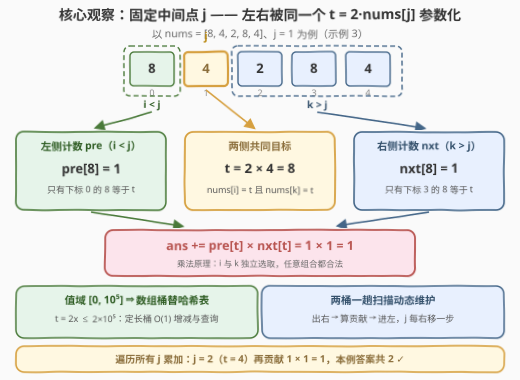
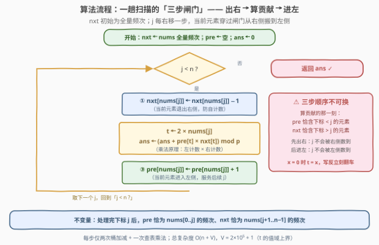

# LeetCode 统计特殊三元组 题解

## 1. 题目概述

- **标题 / 题号**：统计特殊三元组（#3583，medium）
- **链接**：https://leetcode.cn/problems/count-special-triplets/
- **难度**：中等
- **标签**：数组、哈希表、计数

**题意**：给你一个整数数组 `nums`。**特殊三元组**定义为满足以下条件的下标三元组 $(i, j, k)$：

- $0 \le i < j < k < n$，其中 $n = \text{nums.length}$；
- $\text{nums}[i] = \text{nums}[j] \times 2$；
- $\text{nums}[k] = \text{nums}[j] \times 2$。

返回数组中特殊三元组的总数。由于答案可能非常大，返回结果对 $10^9 + 7$ 取余数后的值。

**示例 1**：

```text
输入：nums = [6,3,6]
输出：1
解释：唯一的特殊三元组是 (i, j, k) = (0, 1, 2)：
      nums[0] = 6 = 3 × 2，nums[2] = 6 = 3 × 2。
```

**示例 2**：

```text
输入：nums = [0,1,0,0]
输出：1
解释：唯一的特殊三元组是 (i, j, k) = (0, 2, 3)：
      三个位置都是 0，而 0 = 0 × 2。
```

**示例 3**：

```text
输入：nums = [8,4,2,8,4]
输出：2
解释：(0, 1, 3)：nums[0] = nums[3] = 8 = 4 × 2；
      (1, 2, 4)：nums[1] = nums[4] = 4 = 2 × 2。
```

**约束**：

- $3 \le n = \text{nums.length} \le 10^5$；
- $0 \le \text{nums}[i] \le 10^5$。

> 💡 **读题关键**：① $i$ 与 $k$ 的约束是**同一个值** $\text{nums}[j] \times 2$——三元组的两个端点要求完全对称，天然适合**固定中间点**；② 答案要取模说明数量可能巨大（全 0 数组有 $\binom{n-1}{2} \approx 5 \times 10^9$ 个三元组）；③ $0$ 是映射 $x \mapsto 2x$ 的唯一不动点（$2 \times 0 = 0$），示例 2 全靠它成立，但通用逻辑无需特判。

## 2. 解题思路

### 2.1 暴力思路：三重循环枚举

直译定义：三重循环枚举所有 $i < j < k$，逐个检查两条等式：

```text
for i in range(n):
    for j in range(i+1, n):
        for k in range(j+1, n):
            if nums[i] == 2*nums[j] and nums[k] == 2*nums[j]:
                ans += 1
```

$n \le 10^5$ 时三元组总数达 $\binom{n}{3} \approx 1.7 \times 10^{14}$，必然超时。退一步枚举 $(j, k)$、用哈希表批量查左侧的 $i$，也只是 $O(n^2) \approx 10^{10}$，同样不可行——必须把**每一侧的合法计数整体维护出来**，而不是逐对查询。

### 2.2 核心观察：枚举中间点，左右独立计数再相乘



**观察 1：枚举对象选中间点 $j$。** 固定 $j$ 后，令 $t = 2 \times \text{nums}[j]$（一个定值），则：

- 左侧合法的 $i$：$i < j$ 且 $\text{nums}[i] = t$，共 $\text{pre}[t]$ 个；
- 右侧合法的 $k$：$k > j$ 且 $\text{nums}[k] = t$，共 $\text{nxt}[t]$ 个。

两个子问题被**同一个 $t$ 参数化**，且互相独立。若枚举端点 $i$，右侧还剩 $(j, k)$ 两层相互纠缠的约束；枚举中间点恰好把约束**从中间切开**，左右各自坍缩成「值域上的频次查询」。

**观察 2：乘法原理合并两侧。** 任取左侧一个 $i$、右侧一个 $k$ 都拼出合法三元组，故 $j$ 的贡献为

$$\text{ans} \mathrel{+}= \text{pre}[t] \times \text{nxt}[t]$$

**观察 3：两个频次桶一趟扫描即可维护。** 维护「$j$ 左边的值频次 $\text{pre}$」与「$j$ 右边的值频次 $\text{nxt}$」：$\text{nxt}$ 初始化为全量频次，$\text{pre}$ 初始化为空；$j$ 从左到右推进时，当前元素**先出 $\text{nxt}$、算完贡献、再进 $\text{pre}$**——像一道闸门，把数组动态切成左右两段。又因值域 $[0, 10^5]$ 给出 $t \le 2 \times 10^5$，两个普通数组桶就能替代哈希表。

> ⚠️ **取模与溢出**：单个乘积 $\text{pre}[t] \times \text{nxt}[t]$ 上界约 $(5 \times 10^4)^2 = 2.5 \times 10^9$，超过 `int32`——C++ 必须 `long long` 中转再取模；本题只有加法与乘法，取模后不会出现负数（无需 DP 减法那种 `+MOD` 补救）。

### 2.3 算法流程图



**逻辑执行步骤**：

| 步骤 | 动作 | 说明 |
|------|------|------|
| ① | `nxt` 初始化为 `nums` 的全量频次，`pre` 清空，`ans = 0` | 一开始所有元素都在 $j$ 的「右侧」 |
| ② | 对每个下标 $j$（从左到右）：`nxt[nums[j]] -= 1` | 当前元素退出右侧，防止被自己数到 |
| ③ | `t = 2 * nums[j]`；`ans = (ans + pre[t] * nxt[t]) % MOD` | 此刻 `pre` 恰含下标 $< j$ 的元素、`nxt` 恰含下标 $> j$ 的元素 |
| ④ | `pre[nums[j]] += 1` | 当前元素进入左侧，服务后续的 $j'$ |
| ⑤ | 扫描结束，返回 `ans` | 每个下标恰好当过一次中间点 |

> 💡 **不变量**：计算贡献的那一刻，`pre` 恰好是 `nums[0..j-1]` 的频次表、`nxt` 恰好是 `nums[j+1..n-1]` 的频次表——「先出右、后进左」的顺序保证 $j$ 自己永远不会被任何一侧数到。$x = 0$ 时 $t = x$，若顺序写反（例如先 `pre[x]++` 再算贡献），$j$ 会被左计数多吃一次，示例 2 就是现成的反例用例。

### 2.4 示例演算

以 `nums = [8,4,2,8,4]` 为例，跟踪两个桶的变化（只列非零项）：

| $j$ | $\text{nums}[j]$ | 出右后 `nxt` | $t = 2\,\text{nums}[j]$ | `pre[t]` | `nxt[t]` | 贡献 | 累计 `ans` | 进左后 `pre` |
|-----|------|--------------|------|------|------|------|------|--------------|
| 0 | 8 | `{8:1, 4:2, 2:1}` | 16 | 0 | 0 | 0 | 0 | `{8:1}` |
| 1 | 4 | `{8:1, 4:1, 2:1}` | 8 | 1 | 1 | **1** | 1 | `{8:1, 4:1}` |
| 2 | 2 | `{8:1, 4:1}` | 4 | 1 | 1 | **1** | 2 | `{8:1, 4:1, 2:1}` |
| 3 | 8 | `{4:1}` | 16 | 0 | 0 | 0 | 2 | `{8:2, 4:1, 2:1}` |
| 4 | 4 | `{}` | 8 | 2 | 0 | 0 | 2 | `{8:2, 4:2, 2:1}` |

最终 `ans = 2` ✓：$j=1$ 对应三元组 $(0,1,3)$，$j=2$ 对应 $(1,2,4)$，与示例 3 一致。再看示例 2 的 `[0,1,0,0]`：只有 $j=2$ 时 $t=0$、`pre[0] = 1`（下标 0）、`nxt[0] = 1`（下标 3），贡献恰为 1——$0$ 的自映射被通用逻辑自然覆盖。

## 3. 参考代码

### C++（数组桶 + 一趟扫描）

```cpp
class Solution {
  public:
    int specialTriplets(vector<int>& nums) {
        constexpr int MOD = 1'000'000'007, MX = 200'001;     // t = 2x ≤ 2×10⁵
        vector<int> pre(MX), nxt(MX);                        // 值域小 ⇒ 数组桶替哈希
        for (int x : nums) nxt[x]++;                         // 右侧 = 全量频次
        long long ans = 0;
        for (int x : nums) {                                 // x = nums[j]，枚举中间点
            nxt[x]--;                                        // ① 当前元素退出右侧
            int t = 2 * x;                                   //    两侧共同目标
            ans = (ans + (long long)pre[t] * nxt[t]) % MOD;  // ② 乘法原理（防溢出）
            pre[x]++;                                        // ③ 当前元素进入左侧
        }
        return (int)ans;
    }
};
```

> 💡 `(long long)` 强制转换不可省：`pre[t]` 与 `nxt[t]` 各自最大约 $5 \times 10^4$，`int × int` 在 $2.5 \times 10^9$ 处溢出。桶大小取 $2 \times 10^5 + 1$，是因为目标值 $t$ 能达到元素值域上界的**两倍**——只开 $10^5 + 1$ 会越界。

### Python（`Counter` + 同一套三步）

```python
class Solution:
    def specialTriplets(self, nums: List[int]) -> int:
        MOD = 10**9 + 7
        nxt = Counter(nums)                         # 右侧 = 全量频次
        pre = Counter()                             # 左侧 = 空
        ans = 0
        for x in nums:                              # 枚举中间点 j
            nxt[x] -= 1                             # ① 退出右侧
            t = x * 2                               #    两侧共同目标
            ans = (ans + pre[t] * nxt[t]) % MOD     # ② 乘法原理
            pre[x] += 1                             # ③ 进入左侧
        return ans
```

> 💡 `Counter` 查询缺失键返回 0 且**不插入**新键（这点比 `defaultdict(int)` 干净——后者查询即插入），天然适合「查频次」语义；Python 整数无溢出，取模只是控制规模。

## 4. 复杂度分析

| 维度 | 复杂度 | 说明 |
|------|--------|------|
| 时间复杂度 | $O(n + V)$ | $V = 2 \times 10^5 + 1$ 为桶大小：建 `nxt` 一趟 $O(n)$，扫描一趟每步 $O(1)$（两次桶加减 + 一次查表乘法），总体线性 |
| 空间复杂度 | $O(V)$ | 两个 `int` 计数桶共约 1.6 MB，与 $n$ 无关 |

> ⚠️ 换成哈希表（`unordered_map` / `dict`）复杂度仍是 $O(n)$，但常数大数倍且最坏退化；值域是常数时**数组桶永远优先**。反之，若值域放大到 $10^9$（本题约束外的假想变体），数组开不下，就只能离散化或用哈希表。

## 5. 扩展：贡献法的通用骨架

本题是「**贡献法**」（contribution technique）的标准样例——不枚举完整元组，而是枚举一个**锚点**，把答案拆成每个锚点独立贡献的累加：

- **锚点选取原则**：固定它之后，剩余约束要能**分离成互不相干的几份**。本题锚点是中间下标 $j$，左右两份各自坍缩成「值频次」；1995（四元组 $a+b+c=d$）锚点是 $d$，左侧再枚举 $c$、把 $a+b$ 的频次哈希化，多了一层嵌套；
- **约束形式决定数据结构**：本题两侧只看**值**，桶够用；2179（统计数组中好三元组）的约束还牵涉**下标相对顺序**（两个排列中的位置都要递增），桶失效，得上值域树状数组做「带顺序的计数」；
- **约束不对称照样成立**：若变体改成 $\text{nums}[i] = 2\,\text{nums}[j]$ 且 $\text{nums}[k] = 3\,\text{nums}[j]$，贡献式变成 $\text{pre}[2v] \times \text{nxt}[3v]$——两侧目标不同，骨架不变；
- **取模的位置**：只在乘加之后取模即可；本题全程无减法，不存在「减法取模出负数」的坑（对比划分 DP 里 `dp[i-1] - dp[lo] + MOD` 的补救写法）。

## 6. 面试要点

1. **为什么枚举中间点 $j$，而不是端点 $i$ 或 $k$？**

   > 两条约束 $\text{nums}[i] = 2\,\text{nums}[j]$ 与 $\text{nums}[k] = 2\,\text{nums}[j]$ 都以 $j$ 为**枢纽**：固定 $j$ 后目标值 $t$ 唯一确定，左右两个子问题只剩「下标方位 + 值等于 $t$」，彼此独立，直接乘法原理合并。枚举端点 $i$ 则右侧还剩 $(j, k)$ 两层纠缠的约束，最好也只能做到 $O(n^2)$。

2. **一趟扫描里三步动作的顺序可以换吗？**

   > 不行。计算贡献的那一刻必须保证：`pre` 恰含下标 $< j$ 的元素、`nxt` 恰含下标 $> j$ 的元素。所以必须「先 `nxt[x]--`（出右）→ 算贡献 → 后 `pre[x]++`（进左）」。顺序写反时若 $x \ne 0$ 侥幸不错（$2x \ne x$ 查不到自己），但 $x = 0$ 时 $t = 0$，$j$ 会被自己一侧多数一次——示例 2 就是现成的检测用例。

3. **答案能大到什么程度？哪里会溢出？**

   > 全 0 数组每个 $j$ 贡献 $\text{pre}[0] \times \text{nxt}[0]$，总和 $\binom{n-1}{2} \approx 5 \times 10^9$，超 `int32`；单次乘积上界约 $2.5 \times 10^9$ 同样超 `int32`。C++ 里累加器用 `long long`，乘法用 `(long long)` 转换后再取模；Python 原生大整数无此问题。

4. **为什么用数组而不用哈希表？什么情况下必须换？**

   > 约束 $0 \le \text{nums}[i] \le 10^5$ 给出常数级值域，目标值 $t \le 2 \times 10^5$，两个定长数组桶即可：无哈希计算、无冲突、缓存友好。若值域放大到 $10^9$ 或元素是字符串，就得换 `unordered_map` / `dict`（复杂度仍 $O(n)$，常数变大），或先离散化再开桶。

5. **本题与 1534、1995、2179 这类计数题是什么递进关系？**

   > 1534（好三元组）的约束耦合三个下标、不可分离，只能枚举 + 剪枝——反面印证「约束可分离才用贡献法」；1995（特殊四元组）是四元组版「锚点 + 哈希」，比本题多一层嵌套；2179 的约束带位置序，桶计数不够，需要树状数组按值域维护。本题是这一族里约束最干净的一档：**纯值约束 + 对称双侧**，一趟扫描封顶。

## 同类练习题

| # | 题目 | 与本题的关联 |
|---|------|-------------|
| 1512 | [好数对的数目](https://leetcode.cn/problems/number-of-good-pairs/)（[题解](../1501-1600/1512_好数对的数目.md)） | 贡献法最小样例——单桶计数，边扫边 `ans += cnt[x]` |
| 1995 | [统计特殊四元组](https://leetcode.cn/problems/count-special-quadruplets/)（[题解](../1901-2000/1995_统计特殊四元组.md)） | 四元组版「锚点 + 哈希」，枚举 $d$、哈希存 $a+b$，比本题多一层 |
| 1534 | [统计好三元组](https://leetcode.cn/problems/count-good-triplets/)（[题解](../1501-1600/1534_统计好三元组.md)） | 约束耦合三个下标、不可分离，只能枚举 + 剪枝——与本题互为正反教材 |
| 1711 | [大餐计数](https://leetcode.cn/problems/count-good-meals/)（[题解](../1701-1800/1711_大餐计数.md)） | 目标和型配对计数，哈希查「2 的幂」补数，取模细节同款 |
| 2179 | [统计数组中好三元组数目](https://leetcode.cn/problems/count-good-triplets-in-an-array/)（[题解](../2101-2200/2179_统计数组中好三元组数目.md)） | 约束带位置序的进阶版，桶失效须上值域树状数组——本题的直接扩展方向 |
