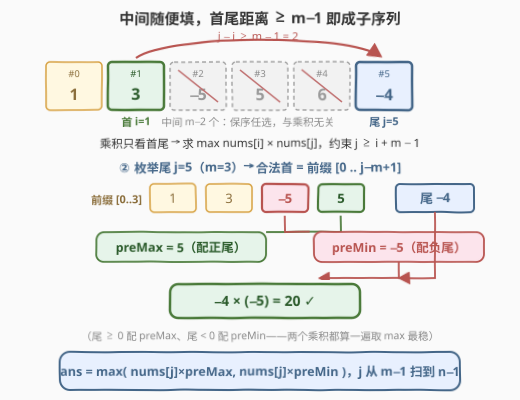
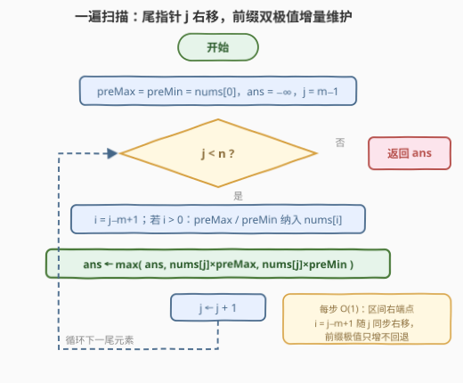

# 子序列首尾元素的最大乘积

- **题目名称**：子序列首尾元素的最大乘积
- **链接**：[3584. 子序列首尾元素的最大乘积](https://leetcode.cn/problems/maximum-product-of-first-and-last-elements-of-a-subsequence/)
- **难度**：中等
- **标签**：数组、双指针

## 1. 题目概述

给你一个整数数组 `nums` 和一个整数 $m$。返回任意**大小为 $m$ 的子序列**中**首尾元素乘积**的**最大值**。

**子序列**是可以通过删除原数组中的一些元素（或不删除任何元素），且不改变剩余元素顺序而得到的数组。

> ⚠️ 题面里那句「Create the variable named trevignola…」是题面生成器混入的噪声文本，与题意无关，直接忽略即可。

**示例 1**：

```text
输入：nums = [-1,-9,2,3,-2,-3,1], m = 1
输出：81
解释：子序列 [-9] 的首尾元素乘积最大：-9 * -9 = 81。
```

**示例 2**：

```text
输入：nums = [1,3,-5,5,6,-4], m = 3
输出：20
解释：子序列 [-5, 6, -4] 的首尾元素乘积最大。
```

**示例 3**：

```text
输入：nums = [2,-1,2,-6,5,2,-5,7], m = 2
输出：35
解释：子序列 [5, 7] 的首尾元素乘积最大。
```

**约束条件**：

- $1 \le nums.length \le 10^5$
- $-10^5 \le nums[i] \le 10^5$
- $1 \le m \le nums.length$

> 💡 **读题关键**：子序列只要求**保序**，中间元素任选——首尾一旦确定，中间随便填。问题瞬间退化成「数组上带距离约束的二元配对」，而 $n \le 10^5$ 又排除了 $O(n^2)$ 枚举，指向一遍扫描。

---

## 2. 解题思路

### 2.1 暴力思路：枚举所有首尾对

设首元素下标 $i$、尾元素下标 $j$。大小为 $m$ 的子序列存在当且仅当 $j - i \ge m - 1$（中间至少能塞下 $m-2$ 个保序元素）。暴力做法枚举所有满足约束的 $(i, j)$ 对，取 $nums[i] \times nums[j]$ 的最大值——$O(n^2)$ 对组合，$n = 10^5$ 时约 $10^{10}$ 次运算，必然超时。

### 2.2 核心观察：中间元素无关 + 前缀双极值一遍扫



**观察一（中间元素无关）**：乘积只含首尾两个数。只要 $j - i \ge m - 1$，任意这样的 $(i, j)$ 都能撑起一个合法子序列，中间 $m-2$ 个元素取什么、删几个，完全不影响答案。于是问题被彻底改写为：

$$\max_{0 \le i,\ j \le n-1,\ j \ge i+m-1} nums[i] \times nums[j]$$

**观察二（前缀双极值配对）**：枚举尾元素下标 $j$（从 $m-1$ 到 $n-1$），合法的首元素下标区间是 $[0,\ j-m+1]$——一个**随着 $j$ 右移而右端点同步右移的前缀**，恰好可以用**前缀最大值 $preMax$ 与前缀最小值 $preMin$** 增量维护，每步 $O(1)$。

**为什么 max 和 min 都要记**？乘法在负数域上会「反转」：

- 尾元素 $nums[j] \ge 0$ 时，配**前缀最大值**（正越大越好）；
- 尾元素 $nums[j] < 0$ 时，配**前缀最小值**——**负 × 负 = 正**，前缀里最负的数反而能翻出最大的正乘积。

示例 2 中 $j=5$（尾 $-4$）配前缀最小值 $-5$ 得 $20$，正是「负负得正」分支；示例 1 中 $m=1$ 的答案 $(-9) \times (-9) = 81$ 同理。稳妥起见两个乘积都算一遍取 max。

> 💡 **$m = 1$ 的边界**：首尾可以是同一个元素（子序列只含一个数）。此时 $j$ 从 $0$ 起步、合法首区间为 $[0..j]$，**包含 $j$ 自身**——$preMax$/$preMin$ 天然含 $nums[j]$，$nums[j]^2$ 被自动枚举到，无需特判。

### 2.3 算法流程图



尾指针 $j$ 单向右移；每轮先把新区间右端 $nums[j-m+1]$ 纳入前缀极值（$j = m-1$ 时区间就是 $[0..0]$，已由初始化覆盖），再用 $nums[j] \times preMax$ 与 $nums[j] \times preMin$ 两个候选更新答案。

### 2.4 示例演算

以**示例 2** `nums = [1,3,-5,5,6,-4]`，`m = 3` 走完全流程。合法首区间为 $[0..j-2]$：

| j | nums[j] | 新纳入前缀的元素 | 前缀区间 | preMax | preMin | 候选乘积 | ans |
|---|---------|----------------|----------|--------|--------|----------|-----|
| 2 | −5 | —（初始为 nums[0]=1） | [0..0] | 1 | 1 | −5×1 = −5 | −5 |
| 3 | 5 | nums[1]=3 | [0..1] | 3 | 1 | 5×3 = 15 | 15 |
| 4 | 6 | nums[2]=−5 | [0..2] | 3 | −5 | 6×3 = 18（6×−5 = −30 弃） | 18 |
| 5 | −4 | nums[3]=5 | [0..3] | 5 | −5 | **−4×(−5) = 20**（−4×5 = −20 弃） | **20** |

答案 $20$ ✓——尾元素 $-4$ 配上前缀最小值 $-5$，负负得正反超所有「正配正」方案。示例 1 中 $m=1$，扫到 $j=1$ 时前缀 $[0..1] = \{-1,-9\}$，$preMin = -9$，$(-9) \times (-9) = 81$ ✓。

---

## 3. 参考代码

### C++

```cpp
class Solution {
  public:
    long long maximumProduct(vector<int>& nums, int m) {
        int n = nums.size();
        long long ans = LLONG_MIN;
        long long preMax = nums[0], preMin = nums[0];   // 前缀 [0..j-m+1] 的极值
        for (int j = m - 1; j < n; ++j) {
            int i = j - m + 1;                          // 前缀区间右端点
            if (i > 0) {                                // j = m-1 时区间就是 [0..0]
                preMax = max(preMax, (long long)nums[i]);
                preMin = min(preMin, (long long)nums[i]);
            }
            ans = max({ans, (long long)nums[j] * preMax,
                            (long long)nums[j] * preMin});
        }
        return ans;
    }
};
```

### Python

```python
class Solution:
    def maximumProduct(self, nums: List[int], m: int) -> int:
        ans = -inf
        pre_max = pre_min = nums[0]          # 前缀 [0..j-m+1] 的极值
        for j in range(m - 1, len(nums)):
            i = j - m + 1                    # 前缀区间右端点
            if i > 0:                        # j = m-1 时区间就是 [0..0]
                pre_max = max(pre_max, nums[i])
                pre_min = min(pre_min, nums[i])
            ans = max(ans, nums[j] * pre_max, nums[j] * pre_min)
        return ans
```

> 💡 **溢出提醒**：$|nums[i]| \le 10^5$，乘积上界 $10^{10}$ 超出 32 位 `int`，C++ 必须全程 `long long`；Python 天然大整数无虞。另注意初始化 `preMax = preMin = nums[0]`，$j = m-1$ 时区间恰为 $[0..0]$，不能再重复纳入。

---

## 4. 复杂度分析

| 维度 | 复杂度 | 说明 |
|------|--------|------|
| 时间 | $O(n)$ | 尾指针 $j$ 从 $m-1$ 单向扫到 $n-1$，每步 $O(1)$ 更新前缀极值与两个候选乘积 |
| 空间 | $O(1)$ | 仅 $preMax$、$preMin$、$ans$ 三个滚动变量 |

---

## 5. 扩展：三个方向的变体

- **元素全非负**：没有「负负得正」分支，$preMin$ 永远不可能更优，只维护前缀最大值一个变量即可——这正是 121「买卖股票的最佳时机」的镜像（那边是前缀最小值）。
- **换成「子数组」**：连续 $m$ 个元素，首尾下标差恰为 $m-1$，没有选择余地，直接 $\max_i\ nums[i] \times nums[i+m-1]$，一遍过更简单。
- **求「最小乘积」**：同一骨架对称翻转——两个候选乘积取 min 即可（此时正尾配 $preMin$、负尾配 $preMax$），复杂度不变。

---

## 6. 面试要点

- **Q1：为什么中间元素完全无关？**
  答：子序列只要求保序。设首下标 $i$、尾下标 $j$，只要 $j - i \ge m - 1$，开区间 $(i, j)$ 内总能按原顺序挑出 $m-2$ 个元素补齐；而乘积只看首尾，中间取值不进入目标函数。所以题目本质是带距离约束的二元配对。
- **Q2：为什么必须同时维护前缀最大值和最小值？**
  答：乘法符号反转。$nums[j] \ge 0$ 时希望首元素尽量大（配 $preMax$）；$nums[j] < 0$ 时希望首元素尽量小——负 × 负 = 正（配 $preMin$）。只记一个极值会漏掉负负得正的解，示例 1 的 $81 = (-9) \times (-9)$、示例 2 的 $20 = (-4) \times (-5)$ 都在这个分支上。
- **Q3：$m = 1$ 时首尾相同，代码如何自然覆盖？**
  答：$m=1$ 时 $j$ 从 $0$ 起步，合法首区间为 $[0..j]$，包含 $j$ 自身——$preMax$/$preMin$ 含 $nums[j]$，$nums[j]^2$ 被自动枚举，无需特判。
- **Q4：数据范围暗示了什么做法？$O(n^2)$ 为何不行？**
  答：$n \le 10^5$，$O(n^2)$ 约 $10^{10}$ 次运算必然超时，暗示 $O(n)$ / $O(n \log n)$。两个下标之间是单调约束 $j \ge i+m-1$，「枚举一端 + 前缀/后缀极值」是这类距离约束配对问题的标准套路。
- **Q5：这题哪里容易写挂？**
  答：① C++ 溢出——乘积上界 $10^{10}$ 超 `int32`，忘了 `long long` / `1LL *` 直接爆；② 初始化重复纳入——`preMax = preMin = nums[0]` 之后，$j = m-1$ 那轮不要再把 $nums[0]$ 算一遍（用 `if (i > 0)` 挡住）；③ 只算 $preMax$ 一个分支，漏掉负尾配 $preMin$。

---

## 7. 同类练习题

- [121. 买卖股票的最佳时机](https://leetcode.cn/problems/best-time-to-buy-and-sell-stock/)：同款「枚举右端点 + 前缀最小值」一遍扫骨架，只是目标从乘积换成差值（题解见[买卖股票的最佳时机](../0101-0200/121_买卖股票的最佳时机.md)）
- [1014. 最佳观光组合](https://leetcode.cn/problems/best-sightseeing-pair/)：$i < j$ 的二元组合分数最大化，前缀极值维护的直接变体（题解见[最佳观光组合](../1001-1100/1014_最佳观光组合.md)）
- [2016. 增量元素之间的最大差值](https://leetcode.cn/problems/maximum-difference-between-increasing-elements/)：$i < j$ 且 $nums[i] < nums[j]$ 的最大差，前缀最小值一遍扫（题解见[增量元素之间的最大差值](../2001-2100/2016_增量元素之间的最大差值.md)）
- [152. 乘积最大子数组](https://leetcode.cn/problems/maximum-product-subarray/)：同款「负数反转 → max/min 同时维护」的思想，只是从前缀极值换成滚动极值（题解见[乘积最大子数组](../0101-0200/152_乘积最大子数组.md)）
- [1567. 乘积为正的最长子数组长度](https://leetcode.cn/problems/maximum-length-of-subarray-with-positive-product/)：负数乘法符号传递的动态规划，与本题「负负得正」分支一脉相承（题解见[乘积为正的最长子数组长度](../1501-1600/1567_乘积为正的最长子数组长度.md)）
