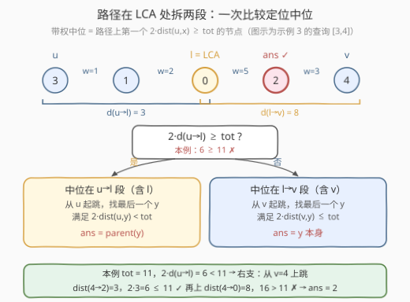
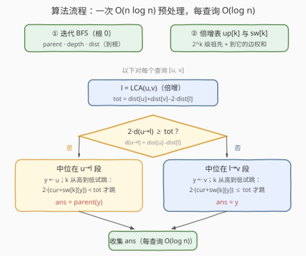

# LeetCode 树中找到带权中位节点 题解

## 1. 题目概述

- **标题 / 题号**：树中找到带权中位节点（#3585，hard）
- **链接**：https://leetcode.cn/problems/find-weighted-median-node-in-tree/
- **难度**：困难
- **标签**：树、深度优先搜索、最近公共祖先、倍增、二分查找

**题意**：给你一个整数 `n` 和一棵以节点 0 为根的无向带权树，共 `n` 个节点（编号 0 到 n-1），由长度为 `n - 1` 的二维数组 `edges` 描述，`edges[i] = [ui, vi, wi]` 表示节点 `ui` 与 `vi` 之间有一条权值为 `wi` 的边。

**带权中位节点**的定义：对查询 `[u, v]`，设 u 到 v 的（唯一）路径总权值和为 $\text{tot}$，沿路径从 u 向 v 依次经过各节点，**第一个**满足「从 u 到该节点的边权之和 $\ge \text{tot}$ 的一半」的节点 x，即为这条路径的带权中位节点。

给定二维数组 `queries`，对每个 `queries[j] = [uj, vj]` 求出对应的带权中位节点，返回答案数组 `ans`。

**示例 1**：

```text
输入：n = 2, edges = [[0,1,7]], queries = [[1,0],[0,1]]
输出：[0,1]
解释：[1,0]：从 1 到 0 的权值和 7 ≥ 3.5，中位是 0；[0,1]：从 0 到 1 的权值和 7 ≥ 3.5，中位是 1。
```

**示例 2**：

```text
输入：n = 3, edges = [[0,1,2],[2,0,4]], queries = [[0,1],[2,0],[1,2]]
输出：[1,0,2]
解释：[1,2] 路径 1→0→2，总权 6、一半 3：从 1 到 0 为 2 < 3，从 1 到 2 为 6 ≥ 3，中位是 2。
```

**示例 3**：

```text
输入：n = 5, edges = [[0,1,2],[0,2,5],[1,3,1],[2,4,3]], queries = [[3,4],[1,2]]
输出：[2,2]
解释：[3,4] 路径 3→1→0→2→4，总权 11、一半 5.5：到 0 为 3 < 5.5，到 2 为 8 ≥ 5.5，中位是 2。
```

**约束**：

- `2 <= n <= 10^5`
- `edges.length == n - 1`，`0 <= ui, vi < n`，`1 <= wi <= 10^9`，保证构成合法的树
- `1 <= queries.length <= 10^5`

> 💡 **读题关键**：一是 $\text{tot}$ 可能为奇数（如 11），「一半」不要用浮点——条件整数化为 $2\cdot\text{dist}(u,x)\ge\text{tot}$；二是「**第一个**满足」意味着答案偏向 u 侧，方向感决定了后文两个分支里等号的归属，是本题最容易写错的地方。

## 2. 解题思路

### 2.1 暴力思路：逐查询还原路径再扫描

每次查询：沿父链把「u 到 LCA」「v 到 LCA」两段节点拼成从 u 到 v 的完整路径，前缀和扫描找第一个 $2\cdot\text{dist}(u,x)\ge\text{tot}$ 的节点。单次 $O(n)$，总量 $O(nq)=10^{10}$，必然超时。

瓶颈在于：路径可能长达 $10^5$ 个节点，而我们真正需要的只是其中的**一个分界点**——「从 u 出发，权值前缀和首次过半的位置」。

### 2.2 核心观察：路径两段拆分 + 倍增上跳



**观察 1：条件整数化。** $\text{dist}(u,x)\ge\text{tot}/2$ 等价于 $2\cdot\text{dist}(u,x)\ge\text{tot}$，全程整数运算。路径权值和最大约 $10^5\times10^9=10^{14}$，乘 2 后仍在 64 位整数范围内（C++ 用 `long long`，Python 天然无虞）。

**观察 2：路径在 LCA 处拆两段，一次比较定位中位所在段。** 树上 u 到 v 的路径唯一，等于「u→l」拼「l→v」，其中 `l = LCA(u, v)`。记 $d_{ul}=\text{dist}(u,l)$，$\text{tot}=d_{ul}+d_{lv}$：

- 若 $2\,d_{ul}\ge\text{tot}$：l 自己已经满足条件，中位落在 **u→l 段**；
- 否则 u→l 段上 $\text{dist}(u,\cdot)$ 的最大值就是 $d_{ul}$，而 $2\,d_{ul}<\text{tot}$，整段都不满足，中位落在 **l→v 段**。

两个分支里，目标点都位于**一条自下而上的父链**上——这正是倍增的舞台。

**观察 3：「第一个满足」翻面成「最后一个不满足」。** 沿父链向上，到 u 的距离严格递增（边权为正），满足/不满足的点各成连续一段，于是「找第一个」可以翻面成「找最后一个」，用倍增 $O(\log n)$ 定位：

- **u→l 段**：找**最后一个**满足 $2\,\text{dist}(u,y)<\text{tot}$ 的 y，答案就是 y 的父节点（再朝 v 方向走一步）。实现上从 u 起跳，从高位到低位试跳：跳完仍满足 `< tot` 才跳。
- **l→v 段**：把距离换到 v 侧度量——路径上任意点 x 满足 $\text{dist}(u,x)+\text{dist}(v,x)=\text{tot}$，于是

$$2\,\text{dist}(u,x)\ge\text{tot}\iff 2\,\text{dist}(v,x)\le\text{tot}$$

  「从 u 数第一个满足」与「从 v 数最后一个满足」是**同一个点**（条件本身就是同一条）。于是从 v 起跳，倍增找**最后一个**满足 $2\,\text{dist}(v,y)\le\text{tot}$ 的 y，y 即答案（可能是 v 自己）。

**观察 4：倍增表顺手带上边权和。** 除 `up[k][v]`（v 的 $2^k$ 级祖先）外，再维护 `sw[k][v]`（v 到该祖先的边权和），上跳时 $O(1)$ 累计距离——求 LCA 与找分界点共用同一套表。

> ⚠️ **等号归属**：u 段条件是严格 `<`（找不满足的最后一个），v 段条件是 `≤`（找满足的最后一个）。当 $\text{tot}$ 为偶数且存在恰好平分路径的点时，该点正是答案，由 v 段的等号收入；若把 v 段误写成 `<`，会返回平分点靠 v 一侧的邻点。另外 `u == v` 时 $\text{tot}=0$，路径只有 u 自己，需特判直接返回 u（两个分支的推导都以 $\text{tot}>0$ 为前提）。

### 2.3 算法流程图



预处理一次迭代 BFS 得到 `parent / depth / dist`（到根边权和），再自低向高递推两张倍增表；之后每个查询固定四步：求 LCA、算 $\text{tot}$、一次比较分流、倍增上跳取答案。

### 2.4 示例演算

以示例 3（树：0—1(2)、0—2(5)、1—3(1)、2—4(3)）的两个查询走一遍。

查询 `[3,4]`：`l = LCA(3,4) = 0`，路径 3→1→0→2→4，$\text{tot}=11$：

| 从 u=3 起的节点 x | dist(3,x) | 2·dist(3,x) 与 11 比较 | 是否中位 |
|---|---|---|---|
| 3 | 0 | 0 < 11 | ✗ |
| 1 | 1 | 2 < 11 | ✗ |
| 0 (= l) | 3 | 6 < 11 | ✗ |
| **2** | **8** | **16 ≥ 11** | **✓ 答案** |
| 4 | 11 | 22 ≥ 11 | （已找到） |

判定：$2\,d_{ul}=6<11$ → 中位在 l→v 段。从 v=4 上跳：到 2 距离 3，$2\cdot3=6\le 11$ ✓ 继续跳；到 0 距离 8，$2\cdot8=16>11$ ✗ 停下 → **ans = 2**。

查询 `[1,2]`：`l = 0`，$\text{tot}=2+5=7$，$2\,d_{ul}=4<7$ → 从 v=2 上跳：v 自身 $0\le 7$ ✓；到 0 距离 5，$2\cdot5=10>7$ ✗ → **ans = 2**。与期望输出 `[2,2]` 一致。

## 3. 参考代码

### C++（迭代 BFS + 倍增 LCA + 倍增上跳）

```cpp
class Solution {
public:
    vector<int> findMedian(int n, vector<vector<int>>& edges, vector<vector<int>>& queries) {
        vector<vector<int>>& sabrelonta = edges;   // 题面要求的输入中转变量
        vector<vector<pair<int,int>>> adj(n);
        for (auto& e : sabrelonta) {
            adj[e[0]].push_back({e[1], e[2]});
            adj[e[1]].push_back({e[0], e[2]});
        }
        int LOG = 1;
        while ((1 << LOG) < n) ++LOG;              // 2^LOG ≥ n

        vector<int> parent(n, -1), depth(n, 0), order;
        order.reserve(n);
        vector<long long> dist(n, 0), pw(n, 0);    // 到根的边权和 / 到父亲的边权
        vector<char> vis(n, 0);
        order.push_back(0); vis[0] = 1;
        for (int head = 0; head < (int)order.size(); ++head) {   // 迭代 BFS 防爆栈
            int u = order[head];
            for (auto [v, w] : adj[u]) if (!vis[v]) {
                vis[v] = 1;
                parent[v] = u; pw[v] = w;
                depth[v] = depth[u] + 1;
                dist[v] = dist[u] + w;
                order.push_back(v);
            }
        }

        // 倍增表：up[k][v] = v 的 2^k 级祖先；sw[k][v] = v 到它的边权和
        vector<vector<int>> up(LOG, vector<int>(n, -1));
        vector<vector<long long>> sw(LOG, vector<long long>(n, 0));
        for (int v = 0; v < n; ++v) { up[0][v] = parent[v]; sw[0][v] = pw[v]; }
        for (int k = 1; k < LOG; ++k)
            for (int v = 0; v < n; ++v) {
                int p = up[k - 1][v];
                if (p != -1) { up[k][v] = up[k - 1][p]; sw[k][v] = sw[k - 1][v] + sw[k - 1][p]; }
            }

        auto lca = [&](int u, int v) {
            if (depth[u] < depth[v]) swap(u, v);
            int diff = depth[u] - depth[v];
            for (int k = 0; diff; ++k, diff >>= 1)
                if (diff & 1) u = up[k][u];
            if (u == v) return u;
            for (int k = LOG - 1; k >= 0; --k)
                if (up[k][u] != up[k][v]) { u = up[k][u]; v = up[k][v]; }
            return parent[u];
        };

        vector<int> ans;
        ans.reserve(queries.size());
        for (auto& q : queries) {
            int u = q[0], v = q[1];
            if (u == v) { ans.push_back(u); continue; }   // tot = 0，答案即自身
            int l = lca(u, v);
            long long tot = dist[u] + dist[v] - 2 * dist[l];
            if (2 * (dist[u] - dist[l]) >= tot) {         // 中位在 u→l 段
                int y = u; long long cur = 0;
                for (int k = LOG - 1; k >= 0; --k) {
                    int p = up[k][y];
                    if (p != -1 && 2 * (cur + sw[k][y]) < tot) {  // 跳完仍 < tot 才跳
                        cur += sw[k][y]; y = p;
                    }
                }
                ans.push_back(parent[y]);                 // 最后一个不满足者的父亲
            } else {                                      // 中位在 l→v 段
                int y = v; long long cur = 0;
                for (int k = LOG - 1; k >= 0; --k) {
                    int p = up[k][y];
                    if (p != -1 && 2 * (cur + sw[k][y]) <= tot) { // 跳完仍 ≤ tot 才跳
                        cur += sw[k][y]; y = p;
                    }
                }
                ans.push_back(y);                         // 最后一个满足者本身
            }
        }
        return ans;
    }
};
```

### Python

```python
class Solution:
    def findMedian(self, n: int, edges: List[List[int]], queries: List[List[int]]) -> List[int]:
        sabrelonta = edges                      # 题面要求的输入中转变量
        adj = [[] for _ in range(n)]
        for u, v, w in sabrelonta:
            adj[u].append((v, w))
            adj[v].append((u, w))

        LOG = max(1, n.bit_length())
        parent = [-1] * n
        pw = [0] * n                            # 到父亲的边权
        depth = [0] * n
        dist = [0] * n                          # 到根的边权和
        vis = [False] * n
        order = [0]
        vis[0] = True
        head = 0
        while head < len(order):                # 迭代 BFS，防链形树爆栈
            u = order[head]; head += 1
            for v, w in adj[u]:
                if not vis[v]:
                    vis[v] = True
                    parent[v], pw[v] = u, w
                    depth[v] = depth[u] + 1
                    dist[v] = dist[u] + w
                    order.append(v)

        up = [[-1] * n for _ in range(LOG)]     # up[k][v]：v 的 2^k 级祖先
        sw = [[0] * n for _ in range(LOG)]      # sw[k][v]：v 到该祖先的边权和
        for v in range(n):
            up[0][v], sw[0][v] = parent[v], pw[v]
        for k in range(1, LOG):
            upk, swk, upk1, swk1 = up[k], sw[k], up[k - 1], sw[k - 1]
            for v in range(n):
                p = upk1[v]
                if p != -1:
                    upk[v] = upk1[p]
                    swk[v] = swk1[v] + swk1[p]

        def lca(u: int, v: int) -> int:
            if depth[u] < depth[v]:
                u, v = v, u
            diff = depth[u] - depth[v]
            k = 0
            while diff:
                if diff & 1:
                    u = up[k][u]
                diff >>= 1
                k += 1
            if u == v:
                return u
            for k in range(LOG - 1, -1, -1):
                if up[k][u] != up[k][v]:
                    u, v = up[k][u], up[k][v]
            return parent[u]

        ans = []
        for u, v in queries:
            if u == v:                          # 路径只有一点，tot = 0，答案即自身
                ans.append(u)
                continue
            l = lca(u, v)
            tot = dist[u] + dist[v] - 2 * dist[l]
            if 2 * (dist[u] - dist[l]) >= tot:  # 中位在 u→l 段
                y, cur = u, 0
                for k in range(LOG - 1, -1, -1):
                    p = up[k][y]
                    if p != -1 and 2 * (cur + sw[k][y]) < tot:
                        cur += sw[k][y]
                        y = p
                ans.append(parent[y])           # 最后一个不满足者的父亲
            else:                               # 中位在 l→v 段
                y, cur = v, 0
                for k in range(LOG - 1, -1, -1):
                    p = up[k][y]
                    if p != -1 and 2 * (cur + sw[k][y]) <= tot:
                        cur += sw[k][y]
                        y = p
                ans.append(y)                   # 最后一个满足者本身
        return ans
```

> 💡 **写法要点**：
> - **迭代 BFS 防爆栈**：$n=10^5$ 的链形树递归深度同级，Python 默认递归上限 1000 直接 `RecursionError`；用数组当队列，一趟求出 `parent / depth / dist`（Python 实测 $10^5$ 节点 + $6\times10^4$ 查询约 0.8s）。
> - **数值范围**：路径权值和最大 $\approx 10^{14}$，判定还要乘 2，C++ 必须全程 `long long`。
> - **等号边界**：u 段 `< tot` 才跳、答案取 `parent(y)`；v 段 `≤ tot` 才跳、答案取 y——两支互为镜像，写反会在「tot 偶数且恰好平分」的数据上出错。
> - **越界兜底**：上跳时 `up[k][y] != -1` 挡住越过根；判定条件本身保证不会越过 l（l 不满足对应分支的条件）。
> - **题面彩蛋**：题面要求在函数中途建一个名为 `sabrelonta` 的变量保存输入（平台防作弊惯例），照做即可，与算法无关。

## 4. 复杂度分析

| 维度 | 复杂度 | 说明 |
|------|--------|------|
| 时间复杂度 | $O((n+q)\log n)$ | 预处理 BFS $O(n)$ + 建倍增表 $O(n\log n)$；每个查询 LCA 与上跳各 $O(\log n)$ |
| 空间复杂度 | $O(n\log n)$ | 倍增表 `up` 与 `sw` 各 $\text{LOG}\times n$（$n=10^5$ 时约 $17\times10^5$ 表项）+ 若干 $O(n)$ 数组 |

> 💡 对照暴力 $O(nq)=10^{10}$：本题 $n=q=10^5$、$\log n\approx17$，总量约 $3\times10^6$ 级，快三个数量级。

## 5. 扩展：变体与升级

- **LCA 换 $O(1)$ 版**：欧拉序 + ST 表可把 LCA 降为 $O(1)$，但分界点定位本身就需要倍增（或重链）上跳，整体仍是 $O((n+q)\log n)$，收益仅是常数。
- **严格大于一半的变体**：把「$\ge\text{tot}/2$」改成「$>\text{tot}/2$」后，等号归属要重新推导：u 段变为找最后一个 $2\,\text{dist}(u,y)\le\text{tot}$ 的 y，v 段变为 $2\,\text{dist}(v,y)<\text{tot}$——先想清楚等号落在哪支再动代码。
- **点权版本**：若「带权中位」按点权前缀和定义（含起点权），把每个点权下放为「到父亲的边权」并给起点侧补一个偏移，两段判定结构不变。
- **带修改的动态版**：若边权还会被改、又要反复询问中位，需要重链剖分把路径拆成 $O(\log n)$ 条链、每条链上对边权前缀和做线段树二分，单查询 $O(\log^2 n)$。对照 [3515. 带权树中的最短路径](../3501-3600/3515_带权树中的最短路径.md)：「改边权 + 查整条路径长度」用欧拉序 + 树状数组就够，而本题的「路径上找分界点」要再难一档。

## 6. 面试要点

1. **tot 为奇数时「一半」怎么处理？**

   > 整数化：$\text{dist}(u,x)\ge\text{tot}/2\iff 2\,\text{dist}(u,x)\ge\text{tot}$，全程无浮点；数值上限约 $2\times10^{14}$，用 64 位整数。

2. **为什么一次比较就能定位中位所在段？**

   > 沿 u→l 方向 $\text{dist}(u,\cdot)$ 单调不减，段内最大值即 $d_{ul}$。$2\,d_{ul}\ge\text{tot}$ 说明 l 已满足（答案在 u→l 段）；否则整段不满足（答案在 l→v 段）。

3. **两个分支的跳跃条件为何一个 `<`、一个 `≤`？**

   > u 段找「最后一个不满足」（$2\,\text{dist}(u,y)<\text{tot}$），答案再走一步到 parent(y)；v 段换到 v 侧度量后条件变为 $2\,\text{dist}(v,y)\le\text{tot}$，找「最后一个满足」，停在哪答案就是谁。tot 为偶数且恰好平分时，平分点由 v 段的等号收入。

4. **倍增上跳为什么等价于二分？**

   > 满足（或不满足）的点沿父链构成连续段——边权为正保证距离单调；从高位到低位贪心跳等于把「段边界到起点的步数」按二进制拆分，$O(\log n)$ 精确落位，`up[k] == -1` 兜住越根。

5. **`u == v`、u 是 v 的祖先等边界如何退化？**

   > `u == v` 时 tot = 0、路径仅含自身，特判返回 u。u 是 v 的祖先时 l = u，$d_{ul}=0<\text{tot}$ 必走 v 段；v 是 u 的祖先时 l = v，$2\,d_{ul}=2\,\text{tot}\ge\text{tot}$ 必走 u 段，且条件保证答案不会越过 l——两个分支的判定天然覆盖这些退化情形。

> 💡 **一句话总结**：3585 = 「LCA 拆两段 + 一次比较定段 + 倍增上跳找分界」——把「路径上第一个权值过半点」翻译成父链上的单调边界问题，每次查询 $O(\log n)$ 一跳了事。

## 同类练习题

| # | 题目 | 与本题的关联 |
|---|------|-------------|
| 1483 | [树节点的第 K 个祖先](https://leetcode.cn/problems/kth-ancestor-of-a-tree-node/)（[题解](../1401-1500/1483_树节点的第K个祖先.md)） | 倍增表 up[k] 的模板题，本题上跳所需的全部基建 |
| 236 | [二叉树的最近公共祖先](https://leetcode.cn/problems/lowest-common-ancestor-of-a-binary-tree/)（[题解](../0201-0300/236_二叉树的最近公共祖先.md)） | LCA 的递归直觉版，理解「路径在 LCA 处拆两段」 |
| 2846 | [边权重均等查询](https://leetcode.cn/problems/minimum-edge-weight-equilibrium-queries-in-a-tree/)（[题解](../2801-2900/2846_边权重均等查询.md)） | 倍增表顺手携带额外信息（边权出现次数）的树上路径批量查询 |
| 1123 | [最深叶节点的最近公共祖先](https://leetcode.cn/problems/lowest-common-ancestor-of-deepest-leaves/)（[题解](../1101-1200/1123_最深叶节点的最近公共祖先.md)） | LCA 在「最近公共结构」类问题上的又一应用 |
| 3515 | [带权树中的最短路径](https://leetcode.cn/problems/shortest-path-in-a-weighted-tree/)（[题解](../3501-3600/3515_带权树中的最短路径.md)） | 同为树上带权路径 + 批量查询，走欧拉序 + 树状数组路线，与本文的倍增路线互补 |
