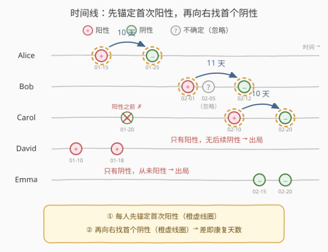
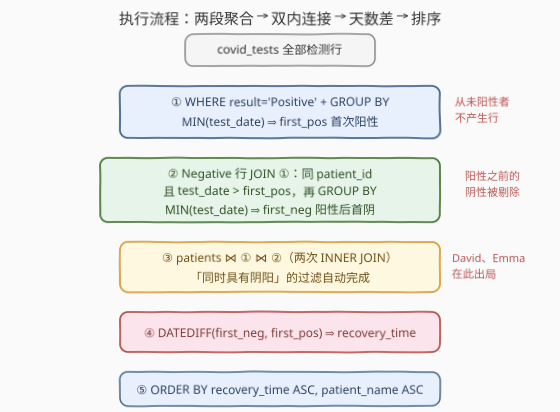

# LeetCode 寻找COVID康复患者 题解

## 1. 题目概述

- **标题 / 题号**：寻找COVID康复患者（#3586，medium）
- **链接**：https://leetcode.cn/problems/find-covid-recovery-patients/
- **难度**：中等
- **标签**：SQL、数据库、聚合函数、`MIN`、CTE、JOIN、窗口函数、`DATEDIFF`、双键排序

**题意**：两张表：`patients` 记录患者基本信息，`covid_tests` 记录核酸检测结果（阳性 Positive / 阴性 Negative / 不确定 Inconclusive）。编写一个解决方案，找出**从 COVID 中康复**的患者——先检出阳性、之后又检出阴性的人，返回 `patient_id`、`patient_name`、`age` 与**康复时间**（天数），按康复时间**升序**、患者姓名**升序**排序。

**表结构**：

```text
表: patients
+-------------+---------+
| Column Name | Type    |
+-------------+---------+
| patient_id  | int     |   ← 主键
| patient_name| varchar |
| age         | int     |
+-------------+---------+
patient_id 是这张表的唯一主键。
每一行表示一个患者的信息。

表: covid_tests
+-------------+---------+
| Column Name | Type    |
+-------------+---------+
| test_id     | int     |   ← 主键
| patient_id  | int     |   ← 指向 patients.patient_id
| test_date   | date    |
| result      | varchar |   ← Positive / Negative / Inconclusive
+-------------+---------+
test_id 是这张表的唯一主键。
每一行代表一个 COVID 检测结果。
```

**关键规则**：

1. **康复判定**：至少有一次阳性检测，且在**之后的日期**至少有一次阴性检测；
2. **康复时间** $=$ **首次阳性检测**日期 $\to$ 该阳性之后**首次阴性**检测日期的天数差；
3. **仅包括**同时具有阳性及阴性检测结果的患者（Inconclusive 不参与任何判定）。

**示例 1**：

```text
输入：
patients 表:
+------------+--------------+-----+
| patient_id | patient_name | age |
+------------+--------------+-----+
| 1          | Alice Smith  | 28  |
| 2          | Bob Johnson  | 35  |
| 3          | Carol Davis  | 42  |
| 4          | David Wilson | 31  |
| 5          | Emma Brown   | 29  |
+------------+--------------+-----+

covid_tests 表:
+---------+------------+------------+--------------+
| test_id | patient_id | test_date  | result       |
+---------+------------+------------+--------------+
| 1       | 1          | 2023-01-15 | Positive     |
| 2       | 1          | 2023-01-25 | Negative     |
| 3       | 2          | 2023-02-01 | Positive     |
| 4       | 2          | 2023-02-05 | Inconclusive |
| 5       | 2          | 2023-02-12 | Negative     |
| 6       | 3          | 2023-01-20 | Negative     |
| 7       | 3          | 2023-02-10 | Positive     |
| 8       | 3          | 2023-02-20 | Negative     |
| 9       | 4          | 2023-01-10 | Positive     |
| 10      | 4          | 2023-01-18 | Positive     |
| 11      | 5          | 2023-02-15 | Negative     |
| 12      | 5          | 2023-02-20 | Negative     |
+---------+------------+------------+--------------+

输出：
+------------+--------------+-----+---------------+
| patient_id | patient_name | age | recovery_time |
+------------+--------------+-----+---------------+
| 1          | Alice Smith  | 28  | 10            |
| 3          | Carol Davis  | 42  | 10            |
| 2          | Bob Johnson  | 35  | 11            |
+------------+--------------+-----+---------------+
```

**解释**：

| 患者 | 检测时间线 | 首次阳性 | 其后首次阴性 | 康复时间 |
|------|-----------|----------|--------------|----------|
| Alice Smith | 01-15 阳 → 01-25 阴 | 2023-01-15 | 2023-01-25 | $10$ 天 |
| Bob Johnson | 02-01 阳 → 02-05 不确定 → 02-12 阴 | 2023-02-01 | 2023-02-12（不确定被忽略） | $11$ 天 |
| Carol Davis | 01-20 阴 → 02-10 阳 → 02-20 阴 | 2023-02-10 | 2023-02-20（阳性之前的阴性不算） | $10$ 天 |
| David Wilson | 01-10 阳 → 01-18 阳 | 2023-01-10 | 无 | 出局（阳性后无阴性） |
| Emma Brown | 02-15 阴 → 02-20 阴 | 无 | — | 出局（从未阳性） |

**约束**：

- `patient_id`、`test_id` 分别是两表主键，`covid_tests.patient_id` 指向 `patients.patient_id`
- 结果按 `recovery_time` **升序**、`patient_name` **升序**排序

> 💡 **读题关键**：① 阴性必须在**首次阳性之后**——阳性**之前**的阴性不算数（Carol 的反例）；② 两个锚点都是"首次"：**首次阳性**、以及该日期**之后**的**首次阴性**——本质是两个 `MIN`，但第二个 `MIN` 的候选集依赖第一个 `MIN` 的结果；③ Inconclusive 行完全透明，既不是阳性也不是阴性。

## 2. 解题思路

### 2.1 暴力思路：逐患者翻检测记录

过程式直觉：对每个患者，取其全部检测按日期排序；没有阳性直接跳过；找到**首次阳性**日期 $d_p$；再从 $d_p$ **之后**找**首个阴性**日期 $d_n$（跳过所有 Inconclusive 与重复阳性），找不到则跳过；否则输出该患者及 $d_n - d_p$ 天；最后按康复时间升序、姓名升序排序。

```text
for each patient p:
    ts = p 的检测按 test_date 升序
    dp = min(t.test_date for t in ts if t.result == 'Positive')   # 首次阳性
    if dp 不存在: skip                  # 从未阳性 → 出局
    dn = min(t.test_date for t in ts
             if t.result == 'Negative' and t.test_date > dp)      # 阳性后的首个阴性
    if dn 不存在: skip                  # 阳性后无阴性 → 出局
    output(p, dn - dp)
sort output by recovery_time asc, patient_name asc
```

- **正确性**：与题意逐条对应——两步 MIN 中间夹一个日期过滤，没有遗漏；
- **效率**：每人一次排序 $O(m \log m)$，总量 $O(n \log n)$（$n$ 为检测总行数），并不慢；
- **表达方式**：瓶颈不在效率而在**翻译**——SQL 里"第二个 MIN 的过滤条件依赖第一个 MIN 的**结果**"，这是**依赖聚合**：无法在同一次 `GROUP BY` 里一步算出（详见 2.2），必须"先聚合、再回表过滤、再聚合"，或用窗口函数把首次阳性**广播**到每一行。

### 2.2 核心观察：两个"首次"是依赖聚合



把康复条件画在时间线上，结构一目了然——每人先锚定首次阳性（红圈），再向右找首个阴性（绿圈），两者的天数差即康复时间；左侧更早的阴性、途中的不确定结果全部无视：

| 业务语言 | SQL 语言 |
|----------|----------|
| 每人的**首次阳性**日期 | `MIN(test_date)`，只看 `result = 'Positive'` 的行 |
| 首次阳性**之后**的首个阴性 | `MIN(test_date)`，只看 `result = 'Negative'` **且** `test_date > 首次阳性` 的行 |
| 康复时间 | `DATEDIFF(首次阴性, 首次阳性)`（MySQL：前者 $-$ 后者） |
| "同时具有阴阳" | 两个结果集都非空 $\Rightarrow$ **INNER JOIN 天然过滤** |

> 💡 **为什么不能一次 `GROUP BY` 搞定？** 条件聚合 `MIN(CASE WHEN result='Positive' THEN test_date END)` 与 `MIN(CASE WHEN result='Negative' THEN test_date END)` 确实能同层算出"首次阳性"和"**全局**首次阴性"——但后者没有日期过滤：Carol 的全局首次阴性（01-20）在首次阳性（02-10）**之前**，直接相减得负数、直接比较大小则会把康复患者错杀。第二个聚合的候选行集依赖第一个聚合的**值**，这就是**依赖聚合**。出路有两条：**回连**（CTE① 算首次阳性 $\to$ 回连原表筛日期 $\to$ CTE② 再聚合，解法 A），或**广播**（窗口函数把首次阳性铺到每行，再单次分组，解法 B）。

### 2.3 算法流程图



**逻辑执行顺序**：

| 阶段 | 子句 | 作用 |
|------|------|------|
| ① | `WHERE result='Positive'` + `GROUP BY` + `MIN` | 每人算出首次阳性 `first_pos`（从未阳性者不产生行） |
| ② | 阴性行 JOIN ①，`test_date > first_pos` + `GROUP BY` + `MIN` | 每人算出阳性后的首次阴性 `first_neg`（阳性后无阴性者不产生行） |
| ③ | `patients JOIN ① JOIN ②` | 两次 INNER JOIN 自动完成"同时具有阴阳"的过滤 |
| ④ | `DATEDIFF(first_neg, first_pos)` | 康复时间（天数差） |
| ⑤ | `ORDER BY recovery_time, patient_name` | 双键排序收尾 |

> 💡 **过滤即连接**：题面"仅包括同时具有阳性及阴性检测结果的患者"不需要任何显式 `WHERE`——①里不存在的患者（无阳性）和②里不存在的患者（阳性后无阴性）都会被 INNER JOIN 挤出结果集。把存在性判定交给连接语义，是 SQL 里最省事也最不易写错的姿势。

### 2.4 示例演算

对示例数据走一遍 ①→⑤ 链路：

| 患者 | ① first_pos | ② 阳性后的阴性候选 | ② first_neg | recovery_time | 结果 |
|------|-------------|--------------------|-------------|----------------|------|
| Alice Smith | 2023-01-15 | 01-25 | 2023-01-25 | $25-15=10$ | ✓ |
| Bob Johnson | 2023-02-01 | 02-12（02-05 不确定，不参与） | 2023-02-12 | $12-1=11$ | ✓ |
| Carol Davis | 2023-02-10 | 02-20（01-20 在阳性之前，被 ② 剔除） | 2023-02-20 | $20-10=10$ | ✓ |
| David Wilson | 2023-01-10 | —（两次均阳性） | NULL | — | ② 空，出局 |
| Emma Brown | —（无阳性） | — | — | — | ① 空，出局 |

- **② 阶段（回表过滤）**：Carol 的 01-20 阴性虽是她的全局首次阴性，但 `test_date > first_pos` 不成立，被连接条件剔除——这正是依赖聚合必须回表（或广播）的原因；
- **③ 阶段（双内连接）**：David（① 有 ② 无）、Emma（① 无）自动出局，一行 `WHERE` 都没写；
- **⑤ 阶段（排序）**：Alice（10）与 Carol（10）同分，按姓名升序 Alice 在前，Bob（11）最后 $\to$ `Alice, Carol, Bob`，与预期输出一致。

## 3. 参考代码

### SQL（解法 A：两段 CTE + 回连过滤，推荐）

```sql
WITH first_positive AS (
    SELECT patient_id,
           MIN(test_date) AS first_pos
    FROM covid_tests
    WHERE result = 'Positive'
    GROUP BY patient_id
),
first_negative AS (
    SELECT c.patient_id,
           MIN(c.test_date) AS first_neg
    FROM covid_tests c
    JOIN first_positive fp
      ON c.patient_id = fp.patient_id
     AND c.test_date > fp.first_pos
    WHERE c.result = 'Negative'
    GROUP BY c.patient_id
)
SELECT p.patient_id,
       p.patient_name,
       p.age,
       DATEDIFF(fn.first_neg, fp.first_pos) AS recovery_time
FROM patients p
JOIN first_positive fp ON p.patient_id = fp.patient_id
JOIN first_negative fn ON p.patient_id = fn.patient_id
ORDER BY recovery_time ASC,
         p.patient_name ASC;
```

> 💡 **写法要点**：
> - **① 先滤后聚**：`WHERE result = 'Positive'` 在分组前把行集缩到阳性行，`MIN` 即首次阳性；从未阳性的患者压根不产生行；
> - **② 把"之后"写进 JOIN 条件**：`c.test_date > fp.first_pos` 与患者等值条件并列放在 `ON` 里——阴性行先按患者回连首次阳性，再用日期不等式筛掉"阳性之前的阴性"（Carol 的 01-20）；
> - **两个 INNER JOIN 即全部过滤**：不需要 `WHERE EXISTS`——"同时具有阴阳且阴性在阳性之后"由 ①② 的存在性 + 内连接自动把关；
> - **`DATEDIFF(d1, d2)` 是 $d_1 - d_2$**：MySQL 中参数顺序为（晚的, 早的），本题写 `DATEDIFF(first_neg, first_pos)` 得正天数；
> - **`ORDER BY` 用别名**：ORDER BY 在 SELECT 之后求值，可直接引用 `recovery_time`。

### SQL（解法 B：窗口函数广播 first_pos + 单次分组）

```sql
WITH tagged AS (
    SELECT patient_id,
           test_date,
           result,
           MIN(CASE WHEN result = 'Positive' THEN test_date END)
               OVER (PARTITION BY patient_id) AS first_pos
    FROM covid_tests
),
recovery AS (
    SELECT patient_id,
           MAX(first_pos) AS first_pos,
           MIN(CASE WHEN result = 'Negative' AND test_date > first_pos
                    THEN test_date END) AS first_neg
    FROM tagged
    GROUP BY patient_id
)
SELECT p.patient_id,
       p.patient_name,
       p.age,
       DATEDIFF(r.first_neg, r.first_pos) AS recovery_time
FROM patients p
JOIN recovery r ON p.patient_id = r.patient_id
WHERE r.first_neg IS NOT NULL
ORDER BY recovery_time ASC,
         p.patient_name ASC;
```

> 💡 **与解法 A 的差异**：不再回连原表，而是用**窗口聚合** `MIN(...) OVER (PARTITION BY patient_id)` 把首次阳性**广播**到该患者的每一行（含阴性行）——第一趟扫描后每行自带 `first_pos`，第二层只需一次 `GROUP BY` + 条件聚合即可选出"日期大于它的阴性中最早的一个"。两个易漏点：① `MAX(first_pos)` 只是为了兼容 `ONLY_FULL_GROUP_BY`——组内 `first_pos` 恒同值，取 MAX 即原值；② 从未阳性的患者 `first_pos` 为 NULL，`test_date > NULL` 求值为 UNKNOWN，条件聚合得 NULL，与"阳性后无阴性"一起被外层 `WHERE first_neg IS NOT NULL` 清掉。两种范式对照：**回连版**（A）逻辑直白、谓词可下推；**广播版**（B）只扫一趟、聚合只做一次，与 550 题（首次登录 + 次日回访）同款骨架。

### Python（pandas）

```python
import pandas as pd

def find_covid_recovery_patients(patients: pd.DataFrame,
                                 covid_tests: pd.DataFrame) -> pd.DataFrame:
    pos = (covid_tests.loc[covid_tests['result'] == 'Positive']
           .groupby('patient_id', as_index=False)['test_date'].min()
           .rename(columns={'test_date': 'first_pos'}))
    neg = (covid_tests.loc[covid_tests['result'] == 'Negative',
                           ['patient_id', 'test_date']]
           .merge(pos, on='patient_id', how='inner'))
    neg = neg[neg['test_date'] > neg['first_pos']]
    rec = (neg.groupby('patient_id', as_index=False)
           .agg(first_pos=('first_pos', 'first'),
                first_neg=('test_date', 'min')))
    rec['recovery_time'] = (rec['first_neg'] - rec['first_pos']).dt.days
    ans = patients.merge(rec, on='patient_id', how='inner')
    ans = ans.sort_values(['recovery_time', 'patient_name'])
    return (ans[['patient_id', 'patient_name', 'age', 'recovery_time']]
            .reset_index(drop=True))
```

> 💡 **pandas 对照**：
> - `groupby(...).min()` 对应 CTE①；`.merge(pos, on='patient_id', how='inner')` 就是"回连"；
> - `neg['test_date'] > neg['first_pos']` 布尔筛选对应 JOIN 条件里的日期不等式，一行完成"阳性之前的阴性出局"；
> - `agg(first_pos=('first_pos', 'first'), ...)`：`first_pos` 组内恒同值，取 `first` 即可；`(first_neg - first_pos).dt.days` 对应 `DATEDIFF`（LeetCode 的 date 列为 `datetime64`）；
> - `merge(..., how='inner')` 与 `sort_values` 对应双内连接与双键排序。

## 4. 复杂度分析

设 $n$ = `covid_tests` 行数，$m$ = `patients` 行数，$k$ = 结果行数。

| 维度 | 复杂度 | 说明 |
|------|--------|------|
| **时间** | $O(n \log n)$ | 两次分组聚合各一遍（哈希分组近似线性，排序分组 $O(n \log n)$）；若 `(patient_id, result, test_date)` 上有复合索引，两段聚合均可走索引范围扫描，接近 $O(n)$ |
| **空间** | $O(m + k)$ | 两个 CTE 均为"每患者一行"，远小于原表 |
| **中间行数** | $O(n)$ | 解法 A 的 ② 需回连一次阴性行；解法 B 一趟扫描后直接分组，不回连 |
| **是否需排序** | 是 | 分组（隐式）+ 结果 `ORDER BY`（显式，只作用于 $k$ 行） |

> ⚠️ 面试中说清"两次聚合各扫一遍、瓶颈在分组（有索引时可降为索引扫描）、最终排序只作用于 $k$ 行"即可。要避免的是对每个患者写**相关子查询**——每患者两次重复扫表，最坏 $O(n^2)$。

## 5. 扩展

### 5.1 反例：为什么不能直接 `MIN(阴性) − MIN(阳性)`

Carol 的检测序列：01-20 阴 $\to$ 02-10 阳 $\to$ 02-20 阴。她的**全局首次阴性**（01-20）早于首次阳性（02-10）：

- 直接相减：$01\text{-}20 - 02\text{-}10 = -21$，荒谬；
- 加个条件 `MIN(阴) > MIN(阳)` 再输出差值：Carol 被**错杀**出局——她的全局首阴确实早于首阳，但她明明在 02-20 康复了。

根因：**第二个聚合（阳性后的首个阴性）的候选行集依赖第一个聚合（首次阳性）的值**，而同一次 `GROUP BY` 里的两个条件聚合互相独立、都在"该患者全部行"上求值，表达不出这种依赖。出路只有两条：聚合结果**回表再聚合**（解法 A 的两段 CTE），或窗口函数把第一次聚合的值**广播到每行**后再分组（解法 B）。这是 SQL 中"依赖聚合"类问题的通用结论，同款结构见 550 题（首次登录日期 $\to$ 次日是否回访）。

### 5.2 边界：同日阳性 + 阴性算不算康复？

题面写"在**之后的日期**至少有一次阴性"——严格**之后**，同日不算。所以连接条件必须写严格大于 `c.test_date > fp.first_pos`；若业务口径放宽为"当天或之后"，改成 `>=` 即可。同理注意 David 的情形：有两次阳性（01-10、01-18）时，康复锚点取**首次**阳性 01-10，重复阳性不移动锚点。面试中主动向面试官确认"同日算不算、重复阳性取哪次、Inconclusive 是否一律忽略"，是边界意识的加分项。

### 5.3 方言差异：日期差怎么算

`DATEDIFF` 在各家数据库里长得像、语义不同，跨方言手写最容易翻车：

| 方言 | 写法 | 备注 |
|------|------|------|
| MySQL | `DATEDIFF(d1, d2)` | 返回 $d_1 - d_2$，只比日期部分 |
| SQL Server | `DATEDIFF(day, d2, d1)` | 参数是 `(unit, start, end)`，顺序与 MySQL 相反 |
| PostgreSQL | `d1 - d2` 或 `DATE_PART('day', d1::timestamp - d2::timestamp)` | 日期相减直接得天数 |
| SQLite | `JULIANDAY(d1) - JULIANDAY(d2)` | 经儒略日中转 |

LeetCode 数据库题默认 MySQL，本题 `DATEDIFF(first_neg, first_pos)` 即正天数。

## 6. 面试要点

**Q1：为什么不能在同一次 `GROUP BY` 里算出康复时间？**

> 康复时间 = 首次阳性 $\to$ 该日期之后的首个阴性。两个都是 `MIN`，但第二个 MIN 的候选行集依赖第一个 MIN 的**结果**（`test_date > first_pos`），而同层条件聚合各自在"该患者全部行"上独立求值，表达不了这种依赖。解法：两段 CTE 回连（聚合 $\to$ 回表过滤 $\to$ 再聚合），或窗口函数把 `first_pos` 广播到每行后再分组。Carol 是现成反例：全局首阴（01-20）在首阳（02-10）之前，一步聚合会把她错杀。

**Q2："仅包括同时具有阳性及阴性的患者"是怎么被过滤的？**

> 没写一行 `WHERE EXISTS`：CTE① 只含"有过阳性"的患者，CTE② 只含"阳性之后有阴性"的患者，`patients JOIN ① JOIN ②` 两次 INNER JOIN 把任一缺失者自动挤出结果集。INNER JOIN 本身就是"存在性过滤器"——比 `WHERE result='Positive' AND result='Negative'`（同一行永远不可能同时满足）或相关子查询都更简洁高效。

**Q3：Inconclusive 结果需要专门处理吗？**

> 不需要。它既不是 Positive 也不是 Negative，CTE① 的 `WHERE result='Positive'` 与 CTE② 的 `WHERE result='Negative'` 都天然跳过它——Bob 的 02-05 就像不存在。SQL 的过滤是"白名单"式的：只声明关心的值，其余自动出局；额外写 `AND result != 'Inconclusive'` 反而冗余。

**Q4：解法 A 和解法 B 各自的取舍？**

> A（回连版）：两个 CTE 各扫一遍原表，谓词清晰、执行计划直观，`(patient_id, result, test_date)` 上有复合索引时可走两次索引扫描；B（广播版）：窗口函数一趟扫描把 `first_pos` 铺到每行，再单次 GROUP BY，不回连、聚合次数少，但窗口分区排序是硬成本。中小数据量两者无感，面试能讲清"依赖聚合的两种破解姿势"即可。

**Q5：`DATEDIFF(first_neg, first_pos)` 的参数顺序有什么坑？**

> MySQL 的 `DATEDIFF(d1, d2)` 返回 $d_1 - d_2$，参数顺序是（被减数, 减数）——写反得负数；SQL Server 的 `DATEDIFF(day, start, end)` 语义又是 (单位, 早, 晚)，两个方言方向恰好相反。本题康复时间 = 晚 $-$ 早，MySQL 写 `DATEDIFF(first_neg, first_pos)`；跨方言时改用 5.3 节的对应写法。

> 💡 **一句话总结**：3586 = 依赖聚合（首阳 `MIN` $\to$ 回表筛 `> first_pos` $\to$ 首阴 `MIN`）+ 双 INNER JOIN 天然过滤"仅有阴/仅有阳" + `DATEDIFF` 天数差 + 双键排序。考点在"第二个聚合依赖第一个聚合"这个结构，以及"阴性必须在首次阳性**之后**"的边界。

## 同类练习题

| # | 题目 | 与本题的关联 |
|---|------|-------------|
| 550 | [游戏玩法分析 IV](https://leetcode.cn/problems/game-play-analysis-iv/)（[站内题解](../0501-0600/550_游戏玩法分析IV.md)） | 首次登录日期 + 次日回访判定，同款"依赖聚合"母题（首日聚合 $\to$ 回表比较） |
| 1070 | [产品销售分析 III](https://leetcode.cn/problems/product-sales-analysis-iii/)（[站内题解](../1001-1100/1070_产品销售分析III.md)） | 组内 `MIN` 取首次，本题 CTE① 的最简版 |
| 1549 | [每件商品的最新订单](https://leetcode.cn/problems/the-most-recent-orders-for-each-product/)（[站内题解](../1501-1600/1549_每件商品的最新订单.md)） | 组内按时间取最新一条，"聚合锚点"思想的纯化版 |
| 197 | [上升的温度](https://leetcode.cn/problems/rising-temperature/) | `DATEDIFF` 日期差 + "比某条记录更晚"的过滤，练日期比较的基本功 |
| 1454 | [活跃用户](https://leetcode.cn/problems/active-users/)（[站内题解](../1401-1500/1454_活跃用户.md)） | 首次出现后连续存在的判定，依赖聚合 + 日期运算的综合练习 |
