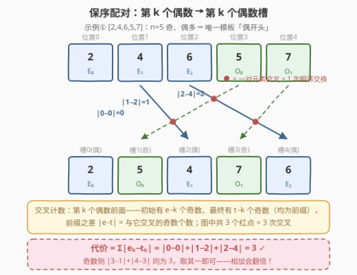
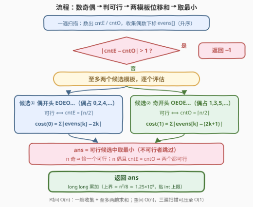

# 最小相邻交换至奇偶交替

- **题目名称**：最小相邻交换至奇偶交替
- **链接**：[3587. 最小相邻交换至奇偶交替](https://leetcode.cn/problems/minimum-adjacent-swaps-to-alternate-parity/)
- **难度**：中等
- **标签**：贪心、数组

## 1. 题目概述

给定一个由**互不相同**的正整数组成的数组 `nums`。一次操作可以交换任意两个**相邻**元素。如果一个排列中**每对相邻元素的奇偶性都不同**（一奇一偶交替出现），则称其为**有效排列**。返回将 `nums` 变成**任意一种**有效排列所需的最小相邻交换次数；若无法重排得到有效排列，返回 `-1`。

**示例 1**：

```text
输入：nums = [2,4,6,5,7]
输出：3
解释：交换 5 和 6 → [2,4,5,6,7]；交换 5 和 4 → [2,5,4,6,7]；
      交换 6 和 7 → [2,5,4,7,6]，此时奇偶交替，共 3 次。
```

**示例 2**：

```text
输入：nums = [2,4,5,7]
输出：1
解释：交换 4 和 5 → [2,5,4,7]，奇偶交替。
```

**示例 3**：

```text
输入：nums = [1,2,3]
输出：0
解释：已经是有效排列。
```

**示例 4**：

```text
输入：nums = [4,5,6,8]
输出：-1
解释：3 偶 1 奇，无法奇偶交替。
```

**约束条件**：

- $1 \le nums.length \le 10^5$
- $1 \le nums[i] \le 10^9$
- `nums` 中所有元素**互不相同**

> 💡 **读题关键**：有效性只取决于每个位置上是奇还是偶，与具体数值无关。长度为 $n$ 的交替奇偶串只有两种模板：`EOEO…`（偶开头，偶占下标 $0,2,4,\dots$）和 `OEOE…`（奇开头）。于是问题拆成两半：**先判个数可行性，再在至多两个目标模板中选「搬过去」最便宜的那个**。

---

## 2. 解题思路

### 2.1 暴力思路：BFS 搜索交换序列

把数组的一种排列视为一个状态，每种状态向 $n-1$ 个相邻交换各引一条边，BFS 求到任意有效排列的最短路。状态数 $n!$，$n=10^5$ 时完全不可行；即便 $n=10$ 也有三百多万个状态。

但这个模型揭示了一个关键性质：**一次相邻交换恰好让一对元素"交叉"（互换相对顺序）一次**。这提示答案不该按"状态"数，而该按"哪些元素对必须互换相对顺序"来数——这是通往闭式解的入口。

### 2.2 核心观察：保序配对，代价 = Σ|当前位置 − 目标槽位|

整个解法由三个层层递进的结论构成。

**结论一（可行性）**：交替串中奇偶个数至多相差 1。设 $cntE$、$cntO$ 为偶、奇元素个数，则 $|cntE - cntO| > 1$ 时直接返回 $-1$。更进一步：

- $n$ 为**偶数**：必须 $cntE = cntO = n/2$，`EOEO…` 与 `OEOE…` 两个模板**都可行**，都要算，取最小；
- $n$ 为**奇数**：个数多的那种奇偶性必须占据下标 $0,2,4,\dots$（多一个），**只有一个模板可行**。

**结论二（保序性）**：最优解中，**偶数之间的相对顺序、奇数之间的相对顺序都保持不变**。交换论证：把两个同奇偶的元素对调位置，不改变任何位置上的奇偶性（合法性只看奇偶），排列依然有效，却白白多花了交叉它们的两次移动——因此最优方案必然是"第 $k$ 个偶数（按原顺序）去第 $k$ 个偶数槽，第 $k$ 个奇数去第 $k$ 个奇数槽"。

**结论三（代价公式）**：设偶数按原顺序的下标为 $e_0 < e_1 < \dots < e_{m-1}$，目标模板中偶数槽位为 $t_0 < t_1 < \dots < t_{m-1}$（即 $0,2,4,\dots$ 或 $1,3,5,\dots$），则该模板的最小相邻交换数为

$$cost = \sum_{k=0}^{m-1} \lvert e_k - t_k \rvert$$



证明用**交叉计数**，分三步：

1. 一次相邻交换 = 一对元素交叉一次。最优解中每对元素至多交叉一次（交叉两次等于白绕一圈），且初始与最终相对顺序相反的对**恰好**交叉一次。由结论二，同奇偶对保序，故**只需数奇偶混合对**。
2. 考察第 $k$ 个偶数：初始时排在它前面的奇数有 $a_k = e_k - k$ 个（位置 $0..e_k-1$ 中恰有 $k$ 个偶数 $e_0..e_{k-1}$，其余是奇数）；最终时排在它前面的奇数有 $b_k = t_k - k$ 个（同理，槽位 $0..t_k-1$ 中恰有 $k$ 个偶数槽）。由于奇数也按序配对，这两批奇数分别是"奇数序列按序的前 $a_k$ 个"和"前 $b_k$ 个"——**两个前缀集合的对称差大小恰为 $|a_k - b_k| = |e_k - t_k|$**，而这正是与第 $k$ 个偶数发生交叉的奇数个数（一个奇数与它交叉 ⟺ 它恰在"初始在前"与"最终在前"之一成立）。
3. 对所有偶数求和，即得总交叉数 = 总交换次数。$\blacksquare$

> 💡 **为什么不算奇数那份？** 把上述论证中的奇偶角色互换，会得到 $\sum_j |o_j - s_j|$，且**两个和恒相等**（都等于混合对交叉总数）。答案取其一即可——**若把两份相加会把答案翻倍**，这是本题最常见的实现失误。示例 1 中：偶数侧 $|0-0|+|1-2|+|2-4| = 3$，奇数侧 $|3-1|+|4-3| = 3$，殊途同归。

### 2.3 算法流程图



整体只有"数个数 → 判可行性 → 至多两个模板各算一遍位移和 → 取最小"四步。注意两个可行性判据恰好刻画了模板数量：$cntE = \lceil n/2 \rceil$ 时偶开头可行，$cntO = \lceil n/2 \rceil$ 时奇开头可行；$n$ 奇时两者互斥（唯一模板），$n$ 偶时同真同假。

### 2.4 示例演算

以**示例 2** `nums = [2,4,5,7]`（$n=4$，$cntE = cntO = 2$，两模板都可行）走完全流程：

| 步骤 | 偶开头模板（偶占 0,2） | 奇开头模板（偶占 1,3） |
|------|------|------|
| 偶数下标 | $evens = [0, 1]$ | $evens = [0, 1]$ |
| 目标槽位 | $t = [0, 2]$ | $t = [1, 3]$ |
| 位移和 | $|0-0| + |1-2| = 1$ | $|0-1| + |1-3| = 3$ |

取最小得 $ans = 1$ ✓（交换 4 和 5 一次即可）。

再验证**示例 1** `nums = [2,4,6,5,7]`：$n=5$ 奇、$cntE=3$ 为多数 → 唯一模板偶开头，$evens = [0,1,2]$，槽位 $[0,2,4]$，代价 $0+1+2 = 3$ ✓。**示例 3** `[1,2,3]`：$cntO=2$ 多数 → 奇开头模板，$evens=[1]$，槽位 $[1]$，代价 $0$ ✓。**示例 4**：$|3-1| = 2 > 1$ → $-1$ ✓。

---

## 3. 参考代码

### C++

```cpp
class Solution {
  public:
    int minSwaps(vector<int>& nums) {
        int n = nums.size();

        vector<int> evens;                          // 偶数元素的下标（升序）
        for (int i = 0; i < n; ++i)
            if (nums[i] % 2 == 0) evens.push_back(i);
        int cntE = evens.size(), cntO = n - cntE;

        if (abs(cntE - cntO) > 1) return -1;        // 个数差超过 1，无解

        // cost(start)：偶数槽位为 start, start+2, start+4, ...
        auto cost = [&](long long start) {
            long long c = 0;
            for (int k = 0; k < cntE; ++k)
                c += llabs(evens[k] - (start + 2LL * k));
            return c;
        };

        const long long INF = LLONG_MAX;
        long long ans = INF;
        if (cntE == (n + 1) / 2) ans = min(ans, cost(0));   // 偶开头：偶占 0,2,4,...
        if (cntO == (n + 1) / 2) ans = min(ans, cost(1));   // 奇开头：偶占 1,3,5,...
        return (int)ans;                                    // 上界 ~1.25e9，int 装得下
    }
};
```

### Python

```python
class Solution:
    def minSwaps(self, nums: List[int]) -> int:
        n = len(nums)

        evens = [i for i, x in enumerate(nums) if x % 2 == 0]
        cnt_e, cnt_o = len(evens), n - len(evens)

        if abs(cnt_e - cnt_o) > 1:                 # 个数差超过 1，无解
            return -1

        def cost(start: int) -> int:               # 偶数槽位为 start, start+2, ...
            return sum(abs(e - (start + 2 * k)) for k, e in enumerate(evens))

        ans = []
        if cnt_e == (n + 1) // 2:                  # 偶开头：偶占 0,2,4,...
            ans.append(cost(0))
        if cnt_o == (n + 1) // 2:                  # 奇开头：偶占 1,3,5,...
            ans.append(cost(1))
        return min(ans)
```

> ⚠️ **溢出提示**：最坏情形（前半全是奇、后半全是偶）代价约为 $n^2/8 \approx 1.25 \times 10^9$，贴着 `int` 上限（$2.1 \times 10^9$）——C++ 中务必用 `long long` 累加再转换返回，直接用 `int` 累加虽侥幸不炸，但属于走钢丝。

---

## 4. 复杂度分析

| 维度 | 复杂度 | 说明 |
|------|--------|------|
| 时间 | $O(n)$ | 一遍扫描收集偶数下标 $O(n)$；两个模板的位移和各 $O(n)$，至多算两次 |
| 空间 | $O(n)$ | `evens` 下标列表。若先数 $cntE$ 再第二遍扫描边走边加，可压到 $O(1)$ 额外空间（两个候选各扫一遍共三遍） |

---

## 5. 扩展：换个视角看这个公式

**与逆序对的等价性**。按结论二保序配对后，最小相邻交换数 = **逆序对个数**（每对元素至多交叉一次、必须交叉一次，一次交换消一个逆序）。本题公式 $\sum_k |e_k - t_k|$ 本质是"只数奇偶混合逆序对"的闭式：第 $k$ 个偶数贡献的逆序数恰是 $|e_k - t_k|$。这与 [3551. 数位和排序需要的最小交换次数](../3501-3600/3551_数位和排序需要的最小交换次数.md) 形成漂亮对照——**任意交换**（代价与距离无关）答案是 $n - 环数$（置换环分解），**相邻交换**（代价按距离计）答案是逆序数（交叉计数），两种自由度对应两套计数理论。

**$O(1)$ 空间写法**。`evens` 列表并非必需：先数出 $cntE$，再扫第二遍，用计数器 `k` 记录"这是第几个偶数"，遇到偶数时直接累加 `|i - (start + 2k)|` 即可。两个候选模板各扫一遍，共三遍扫描、常数额外空间。

**重复元素**。题目保证元素互不相同，但整个算法只依赖奇偶性——即使元素有重复，"奇偶模板 + 保序配对 + 位移和"的推导逐字成立，结论不变。

**若允许任意交换**。答案变为置换环计数 $n - 环数$：先把目标排列按保序配对写成置换（位置 $i$ 的元素要去哪），数环即可，与相邻交换版相差悬殊——$[O,O,E,E]$ 相邻版要 3 次，任意版 1 次（对角线一换）。

---

## 6. 面试要点

- **Q1：为什么最优解中同奇偶元素保持相对顺序？**
  答：交换论证。对调两个同奇偶元素不改变任何位置的奇偶性，排列依然有效，收益为零；而让它们交叉至少需要绕过对方的额外移动。故最优方案中第 $k$ 个偶数去第 $k$ 个偶数槽、第 $k$ 个奇数去第 $k$ 个奇数槽。
- **Q2：$\sum_k |e_k - t_k|$ 为什么恰好等于最小交换次数？**
  答：交叉计数。一次相邻交换 = 一对元素交叉一次；最优解中每对至多交叉一次、顺序翻转的对恰交叉一次，且同奇偶对不交叉。第 $k$ 个偶数前面"初始有 $e_k - k$ 个奇数、最终有 $t_k - k$ 个奇数"，两批都是奇数序列的前缀，对称差 $= |e_k - t_k|$ 即与它交叉的奇数个数。求和即总交换数。
- **Q3：什么时候需要算两个模板？**
  答：仅当 $n$ 为偶数且 $cntE = cntO$ 时，`EOEO…` 与 `OEOE…` 都可行，各算一遍取最小（如示例 2 中 1 与 3 取 1）；$n$ 为奇数时个数多的奇偶性必须占偶数下标，模板唯一。
- **Q4：为什么对偶数求和就够了，不需要再加奇数那份？**
  答：把论证中奇偶角色互换可得 $\sum_j |o_j - s_j|$，两者都等于混合对交叉总数，**恒相等**。只取其一；若相加会把答案精确翻倍——这是本题最典型的实现 bug。
- **Q5：这题和经典逆序对问题是什么关系？**
  答：保序配对下的最小相邻交换数 = 逆序对数。本题相当于"只允许奇偶混合对构成逆序"的特殊版本，公式是其 $O(n)$ 闭式，不需要归并排序/树状数组。对照：任意交换版的最优解是置换环分解的 $n - 环数$（3551 套路）。

---

## 7. 同类练习题

- [2938. 区分黑球与白球](https://leetcode.cn/problems/separate-black-and-white-balls/)：同为"相邻交换 + 二分类"的交叉计数，目标是把黑球全移到一侧，$\sum |pos - target|$ 的最经典形态（题解见[区分黑球与白球](../2901-3000/2938_区分黑球与白球.md)）
- [3551. 数位和排序需要的最小交换次数](https://leetcode.cn/problems/minimum-swaps-to-sort-by-digit-sum/)：**任意交换**的最小次数 = $n - 环数$（置换环分解），与本题的**相邻交换** = 交叉计数互为镜像（题解见[数位和排序需要的最小交换次数](../3501-3600/3551_数位和排序需要的最小交换次数.md)）
- [1850. 邻位交换的最小次数](https://leetcode.cn/problems/minimum-adjacent-swaps-to-reach-the-kth-smallest-number/)：从当前排列到第 $k$ 小排列的相邻交换数，直接按逆序对计数，是本题交叉计数的裸应用（题解见[邻位交换的最小次数](../1801-1900/1850_邻位交换的最小次数.md)）
- [2134. 最少交换次数将二进制字符串所有 1 组合在一起 II](https://leetcode.cn/problems/minimum-swaps-to-group-all-1s-together-ii/)：环形版"相邻交换分组"，把环展开成两倍长再套交叉计数（题解见[最少交换次数来组合所有的 1 II](../2101-2200/2134_最少交换次数来组合所有的1II.md)）
- [801. 使序列递增的最小交换次数](https://leetcode.cn/problems/minimum-swaps-to-make-sequences-increasing/)：受限交换（只能同下标配对交换）改为 DP，对照理解"交换自由度"如何决定解法形态（题解见[使序列递增的最小交换次数](../0801-0900/801_使序列递增的最小交换次数.md)）
