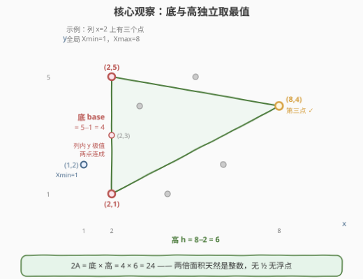
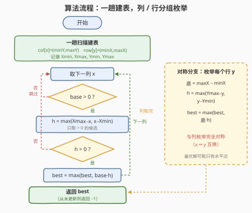

# 找到最大三角形面积

- **题目名称**：找到最大三角形面积
- **链接**：[3588. 找到最大三角形面积](https://leetcode.cn/problems/find-maximum-area-of-a-triangle/)
- **难度**：中等
- **标签**：贪心、几何、数组、哈希表、数学、枚举

## 1. 题目概述

给定二维数组 `coords`（大小 $n \times 2$），表示无限笛卡尔平面上 $n$ 个点。从这 $n$ 个点中任取三个作为顶点组成三角形，要求该三角形**至少有一条边与 x 轴或 y 轴平行**，返回满足条件的三角形的**最大面积的两倍**（即 $2A$）。若不存在这样的三角形，返回 $-1$。注意三角形面积**不能为零**。

**示例 1**：

```text
输入：coords = [[1,1],[1,2],[3,2],[3,3]]
输出：2
解释：取 (1,1)、(1,2) 作垂直底边（长 1），(3,2)（或 (3,3)）作第三顶点（高 2），
     面积 = 1/2 × 1 × 2 = 1，返回 2 × 1 = 2。
```

**示例 2**：

```text
输入：coords = [[1,1],[2,2],[3,3]]
输出：-1
解释：三点共线，且任意两点既不同 x 也不同 y，无法构成一条与坐标轴平行的边。
```

**约束条件**：

- $1 \le n = coords.length \le 10^5$
- $1 \le coords[i][0], coords[i][1] \le 10^6$
- 所有点互不相同

> 💡 **读题关键**：返回的是**两倍面积**——这正暗示底 × 高是纯整数运算，全程无需 $\frac{1}{2}$ 与浮点数。「至少一条边与坐标轴平行」意味着这条边的两个端点**共享同一个 x（垂直边）或同一个 y（水平边）**，这是把几何约束坍缩成「按坐标分组」的破局点。

---

## 2. 解题思路

### 2.1 暴力思路：枚举所有三元组

枚举 $\binom{n}{3}$ 个三元组，对每组判断是否存在两点同 x 或同 y（即有一条轴平行边），再用**鞋带公式**算两倍面积 $2A = |x_1(y_2 - y_3) + x_2(y_3 - y_1) + x_3(y_1 - y_2)|$ 取最大。总复杂度 $O(n^3)$，$n = 10^5$ 时约 $10^{15}$ 次运算，完全不可行。

### 2.2 核心观察：按坐标分组——底边与高独立取最值



**观察一（平行边 ⟺ 同坐标）**：一条边与 y 轴平行，等价于它的两个端点 **x 相同**（同列）；与 x 轴平行等价于两端点 **y 相同**（同行）。于是「三角形至少一条边与轴平行」可拆成两个对称的子问题：**存在两点同列** 或 **存在两点同行**。

**观察二（底与高独立最大化）**：考虑垂直边情形。设底边落在列 $x$ 上，第三点为 $(x', y')$，则

$$2A \;=\; \underbrace{|y_2 - y_1|}_{\text{底}} \times \underbrace{|x' - x|}_{\text{高}}$$

两个因子**互相独立**：底边只能取列 $x$ 上的两点，最优显然是该列 **y 最小与最大**的两点（底 = $\max_y - \min_y$）；高只依赖第三点的 x 坐标，要让 $|x' - x|$ 最大，第三点必然取**全局 x 最小值或最大值**所在的点（前提 $x' \ne x$）。各自取到组内最优，乘积即该列最优——这就是**贪心**：不需要真的枚举第三点，全局极值一次扫描即可维护。

**观察三（对称性）**：水平边情形完全对称——底边取行 $y$ 上 x 最远两点，高取全局 y 极值到该行的距离。两个方向**都必须枚举**：最优三角形可能只有一条水平边平行于坐标轴（垂直边不平行），只查一个方向会漏解。

### 2.3 算法流程图



一趟 $O(n)$ 扫描建立两张哈希表 `col[x] = (minY, maxY)`、`row[y] = (minX, maxX)` 并维护全局极值 $X_{\min}, X_{\max}, Y_{\min}, Y_{\max}$；随后枚举每个 x 组算垂直边候选、每个 y 组算水平边候选，取全局最大。

### 2.4 示例演算

**示例 1** `coords = [[1,1],[1,2],[3,2],[3,3]]`，全局 $X_{\min}=1,\ X_{\max}=3,\ Y_{\min}=1,\ Y_{\max}=3$：

| 分组 | 组内极值 | 底 base | 高 h（取全局极值） | 候选 $2A$ |
|------|----------|---------|--------------------|-----------|
| 列 x=1 | y ∈ {1, 2} | $2-1=1$ | $\max(3-1,\ 1-1)=2$ | $1 \times 2 = 2$ |
| 列 x=3 | y ∈ {2, 3} | $3-2=1$ | $\max(3-3,\ 3-1)=2$ | $1 \times 2 = 2$ |
| 行 y=1 | x ∈ {1} | $0$ | — | 跳过（底为 0） |
| 行 y=2 | x ∈ {1, 3} | $3-1=2$ | $\max(3-2,\ 2-1)=1$ | $2 \times 1 = 2$ |
| 行 y=3 | x ∈ {3} | $0$ | — | 跳过（底为 0） |

最大候选为 $2$，返回 `2`。三个有效候选对应三个不同的三角形（两条垂直底边 + 一条水平底边），**面积两倍恰好相等**——这正是「底与高独立」的直观体现。

**示例 2**：每个 x 组、每个 y 组都只有单个点，底全为 0，无任何有效候选，返回 `-1`。

---

## 3. 参考代码

### C++

```cpp
class Solution {
  public:
    long long maxArea(vector<vector<int>>& coords) {
        long long best = -1;
        unordered_map<int, pair<int, int>> col, row;   // col[x]={minY,maxY}, row[y]={minX,maxX}
        int Xmin = INT_MAX, Xmax = INT_MIN, Ymin = INT_MAX, Ymax = INT_MIN;
        for (auto& p : coords) {
            int x = p[0], y = p[1];
            if (!col.count(x)) col[x] = {y, y};
            else {
                col[x].first  = min(col[x].first,  y);
                col[x].second = max(col[x].second, y);
            }
            if (!row.count(y)) row[y] = {x, x};
            else {
                row[y].first  = min(row[y].first,  x);
                row[y].second = max(row[y].second, x);
            }
            Xmin = min(Xmin, x); Xmax = max(Xmax, x);
            Ymin = min(Ymin, y); Ymax = max(Ymax, y);
        }
        for (auto& [x, rg] : col) {                    // 垂直边：底 = 列内 y 跨度
            long long base = rg.second - rg.first;
            if (!base) continue;                       // 列内无两个不同 y，底为 0
            long long h = 0;                           // 高 = 最远第三点的水平距离
            if (Xmax > x) h = Xmax - x;                // 存在更右的点
            if (Xmin < x) h = max(h, (long long)x - Xmin); // 存在更左的点
            if (h) best = max(best, base * h);         // 2A = 底 × 高
        }
        for (auto& [y, rg] : row) {                    // 水平边：对称处理
            long long base = rg.second - rg.first;
            if (!base) continue;
            long long h = 0;
            if (Ymax > y) h = Ymax - y;
            if (Ymin < y) h = max(h, (long long)y - Ymin);
            if (h) best = max(best, base * h);
        }
        return best;                                   // 无有效候选时仍为 -1
    }
};
```

### Python

```python
class Solution:
    def maxArea(self, coords: List[List[int]]) -> int:
        col = {}   # x -> [minY, maxY]
        row = {}   # y -> [minX, maxX]
        Xmin = Ymin = inf
        Xmax = Ymax = -inf
        for x, y in coords:
            if x in col:
                col[x][0] = min(col[x][0], y)
                col[x][1] = max(col[x][1], y)
            else:
                col[x] = [y, y]
            if y in row:
                row[y][0] = min(row[y][0], x)
                row[y][1] = max(row[y][1], x)
            else:
                row[y] = [x, x]
            Xmin, Xmax = min(Xmin, x), max(Xmax, x)
            Ymin, Ymax = min(Ymin, y), max(Ymax, y)

        best = -1
        for x, (ylo, yhi) in col.items():          # 垂直边：底 = 列内 y 跨度
            base = yhi - ylo
            if not base:
                continue                            # 列内无两个不同 y
            h = 0                                   # 高 = 最远第三点的水平距离
            if Xmax > x: h = Xmax - x
            if Xmin < x: h = max(h, x - Xmin)
            if h:
                best = max(best, base * h)          # 2A = 底 × 高
        for y, (xlo, xhi) in row.items():           # 水平边：对称处理
            base = xhi - xlo
            if not base:
                continue
            h = 0
            if Ymax > y: h = Ymax - y
            if Ymin < y: h = max(h, y - Ymin)
            if h:
                best = max(best, base * h)
        return best
```

> 💡 上述解法已与 $O(n^3)$ 鞋带公式暴力对拍验证：3000 组随机点集（含单点、共线、全点同列等退化用例）结果完全一致。

---

## 4. 复杂度分析

| 维度 | 复杂度 | 说明 |
|------|--------|------|
| 时间 | $O(n)$ | 一趟扫描建表 $O(n)$，枚举列组与行组各 $O(n)$，每步 $O(1)$ |
| 空间 | $O(n)$ | 两张哈希表最多各存 $n$ 个键（列数 + 行数 ≤ $2n$） |

---

## 5. 扩展：变体讨论

- **要求输出三个顶点**：哈希值从「区间」改为「区间 + 取到极值的点坐标」——组内 minY/maxY 记下对应点，全局 $X_{\min}/X_{\max}$ 记下所在点，回溯即可构造具体三角形，复杂度不变。
- **去掉「轴平行边」约束**：退化为 812「最大三角形面积」，按凸包性质最优三角形顶点必在凸包上，$O(n \log n)$ 求凸包后 $O(h^2)$ 或 $O(h^3)$ 枚举；本题的轴平行约束反而把问题降到线性——**约束越强，可利用的结构越多**。
- **坐标扩大到 $10^{18}$**：Python 大整数天然安全；C++ 中 `base * h` 会溢出 `long long`（$10^{36}$），需 `__int128` 或改用比较 `base` 与 `best/h` 的除法判断。

---

## 6. 面试要点

- **Q1：为什么底边一定是组内 y 的极值两点？**
  答：固定列 $x$ 与第三点后，面积与底边长成正比；列上任意两点都合法，跨度最大的必然是 $\min_y$ 与 $\max_y$。这是「交换论证」的平凡形式——把非极值端点换成极值点，面积只增不减。
- **Q2：为什么第三点不必逐个枚举，取全局 x 极值即可？**
  答：高只依赖 $|x' - x|$，与 $y'$ 无关；$|x' - x|$ 的最大值只能出现在 $x' = X_{\min}$ 或 $x' = X_{\max}$ 处。用 `Xmax > x` / `Xmin < x` 两个条件同时保证了 $x' \ne x$（第三点存在性）。
- **Q3：「面积不能为零」与「返回 -1」分别怎么处理？**
  答：底为 0（组内没有两个不同坐标的点）或高为 0（所有点同列/同行，不存在第三点）都跳过该候选；若所有候选都被跳过，`best` 保持初值 $-1$ 直接返回。$n < 3$ 的情形被天然覆盖。
- **Q4：有哪些溢出/精度坑？**
  答：返回值是**两倍面积**，最大约 $(10^6)^2 = 10^{12}$，超出 `int32` 范围——C++ 必须用 `long long` 存累乘结果（函数返回类型已提示）；好在「底 × 高」全程整数，**不要**先算 $\frac{1}{2} \times$ 底 × 高引入浮点。
- **Q5：为什么垂直边与水平边两个方向都要枚举？**
  答：题设只要求「至少一条边」与轴平行。最优三角形可能恰好只有水平边满足约束（其垂直边不与 y 轴平行），此时该候选只能从行分组枚举中得到；只查列分组会漏解。两方向共享一趟建表，代价翻倍但仍是 $O(n)$。

---

## 7. 同类练习题

- [812. 最大三角形面积](https://leetcode.cn/problems/largest-triangle-area/)：去掉轴平行约束的版本，鞋带公式 + 枚举，感受约束如何把 $O(n^2)$+ 级问题压到线性（题解见[最大三角形面积](../0801-0900/812_最大三角形面积.md)）
- [939. 最小面积矩形](https://leetcode.cn/problems/minimum-area-rectangle/)：同款「按列分组 + 哈希查配对」的几何套路，只是目标从三角形换成矩形（题解见[最小面积矩形](../0901-1000/939_最小面积矩形.md)）
- [447. 回旋镖的数量](https://leetcode.cn/problems/number-of-boomerangs/)：按锚点分组、组内统计等距点对，哈希分组思想的纯计数版（题解见[回旋镖的数量](../0401-0500/447_回旋镖的数量.md)）
- [149. 直线上最多的点数](https://leetcode.cn/problems/max-points-on-a-line/)：枚举锚点 + 哈希斜率分组，几何问题哈希化的经典（题解见[直线上最多的点数](../0101-0200/149_直线上最多的点数.md)）
- [3027. 人员站位的方案数II](https://leetcode.cn/problems/find-the-number-of-ways-to-place-people-ii/)：固定一维排序、另一维维护极值的对称枚举骨架，与本题「列/行对称处理」同款（题解见[人员站位的方案数II](../3001-3100/3027_人员站位的方案数II.md)）
