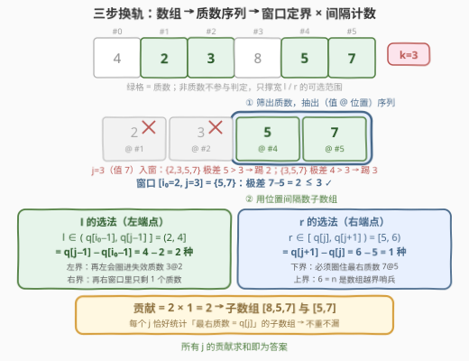
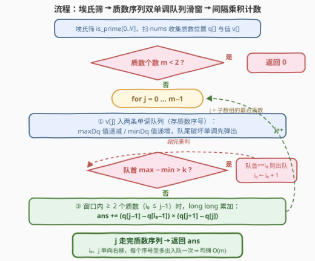

# LeetCode 计数质数间隔平衡子数组 题解

## 1. 题目概述

- **标题 / 题号**：计数质数间隔平衡子数组（#3589，medium）
- **链接**：https://leetcode.cn/problems/count-prime-gap-balanced-subarrays/
- **难度**：中等
- **标签**：数论（埃氏筛）、滑动窗口、单调队列、双指针、组合计数

**题意**：给定整数数组 `nums` 和整数 `k`。一个子数组称为**质数间隔平衡**（prime-gap balanced）的，当且仅当：

1. 它包含**至少两个质数**；
2. 其中**最大质数与最小质数之差**（按数值比）小于或等于 $k$。

返回 `nums` 中质数间隔平衡子数组的数量。

**示例 1**：

```text
输入：nums = [1,2,3], k = 1
输出：2
解释：[2,3] 与 [1,2,3] 均含质数 2、3，最大 − 最小 = 1 ≤ 1。
```

**示例 2**：

```text
输入：nums = [2,3,5,7], k = 3
输出：4
解释：[2,3]、[2,3,5]、[3,5]、[5,7]。而 [3,5,7] 因 7−3=4 > 3 出局。
```

**约束**：

- $1 \le n \le 5 \times 10^4$
- $1 \le \text{nums}[i] \le 5 \times 10^4$
- $0 \le k \le 5 \times 10^4$

> 💡 **读题关键**：① 「最大/最小质数」比的是**数值**而非下标——示例 2 中 $[3,5,7]$ 因 $7-3=4$ 出局；② 非质数元素**完全不参与判定**，它们只是子数组里的「填充物」，只影响左右端点能张多宽；③ $n$ 与值域同为 $5\times10^4$，答案最坏约 $\tfrac{n(n-1)}{2} \approx 1.25\times10^9$——C++ 里 int 勉强装得下最终答案，但**中间乘积会溢出**，必须用 long long 累加。

## 2. 解题思路

### 2.1 暴力思路：枚举子数组 + 增量维护质数极值

枚举左端 $l$，向右扩 $r$，顺手维护「已见质数的 max / min / 个数」：个数 $\ge 2$ 且极差 $\le k$ 就 $+1$。单次判定 $O(1)$，总量 $O(n^2) \approx 1.25 \times 10^9$，必然超时（Python 更是毫无机会）。

暴力虽超时，却暴露了关键结构：**子数组的合法性只取决于它圈住了哪些质数**——非质数元素无论多少个、是什么值，都不改变判定结果。这提示我们把问题从「数组」压到「质数序列」上做。

### 2.2 核心观察：压到质数序列 + 滑窗定界 + 间隔乘积计数



**前置一步（筛）**：值域即筛域（$5\times10^4$），**埃氏筛**一遍预处理 `is_prime[]`（[204. 计数质数](https://leetcode.cn/problems/count-primes/) 的标准套路），扫一遍 `nums` 抽出**质数序列**：位置 $q_1 < q_2 < \cdots < q_m$、对应值 $v_i = \text{nums}[q_i]$，并设哨兵 $q_0 = -1$、$q_{m+1} = n$。

**观察一（子数组 ↔ 质数连续段）**。子数组是连续区间，它圈住的质数在质数序列中必是一段**连续区间** $[i, j]$（$q_i$ = 第一个 $\ge l$ 的质数，$q_j$ = 最后一个 $\le r$ 的质数）。于是合法性与计数都只在 $(i, j)$ 上讨论：

$$\text{合法} \iff j \ge i+1 \ \text{且}\ \max(v_i..v_j) - \min(v_i..v_j) \le k$$

**观察二（固定 $j$，合法 $i$ 连成区间，且左界单调右移）**。固定 $j$ 让 $i$ 左移，区间 $[i,j]$ 只增不减：**max 不减、min 不增，极差单调不减**——合法的 $i$ 必是连续区间 $[i_0(j),\, j]$（单元素区间极差为 $0$ 恒合法，区间非空）。再看 $j$ 增大时：若 $[i, j+1]$ 合法，则其子区间 $[i, j]$ 极差只会更小、必合法——即 **$j+1$ 的合法集合是 $j$ 的子集**，故 $i_0(j)$ **单调不减**。于是 $(i_0, j)$ 是只会整体右移的**双指针窗口**；窗口 max/min 用**两条单调双端队列**维护（maxDq 值递减、minDq 值递增，存质数序号，队首即最值），与 [1438. 绝对差不超过限制的最长连续子数组](https://leetcode.cn/problems/longest-continuous-subarray-with-absolute-diff-less-than-or-equal-to-limit/) 完全同款。

**观察三（间隔乘积计数）**。固定 $j$，合法的 $i \in [i_0, j-1]$（至少两个质数）。逐个 $(i, j)$ 对数出子数组个数再求和：

- **$l$ 的选法**：要让「第一个被圈住的质数」恰是 $q_i$，须 $l \in (q_{i-1}, q_i]$，共 $q_i - q_{i-1}$ 个。对 $i \in [i_0, j-1]$ 求和，**望远镜求和**塌缩成 $q_{j-1} - q_{i_0-1}$。直观地说：$l \in (q_{i_0-1},\, q_{j-1}]$——**左界**再往左会圈进「害群之马」$q_{i_0-1}$（极差超标），**右界**再往右窗口里就只剩 1 个质数。
- **$r$ 的选法**：要让 $q_j$ 是最后一个被圈住的质数，须 $r \in [q_j, q_{j+1})$，共 $q_{j+1} - q_j$ 个（$j = m$ 时用哨兵 $q_{m+1} = n$）。

$$\text{ans} \;=\; \sum_{j \ge 2} \bigl(q_{j-1} - q_{i_0(j)-1}\bigr)\cdot\bigl(q_{j+1} - q_j\bigr)$$

> 💡 **不重不漏**：每个子数组按「最右质数」唯一归到某个 $j$ 名下——$r$ 落在 $[q_j, q_{j+1})$ 里的子数组不可能同时属于 $j$ 和 $j+1$；而 $j$ 名下所有 $l \in (q_{i_0-1}, q_{j-1}]$ 的子数组都被恰好计入一次。求和即答案。

> ⚠️ **溢出陷阱**：$q_{j-1} - q_{i_0-1}$ 与 $q_{j+1} - q_j$ 各自上界约 $n+1$，乘积可达 $\approx 2.5\times10^9$ **超出 int32**；C++ 必须先转 `long long` 再乘（最终答案 $\le \tfrac{n(n-1)}{2}$ 反而装得下 int，但中间量不行）。

### 2.3 算法流程图



| 步骤 | 动作 | 数据结构 |
|------|------|----------|
| ① 前置 | 埃氏筛 `is_prime[0..V]`，扫 `nums` 抽出 `q[]` / `v[]` | 筛表 $O(V)$ |
| ② 入队 | `v[j]` 压入 maxDq（值递减）/ minDq（值递增），存质数序号，队尾破坏单调先弹 | 两条 deque |
| ③ 缩窗 | 队首 `max − min > k` 时右移 `i₀`（队首序号 == i₀ 才出队） | 双指针 |
| ④ 计数 | `i₀ ≤ j−1` 时累加 `(q[j−1]−q[i₀−1]) × (q[j+1]−q[j])` | long long |

### 2.4 示例演算

以示例 2（`nums = [2,3,5,7]`，`k = 3`）演算（质数序号取 1-based，$q_0 = -1$，$q_5 = n = 4$）：

| $j$ | $v_j$ | 缩窗过程 | 窗口 $[i_0, j]$ | 极差 | 贡献 | 本步计入的子数组 |
|-----|-------|----------|-----------------|------|------|------------------|
| 1 | 2 | — | $[1, 1]$ | 0 | $i_0 > j-1$，计 0 | — |
| 2 | 3 | 不缩 | $[1, 2]$ | 1 | $(q_1-q_0)(q_3-q_2) = 1 \times 1 = 1$ | $[2,3]$ |
| 3 | 5 | 不缩 | $[1, 3]$ | 3 | $(q_2-q_0)(q_4-q_3) = 2 \times 1 = 2$ | $[2,3,5]$、$[3,5]$ |
| 4 | 7 | $\{2,3,5,7\}$ 差 $5>3$ 踢 2 → $\{3,5,7\}$ 差 $4>3$ 踢 3 | $[3, 4]$ | 2 | $(q_3-q_2)(q_5-q_4) = 1 \times 1 = 1$ | $[5,7]$ |

合计 $1 + 2 + 1 = 4$ ✓。注意 $j=4$ 时踢掉 2、3 不是因为它们「本身无效」，而是**带上 7 之后极差超标**——$i_0$ 刻画的是「能带上的最左质数」。

## 3. 参考代码

### C++

```cpp
class Solution {
  public:
    int primeSubarray(vector<int>& nums, int k) {
        int n = nums.size();
        int V = *max_element(nums.begin(), nums.end());
        vector<bool> isp(V + 1, true);              // 埃氏筛：值域即筛域
        isp[0] = isp[1] = false;
        for (int d = 2; 1LL * d * d <= V; ++d)
            if (isp[d])
                for (int x = d * d; x <= V; x += d) isp[x] = false;

        vector<int> q, v;                           // 质数位置 / 质数值
        q.reserve(n);
        for (int i = 0; i < n; ++i)
            if (isp[nums[i]]) { q.push_back(i); v.push_back(nums[i]); }
        int m = q.size();
        if (m < 2) return 0;
        auto gap = [&](int t) { return t < 0 ? -1 : (t < m ? q[t] : n); };  // 哨兵 q[-1]=-1、q[m]=n

        deque<int> maxDq, minDq;                    // 存质数序号：maxDq 值递减、minDq 值递增
        int i0 = 0;
        long long ans = 0;
        for (int j = 0; j < m; ++j) {               // j = 子数组的最右质数
            while (!maxDq.empty() && v[maxDq.back()] <= v[j]) maxDq.pop_back();
            maxDq.push_back(j);
            while (!minDq.empty() && v[minDq.back()] >= v[j]) minDq.pop_back();
            minDq.push_back(j);
            while (v[maxDq.front()] - v[minDq.front()] > k) {   // 缩窗到极差 ≤ k
                if (maxDq.front() == i0) maxDq.pop_front();
                if (minDq.front() == i0) minDq.pop_front();
                ++i0;
            }
            if (i0 <= j - 1)                        // 窗口内至少 2 个质数才计数
                ans += 1LL * (gap(j - 1) - gap(i0 - 1)) * (gap(j + 1) - gap(j));
        }
        return ans;
    }
};
```

### Python

```python
from collections import deque


class Solution:
    def primeSubarray(self, nums: List[int], k: int) -> int:
        n = len(nums)
        V = max(nums)
        isp = bytearray([1]) * (V + 1)              # 埃氏筛：值域即筛域
        isp[0] = isp[1] = 0
        for d in range(2, int(V ** 0.5) + 1):
            if isp[d]:
                isp[d * d::d] = bytearray(len(range(d * d, V + 1, d)))
        q = [i for i, x in enumerate(nums) if isp[x]]   # 质数位置
        v = [nums[i] for i in q]                        # 质数值
        m = len(q)
        if m < 2:
            return 0

        def gap(t):                                 # 哨兵：q[-1] = -1、q[m] = n
            return q[t] if 0 <= t < m else (-1 if t < 0 else n)

        max_dq = deque()                            # 存质数序号，值递减：队首即窗口 max
        min_dq = deque()                            # 存质数序号，值递增：队首即窗口 min
        i0 = 0
        ans = 0
        for j in range(m):                          # j = 子数组的最右质数
            while max_dq and v[max_dq[-1]] <= v[j]:
                max_dq.pop()
            max_dq.append(j)
            while min_dq and v[min_dq[-1]] >= v[j]:
                min_dq.pop()
            min_dq.append(j)
            while v[max_dq[0]] - v[min_dq[0]] > k:          # 缩窗到极差 ≤ k
                if max_dq[0] == i0:
                    max_dq.popleft()
                if min_dq[0] == i0:
                    min_dq.popleft()
                i0 += 1
            if i0 <= j - 1:                         # 窗口内至少 2 个质数才计数
                ans += (gap(j - 1) - gap(i0 - 1)) * (gap(j + 1) - gap(j))
        return ans
```

> 💡 **实现细节**：① 缩窗循环天然安全——窗口缩到单元素时极差为 $0 \le k$ 必然停下，`i₀` 永远 $\le j$，队列不会两空；② 队列存**质数序号**而非位置/值，缩窗判断 `front == i0` 才是同一套下标体系；③ `gap` 哨兵函数把 $q_{-1} = -1$、$q_m = n$ 揉进同一个下标函数，边界零特判；④ Python 的筛用 `bytearray` + 切片赋值，比逐个 `if` 快一个量级。

## 4. 复杂度分析

| 维度 | 复杂度 | 说明 |
|------|--------|------|
| **时间复杂度** | $O(n + V \log\log V)$ | 埃氏筛 $O(V\log\log V)$（$V = 5\times10^4$）；主循环中 $i_0$、$j$ 均单向右移，每个质数序号在两条队列中至多入队、出队各一次，均摊 $O(m) \le O(n)$ |
| **空间复杂度** | $O(V)$ | 筛表占 $O(V)$；`q`/`v` 与两条队列共 $O(m)$，均受 $V$ 与 $n$ 约束 |

> - 暴力解为 $O(n^2)$：元素几乎全是同一质数时（如全 2），内层永不提前 break；
> - 若把两条队列换成 `multiset` 或双懒删除堆，窗口极值查询变 $O(\log m)$，总量 $O(m \log m)$——正确性不变，但浪费了「左端顺序出、右端入时可淘汰弱者」的单调性；
> - $V$ 与 $n$ 同阶（都 $\le 5\times10^4$），筛与扫描的开销同级，谁也不是瓶颈。

## 5. 扩展：ST 表 + 二分 —— 官方提示的另一条路

本题官方 hints 给的是：**筛 → ST 表 $O(1)$ 极值查询 → 对每个质数二分最远合法伙伴 → 左右间隔相乘计数**。这条路的依据同样是对单调性的两种读法：

| | 固定左端 $i$（官方提示视角） | 固定右端 $j$（本文视角） |
|---|---|---|
| 单调性 | $j$ 增大区间变宽，极差单调不减 → 对 $i$ 可二分最远 $J(i)$ | $i$ 减小区间变宽，极差单调不减 → 合法 $i$ 连成区间 |
| 嵌套性 | $J(i)$ 随 $i$ 单调不减（子区间极差更小） | $i_0(j)$ 随 $j$ 单调不减 |
| 实现选择 | ST 表 $O(1)$ 查极差 + 二分 → $O(m\log m)$ | 双指针 + 双单调队列 → $O(m)$ |

可见**「二分」只是单调性未被指针利用时的退路**：既然 $J(i)$（等价地 $i_0(j)$）本身单调，两个端点都可以单向滑动，单调队列进一步把极值维护压到均摊 $O(1)$，ST 表的 $O(m\log m)$ 预处理与 $O(m\log m)$ 空间就全省了。这两条路的计数公式互为镜像——固定 $i$ 版本贡献为 $(q_i - q_{i-1}) \cdot (q_{J(i)+1} - q_{i+1})$。

**变体思考**：若把条件改成「至少两个**不同**质数」，重复值（如 $[2,2]$）不再算两个质数，窗口需要额外维护「值计数 ≤ 出现即增」的去重逻辑；若极差约束作用在**所有元素**而非只质数上，则退化为 [2762. 不间断子数组](https://leetcode.cn/problems/continuous-subarrays/) 的标准滑窗计数——本题相当于在它外面套了一层「值域筛 + 序列压缩」的马甲。

## 6. 面试要点

1. **为什么固定 $j$ 后合法的 $i$ 连成一段区间？**

   > 固定 $j$ 让 $i$ 左移，区间 $[i, j]$ 只增不减：max 只增不减、min 只减不增，极差单调不减。合法 → 非法只有一个转折点，合法 $i$ 是后缀区间 $[i_0, j]$；且单元素区间极差为 0 恒合法，$i_0$ 存在。

2. **为什么 $i_0$ 单调不减、双指针因此成立？**

   > 嵌套性反证：若 $[i, j+1]$ 合法，则其子区间 $[i, j]$ 极差只会更小、必合法。即 $j$ 增大后合法集合只会收缩（是原先的子集），左边界 $i_0$ 不可能回退——两根指针都单向右移，每个质数序号至多被越过一次。

3. **计数为什么是两个「位置间隔」的乘积？**

   > $(i, j)$ 对与子数组构成双射：$l \in (q_{i-1}, q_i]$ 定住「第一个质数」，$r \in [q_j, q_{j+1})$ 定住「最后一个质数」。固定 $j$ 时对 $i \in [i_0, j-1]$ 的 $q_i - q_{i-1}$ 望远镜求和得 $q_{j-1} - q_{i_0-1}$，乘上 $r$ 的选法数 $q_{j+1} - q_j$。按「最右质数」归类保证不重不漏。

4. **什么时候必须用 ST 表 / 二分，什么时候单调队列就够？**

   > 关键看**窗口边界是否单调移动**。本题 $i_0(j)$ 单调不减，两端都只前进不后退，单调队列均摊 $O(1)$。若查询的区间端点会任意跳跃（如在线区间最值、端点不单调的双查询），队列无法复用，才需要 $O(m\log m)$ 的 ST 表或线段树。

5. **有哪些边界与溢出的坑？**

   > ① 质数个数 $m < 2$ 直接返回 0（含全非质数、单元素数组）；② $k = 0$ 合法（窗口内质数值全等，如 $[2,2]$ 算一个）；③ 贡献乘积上界 $\approx (n+1)^2 \approx 2.5\times10^9$ 超 int32，C++ 要 `1LL *` 先转再乘；④ 哨兵 $q_{-1} = -1$、$q_m = n$ 让 $j = m-1$ 与 $i_0 = 0$ 无需特判。

## 同类练习题

| # | 题目 | 与本题的关联 |
|---|------|-------------|
| 1438 | [绝对差不超过限制的最长连续子数组](https://leetcode.cn/problems/longest-continuous-subarray-with-absolute-diff-less-than-or-equal-to-limit/)（[题解](../1401-1500/1438_绝对差不超过限制的最长连续子数组.md)） | 双单调队列维护窗口极差的原型题，本题窗口维护逻辑的同款模板 |
| 2762 | [不间断子数组](https://leetcode.cn/problems/continuous-subarrays/)（[题解](../2701-2800/2762_不间段子数组.md)） | 同款滑窗数合法子数组，极差约束作用于全部元素（本题只看质数）的退化版 |
| 239 | [滑动窗口最大值](https://leetcode.cn/problems/sliding-window-maximum/)（[题解](../0201-0300/239_滑动窗口最大值.md)） | 单调队列的底层模板，本题两条队列的维护逻辑由此扩展 |
| 204 | [计数质数](https://leetcode.cn/problems/count-primes/)（[题解](../0201-0300/204_计数质数.md)） | 埃氏筛原型，本题第一步「值域即筛域」的直接来源 |
| 3569 | [分割数组后不同质数的最大数目](https://leetcode.cn/problems/maximize-count-of-distinct-primes-after-split/)（[题解](../3501-3600/3569_分割数组后不同质数的最大数目.md)） | 同为「先筛质数、再在质数序列/位置上做文章」的换轨思路 |
