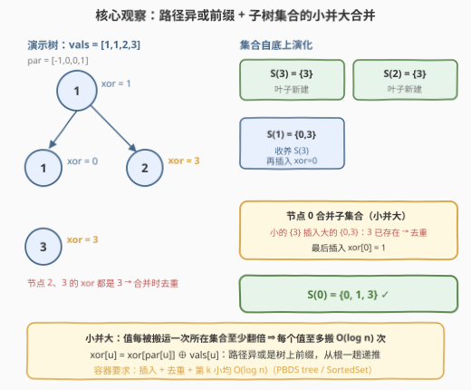
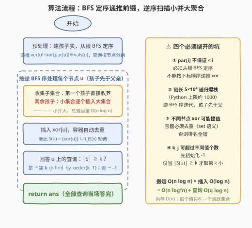

# LeetCode 第K小的路径异或和 题解

## 1. 题目概述

- **标题 / 题号**：第K小的路径异或和（#3590，hard）
- **链接**：https://leetcode.cn/problems/kth-smallest-path-xor-sum/
- **难度**：困难
- **标签**：树、深度优先搜索、数组、有序集合

**题意**：给定一棵以节点 $0$ 为根的树，共 $n$ 个节点（编号 $0$ 到 $n-1$）。每个节点 $i$ 有整数值 $vals[i]$，父节点由 $par[i]$ 给出。

从根到节点 $u$ 的**路径异或和**定义为：路径上所有节点的 $vals$ 按位异或（含 $u$ 自身）。

给定查询数组 $queries[j] = [u_j, k_j]$：对每个查询，求以 $u_j$ 为根的子树内、所有节点的路径异或和**去重后**第 $k_j$ 小的值；若不同值少于 $k_j$ 个，答案为 $-1$。返回答案数组。

**示例 1**：

```text
输入：par = [-1,0,0], vals = [1,1,1], queries = [[0,1],[0,2],[0,3]]
输出：[0,1,-1]
解释：路径异或和：节点 0 → 1；节点 1、2 → 1⊕1 = 0。
     节点 0 的子树不同值为 {0, 1}：第 1 小是 0，第 2 小是 1，第 3 小不存在 → -1。
```

**示例 2**：

```text
输入：par = [-1,0,1], vals = [5,2,7], queries = [[0,1],[1,2],[1,3],[2,1]]
输出：[0,7,-1,0]
解释：路径异或和：节点 0 → 5；节点 1 → 5⊕2 = 7；节点 2 → 5⊕2⊕7 = 0。
     子树 {0,1,2} 不同值为 {0,5,7}；子树 {1,2} 为 {0,7}；子树 {2} 为 {0}。
```

**约束**：

- $1 \le n = vals.length \le 5 \times 10^4$
- $0 \le vals[i] \le 10^5$
- $par[0] = -1$，$par$ 表示一棵合法的树
- $1 \le queries.length \le 5 \times 10^4$，$1 \le k_j \le n$

> 💡 **读题关键**：三个信号——① 路径异或和是「树上前缀」：$xor[u] = xor[par[u]] \oplus vals[u]$，一遍自顶向下递推即可全部算出；② 查询对象是**子树**——自底向上聚合时，父的集合 = 子集合的并 ∪ 自身，天然可合并；③ 「去重 + 第 $k$ 小」要求容器具备**排名查询**能力（PBDS / SortedSet），普通哈希集合做不到。

## 2. 解题思路

### 2.1 暴力思路：每个查询独立统计

对每个查询 $[u, k]$：DFS 一遍 $u$ 的子树，收集所有节点的路径异或和，去重、排序，取第 $k$ 小。单次代价 $O(s_u \log s_u)$（$s_u$ 为子树大小），$q$ 个查询互不共享，最坏（都查根、树是链）达到 $O(nq) \approx 2.5 \times 10^9$。

瓶颈在于**查询之间零共享**——但子树之间有包含关系：$S(u) = \{xor[u]\} \cup \bigcup_{v \text{ 是 } u \text{ 的孩子}} S(v)$，其中 $S(u)$ 是子树 $u$ 内不同路径异或和的集合。同一棵子树被反复统计，应改为**自底向上一次聚合、边聚合边回答查询**。

### 2.2 核心观察：路径异或前缀 + 启发式合并（小并大）



**观察一（路径异或 = 树上前缀）**：异或满足结合律，从根往下递推 $xor[u] = xor[par[u]] \oplus vals[u]$，$n$ 个值一遍 BFS/DFS 全部就位。「子树内路径异或和集合」从此与「路径」无关，只是**每个节点携带一个数**的子树聚合问题。

**观察二（子树集合的递推式）**：$S(u) = \{xor[u]\} \cup \bigcup_v S(v)$。叶子是单元素集合；每个节点合并完子集合、塞入自身值后，集合恰好就绪，可以立刻回答挂在该节点上的全部查询。

**观察三（小并大：每个值至多被搬运 $O(\log n)$ 次）**：合并两个集合时，**把元素少的逐个插入元素多的**。一个元素每次被搬运，它落入的集合大小至少是原来的 2 倍，从规模 1 涨到 $n$ 至多翻 $\log_2 n$ 次 ⇒ 全体值的总搬运量为 $O(n \log n)$。这是「启发式合并」的标准论证。

**观察四（容器选型）**：合并后的容器要同时支持——插入 $O(\log n)$、**自动去重**（set 语义）、第 $k$ 小 $O(\log n)$。C++ 用 PBDS 的 `tree`（`find_by_order`），Python 用 `sortedcontainers.SortedSet`（下标直达）。普通 `set`/`sorted` 列表要么没有排名，要么插入太慢。

> ⚠️ **四个坑（代码里都有对应处理）**：
> 1. **去重是硬需求**：不同节点的路径异或和可以相等（示例 1 中节点 1、2 的值都是 $0$），容器必须是 set 语义，否则排名全错；
> 2. **$par[i]$ 不保证 $< i$**：不能按下标 $0..n-1$ 顺序递推 $xor$，必须从根 BFS/DFS 定序；
> 3. **递归会爆栈**：链长 $5 \times 10^4$，Python 默认递归上限 $1000$——用「BFS 序的逆序」迭代处理，父必先于子出现在 BFS 序中，逆序即孩子先于父亲，等价于后序；
> 4. **$k_j$ 可能越界**：不同值不足 $k_j$ 个时输出 $-1$，查询前先比集合大小。

### 2.3 算法流程图



整体 = 一次预处理（建孩子表 + BFS 定序算 $xor$ + 查询按节点分组）+ 一趟逆 BFS 序扫描：每个节点先收养/合并子集合（小的并大的），插入自身 $xor$ 值，再回答挂在自己身上的所有查询。

### 2.4 示例演算

以**示例 1** `par = [-1,0,0]`，`vals = [1,1,1]`（根 0，孩子 1、2）走完全流程：

| 节点 | xor 值 | 合并过程 | $S(u)$ | 挂在该节点的查询 |
|------|--------|----------|--------|------------------|
| 1（叶子） | $1 \oplus 1 = 0$ | 新建集合 $\{0\}$ | $\{0\}$ | 无 |
| 2（叶子） | $1 \oplus 1 = 0$ | 新建集合 $\{0\}$ | $\{0\}$ | 无 |
| 0（根）   | $1$ | 收养 $S(1)=\{0\}$；把更小的 $S(2)=\{0\}$ 并入（$0$ 已存在 → **去重**）；插入自身 $1$ | $\{0, 1\}$ | $k{=}1 \to 0$；$k{=}2 \to 1$；$k{=}3 \to$ 不足 $3$ 个 $\to -1$ |

输出 $[0, 1, -1]$ ✓。注意节点 1、2 的 xor 值相同，合并时第二次出现的 $0$ 被去重——这正是容器必须选 set 语义的原因。示例 2 同法演算得 $[0, 7, -1, 0]$ ✓。

## 3. 参考代码

### C++

```cpp
#include <ext/pb_ds/assoc_container.hpp>
#include <ext/pb_ds/tree_policy.hpp>
using namespace __gnu_pbds;

// PBDS 平衡树：insert 去重 + find_by_order(k-1) 取第 k 小，均 O(log n)
template <class T>
using OSTree = tree<T, null_type, less<T>, rb_tree_tag,
                    tree_order_statistics_node_update>;

class Solution {
  public:
    vector<int> kthSmallest(vector<int>& par, vector<int>& vals,
                            vector<vector<int>>& queries) {
        int n = vals.size();
        vector<vector<int>> ch(n);
        for (int i = 1; i < n; ++i) ch[par[i]].push_back(i);

        // BFS 定序：par[i] 不保证 < i，必须从根出发；顺便递推路径异或前缀
        vector<int> xr(n), order;
        order.reserve(n);
        queue<int> q;
        q.push(0);
        xr[0] = vals[0];
        while (!q.empty()) {
            int u = q.front(); q.pop();
            order.push_back(u);
            for (int v : ch[u]) { xr[v] = xr[u] ^ vals[v]; q.push(v); }
        }

        // 查询按节点分组，聚合到谁就当场回答谁
        vector<vector<pair<int, int>>> qat(n);
        for (int j = 0; j < (int)queries.size(); ++j)
            qat[queries[j][0]].push_back({queries[j][1], j});

        vector<int> ans(queries.size(), -1);
        vector<OSTree<int>*> st(n, nullptr);
        for (int i = n - 1; i >= 0; --i) {      // 逆 BFS 序：孩子必先于父亲
            int u = order[i];
            OSTree<int>* s = nullptr;
            for (int v : ch[u]) {
                OSTree<int>* t = st[v];
                st[v] = nullptr;                 // 子集合引用即弃，控内存
                if (!s) { s = t; continue; }     // 第一个孩子：直接收养
                if (t->size() > s->size()) swap(s, t);   // 小并大
                for (int x : *t) s->insert(x);   // 去重由 tree 语义保证
                delete t;
            }
            if (!s) s = new OSTree<int>();       // 叶子：新建
            s->insert(xr[u]);                    // 自身入集合
            for (auto& [k, j] : qat[u])
                if ((int)s->size() >= k) ans[j] = *s->find_by_order(k - 1);
            st[u] = s;
        }
        delete st[0];                            // 全程只剩根集合
        return ans;
    }
};
```

### Python

```python
from sortedcontainers import SortedSet
from collections import deque

class Solution:
    def kthSmallest(self, par: List[int], vals: List[int],
                    queries: List[List[int]]) -> List[int]:
        n = len(vals)
        ch = [[] for _ in range(n)]
        for i in range(1, n):
            ch[par[i]].append(i)

        # BFS 定序（par[i] 不保证 < i），顺便递推路径异或前缀
        xr = [0] * n
        xr[0] = vals[0]
        order = []
        dq = deque([0])
        while dq:
            u = dq.popleft()
            order.append(u)
            for v in ch[u]:
                xr[v] = xr[u] ^ vals[v]
                dq.append(v)

        qat = [[] for _ in range(n)]             # 查询按节点分组
        for j, (u, k) in enumerate(queries):
            qat[u].append((k, j))

        ans = [-1] * len(queries)
        st = [None] * n
        for u in reversed(order):                # 逆 BFS 序：孩子必先于父亲
            s = None
            for v in ch[u]:
                t = st[v]
                st[v] = None                     # 子集合引用即弃，控内存
                if s is None:
                    s = t                        # 第一个孩子：直接收养
                else:
                    if len(t) > len(s):
                        s, t = t, s              # 小并大
                    s.update(t)                  # SortedSet 自动去重
            if s is None:
                s = SortedSet()                  # 叶子：新建
            s.add(xr[u])                         # 自身入集合
            for k, j in qat[u]:
                if len(s) >= k:                  # 不足 k 个 → 保持 -1
                    ans[j] = s[k - 1]            # 下标直达第 k 小
            st[u] = s
        return ans
```

> 💡 两份代码同构：**逆 BFS 序迭代**代替递归后序，链状树不爆栈；`st[v]` 合并完立即置空，保证任一时刻每个 xor 值只存在于一个活跃集合中，内存 $O(n)$。实测 $n = q = 5 \times 10^4$：C++ 0.06s、Python 0.7s 以内。

## 4. 复杂度分析

| 维度 | 复杂度 | 说明 |
|------|--------|------|
| 时间 | $O(n \log^2 n + q \log n)$ | 小并大使总搬运量为 $O(n \log n)$，每次搬运是一次 $O(\log n)$ 的有序插入；每条查询 `find_by_order` / 下标取值 $O(\log n)$ |
| 空间 | $O(n + q)$ | 树结构 + 查询分组；任一时刻每个 xor 值恰在一个活跃集合里，集合总大小 $\le n$ |

> 💡 搬运量 $O(n \log n)$ 的直觉：一个值每被搬一次，所在集合规模至少翻倍——规模从 1 涨到 $n$ 最多翻 $\log_2 n$ 次。$n = 5 \times 10^4$ 时 $\log_2 n \approx 16$，总搬运约 $8 \times 10^5$ 次，配合 $\log$ 级插入仍在千万级基本操作内，两语言都轻松通过。

## 5. 扩展：线段树合并把「重复搬运」彻底消除

- **权值线段树合并 $O((n + q) \log V)$**：每个节点挂一棵值域 $[0, 2^{17})$ 动态开点的计数线段树（$vals \le 10^5$，异或值域 $< 2^{17}$）。合并是**破坏性**的两树对走：节点被访问一次即消费，全程创建的线段树节点总量 $O(n \log V)$ 封顶——比小并大的 $O(n \log^2 n)$ 少一个 $\log$，代价是代码量翻倍。第 $k$ 小 = 从根下行，比较左子树计数与 $k$。**01-Trie 合并**是它的二进制视角同构体。
- **dsu on tree（树上启发式合并）**：换一条路——不维护每节点集合，而是维护一个全局树状数组 + 计数数组，重儿子保留、轻儿子统计完就撤销，第 $k$ 小在树状数组上倍增下行。复杂度同为 $O((n + q) \log^2 n)$，常数更小，适合卡常场景。
- **变体讨论**：若询问改成「子树内第 $k$ 小**不去重**」，计数线段树合并直接支持（按计数而非存在性下行）；若从「子树」改成「任意路径 $u \to v$ 的第 $k$ 小」，子树聚合失效，需转向**可持久化 01-Trie**（前缀异或数组可持久化 + LCA 处拆分）。

## 6. 面试要点

- **Q1：为什么路径异或和可以一遍递推出？要注意什么？**
  答：$xor[u] = xor[par[u]] \oplus vals[u]$ 是前缀性质，异或结合律保证正确性。注意 $par[i]$ **不保证小于 $i$**，按下标顺序递推会用到尚未计算的父值，必须从根 BFS/DFS 定序后再递推。
- **Q2：小并大为什么保证每个元素至多被搬 $O(\log n)$ 次？**
  答：合并时只把**小**集合的元素插入**大**集合。一个元素每被搬运一次，它所在集合的规模至少翻倍（因为另一方不小于它），规模从 1 到 $n$ 至多翻 $\log_2 n$ 次，所以全体元素的总搬运量是 $O(n \log n)$。
- **Q3：为什么容器必须去重？**
  答：不同节点的路径异或和可以撞值（示例 1 中两个子节点的值都是 $0$）——去重前第 1 小是 $0$、第 2 小还是 $0$，与题意不符。C++ PBDS `tree` 与 Python `SortedSet` 天然是 set 语义；若用 `SortedList` 就得自己先查存在性。
- **Q4：为什么用逆 BFS 序迭代，而不是写递归后序 DFS？**
  答：树可以是 $5 \times 10^4$ 的链，Python 默认递归上限约 $1000$，递归必爆栈。BFS 序保证父先于子，**逆序遍历即孩子先于父亲**，与后序 DFS 等价，却只需一个数组下标循环。
- **Q5：查询 $k$ 越界怎么处理？第 $k$ 小的复杂度是多少？**
  答：先把 $ans[j]$ 初始化为 $-1$；仅当 $\lvert S(u) \rvert \ge k$ 时才取值——PBDS `find_by_order(k-1)`、`SortedSet[k-1]` 均为 $O(\log n)$。每条查询只在聚合到 $u_j$ 时回答一次，无需重复统计。

## 同类练习题

| # | 题目 | 与本题的关联 |
|---|------|-------------|
| 1519 | [子树中标签相同的节点数](https://leetcode.cn/problems/number-of-nodes-in-the-sub-tree-with-the-same-label/) | 同为「子树信息自底向上聚合」，但标签只有 26 个字母，用计数数组逐子树相加即可——体会「信息维度小 ⇒ 计数数组，维度大 ⇒ 有序集合/合并」（题解见[带给定标签的二叉树中的节点数](../1501-1600/1519_带给定标签的二叉树中的节点数.md)） |
| 2003 | [每棵子树内缺失的最小基因值](https://leetcode.cn/problems/smallest-missing-genetic-value-in-each-subtree/) | 子树内 mex 查询，利用「1 所在链的特殊性」自顶向下衔接，是子树离线问题的另一种思维（题解见[每棵子树内缺失的最小基因值](../2001-2100/2003_每棵子树内缺失的最小基因值.md)） |
| 1825 | [求出 MK 平均值](https://leetcode.cn/problems/finding-mk-average/) | 有序集合维护「第 k 小」的裸练习，滑窗版 `SortedList`/PBDS 基本功（题解见[求出 MK 平均值](../1801-1900/1825_求出MK平均值.md)） |
| 1803 | [统计异或值在范围内的数对有多少](https://leetcode.cn/problems/count-pairs-with-xor-in-a-range/) | 前缀异或 + 01-Trie 按位统计，异或值域上的范围计数与本题的「第 k 小」互补（题解见[统计异或值在范围内的数对有多少](../1801-1900/1803_统计异或值在范围内的数对有多少.md)） |
| 421 | [数组中两个数的最大异或值](https://leetcode.cn/problems/maximum-xor-of-two-numbers-in-an-array/) | 01-Trie 入门题，与第 5 节的「Trie 合并」扩展共享按位下行的世界观（题解见[数组中两个数的最大异或值](../0401-0500/421_数组中两个数的最大异或值.md)） |
