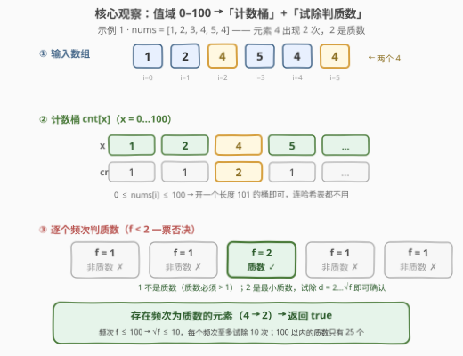
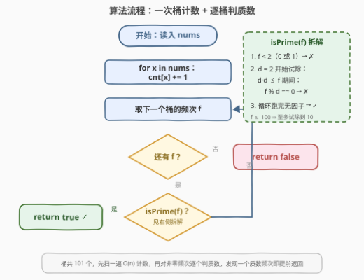

# 检查元素频次是否为质数

- **题目名称**：检查元素频次是否为质数
- **链接**：[3591. 检查元素频次是否为质数](https://leetcode.cn/problems/check-if-any-element-has-prime-frequency/)
- **难度**：简单
- **标签**：数组、哈希表、数学、计数、数论

## 1. 题目概述

给你一个整数数组 `nums`。如果数组中**任一元素**的**频次**是**质数**，返回 `true`；否则返回 `false`。

- 元素 $x$ 的**频次**是它在数组中出现的次数；
- **质数**是一个大于 1 的自然数，并且只有两个因数：1 和它本身（因此 0 和 1 都不是质数，2 是最小质数）。

**示例 1**：

```text
输入：nums = [1,2,3,4,5,4]
输出：true
解释：数字 4 的频次是 2，而 2 是质数。
```

**示例 2**：

```text
输入：nums = [1,2,3,4,5]
输出：false
解释：所有元素的频次都是 1，1 不是质数。
```

**示例 3**：

```text
输入：nums = [2,2,2,4,4]
输出：true
解释：数字 2 和 4 的频次分别是 3 和 2，都是质数。
```

**约束条件**：

- $1 \le \text{nums.length} \le 100$
- $0 \le \text{nums[i]} \le 100$

> 💡 **读题关键**：① 判断对象是**元素的频次**，不是元素本身的值——别看见「质数」就去判 `nums[i]`；② 是「存在性」问题：只要有**一个**质数频次即可返回 `true`，找到就能提前退出；③ 频次的上界就是数组长度 $n \le 100$，质数判断的规模极小。

---

## 2. 解题思路

### 2.1 暴力思路：对每个元素重新数一遍

最朴素的做法：枚举数组中每个不同元素 $x$，再内层扫一遍数组数出 $x$ 的出现次数 $f$，然后判断 $f$ 是否为质数。

```text
for x in set(nums):
    f = nums.count(x)          # 内层再扫一遍数组，O(n)
    if isPrime(f): return true
return false
```

- **正确性**：与题意逐字对应；
- **效率**：不同元素至多 101 个，整体 $O(101 \times n) \approx O(n^2)$，本题 $n \le 100$ 完全够用；
- **可改进点**：同一个数组的频次只需要**数一遍**就能全部拿到——重复扫描纯属浪费，一次哈希计数（甚至计数桶）即可。

### 2.2 核心观察：值域受限 → 计数桶 + 试除判质数



两个约束把问题变得非常轻：

1. **值域受限 $\Rightarrow$ 计数桶**：$0 \le \text{nums[i]} \le 100$，开一个长度 101 的数组 `cnt`，扫一遍 `nums` 做 `cnt[x]++`，**连哈希表都不需要**；
2. **频次受限 $\Rightarrow$ 试除法足够**：频次 $f \le n \le 100$，判断 $f$ 是否质数只需试除 $d = 2 \dots \lfloor\sqrt{f}\rfloor$（至多到 10），无因数则为质数。

其中**质数判断**的三步拆解：

- $f < 2$（即 0 或 1）$\Rightarrow$ 不是质数，一票否决——这也是本题最高频的陷阱：示例 2 中所有频次都是 1，很多人会下意识把 1 当质数；
- 试除 $d = 2 \dots \lfloor\sqrt{f}\rfloor$：若存在 $d \mid f$，则 $f$ 有真因数，不是质数。只需试到 $\sqrt{f}$，因为因数成对出现（$d$ 与 $f/d$ 必有一个 $\le \sqrt{f}$）；
- 循环跑完仍无因数 $\Rightarrow$ 质数。特别地 $f = 2$ 直接命中最小质数。

> 💡 **再进一步：100 以内的质数只有 25 个**（2, 3, 5, 7, 11, …, 97），频次取值又不超过 100——也可以直接把这 25 个数写成常量集合，`f in PRIMES` 一步到位（见第 5 节）。数据规模小到「打表」比「推理」更省心，这本身也是一种工程直觉。

### 2.3 算法流程图



**流程要点**：

| 步骤 | 动作 | 说明 |
|------|------|------|
| ① | `cnt = [0] * 101` | 长度 101 的计数桶，下标即元素值 |
| ② | 遍历 `nums`，`cnt[x]++` | 一趟 $O(n)$ 计数 |
| ③ | 遍历 `cnt` 中每个非零频次 `f` | 频次为 0 的桶直接跳过（`f < 2` 自动排除） |
| ④ | `isPrime(f)`？ | $f < 2$ 否决；试除 $2 \dots \sqrt{f}$ |
| ⑤ | 命中一个质数频次 → `return true` | **存在性**问题，提前退出 |
| ⑥ | 扫完仍无 → `return false` | 所有频次都非质数 |

### 2.4 示例演算

**示例 1：`nums = [1,2,3,4,5,4]`**

| 元素 x | 频次 f | 质数？ |
|--------|--------|--------|
| 1 | 1 | ✗（1 < 2） |
| 2 | 1 | ✗ |
| 3 | 1 | ✗ |
| 4 | 2 | ✓（2 是最小质数） |
| 5 | 1 | ✗ |

扫到 `cnt[4] = 2` 时命中质数 → **true**。

**示例 3：`nums = [2,2,2,4,4]`**

| 元素 x | 频次 f | 质数？ |
|--------|--------|--------|
| 2 | 3 | ✓（试除 2：3 % 2 ≠ 0，循环结束） |
| 4 | 2 | ✓ |

第一个桶就命中 → **true**。

**示例 2：`nums = [1,2,3,4,5]`**：五个桶的频次全是 1，全部被 `f < 2` 否决 → **false**。

---

## 3. 参考代码

### C++

```cpp
class Solution {
public:
    bool checkPrimeFrequency(vector<int>& nums) {
        int cnt[101] = {0};
        for (int x : nums) cnt[x]++;          // 值域 0~100，计数桶
        for (int f : cnt) {
            if (isPrime(f)) return true;      // 存在性：命中即返回
        }
        return false;
    }

private:
    bool isPrime(int f) {
        if (f < 2) return false;              // 0、1 一票否决
        for (int d = 2; d * d <= f; d++) {
            if (f % d == 0) return false;     // 找到真因数
        }
        return true;
    }
};
```

### Python

```python
class Solution:
    def checkPrimeFrequency(self, nums: List[int]) -> bool:
        def is_prime(f: int) -> bool:
            if f < 2:
                return False
            return all(f % d for d in range(2, int(f ** 0.5) + 1))

        cnt = Counter(nums)
        return any(is_prime(f) for f in cnt.values())
```

> 💡 **写法要点**：
> - Python 的 `any(...)` 天然带**短路**语义——遇到第一个质数频次立即返回 `true`；
> - `range(2, int(f ** 0.5) + 1)` 的 `+1` 别漏：$f = 4$ 时 $\sqrt{f} = 2$，区间必须覆盖到 2 才能发现因数；C++ 的 `d * d <= f` 用乘法避免浮点开方，同时天然覆盖等号情形；
> - C++ 版用 `int cnt[101] = {0}` 计数桶；Python 用 `Counter` 更地道，值域优势体现在 C++ 上。

---

## 4. 复杂度分析

设 $n$ 为数组长度（$n \le 100$），$V = 101$ 为值域大小，$F$ 为最大频次（$F \le n \le 100$，$\sqrt{F} \le 10$）。

| 维度 | 复杂度 | 说明 |
|------|--------|------|
| **时间** | $O(n + V\sqrt{F})$ | 计数一趟 $O(n)$；至多 101 个桶，每个频次试除至多 $\lfloor\sqrt{100}\rfloor = 10$ 次。上界约 $100 + 101 \times 10 \approx 1100$ 次基本操作，视为 $O(n + V)$ 常数级 |
| **空间** | $O(V)$ | 长度 101 的计数桶（哈希写法为 $O(\text{不同元素数})$，同样不超过 101） |

---

## 5. 扩展：打表法——把 25 个质数写成常量

频次 $f \le 100$，而 100 以内的质数**固定只有 25 个**，直接写死成集合，判质数退化为一次哈希查询：

```python
class Solution:
    def checkPrimeFrequency(self, nums: List[int]) -> bool:
        primes = {2, 3, 5, 7, 11, 13, 17, 19, 23, 29, 31, 37, 41,
                  43, 47, 53, 59, 61, 67, 71, 73, 79, 83, 89, 97}
        return any(c in primes for c in Counter(nums).values())
```

**打表 vs 试除怎么选**？

- 判断**次数少、数值小**（本题：至多 101 次、值 ≤ 100）→ 试除即可，代码短且不依赖记忆表；
- 判断**次数极多**，或数值较大（如 $f \le 10^6$）→ 预先用**埃拉托斯特尼筛**批量标记质数布尔表，单次查询 $O(1)$，整体 $O(F \log\log F)$ 预处理 + $O(1)$ 每次判断（参见 204 题）。

---

## 6. 面试要点

**Q1：为什么频次为 1 的元素直接排除？**

> 质数的定义是「大于 1 且只有 1 和自身两个因数的自然数」。1 只有一个因数（它本身），不满足「大于 1」，因此不是质数。示例 2 五个元素频次全为 1，答案为 `false`——这是本题最容易踩的坑。

**Q2：试除法为什么到 $\sqrt{f}$ 就够？等号要不要？**

> 因数成对出现：若 $f = d \times e$ 且 $d \le e$，则必有 $d \le \sqrt{f}$。所以 $\sqrt{f}$ 以内没有因数，$\sqrt{f}$ 以外也不会有。**等号必须取**：$f = 4$ 时 $\sqrt{f} = 2$ 恰是因数，`d * d <= f` 或 `range(..., int(f**0.5)+1)` 都要能覆盖 $d = 2$。

**Q3：什么时候用计数数组，什么时候用哈希表？**

> 看值域。元素是整数且值域小（本题 $0 \le \text{nums[i]} \le 100$）→ 计数数组（桶）更快更省；值域大或元素非整数（字符串等）→ 哈希表 / `Counter`。两者在本题的数据规模下性能无差别，选表达力强的即可。

**Q4：`isPrime(2)` 和 `isPrime(3)` 这类边界走一遍流程会怎样？**

> $f = 2$：不小于 2，试除循环 `d = 2` 时 `d * d = 4 > 2` 直接不进入，返回 true ✓；$f = 3$ 同理（`d = 2` 时 `4 > 3`），返回 true ✓；$f = 4$：`d = 2` 时 `4 <= 4` 且 `4 % 2 == 0`，返回 false ✓。试除到 $\sqrt{f}$ 的写法对这几个最小边界天然正确，无需特判。

**Q5：如果数组长度放大到 $10^6$、值域到 $10^9$，算法要怎么改？**

> 计数改用哈希表（值域不能开桶），频次上界变为 $10^6$：单次试除 $O(\sqrt{10^6}) = O(10^3)$，不同元素至多 $10^6$ 个，最坏 $10^9$ 次操作偏慢。此时先用**埃氏筛/线性筛**预处理 $[0, 10^6]$ 的质数表（$O(F \log\log F)$），再对每个频次 $O(1)$ 查表——筛法是「多次判质数」场景的标准前置手段。

> 💡 **一句话总结**：3591 = 哈希计数（值域小可上桶）+ 试除判质数（$f < 2$ 一票否决，试到 $\sqrt{f}$）+ 存在性短路返回。考点在「判的是频次不是元素值」这一读题细节与质数判断基本功。

---

## 7. 同类练习题

- [762. 二进制表示中质数个置位](https://leetcode.cn/problems/prime-number-of-set-bits-in-binary-representation/)（[站内题解](../0701-0800/762_二进制表示中质数个置位.md)）：同样是「对小整数判断质数」，位数为 19 的上界小到可以直接打表 2–19 中的质数
- [1394. 找出数组中的幸运数](https://leetcode.cn/problems/find-lucky-integer-in-an-array/)（[站内题解](../1301-1400/1394_找出数组中的幸运数.md)）：同一套「哈希计数 + 对频次附加条件筛选」的模板，只是条件从「频次是质数」换成「频次等于元素值」
- [3115. 质数的最大距离](https://leetcode.cn/problems/maximum-prime-difference/)（[站内题解](../3101-3200/3115_质数的最大距离.md)）：反过来判断**元素值**是否质数，再取首尾质数下标的最大差，练判质数 + 双指针扫描
- [204. 计数质数](https://leetcode.cn/problems/count-primes/)：判质数的进阶母题——埃氏筛批量统计小于 n 的质数个数，掌握「多次判质数先筛表」的套路
- [1175. 质数排列](https://leetcode.cn/problems/prime-arrangements/)（[站内题解](../1101-1200/1175_质数排列.md)）：先数质数/合数个数再做排列计数，把「判质数 + 计数」两步串起来
