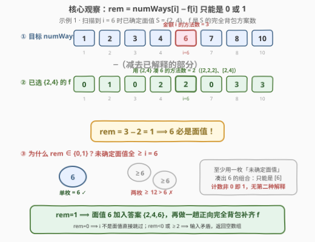
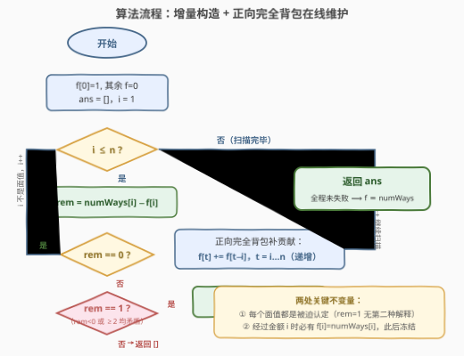
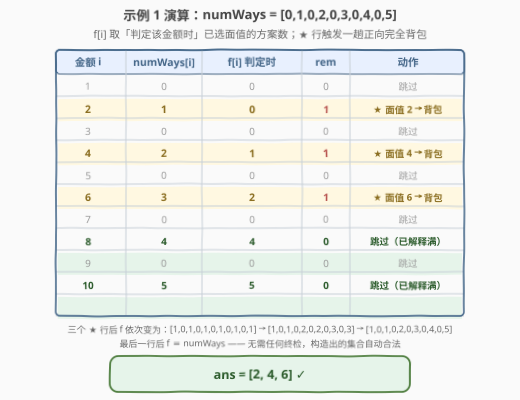

# LeetCode 硬币面值还原 题解

## 1. 题目概述

- **标题 / 题号**：硬币面值还原（#3592，medium）
- **链接**：https://leetcode.cn/problems/inverse-coin-change/
- **难度**：中等
- **标签**：数组、动态规划、完全背包、贪心

**题意**：给定一个**从 1 开始计数**的整数数组 `numWays`，其中 `numWays[i]` 表示：使用某个**固定**的面值集合（每种面值可取无限枚）凑出总金额 $i$ 的**方法数**（组合数，不区分顺序）。面值都是正整数，且每个面值**最多**为 `numWays.length`。

现在面值集合丢失了，要求**还原**出可能生成该 `numWays` 数组的面值集合：返回按升序排列的所有唯一面值；若不存在这样的集合，返回**空数组**。

**示例 1**：

```text
输入：numWays = [0,1,0,2,0,3,0,4,0,5]
输出：[2,4,6]
解释：金额 2 只有 [2] 一种；金额 4 有 [2,2]、[4] 两种；
     金额 6 有 [2,2,2]、[2,4]、[6] 三种……与输入数组逐位吻合。
```

**示例 2**：

```text
输入：numWays = [1,2,2,3,4]
输出：[1,2,5]
解释：金额 1 只有 [1]；金额 2 有 [1,1]、[2]；金额 5 有
     [1,1,1,1,1]、[1,1,1,2]、[1,2,2]、[5] 共 4 种。
```

**示例 3**：

```text
输入：numWays = [1,2,3,4,15]
输出：[]
解释：面值 {1,2,3} 恰好生成金额 1~4 的方法数 1、2、3、4，
     但它给金额 5 的方法数是 5，与输入的 15 矛盾，无解。
```

**约束**：

- $1 \le numWays.length \le 100$
- $0 \le numWays[i] \le 2 \times 10^8$

> 💡 **读题关键**：这是完全背包计数（518 零钱兑换 II）的**逆问题**——正问题是「给面值求方案数」，本题是「给方案数反推面值」。约束「面值 $\le n$」意味着候选面值只有 $1..n$，且 $n \le 100$，提示我们寻找远小于暴力枚举的确定性算法。另外注意：方案数是**组合数**（`[2,4]` 与 `[4,2]` 算同一种），不是排列数。

## 2. 解题思路

### 2.1 暴力思路：枚举面值子集

候选面值只能是 $1..n$，最直接的做法是枚举 $\{1,\dots,n\}$ 的所有 $2^n$ 个子集，对每个子集跑一遍 $O(n \cdot |S|)$ 的完全背包，检查生成的方案数数组是否与 `numWays` 完全一致。$n = 100$ 时 $2^{100} \approx 1.3 \times 10^{30}$，完全不可行。

值得注意的是：**验证一个候选集合是便宜的**（一趟背包即可），难在搜索空间爆炸。这提示我们寻找「不搜索、每一步都被迫确定」的构造性方法。

### 2.2 核心观察：未被解释的方案数只能是 0 或 1



**观察一（方案数的差集分解）**：设 $f[i]$ 为**只用已确定的面值**（都 $< i$）凑出金额 $i$ 的方案数。若目前确定的集合恰好是真实面值中「$< i$ 的那部分」，那么所有凑 $i$ 的组合可以**不重不漏**地分成两类：

- 只用已确定面值 —— 恰有 $f[i]$ 种；
- **至少用一枚未确定面值** —— 恰有 $rem = numWays[i] - f[i]$ 种。

**观察二（关键一步：$rem \in \{0, 1\}$）**：未确定的面值全都 $\ge i$（更小的要么已确定、要么已被排除）。若一个组合要用它们凑出金额 $i$：

- 用**两枚及以上**：总和 $\ge 2i > i$，不可能；
- 用**恰好一枚**：只能是单枚面值 $i$ 本身。

所以 $rem \in \{0, 1\}$，且 $rem = 1$ **当且仅当** $i$ 是面值——**没有第二种可能，每一步都是被迫的**。这就是增量构造：

$$
rem = numWays[i] - f[i] =
\begin{cases}
0 & i \text{ 不是面值，跳过} \\
1 & i \text{ 必是面值，加入答案}
\end{cases}
$$

每认定一个新面值 $i$，就用一趟**正向完全背包**把它的贡献补进 $f$（$t$ 从 $i$ 到 $n$ 递增：$f[t] \mathrel{+}= f[t-i]$，正序保证每枚硬币可重复使用）。

**正确性与唯一性**：

- **合法输入**下对 $i$ 归纳可证「已确定集合 = 真实面值与 $\{1..i-1\}$ 的交集」，每个判定都正确；
- **非法输入**下若某步 $rem < 0$（已解释的方案数超过总数）或 $rem \ge 2$，立即返回空数组；
- **无需最终整体校验**：扫描经过每个金额 $i$ 时都保证了 $f[i] = numWays[i]$（$rem=0$ 本来就相等；$rem=1$ 时补入硬币 $i$ 恰好让 $f[i]$ 加上 $f[0]=1$），而后续面值 $j > i$ 的背包更新只影响下标 $\ge j$ 的位置。所以若全程未失败，结束时必有 $f \equiv numWays$——构造出的集合自动合法。
- **唯一性**：最小的面值 $c_1$ 被迫（比它小的金额全是 0，它自己恰为 1）；从生成函数看 $W(x) = \prod_{c \in S} \frac{1}{1-x^c}$，识别一个面值就除掉一个因子，剩下的是同一个问题的缩小版。每步无选择余地，解若存在必唯一。

### 2.3 算法流程图



初始化 $f[0]=1$（空组合凑 0 恰一种）、$f[i]=0$、答案为空；$i$ 从 1 到 $n$ 扫描，按 $rem$ 的三种取值分派：跳过 / 认定面值并补背包 / 判死返回空数组。

### 2.4 示例演算



**示例 1** `numWays = [0,1,0,2,0,3,0,4,0,5]`（见上图）：

- $i=2$：$f[2]=0$，$rem = 1-0 = 1$ → 认定面值 **2**，背包补贡献后 $f = [1,0,1,0,1,0,1,0,1,0,1]$；
- $i=4$：$f[4]=1$，$rem = 2-1 = 1$ → 认定面值 **4**，补后 $f[6]=2,\ f[8]=3,\ f[10]=3$；
- $i=6$：$f[6]=2$，$rem = 3-2 = 1$ → 认定面值 **6**，补后 $f[8]=4,\ f[10]=5$；
- $i=8,10$：$rem = 4-4 = 0$、$5-5 = 0$ → 已被 $\{2,4,6\}$ **完全解释**（如金额 8 的 4 种：$[2,2,2,2]$、$[2,2,4]$、$[4,4]$、$[2,6]$），跳过；
- 奇数金额恒为 0，全程跳过。返回 `[2,4,6]`。

**示例 3** `numWays = [1,2,3,4,15]`：$i=1,2,3$ 依次认定面值 1、2、3（$f[5]$ 被补到 5），到 $i=5$ 时 $rem = 15 - 5 = 10 \ge 2$，矛盾，返回 `[]`。

## 3. 参考代码

### C++

```cpp
class Solution {
  public:
    vector<int> findCoins(vector<int>& numWays) {
        int n = numWays.size();
        vector<long long> f(n + 1);                 // f[i]: 只用已确定面值凑出 i 的方案数
        f[0] = 1;                                   // 空组合凑 0 恰 1 种
        vector<int> ans;
        for (int i = 1; i <= n; i++) {
            long long rem = numWays[i - 1] - f[i];  // 尚未被解释的方案数
            if (rem == 0) continue;                 // i 不是面值
            if (rem != 1) return {};                // rem<0 或 rem>=2：矛盾，无解
            ans.push_back(i);                       // rem==1 ⟹ i 必是面值（被迫）
            for (int t = i; t <= n; t++)            // 正向完全背包：补入硬币 i 的贡献
                f[t] += f[t - i];                   // t 递增 ⇒ 每枚 i 可无限使用
        }
        return ans;                                 // 全程未失败 ⟹ f ≡ numWays，无需复查
    }
};
```

### Python

```python
class Solution:
    def findCoins(self, numWays: List[int]) -> List[int]:
        n = len(numWays)
        f = [0] * (n + 1)                  # f[i]: 只用已确定面值凑出 i 的方案数
        f[0] = 1                           # 空组合凑 0 恰 1 种
        ans = []
        for i in range(1, n + 1):
            rem = numWays[i - 1] - f[i]    # 尚未被解释的方案数
            if rem == 0:
                continue                   # i 不是面值
            if rem != 1:
                return []                  # rem<0 或 rem>=2：矛盾，无解
            ans.append(i)                  # rem==1 ⟹ i 必是面值（被迫）
            for t in range(i, n + 1):      # 正向完全背包：补入硬币 i 的贡献
                f[t] += f[t - i]           # t 递增 ⇒ 每枚 i 可无限使用
        return ans                         # 全程未失败 ⟹ f ≡ numWays，无需复查
```

> 💡 上述解法已与暴力对拍验证：$n \le 8$ 共数万组随机用例（一半由随机面值集合正向生成、一半纯随机扰动），结果与 $2^n$ 子集枚举完全一致；三个官方示例输出 `[2,4,6]`、`[1,2,5]`、`[]` 均正确。

## 4. 复杂度分析

| 维度 | 复杂度 | 说明 |
|------|--------|------|
| 时间 | $O(n^2)$ | 每认定一个面值做一趟 $O(n)$ 背包更新，面值数 $\le n$；$n \le 100$ 时至多 $10^4$ 次加法 |
| 空间 | $O(n)$ | 方案数数组 $f$ 与答案数组（不计返回值则 $f$ 仅一个） |

## 5. 扩展：逆向消元——同一问题的对偶写法

2.2 节是「**正向补**」：维护已选面值的方案数 $f$，看缺口 `rem`。还存在一个对偶写法「**逆向减**」：直接在 `numWays` 的副本 $g$ 上工作，遇到 $g[i] = 1$ 判定 $i$ 是面值后，把硬币 $i$ 的贡献**从 $g$ 中减掉**——生成函数上即乘回因子 $(1 - x^i)$，系数递推为：

$$g[t] \mathrel{-}= g[t - i], \qquad t = n, n-1, \dots, i \quad (\textbf{倒序})$$

- ⚠️ **方向陷阱**：消元必须**倒序**——保证读到的 $g[t-i]$ 是消元**前**的值（$g'[t] = g[t] - g[t-i]$ 中两个都是原值）。若误用正序，读到的是已更新的值，等价于把硬币当 **0/1 背包**物品消去，会算错：如面值 $\{2,4\}$、`numWays = [0,1,0,2,0,2]`，正序消去 2 后 $g[4]=2 \ne 1$，会错判无解（正确答案是 `{2,4}`）。正向补贡献则相反，必须**正序**（读已更新的值，实现「无限使用」）。
- 逆向写法扫描结束后需**补一个全零校验**（$g[1..n]$ 全为 0 才有解）；2.2 的正向写法天然免检。
- 两写法复杂度同为 $O(n^2)$，本质是同一归纳的两个方向：一个从「已解释多少」推进，一个从「还剩多少未解释」推进。

## 6. 面试要点

- **Q1：为什么 $rem = 1$ 就敢断定 $i$ 是面值？**
  答：$rem$ 恰好数出「至少用一枚未确定面值」的组合数，而未确定面值都 $\ge i$；两枚这样的硬币总和 $\ge 2i > i$，故这类组合只能是单枚 $i$。计数非 0 即 1，为 1 时 $i$ 被迫是面值——**不存在别的解释**。
- **Q2：为什么扫描结束不需要再整体校验一遍？**
  答：经过每个金额 $i$ 时都保证 $f[i] = numWays[i]$：$rem=0$ 时本就相等；$rem=1$ 时补入硬币 $i$ 使 $f[i]$ 恰加 $f[0]=1$。后续面值 $j > i$ 的更新只影响下标 $\ge j$ 的位置，$f[i]$ 冻结不变。全程未失败即 $f \equiv numWays$，构造集合自动合法。
- **Q3：答案为什么若存在必唯一？**
  答：最小面值 $c_1$ 被迫——比它小的金额方法数全为 0，金额 $c_1$ 恰为 1；从生成函数 $W(x)=\prod (1-x^c)^{-1}$ 看，识别并除掉一个因子后剩下的是同结构的子问题。归纳下去每一步都无选择空间，故解唯一，也解释了题目「返回所有可能的唯一面值」的措辞。
- **Q4：有哪些数值范围坑？**
  答：$numWays[i] \le 2\times10^8$，$f$ 的上界是金额 100 的划分数 $p(100) \approx 1.9\times10^8$，`int32` 勉强够但边界贴得很近——C++ 建议直接 `long long`；Python 无此顾虑。另一个坑是把组合数误当排列数（377 口径），递推结构完全不同。
- **Q5：与 518 零钱兑换 II 是什么关系？**
  答：518 是正问题（给定面值求方案数，完全背包计数），本题是它的**逆问题**。通用套路是「**逆问题用正问题的求解器做增量验证**」：把候选解一块块拼上去，每块都要让正问题求解器的输出与目标吻合——本题的 $f$ 就是那个随答案增长而在线维护的求解器，类似思路见 2585 的逐类计数。

## 同类练习题

| # | 题目 | 与本题的关联 |
|---|------|-------------|
| 518 | [零钱兑换 II](https://leetcode.cn/problems/coin-change-ii/) | 本题的正问题——给定面值求组合数，标准完全背包计数（题解见[零钱兑换II](../0501-0600/518_零钱兑换II.md)） |
| 322 | [零钱兑换](https://leetcode.cn/problems/coin-change/) | 完全背包最值版（最少硬币数），与计数版对照着写一遍（题解见[零钱兑换](../0301-0400/322_零钱兑换.md)） |
| 2585 | [获得分数的方法的数目](https://leetcode.cn/problems/number-of-ways-to-earn-points/) | 分组背包逐类计数，同样体现「一类物品一类物品地累积方案数」（题解见[获得分数的方法数](../2501-2600/2585_获得分数的方法数.md)） |
| 377 | [组合总和 IV](https://leetcode.cn/problems/combination-sum-iv/) | 排列数口径的完全背包（外层金额内层硬币），对照本题理解「组合 vs 排列」对递推结构的影响（题解见[组合总和IV](../0301-0400/377_组合总和IV.md)） |
| 279 | [完全平方数](https://leetcode.cn/problems/perfect-squares/) | 面值被固定为完全平方数的完全背包最值，感受「面值集合已知/未知」的难度差（题解见[完全平方数](../0201-0300/279_完全平方数.md)） |
