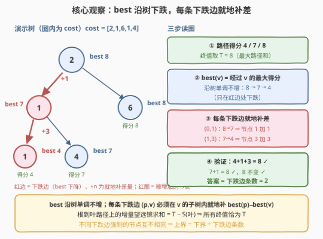
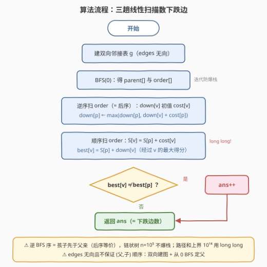

# LeetCode 使叶子路径成本相等的最小增量 题解

## 1. 题目概述

- **标题 / 题号**：使叶子路径成本相等的最小增量（#3593，medium）
- **链接**：https://leetcode.cn/problems/minimum-increments-to-equalize-leaf-paths/
- **难度**：中等
- **标签**：树、深度优先搜索、数组、动态规划

**题意**：给定一棵以节点 $0$ 为根、共 $n$ 个节点（编号 $0$ 到 $n-1$）的无向树，由长度 $n-1$ 的二维数组 $edges$ 描述。每个节点 $i$ 有成本 $cost[i]$。

**路径得分**定义为路径上所有节点成本之和（含两端）。目标：给**任意数量**的节点增加成本（每个增加任意非负值），使**所有从根到叶子的路径得分相等**。返回需要增加成本的**节点数的最小值**。

**示例 1**：

```text
输入：n = 3, edges = [[0,1],[0,2]], cost = [2,1,3]
输出：1
解释：路径 0→1 得分 3，路径 0→2 得分 5。目标统一为 5：把节点 1 加 2 即可。
```

**示例 2**：

```text
输入：n = 3, edges = [[0,1],[1,2]], cost = [5,1,4]
输出：0
解释：只有一条根到叶路径 0→1→2（得分 10），天然相等。
```

**示例 3**：

```text
输入：n = 5, edges = [[0,4],[0,1],[1,2],[1,3]], cost = [3,4,1,1,7]
输出：1
解释：路径 0→4 得分 10；路径 0→1→2、0→1→3 各得分 8。目标统一为 10：把节点 1 加 2 即可。
```

**约束**：

- $2 \le n \le 10^5$
- $edges.length = n - 1$，$edges[i] = [u_i, v_i]$，$0 \le u_i, v_i < n$，保证是合法树
- $1 \le cost[i] \le 10^9$

> 💡 **读题关键**：三个信号——① **只能增不能减**：所有路径的公共终值 $T'$ 必须 $\ge T$（$T$ 为最大路径和），且后面的下界证明对任意 $T' \ge T$ 都成立，构造在 $T' = T$ 恰好达到下界，所以目标值不用纠结，直接取 $T$；② 问的是**最少节点数**而非最少总量——加值放得越靠根、覆盖的路径越多，但会「补过头」破坏相等性，必须精确刻画「在哪加、加多少」；③ $n = 10^5$ 要求线性解，且树可能是链，递归 DFS 有爆栈风险。

## 2. 解题思路

### 2.1 暴力思路：枚举集合 / 逐路径修补

最直接的想法是枚举「被增加的节点集合」：$2^n$ 种组合，指数级爆炸，$n = 10^5$ 下完全不可行。

退而求其次的**朴素可行解**：先 DFS 求出所有根到叶路径得分，取 $T = \max$；由于每条路径的**叶子是它独占的**，给每条路径的叶子加 $T - score$ 即可互不干扰地全部补齐。这是正确解，但节点数 = 叶子数，最坏接近 $10^5$ 个——完全没有利用「在公共前缀上一次加值、多条路径同时受益」的机会。

矛盾点在于：**加值放得越高，一次救的路径越多；但放太高会把本来不用补的路径也抬高**。要最小化节点数，必须知道哪些位置「欠账」、各欠多少——这正是下面的核心观察。

### 2.2 核心观察：统计「最大路径和」的下跌边



**观察一（终值取 $T$，不必枚举）**：只能增不能减，故公共终值 $T' \ge T$。后文下界对任意 $T' \ge T$ 均成立，而构造方案在 $T' = T$ 时恰好达到该下界——所以答案与 $T'$ 的选取无关，取 $T$ 即最优。

**观察二（$best(v)$ 的定义、求法与单调性）**：记 $best(v)$ 为**经过 $v$ 的**根到叶路径的最大得分，$S(v)$ 为根到 $v$（含两端）的成本和，$down(v)$ 为 $v$ 到叶子（含 $v$）的最大权和（叶子即 $cost[v]$）。则

$$best(v) = S(\text{parent}(v)) + down(v)$$

$down$ 自底向上一遍可求，$S$ 自顶向下一遍可求。**单调性**：经过孩子 $v$ 的最优路径同时也经过父亲 $p$，它只是「经过 $p$ 的路径」之一，故 $best(v) \le best(p)$——$best$ **从根到叶单调不增**。

**观察三（构造：每条下跌边就地补差 = 上界）**：称满足 $best(v) < best(p)$ 的边 $(p, v)$ 为**下跌边**。构造方案：对每条下跌边，把 $v$ 的成本增加 $best(p) - best(v)$。任何一条根到叶路径上，增量沿边**望远镜求和**：

$$\sum_{(p,v) \in \text{路径}} \bigl(best(p) - best(v)\bigr) = best(\text{root}) - best(\text{叶}) = T - S(\text{叶})$$

（叶子的 $best$ 就是它自己的路径得分 $S$。）于是终值 $= S(\text{叶}) + (T - S(\text{叶})) = T$，所有路径严格相等，且恰好用掉「下跌边条数」个节点。

**观察四（下界：每条下跌边强制一个独占节点）**：设任意合法方案让所有路径终值同为 $T' \ge T$。取一条下跌边 $(p, v)$，设 $P^*$ 为经过 $p$ 的最优路径（得分 $best(p)$），$Q$ 为经过 $v$ 的最优路径（得分 $best(v) < best(p)$）。两路径在 $p$ 以上完全重合，**共享部分的增量相同**，于是

$$\text{inc}(Q \text{ 在 } p \text{ 以下}) - \text{inc}(P^* \text{ 在 } p \text{ 以下}) = (T' - best(v)) - (T' - best(p)) = best(p) - best(v) > 0$$

故 $Q$ 在 $p$ 以下（即 $v$ 的子树内）**必有正增量节点**。再看不同下跌边对应的节点互不相同：两条下跌边 $(p_1, v_1)$、$(p_2, v_2)$ 的子树要么不相交（节点显然不同），要么嵌套（$v_2$ 是 $v_1$ 的真后代）。嵌套时若同一节点 $x$ 同时落在两条「最优路径的子树内部分」，则经过 $v_1$ 的最优路径会路过 $v_2$，推出 $best(v_2) \ge best(v_1)$；而 $v_2$ 是后代又有 $best(v_2) \le best(v_1)$，故 $best(v_2) = best(v_1)$。但 $p_2$ 也在 $v_1$ 的子树内，$best(v_2) \le best(p_2) \le best(v_1) = best(v_2)$，与下跌边要求 $best(v_2) < best(p_2)$ 矛盾。**所以每条下跌边各需一个不同节点，答案 $\ge$ 下跌边数。**

> ✅ **结论**：上界 = 下界 = 下跌边条数
> $$\text{ans} = \#\{v \ne \text{root} : best(v) \ne best(\text{parent}(v))\}$$

> ⚠️ **四个坑（代码里都有对应处理）**：
> 1. **别把答案写成「不同路径得分的个数 $-1$」**：三条路径得分 $3, 5, 3$ 时不同得分只有 $\{3,5\}$，但两条分值 $3$ 的路径缺口无法互相代替，必须各补各的（答案 $2$ 而非 $1$）——计数对象是「$best$ 的下跌边」，与得分去重无关；
> 2. **溢出**：路径和上界 $10^5 \times 10^9 = 10^{14}$，C++ 必须用 `long long`；
> 3. **爆栈**：$n = 10^5$ 且树可以是链，Python 递归必挂——用 BFS 序迭代（逆序遍历 = 孩子先于父亲，等价后序）；
> 4. **无向边**：$edges[i]$ 不保证是 (父, 子) 顺序，必须双向建图再从根 BFS 定父。

### 2.3 算法流程图



整体三趟线性扫描：BFS 定序 → 逆序求 $down$ → 顺序求 $S$ 与 $best$ 并数下跌边。

### 2.4 示例演算

以**示例 3** `n = 5, edges = [[0,4],[0,1],[1,2],[1,3]], cost = [3,4,1,1,7]` 走完全流程（树形：$0$ 的孩子 $4, 1$；$1$ 的孩子 $2, 3$）：

| 节点 $v$ | parent | $cost$ | $down(v)$ | $S(\text{父})$ | $best(v)$ | $best(\text{父})$ | 下跌边？ |
|---------|--------|--------|-----------|----------------|-----------|-------------------|----------|
| 0 | — | 3 | $3+\max(7,5)=10$ | — | 10 | — | — |
| 4 | 0 | 7 | 7 | 3 | $3+7=10$ | 10 | 否 |
| 1 | 0 | 4 | $4+\max(1,1)=5$ | 3 | $3+5=8$ | 10 | **是**（跌 $10-8=2$） |
| 2 | 1 | 1 | 1 | 7 | $7+1=8$ | 8 | 否 |
| 3 | 1 | 1 | 1 | 7 | $7+1=8$ | 8 | 否 |

下跌边只有 $(0,1)$ 一条 ⇒ 答案 $1$ ✓。构造方案即官方解释：节点 $1$ 加 $best(0)-best(1) = 2$，验证：$8+2=10$、$10$ 不变，全部相等。示例 1 同法：下跌边 $(0,1)$（$5 \to 3$），节点 1 加 2；示例 2 是链，$best$ 全程 $10$ 无下跌，答案 $0$。

## 3. 参考代码

### C++

```cpp
class Solution {
  public:
    int minIncrements(int n, vector<vector<int>>& edges, vector<int>& cost) {
        vector<vector<int>> g(n);
        for (auto& e : edges) {            // 无向边：双向建图
            g[e[0]].push_back(e[1]);
            g[e[1]].push_back(e[0]);
        }

        // ① BFS 定序并记父节点：链状树不能递归
        vector<int> parent(n, -1), order;
        order.reserve(n);
        parent[0] = 0;
        order.push_back(0);
        for (int i = 0; i < (int)order.size(); ++i) {
            int u = order[i];
            for (int w : g[u])
                if (parent[w] == -1) { parent[w] = u; order.push_back(w); }
        }

        // ② down[v]：v 到叶子（含 v）的最大权和；逆 BFS 序 = 孩子先于父亲
        vector<long long> down(cost.begin(), cost.end());
        for (int i = n - 1; i >= 1; --i) {
            int v = order[i], p = parent[v];
            down[p] = max(down[p], down[v] + cost[p]);
        }

        // ③ best[v] = S[父] + down[v]：经过 v 的最大根到叶路径和；数下跌边
        vector<long long> S(n), best(n);
        S[0] = cost[0];
        best[0] = down[0];
        int ans = 0;
        for (int i = 1; i < n; ++i) {
            int v = order[i], p = parent[v];
            S[v] = S[p] + cost[v];
            best[v] = S[p] + down[v];
            ans += (best[v] != best[p]);   // best 沿树单调不增，不等即下跌
        }
        return ans;
    }
};
```

### Python

```python
class Solution:
    def minIncrements(self, n: int, edges: List[List[int]], cost: List[int]) -> int:
        g = [[] for _ in range(n)]
        for u, v in edges:                 # 无向边：双向建图
            g[u].append(v)
            g[v].append(u)

        # ① BFS 定序并记父节点：链状树不能递归
        parent = [-1] * n
        parent[0] = 0
        order = [0]
        for u in order:                    # 边遍历边入队 = 迭代 BFS
            for w in g[u]:
                if parent[w] == -1:
                    parent[w] = u
                    order.append(w)

        # ② down[v]：v 到叶子（含 v）的最大权和；逆 BFS 序 = 孩子先于父亲
        down = cost[:]
        for i in range(n - 1, 0, -1):
            v, p = order[i], parent[order[i]]
            if down[v] + cost[p] > down[p]:
                down[p] = down[v] + cost[p]

        # ③ best[v] = S[父] + down[v]：经过 v 的最大根到叶路径和；数下跌边
        S = [0] * n                        # S[v]：根到 v（含两端）权和
        S[0] = cost[0]
        best = [0] * n
        best[0] = down[0]
        ans = 0
        for i in range(1, n):
            v, p = order[i], parent[order[i]]
            S[v] = S[p] + cost[v]
            best[v] = S[p] + down[v]
            if best[v] != best[p]:         # best 沿树单调不增，不等即下跌
                ans += 1
        return ans
```

> 💡 两份代码同构：**BFS 序的逆序遍历**代替递归后序（链状树不爆栈）；`down` 的初值直接取 `cost`——因为 $cost \ge 1$，内部节点的 $down$ 必然被某个孩子抬高，「停在半路」永远不会成为最优，叶子则天然等于 $cost$。实测 $n = 10^5$：C++ 0.05s、Python 0.3s 以内。

## 4. 复杂度分析

| 维度 | 复杂度 | 说明 |
|------|--------|------|
| 时间 | $O(n)$ | 建图 + BFS 定序 + 逆序求 $down$ + 顺序求 $S/best$，全是线性扫描 |
| 空间 | $O(n)$ | 邻接表 $2(n-1)$ 条有向边 + `parent/order/down/S/best` 五个线性数组 |

> 💡 每个节点只被访问常数次，没有任何排序或对数结构——对 $n = 10^5$ 来说连 $\log$ 因子都省了，两语言都轻松通过。

## 5. 扩展：三个变体讨论

- **问「总增量最小」而非「节点数最少」**：答案是**各下跌边跌幅之和** $\sum \bigl(best(p) - best(v)\bigr)$——观察四的论证给出下界：每条下跌边 $(p,v)$ 的子树内正增量 $\ge best(p) - best(v)$，且各下跌边对应的子树路径段两两不相交（嵌套情形已被观察四的矛盾排除）；构造恰好取等。注意这**不是** $T - \min_{\text{路径}} score$：两条不相交的 deficit 分支（路径 $11, 3, 2$ 的例子）各自欠账无法共享，最差路径的缺口只是总和的一个下界。
- **若 $cost$ 可为负**：本文 `down[v] = cost[v]` 的初值写法隐含「$down \ge$ 停在自己」——$cost$ 全正时无差；有负值时**内部节点不能停在半路**（路径必须到达真正的叶子），需显式区分叶/非叶初始化（例如 `down[内部] = -∞` 起步）。本题约束 $cost \ge 1$ 无此坑，但对拍验证原代码在负 $cost$ 下确实会错。
- **输出具体方案**：构造即方案——对每条下跌边 $(p, v)$，输出「节点 $v$ 增加 $best(p) - best(v)$」，无需额外数据结构。

## 6. 面试要点

- **Q1：为什么所有路径的终值取最大路径和 $T$，而不需要枚举或讨论其它目标值？**
  答：只能增不能减 ⇒ 公共终值 $T' \ge T$。下界证明（每条下跌边强制一个独占的正增量节点）对**任意** $T' \ge T$ 都成立，而构造方案在 $T' = T$ 时恰好用「下跌边条数」个节点达到该下界，所以答案与 $T'$ 无关。
- **Q2：$best(v)$ 为什么从根到叶单调不增？怎么 $O(n)$ 求出来？**
  答：经过孩子 $v$ 的最优路径同时也经过父亲 $p$，只是「经过 $p$ 的路径」之一，故 $best(v) \le best(p)$。求法：$best(v) = S(\text{父}) + down(v)$，其中 $down$ 逆 BFS 序（等价后序）自底向上、$S$ 顺 BFS 序自顶向下，各一趟线性递推。
- **Q3：为什么最优解恰好等于「下跌边条数」？**
  答：上界——每条下跌边 $(p,v)$ 在 $v$ 上补 $best(p)-best(v)$，任何根到叶路径上的增量望远镜求和恰为 $T - S(\text{叶})$，所有终值严格等于 $T$；下界——下跌边 $(p,v)$ 使「经过 $v$ 的最优路径」在 $p$ 以下的增量比「经过 $p$ 的最优路径」**多出** $best(p)-best(v) > 0$，故 $v$ 的子树内必有正增量节点，且不同下跌边对应的节点互不相同（嵌套情形由单调性推出 $best$ 相等，与下跌矛盾）。
- **Q4：实现上有哪几个坑？**
  答：① $n = 10^5$ 的链让递归 DFS 爆栈，用 BFS 序迭代，逆序遍历即后序；② 路径和上界 $10^{14}$，C++ 用 `long long`；③ $edges$ 是无向边且不保证 (父, 子) 顺序，双向建图后从 0 号点 BFS 定父；④ `down` 初值取 `cost` 依赖 $cost \ge 1$（负值时内部节点不允许「停在半路」）。
- **Q5：这题和「统计不同路径和个数」有什么本质区别？**
  答：得分相同的两条路径仍可能**各自**需要补值（$3,5,3$ 中两个 $3$ 各欠 $2$，不能互相代替）；反过来，得分不同的路径也可能被同一个节点的一次加值同时补齐（示例 3 中 $8,8$ 被 $10$ 统一）。正确的计数对象是「经过每个节点的最大得分沿树的**变化次数**」，它同时编码了「缺口在哪、缺口互相之间能否共享」两层信息。

## 同类练习题

| # | 题目 | 与本题的关联 |
|---|------|-------------|
| 968 | [监控二叉树](https://leetcode.cn/problems/binary-tree-cameras/) | 同为「树上自底向上贪心 + 最少放置节点数」，后序 DFS 用子树状态驱动决策（题解见[监控二叉树](../0901-1000/968_监控二叉树.md)） |
| 124 | [二叉树中的最大路径和](https://leetcode.cn/problems/binary-tree-maximum-path-sum/) | 本题 $down(v)$ 递推的直接母题——后序 DFS 向上抛「子树内最大延伸」（题解见[二叉树中的最大路径和](../0101-0200/124_二叉树中的最大路径和.md)） |
| 2246 | [相邻字符不同的最长路径](https://leetcode.cn/problems/longest-path-with-different-adjacent-characters/) | 维护「经过每个节点的最长路径」，子树最大/次大两趟组合，与 $best(v)$ 的求法同构（题解见[相邻字符不同的最长路径](../2201-2300/2246_相邻字符不同的最长路径.md)） |
| 834 | [树中距离之和](https://leetcode.cn/problems/sum-of-distances-in-tree/) | 换根 DP——另一类「两趟 DFS 求出所有节点答案」的树上线性套路（题解见[树中距离之和](../0801-0900/834_树中距离之和.md)） |
| 543 | [二叉树的直径](https://leetcode.cn/problems/diameter-of-binary-tree/) | down/up 两趟组合的最简版本，适合作为本套路的入门（题解见[二叉树的直径](../0501-0600/543_二叉树的直径.md)） |
