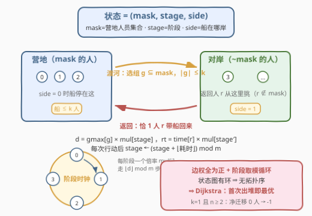
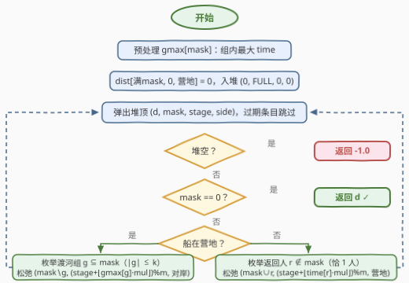

# 所有人渡河所需的最短时间

- **题目名称**：所有人渡河所需的最短时间
- **链接**：[3594. 所有人渡河所需的最短时间](https://leetcode.cn/problems/minimum-time-to-transport-all-individuals/)
- **难度**：困难
- **标签**：位运算、图、状态压缩、最短路、堆（优先队列）

## 1. 题目概述

$n$ 名人员在营地，要用一艘**最多载 $k$ 人**的船渡河到对岸。环境条件以 $m$ 个阶段**周期性循环**，阶段 $j$ 有速度倍率 $mul[j]$：大于 $1$ 渡河变慢，小于 $1$ 变快。每个人 $i$ 的划船能力为 $time[i]$（倍率为 $1$ 时单独渡河的分钟数）。规则：

- 从阶段 $j$ 出发的一组人 $g$，渡河耗时 $d = \max_{i \in g} time[i] \times mul[j]$，随后阶段前进 $\lfloor d \rfloor \bmod m$ 步；
- 若营地还有人，**必须**有一人 $r$（在对岸）带船返回，返回耗时 $time[r] \times mul[\text{当前阶段}]$，阶段同样前进 $\lfloor \text{return\_time} \rfloor \bmod m$ 步。

求全员到达对岸的最少总时间；无法做到则返回 $-1$。

**示例 1**：

```text
输入：n = 1, k = 1, m = 2, time = [5], mul = [1.0, 1.3]
输出：5.00000
解释：第 0 人从阶段 0 出发，渡河时间 = 5 × 1.00 = 5.00 分钟。
```

**示例 2**：

```text
输入：n = 3, k = 2, m = 3, time = [2,5,8], mul = [1.0,1.5,0.75]
输出：14.50000
解释：{0,2} 阶段 0 出发渡河 8.00 分钟，阶段前进 8%3=2 步到阶段 2；
     人 0 从阶段 2 返回 2×0.75=1.50 分钟，阶段前进 1 步回到阶段 0；
     {0,1} 阶段 0 出发渡河 5.00 分钟。总计 8.00+1.50+5.00=14.50。
```

**示例 3**：

```text
输入：n = 2, k = 1, m = 2, time = [10,10], mul = [2.0,2.0]
输出：-1.00000
解释：船每次只能载一人，对岸必须有人把船送回来，总会剩一人在营地。
```

**约束条件**：

- $1 \le n = time.length \le 12$
- $1 \le k \le 5$，$1 \le m \le 5$
- $1 \le time[i] \le 100$，$0.5 \le mul[i] \le 2.0$

> 💡 **读题关键**：三个信号——① $n \le 12$：人员集合可以压成 **bitmask**；② 阶段对 $m$ 取模**循环前进**：状态转移有环，常规按拓扑序递推的 DP 走不通；③ 每次「渡河 / 返回」的耗时恒正：把**状态当节点、动作当边**，就是一张正权图上的最短路——**Dijkstra**（官方 hints 也是这个套路）。

---

## 2. 解题思路

### 2.1 暴力思路：枚举动作序列

最朴素的想法是搜索：每次从营地选一个至多 $k$ 人的组渡河（或从对岸选一人返回），枚举全部动作序列取最优。两个致命问题：

1. **序列可能无限长**：阶段取模循环，同一局面可以反复出现（比如某人渡过去又回来，mask 复原、阶段绕一圈复原，只有时间白花），搜索空间不收敛，无法判停；
2. **组合爆炸**：每步的候选组数是 $\sum_{i \le k}\binom{12}{i} \approx 1600$，乘上返回人的选择，深度稍大就不可行。

即使想写 DP 也会卡住：**mask 会减少（渡河）也会增加（返回），阶段还在循环**——状态之间没有拓扑序，$f[mask][stage]$ 没有安全的计算顺序。出路是把 DP 问题**看作图**：状态是节点、转移是边，边权全为正 ⇒ 用 Dijkstra 代替拓扑递推。

### 2.2 核心观察：状态图 $(mask, stage, side)$ 上的 Dijkstra



**状态设计（三元组）**：

- $mask$：还在**营地**的人员集合（$n \le 12$ 位掩码）；
- $stage \in [0, m)$：当前环境阶段；
- $side$：船在营地（$0$）还是对岸（$1$）。

$side$ 必须显式入状态：$mask$ 只刻画了人在哪，刻画不了**船在哪**——当 $mask$ 非空非满时，船可能在任意一侧，可做的动作完全不同（渡河 vs 返回）。

**两类转移（对应两类合法动作）**：

| 动作 | 前提 | 边权 | 指向的状态 |
|------|------|------|-----------|
| 渡河（选组 $g$） | 船在营地，$g \subseteq mask$，$1 \le \lvert g \rvert \le k$ | $gmax[g] \times mul[stage]$ | $(mask \setminus g,\ (stage + \lfloor d \rfloor) \bmod m,\ \text{对岸})$ |
| 返回（选人 $r$） | 船在对岸且 $mask \neq \varnothing$，$r \notin mask$ | $time[r] \times mul[stage]$ | $(mask \cup \{r\},\ (stage + \lfloor rt \rfloor) \bmod m,\ \text{营地})$ |

其中 $gmax[g]$ 预处理为组内最大 $time$。起点 $(\text{FULL}, 0, \text{营地})$，目标是 $mask = \varnothing$（任意阶段）——**首次弹出 $mask = 0$ 的状态时，其距离就是答案**。

**为什么把渡河和返回拆成两条边**：若把「一趟渡河 + 一次返回」捆绑成一条复合边，边数要乘上返回人的候选数（组的选择 × 人的选择）；拆开后，返回人的选择只依赖「当前谁在对岸」，与怎么过去的无关——两个维度各自独立枚举，边数少一个乘数因子，代码也对称易写。

**为什么必须 Dijkstra**：阶段对 $m$ 取模、绕圈不归零，状态图存在环（这正是 hints 里「The states form a cycle」的含义），没有拓扑序可递推；但所有边权 $\ge 0.5 > 0$，Dijkstra 的「首次出堆即最优」照常成立。顺带一提，**环的存在不只是麻烦，还是本题的精髓**：有时最优解会故意「空跑一个来回」——花点时间让阶段绕到低倍率窗口再干活（示例 2 里人 0 返回后恰赶回阶段 0，就是这种效果的雏形）。这也宣判了任何贪心策略的死刑。

**$-1$ 从哪来**：$k = 1$ 且 $n \ge 2$ 时，每趟渡河净迁移 $0$ 人（渡过去一个、还得回来一个），目标不可达。Dijkstra 天然处理这种情况——堆弹空仍没见到 $mask = 0$，返回 $-1$，**无需特判**。

> ⚠️ **浮点取整的坑**：$d = time \times mul$，而 $mul$ 是二进制不可精确表示的浮点（如 $1.3$）。若直接 $\lfloor d \rfloor$，精确值为 $8$ 的乘积可能被算成 $7.999\cdots$ 取整成 $7$，阶段推进错一步、全盘皆错。修正：用 $\lfloor d + \varepsilon \rfloor$（取 $\varepsilon = 10^{-9}$）——精确值为整数时浮点误差在 $10^{-14}$ 量级，远小于 $\varepsilon$，不会被误减；精确值非整数时它离最近整数至少约 $10^{-2}$（倍率最多两位小数），不会被 $\varepsilon$ 误抬。

### 2.3 算法流程图



整体流程：预处理 $gmax$ → 压入起点 → 循环弹堆顶（过期条目跳过）→ $mask = 0$ 直接返回 → 按船位置枚举渡河组 / 返回人，松弛 $(stage + \lfloor \cdot \rfloor) \bmod m$ 后的新状态 → 堆空返回 $-1$。

### 2.4 示例演算

以**示例 2** `n=3, k=2, m=3, time=[2,5,8], mul=[1.0,1.5,0.75]` 走完最优路径：

| 步 | 动作 | 计算式 | 耗时 | 阶段变化 | 累计 | 新状态 (mask, stage, side) |
|----|------|--------|------|----------|------|--------------------------|
| 1 | 渡河 $\{0, 2\}$ | $\max(2,8) \times mul[0] = 8 \times 1.0$ | $8.00$ | $(0+8) \bmod 3 = 2$ | $8.00$ | $(\{1\}, 2, \text{对岸})$ |
| 2 | 返回人 $0$ | $2 \times mul[2] = 2 \times 0.75$ | $1.50$ | $(2+1) \bmod 3 = 0$ | $9.50$ | $(\{0,1\}, 0, \text{营地})$ |
| 3 | 渡河 $\{0, 1\}$ | $\max(2,5) \times mul[0] = 5 \times 1.0$ | $5.00$ | $(0+5) \bmod 3 = 2$ | $14.50$ | $(\varnothing, 2, \text{对岸})$ ✓ |

弹出 $mask = \varnothing$，答案 $14.50$ ✓。注意第 2 步的妙处：人 0 从阶段 2 出发返回，恰好把阶段时钟拨回 $0$（倍率 $1.0$，全场最低档之一），第 3 步才能以 $1.0$ 倍率渡河——**阶段时钟的走向是决策的一部分**。

---

## 3. 参考代码

### C++

```cpp
class Solution {
  public:
    double minTime(int n, int k, int m, vector<int>& time, vector<double>& mul) {
        int FULL = (1 << n) - 1;
        // gmax[mask]：mask 内成员的最大 time，拆最低位递推
        vector<int> gmax(FULL + 1, 0);
        for (int mask = 1; mask <= FULL; ++mask) {
            int low = mask & -mask;
            gmax[mask] = max(gmax[mask ^ low], time[__builtin_ctz(low)]);
        }
        const double INF = 1e18, EPS = 1e-9;
        // dist[(mask*2 + side)*m + stage]，side：0=营地 1=对岸
        vector<double> dist((FULL + 1) * 2 * m, INF);
        dist[(FULL * 2) * m] = 0.0;
        priority_queue<tuple<double, int, int, int>,
                       vector<tuple<double, int, int, int>>, greater<>> pq;
        pq.push({0.0, FULL, 0, 0});
        while (!pq.empty()) {
            auto [d, mask, stage, side] = pq.top();
            pq.pop();
            if (d > dist[(mask * 2 + side) * m + stage]) continue;  // 过期条目
            if (mask == 0) return d;          // 首次出堆即最优，直接返回
            if (side == 0) {                  // 船在营地：枚举渡河组 g ⊆ mask
                for (int g = mask; g; g = (g - 1) & mask) {
                    if (__builtin_popcount(g) > k) continue;
                    double c = gmax[g] * mul[stage];
                    int s1 = (stage + (int)(c + EPS)) % m;  // ⌊c⌋ 加 eps 防浮点误差
                    int idx = ((mask ^ g) * 2 + 1) * m + s1;
                    if (d + c < dist[idx]) {
                        dist[idx] = d + c;
                        pq.push({d + c, mask ^ g, s1, 1});
                    }
                }
            } else {                          // 船在对岸：必须恰选一人返回
                for (int r = 0; r < n; ++r) {
                    if (mask >> r & 1) continue;            // r 还在营地，不能返回
                    double c = time[r] * mul[stage];
                    int s1 = (stage + (int)(c + EPS)) % m;
                    int idx = ((mask | (1 << r)) * 2) * m + s1;
                    if (d + c < dist[idx]) {
                        dist[idx] = d + c;
                        pq.push({d + c, mask | (1 << r), s1, 0});
                    }
                }
            }
        }
        return -1.0;   // 堆空仍不可达（如 k=1 且 n≥2）
    }
};
```

### Python

```python
class Solution:
    def minTime(self, n: int, k: int, m: int, time: List[int], mul: List[float]) -> float:
        FULL = (1 << n) - 1
        # gmax[mask]：mask 内成员的最大 time，拆最低位递推
        gmax = [0] * (FULL + 1)
        for mask in range(1, FULL + 1):
            low = mask & -mask
            gmax[mask] = max(gmax[mask ^ low], time[low.bit_length() - 1])

        tmax = max(time)
        # 预计算「每个阶段 × 每个耗时档」的渡河代价与阶段推进量，
        # 把浮点乘法 + 取整 + 取模从最内层循环挪进查表
        cost = [[v * mul[s] for v in range(tmax + 1)] for s in range(m)]
        adv = [[(s + int(v * mul[s] + 1e-9)) % m for v in range(tmax + 1)]
               for s in range(m)]

        INF = float('inf')
        dist = [INF] * ((FULL + 1) * 2 * m)   # 下标 (mask*2 + side)*m + stage
        dist[FULL * 2 * m] = 0.0              # 起点：(满 mask, 阶段 0, 营地)
        heap = [(0.0, FULL, 0, 0)]
        while heap:
            d, mask, stage, side = heapq.heappop(heap)
            if d > dist[(mask * 2 + side) * m + stage]:
                continue                      # 过期条目
            if mask == 0:
                return d                      # 首次出堆即最优，直接返回
            if side == 0:                     # 船在营地：子集枚举渡河组
                ct, at = cost[stage], adv[stage]
                g = mask
                while g:
                    if g.bit_count() <= k:
                        v = gmax[g]
                        nd = d + ct[v]
                        nm, s1 = mask ^ g, at[v]
                        idx = (nm * 2 + 1) * m + s1
                        if nd < dist[idx]:
                            dist[idx] = nd
                            heapq.heappush(heap, (nd, nm, s1, 1))
                    g = (g - 1) & mask
            else:                             # 船在对岸：恰选一人返回
                ms = mul[stage]
                for r in range(n):
                    if mask >> r & 1:
                        continue              # r 还在营地，不能返回
                    c = time[r] * ms
                    s1 = (stage + int(c + 1e-9)) % m
                    nm = mask | (1 << r)
                    idx = nm * 2 * m + s1
                    if d + c < dist[idx]:
                        dist[idx] = d + c
                        heapq.heappush(heap, (d + c, nm, s1, 0))
        return -1.0                           # 堆空仍不可达（如 k=1 且 n≥2）
```

> 💡 两份代码同构：状态压成一维数组、渡河 / 返回两侧对称枚举。Python 版额外用 `cost`/`adv` 两张预计算表把内层循环的浮点运算换成查表。实测 $n=12, k=5, m=5$ 随机最坏情形：C++ 约 15ms、Python 约 0.7s 单次调用；本解已与「渡河+返回捆绑边」的独立实现及值迭代实现做过数千组随机对拍，结果完全一致。

---

## 4. 复杂度分析

| 维度 | 复杂度 | 说明 |
|------|--------|------|
| 时间 | $O\big(m \sum_{i=1}^{k}\binom{n}{i} 2^{n-i} \cdot \log(nm \cdot 2^n)\big)$ | 每个大小为 $i$ 的组被 $2^{n-i}$ 个营地态包含，$n{=}12,k{=}5,m{=}5$ 时渡河边约 $2.2 \times 10^6$、返回边约 $2.5 \times 10^5$，堆操作带 $\log$ 因子 |
| 空间 | $O(2^n \cdot m)$ | 一维 `dist` 数组 $2^{12} \times 5 \times 2 = 40960$ 个 double + 堆 |

> 💡 规模的直觉：状态数 $2^{12} \times 5 \times 2 \approx 4 \times 10^4$，边数 $\approx 2.4 \times 10^6$——「状态小、边不少」的典型 bitmask 最短路形态，C++ 毫秒级收工；Python 需要查表优化内层循环。

---

## 5. 扩展：与经典过桥问题的血缘

- **$m = 1$ 时退化**：没有阶段倍率，本题塌缩成经典「过桥问题」（bridge and torch）的多人船版——同一套 Dijkstra 框架直接覆盖，无需任何修改。
- **为什么经典贪心在这里失效**：无阶段的过桥问题有 $O(n \log n)$ 的贪心结论（「最快者当摆渡人」与「最快两人先行」两种策略逐轮取优），其正确性依赖**耗时只由同行最慢者决定、且环境不变**；本题里阶段时钟把「什么时候走」变成了决策维度——为了赶低倍率窗口，绕路、拆组、甚至空跑一个来回都可能是最优的，局部贪心无法看到阶段时钟的全局走向。
- **若允许「等待」或「空船漂流」**：相当于新增推进阶段的动作边，Dijkstra 框架仍然适用（边权为 $0$ 或 $\varepsilon$ 时可换双端队列 BFS / 仍用堆），但 $-1$ 的判定需要重新审视（等待不改变可达性，结论不变）。
- **若 $n$ 放大到 $20+$**：$2^n$ 状态爆炸，需要转贪心 / 结论型算法——但正如上一条所述，阶段机制破坏了经典结论的前提，此类放大在本题设定下没有已知多项式解，属 NP-hard 方向的建模（旅行商式的人员编组）。

---

## 6. 面试要点

- **Q1：状态为什么必须带 $side$（船的位置）？**
  答：$mask$ 只说明人在哪，不说明船在哪。$mask$ 非空非满时船可能在任一侧，可做的动作集完全不同；不记录 $side$ 就无法判定当前合法动作，转移会引入非法解。只有 $mask = \text{FULL}$（船必在营地）和 $mask = \varnothing$（结束）是例外。
- **Q2：为什么用 Dijkstra 而不是常规 DP？**
  答：阶段对 $m$ 取模循环，且「渡河减人、返回加人」，状态图存在环，没有拓扑序可供递推。但每条边权 $\ge 0.5 > 0$，Dijkstra「首次出堆即最优」成立。这是「DP 状态有环 → 转图论最短路」的标准范式。
- **Q3：$-1$ 什么时候出现？需要特判吗？**
  答：当且仅当 $k = 1$ 且 $n \ge 2$（每趟净迁移 $0$ 人，目标不可达）。不需要特判：Dijkstra 把堆弹空仍未见 $mask = 0$ 就返回 $-1$，可达性判定由算法自然完成。
- **Q4：浮点数取整 $\lfloor d \rfloor$ 怎么防坑？**
  答：$d = time \times mul$ 中 $mul$（如 $1.3$）二进制不可精确表示，直接取整可能把精确的 $8$ 算成 $7$。用 $\lfloor d + 10^{-9} \rfloor$：整数情形的浮点误差约 $10^{-14}$，加 $\varepsilon$ 后仍落在原整数内；非整数情形离整数至少 $10^{-2}$，不会被 $\varepsilon$ 抬过——两头都安全。
- **Q5：如何快速估算「能不能搜」？**
  答：状态数 $2^n \cdot m \cdot 2 \le 4 \times 10^4$；渡河边数 $\sum_{i \le k}\binom{n}{i} 2^{n-i} \cdot m \approx 2 \times 10^6$。看到 $n \le 12$ 就该条件反射 bitmask，看到「阶段循环 + 正耗时」就该条件反射 Dijkstra——这两个条件反射加起来就是本题的全部考点。

---

## 7. 同类练习题

- [847. 访问所有节点的最短路径](https://leetcode.cn/problems/shortest-path-visiting-all-nodes/)：「状态 = (位置, 已访问掩码)」的 bitmask 最短路入门，BFS 即可，体会掩码进状态的第一课（题解见[访问所有节点的最短路径](../0801-0900/847_访问所有节点的最短路径.md)）
- [864. 获取所有钥匙的最短路径](https://leetcode.cn/problems/shortest-to-get-all-keys/)：掩码（钥匙集合）进状态 + 带权格子图，「收集状态」与本题「营地集合」同构，但本题边权是浮点、必须 Dijkstra（题解见[获取所有钥匙的最短路径](../0801-0900/864_获取所有钥匙的最短路径.md)）
- [773. 滑动谜题](https://leetcode.cn/problems/sliding-puzzle/)：把整个棋盘编码成一个节点、一步移动成一条边，小状态空间最短路的经典建模练习（题解见[滑动谜题](../0701-0800/773_滑动谜题.md)）
- [881. 救生艇](https://leetcode.cn/problems/boats-to-save-people/)：同为「船运人」但没有阶段、没有返回，排序 + 双指针贪心可解——对比体会「环境不变 ⇒ 贪心可证，环境随时间变化 ⇒ 必须建图搜状态」（题解见[救生艇](../0801-0900/881_救生艇.md)）
- [1654. 到家的最少跳跃次数](https://leetcode.cn/problems/minimum-jumps-to-reach-home/)：状态图有环 + 不可达判定（返回 $-1$）的 BFS 版练习，与本题第 3 问的 $-1$ 处理同款思路（题解见[到家的最少跳跃次数](../1601-1700/1654_到家的最少跳跃次数.md)）
