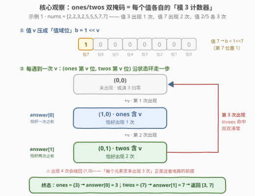
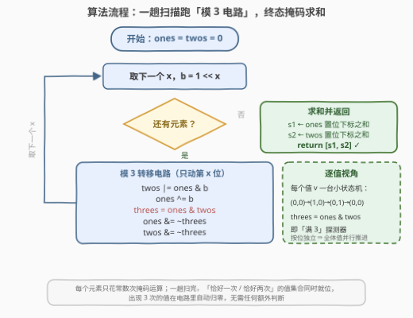

# LeetCode 一次或两次 题解

## 1. 题目概述

- **标题 / 题号**：一次或两次（#3595，medium）
- **链接**：https://leetcode.cn/problems/once-twice/
- **难度**：中等
- **标签**：位运算、数组、哈希表、计数

> ⚠️ 本题为 LeetCode 付费题，题意描述根据官方示例用例与 hints 重建，可能与官方题面有出入。

**题意**：给你一个整数数组 `nums`，其中每个元素出现 **1 次、2 次或 3 次**。返回长度为 2 的数组 `answer`：

- `answer[0]`：所有**恰好出现一次**的元素之和；
- `answer[1]`：所有**恰好出现两次**的元素之和；
- 出现 3 次的元素不计入任何一边（沿用 1748「唯一元素的和」/ 3158「出现两次数字的 XOR」的口径：满足条件的**值**只计一次）。

官方提示：**Use bitmasks**（使用位掩码）。

**示例 1**：

```text
输入：nums = [2,2,3,2,5,5,5,7,7]
输出：[3, 7]
解释：3 出现 1 次 → answer[0] = 3；7 出现 2 次 → answer[1] = 7；
     2 和 5 各出现 3 次，不计入。
```

**示例 2**：

```text
输入：nums = [4,4,6,4,9,9,9,6,8]
输出：[8, 6]
解释：8 出现 1 次 → answer[0] = 8；6 出现 2 次 → answer[1] = 6；
     4 和 9 各出现 3 次，不计入。
```

**约束条件**（按 hint 重建，值域受限正是位掩码解法可行的前提）：

- $1 \le \text{nums.length} \le 10^5$
- $1 \le \text{nums[i]} \le 10^5$
- 每个元素出现 1、2 或 3 次

> 💡 **读题关键**：① 频次只有 1/2/3 三档，且 3 次要「**归零**」——这天然是一个**模 3 计数**问题；② hint 明示位掩码：把「值 $v$ 的出现状态」编码进某条位向量的**第 $v$ 位**，两条位向量合起来就是每个值各自的模 3 计数器；③ 若官方口径是「出现两次的元素按出现次数累计」（7 计两次得 14），只需把 `answer[1]` 改为两倍之和，其余分析完全不变。

## 2. 解题思路

### 2.1 暴力思路：哈希表计数，两个条件求和

最朴素的工程解：一趟哈希计数，再对每个键值对按频次分桶求和。

```python
cnt = Counter(nums)
answer = [sum(x for x, c in cnt.items() if c == 1),
          sum(x for x, c in cnt.items() if c == 2)]
```

- **正确性**：与题意逐字对应，直接可得；
- **效率**：时间 $O(n)$、空间 $O(\min(n, V))$，已经是最优渐近复杂度；
- **可改进点**：hint 指向的不是「更快」，而是「**更巧**」——哈希表存的是完整频次，而本题只需要区分 $1/2/3$ 三档状态，每值 2 个比特就够。把哈希表换成两条**值域位掩码**，计数 + 分桶被压成常数次位电路。

### 2.2 核心观察：ones/twos 双掩码——每个值各自的「模 3 计数器」



这是 **137. 只出现一次的数字 II** 经典电路的「值域版」：137 对每个**二进制位**统计 1 的个数（模 3），本题把「二进制位」换成「**值域位**」——值 $v$ 的状态编码在掩码的**第 $v$ 位**上，即 $b = 1 \ll v$。

两条掩码的编码协议：

| 值 $v$ 的出现次数 | ones 第 $v$ 位 | twos 第 $v$ 位 |
|-------------------|:---:|:---:|
| 0（或已满 3 归零） | 0 | 0 |
| 1 | 1 | 0 |
| 2 | 0 | 1 |

每遇到一次 $v$，$(\text{ones}_v, \text{twos}_v)$ 沿 $(0,0) \to (1,0) \to (0,1) \to (0,0)$ 循环走一步——不就是一个模 3 计数器吗？五行走线即可实现：

```text
twos |= ones & b      # v 已在 ones → 这是第 2 次出现，晋升进 twos
ones ^= b             # 翻转：第 1 次迎入 ones，第 2 次请出
threes = ones & twos  # 两侧同时置位 = 第 3 次出现（唯一的情形）
ones &= ~threes       # 满 3 归零
twos &= ~threes
```

三个状态逐一验证（以值 $v$、位 $b$ 为例）：

- **(0,0) 第 1 次**：`twos` 不变；`ones` 置 1；`threes = 1 & 0 = 0` → 终态 $(1,0)$ ✓
- **(1,0) 第 2 次**：`twos` 被 `ones & b` 置 1；`ones` 被翻转清 0；`threes = 0 & 1 = 0` → 终态 $(0,1)$ ✓
- **(0,1) 第 3 次**：`twos` 不变（ones 无该位）；`ones` 被置 1；`threes = 1 & 1` 命中 → 双双清零 → 终态 $(0,0)$ ✓

> 💡 **按位独立 = 全体值并行**：与/或/异或都是**逐位独立**的运算，掩码整体跑一遍电路，等价于值域里每个值的小状态机**同时**各走一步——一趟扫描就维护好了所有值的计数状态。

> ⚠️ **模 3 的边界**：若某值出现 **4 次**，状态环会绕回 $(1,0)$，被误判成「恰好 1 次」。「每个元素至多出现 3 次」的约束正是这套电路的正确性前提（去掉约束怎么办见第 5 节）。

终态读数非常自然：**ones 的置位位集合 = 恰好出现一次的值集合，twos 同理**。于是

$$\text{answer}[0] = \sum_{\text{ones 第 } v \text{ 位}=1} v, \qquad \text{answer}[1] = \sum_{\text{twos 第 } v \text{ 位}=1} v$$

### 2.3 算法流程图



**流程要点**：

| 步骤 | 动作 | 说明 |
|------|------|------|
| ① | `ones = twos = 0` | 两条值域位掩码清零 |
| ② | 取下一个 `x`，`b = 1 << x` | 值 → 值域位 |
| ③ | 五行电路转移 | 每个值的状态环各走一步（满 3 自动归零） |
| ④ | 扫完 → 掩码求和 | lowbit 逐位剥离 / 按值域扫描 |
| ⑤ | 返回 `[s1, s2]` | `s1 ← ones`，`s2 ← twos` |

### 2.4 示例演算

**示例 1：`nums = [2,2,3,2,5,5,5,7,7]`** 的完整状态轨迹（掩码用「值集合」表示）：

| i | x | ones | twos | 备注 |
|---|---|------|------|------|
| 0 | 2 | {2} | ∅ | 2 第 1 次 → ones |
| 1 | 2 | ∅ | {2} | 2 第 2 次 → twos |
| 2 | 3 | {3} | {2} | 3 第 1 次 |
| 3 | 2 | {3} | ∅ | 2 第 3 次 → threes 命中，归零 |
| 4 | 5 | {3,5} | ∅ | 5 第 1 次 |
| 5 | 5 | {3} | {5} | 5 第 2 次 |
| 6 | 5 | {3} | ∅ | 5 第 3 次 → 归零 |
| 7 | 7 | {3,7} | ∅ | 7 第 1 次 |
| 8 | 7 | {3} | {7} | 7 第 2 次 |

终态 `ones = {3}`、`twos = {7}` → 返回 **[3, 7]**。值 2、5 各绕满一圈归零，天然被排除，无需任何额外判断。

## 3. 参考代码

### C++

```cpp
class Solution {
public:
    vector<long long> onceTwice(vector<int>& nums) {
        const int V = 100000;              // 值域上界
        bitset<V + 1> ones, twos;
        for (int x : nums) {
            bitset<V + 1> b;
            b[x] = 1;                      // 值 x → 值域第 x 位
            twos |= ones & b;              // 在 ones → 第 2 次出现
            ones ^= b;                     // 翻转 ones
            bitset<V + 1> threes = ones & twos;
            ones &= ~threes;               // 满 3 归零
            twos &= ~threes;
        }
        long long s1 = 0, s2 = 0;
        for (int v = 1; v <= V; v++) {     // 位下标即元素值
            if (ones[v]) s1 += v;
            if (twos[v]) s2 += v;
        }
        return {s1, s2};
    }
};
```

### Python

```python
class Solution:
    def onceTwice(self, nums: List[int]) -> List[int]:
        ones = twos = 0
        for x in nums:
            b = 1 << x                     # 值 x → 值域第 x 位
            twos |= ones & b               # 在 ones → 第 2 次出现
            ones ^= b                      # 翻转 ones
            threes = ones & twos           # 两侧同置位 = 第 3 次
            ones &= ~threes                # 满 3 归零
            twos &= ~threes

        def mask_sum(m: int) -> int:       # 置位位下标求和
            s = 0
            while m:
                low = m & -m               # lowbit = 2^v
                s += low.bit_length() - 1  # 还原下标 v
                m ^= low
            return s

        return [mask_sum(ones), mask_sum(twos)]
```

> 💡 **写法要点**：
> - Python 大整数本身就是任意精度位向量，`b = 1 << x` 天然是「第 $x$ 位为 1」的掩码，`ones`/`twos` 可以直接当集合用；
> - `mask_sum` 用 lowbit 剥位：`m & -m` 取出最低置位（值为 $2^v$），`bit_length() - 1` 还原下标 $v$，复杂度 $O(\text{置位数})$；
> - C++ 用 `bitset`，求和循环里 `ones[v]` 的**下标 $v$ 就是元素值**，别写成 `ones.to_ulong()` 之类的整体转换；
> - 值域 × 规模可能使和超出 `int`（$10^5 \times 10^5 = 10^{10}$），求和用 64 位。

## 4. 复杂度分析

设 $n$ 为数组长度，$V$ 为值域上界（取 $10^5$），$w = 64$ 为机器字长。

| 维度 | 复杂度 | 说明 |
|------|--------|------|
| **时间** | $O\!\left(n \cdot \frac{V}{w}\right)$ | 每个元素做常数次掩码运算，每次运算是 $V/w \approx 1563$ 个字的按位操作（Python 大整数与 C++ bitset 同理）；终态求和 $O(V/w)$。$n = V = 10^5$ 时约 $1.5 \times 10^8$ 次字操作，实测可通过 |
| **空间** | $O\!\left(\frac{V}{w}\right)$ | 两条值域位掩码，$V = 10^5$ 时约 $2 \times 12.5$ KB；哈希表版为 $O(\min(n, V))$ |

> ⚠️ **诚实账本**：哈希表版时间是 $O(n)$，渐近上**更快**（$n \cdot V/w$ 在 $n$ 与 $V$ 同阶时多一个 $V/w$ 因子）。位掩码版的价值不在渐近复杂度，而在：① 这是 hint 指定的考点、137 的直系推广；② 免哈希、内存平坦、缓存友好，常数极小；③ 「计数压缩成位状态」的思想可以推广（见第 5 节）。

## 5. 扩展：任意次数与模 k 计数器

### 5.1 若元素可出现任意多次（> 3 次）

模 3 电路**失效**：出现 4 次 ≡ 1 次（绕回 $(1,0)$），会被误判为「恰好一次」。此时信息量变了——区分 $0/1/2/3/4^+$ 档至少需要 3 bit/值，两条掩码（2 bit）不够装。老老实实退回哈希表完整计数；值域小的话用计数桶 `cnt[v]`，一趟后 $s_1 = \sum_v v \cdot [\text{cnt}[v] = 1]$。

### 5.2 模 k 计数器：掩码条数随 k 增长

把「两条掩码」推广为 $\lceil \log_2 k \rceil$ 条，配上进位逻辑，就是一台模 $k$ 计数器：

- $k = 2$：**1 条掩码**就够——就是全体异或（136 题，落单者 = 异或和）；
- $k = 3$：**2 条掩码**（ones/twos）——137 题与本题；
- $k = 4$：2 条掩码 + 满四检测，依此类推。

另一个方向的优化：整掩码电路每元素要动 $V/w$ 个字，但由于转移只涉及第 $x$ 位，也可以**单点**读 `ones[x]`/`twos[x]` 两位、按状态环算出新两位写回——每元素 $O(1)$，渐近追平哈希表，代价是失去「掩码整体运算」的简洁性。

## 6. 面试要点

**Q1：为什么一套电路能对「每个值独立」计数？**

> 与、或、异或都是**逐位独立**的运算：掩码第 $v$ 位的输出只依赖第 $v$ 位的输入。把值 $v$ 编码到第 $v$ 位后，整型掩码跑一遍五行电路 = 值域里所有值的小状态机**并行**各走一步。一趟 $O(n)$ 扫描结束，全体值的模 3 状态同时就位。

**Q2：出现 4 次会怎样？为什么本题不怕？**

> 状态环 $(0,0) \to (1,0) \to (0,1) \to (0,0)$ 是模 3 循环，第 4 次出现会绕回 $(1,0)$，被误判为「恰好 1 次」。本题约束每个元素至多出现 3 次，模 3 计数 = 真实计数，故安全；约束一旦撤掉就必须退回哈希表（区分 4 档需 3 bit，两条掩码装不下）。

**Q3：与 137「只出现一次的数字 II」是什么关系？**

> 同一套 ones/twos 电路的两种视角：137 统计「每个**二进制位**上 1 的个数 mod 3」，把二进制位当作身份；本题统计「每个**值**出现的次数 mod 3」，把值域位当作身份。把 137 输入里的每个数 $x$ 换成 $2^x$，两题的电路逐字相同。

**Q4：终态求和为什么用 lowbit 剥离？**

> `m & -m` 取出最低置位（值为 $2^v$），`bit_length() - 1` 还原下标 $v$，循环 $O(\text{置位数})$ 次清空掩码。C++ `bitset` 直接按下标 $v$ 扫一遍 $O(V)$，两者等价；置位数远小于 $V$ 时 lowbit 版更快。

**Q5：哈希表 $O(n)$ 渐近更快，位掩码解法的意义何在？**

> ① 本题 hint 与考点就是这套状态机（137 的直系推广），面试中先讲哈希保底、再上电路是加分项；② 位掩码免哈希、内存平坦、缓存友好，实测常数更小；③ 思想可推广：$k = 2$ 的特例正是全体异或（136），模 $k$ 计数只需 $\lceil \log_2 k \rceil$ 条掩码——「计数可以压缩成位状态」这一洞察比单题解法更值钱。

> 💡 **一句话总结**：3595 = 137 的值域版。$b = 1 \ll x$ 把值压进第 $x$ 位，ones/twos 两条掩码沿 $(0,0) \to (1,0) \to (0,1) \to (0,0)$ 做模 3 计数，出现 3 次「自动蒸发」；终态掩码的置位下标求和即得两个答案。「每值至多 3 次」是电路正确性的前提，出现更多次请回哈希表。

## 同类练习题

| # | 题目 | 与本题的关联 |
|---|------|-------------|
| 136 | [只出现一次的数字](https://leetcode.cn/problems/single-number/)（[站内题解](../0101-0200/136_只出现一次的数字.md)） | $k=2$ 的退化版——单条掩码（全体异或）即模 2 计数，落单者自然浮现 |
| 137 | [只出现一次的数字 II](https://leetcode.cn/problems/single-number-ii/)（[站内题解](../0101-0200/137_只出现一次的数字II.md)） | 本题母题——同一套 ones/twos 电路的「逐二进制位」视角 |
| 260 | [只出现一次的数字 III](https://leetcode.cn/problems/single-number-iii/)（[站内题解](../0201-0300/260_只出现一次的数字III.md)） | 两个落单者的模 2 计数——异或和 lowbit 分组各个击破 |
| 3158 | [求出现两次数字的 XOR 值](https://leetcode.cn/problems/find-the-xor-of-numbers-which-appear-twice/)（[站内题解](../3101-3200/3158_求出现两次数字的XOR值.md)） | 镜像题——把「两次之和」换成「两次之 XOR」，且约束退化为每值至多两次（无第三档） |
| 1748 | [唯一元素的和](https://leetcode.cn/problems/sum-of-unique-elements/)（[站内题解](../1701-1800/1748_唯一元素的和.md)） | `answer[0]` 的单值版——只求「恰好出现一次」的元素之和 |
