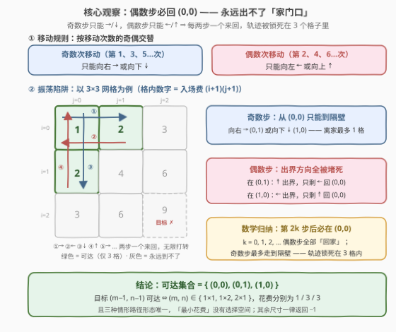
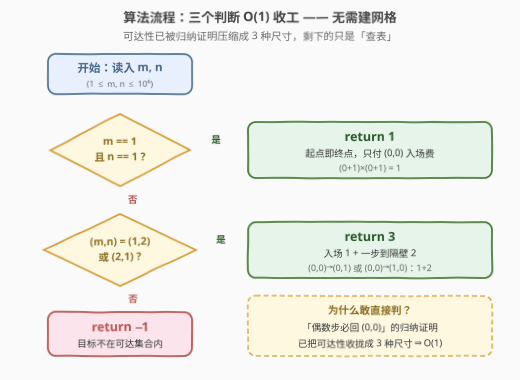

# LeetCode 交替方向的最小路径代价I 题解

## 1. 题目概述

- **标题 / 题号**：交替方向的最小路径代价I（#3596，medium）
- **链接**：https://leetcode.cn/problems/minimum-cost-path-with-alternating-directions-i/
- **难度**：中等
- **标签**：脑筋急转弯、数学

> ⚠️ 本题为 LeetCode 付费题，题意描述根据官方示例用例与 hints 重建，可能与官方题面有出入。

**题意**：给定两个整数 `m` 和 `n`，分别表示一个网格的行数和列数。

- 进入单元格 $(i, j)$ 的**花费**定义为 $(i + 1) \times (j + 1)$；
- 路径始终从**第 1 步**进入单元格 $(0, 0)$ 并支付入场花费开始；
- 此后每一步移动到**相邻**单元格，且移动方向遵循**交替模式**：
  - **奇数次**移动（第 1、3、5…次）：必须向**右**或向**下**；
  - **偶数次**移动（第 2、4、6…次）：必须向**左**或向**上**。

返回到达 $(m - 1, n - 1)$ 的**最小总花费**；如果无法到达，返回 $-1$。

**示例 1**：

```text
输入：m = 1, n = 1
输出：1
解释：从 (0, 0) 开始，进入 (0, 0) 的花费是 (0+1)×(0+1) = 1。
     由于已经位于目标单元格 (0, 0)，总花费为 1。
```

**示例 2**：

```text
输入：m = 2, n = 1
输出：3
解释：进入 (0, 0) 花费 1；第 1 次移动（奇数次）向下到 (1, 0)，
     花费 (1+1)×(0+1) = 2。总花费 1 + 2 = 3。
```

**约束**：

- $1 \le m, n \le 10^6$

> 💡 **读题关键**：① 移动方向由移动次数的奇偶**强制规定**——第 1 次只能右/下、第 2 次只能左/上……方向本身没有选择余地；②「最小花费」是个烟雾弹：先回答「**能不能到**」，花费反而是顺带的小事；③ $m, n$ 上界 $10^6$ 意味着网格最多 $10^{12}$ 格——任何要建网格、扫网格的做法直接出局，这是出题人在暗示**答案与网格大小无关**。

## 2. 解题思路

### 2.1 暴力思路：带着奇偶状态做搜索

见到「网格 + 起点 + 终点 + 最小花费」，本能反应是套 62/64 题那样的 BFS 或 DP。但本题有两个直接劝退点：

1. **方向带奇偶限制**：状态不能只用坐标 $(i, j)$，还必须附加「下一次移动的奇偶」——状态变成 $(i, j, \text{parity})$ 三元组；
2. **网格根本开不出来**：$m, n \le 10^6$，格子数最多 $10^{12}$，建图 / 遍历在空间和时间上双双爆炸。

如果改用「**状态 BFS + 哈希表**」硬跑（不建网格，访问到哪个状态才展开哪个），会观察到一件怪事：**无论网格多大，访问到的状态寥寥无几**——从 $(0, 0)$ 出发，BFS 走两三层之后就再也产生不出新状态了。这个现象本身就是本题最大的提示：**可达区域被移动规则锁死了**。

### 2.2 核心观察：偶数步必回原点——轨迹被困在 3 个格子里



**命题**：第 $2k$ 次移动结束后（$k \ge 0$，$k = 0$ 即尚未移动），所在位置必为 $(0, 0)$。

**数学归纳证明**：

- **基础**：$k = 0$，尚未移动，位于起点 $(0, 0)$；
- **归纳**：设第 $2k$ 次移动后在 $(0, 0)$：
  - 第 $2k+1$ 次（**奇数**）只能向右或向下：向右到 $(0, 1)$，向下到 $(1, 0)$（若网格只有一行/一列，则出界的方向作废；$1 \times 1$ 时无路可走——但此时已在终点）；
  - 第 $2k+2$ 次（**偶数**）只能向左或向上：
    - 若在 $(0, 1)$：向上到 $(-1, 1)$ **出界作废**，只剩向左回 $(0, 0)$；
    - 若在 $(1, 0)$：向左到 $(1, -1)$ **出界作废**，只剩向上回 $(0, 0)$。

  于是第 $2k+2$ 次移动后必回到 $(0, 0)$，命题得证。∎

**推论**：任何时刻所在位置都在 $\{(0,0), (0,1), (1,0)\}$ 这 **3 个格子**内——奇数步后最多「到隔壁」，偶数步后必然「回到家」。证明的钥匙在于**起点恰在角落 $(0, 0)$**：偶数步的两个方向（←/↑）在网格边界处全部被堵死，只剩回头路可走。

于是目标 $(m-1, n-1)$ 可达当且仅当它落在这 3 个格子里，即 $(m, n) \in \{1 \times 1,\ 1 \times 2,\ 2 \times 1\}$：

| 网格尺寸 | 目标 | 最优轨迹 | 总花费 |
|----------|------|----------|--------|
| $1 \times 1$ | $(0, 0)$ | 不动（起点即终点） | $(0+1) \times (0+1) = 1$ |
| $1 \times 2$ | $(0, 1)$ | $(0,0) \xrightarrow{\text{第 1 次·右}} (0,1)$ | $1 + 2 = 3$ |
| $2 \times 1$ | $(1, 0)$ | $(0,0) \xrightarrow{\text{第 1 次·下}} (1,0)$ | $1 + 2 = 3$ |
| 其余 | — | 轨迹无限振荡，够不着目标 | $-1$ |

> 💡 **「最小」根本没有选择空间**：三种可行尺寸的合法路径形态都是唯一的（$1 \times 2$ 只能一步右移、$2 \times 1$ 只能一步下移），花费是唯一确定的常数——本题的全部难点在**可达性判定**，而不在优化。另由转置对称性（入场费 $(i+1)(j+1)$ 与移动规则在 $m \leftrightarrow n$ 互换下不变），$1 \times 2$ 与 $2 \times 1$ 的答案必然相同。

### 2.3 算法流程图



**流程要点**：

| 步骤 | 判断 | 命中返回 | 依据 |
|------|------|----------|------|
| ① | $m = 1$ 且 $n = 1$ | $1$ | 起点即终点，只付 $(0,0)$ 的入场费 |
| ② | $(m, n) \in \{(1,2), (2,1)\}$ | $3$ | 入场 $1$ + 一步到隔壁的 $2$ |
| ③ | 其余所有情况 | $-1$ | 目标 $(m-1, n-1)$ 不在可达集合 $\{(0,0),(0,1),(1,0)\}$ 内 |

### 2.4 示例演算

**示例 1：`m = 1, n = 1`**：目标就是起点 $(0, 0)$，一步不动，只付入场费 $1$ → **1**。

**示例 2：`m = 2, n = 1`**：

| 时刻 | 动作 | 花费 | 累计 |
|------|------|------|------|
| 第 1 步（入场） | 进入 $(0, 0)$ | $(0+1) \times (0+1) = 1$ | 1 |
| 第 1 次移动（奇数·下） | 到 $(1, 0)$ = 目标 | $(1+1) \times (0+1) = 2$ | 3 |

→ **3**。

**补充：`m = 1, n = 2`**：对称地走 $(0,0) \to (0,1)$，总花费 $1 + 2 =$ **3**。

**反例：`m = 2, n = 2`**：目标 $(1, 1)$。从 $(0, 0)$ 出发的合法轨迹只能是

$$\cdots \to (0,0) \xrightarrow{①\ 下} (1,0) \xrightarrow{②\ 上} (0,0) \xrightarrow{③\ 右} (0,1) \xrightarrow{④\ 左} (0,0) \to \cdots$$

在 3 个格子间无限打转，$(1, 1)$ 永远无法踏足 → **-1**。其余所有尺寸（即 $m + n \ge 4$，如 $1 \times 3$、$3 \times 1$、$2 \times 2$…）同理。

## 3. 参考代码

### C++

```cpp
class Solution {
public:
    int minCost(int m, int n) {
        if (m == 1 && n == 1) return 1;               // 起点即终点
        if ((m == 1 && n == 2) || (m == 2 && n == 1))
            return 3;                                  // 入场 1 + 一步到隔壁 2
        return -1;                                     // 目标不在可达集合内
    }
};
```

### Python

```python
class Solution:
    def minCost(self, m: int, n: int) -> int:
        if m == 1 and n == 1:
            return 1                    # 起点即终点
        if (m == 1 and n == 2) or (m == 2 and n == 1):
            return 3                    # 入场 1 + 一步到隔壁 2
        return -1                       # 目标不在可达集合内
```

> 💡 **写法要点**：
> - 两个可行尺寸 $1 \times 2$、$2 \times 1$ 在 $m, n \ge 1$ 下恰为 $m + n = 3$，条件可压缩成 `if (m + n == 3) return 3;`——但显式写出两种尺寸更不易读错，压缩写法请配好注释；
> - 返回值上界只有 3，`int` 毫无溢出风险；网格再大（$10^6 \times 10^6$）也与答案无关。

## 4. 复杂度分析

| 维度 | 复杂度 | 说明 |
|------|--------|------|
| **时间** | $O(1)$ | 至多三个常数时间判断，与 $m, n$ 的大小无关 |
| **空间** | $O(1)$ | 不建网格、不搜索，零额外空间 |

> 💡 对照：若按 2.1 的状态 BFS 硬做，时间空间同样是 $O(1)$（可达状态只有寥寥几个），但那是「撞对」——先有归纳证明，才有底气写出免搜索的 $O(1)$ 判定。

## 5. 扩展：规则一变，考点全变——对照 3603「交替方向的最小路径代价 II」

姊妹题 3603 保留「入场费 $(i+1) \times (j+1)$」的设定，但把「偶数步往回走」改成「**偶数步原地等待 1 秒并支付 waitCost[i][j]**」：

- **振荡被打破**：等待不改变坐标，所有移动都发生在奇数秒且可自由选 →/↓，坐标单调前进——**任意 $m \times n$ 网格都可达**，「返回 $-1$」的分支整个消失；
- **考点迁移**：从脑筋急转弯变成标准**网格 DP**：$dp[0][0] = 1$（只付入场费立即出发），其余

$$dp[i][j] = \min(dp[i-1][j],\ dp[i][j-1]) + (i+1)(j+1) + \text{waitCost}[i][j]$$

  答案为 $dp[m-1][n-1] - \text{waitCost}[m-1][n-1]$（终点到达即停，无需再等）——每个中间格子「进入 + 等待」各付一次；
- **启发**：同一套题面皮，规则的一处改动就能把「$O(1)$ 脑筋急转弯」与「$O(mn)$ DP」互换——遇到规则古怪的移动题，先把小样例**手玩**清楚再决定算法形态。

## 6. 面试要点

**Q1：为什么偶数次移动后一定回到 (0,0)？**

> 数学归纳：基础是未移动时在 $(0,0)$；归纳步骤中，奇数步从 $(0,0)$ 只能到 $(0,1)$ 或 $(1,0)$，而偶数步的 ←/↑ 两个方向中恰有一个出界作废、另一个正对 $(0,0)$——所以第 $2k+2$ 步后必回 $(0,0)$。关键前提是**起点在左上角**：边界替你堵死了所有「不回头」的偶数步走法。

**Q2：m, n 上界 10^6 意味着什么？**

> 网格最多 $10^{12}$ 格，任何 $O(mn)$ 的建图 / DP / BFS 都不可行。这是出题人明示「答案与网格规模无关」的常见信号——约束越是夸张，越要往 $O(1)$ / $O(\log)$ 的封闭解或脑筋急转弯方向想。

**Q3：1×2 和 2×1 的答案为什么都是 3？**

> 转置对称性：把网格沿主对角线翻转（$m \leftrightarrow n$），入场费 $(i+1)(j+1)$ 不变，移动规则「右↔下、左↔上」互换后依然合法，两情形完全同构。各自的最优轨迹：$(0,0) \to (0,1)$ 与 $(0,0) \to (1,0)$，花费都是 $1 + 2 = 3$。

**Q4：本题为什么不能像 64 题最小路径和那样 DP？**

> 64 题的移动集 $\{\to, \downarrow\}$ 保证坐标单调前进，最优子结构成立；本题的移动集按奇偶交替，偶数步必须后退，轨迹振荡不单调，「到 $(i,j)$ 的最小花费」不再能由子问题拼出（同一格子会被反复进入、反复收费）。更要命的是可达性本身受限——先证可达集只剩 3 格，DP 的舞台根本不存在。

**Q5：这类「规则古怪」的移动题有什么通用破法？**

> 三步走：① **小规模手玩**（$2\times2$、$3\times3$ 画轨迹，发现原地打转）；② **猜不变量**（invariant：偶数步后必在 $(0,0)$），不变量是这类题的题眼；③ **归纳证明 + 推论落地**（可达集合 → 分类讨论出答案）。同一个套路通吃 292 Nim、777 LR 字符串、1503 蚂蚁碰撞等一票脑筋急转弯。

> 💡 **一句话总结**：3596 = 找不变量（偶数步必回 $(0,0)$，轨迹锁死 3 格）+ 分类收尾（$1\times1 \to 1$，$1\times2 / 2\times1 \to 3$，其余 $-1$），三个 if，$O(1)$ 收工。

## 同类练习题

| # | 题目 | 与本题的关联 |
|---|------|-------------|
| 3603 | [交替方向的最小路径代价 II](https://leetcode.cn/problems/minimum-cost-path-with-alternating-directions-ii/) | 同一「入场费」设定的姊妹题，偶数步改为原地等待后振荡被打破，任意网格可达，变成标准网格 DP |
| 292 | [Nim 游戏](https://leetcode.cn/problems/nim-game/)（[站内题解](../0201-0300/292_Nim游戏.md)） | 同为「小规模找规律 + 数学论证一击致命」的 $O(1)$ 脑筋急转弯 |
| 777 | [在LR字符串中交换相邻字符](https://leetcode.cn/problems/swap-adjacent-in-lr-string/)（[站内题解](../0701-0800/777_在LR字符串中交换相邻字符.md)） | 靠不变量（L 只能左移、R 只能右移、相对顺序不变）判定可达性，与「偶数步必回原点」同一思维 |
| 1503 | [所有蚂蚁掉下来前的最后一刻](https://leetcode.cn/problems/last-moment-before-all-ants-fall-out-of-a-plank/)（[站内题解](../1501-1600/1503_所有蚂蚁掉下来前的最后一刻.md)） | 碰撞等价于互换身份的脑筋急转弯，绕过模拟直接取 max——「换角度看规则」的经典 |
| 1033 | [移动石子直到连续](https://leetcode.cn/problems/moving-stones-until-consecutive/)（[站内题解](../1001-1100/1033_移动石子直到连续.md)） | 先分类讨论可达性（含不可达返回 −1 的分支）再算最小/最大步数，与本题「先判可达再算花费」同构 |
