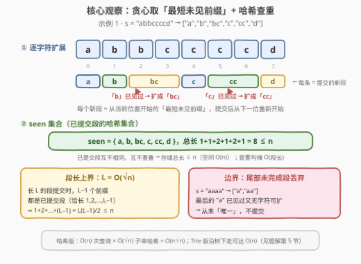
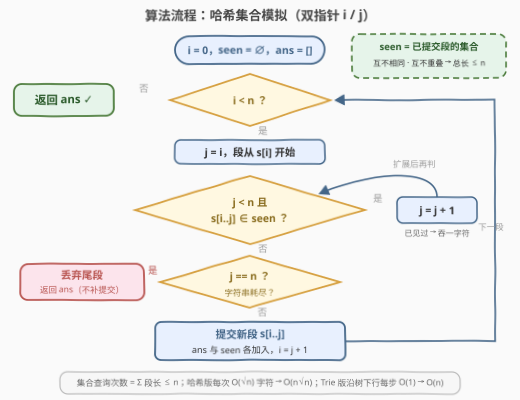

# 分割字符串

- **题目名称**：分割字符串
- **链接**：[3597. 分割字符串](https://leetcode.cn/problems/partition-string/)
- **难度**：中等
- **标签**：哈希表、字符串、模拟、字典树

## 1. 题目概述

给你一个字符串 `s`，按以下步骤将其分割为**互不相同的段**：

1. 从下标 0 开始构建一个段；
2. **逐字符扩展**当前段，直到该段**之前未曾出现过**；
3. 只要当前段是唯一的（没出现过），就将其加入段列表，标记为已经出现过，并从下一个下标开始构建新的段；
4. 重复上述步骤，直到处理完整个字符串 `s`。

返回字符串数组 `segments`，其中 `segments[i]` 表示创建的第 `i` 个段。

**示例 1**：

```text
输入：s = "abbccccd"
输出：["a","b","bc","c","cc","d"]
解释：
  下标 0：段 "a" 未出现过 → 提交；
  下标 2：先试 "b"（已提交过）→ 扩展成 "bc"（未出现过）→ 提交；
  下标 5：先试 "c"（已提交过）→ 扩展成 "cc" → 提交。
```

**示例 2**：

```text
输入：s = "aaaa"
输出：["a","aa"]
解释：下标 3 处当前段 "a" 已出现过，想扩展但字符串已耗尽——
      这个未完成的尾段不会被提交，答案里没有第二个 "a"。
```

**约束条件**：

- $1 \le \text{s.length} \le 10^5$
- `s` 仅包含小写英文字母。

> 💡 **读题关键**：① 过程是**完全确定的模拟**——每一轮取的都是「从当前位置开始的、**最短的**、没出现过的前缀」，没有任何最优化的决策空间；② 所有已提交段**互不相同**（重复的不会被提交）且**互不重叠**（每段提交后从下一位重新开始），这两个性质是复杂度分析的钥匙；③ 小心示例 2 的**尾部丢弃**边界：字符串耗尽时仍未变唯一的段直接扔掉，不要在循环外补提交。

---

## 2. 解题思路

### 2.1 暴力思路：每造一个候选段就线性查重

最直接的写法：维护已提交段列表 `segs`，每轮从起点 `i` 开始逐字符延长候选段 `s[i..j]`，每次延长后都**扫一遍 `segs` 逐个字符串比较**判断是否出现过，一旦没出现过就提交。

```text
i = 0
while i < n:
    j = i
    while j < n and s[i..j] 已提交过:   # 线性扫 segs 逐个比较
        j += 1
    提交 s[i..j]; i = j + 1
```

- **正确性**：与题意逐字对应；
- **效率**：候选段总数为 $O(n)$ 个（查询次数 $\sum L_i \le n$，见 2.2），但每次线性查重要和至多 $O(n)$ 个已提交段逐个比较、每次比较 $O(\sqrt n)$ 字符（段长上界见 2.2），最坏 $O(n^2\sqrt n)$ 级别，$n = 10^5$ 必然超时；
- **可改进点**：「是否出现过」是典型的**集合查询**——把 `segs` 换成哈希集合，一次查重降到「构造子串 + 计算哈希」的 $O(\text{段长})$。

### 2.2 核心观察：贪心取「最短未见前缀」+ 哈希查重



**观察一：过程零决策，忠实模拟即可。** 每轮从起点 $i$ 出发，依次检查 $s[i..i]$、$s[i..i+1]$、$s[i..i+2]$……**第一个不在 `seen` 集合里的前缀就是新段**——「已见过 → 继续扩展，未见过 → 立即提交」正是题面规则本身，正确性不需要额外论证。

**观察二：段长有 $O(\sqrt n)$ 上界——复杂度的定海神针。** 若某段长度为 $L \ge 2$，它被提交**之前**，长度为 $1, 2, \dots, L-1$ 的 $L-1$ 个前缀都必须已在 `seen` 中，即它们都是**先前提交的段**。这些段长度恰为 $1, 2, \dots, L-1$ 且互不重叠地装在长度为 $n$ 的 `s` 里，于是：

$$\underbrace{1 + 2 + \dots + (L-1)}_{\text{总长} \ge \frac{L(L-1)}{2}} \le n \implies L = O(\sqrt n)$$

这个上界立刻给出哈希模拟的总账：集合查询次数 = 各段长度之和 $\le n$（尾段另加 $O(\sqrt n)$ 次）；每次查询切出长度 $O(\sqrt n)$ 的子串做哈希 → 字符级总工作 $O(n\sqrt n)$。

**观察三：尾部丢弃。** 若字符串耗尽时当前段仍处于「已见过」状态（如示例 2 的最后一个 `"a"`），它永远不会变唯一，直接结束、不提交。实现上就是内层循环以 `j == n` 退出后 `break`，**不要**在循环外补提交。

> 💡 **最坏用例**：`s` 全为同一字符（如 `"aaa...a"`）时段长依次为 $1, 2, 3, \dots$，恰好把 $O(n\sqrt n)$ 打满——段 $a^k$ 的 $k-1$ 个前缀 $a, aa, \dots, a^{k-1}$ 全是已提交段，上界证明里的不等式几乎取等。$n = 10^5$ 时约 $1.5 \times 10^7$ 字符级操作，实测 Python 0.02s、C++ 更快。

### 2.3 算法流程图



**流程要点**：

| 步骤 | 动作 | 说明 |
|------|------|------|
| ① | `i = 0`，`seen = ∅`，`ans = []` | `i` 为当前段起点 |
| ② | `i < n`？ | 否 → 已处理完，返回 `ans` |
| ③ | `j = i` | 候选段从单字符 `s[i..i]` 开始 |
| ④ | `j < n` 且 `s[i..j] ∈ seen`？ | 是 → `j++` 吞一字符，回到 ④（**扩展循环**） |
| ⑤ | `j == n`？ | 是 → 字符串耗尽仍未唯一，**丢弃尾段**，返回 `ans` |
| ⑥ | 提交 `s[i..j]` | 加入 `ans` 与 `seen`，`i = j + 1`，回到 ② |

### 2.4 示例演算

**示例 1：`s = "abbccccd"`**

| 起点 i | 候选序列 | 判定 | 提交 | seen 新增 |
|--------|----------|------|------|-----------|
| 0 | `"a"` | 未见 | `"a"` | a |
| 1 | `"b"` | 未见 | `"b"` | b |
| 2 | `"b"` → `"bc"` | 见过 → 扩展 | `"bc"` | bc |
| 4 | `"c"` | 未见 | `"c"` | c |
| 5 | `"c"` → `"cc"` | 见过 → 扩展 | `"cc"` | cc |
| 7 | `"d"` | 未见 | `"d"` | d |

输出 `["a","b","bc","c","cc","d"]`，整串恰好被 6 段无缝覆盖 ✓

**示例 2：`s = "aaaa"`**

| 起点 i | 候选序列 | 判定 | 提交 |
|--------|----------|------|------|
| 0 | `"a"` | 未见 | `"a"` |
| 1 | `"a"` → `"aa"` | 见过 → 扩展 | `"aa"` |
| 3 | `"a"` →（无字符可扩） | 见过但耗尽 | **丢弃** |

输出 `["a","aa"]`，末尾的 `a` 从未满足「唯一」，不进答案 ✓

---

## 3. 参考代码

### C++

```cpp
class Solution {
public:
    vector<string> partitionString(string s) {
        vector<string> ans;
        unordered_set<string> seen;
        int n = s.size(), i = 0;
        while (i < n) {
            int j = i;
            while (j < n && seen.count(s.substr(i, j - i + 1))) {
                j++;                                  // 已见过 → 多吞一个字符
            }
            if (j == n) break;                        // 耗尽仍未唯一 → 丢弃尾段
            string seg = s.substr(i, j - i + 1);      // 第一个「没见过」的前缀
            seen.insert(seg);
            ans.push_back(move(seg));
            i = j + 1;                                // 新段从下一位开始
        }
        return ans;
    }
};
```

### Python

```python
class Solution:
    def partitionString(self, s: str) -> List[str]:
        seen = set()
        ans = []
        i, n = 0, len(s)
        while i < n:
            j = i
            while j < n and s[i:j + 1] in seen:   # 已见过 → 多吞一个字符
                j += 1
            if j == n:                            # 耗尽仍未唯一 → 丢弃尾段
                break
            seg = s[i:j + 1]                      # 第一个「没见过」的前缀
            seen.add(seg)
            ans.append(seg)
            i = j + 1                             # 新段从下一位开始
        return ans
```

> 💡 **写法要点**：
> - 内层 `while` 的条件顺序很关键：**先判 `j < n` 再查 `s[i..j] ∈ seen`**，短路求值保证切子串不越界；退出内层后 `j == n` 正是「字符串耗尽」的信号；
> - Python 切片 `s[i:j+1]` 每次付出 $O(\text{段长})$ 的构造与哈希成本，配合段长 $O(\sqrt n)$ 上界，总代价 $O(n\sqrt n)$；
> - C++ 想再省一点可以把 `unordered_set<string>` 换成 `unordered_set<string_view>`（`s` 按值传入、生命周期覆盖全程，视图安全），免掉 `substr` 的重复拷贝——本题规模下非必需。

---

## 4. 复杂度分析

设 $n = |s|$，$L_i$ 为第 $i$ 个已提交段的长度，$L_{\max} = O(\sqrt n)$ 为最长段长度（见 2.2 观察二）。

| 维度 | 复杂度 | 说明 |
|------|--------|------|
| **时间** | $O(n\sqrt n)$ | 集合查询共 $\sum L_i \le n$ 次（每段长 $L_i$ 恰做 $L_i$ 次前缀查询，丢弃的尾段另加 $O(\sqrt n)$ 次）；每次查询构造并哈希长度 $\le L_{\max}$ 的子串。全同字符达到该界，$n = 10^5$ 时约 $1.5 \times 10^7$ 字符级操作 |
| **空间** | $O(n)$ | `seen` 中所有段互不重叠 → 总长 $\le n$；答案数组同阶 |

> 💡 想做到严格 $O(n)$：把已提交段插入**字典树**，当前段边扩展边沿树下走，每步 $O(1)$（见第 5 节）；或预计算 $s$ 的**前缀（滚动）哈希**，任意子串查重 $O(1)$——但有碰撞风险，需双哈希，工程上不如 Trie 优雅。

---

## 5. 扩展：Trie 优化到 O(n)

哈希版的瓶颈在于每次查询都要重新构造并哈希**整个**子串。注意到**所有已提交段都是 `s` 的子串**，把 `seen` 换成字典树即可把每步降为 $O(1)$：

- **提交段时**：把段插入字典树（沿途建点、末尾打 `end` 标记）；
- **查重时**：当前段从 $s[i]$ 开始**沿树逐字符下走**，每吞一个字符走一步；「$s[i..j]$ 已提交」当且仅当所停节点存在且带 `end` 标记——节点不存在或无标记都说明该前缀未提交过，就地提交并补建/补标记；
- 指针每步 $O(1)$，总步数 = 各段长度之和 + 尾部 $O(\sqrt n)$ = $O(n)$；建点只发生在即将提交的路径上，节点总数 $\le \sum L_i \le n$。

### Python

```python
class Solution:
    def partitionString(self, s: str) -> List[str]:
        root = {}                       # 嵌套字典即 Trie
        END = '$'                       # 特殊键：标记「某段在此结束」
        ans = []
        i, n = 0, len(s)
        while i < n:
            node, j = root, i
            while j < n:                # 沿树下行，直到当前段没提交过
                node = node.setdefault(s[j], {})
                if END not in node:     # s[i..j] 未提交 → 就是新段
                    node[END] = True
                    ans.append(s[i:j + 1])
                    break
                j += 1                  # 已提交过 → 继续吞字符
            if j == n:
                break                   # 尾段耗尽字符串仍未唯一 → 丢弃
            i = j + 1
        return ans
```

### C++

```cpp
class Solution {
    struct Node { Node* ch[26] = {}; bool end = false; };
public:
    vector<string> partitionString(string s) {
        vector<string> ans;
        Node root;
        int n = s.size(), i = 0;
        while (i < n) {
            Node* node = &root;
            int j = i;
            while (j < n) {
                Node*& nxt = node->ch[s[j] - 'a'];    // 没有就顺手建点
                if (!nxt) nxt = new Node();
                node = nxt;
                if (!node->end) {                     // s[i..j] 未提交 → 新段
                    node->end = true;
                    ans.push_back(s.substr(i, j - i + 1));
                    break;
                }
                j++;                                  // 已提交过 → 继续吞字符
            }
            if (j == n) break;                        // 尾段丢弃
            i = j + 1;
        }
        return ans;
    }
};
```

> 💡 **细节辨析**：Trie 里「路径存在」≠「已提交」——比如已提交 `bc` 时，节点 `b` 存在但 `b` 本身未提交过；若当前段恰好是 `b`，它仍然是「没见过」的新段，应提交并补打标记。这正是查重条件要写成「节点存在**且**带 `end` 标记」的原因。

---

## 6. 面试要点

**Q1：为什么「每个新段 = 最短未见前缀」？需要证明贪心正确性吗？**

> 不需要——本题是**纯模拟**：题面规定的过程就是「扩展直到没见过、随即提交」，没有「怎么分更好」的优化目标，所谓贪心只是对规则的复述。真正要小心的两件事：内层扩展的终止条件（`j < n` 防越界）和尾部丢弃。

**Q2：`s = "aaaa"` 的答案为什么是 `["a","aa"]` 而不是 `["a","aa","a"]`？**

> 下标 3 处当前段 `"a"` 已在 `seen` 中，按规则要继续扩展，但字符串已耗尽——这个段从未满足「唯一」条件，官方示例明确它不进答案。实现上就是内层 `while` 以 `j == n` 退出后直接 `break`，**不要**在循环外补提交，也不要漏写这个出口。

**Q3：段长为什么是 $O(\sqrt n)$？这条性质用在哪？**

> 长度 $L$ 的段提交时，它的 $L-1$ 个前缀必须是先前已提交的段，长度恰为 $1, \dots, L-1$ 且互不重叠，总长 $\ge \frac{L(L-1)}{2}$，而它们都装在长度 $n$ 的串里，故 $L = O(\sqrt n)$。它把哈希模拟的总复杂度定在 $O(n\sqrt n)$（否则朴直觉会担心 $O(n^2)$），也让「查询次数 $\le n + O(\sqrt n)$」这类边界全部有界。

**Q4：哈希版最坏什么时候触发？实际跑得动吗？**

> 全同字符（如 `"aaa...a"`）最坏：段长依次 $1, 2, 3, \dots, \Theta(\sqrt n)$，字符级工作 $\Theta(n\sqrt n)$。$n = 10^5$ 时约 $1.5 \times 10^7$ 次字符拷贝/哈希——切片与哈希都是 C 级实现，实测 Python 约 0.02s、C++ 更快，轻松通过。

**Q5：如何把复杂度降到 $O(n)$？**

> 两个方向：① **字典树**——已提交段都是 `s` 的子串，插入 Trie 后当前段沿树下走，每字符 $O(1)$、无碰撞，总 $O(n)$；② **前缀哈希**——预计算滚动哈希，子串查重 $O(1)$，但要双哈希防碰撞。两者空间都是 $O(n)$。

> 💡 **一句话总结**：3597 = 忠实模拟「最短未见前缀」分段 + 哈希集合查重，$O(n\sqrt n)$ 秒杀；坑在尾部丢弃边界与切子串越界；进阶用 Trie 沿树下走压到 $O(n)$。

---

## 7. 同类练习题

- [2405. 子字符串的最优划分](https://leetcode.cn/problems/optimal-partition-of-string/)（[站内题解](../2401-2500/2405_子字符串的最优划分.md)）：同款「贪心分段 + 哈希查重」，查重粒度从「整段字符串」降为「段内字符」，一趟贪心求最少段数
- [3. 无重复字符的最长子串](https://leetcode.cn/problems/longest-substring-without-repeating-characters/)（[站内题解](../0001-0100/3_无重复字符的最长子串.md)）：同为「逐字符扩展 + 哈希判重」骨架，扩展时判的是「单字符是否重复」而非「整段是否出现过」
- [208. 实现 Trie (前缀树)](https://leetcode.cn/problems/implement-trie-prefix-tree/)（[站内题解](../0201-0300/208_实现Trie.md)）：第 5 节 $O(n)$ 优化所依赖的数据结构母题
- [131. 分割回文串](https://leetcode.cn/problems/palindrome-partitioning/)（[站内题解](../0101-0200/131_分割回文串.md)）：字符串分割家族的回溯枚举版，对比「规则确定的模拟分割」与「枚举所有分割方案」两种题型
