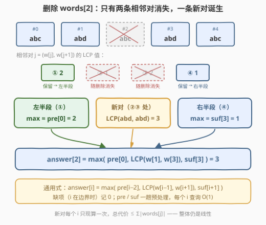
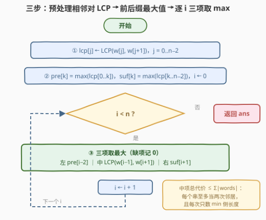

# LeetCode 相邻字符串之间的最长公共前缀 题解

## 1. 题目概述

- **标题 / 题号**：相邻字符串之间的最长公共前缀（#3598，medium）
- **链接**：https://leetcode.cn/problems/longest-common-prefix-between-adjacent-strings-after-removals/
- **难度**：中等
- **标签**：数组、字符串、前缀和

**题意**：给你一个字符串数组 `words`，对范围 $[0, n-1]$ 内的**每个下标** $i$ 独立执行：

1. 从 `words` 中**移除**下标 $i$ 处的元素（各次移除互不影响，数组每次都复原）；
2. 在移除后的数组中，计算**所有相邻对**的**最长公共前缀**（LCP）长度，取其**最大值**作为 `answer[i]`。

若移除后不存在相邻对（剩 0 或 1 个元素），或所有相邻对都没有公共前缀，则 `answer[i] = 0`。

**示例 1**：

```text
输入：words = ["jump","run","run","jump","run"]
输出：[3,0,0,3,3]
解释：移除下标 0 后数组为 ["run","run","jump","run"]，
     相邻对 ("run","run") 的公共前缀 "run" 长度 3，是所有相邻对中最大的。
```

**示例 2**：

```text
输入：words = ["dog","racer","car"]
输出：[0,0,0]
解释：无论移除哪个元素，剩余相邻对都没有公共前缀。
```

**约束**：

- $1 \le \text{words.length} \le 10^5$
- $1 \le |\text{words}[i]| \le 10^4$
- `words[i]` 仅由小写英文字母组成
- $\sum_i |\text{words}[i]| \le 10^5$

> 💡 **读题关键**：① $n$ 次询问**相互独立**——不是真的原地删除，每次都从原数组出发；② 「相邻对」指**删除后**位置相邻的两串；③ 取的是所有相邻对 LCP 的**最大值**（不是求和、不是某一特定对）；④ $n = 1$ 时删完剩 0 个元素，`answer = [0]`。约束里「总长度 $\le 10^5$」是强烈的暗示：期望复杂度与**总字长线性相关**。

## 2. 解题思路

### 2.1 暴力思路：每个 i 都重建数组重算一遍

最朴素的做法：对每个 $i$，把 `words[:i] + words[i+1:]` 拼出来，逐对求 LCP 再取最大。

- **正确性**：与题意逐字对应，必然正确；
- **效率**：单次询问要扫 $O(n)$ 个相邻对，$n$ 次询问就是 $O(n^2)$ 次对扫描。$n = 10^5$ 时约 $10^{10}$ 次基本操作，**必然超时**（还没算每对 LCP 的比较代价）；
- **可改进点**：删除一个元素后，**绝大多数相邻对根本没变**——只有包含 $i$ 的两条对消失了，外加一条新对诞生。重复计算全部相邻对纯属浪费。

### 2.2 核心观察：删除一个元素只扰动两条相邻关系 → 前缀/后缀最大值

先把「相邻对」的 LCP 预处理成一个数组：记

$$\text{lcp}[j] = \text{LCP}\big(\text{words}[j],\ \text{words}[j+1]\big),\quad j = 0, 1, \dots, n-2$$

删除 `words[i]` 后，原数组的 $n-1$ 条相邻对去向如下：

| 相邻对 | 删除后的状态 |
|--------|--------------|
| $(0,1), \dots, (i-2,\, i-1)$ | **原样保留**（两个成员都在 $i$ 左侧，相对顺序不变，LCP 值直接复用） |
| $(i-1,\, i)$ 与 $(i,\, i+1)$ | **消失**（成员 $i$ 被删） |
| $(i-1,\, i+1)$ | **新诞生**（跨过空洞相邻，需现场计算） |
| $(i+1,\, i+2), \dots, (n-2,\, n-1)$ | **原样保留**（都在 $i$ 右侧） |

于是「保留部分的最大值」用**前缀最大值 + 后缀最大值** $O(1)$ 直取：

- $\text{pre}[k] = \max(\text{lcp}[0..k])$ —— 左半段（对 $0..i-2$）的最大值即 $\text{pre}[i-2]$；
- $\text{suf}[k] = \max(\text{lcp}[k..n-2])$ —— 右半段（对 $i+1..n-2$）的最大值即 $\text{suf}[i+1]$。

$$\boxed{\ \text{answer}[i] = \max\big(\text{pre}[i-2],\ \ \text{LCP}(\text{words}[i-1],\, \text{words}[i+1]),\ \ \text{suf}[i+1]\big)\ }$$

不存在的项（$i$ 在边界）一律记 $0$：$i = 0$ 时无左半段也无新对；$i = n-1$ 时无右半段也无新对。



**新对现算会不会超时**？单次比较代价是 $\min(|w_{i-1}|, |w_{i+1}|)$，对全部 $i$ 求和：

$$\sum_{i} \min\big(|w_{i-1}|,\ |w_{i+1}|\big) \ \le\ \sum_{j} |w_j| \ =\ S$$

因为每个字符串至多作为「左邻居」「右邻居」各登场一次，且每次只取 `min` 侧的长度。预处理 $\text{lcp}$ 数组同理也是 $O(S)$（每对比较止于首个失配字符）。所以**整体仍是 $O(n + S)$ 线性**，恰好卡进「总长度 $\le 10^5$」的约束设计。

> 💡 **一句话总结**：删除是**局部扰动**——左半段、右半段的答案用 pre/suf 数组 $O(1)$ 拿到，唯一的增量是「跨坑新对」，单独现算即可。

### 2.3 算法流程图



**流程要点**：

| 步骤 | 动作 | 说明 |
|------|------|------|
| ① | `lcp[j] = LCP(words[j], words[j+1])` | 一趟 $O(S)$，每对比较止于首个失配 |
| ② | `pre[k] = max(lcp[0..k])`，`suf[k] = max(lcp[k..n-2])` | 正反两趟 $O(n)$ 前缀/后缀最大值 |
| ③ | 对每个 $i$ 三项取最大：左 `pre[i-2]`、中 `LCP(w[i-1], w[i+1])`、右 `suf[i+1]` | 缺项记 0；三项彼此独立，各自判断存在性再取 max |
| ④ | `i ← i + 1`，直到 $i = n$ | 中项现算总代价 $\le S$，见 2.2 的求和论证 |

### 2.4 示例演算

**示例 1：`words = ["jump","run","run","jump","run"]`，$n = 5$**

预处理：

```text
lcp = [LCP(jump,run), LCP(run,run), LCP(run,jump), LCP(jump,run)] = [0, 3, 0, 0]
pre = [0, 3, 3, 3]        （前缀最大值）
suf = [3, 3, 0, 0]        （后缀最大值）
```

逐个 $i$ 查表（「—」表示该项不存在，记 0）：

| $i$ | 左 `pre[i-2]` | 中 `LCP(w[i-1], w[i+1])` | 右 `suf[i+1]` | `answer[i]` |
|-----|---------------|---------------------------|----------------|-------------|
| 0 | — | —（无左邻） | `suf[1]` = 3 | **3** |
| 1 | — | LCP(jump, run) = 0 | `suf[2]` = 0 | **0** |
| 2 | `pre[0]` = 0 | LCP(run, jump) = 0 | `suf[3]` = 0 | **0** |
| 3 | `pre[1]` = 3 | LCP(run, run) = 3 | —（无右半段） | **3** |
| 4 | `pre[2]` = 3 | —（无右邻） | — | **3** |

输出 `[3, 0, 0, 3, 3]`，与官方一致 ✓

**示例 2**：`words = ["dog","racer","car"]`，`lcp = [0, 0]`，三项全为 0 → `[0, 0, 0]` ✓

## 3. 参考代码

### C++

```cpp
class Solution {
public:
    vector<int> longestCommonPrefix(vector<string>& words) {
        int n = words.size();
        vector<int> ans(n, 0);
        if (n == 1) return ans;                     // 删完无相邻对

        // lcp[j]：words[j] 与 words[j+1] 的最长公共前缀长度
        vector<int> lcp(n - 1, 0);
        for (int j = 0; j + 1 < n; j++) {
            const string& a = words[j];
            const string& b = words[j + 1];
            int k = 0, lim = min(a.size(), b.size());
            while (k < lim && a[k] == b[k]) k++;
            lcp[j] = k;
        }

        // pre[k] / suf[k]：lcp[0..k] / lcp[k..n-2] 的最大值
        vector<int> pre(lcp), suf(lcp);
        for (int j = 1; j < n - 1; j++) pre[j] = max(pre[j - 1], lcp[j]);
        for (int j = n - 3; j >= 0; j--) suf[j] = max(suf[j + 1], lcp[j]);

        for (int i = 0; i < n; i++) {
            int best = 0;
            if (i >= 2) best = max(best, pre[i - 2]);          // 左半段
            if (i + 1 <= n - 2) best = max(best, suf[i + 1]);  // 右半段
            if (i >= 1 && i + 1 < n) {                          // 新对现算
                const string& a = words[i - 1];
                const string& b = words[i + 1];
                int k = 0, lim = min(a.size(), b.size());
                while (k < lim && a[k] == b[k]) k++;
                best = max(best, k);
            }
            ans[i] = best;
        }
        return ans;
    }
};
```

### Python

```python
class Solution:
    def longestCommonPrefix(self, words: List[str]) -> List[int]:
        n = len(words)
        if n == 1:
            return [0]

        def lcp(a: str, b: str) -> int:
            k, lim = 0, min(len(a), len(b))
            while k < lim and a[k] == b[k]:
                k += 1
            return k

        lcp_arr = [lcp(words[j], words[j + 1]) for j in range(n - 1)]

        pre = lcp_arr[:]                    # pre[k] = max(lcp[0..k])
        for j in range(1, n - 1):
            pre[j] = max(pre[j - 1], lcp_arr[j])
        suf = lcp_arr[:]                    # suf[k] = max(lcp[k..n-2])
        for j in range(n - 3, -1, -1):
            suf[j] = max(suf[j + 1], lcp_arr[j])

        ans = []
        for i in range(n):
            best = 0
            if i >= 2:
                best = max(best, pre[i - 2])            # 左半段
            if i + 1 <= n - 2:
                best = max(best, suf[i + 1])            # 右半段
            if 1 <= i <= n - 2:                          # 新对现算
                best = max(best, lcp(words[i - 1], words[i + 1]))
            ans.append(best)
        return ans
```

> 💡 **写法要点**：
> - 三个 `if` 各自判断**存在性**再取 max，「越界项记 0」的边界处理（$i=0$、$i=n-1$、$n=1$、$n=2$）就全部统一了，不需要任何特判分支；
> - C++ 里用 `const string&` 接住 `words[j]`，避免每对比较都拷贝字符串；Python 的内层函数名 `lcp` 与列表 `lcp_arr` 分开命名，避免相互覆盖；
> - 最容易写错的下标是 `pre[i-2]` 与 `suf[i+1]`——建议先默写「删除后保留的对区间是 $[0, i-2]$ 与 $[i+1, n-2]$」，再倒推数组下标（见面试要点 Q4）。

## 4. 复杂度分析

设 $n = \text{words.length}$，$S = \sum_i |\text{words}[i]| \le 10^5$。

| 维度 | 复杂度 | 说明 |
|------|--------|------|
| **时间** | $O(n + S)$ | 预处理 `lcp` 一趟：每对比较止于首个失配，总代价 $\sum_j \min(|w_j|, |w_{j+1}|) \le S$；`pre`/`suf` 两趟 $O(n)$；回答每个 $i$ 时左右两项 $O(1)$，中项新对现算，总和 $\sum_i \min(|w_{i-1}|, |w_{i+1}|) \le S$ |
| **空间** | $O(n)$ | `lcp`、`pre`、`suf` 三个长度 $n-1$ 的数组（返回值不计入） |

## 5. 扩展：新对 LCP 的「跳过头」优化 + 免 pre/suf 的次大值写法

**优化一：从 $\min(\text{lcp}[i-1], \text{lcp}[i])$ 处起比**。三条串共享前缀时存在传递性：

$$\text{LCP}(w_{i-1}, w_{i+1}) \ \ge\ \min\big(\text{lcp}[i-1],\ \text{lcp}[i]\big)$$

因为 $w_{i-1}$ 与 $w_i$ 前 $a$ 个字符相同、$w_i$ 与 $w_{i+1}$ 前 $b$ 个字符相同，则三串在前 $\min(a, b)$ 个字符上完全一致。于是计算新对时可直接令 $k \leftarrow \min(\text{lcp}[i-1], \text{lcp}[i])$ 从那里接着比。渐进复杂度不变（最坏仍 $O(S)$），但「大片相同串」的用例会直接起飞——例如所有串完全相同时，每次新对计算 $O(1)$。

**优化二：用「最大值 + 次大值」替代 pre/suf 数组**。删除 $i$ 只会从 `lcp` 数组里**移除两个元素** $\text{lcp}[i-1]$ 与 $\text{lcp}[i]$，维护全局最大值（及其出现次数）和次大值，即可 $O(1)$ 判断「剩余部分的最大值」，空间降到 $O(1)$。这与 238 题「除自身以外数组的乘积」是孪生套路；不过该写法要小心「最大值恰好只出现在被删的两格里」的分支，配合新对现算后整体反而更容易出 off-by-one，面试中 pre/suf 版更直观稳妥。

## 6. 面试要点

**Q1：为什么删除 words[i] 后，其余相邻对的 LCP 全都不用重算？**

> 相邻对 $(j, j+1)$ 只要 $j \le i-2$ 或 $j \ge i+1$，两个成员就都还在数组里，且删除不改变其余元素的**相对顺序**——它们删除前相邻、删除后仍然相邻，LCP 值直接复用。真正受影响的只有含 $i$ 的两条对（消失）与跨过 $i$ 的新对 $(i-1, i+1)$（诞生）。这就是「删除 = 局部扰动」。

**Q2：新对每个 i 都要现算，总复杂度为什么不是 $O(n \times L)$？**

> 单次新对比较的代价是 $\min(|w_{i-1}|, |w_{i+1}|)$。对 $i$ 求和时，每个字符串至多作为左邻居和右邻居各出现一次，且每次只计入 `min` 侧，故 $\sum_i \min(|w_{i-1}|, |w_{i+1}|) \le \sum_j |w_j| = S \le 10^5$。这正是题目给「总长度」约束的原因——期望的就是与总字长线性相关的解法。

**Q3：边界 $i = 0$、$i = n-1$、$n = 1$、$n = 2$ 分别怎么落？**

> $i = 0$：无左半段也无新对，`answer[0] = suf[1]`；$i = n-1$：无右半段也无新对，`answer[n-1] = pre[n-3]`；$n = 1$：删完无相邻对，`answer = [0]`；$n = 2$：删任一个都只剩单元素，`answer = [0, 0]`。统一处理：所有越界的项直接记 0，用 `if` 判断存在性，无需特判分支。

**Q4：pre/suf 的下标为什么是 pre[i-2] 和 suf[i+1]？最容易错在哪？**

> 左半段保留的是**完全位于 $i$ 左侧**的对 $0..i-2$，故取 `pre[i-2]`；右半段保留的是对 $i+1..n-2$，故取 `suf[i+1]`。最常见错误是写成 `pre[i-1]`（把已消失的对 $(i-1, i)$ 算了进去）或 `suf[i]`（把对 $(i, i+1)$ 算了进去）。推导习惯：先列出「删除后保留的对区间」，再由区间端点倒推 pre/suf 下标，而不是凭感觉写。

**Q5：这题与 238（除自身以外数组的乘积）是什么关系？**

> 结构同构：都是「剔除位置 $i$ 后，对剩余元素做一次聚合」的批量询问。238 用前缀积 × 后缀积，本题用前缀 max / 后缀 max，另加一点局部增量（跨坑新对现算）。套路名为**前缀/后缀分解**，适合一切「单点删除 + 全局聚合」型的离线询问，同族还有 42（前后缀最大值）、724（前后缀和）。

> 💡 **一句话总结**：3598 = 预处理相邻对 LCP 数组 + 前缀/后缀最大值分解 + 跨坑新对现算（总代价 ≤ 总字长）。考点在识别「删除是局部扰动」这一不变量，以及 pre/suf 下标与边界条件的细心处理。

## 同类练习题

| # | 题目 | 与本题的关联 |
|---|------|-------------|
| 14 | [最长公共前缀](https://leetcode.cn/problems/longest-common-prefix/)（[站内题解](../0001-0100/14_最长公共前缀.md)） | LCP 逐字符比较的基本功，本题的原子操作 |
| 238 | [除自身以外数组的乘积](https://leetcode.cn/problems/product-of-array-except-self/)（[站内题解](../0201-0300/238_除自身以外数组的乘积.md)） | 前缀积 × 后缀积处理「剔除自身」型询问，与本题结构同构 |
| 42 | [接雨水](https://leetcode.cn/problems/trapping-rain-water/)（[站内题解](../0001-0100/42_接雨水.md)） | 前缀最大值 + 后缀最大值数组的最经典应用 |
| 724 | [寻找数组的中心下标](https://leetcode.cn/problems/find-pivot-index/)（[站内题解](../0701-0800/724_寻找数组的中心下标.md)） | 前缀和 / 后缀和对称分解的入门题 |
| 3043 | [最长公共前缀的长度](https://leetcode.cn/problems/find-the-length-of-the-longest-common-prefix/)（[站内题解](../3001-3100/3043_最长公共前缀的长度.md)） | 把 LCP 查询交给 Trie 的批量版本，练 LCP 的另一种组织方式 |
