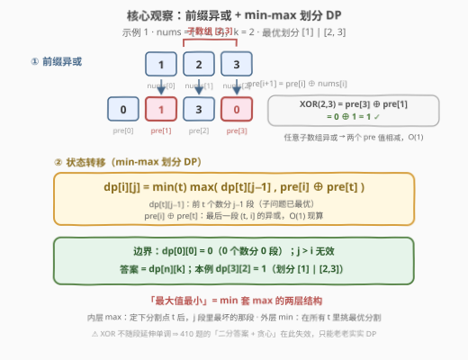
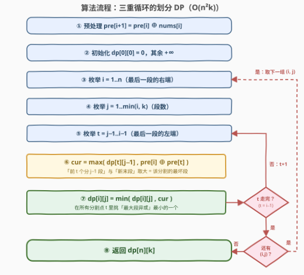

# 划分数组得到最小 XOR

- **题目名称**：划分数组得到最小 XOR
- **链接**：[3599. 划分数组得到最小 XOR](https://leetcode.cn/problems/partition-array-to-minimize-xor/)
- **难度**：中等
- **标签**：位运算、数组、动态规划、前缀和

## 1. 题目概述

给定整数数组 $nums$ 和整数 $k$，要求把 $nums$ 划分成**恰好 $k$ 个非空连续子数组**。对每个子数组计算其全部元素的按位异或（XOR），返回这 $k$ 个子数组中**最大 XOR 的最小值**。

**示例 1**：

```text
输入：nums = [1,2,3], k = 2
输出：1
解释：最优划分 [1] 和 [2,3]：两段 XOR 分别为 1 和 2⊕3=1，最大值 1，已是最小可能。
```

**示例 2**：

```text
输入：nums = [2,3,3,2], k = 3
输出：2
解释：最优划分 [2]、[3,3]、[2]：三段 XOR 为 2、0、2，最大值 2。
```

**示例 3**：

```text
输入：nums = [1,1,2,3,1], k = 2
输出：0
解释：最优划分 [1,1] 和 [2,3,1]：两段 XOR 均为 0。
```

**约束条件**：

- $1 \le nums.length \le 250$
- $1 \le nums[i] \le 10^9$
- $1 \le k \le n$

> 💡 **读题关键**：三个信号——① $n \le 250$ 的小数据规模，暗示多项式复杂度即可（$O(n^2k) \approx 1.6 \times 10^7$）；② 目标是「**最大值最小**」的 min-max 结构——划分型 DP 的标准套路，`min` 套 `max`；③ 子数组异或可用**前缀异或** $pre[r] \oplus pre[l]$ 在 $O(1)$ 内取得，让 DP 转移的代价计算整体「免费」。

---

## 2. 解题思路

### 2.1 暴力思路：枚举所有切割方案

把 $n$ 个元素分成 $k$ 段，等价于在 $n-1$ 个「间隙」里选 $k-1$ 个切割位置，共 $\binom{n-1}{k-1}$ 种方案；每种方案还需 $O(n)$ 计算各段异或再取最大值。$n = 250$ 时组合数是天文数字，完全不可行。

但暴力里藏着两个可优化点：

1. **段异或的重复计算**：不同方案大量共享同一段，而异或满足结合律——**前缀异或**可以让任意段 $[l, r)$ 的异或 $O(1)$ 得到；
2. **子问题的重复计算**：「前 $i$ 个元素分成 $j$ 段」这一子结构在所有方案中被反复求解——正是 DP 的用武之地。

### 2.2 核心观察：前缀异或 + min-max 划分 DP



**观察一（前缀异或）**：令 $pre[0] = 0$，$pre[i] = nums[0] \oplus \cdots \oplus nums[i-1]$。由异或的自逆性（$a \oplus a = 0$），任意子数组 $[l, r)$ 的异或为

$$nums[l] \oplus \cdots \oplus nums[r-1] = pre[r] \oplus pre[l]$$

一遍线性递推后，DP 内层每次转移的「末段异或」都是 $O(1)$。

**观察二（最优子结构 / 无后效性）**：固定「最后一段」是 $(t, i]$（下标从 $t$ 到 $i-1$ 的元素），那么剩下的任务就是「前 $t$ 个元素分成 $j-1$ 段」——它与最后一段怎么切**互不影响**：前面的划分只通过一个数（其最大段异或）影响总目标。这正是划分型 DP 的标准切口。

**观察三（min-max 转移）**：定义 $dp[i][j]$ = 前 $i$ 个元素分成 $j$ 段时，「最大段异或」的最小值，则

$$dp[i][j] = \min_{t = j-1}^{i-1} \; \max\bigl(\; dp[t][j-1], \; pre[i] \oplus pre[t] \;\bigr)$$

- 内层 $\max$：分割点定为 $t$ 后，$j$ 段里的最坏段 =「前 $j-1$ 段的最优解」与「新末段」取大；
- 外层 $\min$：在所有合法分割点 $t$ 里挑最优。

**边界与细节**：

- 初始化 $dp[0][0] = 0$（0 个元素分 0 段，代价 0），其余为 $+\infty$；
- $t$ 的枚举范围是 $[j-1, i-1]$：左端保证前 $t$ 个元素**至少有 $j-1$ 个**才能分出 $j-1$ 个非空段，右端保证末段 $(t, i]$ **非空**；
- $j > i$ 的状态无效，循环上限直接取 $\min(i, k)$；
- 答案即 $dp[n][k]$。

> ⚠️ **为什么不能像 410 题那样「二分答案 + 贪心」**：410（分割数组的最大值）里元素非负，**段和随延伸单调不减、拆段只会更小**，所以「XOR 换成和」后可以二分上界再贪心检查。但 XOR 没有这种单调性——段延伸时异或值**可升可降**（$1 \oplus 2 = 3$，再 $\oplus 3 = 0$），贪心「能延伸就延伸」会错过后面的抵消；甚至「至多 $k$ 段可行」也推不出「恰好 $k$ 段可行」（$[2,2]$：$k=1$ 答案 0，$k=2$ 答案 2——拆段反而变差）。$n \le 250$ 正是官方给 $O(n^2k)$ DP 留的甜区。

### 2.3 算法流程图



整体三步：**预处理前缀异或** → **初始化** → **三重循环填表**（外两层枚举状态 $(i, j)$，内层枚举分割点 $t$ 做 min-max 松弛）→ 返回 $dp[n][k]$。

### 2.4 示例演算

以**示例 1** `nums = [1,2,3]`，`k = 2` 走完全流程。前缀异或：$pre = [0, 1, 3, 0]$。

| 状态 | 计算 | 值 |
|------|------|----|
| $dp[1][1]$ | 单段 $[1]$：$pre[1] = 1$ | $1$ |
| $dp[2][1]$ | 单段 $[1,2]$：$pre[2] = 3$ | $3$ |
| $dp[3][1]$ | 单段 $[1,2,3]$：$pre[3] = 0$ | $0$ |
| $dp[2][2]$ | $t{=}1$：$\max(dp[1][1],\; pre[2]{\oplus}pre[1]) = \max(1, 2) = 2$（$[1] \mid [2]$） | $2$ |
| $dp[3][2]$ | $t{=}1$：$\max(1,\; 0{\oplus}1) = 1$（$[1] \mid [2,3]$）；$t{=}2$：$\max(3,\; 0{\oplus}3) = 3$（$[1,2] \mid [3]$）；取 $\min$ | $\mathbf{1}$ ✓ |

注意 $t=1$ 时 $\max(1,1)=1$ 恰好两段打平——这正是示例 1 的最优划分 $[1] \mid [2,3]$。示例 3 `nums = [1,1,2,3,1]` 同法演算：$pre = [0,1,0,2,1,0]$，最优转移发生在 $dp[5][2], t{=}2$：$\max(dp[2][1],\; pre[5]{\oplus}pre[2]) = \max(0, 0) = 0$ ✓。

---

## 3. 参考代码

### C++

```cpp
class Solution {
  public:
    int minXor(vector<int>& nums, int k) {
        int n = nums.size();
        vector<int> pre(n + 1);
        for (int i = 0; i < n; ++i) pre[i + 1] = pre[i] ^ nums[i];

        vector<vector<int>> dp(n + 1, vector<int>(k + 1, INT_MAX));
        dp[0][0] = 0;                                // 0 个元素分 0 段，代价 0
        for (int i = 1; i <= n; ++i)
            for (int j = 1; j <= min(i, k); ++j)     // j > i 无效，直接不枚举
                for (int t = j - 1; t < i; ++t)      // 末段 (t, i]；前 t 个须够分 j-1 段
                    dp[i][j] = min(dp[i][j],
                                   max(dp[t][j - 1], pre[i] ^ pre[t]));
        return dp[n][k];
    }
};
```

### Python

```python
class Solution:
    def minXor(self, nums: List[int], k: int) -> int:
        n = len(nums)
        pre = [0] * (n + 1)
        for i, x in enumerate(nums):
            pre[i + 1] = pre[i] ^ x

        INF = float('inf')
        dp = [[INF] * (k + 1) for _ in range(n + 1)]
        dp[0][0] = 0                        # 0 个元素分 0 段，代价 0
        for i in range(1, n + 1):
            pi = pre[i]
            for j in range(1, min(i, k) + 1):   # j > i 无效，直接不枚举
                best = dp[i][j]
                for t in range(j - 1, i):       # 末段 (t, i]
                    cur = max(dp[t][j - 1], pi ^ pre[t])
                    if cur < best:
                        best = cur
                dp[i][j] = best
        return dp[n][k]
```

> 💡 两份代码同构。$t \ge j-1$ 保证 $dp[t][j-1]$ 必为有限值（前 $t$ 个元素足够分 $j-1$ 段），无需额外判 $+\infty$。实测 $n = k = 250$ 随机数据：C++ 数十毫秒、Python 0.7s 以内。

---

## 4. 复杂度分析

| 维度 | 复杂度 | 说明 |
|------|--------|------|
| 时间 | $O(n^2 k)$ | 三重循环：状态 $(i, j)$ 共 $O(nk)$ 个，每个枚举分割点 $t$ 至多 $O(n)$ 次；$n \le 250$ 时上界约 $1.6 \times 10^7$（实际 $\sum_{i}\sum_{j}(i-j+1) \approx n^2k/6$ 更小） |
| 空间 | $O(nk)$ | DP 表 + 前缀异或数组；$dp[i][j]$ 只依赖上一层 $j-1$，滚动后可压到 $O(n)$ |

---

## 5. 扩展：空间滚动与「二分答案」的失效分析

- **滚动数组 $O(n)$ 空间**：转移只读 $j-1$ 层、写 $j$ 层，把 $j$ 提为最外层循环后保留两层一维数组即可，空间降到 $O(n)$；本题 $nk \le 62500$ 本就不大，属于锦上添花。
- **为什么 410 的「二分答案 + 贪心检查」搬不动**：410 中元素非负 ⇒ 段和随延伸单调不减，「上界 $x$ 下最少几段」可以贪心延伸；XOR 的段值**非单调**（延伸可升可降、抵消随时发生），贪心检查失效。若坚持二分答案 $x$，「恰好 $k$ 段、每段 $\le x$」的判定本身又是 $O(n^2k)$ 的布尔 DP——绕一圈回到原点，不如直接求值。
- **「恰好 $k$ 段」vs「至多 $k$ 段」**：求和问题里拆段不增、二者答案一致；XOR 下拆段可能变差（$[2,2]$ 整段 XOR 为 0，拆成两段各为 2），所以本题必须按**恰好** $k$ 段建模，不能先算「至多 $k$ 段」再补刀。
- **变体**：若 $k = 1$，答案直接是 $pre[n]$（整体异或）；若把「段异或」换成「段和」就是 410，换成「段平均值最大化」相关则是 813——同一套划分 DP 骨架换目标函数而已。

---

## 6. 面试要点

- **Q1：为什么子数组异或要前缀化？**
  答：异或满足结合律且自逆（$a \oplus a = 0$），令 $pre[i]$ 为前 $i$ 个元素的异或，则 $[l, r)$ 的段异或 $= pre[r] \oplus pre[l]$，$O(1)$ 取得。DP 内层转移要频繁算末段异或，没有这一步每次都是 $O(n)$，总复杂度会多乘一个 $n$。
- **Q2：状态怎么设计？为什么无后效性？**
  答：$dp[i][j]$ = 前 $i$ 个元素分 $j$ 段的最小「最大段异或」。按**最后一段**切口：枚举末段 $(t, i]$，前面是规模更小的同构子问题；前面的划分只通过 $dp[t][j-1]$ 这一个数值影响总目标，与末段无耦合，故无后效性。
- **Q3：分割点 $t$ 的枚举范围为什么是 $[j-1, i-1]$？**
  答：左端 $t \ge j-1$：前 $t$ 个元素至少要有 $j-1$ 个才能分出 $j-1$ 个非空段（同时保证 $dp[t][j-1]$ 有限）；右端 $t \le i-1$：末段 $(t, i]$ 必须非空。
- **Q4：能不能用「二分答案 + 贪心」？**
  答：不能。与 410（段和）不同，XOR 不随段延伸单调——$1 \oplus 2 = 3$ 再 $\oplus 3 = 0$，贪心会在高位卡死而错过后面的抵消；且「至多 $k$ 段可行」推不出「恰好 $k$ 段可行」（$[2,2]$：$k{=}1$ 答案 0、$k{=}2$ 答案 2）。$n \le 250$ 就是留给 $O(n^2k)$ DP 的。
- **Q5：初始化有哪些细节？**
  答：$dp[0][0] = 0$ 是唯一入口（0 个元素分 0 段代价 0）；其余状态置 $+\infty$ 作哨兵；循环中 $j$ 上限取 $\min(i, k)$ 直接跳过 $j > i$ 的无效状态，既省时间又避免读到 $+\infty$ 参与转移。

---

## 7. 同类练习题

- [410. 分割数组的最大值](https://leetcode.cn/problems/split-array-largest-sum/)：同一道「min-max 划分」的**求和版**——正数和的单调性让「二分答案 + 贪心」成立，对比体会本题 XOR 为何只能 DP（题解见[分割数组的最大值](../0401-0500/410_分割数组的最大值.md)）
- [1335. 工作计划的最低难度](https://leetcode.cn/problems/minimum-difficulty-of-a-job-schedule/)：同款 $dp[i][j] = \min_t \max(\cdot)$ 转移结构，把「段异或」换成「段最大值」（题解见[工作计划的最低难度](../1301-1400/1335_工作计划的最低难度.md)）
- [813. 最大平均值和的分组](https://leetcode.cn/problems/largest-sum-of-averages/)：划分型 DP 换目标函数（最大平均值），同一骨架的正向练习（题解见[最大平均值和的分组](../0801-0900/813_最大平均值和的分组.md)）
- [1310. 子数组异或查询](https://leetcode.cn/problems/xor-queries-of-a-subarray/)：前缀异或 $pre[r] \oplus pre[l]$ 的裸练习，本题观察一的基本功（题解见[子数组异或查询](../1301-1400/1310_子数组异或查询.md)）
- [1738. 找出第 K 大的异或坐标值](https://leetcode.cn/problems/find-kth-largest-xor-coordinate-value/)：前缀异或推广到二维（矩形异或），体会「前缀消自逆」思想的普适性（题解见[找出第K大的异或坐标值](../1701-1800/1738_找出第K大的异或坐标值.md)）
