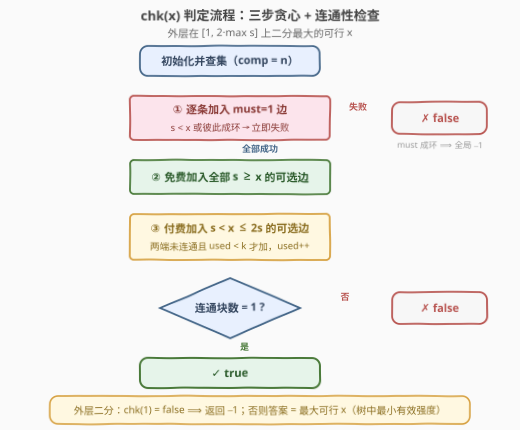

# LeetCode 升级后最大生成树稳定性 题解

## 1. 题目概述

- **标题 / 题号**：升级后最大生成树稳定性（#3600，hard）
- **链接**：https://leetcode.cn/problems/maximize-spanning-tree-stability-with-upgrades/
- **难度**：困难
- **标签**：贪心、并查集、图、二分答案、最小生成树

**题意**：给定 $n$ 个节点（编号 $0$ 到 $n-1$）和一个边列表 `edges`，其中 `edges[i] = [u_i, v_i, s_i, must_i]`：

- $u_i$、$v_i$ 表示一条**无向边**的两端；
- $s_i$ 是该边的**强度**；
- $must_i = 1$ 表示该边**必须**包含在生成树中，且**不能升级**；$must_i = 0$ 表示该边可选。

另有一个整数 $k$，表示最多可执行的**升级**次数。每次升级使一条边的强度**翻倍**，每条可升级边（即 $must_i = 0$）**最多升级一次**。

生成树的**稳定性**定义为其中所有边强度的**最小值**。返回任何合法生成树可能达到的**最大**稳定性；若无法构成合法生成树，返回 $-1$。

**示例 1**：

```text
输入：n = 3, edges = [[0,1,2,1],[1,2,3,0]], k = 1
输出：2
解释：边 [0,1] 强度为 2，必须包含；边 [1,2] 可选，用一次升级把强度从 3 提升到 6。
     生成树强度分别为 2 和 6，最小强度为 2，即最大可能稳定性。
```

**示例 2**：

```text
输入：n = 3, edges = [[0,1,4,0],[1,2,3,0],[0,2,1,0]], k = 2
输出：6
解释：将边 [0,1] 从 4 升级到 8，边 [1,2] 从 3 升级到 6。
     生成树包含这两条边，最小强度为 6。
```

**示例 3**：

```text
输入：n = 3, edges = [[0,1,1,1],[1,2,1,1],[2,0,1,1]], k = 0
输出：-1
解释：所有边都是必选的，构成一个环，违反生成树无环的性质，返回 -1。
```

**约束**：

- $2 \le n \le 10^5$
- $1 \le edges.length \le 10^5$
- $0 \le u_i, v_i < n$ 且 $u_i \ne v_i$
- $1 \le s_i \le 10^5$，$must_i \in \{0, 1\}$
- $0 \le k \le n$，没有重复的边

> 💡 **读题关键**：「最大化**最小值**」是二分答案的第一信号；而验证一个候选下限 $x$ 是否可行只需一趟并查集贪心。两个条件凑齐，本题就是标准的「二分答案 + 并查集判定」骨架，难点全在判定函数内部的贪心分层与预算刻画上。

## 2. 解题思路

### 2.1 暴力思路：枚举生成树 + 枚举升级分配

最直接的做法：枚举边集的所有子集，筛出「包含全部 $must=1$ 边、恰好 $n-1$ 条边、连通无环」的生成树，再对每棵树枚举升级边的不超过 $k$ 条的组合，取所有方案中最小有效强度的最大值。组合数是 $\binom{m}{n-1} \cdot \binom{m}{k}$ 量级，$m = 10^5$ 时是天文数字，完全不可行。

注意一个关键的结构性事实：**验证一个候选答案 $x$ 是便宜的**（一趟 $O(m\,\alpha(n))$ 的并查集扫描），难在直接搜索最优解。这正是二分答案适用的典型形态——把「最优是多少」转化为「下限 $x$ 行不行」。

### 2.2 核心观察：二分答案 + 并查集判定

定义判定函数：

$$chk(x) = \begin{cases} true, & \text{存在生成树 } T,\ \text{使 } T \text{ 中每条边的有效强度} \ge x \\ false, & \text{否则} \end{cases}$$

其中**有效强度** $\tilde{s}$ 指边未升级时为 $s$、升级后为 $2s$。固定阈值 $x$ 后，**每条边的命运完全确定**：

| 边的类型 | 条件 | 处理方式 |
|----------|------|----------|
| $must=1$ | $s < x$ | 太弱且禁升级，$chk$ 直接失败 |
| $must=1$ | 彼此成环 | 任何生成树都必须含它们 ⟹ 全局无解（$-1$） |
| $must=0$ | $s \ge x$ | **免费**入树，不花预算 |
| $must=0$ | $s < x \le 2s$ | **付费**入树，花 1 次升级，有效强度 $2s \ge x$ |
| $must=0$ | $2s < x$ | 即使升级也不达标，弃用 |


于是 $chk(x)$ 就是一个三步并查集贪心：

1. **先加全部 $must=1$ 边**：出现 $s < x$ 或成环（`unite` 返回 false）立即失败；
2. **再免费加入全部 $s \ge x$ 的可选边**（能合并才加，天然避免成环）；
3. **最后用预算 $k$ 逐条尝试付费边**（$s < x \le 2s$）：两端未连通才花一次升级去合并。

结束时连通块数为 $1$ 即可行。**单调性**显然：若某棵树对所有边的有效强度 $\ge x$，则对任何 $x' < x$ 同一棵树依然合法——可行性呈「$true \dots true\ false \dots false$」分布，二分找最后一个 $true$ 即答案。

> ⚠️ **升级预算的精确刻画**：设第 2 步结束后剩 $c$ 个连通块。每条**成功**的付费边恰好把连通块数减 1，因此把图连通**恰需** $c-1$ 次升级——这是一个与处理顺序无关的紧下界。所以 $k \ge c-1$ 且付费边足以连通各块时判定成功，否则失败。这也说明付费边之间**无需按强度排序**：它们对「稳定性 $\ge x$」这一目标完全等价，唯一代价都是预算 1。

> ⚠️ **什么时候返回 $-1$**：$chk(1)$ 失败即 $-1$（$s_i \ge 1$ 恒成立，故阈值 1 下所有边免费）。它恰好涵盖两种情形：$must$ 边彼此成环（示例 3），或全图根本不连通。

### 2.3 算法流程图



流程要点：三步贪心全部在**同一个并查集**上完成；`unite` 只有在两端分属不同连通块时才真正合并（保证无环）；外层二分区间为 $[1,\ 2\max s_i]$，先探测 $chk(1)$ 区分「无解」与「有解」。

### 2.4 示例演算

以示例 2 为例：$n = 3$，`edges = [[0,1,4,0],[1,2,3,0],[0,2,1,0]]`，$k = 2$，二分上界 $hi = 2 \times 4 = 8$。

| 判定 | 免费边（$s \ge x$） | 付费边（$s < x \le 2s$） | 过程 | 结果 |
|------|--------------------|--------------------------|------|------|
| $chk(6)$ | 无 | $(0,1,4)\to 8$、$(1,2,3)\to 6$ | 两条各花 1 次升级，共 $2 \le k$，全图连通 | ✓ true |
| $chk(7)$ | 无 | 仅 $(0,1,4)\to 8$ | $(1,2)$ 升级后也只有 $6 < 7$ 不可用，节点 2 落单 | ✗ false |

二分在 $[1, 8]$ 上收敛：$chk(5)$ 真 → $chk(7)$ 假（缩到 $[5,6]$）→ $chk(6)$ 真 → 答案 $6$。

## 3. 参考代码

### C++

```cpp
#include <numeric>

class Solution {
    vector<int> fa, sz;
    int comp;                           // 当前连通块数

    int find(int x) {
        while (fa[x] != x) {
            fa[x] = fa[fa[x]];          // 路径压缩：隔代一跳
            x = fa[x];
        }
        return x;
    }
    bool unite(int a, int b) {          // 返回是否真正合并了两块
        a = find(a); b = find(b);
        if (a == b) return false;
        if (sz[a] < sz[b]) swap(a, b);  // 按大小合并
        fa[b] = a; sz[a] += sz[b];
        --comp;
        return true;
    }

public:
    int maxStability(int n, vector<vector<int>>& edges, int k) {
        int hi = 0;
        for (auto& e : edges) hi = max(hi, e[2]);
        hi *= 2;                        // 答案上界：最强边升级后的强度

        // chk(x)：是否存在所有边有效强度 ≥ x 的生成树
        auto chk = [&](int x) -> bool {
            fa.resize(n);
            iota(fa.begin(), fa.end(), 0);
            sz.assign(n, 1);
            comp = n;

            for (auto& e : edges) {                 // ① must 边：强制加入
                if (e[3] != 1) continue;
                if (e[2] < x) return false;         //    太弱且禁升级
                if (!unite(e[0], e[1])) return false;  // must 边成环 → 无解
            }
            for (auto& e : edges)                   // ② 免费边：s ≥ x
                if (e[3] == 0 && e[2] >= x) unite(e[0], e[1]);

            int used = 0;
            for (auto& e : edges) {                 // ③ 付费边：s < x ≤ 2s
                if (e[3] == 0 && e[2] < x && 2 * e[2] >= x
                    && find(e[0]) != find(e[1])) {
                    if (used == k) break;           //    升级预算耗尽
                    unite(e[0], e[1]);
                    ++used;
                }
            }
            return comp == 1;                       // ④ 恰好连通 ⇒ n−1 条边成树
        };

        if (!chk(1)) return -1;                     // 不连通 / must 边成环
        int lo = 1;
        while (lo < hi) {                           // 二分最大的可行 x
            int mid = lo + (hi - lo + 1) / 2;
            if (chk(mid)) lo = mid;
            else hi = mid - 1;
        }
        return lo;
    }
};
```

### Python

```python
class Solution:
    def maxStability(self, n: int, edges: List[List[int]], k: int) -> int:
        musts = [(u, v, s) for u, v, s, m in edges if m == 1]
        opts = [(u, v, s) for u, v, s, m in edges if m == 0]

        def chk(x: int) -> bool:        # 存在所有边有效强度 ≥ x 的生成树？
            fa = list(range(n))
            sz = [1] * n
            comp = n

            def find(a: int) -> int:
                while fa[a] != a:
                    fa[a] = fa[fa[a]]   # 路径压缩：隔代一跳
                    a = fa[a]
                return a

            def unite(a: int, b: int) -> bool:
                nonlocal comp
                a, b = find(a), find(b)
                if a == b:
                    return False
                if sz[a] < sz[b]:       # 按大小合并
                    a, b = b, a
                fa[b] = a
                sz[a] += sz[b]
                comp -= 1
                return True

            for u, v, s in musts:       # ① must 边：强制加入
                if s < x or not unite(u, v):
                    return False        #    太弱 / must 边成环 → 无解
            for u, v, s in opts:        # ② 免费边：s ≥ x
                if s >= x:
                    unite(u, v)
            used = 0
            for u, v, s in opts:        # ③ 付费边：s < x ≤ 2s
                if s < x <= 2 * s and find(u) != find(v):
                    if used == k:       #    升级预算耗尽
                        break
                    unite(u, v)
                    used += 1
            return comp == 1            # ④ 恰好连通

        hi = 2 * max(s for _, _, s, _ in edges)
        if not chk(1):                  # 不连通 / must 边成环
            return -1
        lo = 1
        while lo < hi:                  # 二分最大的可行 x
            mid = (lo + hi + 1) // 2
            if chk(mid):
                lo = mid
            else:
                hi = mid - 1
        return lo
```

> 💡 上述解法已与暴力对拍验证：除三个官方示例外，$n \le 6$、$m \le 8$、$s_i \le 6$ 的 3000 组随机用例（枚举全部生成树子集 + 全部升级组合）结果完全一致。

## 4. 复杂度分析

| 维度 | 复杂度 | 说明 |
|------|--------|------|
| 时间 | $O(m \, \alpha(n) \cdot \log S)$ | $S = 2\max s_i \le 2\times10^5$，二分约 $\log S \approx 18$ 轮，每轮三趟扫边 + 近乎常数的并查集操作 |
| 空间 | $O(n)$ | 并查集的 `fa` / `sz` 数组（Python 判定函数内新建，C++ 复用成员数组） |

## 5. 扩展：为什么不能直接套「最大生成树」？

在没有升级、没有 $must$ 约束的世界里，「**最大化生成树中最小边权**」有一个经典结论：它等价于求**最大生成树**——Kruskal 按边权**降序**贪心即可，最小边权被抬到最高（瓶颈生成树的对偶）。本题为什么不能一趟 Kruskal 解决？两个破坏点：

- **$must$ 边强制加入**：它们可能比可选边弱得多（把最小值拖下去）、可能与强可选边冲突（强边因成环被跳过），甚至彼此成环直接判 $-1$（示例 3）。边权大小不再决定加入顺序。
- **升级预算是全局共享的**：一条边的有效强度是 $s$ 还是 $2s$，取决于预算花在哪些边上——边的「权值」不再是固定属性，任何基于排序的一次贪心都无法刻画这种**跨边的耦合**。

二分的价值正在于**解开耦合**：固定阈值 $x$ 后，每条边的状态（强制 / 免费 / 付费 / 弃用）变成 $x$ 的确定函数，判定退化为干净的并查集贪心，而最优性由 2.2 节「$c-1$ 次升级」的紧下界保证。

另一个实现层面的变体：二分域可以从整数区间 $[1, 2\max s_i]$ 换成**候选值集合** $\{s_i\} \cup \{2s_i\}$（至多 $2m$ 个，排序去重后二分）——答案必然落在其中。复杂度同为 $O(m \log m)$ 量级，纯属实现口味。

## 6. 面试要点

- **Q1：为什么 $chk$ 关于 $x$ 单调，从而可以二分？**
  答：若存在所有边有效强度 $\ge x$ 的生成树（含其升级方案），则同一棵树对任何 $x' < x$ 也合法——每条边的强度只会更充裕。可行性随 $x$ 增大从 $true$ 单调转为 $false$，二分找最后一个 $true$。
- **Q2：判定内「先免费、后付费」的贪心为什么最优？升级次数为什么是 $c-1$？**
  答：免费边不花预算，全部加入只会让连通块更少，不可能变差。设免费边加完后剩 $c$ 个连通块：树要连通它们**至少**需要 $c-1$ 条边（每条边至多合并两个块），而并查集逐条尝试付费边时「能合并才花预算」，恰好只花 $c-1$ 次——达到下界，与付费边的处理顺序无关。$k < c-1$ 或付费边不足以连通各块时判定失败。
- **Q3：什么时候返回 $-1$？**
  答：$chk(1)$ 失败即 $-1$。由于 $s_i \ge 1$，阈值 1 下没有边会被强度卡掉，失败只可能来自：$must$ 边彼此成环（所有生成树被迫含它们、必然有环），或全图不连通。
- **Q4：付费边需要按强度排序吗？must 边和可选边要混在一起排序吗？**
  答：都不需要。进入付费档的边都已满足 $2s \ge x$，对判定目标完全等价、代价同为预算 1，选哪些只影响能否连通；而「能合并才加」的并查集天然只用最少条数。$must$ 边是强制项而非排序项，必须最先独立处理。
- **Q5：二分上下界怎么定？总复杂度多少？**
  答：下界 1（$s_i \ge 1$ 保证）；上界 $2\max s_i$——最优树中最小有效强度要么来自未升级边（$\le \max s_i$），要么来自升级边（$\le 2\max s_i$）。总复杂度 $O(m\,\alpha(n)\log S)$，$S \le 2\times 10^5$，约 18 轮判定。

## 同类练习题

| # | 题目 | 与本题的关联 |
|---|------|-------------|
| 778 | [水位上升的泳池中游泳](https://leetcode.cn/problems/swim-in-rising-water/) | 同为「最大化子图中的最小值」，二分阈值 + 并查集判连通的祖师爷 |
| 1631 | [最小体力消耗路径](https://leetcode.cn/problems/path-with-minimum-effort/) | 最小化路径上最大边权的对偶版本，二分 + BFS 或并查集皆可 |
| 1579 | [保证图可完全遍历](https://leetcode.cn/problems/remove-max-number-of-edges-to-keep-graph-fully-traversable/) | 按边类型分先后做并查集贪心（先公共边后私有边），与本题「先 must、再免费、后付费」同款分层贪心 |
| 1489 | [找到最小生成树里的关键边和伪关键边](https://leetcode.cn/problems/find-critical-and-pseudo-critical-edges-in-minimum-spanning-tree/) | Kruskal + 并查集逐边判定重要性的集大成之作 |
| 1168 | [水资源分配优化](https://leetcode.cn/problems/optimize-water-distribution-in-a-village/) | MST 建模变体（ wells 建超级源点），体会生成树模型的灵活性 |
