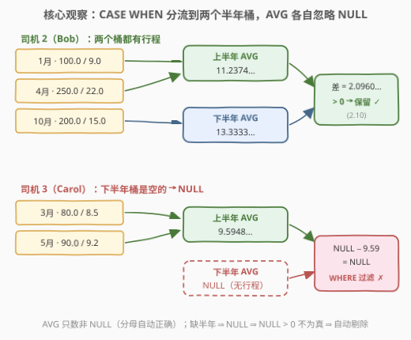
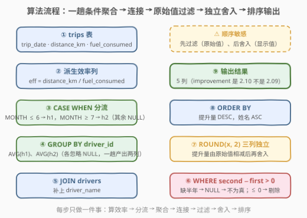
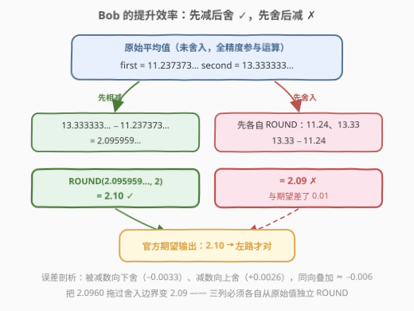

# LeetCode 寻找燃油效率提升的驾驶员 题解

## 1. 题目概述

- **标题 / 题号**：寻找燃油效率提升的驾驶员（#3601，medium）
- **链接**：https://leetcode.cn/problems/find-drivers-with-improved-fuel-efficiency/
- **难度**：中等
- **标签**：数据库、SQL、条件聚合、`AVG(CASE WHEN)`、`MONTH()`、NULL 传播、`ROUND()`、CTE

**表结构**：`drivers` 表

| 列名 | 类型 |
|------|------|
| driver_id | int |
| driver_name | varchar |

- `driver_id` 是这张表的唯一主键。
- 每一行都包含一个司机的信息。

**表结构**：`trips` 表

| 列名 | 类型 |
|------|------|
| trip_id | int |
| driver_id | int |
| trip_date | date |
| distance_km | decimal |
| fuel_consumed | decimal |

- `trip_id` 是这张表的唯一主键。
- 每一行表示一名司机完成的一次行程，包括该次行程行驶的距离和消耗的燃油量。

**目标**：编写一个解决方案，通过**比较**司机在**上半年**和**下半年**的**平均燃油效率**，找出**燃油效率有所提高**的司机。

- 通过 `distance_km / fuel_consumed` 计算**每次行程**的燃油效率；
- **上半年**：一月到六月，**下半年**：七月到十二月；
- 只包含在上半年和下半年**都有行程**的司机；
- 提升效率 = `second_half_avg - first_half_avg`；
- 所有结果**四舍五入**到小数点后 `2` 位。

返回结果表按提升效率**降序**排列，然后按司机姓名**升序**排列。

**示例 1**：

```text
输入：
drivers 表:
+-----------+---------------+
| driver_id | driver_name   |
+-----------+---------------+
| 1         | Alice Johnson |
| 2         | Bob Smith     |
| 3         | Carol Davis   |
| 4         | David Wilson  |
| 5         | Emma Brown    |
+-----------+---------------+

trips 表:
+---------+-----------+------------+-------------+---------------+
| trip_id | driver_id | trip_date  | distance_km | fuel_consumed |
+---------+-----------+------------+-------------+---------------+
| 1       | 1         | 2023-02-15 | 120.5       | 10.2          |
| 2       | 1         | 2023-03-20 | 200.0       | 16.5          |
| 3       | 1         | 2023-08-10 | 150.0       | 11.0          |
| 4       | 1         | 2023-09-25 | 180.0       | 12.5          |
| 5       | 2         | 2023-01-10 | 100.0       | 9.0           |
| 6       | 2         | 2023-04-15 | 250.0       | 22.0          |
| 7       | 2         | 2023-10-05 | 200.0       | 15.0          |
| 8       | 3         | 2023-03-12 | 80.0        | 8.5           |
| 9       | 3         | 2023-05-18 | 90.0        | 9.2           |
| 10      | 4         | 2023-07-22 | 160.0       | 12.8          |
| 11      | 4         | 2023-11-30 | 140.0       | 11.0          |
| 12      | 5         | 2023-02-28 | 110.0       | 11.5          |
+---------+-----------+------------+-------------+---------------+

输出：
+-----------+---------------+------------------+-------------------+------------------------+
| driver_id | driver_name   | first_half_avg   | second_half_avg   | efficiency_improvement |
+-----------+---------------+------------------+-------------------+------------------------+
| 2         | Bob Smith     | 11.24            | 13.33             | 2.10                   |
| 1         | Alice Johnson | 11.97            | 14.02             | 2.05                   |
+-----------+---------------+------------------+-------------------+------------------------+
```

**解释**：

- **Alice Johnson (driver_id = 1)**：
  - 上半年行程：Feb 15（120.5/10.2 = 11.81）、Mar 20（200.0/16.5 = 12.12），平均 = 11.97；
  - 下半年行程：Aug 10（150.0/11.0 = 13.64）、Sep 25（180.0/12.5 = 14.40），平均 = 14.02；
  - 提升效率 = 14.02 − 11.97 = 2.05。
- **Bob Smith (driver_id = 2)**：
  - 上半年行程：Jan 10（100.0/9.0 = 11.11）、Apr 15（250.0/22.0 = 11.36），平均 = 11.24；
  - 下半年行程：Oct 5（200.0/15.0 = 13.33），平均 = 13.33；
  - 提升效率 = 13.33 − 11.24 = 2.10（四舍五入到 2 位小数）。
- **未包含的司机**：Carol Davis 只有上半年行程；David Wilson 只有下半年行程；Emma Brown 只有上半年行程——都缺半个年度的数据。

> 💡 **审题关键**：① 平均的对象是「**每次行程**的效率」——先算 `distance_km / fuel_consumed` 再对这些值求平均，**不是** $\frac{\sum \text{distance}}{\sum \text{fuel}}$ 的加权平均（验证：Alice 上半年若按总量算是 320.5/26.7 = 12.00 ≠ 11.97）；② 「有所提高」意味着 `second_half_avg - first_half_avg > 0` 才保留；③ 三个输出列**各自独立**四舍五入，提升效率必须由**未舍入**的平均值相减后再舍入——Bob 的 2.10 不是 13.33 − 11.24 = 2.09，而是 13.3333… − 11.2374… = 2.0960… 舍入后的结果；④ 划分半年只看**月份**（`MONTH`），不区分年份。

## 2. 解题思路

### 2.1 暴力思路：两个半年各自聚合，再 JOIN 拼起来

最直白的写法：按 `WHERE MONTH(...) BETWEEN 1 AND 6` 和 `BETWEEN 7 AND 12` 把 `trips` 切成两张「虚拟表」，各自 `GROUP BY driver_id` 求平均，再与 `drivers` 连接：

```sql
WITH first_half AS (
    SELECT driver_id, AVG(distance_km / fuel_consumed) AS first_half_avg
    FROM trips
    WHERE MONTH(trip_date) BETWEEN 1 AND 6
    GROUP BY driver_id
),
second_half AS (
    SELECT driver_id, AVG(distance_km / fuel_consumed) AS second_half_avg
    FROM trips
    WHERE MONTH(trip_date) BETWEEN 7 AND 12
    GROUP BY driver_id
)
SELECT ...
FROM first_half f
JOIN second_half s ON s.driver_id = f.driver_id
JOIN drivers d ON d.driver_id = f.driver_id
WHERE s.second_half_avg - f.first_half_avg > 0;
```

- **正确性**：没问题——两个聚合结果做 `INNER JOIN`，缺任一半年的司机自然凑不齐两行而被剔除。
- **啰嗦**：`trips` 被**扫描两遍**，`AVG(distance_km / fuel_consumed)` 这个表达式重复写两遍，还要显式维护「两边都有才保留」的连接语义。
- **扩展性差**：若改成「按季度比较四个季度的平均」，子查询数量随区间数线性膨胀。

> ⚠️ 瓶颈在于把「按时间分段聚合」当成「每段一次独立查询」去实现。突破口是**一趟 `GROUP BY` 里同时算出两个半年的平均**——这正是条件聚合（conditional aggregation）的主场。

### 2.2 核心观察：`AVG(CASE WHEN)` 条件聚合 + NULL 传播



**观察一：分组键只有一个，需要的是「列内分流」而非「行间分组」。** 两个半年的平均都按 `driver_id` 分组，区别只在「哪些行参与平均」。于是可以用 `CASE WHEN` 把每行**改写**成两个半年的「贡献列」：

$$\texttt{CASE WHEN MONTH(trip\_date) <= 6 THEN distance\_km / fuel\_consumed END}$$

`CASE` 不写 `ELSE` 时，不满足条件的行得到 **NULL**。于是同一次 `GROUP BY driver_id` 产出两列：

$$\boxed{\texttt{AVG(CASE WHEN }\ldots\texttt{ THEN } e \texttt{ END})}$$

**观察二：`AVG` 忽略 NULL，恰好实现「只对本半年的行程求平均」。** `AVG` 只统计非 NULL 值——上半年的行程在「下半年列」里全是 NULL，`AVG` 跳过它们，等于只对下半年行程求平均，**分母自动正确**。

**观察三：NULL 传播让「双半年都有行程」的过滤条件消失。** 若司机只有单半年行程，另一列聚出 **NULL** 而不是 0（0 是「平均效率为 0」，语义完全不同）。而 NULL 参与运算与比较时：

$$\texttt{NULL} - x = \texttt{NULL}, \qquad \texttt{NULL} > 0 \not\Rightarrow \text{真}$$

于是 `WHERE second_half_avg - first_half_avg > 0` 一石三鸟：

| 情形 | `second − first` | `> 0` 结果 | 去留 |
|------|------------------|-----------|------|
| 双半年都有且提升 > 0 | 正数 | 真 | ✅ 保留 |
| 双半年都有但未提升 | 负数 / 0 | 假 | ✗ 剔除 |
| 缺任一半年 | NULL | 不为真 | ✗ 剔除 |

「只包含上下半年都有行程的司机」这一显式条件，被 NULL 传播**隐式完成**——无需 `COUNT` 校验、无需 `IS NOT NULL` 兜底。

> 💡 一趟扫描 + 一次分组，`GROUP BY driver_id` 的哈希/排序代价只付一次，两个半年的平均同时产出。这是「分段聚合」类问题的通用范式：**分段条件进 `CASE`，聚合函数包在外面**。

### 2.3 算法流程图



**逻辑执行步骤**：

| 步骤 | 表达式 | 作用 |
|------|--------|------|
| ① 派生效率列 | `distance_km / fuel_consumed` | 每次行程的燃油效率（先除，再平均） |
| ② 条件分流 | `CASE WHEN MONTH(trip_date) <= 6 THEN … END` | 上半年行程进 `first` 列，其余为 NULL；下半年同理进 `second` 列 |
| ③ 分组聚合 | `GROUP BY driver_id` + `AVG(...)` | 每个司机一行，两列各自忽略 NULL 求平均 |
| ④ 连接 | `JOIN drivers USING (driver_id)` | 补上司机姓名 |
| ⑤ 过滤 | `WHERE second − first > 0` | 剔除未提升者；缺任一半年 → NULL → 自动剔除 |
| ⑥ 舍入 | `ROUND(x, 2)`（三列各自独立） | 显示层格式化，发生在过滤之后 |
| ⑦ 排序 | `ORDER BY efficiency_improvement DESC, driver_name ASC` | 按题目要求的次序输出 |

> ⚠️ 顺序很重要：**先过滤（原始值）、后舍入（显示值）**。若把 `ROUND` 提前到过滤之前，`0 < 提升量 < 0.005` 的司机会被舍入成 0.00 而被 `> 0` 误杀（或反之产生歧义）——「提高与否」是业务事实，「保留几位小数」是展示格式，二者不能混为一谈。

### 2.4 示例演算：Bob 的 2.10 从哪来（舍入陷阱）



以 Bob Smith 走查（原始值带省略号，全精度参与运算）：

| 量 | 计算 | 原始值 | 舍入后 |
|----|------|--------|--------|
| 上半年平均 | $(100/9 + 250/22) / 2 = (11.1111\ldots + 11.3636\ldots)/2$ | $11.2374\ldots$ | **11.24** |
| 下半年平均 | $200/15$ | $13.3333\ldots$ | **13.33** |
| 提升效率（✅ 正确） | $13.3333\ldots - 11.2374\ldots = 2.0959\ldots$ 再舍入 | $2.0959\ldots$ | **2.10** |
| 提升效率（❌ 错误） | $13.33 - 11.24 = 2.09$（先舍入再相减） | — | **2.09** ✗ |

两条路径只差「先舍还是先减」，结果差 0.01——正确答案是 **2.10**。原因：两个舍入误差方向相同（一个向上、一个向下）时叠加放大。结论：**三个输出列彼此独立，都从原始值出发各自 `ROUND`**，`efficiency_improvement` 绝不能由已舍入的两列相减得到。

> 💡 顺带验证排序：Bob（2.10）> Alice（2.05），故 Bob 在前；若两人提升量舍入后相同，则按 `driver_name` 字典序升序。

## 3. 参考代码

### SQL（解法 A：`AVG(CASE WHEN)` 条件聚合，推荐）

```sql
# Write your MySQL query statement below
WITH half AS (
    SELECT
        driver_id,
        AVG(CASE WHEN MONTH(trip_date) <= 6
                 THEN distance_km / fuel_consumed END) AS first_half_avg,
        AVG(CASE WHEN MONTH(trip_date) >= 7
                 THEN distance_km / fuel_consumed END) AS second_half_avg
    FROM trips
    GROUP BY driver_id
)
SELECT
    h.driver_id,
    d.driver_name,
    ROUND(h.first_half_avg, 2)  AS first_half_avg,
    ROUND(h.second_half_avg, 2) AS second_half_avg,
    ROUND(h.second_half_avg - h.first_half_avg, 2) AS efficiency_improvement
FROM half h
JOIN drivers d ON d.driver_id = h.driver_id
WHERE h.second_half_avg - h.first_half_avg > 0
ORDER BY efficiency_improvement DESC, d.driver_name ASC;
```

> 💡 **写法要点**：
> - 两个 `AVG(CASE WHEN ...)` 共享同一个 `GROUP BY driver_id`，一趟扫描同时产出两个半年的平均；`MONTH(...) <= 6` 与 `>= 7` 也可以写成 `BETWEEN 1 AND 6` / `BETWEEN 7 AND 12`，或用 `QUARTER(trip_date) <= 2`，语义等价。
> - `WHERE` 用的是 CTE 里**未舍入**的原始列做 `> 0` 判断；`ROUND` 只出现在最外层 SELECT 的显示列上——这正是 2.4 节舍入陷阱的正确规避姿势。
> - `ORDER BY efficiency_improvement` 引用的是输出列别名（已舍入），与题目「按提升效率降序」的展示语义一致；MySQL 的 `ORDER BY` 允许引用 SELECT 别名。
> - `JOIN` 与 `LEFT JOIN` 此处等价：`WHERE` 里对聚合列的比较已经把没有行程的司机全部筛掉，连接类型不影响结果。

### SQL（解法 B：双聚合 + 连接，思路直白）

```sql
# Write your MySQL query statement below
WITH first_half AS (
    SELECT driver_id, AVG(distance_km / fuel_consumed) AS first_half_avg
    FROM trips
    WHERE MONTH(trip_date) <= 6
    GROUP BY driver_id
),
second_half AS (
    SELECT driver_id, AVG(distance_km / fuel_consumed) AS second_half_avg
    FROM trips
    WHERE MONTH(trip_date) >= 7
    GROUP BY driver_id
)
SELECT
    f.driver_id,
    d.driver_name,
    ROUND(f.first_half_avg, 2)  AS first_half_avg,
    ROUND(s.second_half_avg, 2) AS second_half_avg,
    ROUND(s.second_half_avg - f.first_half_avg, 2) AS efficiency_improvement
FROM first_half f
JOIN second_half s ON s.driver_id = f.driver_id
JOIN drivers d     ON d.driver_id = f.driver_id
WHERE s.second_half_avg - f.first_half_avg > 0
ORDER BY efficiency_improvement DESC, d.driver_name ASC;
```

> 💡 **写法要点**：
> - 「过滤后再聚合」的直译版：每个半年各自 `WHERE + GROUP BY`，缺半年的司机在对应子查询里没有行，`INNER JOIN` 拼不齐即被剔除——「双半年都有行程」由连接语义显式承担（解法 A 里则由 NULL 传播隐式承担）。
> - 代价是 `trips` 扫两遍、效率表达式写两遍；换成「按季度四段比较」要写四个 CTE，而解法 A 只加两列。
> - 同样注意：`WHERE` 与 `ROUND` 的分工与解法 A 完全一致。

### Python（pandas）

```python
import pandas as pd


def find_improved_efficiency_drivers(drivers: pd.DataFrame, trips: pd.DataFrame) -> pd.DataFrame:
    t = trips.copy()
    t["eff"] = t["distance_km"] / t["fuel_consumed"]
    month = pd.to_datetime(t["trip_date"]).dt.month
    t["h1"] = t["eff"].where(month <= 6)   # CASE WHEN month <= 6 THEN eff END
    t["h2"] = t["eff"].where(month >= 7)   # CASE WHEN month >= 7 THEN eff END

    g = (
        t.groupby("driver_id")
        .agg(first_half_avg=("h1", "mean"), second_half_avg=("h2", "mean"))
        .reset_index()
    )
    g = g[g["second_half_avg"] - g["first_half_avg"] > 0]
    g = g.merge(drivers, on="driver_id")

    out = pd.DataFrame(
        {
            "driver_id": g["driver_id"],
            "driver_name": g["driver_name"],
            "first_half_avg": g["first_half_avg"].round(2),
            "second_half_avg": g["second_half_avg"].round(2),
            "efficiency_improvement": (g["second_half_avg"] - g["first_half_avg"]).round(2),
        }
    )
    return out.sort_values(
        ["efficiency_improvement", "driver_name"], ascending=[False, True]
    ).reset_index(drop=True)
```

> 💡 **pandas 对照**：
> - `.where(cond)` 无 `other` 参数时把不满足条件的位置置 `NaN`——正是 `CASE WHEN ... THEN ... END`（无 ELSE）的对应物；`groupby().mean()` 像 `AVG` 一样**跳过 NaN**，分母自动正确。
> - 布尔掩码 `g[...] > 0` 中 `NaN > 0` 为 `False`，缺半年的司机天然落选——与 SQL 的 NULL 传播殊途同归。
> - ⚠️ 构造 `out` 时三列的 `round(2)` **同时**基于原始 `g` 列计算：`efficiency_improvement` 由未舍入的两列相减后再舍入。若先把 `first_half_avg`/`second_half_avg` 赋值为舍入值、再相减，就重演 2.4 节的 2.09 陷阱。
> - 排序用 `ascending=[False, True]` 对应 `ORDER BY ... DESC, ... ASC`。

## 4. 复杂度分析

| 维度 | 复杂度 | 说明 |
|------|--------|------|
| **时间复杂度（解法 A）** | $O(T + D)$ | `trips` 一趟扫描并按 `driver_id` 分组（哈希聚合）$O(T)$；与 `drivers` 连接 $O(D)$。$T$ = `trips` 行数，$D$ = `drivers` 行数 |
| **空间复杂度（解法 A）** | $O(D)$ | 聚合结果每司机一行（两列平均），CTE 物化 $D$ 行 |
| **时间复杂度（解法 B）** | $O(T + D)$ | 渐进相同，但 `trips` 扫两遍、常数更大；两个子聚合再连接 |

> - 若 `trips.driver_id` 上有索引，分组可借索引序完成，退化为顺序读；无索引时哈希聚合一趟扫表仍是线性。
> - 派生列 `distance_km / fuel_consumed` 是逐行计算的标量除法，不引入额外扫描。

## 5. 扩展：按季度 / 按年份泛化

**按季度比较四个季度的平均**——条件聚合的扩展只加列，不加扫描：

```sql
SELECT
    driver_id,
    ROUND(AVG(CASE WHEN QUARTER(trip_date) = 1 THEN distance_km / fuel_consumed END), 2) AS q1_avg,
    ROUND(AVG(CASE WHEN QUARTER(trip_date) = 2 THEN distance_km / fuel_consumed END), 2) AS q2_avg,
    ROUND(AVG(CASE WHEN QUARTER(trip_date) = 3 THEN distance_km / fuel_consumed END), 2) AS q3_avg,
    ROUND(AVG(CASE WHEN QUARTER(trip_date) = 4 THEN distance_km / fuel_consumed END), 2) AS q4_avg
FROM trips
GROUP BY driver_id;
```

**若数据跨年份、要求逐年比较上下半年**——把年份并入分组键即可，思路不变：

```sql
GROUP BY driver_id, YEAR(trip_date)
```

> 💡 泛化规律：**「分段」条件永远写在 `CASE WHEN` 里，「分块」维度永远写在 `GROUP BY` 里**。本题只按月份分段、按司机分块；分段变多加 CASE 列，分块变多维加 GROUP BY 键，范式完全稳定。另一种等价姿势是「行转列自连接」（先 `UNION` 出 `(driver_id, half, eff)` 长表再 `GROUP BY driver_id, half`），适合分段数动态变化的场景——列数不固定时，长表 + 条件聚合的组合比硬写 N 个 CASE 更灵活。

## 6. 面试要点

**Q1：平均燃油效率为什么是 `AVG(distance_km / fuel_consumed)`，而不是 `SUM(distance_km) / SUM(fuel_consumed)`？**

> 前者是**每次行程效率的算术平均**——每趟行程等权；后者是**总里程除以总油耗的加权平均**——长行程权重更大。两者数值不同（Alice 上半年：算术平均 11.97，加权版 320.5/26.7 = 12.00）。题目明确「先算每次行程的燃油效率，再比较平均」，且示例解释逐趟列出 11.81、12.12 后取平均，锁定的就是「先除后平均」。

**Q2：`AVG(CASE WHEN ... THEN ... END)` 不写 `ELSE` 会发生什么？为什么这恰好是本题需要的？**

> 不满足条件的行得到 NULL，`AVG` 只对非 NULL 值求平均——等价于「只统计本半年的行程，且分母只数这些行」。若某司机整个半年都没有行程，该列聚合结果是 NULL 而不是 0：NULL 准确表达「无数据」，而 0 会伪装成「平均效率为 0」从而制造虚假的提升量。

**Q3：「上半年和下半年都有行程」这个条件在解法 A 里是怎么被满足的？**

> 全靠 NULL 传播：缺任一半年 ⇒ 对应平均值为 NULL ⇒ `second − first` 为 NULL ⇒ `NULL > 0` 不为真 ⇒ 被 WHERE 过滤。不需要 `COUNT(DISTINCT ...)` 校验两个半年，也不需要 `IS NOT NULL` 兜底。解法 B 则把这个条件交给 `INNER JOIN`——两边的子查询都凑不齐行的司机自然消失，两种实现殊途同归。

**Q4：`efficiency_improvement` 为什么不能用已经舍入的 13.33 减 11.24 来算？**

> 舍入是显示层操作，两次舍入的误差会叠加：Bob 的原始平均是 13.3333… 与 11.2374…，正确提升量 2.0959… 舍入为 2.10；而 13.33 − 11.24 = 2.09，凭空丢了 0.01。规则是**三个输出列各自独立地从原始值 ROUND**。同理，「是否提升」的 `> 0` 判断也应作用于原始差值——先把提升量舍入成 0.00 再判断，会把「微弱提升」的司机误杀。

**Q5：如果 `trip_date` 混有多个年份（如 2022 与 2023），本解法还成立吗？**

> `MONTH()` 只取月份不看年份，本题解法把所有年份的 1–6 月都归入「上半年」——与题面描述和判题数据一致（示例全部是 2023 年，题面也未要求分年）。若业务上要求逐年比较，分组键改为 `GROUP BY driver_id, YEAR(trip_date)` 并在输出中增加年份列，条件聚合的范式不变——这正是第 5 节的泛化规律。

> 💡 **一句话总结**：3601 是**「条件聚合 + NULL 传播 + 舍入时机」三合一**的 SQL 模板题——`AVG(CASE WHEN MONTH ...)` 一趟分组算出两个半年的平均，`WHERE second − first > 0` 借 NULL 传播顺带完成「双半年都有行程」的过滤，`ROUND` 只在最后的显示列上各自独立出现。最大坑点：**提升量必须由未舍入的平均值相减后再舍入**（Bob 的 2.10 而非 2.09）。

## 同类练习题

| # | 题目 | 与本题的关联 |
|---|------|-------------|
| 1211 | [查询结果的质量和百分比](https://leetcode.cn/problems/queries-quality-and-percentage/) | `AVG` + `ROUND` + `IF/CASE` 逐行派生再分组聚合的入门题，本题效率列派生的最小单元 |
| 578 | [查询回答率最高的问题](https://leetcode.cn/problems/get-highest-answer-rate-question/) | `SUM(CASE WHEN ... THEN 1 ELSE 0 END) / COUNT(*)` 条件聚合经典款，与本题同属「一趟分组内按条件分流统计」 |
| 1174 | [即时食物配送 II](https://leetcode.cn/problems/immediate-food-delivery-ii/) | 「首次 vs 整体」两口径对比，训练「两个口径一次查询同时产出」的条件聚合思维 |
| 1322 | [广告效果](https://leetcode.cn/problems/ads-performance/) | 按动作分类条件计数，`CASE WHEN` 分流的另一种聚合形态（`COUNT`/`SUM` 版） |
| 2854 | [滚动平均步数](https://leetcode.cn/problems/rolling-average-steps/) | 时间窗口平均的窗口函数版（本题仓库已有题解），对照「条件聚合按段平均」与「窗口函数滚动平均」两种时序口径 |
