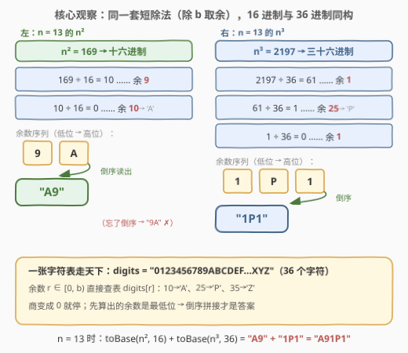
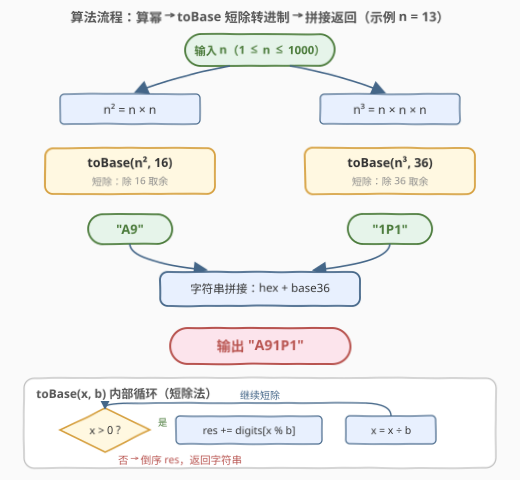

# LeetCode 十六进制和三十六进制转化 题解

## 1. 题目概述

- **标题 / 题号**：十六进制和三十六进制转化（#3602，easy）
- **链接**：https://leetcode.cn/problems/hexadecimal-and-hexatrigesimal-conversion/
- **难度**：简单
- **标签**：数学、字符串、进制转换、模拟

**题意**：给你一个整数 `n`，返回 `n²` 的**十六进制表示**和 `n³` 的**三十六进制表示**拼接成的字符串。

- **十六进制**：使用数字 `0–9` 和大写字母 `A–F` 表示 0 到 15 的值；
- **三十六进制**：使用数字 `0–9` 和大写字母 `A–Z` 表示 0 到 35 的值。

**示例 1**：

```text
输入：n = 13
输出："A91P1"

解释：
- n² = 13 × 13 = 169，十六进制为 (10 × 16) + 9 = 169，对应 "A9"；
- n³ = 13 × 13 × 13 = 2197，三十六进制为 (1 × 36²) + (25 × 36) + 1 = 2197，对应 "1P1"；
- 拼接两个结果得到 "A9" + "1P1" = "A91P1"。
```

**示例 2**：

```text
输入：n = 36
输出："5101000"

解释：
- n² = 36 × 36 = 1296，十六进制为 (5 × 16²) + (1 × 16) + 0，对应 "510"；
- n³ = 36 × 36 × 36 = 46656，三十六进制为 (1 × 36³) + 0 + 0 + 0，对应 "1000"；
- 拼接两个结果得到 "510" + "1000" = "5101000"。
```

**约束**：$1 \le n \le 1000$。

> 💡 **审题关键**：① 转换的对象是 $n^2$ 与 $n^3$，**不是 $n$ 本身**；② 两段用**不同进制**——16 与 36，且字母一律**大写**；③ 结果是两个字符串**直接拼接**，中间没有分隔符；④ $n \ge 1$ 意味着 $n^2, n^3 \ge 1$，不会出现「转 0」的退化情形（但通用模板仍应处理它）。

## 2. 解题思路

### 2.1 直接思路：为 16 和 36 各写一个转换函数？

本题是纯模拟题，不存在「暴力 → 优化」的性能分野，真正的考点是**进制转换怎么写得又对又通用**。

最直觉的写法是照题意硬写两段：`toHex(x)` 一段、`toBase36(x)` 一段。两段代码的骨架一模一样——都是「不断除以基数取余、余数转字符、最后倒序」，只有基数（16 vs 36）和字符表长度（16 vs 36 个字符）不同：

```text
toHex(x):      除 16 取余 → '0'~'9','A'~'F'   → 倒序
toBase36(x):   除 36 取余 → '0'~'9','A'~'Z'   → 倒序
```

复制粘贴两遍既容易抄错细节，也错过了把「进制转换」抽象成通用工具的机会。

> ⚠️ 瓶颈不在性能而在**抽象**：16 和 36 只是同一个算法的两个参数。突破口是把「除 $b$ 取余」封装成一个 `toBase(x, b)`——一套模板同时喂给两个进制。

### 2.2 核心观察：短除法 toBase(x, b) 一套模板通吃



**观察一：进制转换 = 反复「除 $b$ 取余」。** 把 $x$ 写成 $b$ 进制：

$$x = d_k \cdot b^k + \cdots + d_1 \cdot b + d_0$$

对 $x$ 取模恰好剥出**最低位** $d_0 = x \bmod b$；整除 $b$ 则把整个数**右移一位**：

$$\lfloor x / b \rfloor = d_k \cdot b^{k-1} + \cdots + d_1$$

反复执行直到商为 0，各位数字就从低位到高位依次浮出——这就是**短除法**。它对任何基数 $b \ge 2$ 都成立，16 和 36 自然一套通吃。以 $n = 13$ 走一遍：

| 短除步骤 | 商 | 余数 | 字符 | 位置 |
|----------|----|------|------|------|
| $169 \div 16$ | $10$ | $9$ | `'9'` | 最低位 |
| $10 \div 16$ | $0$ | $10$ | `'A'` | 最高位 |
| $2197 \div 36$ | $61$ | $1$ | `'1'` | 最低位 |
| $61 \div 36$ | $1$ | $25$ | `'P'` | 中间位 |
| $1 \div 36$ | $0$ | $1$ | `'1'` | 最高位 |

**观察二：一张 36 字符的表覆盖所有余数。** 十六进制的余数落在 $[0, 16)$，三十六进制的落在 $[0, 36)$，都可以直接查同一张表：

```text
digits = "0123456789ABCDEFGHIJKLMNOPQRSTUVWXYZ"
```

余数 $r$ 对应字符 `digits[r]`：$10 \to$ `'A'`、$15 \to$ `'F'`、$25 \to$ `'P'`、$35 \to$ `'Z'`。不需要任何 `if-else` 分情况讨论，也不会在「大于 9 才加 `'A'`」这类边界上写错。

**观察三：先算出的余数是低位，务必倒序。** 余数序列天然「低位在前」（如 $169$ 的 $[9, 10]$），而书写习惯是高位在左，所以收集完必须**反转**：$[9, A] \to$ `"A9"`。**忘记反转是本题最经典的 WA**——$169$ 忘反转会输出 `"9A"`。

> 💡 数据范围顺便确认：$n \le 1000 \Rightarrow n^3 \le 10^9$，C++ 的 `int` 上限约 $2.1 \times 10^9$，勉强装得下但距上限不足一倍；幂运算直接用 `long long` 存，把正确性和侥幸脱钩。

### 2.3 算法流程图



**逻辑执行步骤**：

| 步骤 | 操作 | 说明 |
|------|------|------|
| ① 算幂 | $n^2 = n \times n$，$n^3 = n^2 \times n$ | C++ 用 `long long` 存，免疫边界 |
| ② 短除循环 | `while (x > 0)`：追加 `digits[x % b]`，再 `x /= b` | 余数低位在前 |
| ③ 倒序 | 反转收集到的字符序列 | 低位在前 → 高位在前 |
| ④ 拼接 | `toBase(n², 16) + toBase(n³, 36)` | 字符串直接相加 |
| ⑤ 返回 | 拼接结果 | 无分隔符、全大写 |

### 2.4 示例演算：n = 13 全流程

| 阶段 | 计算 | 结果 |
|------|------|------|
| 平方 | $13^2 = 169$ | 待转 16 进制 |
| 短除 169 | $169 \div 16 = 10$ 余 $9$；$10 \div 16 = 0$ 余 $10$ | 余数序列 $[9, 10]$ → 倒序 → `"A9"` |
| 立方 | $13^3 = 2197$ | 待转 36 进制 |
| 短除 2197 | $2197 \div 36 = 61$ 余 $1$；$61 \div 36 = 1$ 余 $25$；$1 \div 36 = 0$ 余 $1$ | 余数序列 $[1, 25, 1]$ → 倒序 → `"1P1"` |
| 拼接 | `"A9" + "1P1"` | **`"A91P1"`** ✓ |

> 💡 顺带验证 $n = 36$：$n^2 = 1296$，短除得余数 $[0, 1, 5]$ → 倒序 `"510"`；$n^3 = 46656$，余数 $[0, 0, 0, 1]$ → 倒序 `"1000"`；拼接 `"5101000"` ✓。

## 3. 参考代码

### C++

```cpp
class Solution {
    string toBase(long long x, int b) {
        if (x == 0) return "0";
        const string digits = "0123456789ABCDEFGHIJKLMNOPQRSTUVWXYZ";
        string res;
        while (x > 0) {
            res += digits[x % b];   // 余数低位先出
            x /= b;                 // 整体右移一位
        }
        reverse(res.begin(), res.end());
        return res;
    }
public:
    string concatHex36(int n) {
        long long sq = 1LL * n * n;
        long long cu = sq * n;
        return toBase(sq, 16) + toBase(cu, 36);
    }
};
```

> 💡 **写法要点**：
> - `toBase(x, b)` 是任意 $2 \le b \le 36$ 进制的通用模板，16 与 36 只是两次不同参数的调用；
> - `1LL * n * n` 把乘法提升到 `long long` 再算——$n^3 = 10^9$ 距 `int` 上限仅一步之遥，不赌；
> - `x == 0` 的守护分支在本题（$n \ge 1$）不会触发，但让模板对 $x = 0$ 也返回 `"0"` 而非空串，是通用性的一部分。

### Python

```python
class Solution:
    def concatHex36(self, n: int) -> str:
        def to_base(x: int, b: int) -> str:
            if x == 0:
                return "0"
            digits = "0123456789ABCDEFGHIJKLMNOPQRSTUVWXYZ"
            res = []
            while x:
                res.append(digits[x % b])
                x //= b
            return "".join(reversed(res))

        return to_base(n * n, 16) + to_base(n * n * n, 36)
```

> 💡 **写法要点**：
> - Python 整数无溢出之忧，直接 `n * n * n`；
> - 用列表收集再 `"".join(reversed(...))`，比字符串 `+=` 拼接更地道（避免产生大量中间字符串对象）。

## 4. 复杂度分析

| 维度 | 复杂度 | 说明 |
|------|--------|------|
| **时间复杂度** | $O(\log n)$ | 短除次数 = 结果位数：$\log_{16} n^2 + \log_{36} n^3$ 均为 $O(\log n)$；$n \le 1000$ 时两段合计不超过十几次迭代 |
| **空间复杂度** | $O(\log n)$ | 存放两个结果字符串，长度 $\log_{16} n^2 + \log_{36} n^3$ |

> $n = 1000$ 时：$n^2 = 10^6$ 是 5 位 16 进制数，$n^3 = 10^9$ 是 6 位 36 进制数——结果串最长 11 个字符，任何实现都在微秒级完成。

## 5. 扩展：通用进制转换的边界与变体

**递归版一行流**（利用「先递归、回溯时再拼字符」天然倒序）：

```python
class Solution:
    def concatHex36(self, n: int) -> str:
        f = lambda x, b: f(x // b, b) + "0123456789ABCDEFGHIJKLMNOPQRSTUVWXYZ"[x % b] if x else ""
        return f(n * n, 16) + f(n ** 3, 36)
```

递归先深入到最高位，回溯时逐位拼接——`f(x // b, b)`（高位部分）在前、`digits[x % b]`（最低位）在后，**天然免反转**。⚠️ 该写法对 $x = 0$ 返回空串：本题 $n \ge 1$ 不受影响，但挪作通用工具时要补 `"0"` 分支。

**其他变体与边界**：

- Python 内置 `format(x, "X")` / f-string `f"{x:X}"` 可直接产出大写十六进制串，但 **36 进制没有内置**（`bin`/`oct`/`hex` 只覆盖 2/8/16）——这正是本题考察手写短除的意义；C++ 的 `std::hex` 同样只支持 8/10/16；
- **负数**进制转换（如 [405. 数字转换为十六进制数](https://leetcode.cn/problems/convert-a-number-to-hexadecimal/) 的补码十六进制）不能直接短除，需按补码位运算逐位剥出；
- **大数**（超出 64 位）转进制：短除法骨架不变，把除法换成高精度除法即可，复杂度变为 $O(\text{位数} \times \text{商位数})$。

## 6. 面试要点

**Q1：为什么「除 b 取余」能得到 b 进制表示？**

> 设 $x = d_k b^k + \cdots + d_1 b + d_0$。取模 $b$ 时，高位项全是 $b$ 的倍数被整体消掉，只剩 $d_0$；整除 $b$ 相当于把每一位右移一位、丢掉 $d_0$。重复执行，各位数字就从低到高逐一浮出。

**Q2：余数序列为什么必须倒序拼接？**

> 第一次取余得到的是**个位**（最低位），最后一次取余才是最高位。短除产生的序列天然「低位在前」，而书写习惯是高位在左，所以收集完要 `reverse`。例：169 的 16 进制余数序列 $[9, 10]$，倒序后才是 `"A9"`；忘反转输出 `"9A"` 是本题最经典的错误。

**Q3：n = 1000 时 C++ 的 int 会不会溢出？**

> $n^3 = 10^9 < 2^{31} - 1 \approx 2.147 \times 10^9$，理论安全，但距上限不足一倍，属于「危险边界」。工程上应养成用 `long long`（或 `1LL *` 提升乘法）的习惯，让正确性不依赖对上限的记忆。

**Q4：进制超过 10 时，余数怎么映射成字符？**

> 一张表解决：`digits = "0123456789ABC…Z"`，余数 $r$ 直接 `digits[r]`。等价写法是 `char('A' + r - 10)`（仅 $r \ge 10$ 时）。查表法对 $b \le 36$ 一次覆盖，且不易在「大于 9 才加 `'A'`」的边界上写错。

**Q5：本题可以直接调用语言内置的进制转换吗？**

> Python 的 `format(x, 'X')` 能处理 16 进制一段，但 36 进制没有内置函数；C++ 的 `std::hex` 也只支持 8/10/16。所以至少三十六进制必须手写短除——与其一段内置一段手写，不如统一写 `toBase(x, b)`，更短也更不容易出风格不一致的 bug。

> 💡 **一句话总结**：3602 是**进制转换模板题**——「除 $b$ 取余、余数查表 `digits[r]`、倒序拼接」三步走，16 与 36 只是参数不同；顺手用 `long long` 兜住 $n^3 = 10^9$ 的边界。

## 同类练习题

| # | 题目 | 与本题的关联 |
|---|------|-------------|
| 504 | [七进制数](https://leetcode.cn/problems/base-7/) | 最裸的短除法入门，本题 `toBase` 的最小子集（仓库已有题解） |
| 405 | [数字转换为十六进制数](https://leetcode.cn/problems/convert-a-number-to-hexadecimal/) | 十六进制 + 负数补码的位运算变体，对照「短除法不适用的场景」（仓库已有题解） |
| 168 | [Excel表列名称](https://leetcode.cn/problems/excel-sheet-column-title/) | 1 起始的「伪 26 进制」，考察进制偏移的理解（仓库已有题解） |
| 1837 | [K进制表示下的各位数字总和](https://leetcode.cn/problems/sum-of-digits-in-base-k/) | 转进制后再对各位数字求和，短除法产物的再加工（仓库已有题解） |
| 483 | [最小好进制](https://leetcode.cn/problems/smallest-good-base/) | 反向枚举进制 + 进制表示的数学性质，本题的进阶版（仓库已有题解） |
