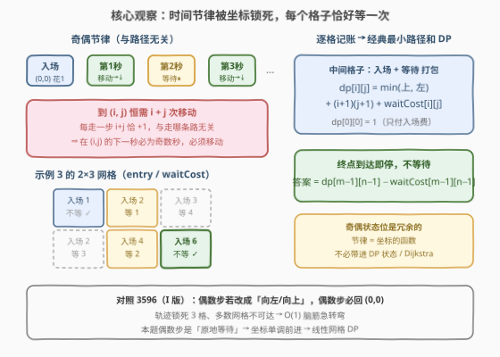
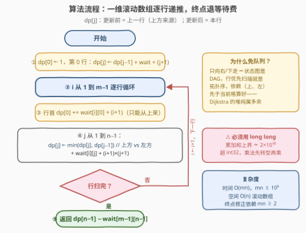

# LeetCode 交替方向的最小路径代价II 题解

## 1. 题目概述

- **标题 / 题号**：交替方向的最小路径代价II（#3603，medium）
- **链接**：https://leetcode.cn/problems/minimum-cost-path-with-alternating-directions-ii/
- **难度**：中等
- **标签**：数组、动态规划、矩阵

**题意**：给你两个整数 `m` 和 `n`，分别表示网格的行数和列数。

- 进入单元格 $(i, j)$ 的**成本**定义为 $(i + 1) \times (j + 1)$；
- 另给你一个二维整数数组 `waitCost`，其中 `waitCost[i][j]` 是在该单元格**等待**的成本；
- 路径始终从**第 1 步**进入单元格 $(0, 0)$ 并支付入场花费开始；
- 每一步都遵循**交替模式**：
  - 在**奇数秒**，必须向**右**或向**下**移动到**相邻**单元格，并支付其进入成本；
  - 在**偶数秒**，必须**原地等待恰好 1 秒**，并支付 `waitCost[i][j]`。

返回到达 $(m - 1, n - 1)$ 的**最小**总成本。

**示例 1**：

```text
输入：m = 1, n = 2, waitCost = [[1,2]]
输出：3
解释：进入 (0, 0) 花费 1；第 1 秒（奇数）向右到 (0, 1)，花费 (0+1)×(1+1) = 2。共 3。
```

**示例 2**：

```text
输入：m = 2, n = 2, waitCost = [[3,5],[2,4]]
输出：9
解释：入场 1 → 第 1 秒下移到 (1,0) 花 2 → 第 2 秒原地等待花 2 → 第 3 秒右移到 (1,1) 花 4。共 9。
```

**示例 3**：

```text
输入：m = 2, n = 3, waitCost = [[6,1,4],[3,2,5]]
输出：16
解释：入场 1 → 右到 (0,1) 花 2 → 等待花 1 → 下到 (1,1) 花 4 → 等待花 2 → 右到 (1,2) 花 6。共 16。
```

**约束**：

- $1 \le m, n \le 10^5$
- $2 \le m \times n \le 10^5$
- $0 \le \text{waitCost}[i][j] \le 10^5$

> 💡 **读题关键**：① 奇数秒**只能移动**、偶数秒**只能等待**——动作类型被时间锁死，唯一的自由度是移动方向选 → 还是 ↓；② 交替节律看似要维护「当前秒数」状态，实则不然——见 2.2 的核心观察；③ $m, n$ 各自可达 $10^5$，但乘积 $\le 10^5$，说明 $O(mn)$ 的网格 DP 刚好放得下；④ 总花费上界约 $2 \times 10^{10}$，C++ 必须用 `long long`。

## 2. 解题思路

### 2.1 暴力思路：带「秒数奇偶」状态的最短路

最直觉的做法是把「当前时刻的奇偶」编进状态，在网格上跑最短路（Dijkstra）或 BFS：

- 状态 $(i, j, \text{parity})$：位于 $(i,j)$，下一秒是奇数秒（须移动）还是偶数秒（须等待）；
- 奇数秒：向右/向下各引一条边，权为目标格入场费 $(i'+1)(j'+1)$；
- 偶数秒：自环一条边（原地等待），权为 $\text{waitCost}[i][j]$。

正确性没有问题，边权非负、Dijkstra 一定能求出最小总花费；$mn \le 10^5$ 时状态数 $2mn$、边数 $O(mn)$，也能通过。但这是**把简单题做重了**：

1. 状态维里塞了一个**冗余**的奇偶位——它其实能从坐标推出来（见 2.2）；
2. 非负边权 + 优先队列，$O(mn \log mn)$，常数和代码量都大；
3. 更重要的是，最短路掩盖了本题真正的结构：**移动只会向右/向下，网格是个 DAG**，按拓扑序（行优先扫描）递推即可，根本不需要队列。

### 2.2 核心观察：时间节律由坐标唯一决定，每个格子恰好等一次



**观察一：到达 $(i,j)$ 恰好需要 $i + j$ 次移动。** 移动只会向右或向下，每次使 $i+j$ 恰好增加 1；从 $(0,0)$ 到 $(i,j)$ 的移动次数与**具体路径无关**，恒等于 $i+j$。

**观察二：秒数节律因此被坐标锁死。** 进入 $(0,0)$ 后，第 1 秒（奇数）是第一次移动；之后「移动、等待」严格交替。于是到达 $(i,j)$ 后的下一秒必是第 $2(i+j)+1$ 秒——**奇数秒，必须移动**。无论走哪条路径，在 $(i,j)$ 上的处境完全相同：**等待紧跟在入场之后发生**，不存在「同一格子有时要等、有时不用等」的分歧。2.1 里那个奇偶状态位，是彻头彻尾的冗余。

**观察三：每个格子恰好付「一次入场费 + 一次等待费」，除了起点和终点。** 逐格记账：

| 格子 | 入场费 $(i+1)(j+1)$ | 等待费 $\text{waitCost}[i][j]$ | 说明 |
|------|---------------------|-------------------------------|------|
| 起点 $(0,0)$ | ✅ 付 | ❌ 不付 | 入场后第 1 秒（奇数）立即出发 |
| 中间格子 | ✅ 付 | ✅ 付 | 入场后下一秒必为偶数秒，等一次 |
| 终点 $(m-1,n-1)$ | ✅ 付 | ❌ 不付 | 到达即停，不再等待 |

**于是整道题塌缩成经典的「最小路径和」**：设 $dp[i][j]$ 为到达 $(i,j)$ 并完成该格等待的最小总花费，则

$$dp[0][0] = 1, \qquad dp[i][j] = \min(dp[i-1][j],\ dp[i][j-1]) + (i+1)(j+1) + \text{waitCost}[i][j]$$

转移里「入账 = 入场费 + 等待费」统一记账；由于终点**不需要**等待，最后统一退掉多记的那笔：

$$\text{答案} = dp[m-1][n-1] - \text{waitCost}[m-1][n-1]$$

> 💡 约束 $m \times n \ge 2$ 保证了终点 $(m-1,n-1) \ne (0,0)$，「终点退等待费」的修正永远合法；若允许 $1 \times 1$ 网格，需特判答案为 $1$（只付入场费，起点即终点）。
>
> ⚠️ **与 3596（I 版）的对照**：I 版的偶数步是「向左/向上移动」，导致轨迹在 3 个格子间振荡、多数网格不可达，是 $O(1)$ 脑筋急转弯；本题把偶数秒改成「原地等待」，振荡消失、坐标单调前进，变成标准 DAG 上的线性 DP——规则一处改动，考点天差地别。

### 2.3 算法流程图



**流程要点**：

| 步骤 | 操作 | 说明 |
|------|------|------|
| ① 初始化 | `dp[0] = 1`（行首重置） | $(0,0)$ 只付入场费 $(0+1)(0+1)=1$ |
| ② 行内首格 | 只能从上方来 | `dp[j] += waitCost[i][j] + (i+1)·1`（无左邻居可选） |
| ③ 通用转移 | `dp[j] = min(dp[j], dp[j-1]) + 入场 + 等待` | `dp[j]`（滚前）= 上方，`dp[j-1]`（滚后）= 左方 |
| ④ 终点修正 | `dp[n-1] -= waitCost[m-1][n-1]` | 到达即停，退掉多记的等待费 |
| ⑤ 返回 | `dp[n-1]` | 用 `long long`，上界约 $2 \times 10^{10}$ |

空间用**一维滚动数组**：`dp[j]` 更新前存的是上一行的值（上方来源），更新后是本行的值；`dp[j-1]` 已更新，天然就是左方来源——两行压一行，$O(n)$ 空间。

### 2.4 示例演算：`m = 2, n = 3, waitCost = [[6,1,4],[3,2,5]]`

按「入场费 + 等待费」记账逐格递推：

| $dp$ 表 | $j=0$ | $j=1$ | $j=2$ |
|---------|-------|-------|-------|
| $i=0$ | $1$（只入场） | $\min(-) + 1 + 2 = 4$ | $4 + 4 + 3 = 11$ |
| $i=1$ | $1 + 3 + 2 = 6$ | $\min(4, 6) + 2 + 4 = 10$ | $\min(11, 10) + 5 + 6 = 21$ |

答案 $= dp[1][2] - \text{waitCost}[1][2] = 21 - 5 = 16$ ✅

最优路径正是示例 3 官方解释的那条：$(0,0) \to (0,1) \to (1,1) \to (1,2)$，花费 $1 + (2+1) + (4+2) + 6 = 16$——每个中间格子的括号正是「入场 + 等待」打包入账。

再验示例 2（$2\times2$，`[[3,5],[2,4]]`）：$dp[0][1] = 1+5+2 = 8$，$dp[1][0] = 1+2+2 = 5$，$dp[1][1] = \min(8,5)+4+4 = 13$，答案 $13-4=9$ ✅。

## 3. 参考代码

### C++

```cpp
class Solution {
public:
    long long minCost(int m, int n, vector<vector<int>>& waitCost) {
        vector<long long> dp(n, 0);
        dp[0] = 1;                                  // (0,0)：只付入场费 1
        for (int j = 1; j < n; j++)                 // 第 0 行：只能从左来
            dp[j] = dp[j - 1] + waitCost[0][j] + (long long)(j + 1);

        for (int i = 1; i < m; i++) {
            dp[0] += waitCost[i][0] + (long long)(i + 1);  // 行首：只能从上来
            for (int j = 1; j < n; j++) {
                dp[j] = min(dp[j], dp[j - 1])               // 上方 vs 左方
                        + waitCost[i][j]
                        + (long long)(i + 1) * (j + 1);     // 入场费
            }
        }
        return dp[n - 1] - waitCost[m - 1][n - 1];  // 终点不等待，退掉多记的
    }
};
```

### Python

```python
class Solution:
    def minCost(self, m: int, n: int, waitCost: List[List[int]]) -> int:
        dp = [0] * n
        dp[0] = 1                                    # (0,0)：只付入场费 1
        for j in range(1, n):                        # 第 0 行：只能从左来
            dp[j] = dp[j - 1] + waitCost[0][j] + (j + 1)

        for i in range(1, m):
            dp[0] += waitCost[i][0] + (i + 1)        # 行首：只能从上来
            for j in range(1, n):
                dp[j] = min(dp[j], dp[j - 1]) + waitCost[i][j] + (i + 1) * (j + 1)

        return dp[n - 1] - waitCost[m - 1][n - 1]    # 终点不等待，退掉多记的
```

> 💡 **写法要点**：
> - 第 0 行的入场费是 $(0+1)(j+1) = j+1$，行首的入场费是 $(i+1)(0+1) = i+1$，均可直接简化，省一次乘法；
> - 转移中 `(i + 1) * (j + 1)` 在 C++ 里先转 `long long` 再乘（此处两者上界 $10^5$，乘积 $\le 10^{10}$ 会溢出 `int`，且 DP 累加和也超 `int`）；Python 无此顾虑；
> - 时间 $O(mn)$、空间 $O(n)$，在 $mn \le 10^5$ 的约束下轻松通过；不开二维数组也顺便规避了「$m$、$n$ 单独可达 $10^5$」带来的直觉性恐慌。

## 4. 复杂度分析

| 维度 | 复杂度 | 说明 |
|------|--------|------|
| **时间** | $O(mn)$ | 每格一次转移（`min` + 加法），网格共 $mn \le 10^5$ 格 |
| **空间** | $O(n)$ | 一维滚动数组；若直接开二维则为 $O(mn)$，本题约束下也放得下 |
| **对照 2.1** | $O(mn \log mn)$ | Dijkstra 版本：状态 $2mn$、堆操作 $\log$ 因子，能过但毫无必要 |

> 💡 DAG 上的 DP 依赖「上、左」两个方向，行优先扫描天然满足拓扑序——这是所有「只能向右/向下走」网格题的通用免队列姿势。

## 5. 扩展：同系列三代题的「规则-算法」对照

「交替方向的最小路径代价」系列目前有三代，同一套入场费 $(i+1)(j+1)$ 皮囊，偶数步规则一变，算法形态整个换挡：

| 题号 | 偶数步规则 | 轨迹结构 | 算法形态 |
|------|-----------|---------|---------|
| 3596（I，中等） | 向**左/向上**移动 | 偶数步必回 $(0,0)$，振荡在 3 格内 | 数学归纳证可达集，$O(1)$ 判定 |
| **3603（II，中等）** | **原地等待并付费** | 坐标单调前进，任意网格可达 | DAG 网格 DP，$O(mn)$ |
| 4003（III，困难） | 移动方向/代价进一步放开 | 图上一般最短路 | Dijkstra + 堆 |

> 💡 **面试启示**：遇到「规则古怪」的路径题，先花两分钟手玩 $2\times2$、$2\times3$ 小样例，问自己三个问题——**坐标还单调吗？时刻奇偶与位置有关吗？每个格子的花费可拆成路径无关的定值吗？** 本题三个问题分别答「是、被锁死、是」，于是最短路塌缩为线性 DP；任何一个答案不同，算法就得换挡（I 版判可达、III 版上堆）。

## 6. 面试要点

**Q1：为什么不需要把「秒数奇偶」编进 DP 状态？**

> 因为到达 $(i,j)$ 的移动次数恒为 $i+j$（每次右移/下移使 $i+j$ 加 1），与路径无关；而动作序列从第 1 秒起「移动、等待」严格交替，所以在 $(i,j)$ 上等待发生的秒数 $2(i+j)+2$ 恒为偶数、下一步移动恒在奇数秒——**奇偶是坐标的函数，不是独立状态**。凡是「能由已有状态维度推导出来的量」都不该进状态，这是 DP 状态设计的第一原则。

**Q2：为什么每个中间格子恰好等待一次，不会等两次或零次？**

> 到达 $(i,j)$ 后的下一秒是偶数秒，必须等待；再下一秒是奇数秒，必须移动离开。奇数秒不允许原地不动、偶数秒不允许移动（题目用「必须」双锁），所以等待次数既不能多也不能少——每个非起终点的格子恰好一次。起点入场后紧接着是奇数秒（立即出发，不等），终点到达即停（不再等）。

**Q3：`dp[m-1][n-1] - waitCost[m-1][n-1]` 这个减法修正，什么时候会出错？**

> 当起点即终点（$m = n = 1$）时：$dp[0][0] = 1$ 只含入场费，终点修正会错误地减掉一笔从未记过的等待费。本题约束 $m \times n \ge 2$ 恰好排除了这一情形；但写通用代码时应心里有数——这是「统一记账、出口修正」技巧的典型边角。

**Q4：为什么本题不用 Dijkstra？什么信号告诉你线性 DP 就够？**

> 两个信号：① **移动方向只有 →/↓**，状态图无环，是 DAG——有 DAG 就有拓扑序，按行优先扫描递推即可，非负权最短路的队列/堆是给「有环或方向任意」的情形准备的；② **边权结构路径无关**（每格费用固定），不像「边权取决于历史」的题必须带附加状态。两者任一不满足（如 III 版放开移动方向），就得回到最短路框架。

**Q5：C++ 实现有哪些溢出/性能坑？**

> ① $(i+1)(j+1) \le mn \le 10^5$ 单项不大，但路径长可达约 $10^5$ 格、累加和上界约 $2\times10^{10}$，`int` 必爆，全程 `long long`（或乘法前显式转换）；② 循环内 `(i + 1) * (j + 1)` 若两个 `int` 先乘后赋值会先按 `int` 溢出再转，必须先转 `long long`；③ $m$、$n$ 单独上界 $10^5$ 容易吓退「开二维数组」的直觉，但约束 $mn \le 10^5$ 才是真实规模——读约束要读全。

> 💡 **一句话总结**：3603 = 观察到「移动次数恒为 $i+j$ ⇒ 时间节律被坐标锁死 ⇒ 每格恰好一次入场+一次等待（起点终点除外）」，于是最短路塌缩成 64 题最小路径和的线性 DP：$dp[i][j] = \min(\text{上},\text{左}) + (i+1)(j+1) + \text{waitCost}[i][j]$，出口减去终点的等待费，$O(mn)$ 时间 / $O(n)$ 空间收工。

## 同类练习题

| # | 题目 | 与本题的关联 |
|---|------|-------------|
| 3596 | [交替方向的最小路径代价I](https://leetcode.cn/problems/minimum-cost-path-with-alternating-directions-i/)（[站内题解](../3501-3600/3596_交替方向的最小路径代价I.md)） | 同一系列的 I 版，偶数步改为左/上移动后轨迹被锁死在 3 格，对照「规则一变，DP 变 O(1) 脑筋急转弯」 |
| 64 | [最小路径和](https://leetcode.cn/problems/minimum-path-sum/)（[站内题解](../0001-0100/64_最小路径和.md)） | 本题塌缩后的原型——只能右/下走的网格最小路径 DP，滚动数组写法的鼻祖 |
| 2304 | [网格中的最小路径代价](https://leetcode.cn/problems/minimum-path-cost-in-a-grid/)（[站内题解](../2301-2400/2304_网格中的最小路径代价.md)） | 网格路径 DP 但行间转移代价查表，训练「转移不再是简单 min」的泛化版 |
| 931 | [下降路径最小和](https://leetcode.cn/problems/minimum-falling-path-sum/)（[站内题解](../0901-1000/931_下降路径最小和.md)） | 方向集换成「下/左下/右下」，同样是 DAG 拓扑序线性递推的变奏 |
| 4003 | [交替方向的最小路径代价III](https://leetcode.cn/problems/minimum-cost-path-with-alternating-directions-iii/) | 系列 III 版（困难），规则放开到一般图最短路，体会「何时必须从 DP 换挡到 Dijkstra」 |
