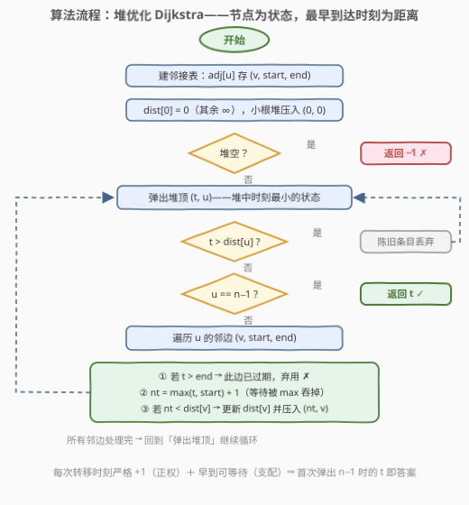
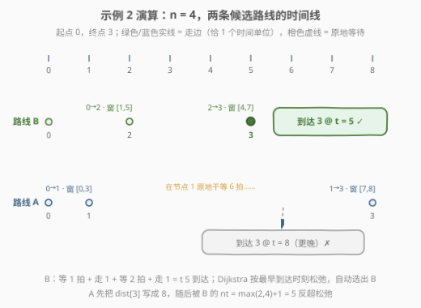

# LeetCode 有向图中到达终点的最少时间 题解

## 1. 题目概述

- **标题 / 题号**：有向图中到达终点的最少时间（#3604，medium）
- **链接**：https://leetcode.cn/problems/minimum-time-to-reach-destination-in-directed-graph/
- **难度**：中等
- **标签**：图、最短路、Dijkstra、堆（优先队列）、时间窗

**题意**：给定 $n$ 个节点（编号 $0 \sim n-1$）的**有向图**，边由 `edges[i] = [u_i, v_i, start_i, end_i]` 表示——从 $u_i$ 到 $v_i$ 的一条有向边，**只能**在满足 $start_i \le t \le end_i$ 的整数时刻 $t$ **出发**使用。

你从**时刻 0 位于节点 0**。每个时间单位内，你可以：

- **原地等待**（停留在当前节点不动）；或
- 若当前时刻 $t$ 满足某条出边的 $start_i \le t \le end_i$，**沿该边移动**，花费 1 个时间单位（时刻 $t$ 出发、$t+1$ 到达）。

返回到达节点 $n-1$ 的**最小时刻**；无法到达返回 $-1$。

**示例 1**：

```text
输入：n = 3, edges = [[0,1,0,1],[1,2,2,5]]
输出：3
解释：t=0 走边 0→1（窗 [0,1]），t=1 到达节点 1；等到 t=2 走边 1→2（窗 [2,5]），
     t=3 到达节点 2。
```

**示例 2**：

```text
输入：n = 4, edges = [[0,1,0,3],[1,3,7,8],[0,2,1,5],[2,3,4,7]]
输出：5
解释：在 0 号点等到 t=1 走边 0→2（窗 [1,5]），t=2 到达节点 2；
     等到 t=4 走边 2→3（窗 [4,7]），t=5 到达节点 3。
     （对比路线 0→1→3：要干等到 t=7 才能走 1→3，t=8 才到。）
```

**示例 3**：

```text
输入：n = 3, edges = [[1,0,1,3],[1,2,3,5]]
输出：-1
解释：节点 0 没有任何出边，出发即被困死。
```

**约束**：

- $1 \le n \le 10^5$
- $0 \le \text{edges.length} \le 10^5$
- $0 \le u_i, v_i \le n-1$ 且 $u_i \ne v_i$
- $0 \le start_i \le end_i \le 10^9$

> 💡 **审题关键**：① 窗口约束的是**出发时刻**而非到达时刻——只要求 $start \le t \le end$，**不要求** $t+1 \le end$（窗 [0,1] 的边在 $t=1$ 出发、$t=2$ 到达依然合法）；② **等待不花钱也不设上限**，可以停在任意节点任意久；③ $n = 1$ 时起点即终点，答案为 0；④ 时间上限 $10^9$，一切「逐时刻模拟」的思路直接出局。

## 2. 解题思路

### 2.1 暴力思路：逐时刻模拟 BFS / 暴力枚举路径

**暴力一：按时间步推进的 BFS。** 把 $(node, time)$ 当状态，从 $(0, 0)$ 开始每个时间单位扩展「等待」与「所有窗口覆盖当前时刻的出边」，首次碰到 $node = n-1$ 的时刻即答案。

问题：时刻上限 $10^9$，状态数最坏 $n \times T = 10^{14}$ 量级——**时间维度爆炸**，且其中绝大多数是原地踏步的「等待」状态，纯属浪费。

**暴力二：DFS 枚举所有 $0 \to n-1$ 的路径。** 路径条数是指数级的，且每条路径的总耗时还依赖沿途的等待策略，复杂度更不可控。

> ⚠️ 两种暴力的共同病灶：把「等待」当成**显式的状态转移**去逐拍模拟。突破口是发现等待是**免费的、可以任意久**的——这恰好让「更早到达一个节点」成为严格不亏的优势，从而把整个时间维度折叠掉。

### 2.2 核心观察：等待合法 ⇒ 「早到不亏」⇒ 最早到达时刻当距离跑 Dijkstra

![核心观察：边只在窗口 [start, end] 内可出发；早到可等待，过期无药可救](../images/p3604_time_window_concept.svg)

**观察一（转移规则三分支）**：在节点 $u$、当前时刻 $t$，看一条邻边 $(u \to v,\ s,\ e)$：

| 当前时刻 | 能否使用 | 到达 $v$ 的时刻 |
|----------|----------|-----------------|
| $t < s$ | ✅ 等到 $s$ 再出发 | $s + 1$ |
| $s \le t \le e$ | ✅ 立即出发 | $t + 1$ |
| $t > e$ | ❌ 窗口已关，弃用 | —— |

前两种情形合并成一行公式（条件 $t \le e$）：

$$nt = \max(t,\ s) + 1$$

**等待被 `max` 一口吞掉**，根本不需要逐秒模拟。

**观察二（支配性——为什么只记最早时刻就够）**：等待任意久都合法，于是「更早到达节点 $v$」**严格不亏**：设两个方案分别于 $t_1 \le t_2$ 到达 $v$，任何从 $t_2$ 出发的可行后续，从 $t_1$ 出发只需原地多等 $t_2 - t_1$ 拍即可复刻，且之后每一步的到达时刻都不会更晚（$\max$ 关于 $t$ 单调不减）。因此每个节点**只需记录最早到达时刻** $dist[v]$，时间维度整个坍缩掉，状态数回到 $O(n)$。

**观察三（正权——Dijkstra 的贪心合法）**：每次转移 $nt = \max(t, s) + 1 \ge t + 1 > t$，**时刻严格递增**，等价于边权恒正的最短路。小根堆按时刻升序弹出，经典 Dijkstra 的「首次弹出即最优」不变式原封不动成立。

> 💡 本质上这是**时间依赖最短路**（time-dependent shortest path）：同一条边在不同时刻「生效的代价」不同。但本题的到达函数 $f(t) = \max(t, s) + 1$ 关于出发时刻 $t$ **单调不减**，满足 **FIFO 性质**（先出发不会更晚到），所以 Dijkstra 依然正确。若到达函数可以「晚出发、早到达」（非 FIFO），Dijkstra 的贪心就会被反例击穿，需要退回 Bellman-Ford / 标签算法——本题不用担心。

### 2.3 算法流程图



**文字版步骤**：

| 步骤 | 操作 | 说明 |
|------|------|------|
| ① 建图 | `adj[u].push_back({v, s, e})` | 邻接表存边及窗口 |
| ② 初始化 | `dist[0] = 0`，堆压 `(0, 0)` | 其余 `dist = ∞` |
| ③ 弹堆顶 | 取 `(t, u)`，时刻最小者优先 | `t > dist[u]` 为陈旧条目，跳过 |
| ④ 终点判定 | `u == n-1` 直接返回 `t` | 首次弹出即最优（时刻严格递增） |
| ⑤ 遍历邻边 | 对每条 `(v, s, e)` | —— |
| ⑥ 窗口检查 | `t > e` → 弃用 | 过期边无法通过等待挽回 |
| ⑦ 松弛 | `nt = max(t, s) + 1` | 更小才更新 `dist[v]` 并入堆 |
| ⑧ 堆空 | 返回 `-1` | 起点所在连通块够不到终点 |

### 2.4 示例演算：示例 2 的两条路线



以示例 2（$n=4$）走查两条候选路线：

| 路线 | 逐步时刻 | 到达时刻 |
|------|----------|----------|
| **B：0 → 2 → 3** | 0 号点等到 $t=1$ 出发（窗 [1,5]）→ $t=2$ 到 2；等到 $t=4$ 出发（窗 [4,7]）→ $t=5$ 到 3 | **5** ✅ |
| A：0 → 1 → 3 | $t=0$ 出发（窗 [0,3]）→ $t=1$ 到 1；边 1→3 的窗是 [7,8]，只能干等到 $t=7$ 出发 → $t=8$ 到 3 | 8 ❌ |

Dijkstra 的执行轨迹：弹 `(0, 0)` → 松弛得 `dist[1] = 1`（边 0→1）、`dist[2] = 2`（边 0→2，等待被 `max` 吞掉）→ 弹 `(1, 1)`：边 1→3 窗 [7,8] 未过期，`nt = max(1, 7) + 1 = 8`，`dist[3] = 8` → 弹 `(2, 2)`：边 2→3 窗 [4,7]，`nt = max(2, 4) + 1 = 5 < 8`，**松弛成功**，`dist[3] = 5` → 弹 `(5, 3)`：$u = n-1$，**返回 5**（堆里残留的 `(8, 3)` 成为陈旧条目，永远躺在堆底）。

> 💡 注意 `dist[3]` 先被「看起来更近」的路线 A 写成 8，随后被路线 B 反超成 5——这正是松弛必须持续进行、以及弹出时必须判 `t > dist[u]` 丢陈旧条目的原因。

## 3. 参考代码

### C++

```cpp
class Solution {
public:
    int minTime(int n, vector<vector<int>>& edges) {
        vector<vector<array<int, 3>>> adj(n);
        for (auto& e : edges) {
            adj[e[0]].push_back({e[1], e[2], e[3]});  // (v, start, end)
        }

        const int INF = INT_MAX;
        vector<int> dist(n, INF);
        dist[0] = 0;
        priority_queue<pair<int, int>, vector<pair<int, int>>, greater<>> pq;
        pq.emplace(0, 0);

        while (!pq.empty()) {
            auto [t, u] = pq.top();
            pq.pop();
            if (t > dist[u]) continue;   // 陈旧条目
            if (u == n - 1) return t;    // 首次弹出即最优
            for (auto& [v, s, e] : adj[u]) {
                if (t > e) continue;     // 窗口已关，弃用
                int nt = max(t, s) + 1;  // 等待被 max 隐式完成
                if (nt < dist[v]) {
                    dist[v] = nt;
                    pq.emplace(nt, v);
                }
            }
        }
        return -1;
    }
};
```

> 💡 **写法要点**：
> - `int` 足够：入堆的每个 `nt ≤ e + 1 ≤ 10^9 + 1 < INT_MAX`（用边前先判了 `t ≤ e`，且恒有 `s ≤ e`），不存在溢出路径。
> - 结构化绑定 `auto& [v, s, e]` 需 C++17；邻接表用 `array<int, 3>` 比 `vector<int>` 更省内存。
> - `n == 1` 时首次弹出 `(0, 0)` 即命中 `u == n - 1` 返回 0，无需特判；节点 0 无出边时堆自然弹空返回 `-1`（示例 3）。

### Python

```python
from heapq import heappush, heappop

class Solution:
    def minTime(self, n: int, edges: List[List[int]]) -> int:
        adj = [[] for _ in range(n)]
        for u, v, s, e in edges:
            adj[u].append((v, s, e))

        INF = float("inf")
        dist = [INF] * n
        dist[0] = 0
        pq = [(0, 0)]  # (到达时刻, 节点)

        while pq:
            t, u = heappop(pq)
            if t > dist[u]:
                continue
            if u == n - 1:
                return t
            for v, s, e in adj[u]:
                if t > e:
                    continue
                nt = max(t, s) + 1
                if nt < dist[v]:
                    dist[v] = nt
                    heappush(pq, (nt, v))
        return -1
```

## 4. 复杂度分析

| 维度 | 复杂度 | 说明 |
|------|--------|------|
| **时间复杂度** | $O((n + m) \log n)$ | 堆优化 Dijkstra 标准界：每条边至多触发一次成功松弛入堆，每次堆操作 $O(\log)$；$m$ 为边数 |
| **空间复杂度** | $O(n + m)$ | 邻接表 $O(m)$ + `dist` 数组 $O(n)$ + 堆 $O(m)$ |

> - 懒删除写法下堆中可能残留陈旧条目，堆大小上界 $O(m)$，不影响渐近界；陈旧条目在弹出时被 `t > dist[u]` 一行拦截，不参与邻边扫描。
> - 时间值域 $10^9$ 只影响整数的位数，不影响复杂度——**把时间维度折叠进 `max`** 正是本题解法的全部意义。

## 5. 扩展：等待合法性与 FIFO 性质的边界

**变体一：禁止等待（每个时间单位必须移动）会怎样？** 「早到不亏」的支配性立刻崩塌——早到 $v$ 反而可能错过「到达瞬间恰好开着」的边，不同到达时刻之间**不可比较**。此时只能把 $(node, time)$ 当显式状态做 BFS，时间维度无法折叠。这从反面说明：**本题能一行 `max` 解决，全靠「等待免费」这个设定**。

**变体二：窗口周期性开闭的边**（如 [2045. 到达目的地的第二短时间](https://leetcode.cn/problems/second-minimum-time-to-reach-destination/)：边随信号灯周期通行）。等待同样合法、FIFO 同样成立，仍可用最短路框架，只是「时刻 $t$ 能否出发」的判定换成周期公式。本题的骨架（状态 = 节点、距离 = 最早到达时刻、转移 = 窗口判定 + `max` 折叠）对整族「时间窗最短路」问题通用。

**变体三：非 FIFO 的时间依赖边**——若允许「晚出发反而早到」（例如边上有随时间变化的加速），$\max$ 式单调性被破坏，Dijkstra 的贪心失效，需退化为 Bellman-Ford 或对每个节点维护互不支配的标签集合（label-correcting）。判断标准就一条：**到达函数关于出发时刻是否单调不减**。

## 6. 面试要点

**Q1：边权明明依赖出发时刻，为什么还能用 Dijkstra？**

> 两个性质兜底：① **FIFO/单调性**——等待合法使得到达函数 $nt = \max(t, s) + 1$ 关于出发时刻单调不减，早到者不会被晚到者反超；② **正权**——每次转移时刻严格 $+1$，等价于正边权。两者合起来，「首次弹出即最优」的 Dijkstra 不变式完整保留。

**Q2：`max(t, start) + 1` 里的 `max` 是在干什么？**

> 把「等到窗口开门再走」隐式完成：到达早于 `start` 就等到 `start` 出发；到达已在窗内就立即出发。一行代码替代了逐秒模拟等待的整个循环，也是把 $10^9$ 的时间维度折叠掉的支点。

**Q3：为什么首次弹出 `n-1` 就能 `return t`，不怕后面有更优解？**

> 堆按时刻升序弹出，且任何转移都使时刻严格增加——堆中剩余状态的时刻都不小于当前 `t`，未来不可能再产生更小的 `dist[n-1]`。这是 Dijkstra 的标准提前终止优化，可省掉终点之后的所有无关松弛。

**Q4：窗口判断写成 `t < end` 或 `t + 1 <= end` 会怎样？**

> 都是错的。窗口约束的是**出发时刻**的**闭区间** $[start, end]$：`t < end` 漏掉恰在 `end` 时刻出发的合法转移；`t + 1 <= end` 则误杀「出发在窗内、到达越过 `end`」的合法转移（窗 [0,1] 的边在 $t=1$ 出发、$t=2$ 到达是合法的）。正确写法就是 `t <= end`（代码里等价于「`t > end` 才弃用」）。

**Q5：和 743 网络延迟时间相比，本题多了什么？**

> 743 是**静态边权**的单源最短路；本题是**时间依赖**最短路——同一条边在不同时刻的生效代价不同（早到要等、过期直接作废）。框架仍是 Dijkstra，新增处理只有两步：过期判断 `t > e` 与等待折叠 `max(t, s) + 1`。把额外维度编进状态的 Dijkstra（如本仓库 3594 渡河问题把阶段/船位编进状态）是同一套路的高级形态。

## 同类练习题

| # | 题目 | 与本题的关联 |
|---|------|-------------|
| 743 | [网络延迟时间](https://leetcode.cn/problems/network-delay-time/) | 堆优化 Dijkstra 的静态边权模板，本题的基础形态 |
| 2045 | [到达目的地的第二短时间](https://leetcode.cn/problems/second-minimum-time-to-reach-destination/) | 边按周期开闭（信号灯），同样要判断「时刻 t 能否出发」，BFS 维护第一/第二短距离 |
| 1928 | [规定时间内到达终点的最小花费](https://leetcode.cn/problems/minimum-cost-to-reach-destination-in-time/) | 时间从「目标」变成「约束维度」，对照体会两种建模的差异 |
| 882 | [细分图中的可到达结点](https://leetcode.cn/problems/reachable-nodes-in-subdivided-graph/) | Dijkstra 状态与松弛设计的变体练习 |
| 787 | [K 站中转内最便宜的航班](https://leetcode.cn/problems/cheapest-flights-within-k-stops/) | 约束进状态的限制松弛（Bellman-Ford），与本题「约束进转移」互为镜像 |
