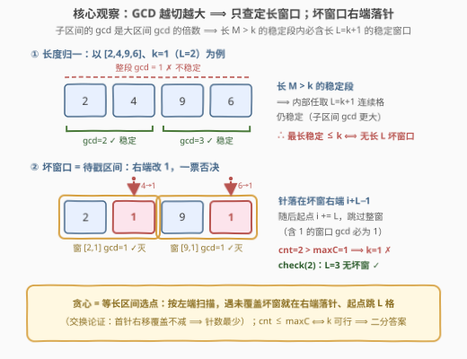
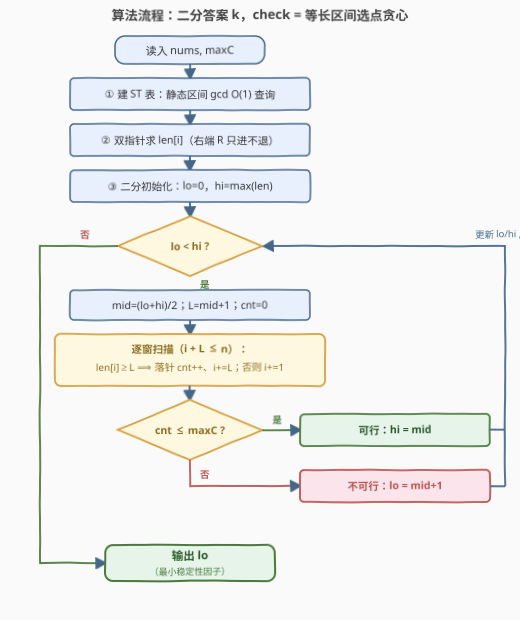

# LeetCode 数组的最小稳定性因子 题解

## 1. 题目概述

- **标题 / 题号**：数组的最小稳定性因子（#3605，hard）
- **链接**：https://leetcode.cn/problems/minimum-stability-factor-of-array/
- **难度**：困难
- **标签**：贪心、ST 表（稀疏表）、区间 GCD、二分查找、数论

**题意**：给定整数数组 `nums` 和整数 `maxC`。

- 若一个**子数组**所有元素的最大公因数（GCD，题面写作 HCF）**≥ 2**，称该子数组是**稳定**的；特别地，长度为 1 的子数组 `[x]` 在 $x \ge 2$ 时稳定（$\gcd([x]) = x$）。
- 数组的**稳定性因子** = **最长**稳定子数组的长度。
- 你**最多**可以把 `maxC` 个元素修改为**任意整数**，求修改后稳定性因子的**最小**可能值；若无稳定子数组则返回 `0`。

**示例 1**：

```text
输入：nums = [3,5,10], maxC = 1
输出：1
解释：[5,10] 的 gcd = 5，稳定性因子为 2；把 5 改成 7 后无长度 >1 的稳定子数组，
      但单个元素 3（或 10）仍是长度 1 的稳定子数组，故答案为 1。
```

**示例 2**：

```text
输入：nums = [2,6,8], maxC = 2
输出：1
解释：整段 gcd = 2，稳定性因子为 3；修改两处后无长度 >1 的稳定子数组，答案为 1。
```

**示例 3**：

```text
输入：nums = [2,4,9,6], maxC = 1
输出：2
解释：[2,4] 的 gcd = 2、[9,6] 的 gcd = 3，是两个不相交的稳定子数组；
      只允许修改 1 处，必然顾此失彼，稳定性因子无法压到 1 以下。
```

**约束**：

- $1 \le n = \text{nums.length} \le 10^5$
- $1 \le \text{nums}[i] \le 10^9$
- $0 \le \text{maxC} \le n$

> 💡 **审题关键**：① 单个元素 $x \ge 2$ 自己就是稳定子数组——**答案为 0 ⟺ 所有 ≥ 2 的元素都被改成 1**（本题 `nums[i] ≥ 1`，故「非稳定」的单元素只能是 1）；② 修改可以改成**任意整数**，而 $\gcd(x,1)=1$，改成 1 对任何包含它的窗口都是「一票否决」，是破坏稳定性的最优选择；③ GCD 具有「**越扩越小、越切越大**」的单调性（下文观察一），这是把「任意长度」归一成「定长窗口」的钥匙。

## 2. 解题思路

### 2.1 暴力思路：枚举修改集合

最直白的做法：枚举所有大小 $\le \text{maxC}$ 的修改位置集合（改成 1 即可，见观察二），对每个得到的数组用 $O(n^2)$（或 $O(n\log n)$）求最长稳定子数组，取最小值。组合数 $\binom{n}{\le \text{maxC}}$ 是指数级，直接爆炸。

退一步，即使想到了「二分答案 $k$、检查能否让最长稳定 $\le k$」，朴素 check 也要对每个长度 $L=k+1$ 的窗口现算 GCD，单次 $O(L\log V)$，总体仍是 $O(nL\log V)$——$L$ 可达 $10^5$，无法承受。

> ⚠️ 瓶颈有两个：**任意长度的稳定段难以枚举**、**窗口 GCD 重复计算**。突破口是三连观察：GCD 单调性把长度归一、改 1 把问题变成区间选点、贪心把选点做成线性扫描。

### 2.2 核心观察：二分答案 + 预处理 `len[i]` + 贪心戳窗



**观察一（GCD 的双重单调性：长度归一）**。GCD 满足两条单向性：

$$\underbrace{\gcd(a_i,\dots,a_j) \mid \gcd(a_i,\dots,a_{j-1})}_{\text{右端扩展：越长越小，一旦为 1 永远为 1}} \qquad\qquad \underbrace{[l,r]\subseteq[l',r'] \Rightarrow \gcd(a_l,\dots,a_r) \ge \gcd(a_{l'},\dots,a_{r'})}_{\text{子区间的 gcd 是大区间 gcd 的倍数：越切越大}}$$

由第二条：**长度 $M > k$ 的稳定子数组，其内部任意连续 $k+1$ 格也是稳定的**（子区间 gcd ≥ 整段 gcd ≥ 2）。于是

$$\boxed{\text{最长稳定子数组} \le k \iff \text{不存在长度恰为 } L = k+1 \text{ 的稳定窗口}}$$

「任意长度」被归一成「**定长 $L$ 的坏窗口**」——这就是 hint 里 *Binary-search the target length* 与 *fast range-GCD queries* 的由来。

**观察二（改成 1 一票否决）**。$\gcd(x, 1) = 1$：把某个位置改成 1，**所有包含它的窗口 GCD 立即塌成 1**。改成任何其他值 $v$：包含它的窗口 gcd 是 $v$ 的约数，未必能杀掉（如把 4 改成 8，$\gcd(2,8)=2$ 依旧稳定）。因此**每个被修改的位置都应改成 1**，且「修改后窗口不稳定 ⟺ 原窗口 gcd ≥ 2 且窗口内没有改成 1 的位置」。

**观察三（可行性单调 ⟹ 二分答案）**。「最长稳定 $\le k$」的要求随 $k$ 增大而**变弱**：若某组修改能让最长稳定 $\le k$，同一组修改当然也让它 $\le k+1$。可行性关于 $k$ 单调，故可**二分最小可行 $k$**，答案上界取 $\max_i \text{len}[i]$（一个元素都不改时的答案）。

**观察四（坏窗口 = 待戳区间，右端落针最优）**。记 $L = k+1$。check($k$) 等价于：给所有**坏窗口** $\{[i,\, i+L-1] : \gcd \ge 2\}$ 中的每一个都安排至少一根「针」（被改成 1 的位置）。这是经典**区间选点**问题，且所有区间等长。贪心策略：

> 从左到右扫描起点 $i$，遇到**未被针覆盖**的坏窗口，就把针落在它的**右端点** $i+L-1$，随后起点直接跳到 $i+L$（起点在 $(i,\, i+L-1]$ 的窗口都含这根针，自动安全）。

**交换论证**：设最优解为第一个坏窗口 $[i, i+L-1]$ 安排的针在位置 $p \le i+L-1$。对任何后续坏窗口 $[j, j+L-1]$（$j > i$），若它含 $p$（$j \le p$），则由 $p \le i+L-1$ 得 $j \le i+L-1$，它同样含贪心针 $i+L-1$——**把 $p$ 换成 $i+L-1$ 覆盖范围不缩**。归纳可知贪心针数最少。

还有一个隐藏细节：**跳转保证历史针永远在当前窗口左侧**（每根针落在所处理窗口的右端，之后起点至少跳过它），所以对未跳过的起点直接用**原始**数组的 gcd 判「坏」即可，无需模拟改值。

**观察五（`len[i]` 双指针预处理）**。定义 $\text{len}[i]$ = 以 $i$ 开头的最长稳定子数组长度。由观察一，稳定段右端点 $R[i] = i + \text{len}[i] - 1$ 关于 $i$ **单调不减**（$[i-1..j]$ 稳定 $\Rightarrow$ $[i..j]$ 稳定），于是**双指针**一遍扫出全部 $\text{len}[i]$，每步用 **ST 表**做 $O(1)$（一次 gcd，$O(\log V)$）区间查询。此后坏窗口判定降为 $O(1)$：$\text{len}[i] \ge L$。

### 2.3 算法流程图



**逻辑执行步骤**：

| 步骤 | 操作 | 作用 |
|------|------|------|
| ① 建 ST 表 | `sp[k][i] = gcd(sp[k-1][i], sp[k-1][i+2^{k-1}])` | gcd 满足**可重复贡献**（幂等），静态区间 GCD 免递归 $O(1)$ 查询 |
| ② 双指针 | 维护右端 $r$（只前进不后退），扩窗判 `rangeGcd(i, r+1) ≥ 2` | 得 `len[i]`：以 $i$ 开头的最长稳定段，坏窗口判定变 $O(1)$ |
| ③ 二分 | `lo=0, hi=max(len)`，`mid=(lo+hi)/2` | 可行性关于 $k$ 单调，收敛到最小可行 $k$ |
| ④ check(k) | `L=k+1`，扫 $i$：`len[i] ≥ L` 则右端落针 `cnt++`、`i += L`，否则 `i++` | 等长区间选点贪心，`cnt` = 消灭所有坏窗口的最少修改数 |
| ⑤ 收敛 | `cnt ≤ maxC` → `hi=mid`；否则 `lo=mid+1` | 循环至 `lo == hi`，输出 `lo` |

> ⚠️ 顺序很重要：**先预处理 `len`，再二分**。check 内层绝不能重新计算窗口 gcd——否则一次 check 就退化到 $O(nL)$，二分加持也无力回天。

### 2.4 示例演算：`nums = [2,4,9,6]`, `maxC = 1`

**第一步：求 `len[i]`**（以 $i$ 开头的最长稳定段）：

| $i$ | 开头元素 | 稳定段 | $\text{len}[i]$ |
|-----|---------|--------|-----------------|
| 0 | 2 | $[2,4]$（gcd=2；再吞 9 变 1） | 2 |
| 1 | 4 | $[4]$（$\gcd(4,9)=1$） | 1 |
| 2 | 9 | $[9,6]$（gcd=3） | 2 |
| 3 | 6 | $[6]$ | 1 |

$\max \text{len} = 2$，二分区间 $[0, 2]$。

**第二步：check(1)**（$L=2$）：

| 起点 $i$ | 窗口 | 判定 | 动作 | `cnt` |
|----------|------|------|------|-------|
| 0 | $[2,4]$ | $\text{len}[0]=2 \ge 2$，坏 | 针落在位置 1（$4 \to 1$），$i \to 2$ | 1 |
| 2 | $[9,6]$ | $\text{len}[2]=2 \ge 2$，坏 | 再来一针（$6 \to 1$），$i \to 4$ | **2 > maxC** ✗ |

$k=1$ **不可行**：两根针是刚需（$[2,4]$ 与 $[9,6]$ 位置不相交，一根针无法同时覆盖）——这正是示例 3 解释所说「两个独立的稳定子数组，无法同时压制」。

**第三步：check(2)**（$L=3$）：所有 $\text{len}[i] < 3$，无坏窗口，`cnt = 0` ✓。二分收敛，**答案 2**。

> 💡 顺带看 check(0)（$L=1$）：坏窗口就是每个 $\ge 2$ 的单元素，共 4 个 $> \text{maxC}=1$ ✗——「答案为 0 ⟺ $\#\{i : \text{nums}[i] \ge 2\} \le \text{maxC}$」被统一框架自然涵盖，无需特判。

## 3. 参考代码

### C++

```cpp
class Solution {
public:
    int minStable(vector<int>& nums, int maxC) {
        int n = nums.size();

        // ① ST 表：gcd 可重复贡献（幂等），静态区间 GCD O(1) 查询
        int LOG = 1;
        while ((1 << LOG) <= n) LOG++;
        vector<vector<int>> sp(LOG);
        sp[0] = nums;
        for (int k = 1; k < LOG; k++) {
            int half = 1 << (k - 1), m = n - (1 << k) + 1;
            sp[k].resize(m);
            for (int i = 0; i < m; i++)
                sp[k][i] = __gcd(sp[k - 1][i], sp[k - 1][i + half]);
        }
        auto rangeGcd = [&](int l, int r) {          // gcd(nums[l..r])
            int k = 31 - __builtin_clz(r - l + 1);
            return __gcd(sp[k][l], sp[k][r - (1 << k) + 1]);
        };

        // ② 双指针求 len[i]：R[i] 单调不减，右端 r 只前进
        vector<int> len(n);
        int r = -1;
        for (int i = 0; i < n; i++) {
            if (r < i - 1) r = i - 1;
            while (r + 1 < n && rangeGcd(i, r + 1) >= 2) r++;
            len[i] = r - i + 1;
        }
        int maxLen = *max_element(len.begin(), len.end());

        // ③ check(k)：每个长度 L=k+1 的坏窗口内部都要有一根针
        auto feasible = [&](int k) -> bool {
            int L = k + 1, cnt = 0, i = 0;
            while (i + L <= n) {
                if (len[i] >= L) {                   // 坏窗口：右端落针，起点跳 L 格
                    if (++cnt > maxC) return false;
                    i += L;
                } else {
                    i++;
                }
            }
            return true;
        };

        // ④ 可行性随 k 单调 ⟹ 二分最小可行 k
        int lo = 0, hi = maxLen;
        while (lo < hi) {
            int mid = (lo + hi) >> 1;
            if (feasible(mid)) hi = mid;
            else lo = mid + 1;
        }
        return lo;
    }
};
```

### Python

```python
from math import gcd

class Solution:
    def minStable(self, nums: List[int], maxC: int) -> int:
        n = len(nums)

        # ① ST 表：gcd 可重复贡献（幂等），静态区间 GCD O(1) 查询
        sp = [nums[:]]
        k = 1
        while (1 << k) <= n:
            half = 1 << (k - 1)
            prev = sp[-1]
            sp.append([gcd(prev[i], prev[i + half])
                       for i in range(n - (1 << k) + 1)])
            k += 1

        def range_gcd(l, r):                         # gcd(nums[l..r])
            k = (r - l + 1).bit_length() - 1
            return gcd(sp[k][l], sp[k][r - (1 << k) + 1])

        # ② 双指针求 len[i]：R[i] 单调不减，右端 r 只前进
        length = [0] * n
        r = -1
        for i in range(n):
            if r < i - 1:
                r = i - 1
            while r + 1 < n and range_gcd(i, r + 1) >= 2:
                r += 1
            length[i] = r - i + 1

        # ③ check(k)：每个长度 L=k+1 的坏窗口内部都要有一根针
        def feasible(k: int) -> bool:
            L = k + 1
            cnt = i = 0
            while i + L <= n:
                if length[i] >= L:                   # 坏窗口：右端落针，起点跳 L 格
                    cnt += 1
                    if cnt > maxC:
                        return False
                    i += L
                else:
                    i += 1
            return True

        # ④ 可行性随 k 单调 ⟹ 二分最小可行 k
        lo, hi = 0, max(length)
        while lo < hi:
            mid = (lo + hi) // 2
            if feasible(mid):
                hi = mid
            else:
                lo = mid + 1
        return lo
```

> 💡 **写法要点**：
> - ST 表第 $k$ 层长度为 $n - 2^k + 1$，越界访问是新手重灾区；查询取 $k = \lfloor \log_2(r-l+1) \rfloor$，两段**可重叠**拼出 $[l, r]$——gcd 幂等（$\gcd(x,x)=x$），重叠无害，这正是选 ST 表而非前缀结构的原因（前缀 gcd 只能删头、不能拼任意区间）。
> - 双指针里 `if r < i - 1: r = i - 1` 处理前一位 `len` 为 0（开头元素是 1）的断裂；由于 $R[i]$ 单调不减，`r` 全程只前进，总扩展次数 $O(n)$。
> - check 中 `i += L` 与 `i += 1` 混合：好窗口逐格推进、坏窗口落针后整窗跳过，单次 check 均摊 $O(n)$。
> - 二分上界用 `max(length)` 而非 `n`：一个不改时的答案就是它，天然是可行上界（`max(length)=0` 时直接返回 0）。

## 4. 复杂度分析

| 维度 | 复杂度 | 说明 |
|------|--------|------|
| **时间：ST 表构建** | $O(n \log n \cdot \log V)$ | 共 $\sum_k (n - 2^k + 1) \approx n\log n$ 个格子，每格一次 gcd（$V = \max \text{nums}[i] \le 10^9$） |
| **时间：双指针求 `len`** | $O(n \log V)$ | $r$ 只前进，$O(n)$ 次区间查询，每次一次 gcd |
| **时间：二分 + check** | $O(n \log n)$ | $O(\log n)$ 次 check，每次均摊 $O(n)$ 纯扫描 |
| **总时间** | $O(n \log n (\log V + 1))$ | $n = 10^5$ 时约 $5 \times 10^7$ 量级基本运算，实测 C++ ≈ 15ms、Python ≈ 0.2s |
| **空间** | $O(n \log n)$ | ST 表主体；`len` 数组 $O(n)$ |

> - gcd 的 $\log V$ 在实践中远好于理论上界（欧几里得算法平均迭代次数远小于最坏值），且 ST 表上层的 gcd 输入已高度「约化」，实测常数很小。
> - 若追求 $O(n \log V)$ 空间，可改用「从右往左维护 gcd 值列表」求 `len`（见第 5 节），但 ST 表代码更短、与「区间 GCD 查询」的题面 hint 直接对应。

## 5. 扩展：`len[i]` 的另一种求法与在线化

**方法 B：gcd 值列表（空间 $O(n)$）**。从右往左扫，维护列表 `cur = [(g, j), ...]`：$g$ 是 $\gcd(\text{nums}[i..j])$ 的**不同取值**、$j$ 是该取值最后一次出现的右端点。转移为 $g' = \gcd(\text{nums}[i], g)$ 去重。由于每次合并要么不变、至少**除以 2**，列表长度 $O(\log V)$。列表中 gcd 值严格递减且最多末尾一个 1，于是 $\text{len}[i]$ = 最后一个 $g \ge 2$ 表项的 $j - i + 1$。这是 [898. 子数组按位或操作](https://leetcode.cn/problems/bitwise-ors-of-subarrays/) 的 gcd 版，总时间 $O(n \log V)$、空间 $O(n)$，代价是逻辑比 ST 表绕。

**在线化：线段树。** 本题所有查询发生在「静态数组」上，ST 表最优；若变体要求**边修改边查询**（如「单点赋值后询问当前稳定性因子」），改用维护区间 gcd 的**线段树**：单点更新 $O(\log n \cdot \log V)$、查询同理，`len` 则改为对每个 $i$ 在线二分右端。

**对偶问题**：若把「改成 1 破坏稳定」换成「改成任意 $\ge 2$ 的数**制造**稳定」、求最长稳定子数组的**最大**值，贪心与二分双双失效——需要枚举素因子并做区间合并，复杂度与思路都完全不同，可作为对照思考题。

## 6. 面试要点

**Q1：为什么答案可以二分？**

> 「最长稳定子数组 $\le k$」这一要求随 $k$ 增大单调变弱：能让最长稳定 $\le k$ 的修改方案必然也让它 $\le k+1$。可行性单调 ⟹ 经典二分最小可行值。上界取 $\max_i \text{len}[i]$（零修改时的答案，必可行），下界 0。

**Q2：为什么 check 只看长度恰为 $k+1$ 的窗口，而不用担心更长的稳定段？**

> GCD 的子区间单调性：子区间的 gcd 是大区间 gcd 的**倍数**，故 $\text{子区间 gcd} \ge \text{大区间 gcd}$。长度 $M \ge k+1$ 的稳定段内部任取连续 $k+1$ 格，其 gcd $\ge$ 整段 gcd $\ge 2$，仍是稳定窗口。因此「无长度 $k+1$ 的稳定窗口 ⟺ 最长稳定 $\le k$」，任意长度被归一为定长。

**Q3：贪心为什么把针落在坏窗口的右端点？为什么跳到 $i+L$ 之后就不用回看旧针？**

> 交换论证：最优解为第一个坏窗口 $[i, i+L-1]$ 安排的针 $p \le i+L-1$；任何后续坏窗口若含 $p$，由 $j \le p \le i+L-1$ 知它也含 $i+L-1$，故把针右移到 $i+L-1$ 覆盖不减，归纳得贪心针数最少（等长区间的区间选点经典结论）。跳转方面：每根针都落在被处理窗口右端，之后起点至少跳过它，所以**历史针恒在当前窗口左侧**——未被跳过的起点用原始 gcd 判坏即可，无需模拟改值后的数组。

**Q4：修改成 1 一定最优吗？会不会改成别的整数更好？**

> 一定不劣：$\gcd(x, 1) = 1$，包含该位置的所有窗口 GCD 直接塌成 1，这是「单点破坏力」的上界；改成任何 $v \ne 1$，包含它的窗口 gcd 整除 $v$，可能仍 $\ge 2$（如把 4 改成 8，与 2 相邻仍稳定）。目标是最小化最长稳定段（破坏越多越好），故每个被改的位置取 1 是逐点占优的选择。顺带：答案为 0 的充要条件是 $\#\{i: \text{nums}[i] \ge 2\} \le \text{maxC}$，对应 $k=0$ 时坏窗口退化为单元素。

**Q5：区间 GCD 为什么选 ST 表而不是线段树或前缀 gcd？**

> 前缀 gcd 只支持「删头」方向的单调扩张，拼不出任意区间。线段树查询 $O(\log n)$ 且支持修改，但本题数组静态、无修改。gcd 满足**可重复贡献**（$\gcd(x, x) = x$，幂等），ST 表两段可重叠拼接，单次查询只需一次 gcd（$O(\log V)$）且无递归常数，构建 $O(n \log n)$ 后即是静态区间 gcd 的最优工具。需在线修改时才退回线段树。

> 💡 **一句话总结**：3605 = **「二分答案 + 区间 GCD + 等长区间选点贪心」** 三件套——GCD 子区间单调性把任意长度归一为定长坏窗口，改 1 一票否决把修改变成区间选针，右端落针 + 跳 $L$ 格的贪心把最小修改数算成一次线性扫描，ST 表 + 双指针预处理的 `len[i]` 让所有判定 $O(1)$。

## 同类练习题

| # | 题目 | 与本题的关联 |
|---|------|-------------|
| 452 | [用最少数量的箭引爆气球](https://leetcode.cn/problems/minimum-number-of-arrows-to-burst-balloons/) | 区间选点贪心的原教旨版（按右端排序落针），本题 check 的贪心是其「等长区间、按左端扫描」特例 |
| 1482 | [制作 m 束花所需的最少天数](https://leetcode.cn/problems/minimum-number-of-days-to-make-m-bouquets/) | 二分答案 + 定长窗口贪心计数，check 结构与本题最接近 |
| 1011 | [在 D 天内送达包裹的能力](https://leetcode.cn/problems/capacity-to-ship-packages-within-d-days/) | 二分答案 + 线性贪心 check 的入门模板（本仓库已有题解），体会「可行性单调」的普适性 |
| 898 | [子数组按位或操作](https://leetcode.cn/problems/bitwise-ors-of-subarrays/) | 「子数组 OR/GCD 不同值至多 $\log V$ 个」技巧的出处，本文第 5 节 `len[i]` 的替代求法 |
| 3511 | [构造正数组](https://leetcode.cn/problems/make-a-positive-array/) | 近期同款「坏子数组 = 待戳区间、按右端落针」贪心 + 前缀和（本仓库已有题解），可与本题 check 互为印证 |
