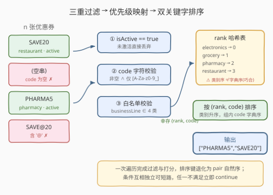
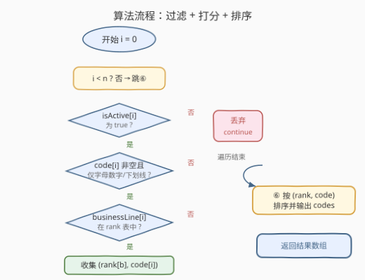

# LeetCode 优惠券校验器 题解

## 1. 题目概述

- **标题 / 题号**：优惠券校验器（#3606，easy）
- **链接**：https://leetcode.cn/problems/coupon-code-validator/
- **难度**：简单
- **标签**：数组、哈希表、字符串、排序

**题意**：给定三个长度为 `n` 的平行数组，描述 `n` 张优惠券：

- `code[i]`：字符串，优惠券的标识符；
- `businessLine[i]`：字符串，优惠券所属的业务类别；
- `isActive[i]`：布尔值，优惠券当前是否有效。

一张优惠券是**有效的**，当且仅当以下三个条件**同时**满足：

1. `code[i]` 非空，且仅由字母数字字符（`a-z`、`A-Z`、`0-9`）与下划线 `_` 组成；
2. `businessLine[i]` 是 `"electronics"`、`"grocery"`、`"pharmacy"`、`"restaurant"` 四类之一（**精确匹配，区分大小写**）；
3. `isActive[i]` 为 `true`。

返回所有有效优惠券的 `code`，按如下规则排序：

- 先按 `businessLine` 的**规定次序**：`electronics` < `grocery` < `pharmacy` < `restaurant`；
- 同一类别内，按 `code` 的**字典序升序**。

**示例 1**：

```text
输入：code = ["SAVE20","","PHARMA5","SAVE@20"],
     businessLine = ["restaurant","grocery","pharmacy","restaurant"],
     isActive = [true,true,true,true]
输出：["PHARMA5","SAVE20"]
解释：第 2 张 code 为空（无效）；第 4 张含特殊字符 '@'（无效）；
     幸存的 PHARMA5(pharmacy) 与 SAVE20(restaurant) 按类别序 pharmacy < restaurant 排列。
```

**示例 2**：

```text
输入：code = ["GROCERY15","ELECTRONICS_50","DISCOUNT10"],
     businessLine = ["grocery","electronics","invalid"],
     isActive = [false,true,true]
输出：["ELECTRONICS_50"]
解释：第 1 张未激活（无效）；第 3 张类别不在白名单（无效）。
```

**约束**：

- `n == code.length == businessLine.length == isActive.length`
- `1 <= n <= 100`
- `0 <= code[i].length, businessLine[i].length <= 100`
- `code[i]` 与 `businessLine[i]` 由可打印 ASCII 字符组成。

> 💡 **审题关键**：① 类别序是题目**规定的枚举序**，不是字典序——只是恰好 `e < g < p < r` 首字母巧合一致，不能依赖；② 大小写敏感，`"Electronics"` 不是合法类别；③ `code` 允许下划线，但**不允许空格、`@`、`-` 等其他字符**；④ 空串 `code` 必须单独拦截（`all()` 对空序列返回 `True`，见 6.Q2）。

## 2. 解题思路

### 2.1 暴力思路：比较器里现查类别次序

最直白的写法：主循环里内联三个 `if` 过滤，排序时**不预处理序**，直接在比较器里写：

```python
order = ["electronics", "grocery", "pharmacy", "restaurant"]
items.sort(key=lambda c: (order.index(business_line_of(c)), c))   # 每次 index 线性查找
```

- **正确性**：没问题——`list.index` 每次线性扫 4 个元素，量级恒定。
- **浪费**：类别序是**静态信息**，却在每次比较（$O(k \log k)$ 次）里重复求解；比较键里还拖着「由 code 反查 businessLine」的映射逻辑，排序键不纯粹。
- **易错**：`order.index(b)` 在 `b` 不在表里时抛异常——过滤与排序两个阶段的责任没切开。

> ⚠️ 瓶颈在于把「规定序」当成每次现查的动态问题。突破口：**序是静态的，一次性哈希成数字**，排序键坍缩为 `(rank, code)` 的 pair 自然序。

### 2.2 核心观察：哈希优先级映射，双关键字坍缩为 pair



**观察一：三个过滤条件互相独立，可短路求值。** `isActive` 是 $O(1)$ 的布尔判断，放在最前最划算；`code` 字符校验一趟线性扫描；`businessLine` 查哈希表。任一不满足立即 `continue`，后续检查不再执行——条件的**排列顺序本身就是一个小优化**。

**观察二：规定序 ≠ 字典序，哈希表把类别映成数字键。** 题目规定的类别序 `electronics < grocery < pharmacy < restaurant` 恰好与字典序一致（首字母 `e < g < p < r`），但这是**巧合**——若类别换成 `"b2b"` 排在 `"food"` 前，字典序立即出错。稳妥做法是显式建优先级映射：

$$\texttt{rank} = \{\text{"electronics"}: 0,\ \text{"grocery"}: 1,\ \text{"pharmacy"}: 2,\ \text{"restaurant"}: 3\}$$

于是排序键变成 $(\texttt{rank}[b],\ c)$ 的 **pair**——大多数语言里 pair/元组天然按分量逐级比较，无需手写比较器，「先类别序、后字典序」两个要求被一个元组自然吸收。

**观察三：过滤与排序两个阶段责任分离。** 过滤阶段产出自洽的 $(\text{rank}, \text{code})$ 列表，排序阶段**只消费键值**、不再回头查原数组——`rank.find` 返回 `end()` 即丢弃，异常路径在进入排序前已被消灭。

> 💡 一次遍历完成「过滤 + 打分」，排序退化为元组自然序——这是「自定义规定序」类问题的通用范式：**外部序进哈希表，排序键用元组**（同构题：1122 数组的相对排序）。

### 2.3 算法流程图



**逻辑执行步骤**：

| 步骤 | 操作 | 说明 |
|------|------|------|
| ① 建表 | `rank = {electronics:0, grocery:1, pharmacy:2, restaurant:3}` | 规定序 → 数字键，$O(1)$ 查询 |
| ② 遍历 | `for i in range(n)` | 平行数组按下标对齐 |
| ③ 过滤 | `isActive[i]` 为真？`code[i]` 字符合法？`businessLine[i]` 在表中？ | 三个独立条件短路求值，任一失败即 `continue` |
| ④ 打分收集 | 追加 `(rank[businessLine[i]], code[i])` | 过滤与打分同趟完成 |
| ⑤ 排序 | 按 pair 自然序排序 | 类别升序，组内 `code` 字典序升序 |
| ⑥ 输出 | 取每对的 `code` 分量 | 即答案数组 |

> ⚠️ 步骤③的三问顺序按**代价从低到高**排（布尔 $O(1)$ → 哈希查找 $O(1)$ 摊还 → 字符扫描 $O(L)$），实践中把最便宜的放最前可尽早短路。本题量级下无关痛痒，但习惯值得养成。

### 2.4 示例演算（示例 1）

| i | code[i] | businessLine[i] | isActive | 判定 | 结果 |
|---|---------|-----------------|----------|------|------|
| 0 | `SAVE20` | restaurant | true | 三关全过 | 收集 `(3, "SAVE20")` |
| 1 | `""` | grocery | true | code 为空，②拦截 | 丢弃 |
| 2 | `PHARMA5` | pharmacy | true | 三关全过 | 收集 `(2, "PHARMA5")` |
| 3 | `SAVE@20` | restaurant | true | `'@'` 非法，②拦截 | 丢弃 |

排序前：`[(3, "SAVE20"), (2, "PHARMA5")]` → 按 pair 升序 → `[(2, "PHARMA5"), (3, "SAVE20")]` → 输出 `["PHARMA5","SAVE20"]`。✅

## 3. 参考代码

### C++

```cpp
class Solution {
public:
    vector<string> validateCoupons(vector<string>& code,
                                   vector<string>& businessLine,
                                   vector<bool>& isActive) {
        const unordered_map<string, int> rank = {
            {"electronics", 0}, {"grocery", 1},
            {"pharmacy", 2},   {"restaurant", 3}
        };
        auto validCode = [](const string& s) {
            if (s.empty()) return false;
            for (char ch : s) {
                if (!isalnum(static_cast<unsigned char>(ch)) && ch != '_') {
                    return false;
                }
            }
            return true;
        };

        vector<pair<int, string>> items;
        int n = code.size();
        for (int i = 0; i < n; ++i) {
            if (!isActive[i] || !validCode(code[i])) continue;
            auto it = rank.find(businessLine[i]);
            if (it == rank.end()) continue;
            items.emplace_back(it->second, code[i]);
        }

        sort(items.begin(), items.end());
        vector<string> ans;
        ans.reserve(items.size());
        for (auto& [r, c] : items) ans.push_back(move(c));
        return ans;
    }
};
```

> 💡 **写法要点**：
> - `rank` 声明为 `const`：只读表，防止误写。
> - `isalnum` 的实参**必须转型 `unsigned char`**——`char` 为负时（扩展 ASCII 字节）行为未定义；本题保证可打印 ASCII（值 < 128）无实际风险，但转型是防御性习惯。
> - 排序直接用 `pair` 的默认序（先比 `first` 再比 `second`），无需手写比较器。
> - 输出循环用 `move(c)` 把字符串搬进结果，省一趟拷贝。

### Python

```python
class Solution:
    def validateCoupons(self, code: List[str], businessLine: List[str], isActive: List[bool]) -> List[str]:
        rank = {"electronics": 0, "grocery": 1, "pharmacy": 2, "restaurant": 3}

        def valid_code(s: str) -> bool:
            return bool(s) and all(ch.isalnum() or ch == "_" for ch in s)

        items = []
        for c, b, active in zip(code, businessLine, isActive):
            if not active:
                continue
            if not valid_code(c):
                continue
            if b not in rank:          # 精确匹配，区分大小写
                continue
            items.append((rank[b], c))

        items.sort()                    # pair 自然序：先 rank 后 code 字典序
        return [c for _, c in items]
```

> 💡 **写法要点**：
> - `bool(s)` 单独挡空串——`all()` 对空序列返回 `True`，不挡空串会把 `""` 误判合法（6.Q2）。
> - `str.isalnum()` 对 Unicode 字母/数字（如 `'²'`、`'Ａ'`）也返回 `True`；本题约束可打印 ASCII 无碍，若要严格 ASCII 语义可改用 `re.fullmatch(r"[A-Za-z0-9_]+", c)`（注意显式字符类，别用 `\w`——它在 `str` 模式下默认匹配 Unicode）。
> - `zip` 并行迭代三个平行数组，比下标访问更 Pythonic。
> - `items.sort()` 对 `(rank, code)` 元组排序，天然实现双关键字。

## 4. 复杂度分析

| 维度 | 复杂度 | 说明 |
|------|--------|------|
| **时间复杂度** | $O(n \cdot L + k \log k \cdot L)$ | 过滤一趟 $O(n \cdot L)$（$L$ 为最长 `code`/`businessLine` 长度，哈希计算字符串键需 $O(|b|)$）；排序 $k$ 个幸存者、每次比较 $O(L)$（$k \le n$） |
| **空间复杂度** | $O(n \cdot L)$ | 幸存者列表 $(\text{rank}, \text{code})$（不计输出数组则 $O(k)$）+ 常数大小哈希表（4 项） |

> - $n \le 100$、$L \le 100$，总计不超过 $10^4$ 量级，任何写法都能过；复杂度分析的价值在于确认**没有隐藏的平方项**（如比较器里 `order.index` 嵌套循环在本题恒定 4 元素下也只是常数）。
> - 类别表大小固定为 4，`rank` 表构建 $O(1)$；若类别扩展到 $m$ 类，构建 $O(m)$、查询仍 $O(1)$ 摊还。

## 5. 扩展：校验函数的两种写法与 regex 的取舍

**手写循环 vs 正则**：`code` 校验可用一行正则替代手写循环：

```python
import re
PATTERN = re.compile(r"[A-Za-z0-9_]+")   # fullmatch 语义：整个串须匹配

def valid_code(s: str) -> bool:
    return PATTERN.fullmatch(s) is not None
```

| 维度 | 手写 `all(...)` | 编译一次的 `fullmatch` |
|------|----------------|----------------------|
| 性能 | 每字符一次函数调用，够用 | 预编译后通常更快，规则复杂时优势明显 |
| 可读性 | 简单规则下最直白 | 规则多（长度、前缀、字符类组合）时更清晰 |
| 陷阱 | `all()` 空序列返回 `True`，须先挡空串 | `\w` 默认含 Unicode，须显式 `[A-Za-z0-9_]` |

**规则复杂化后的演化路径**：若校验规则增长为「长度 6–20、字母开头、含字母数字下划线」，正则 `^[A-Za-z][A-Za-z0-9_]{5,19}$` 一行封顶，手写循环则膨胀成多分支——**规则条数是选型的分水岭**。此外若题目改为「类别白名单与次序由配置给出」，`rank` 表从硬编码改为读入配置，算法结构完全不变，这正是「外部序进哈希表」范式的解耦红利。

## 6. 面试要点

**Q1：为什么不能直接按 `businessLine` 的字典序排序？**

> 题目规定的是**枚举序**而非字典序。本题四类恰好首字母 `e < g < p < r` 与字典序巧合一致，但这是运气——换一批类别（如 `"b2b"` 应排在 `"food"` 前）字典序立刻出错。正确姿势是显式建 `rank` 哈希表把规定序映成数字键，把「语义上的序」与「字符串比较」解耦。

**Q2：Python 里 `all(ch.isalnum() or ch == "_" for ch in s)` 为什么挡不住空串？**

> `all()` 对**空序列返回 `True`**（空果真空：没有任何元素违反条件），所以 `s = ""` 会被误判合法。必须先 `bool(s)` 再 `all(...)`。这是空串与 `all` 组合的经典陷阱，同族坑：`any()` 对空序列返回 `False`。

**Q3：C++ 的 `isalnum` 为什么建议转型 `unsigned char`？**

> 标准 `isalnum` 只对 `[0, 0x7f)` 的值与 `EOF` 定义行为，传入负值是**未定义行为**。`char` 在多数平台有符号，字节值 ≥ 128 的字符转成 `char` 即为负。本题约束可打印 ASCII（全部 < 128）无实际风险，但 `static_cast<unsigned char>(ch)` 是零成本的防御性习惯。

**Q4：为什么排序键用 `(rank, code)` 而非 `(businessLine, code)`？**

> 两个理由：① 正确性——类别序一般不是字典序（Q1）；② 效率与简洁——数字比较 $O(1)$ 且 pair/元组默认按分量逐级比较，无需手写比较器。把 `businessLine` 字符串留在键里，每次比较都要做字符串序对比，还要依赖巧合。

**Q5：如果两张优惠券的 `(businessLine, code)` 完全相同，输出顺序有影响吗？**

> 没有——两者在结果中是**同一个字符串**，输出数组完全一致。排序稳定性（`sort` 不稳定 vs `sorted` 稳定）在此不构成问题；只有当排序键相同但携带的**附加信息**不同时，稳定性才需要讨论。

> 💡 **一句话总结**：3606 是「**过滤 + 规定序排序**」的模板题——三重独立条件短路过滤，`rank` 哈希表把枚举序映成数字键，`(rank, code)` 元组排序一箭双雕。三大坑：空串与 `all()` 的组合、`isalnum` 的 `unsigned char` 转型、把规定序误当字典序。

## 同类练习题

| # | 题目 | 与本题的关联 |
|---|------|-------------|
| 1122 | [数组的相对排序](https://leetcode.cn/problems/relative-sort-array/) | 哈希把「外部规定的次序」映成排名再排序，与本题 `rank` 表同构（多了不在表中的元素按字典序垫底） |
| 937 | [重新排列日志文件](https://leetcode.cn/problems/reorder-data-in-log-files/) | 多级排序键（类型 → 内容字典序 → 标识符序）的自定义排序进阶版 |
| 2047 | [句子中的有效单词](https://leetcode.cn/problems/number-of-valid-words-in-a-sentence/) | 逐词字符规则校验（连字符至多一个、结尾标点），`code` 校验的规则加强版 |
| 500 | [键盘行](https://leetcode.cn/problems/keyboard-row/) | 字符串字符集 ⊆ 判定，`all(ch in row for ch in word)` 与本题字符校验同款姿势 |
| 2418 | [按身高排序](https://leetcode.cn/problems/sort-the-people/) | 哈希映射 + 按另一数组给出的权重重排，本题「打分 + 排序」两阶段的轻量对照 |
