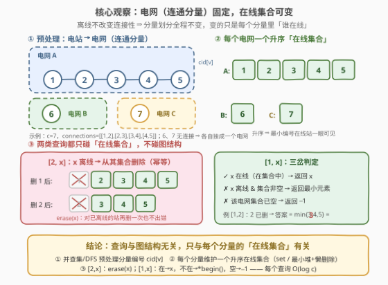
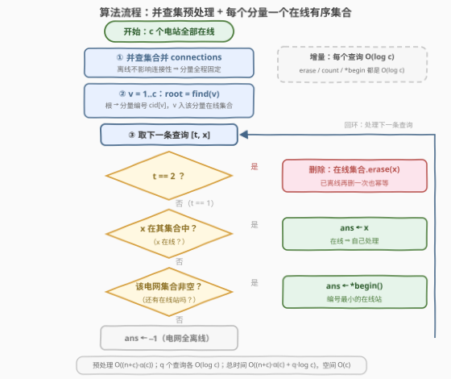

# 电网维护

- **题目名称**：电网维护
- **链接**：[3607. 电网维护](https://leetcode.cn/problems/power-grid-maintenance/)
- **难度**：中等
- **标签**：并查集、深度优先搜索、广度优先搜索、图、有序集合、堆（优先队列）

## 1. 题目概述

给你一个整数 `c`，表示 `c` 个电站，每个电站有一个唯一标识符 `id`，从 `1` 到 `c` 编号。

这些电站通过 `n` 条**双向**电缆互相连接，表示为一个二维数组 `connections`，其中每个元素 `connections[i] = [u_i, v_i]` 表示电站 `u_i` 和电站 `v_i` 之间的连接。直接或间接连接的电站组成了一个**电网**。

最初，**所有**电站均处于在线（正常运行）状态。

另给你一个二维数组 `queries`，其中每个查询属于以下**两种类型**之一：

- `[1, x]`：请求对电站 `x` 进行维护检查。如果电站 `x` 在线，则它自行解决检查。如果电站 `x` 已离线，则检查由与 `x` 同一**电网**中**编号最小**的在线电站解决。如果该电网中**不存在**任何在线电站，则返回 `-1`。
- `[2, x]`：电站 `x` 离线（即变为非运行状态）。

返回一个整数数组，表示按照查询中出现的顺序，所有类型为 `[1, x]` 的查询结果。

**注意**：电网的结构是固定的；离线（非运行）的节点仍然属于其所在的电网，且离线操作不会改变电网的连接性。

**示例 1**：

```text
输入：c = 5, connections = [[1,2],[2,3],[3,4],[4,5]], queries = [[1,3],[2,1],[1,1],[2,2],[1,2]]
输出：[3,2,3]
解释：
最初，所有电站 {1, 2, 3, 4, 5} 都在线，并组成一个电网。
查询 [1,3]：电站 3 在线，因此维护检查由电站 3 自行解决。
查询 [2,1]：电站 1 离线。剩余在线电站为 {2, 3, 4, 5}。
查询 [1,1]：电站 1 离线，因此检查由电网中编号最小的在线电站解决，即电站 2。
查询 [2,2]：电站 2 离线。剩余在线电站为 {3, 4, 5}。
查询 [1,2]：电站 2 离线，因此检查由电网中编号最小的在线电站解决，即电站 3。
```

**示例 2**：

```text
输入：c = 3, connections = [], queries = [[1,1],[2,1],[1,1]]
输出：[1,-1]
解释：
没有连接，因此每个电站是一个独立的电网。
查询 [1,1]：电站 1 在线，且属于其独立电网，因此维护检查由电站 1 自行解决。
查询 [2,1]：电站 1 离线。
查询 [1,1]：电站 1 离线，且其电网中没有其他电站，因此结果为 -1。
```

**约束条件**：

- `1 <= c <= 10^5`
- `0 <= n == connections.length <= min(10^5, c * (c - 1) / 2)`
- `connections[i].length == 2`
- `1 <= u_i, v_i <= c`，且 `u_i != v_i`
- `1 <= queries.length <= 2 * 10^5`
- `queries[i][0]` 为 `1` 或 `2`
- `1 <= queries[i][1] <= c`

---

## 2. 解题思路

### 2.1 暴力思路：每次查询现场 BFS

最直接的想法：对每个 `[1, x]` 查询，从 `x` 出发对整个电网做一次 BFS/DFS，遍历同电网的所有电站，过滤出在线的，取最小编号。

- 单次 BFS 的代价是 $O(c + n)$；
- 最坏情况下 $q = 2 \times 10^5$ 个查询全部打到同一个超大电网上，总代价 $O(q \cdot (c + n)) \approx 2 \times 10^{10}$，**必然超时**。

稍微优化一下：用 `offline` 布尔数组把 `[2, x]` 降到 $O(1)$，但 `[1, x]` 在 `x` 离线时仍要扫全电网，瓶颈没变。

> 💡 暴力慢在**每次都重新面对整张图**。突破口藏在题目那句"注意"里：**电网的结构是固定的，离线不改变连接性**。

### 2.2 核心观察：电网结构固定，在线集合可变

把题意拆成"结构"和"状态"两层，答案就浮出来了：

- **结构层（连通分量）全程不变**：离线的站仍然属于原电网，连接性不变 ⇒ 每个电站所属的电网可以用并查集（或 DFS/BFS）**预处理一次**，得到分量编号 `cid[v]`；
- **状态层（谁在线）只在集合里变**：`[2, x]` 只是从"某电网的在线集合"里删掉 `x`；`[1, x]` 只需要知道"`x` 是否在线"和"该电网编号最小的在线站"，两者都是**每个分量维护一个升序集合**就能 $O(\log c)$ 回答的问题。



于是查询逻辑变成纯粹的三岔判定：

```text
[2, x]：从 cid[x] 的在线集合中 erase(x)          // 幂等，重复离线也无害
[1, x]：x ∈ 集合   → 答案 x                      // 在线，自行处理
        x ∉ 集合   → 集合非空 → 答案 *begin()     // 编号最小的在线站
                      集合为空 → 答案 -1          // 整个电网全离线
```

> 💡 **Python 实现小技巧**：Python 没有内置平衡树，但本题有个隐藏的好性质——**电站只会离线、永远不会重新上线**。因此每个分量用一个**最小堆 + `offline` 布尔数组做懒删除**即可：`[2, x]` 只打标记；`[1, x]`（`x` 离线时）把堆顶的离线站弹干净再取堆顶。被弹出的站永远不需要回来，每个站至多被弹一次，均摊 $O(\log c)$。C++ 直接用 `std::set` 更省心。

### 2.3 算法流程图



### 2.4 示例演算

以示例 1 为例：`c = 5`，链式连接 `1-2-3-4-5`，五个站同属电网 A，初始在线集合 `{1,2,3,4,5}`：

| 步骤 | 查询 | 动作 | 电网 A 在线集合 | 输出 |
|------|------|------|----------------|------|
| 0 | — | 预处理：5 站连成一条链 → 一个分量 | {1, 2, 3, 4, 5} | — |
| 1 | [1,3] | 3 在集合中 → 自行处理 | {1, 2, 3, 4, 5} | **3** |
| 2 | [2,1] | 删除 1 | {2, 3, 4, 5} | — |
| 3 | [1,1] | 1 不在集合 → 取最小在线站 2 | {2, 3, 4, 5} | **2** |
| 4 | [2,2] | 删除 2 | {3, 4, 5} | — |
| 5 | [1,2] | 2 不在集合 → 取最小在线站 3 | {3, 4, 5} | **3** |

输出 `[3, 2, 3]`，与预期一致。

示例 2（`c = 3`，无连接）：每个站自成一个电网。`[1,1]` 时 1 在线 → 答案 1；`[2,1]` 后 1 的电网在线集合变空；再次 `[1,1]` 时集合已空 → 答案 `-1`。输出 `[1, -1]` ✓。

---

## 3. 参考代码

### 方法一：并查集 + 每分量有序集合（推荐）

### C++

```cpp
class Solution {
public:
    vector<int> processQueries(int c, vector<vector<int>>& connections,
                               vector<vector<int>>& queries) {
        // ---- ① 并查集：求出每个电站所属的电网（连通分量） ----
        vector<int> parent(c + 1);
        iota(parent.begin(), parent.end(), 0);
        function<int(int)> find = [&](int x) {
            return parent[x] == x ? x : parent[x] = find(parent[x]);
        };
        for (auto& e : connections) {
            int ra = find(e[0]), rb = find(e[1]);
            if (ra != rb) parent[ra] = rb;
        }

        // ---- ② 每个电网一个升序「在线集合」 ----
        unordered_map<int, int> rootToId;   // 分量根 → 分量编号
        vector<set<int>> online;            // 每个分量的在线电站集合（升序）
        vector<int> cid(c + 1, -1);         // 电站 → 分量编号
        for (int v = 1; v <= c; ++v) {
            int r = find(v);
            if (!rootToId.count(r)) {
                rootToId[r] = online.size();
                online.emplace_back();
            }
            cid[v] = rootToId[r];
            online[cid[v]].insert(v);
        }

        // ---- ③ 逐查询处理：只碰集合，不碰图 ----
        vector<int> ans;
        for (auto& q : queries) {
            set<int>& s = online[cid[q[1]]];
            if (q[0] == 2) {
                s.erase(q[1]);              // 离线：从集合删除（幂等）
            } else if (s.count(q[1])) {
                ans.push_back(q[1]);        // 在线：自行处理
            } else if (!s.empty()) {
                ans.push_back(*s.begin());  // 离线：编号最小的在线站
            } else {
                ans.push_back(-1);          // 该电网全离线
            }
        }
        return ans;
    }
};
```

### Python

```python
import heapq

class Solution:
    def processQueries(self, c: int, connections: List[List[int]],
                       queries: List[List[int]]) -> List[int]:
        # ---- ① 并查集：求出每个电站所属的电网（连通分量） ----
        parent = list(range(c + 1))

        def find(x: int) -> int:
            while parent[x] != x:
                parent[x] = parent[parent[x]]   # 路径压缩（迭代写法防爆栈）
                x = parent[x]
            return x

        for u, v in connections:
            ru, rv = find(u), find(v)
            if ru != rv:
                parent[ru] = rv

        # ---- ② 每个电网一个最小堆（v 按 1..c 升序入堆，天然有序） ----
        root_to_id = {}
        heaps = []                 # heaps[k] = 第 k 个电网的在线站最小堆
        cid = [0] * (c + 1)        # 电站 → 分量编号
        for v in range(1, c + 1):
            r = find(v)
            if r not in root_to_id:
                root_to_id[r] = len(heaps)
                heaps.append([])
            cid[v] = root_to_id[r]
            heapq.heappush(heaps[cid[v]], v)

        # ---- ③ 逐查询处理：懒删除（离线不可逆 ⇒ 弹出即永别） ----
        offline = [False] * (c + 1)
        ans = []
        for t, x in queries:
            if t == 2:
                offline[x] = True                    # 离线：只打标记
            elif not offline[x]:
                ans.append(x)                       # 在线：自行处理
            else:
                h = heaps[cid[x]]
                while h and offline[h[0]]:          # 弹掉堆顶的离线站（均摊 O(log)）
                    heapq.heappop(h)
                ans.append(h[0] if h else -1)       # 堆顶即最小编号在线站
        return ans
```

> 💡 若比赛环境允许第三方库，Python 也可以 `from sortedcontainers import SortedList` 直接照 C++ 的 set 思路写，逻辑一一对应；上面的堆 + 懒删除版本不依赖任何库，且均摊复杂度同为 $O(\log c)$。

---

## 4. 复杂度分析

| 维度 | 复杂度 | 说明 |
|------|--------|------|
| 预处理时间 | $O((n + c)\,\alpha(c))$ | 并查集合并 `n` 条边 + 扫描 `c` 个站建分量集合，$\alpha$ 为反阿克曼函数（近似常数） |
| 查询时间 | $O(q \log c)$ | 每个查询一次 `erase`/`count`/`*begin()`（或堆的均摊操作），$q$ 为查询数 |
| 总时间 | $O((n + c)\,\alpha(c) + q \log c)$ | 约 $10^5 \cdot 5 + 2 \times 10^5 \cdot 17$，轻松通过 |
| 空间复杂度 | $O(c)$ | 并查集数组 + 所有分量的在线集合（元素总数恰为 $c$） |

> ⚠️ 堆 + 懒删除版本的 `while` 弹栈看似嵌套在循环里，但**每个电站整个生命周期至多被弹出一次**，所有查询的弹出总次数 ≤ $c$，均摊后每个查询仍是 $O(\log c)$——这正是"离线不可逆"性质换来的红利。

---

## 5. 扩展：如果电站可以重新上线？

假设题目加一种查询 `[3, x]`（电站 `x` 重新上线），两种实现都能应付，但代价不同：

- **有序集合版**：`[3, x]` 就是 `insert(x)` 回去，`erase`/`insert`/`begin` 全部对称，**零改动成本**——这是平衡树方案的最大优势；
- **堆 + 懒删除版**：需要额外维护"是否还在堆里"的标记，且重新上线时可能向堆中重复压入 `x`，弹出时要跳过重复项，实现细节变多。

这也是工程上的通用权衡：**有序集合（平衡树）支持任意增删的双向操作，堆 + 懒删除只在"删除后永不恢复"（或恢复不频繁）的场景下才是平替**。本题数据保证只离线不恢复，堆版才敢用。

---

## 6. 面试要点

1. **为什么可以预处理连通分量，而不是每次查询时重新搜索？**
   - 题目明确"电网结构固定，离线不改变连接性"，即查询过程中图结构不变，分量划分一次算好即可全程复用；若离线会拆连接，就必须动态维护了。

2. **`[1, x]` 查询的三种结果分别是什么？**
   - `x` 在线 → 返回 `x`；`x` 离线但同电网还有在线站 → 返回该电网编号最小的在线站；整个电网全离线 → 返回 `-1`。

3. **Python 不用平衡树怎么保证 $O(\log c)$？**
   - 利用"离线不可逆"：最小堆 + `offline` 布尔做懒删除，每个站至多被弹出一次，均摊 $O(\log c)$；若站可重新上线，则懒删除不再是无脑平替，见第 5 节扩展。

4. **`[2, x]` 对已离线的电站再次出现怎么办？**
   - `set.erase` 对不存在的元素是空操作，`offline[x] = True` 重复赋值也无害，两种实现天然幂等，无需特判。

5. **为什么不用"每个分量一个 `multiset`/优先队列 + 删除标记"以外的方式，比如按位置维护最小值？**
   - 查询要的是**动态集合的最小值**，且删除/查询交替出现，不存在单调性可利用；有序集合（或堆）是这类"带删除的最小值查询"的标准解。

---

## 7. 同类练习题

- [547. 省份数量](https://leetcode.cn/problems/number-of-provinces/)（[题解](../0501-0600/547_省份数量.md)）：并查集求连通分量个数，本题第①步的同款模板
- [1971. 寻找图中是否存在路径](https://leetcode.cn/problems/find-if-path-exists-in-graph/)（[题解](../1901-2000/1971_寻找图中是否存在路径.md)）：并查集判连通，"先合并、后查询"的两阶段套路
- [721. 账户合并](https://leetcode.cn/problems/accounts-merge/)（[题解](../0701-0800/721_账户合并.md))：并查集分组后按组收集成员，与本题"分量 → 在线集合"同构
- [2316. 统计无向图中无法互相到达点对数](https://leetcode.cn/problems/count-unreachable-pairs-of-nodes-in-an-undirected-graph/)（[题解](../2301-2400/2316_统计无向图中无法互相到达点对数.md)）：按分量统计规模再组合计数，连通分量思想的计数版
- [990. 等式方程的可满足性](https://leetcode.cn/problems/satisfiability-of-equality-equations/)（[题解](../0901-1000/990_等式方程的可满足性.md)）：先 union 等式、再查不等式，与本题"预处理 + 逐查询"两阶段一致
