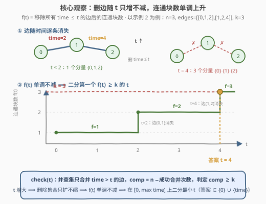
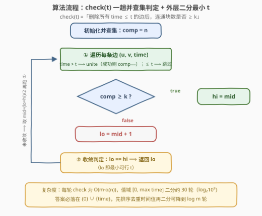

# 包含 K 个连通分量需要的最小时间

- **题目名称**：包含 K 个连通分量需要的最小时间
- **链接**：[3608. 包含 K 个连通分量需要的最小时间](https://leetcode.cn/problems/minimum-time-for-k-connected-components/)
- **难度**：中等
- **标签**：并查集、图、二分查找、排序

## 1. 题目概述

给定 $n$ 个节点（编号 $0$ 到 $n-1$）的无向图，边由二维数组 `edges` 给出，其中 `edges[i] = [u_i, v_i, time_i]` 表示一条连接 $u_i$ 与 $v_i$ 的无向边，**该边会在时刻 $time_i$ 被移除**。

另给整数 $k$。初始时图可能连通也可能不连通。求**最小**时刻 $t$，使得移除所有满足 $time_i \le t$ 的边之后，图中**至少有 $k$ 个连通分量**，返回该 $t$。

**示例 1**：

```text
输入：n = 2, edges = [[0,1,3]], k = 2
输出：3
解释：t=1、2 时图不变（仍 1 个分量 {0,1}）；t=3 时边 [0,1] 被移除，
     形成 {0}、{1} 共 2 个分量，故答案为 3。
```

**示例 2**：

```text
输入：n = 3, edges = [[0,1,2],[1,2,4]], k = 3
输出：4
解释：t=2 时移除 [0,1]，得 2 个分量 {0}、{1,2}；
     t=4 时再移除 [1,2]，得 3 个分量 {0}、{1}、{2}，故答案为 4。
```

**示例 3**：

```text
输入：n = 3, edges = [[0,2,5]], k = 2
输出：0
解释：初始即有 2 个分量 {1} 与 {0,2}，无需删任何边，答案为 0。
```

**约束条件**：

- $1 \le n \le 10^5$
- $0 \le edges.length \le 10^5$
- $0 \le u_i, v_i < n$ 且 $u_i \ne v_i$
- $1 \le time_i \le 10^9$
- $1 \le k \le n$，不存在重复的边

> 💡 **读题关键**：这是「**求最小阈值使图满足某连通性条件**」的骨架——阈值 $t$ 越大、删掉的边越多、连通分量数只增不减，**单调性**天然成立；而验证一个固定 $t$ 只需一趟并查集。「单调 + 廉价验证」正是**二分答案**的标配信号（与 778、1631、3600 同族）。

---

## 2. 解题思路

### 2.1 暴力思路：枚举每个时刻重数连通块

最直白的做法：$t$ 从 $0$ 逐一增加到 $\max time_i$，每个时刻重跑一遍 DFS/BFS 数连通块，首次达到 $k$ 即返回。单次计数 $O(n + m)$，总代价 $O((n+m)\cdot \max time_i)$——$time_i$ 高达 $10^9$，直接爆炸。即便只枚举 $m$ 个不同的边时刻，也是 $O((n+m)\,m) \approx 10^{10}$，仍不可行。

另一个诱人但**走不通**的方向：$t$ 逐步加一、**增量地**删边维护连通块数。问题在于**并查集只会「合并」不会「分裂」**——删边可能把一个连通块撕成两半，这是并查集天生不支持的操作（动态连通性需要 Link-Cut Tree / 离线等重型武器）。

> ⚠️ 瓶颈的本质：**搜索答案贵，验证答案便宜**（一趟 $O(m\,\alpha(n))$）。突破口是把「最优 $t$ 是多少」改写成「$t$ 行不行」——单调性保证下，二分答案只需 $\log$ 次验证。

### 2.2 核心观察：连通块数随 $t$ 单调不减 → 二分答案 + 并查集判定



**观察一：$f(t)$ 关于 $t$ 单调不减。** 定义

$$f(t) = \text{移除所有 } time_i \le t \text{ 的边后，图的连通分量数}$$

$t$ 变大时，删除集合只扩不缩，**剩余边集缩小**——边越少、连通块越多（或不变）。于是 $f$ 是一条只升不降的阶梯线，答案即**第一个 $f(t) \ge k$ 的台阶起点**（见上图示例 2 的阶梯：$f=1 \to 2 \to 3$，$k=3$ 的交点落在 $t=4$）。

**观察二：验证 $t$ 只需一趟并查集，「删除 $time \le t$」等价于「只保留 $time > t$」。** 并查集不能删边，但判定时干脆**跳过**要删的边——只对 $time_i > t$ 的边做 `unite`：

$$\texttt{check}(t):\quad comp = n - (\text{成功合并次数})，\ \text{返回 } comp \ge k$$

**观察三：二分区间 $[0,\ \max time_i]$ 两端天然封闭。**

- 左端 $f(0)$：因 $time_i \ge 1 > 0$，无任何边被删，即原图连通块数——若已 $\ge k$，答案就是 $0$（示例 3）；
- 右端 $f(\max time_i)$：所有边都被删，$comp = n \ge k$ 恒成立（$k \le n$），**必有解**，无需无解特判。

二分找最小的 `check` 为真的 $t$ 即答案。注意 $f$ 只在 $\{time_i\}$ 这些时刻跳变，故**答案必属于 $\{0\} \cup \{time_i\}$**——这也是第 5 节两种变体的理论依据。

> 💡 与 3600（升级后最大生成树稳定性）互为镜像：3600 是「**最大化**阈值、可行性随阈值**递减**」，本题是「**最小化**阈值、可行性随阈值**递增**」；两题的判定函数都是一趟并查集，套路完全同源。

### 2.3 算法流程图



**逻辑执行步骤**：

| 步骤 | 操作 | 说明 |
|------|------|------|
| ① 初始化 | `comp = n`，每点自成一块 | 每轮 `check` 重建并查集 |
| ② 扫边 | `time > t` 的边 `unite(u, v)`，成功则 `comp−−`；`time ≤ t` 的边直接跳过 | 「删除」=「不入并查集」 |
| ③ 判定 | `comp ≥ k ?` | `true ⟹ hi = mid`；`false ⟹ lo = mid + 1` |
| ④ 二分 | 区间 $[0, \max time]$ 收敛后 `lo` 即答案 | `check(maxT)` 恒真保证有解 |

### 2.4 示例演算

以示例 2（$n=3$，`edges = [[0,1,2],[1,2,4]]`，$k=3$）走查二分全过程：

| 判定 | 删除的边（$time \le t$） | 保留的边 | 连通块 | $f(t) \ge 3$ ? |
|------|--------------------------|----------|--------|----------------|
| $f(0)$ / $f(1)$ | 无 | $(0,1,2)$、$(1,2,4)$ | $\{0,1,2\}$ → 1 | ✗ |
| $f(2)$ / $f(3)$ | $(0,1,2)$ | $(1,2,4)$ | $\{0\}$、$\{1,2\}$ → 2 | ✗ |
| $f(4)$ | 全部 | 无 | $\{0\}$、$\{1\}$、$\{2\}$ → 3 | ✓ |

外层二分：$[0,4] \xrightarrow{mid=2,\ ✗} [3,4] \xrightarrow{mid=3,\ ✗} [4,4]$，返回 **4**。

- 示例 1：$f(3)$ 才首次达到 $2$，二分收敛到 $3$；
- 示例 3：$f(0) = 2 \ge 2$，`check(0)` 直接为真，区间一路左缩到 $0$。

---

## 3. 参考代码

### C++

```cpp
#include <numeric>

class Solution {
    vector<int> fa, sz_;
    int comp;

    int find(int x) {
        while (fa[x] != x) {
            fa[x] = fa[fa[x]];              // 路径压缩：隔代一跳
            x = fa[x];
        }
        return x;
    }
    void unite(int a, int b) {
        a = find(a); b = find(b);
        if (a == b) return;
        if (sz_[a] < sz_[b]) swap(a, b);    // 按大小合并
        fa[b] = a; sz_[a] += sz_[b];
        --comp;
    }

public:
    int minTime(int n, vector<vector<int>>& edges, int k) {
        int hi = 0;
        for (auto& e : edges) hi = max(hi, e[2]);

        auto check = [&](int t) -> bool {   // 删除 time≤t 后连通块数 ≥ k ？
            fa.resize(n);
            iota(fa.begin(), fa.end(), 0);
            sz_.assign(n, 1);
            comp = n;
            for (auto& e : edges)
                if (e[2] > t) unite(e[0], e[1]);   // 只保留 time > t 的边
            return comp >= k;
        };

        int lo = 0;                          // f(maxT)=n≥k 恒真，必有解
        while (lo < hi) {                    // 二分最小可行 t
            int mid = lo + (hi - lo) / 2;
            if (check(mid)) hi = mid;
            else lo = mid + 1;
        }
        return lo;
    }
};
```

### Python

```python
class Solution:
    def minTime(self, n: int, edges: List[List[int]], k: int) -> int:
        def check(t: int) -> bool:          # 删除 time≤t 后连通块数 ≥ k ？
            fa = list(range(n))

            def find(a: int) -> int:
                while fa[a] != a:
                    fa[a] = fa[fa[a]]       # 路径压缩：隔代一跳
                    a = fa[a]
                return a

            comp = n
            for u, v, tm in edges:
                if tm > t:                  # 只保留 time > t 的边
                    a, b = find(u), find(v)
                    if a != b:
                        fa[a] = b
                        comp -= 1
            return comp >= k

        lo = 0
        hi = max((e[2] for e in edges), default=0)  # 空边表 → 答案 0
        while lo < hi:                      # 二分最小可行 t
            mid = (lo + hi) // 2
            if check(mid):
                hi = mid
            else:
                lo = mid + 1
        return lo
```

> 💡 上述解法已与暴力对拍验证：除三个官方示例外，$n \le 8$、$m \le 12$、$time_i \le 6$ 的 3000 组随机用例（逐时刻 BFS 计连通块）结果完全一致；`edges` 为空时 `hi = 0`，循环不进入直接返回 0。

---

## 4. 复杂度分析

| 维度 | 复杂度 | 说明 |
|------|--------|------|
| 时间 | $O(m \, \alpha(n) \cdot \log T)$ | $T = \max time_i \le 10^9$，值域二分约 30 轮；每轮重建并查集 + 扫一遍全部边，单次 `find/unite` 近似常数 |
| 空间 | $O(n)$ | 并查集 `fa` / `sz_` 数组 |

- 若先把 $m$ 个时间值排序去重，在**候选值集合** $\{0\} \cup \{time_i\}$ 上二分，轮数降为 $O(\log m)$，总代价 $O(m \log m + m\,\alpha(n)\log m)$，渐进同阶、常数更小。
- 两种写法的排序/扫描都是缓存友好的顺序访问，$m = 10^5$ 时实测瞬时完成。

---

## 5. 扩展：免二分的一趟解法（时间降序「往回加边」）

2.1 节说过：沿 $t$ **正向**增量删边不可行（并查集不能分裂）。但把方向反过来——从 $t = +\infty$ 出发**往回加边**——就只剩「合并」操作，并查集完美胜任：

1. 按 $time$ **降序**排序，$comp$ 初始为 $n$（对应 $t \ge \max time$、无边保留）；
2. 依次处理**同一时刻**的一组边：合并**之前**的 $comp$ 恰是 $f(t)$（保留的正是 $time > t$ 的边）。若 $comp \ge k$，该时刻 $t$ 是候选答案——**越晚处理（越小）的 $t$ 越优，直接覆盖**；
3. 一旦某轮合并前 $comp < k$：由单调性，更小的 $t$ 只会更差，**提前终止**；若所有边加完仍 $comp \ge k$，说明 $f(0) \ge k$，答案为 $0$。

一趟完成，只有排序一个 $\log$：

```python
class Solution:
    def minTime(self, n: int, edges: List[List[int]], k: int) -> int:
        edges.sort(key=lambda e: -e[2])          # 时间降序：加边方向
        fa = list(range(n))

        def find(a: int) -> int:
            while fa[a] != a:
                fa[a] = fa[fa[a]]
                a = fa[a]
            return a

        comp, ans, i, m = n, 0, 0, len(edges)
        while i < m:
            t = edges[i][2]
            if comp < k:                         # 再加边 comp 只会更小
                break
            ans = t                              # 合并前 comp = f(t) ≥ k，候选
            while i < m and edges[i][2] == t:    # 合并整组同刻边
                a, b = find(edges[i][0]), find(edges[i][1])
                if a != b:
                    fa[a] = b
                    comp -= 1
                i += 1
        return ans if comp < k else 0            # 加完仍 ≥ k ⟹ 答案 0
```

```cpp
class Solution {
public:
    int minTime(int n, vector<vector<int>>& edges, int k) {
        sort(edges.begin(), edges.end(),
             [](auto& a, auto& b) { return a[2] > b[2]; });   // 时间降序
        vector<int> fa(n);
        iota(fa.begin(), fa.end(), 0);
        auto find = [&](int x) {
            while (fa[x] != x) fa[x] = fa[fa[x]], x = fa[x];
            return x;
        };
        int comp = n, ans = 0, m = edges.size();
        for (int i = 0; i < m; ) {
            int t = edges[i][2];
            if (comp < k) break;                 // 再加边只会更小
            ans = t;                             // 合并前 comp = f(t) ≥ k
            for (; i < m && edges[i][2] == t; ++i) {
                int a = find(edges[i][0]), b = find(edges[i][1]);
                if (a != b) fa[a] = b, --comp;
            }
        }
        return comp < k ? ans : 0;               // 加完仍 ≥ k ⟹ 答案 0
    }
};
```

复杂度 $O(m \log m + m\,\alpha(n))$，相比二分版省去约 30 轮重复建并查集的常数；代价是「验证 + 推进」耦合在一起，不如二分版直观——面试中先讲二分、再提这个优化，层次感最佳。这与 1101（彼此熟识的最早时间，时间轴加边直到 $1$ 个分量）互为**对偶**：一个删边求「散」，一个加边求「聚」。

---

## 6. 面试要点

**Q1：为什么可以二分？单调性如何论证？**

> $f(t) = $ 删除所有 $time \le t$ 的边后的连通块数。$t_1 < t_2$ 时，$t_2$ 的删除集合包含 $t_1$ 的，剩余边集是子集；边从图中拿掉只会让连通块「维持或增多」，不会减少——所以 $f$ 单调不减，`check(t) = [f(t) ≥ k]` 呈「假…假真…真」分布，二分最小真值即答案。

**Q2：判定函数为什么不「模拟删边」，而是只合并 `time > t` 的边？**

> 并查集只支持合并（union），不支持分裂（删除一条边可能把连通块撕开）。但判定只关心**最终状态**：「删除 $time \le t$ 的边」后的连通性，与「只保留 $time > t$ 的边」的连通性完全等价——跳过要删的边、只并入保留的边，$comp = n - \text{成功合并次数}$，一趟 $O(m\,\alpha(n))$ 搞定。

**Q3：二分的上下界怎么取？为什么不需要无解特判？**

> 下界 $0$：$time_i \ge 1$，$f(0)$ 即原图连通块数，已 $\ge k$ 则答案为 $0$（示例 3）。上界 $\max time_i$：此时边删光，$f = n \ge k$（约束 $k \le n$）恒成立——区间右端必为真，二分必然收敛到解，无 $-1$ 分支。

**Q4：答案可能取哪些值？二分值域和二分候选值有什么区别？**

> $f$ 只在各条边的 $time_i$ 处跳变，故答案 $\in \{0\} \cup \{time_i\}$。对整数区间 $[0, \max T]$ 二分轮数约 $\log_2 10^9 \approx 30$；先排序去重时间值再在其下标上二分，轮数降为 $\log_2 m \approx 17$，但要小心边界（候选序列前加个 $0$）。两者渐进同阶。

**Q5：能否不二分、一趟解决？**

> 能，第 5 节的降序加边法：删边方向并查集做不到，但**反向加边**全是合并——按 $time$ 降序逐组合并，合并一整组**之前**的 $comp$ 恰等于 $f(t)$；$comp \ge k$ 时记录候选 $t$（小值覆盖大值），一旦 $comp < k$ 立即终止。复杂度 $O(m \log m)$，本质是把二分「盲猜 + 验证」换成了「按时间线顺序推进」。

> 💡 **一句话总结**：连通块数随删边阈值 $t$ 单调不减 ⟹ 二分答案；判定时把「删除 $time \le t$」翻译成「只合并 $time > t$」，一趟并查集数连通块。进阶可反向加边免二分，与 1101 的加边过程互为对偶。

---

## 7. 同类练习题

- [1101. 彼此熟识的最早时间](https://leetcode.cn/problems/the-earliest-moment-when-everyone-become-friends/)：时间轴上「加边」直到只剩 1 个连通分量——与本题「删边到出现 k 个分量」互为对偶，第 5 节一趟解法即它的镜像
- [1697. 检查边长度限制的路径是否存在](https://leetcode.cn/problems/checking-existence-of-edge-length-limited-paths/)：离线排序 + 并查集，同款「只合并权值大于阈值的边」判定，进阶版 1724 带在线查询
- [778. 水位上升的泳池中游泳](https://leetcode.cn/problems/swim-in-rising-water/)：二分阈值 + 连通性判定的祖师爷，「最大化最小值」方向与本题相反
- [2316. 统计无向图中无法互相到达点对数](https://leetcode.cn/problems/count-unreachable-pairs-of-nodes-in-an-undirected-graph/)：并查集统计连通块规模的专项练习，巩固 `comp` 的维护
- [1579. 保证图可完全遍历](https://leetcode.cn/problems/remove-max-number-of-edges-to-keep-graph-fully-traversable/)：分层贪心 + 双并查集，体会「跳过某些边只并另一些边」的高级形态
