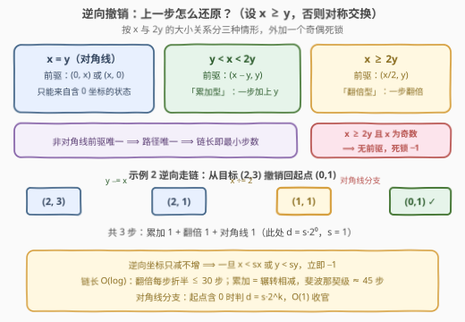
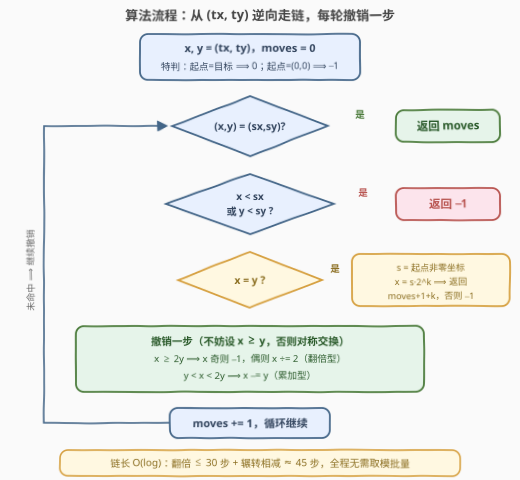

# LeetCode 到达目标点的最小移动次数 题解

## 1. 题目概述

- **标题 / 题号**：到达目标点的最小移动次数（#3609，hard）
- **链接**：https://leetcode.cn/problems/minimum-moves-to-reach-target-in-grid/
- **难度**：困难
- **标签**：数学、逆向思维、类似欧几里得

**题意**：在无限大的二维网格上给定两个点：起点 $(sx, sy)$ 与目标点 $(tx, ty)$。

在任意位置 $(x, y)$，记 $m = \max(x, y)$，每一步可以执行以下两种操作之一：

- 移动到 $(x + m, y)$；
- 移动到 $(x, y + m)$。

返回到达 $(tx, ty)$ 所需的**最小**移动次数；无法到达则返回 $-1$。

**示例 1**：

```text
输入：sx = 1, sy = 2, tx = 5, ty = 4
输出：2
解释：(1,2) --m=2 加到 y--> (1,4) --m=4 加到 x--> (5,4)
```

**示例 2**：

```text
输入：sx = 0, sy = 1, tx = 2, ty = 3
输出：3
解释：(0,1) --m=1 加到 x--> (1,1) --m=1 加到 x--> (2,1) --m=2 加到 y--> (2,3)
```

**示例 3**：

```text
输入：sx = 1, sy = 1, tx = 2, ty = 2
输出：-1
解释：无法通过允许的移动方式从 (1,1) 到达 (2,2)。
```

**约束**：

- $0 \le sx \le tx \le 10^9$
- $0 \le sy \le ty \le 10^9$

> 💡 **读题关键**：正向看，每步把「当前较大坐标」$m$ 加到 $x$ 或 $y$ 上——两个分支，状态像二叉树一样指数膨胀，而坐标值域高达 $10^9$。但把视角倒过来：**几乎每个状态的「上一步」是唯一的**。「正向爆炸、逆向唯一」正是逆向走链题（780 到达终点同族）的标志性信号。

## 2. 解题思路

### 2.1 暴力思路：正向 BFS 状态爆炸

从 $(sx, sy)$ 出发 BFS，每步两个转移，最先到达 $(tx, ty)$ 的层数即答案。问题在于**状态空间**：

- 坐标只增不减，可利用「$x > tx$ 或 $y > ty$ 即剪枝」，但界内可达状态仍是正向二叉树在 $10^9 \times 10^9$ 网格内的全部节点，最坏天文数字；
- 增长时快时慢（加 $m$ 可能翻倍、也可能只是小步累加），无法预估离目标还有几步，迭代加深 / 双向 BFS 也救不回来。

> ⚠️ 瓶颈的本质：**正向每步有「选择」，逆向几乎没有**——移动规则中的 $m = \max(x, y)$ 由当前状态唯一确定，这暗示「上一步」可以被反推。突破口是反过来从 $(tx, ty)$ 走回 $(sx, sy)$，把搜索问题变成一条确定性的链。

### 2.2 核心观察：逆向走链——非对角线状态的前驱唯一



以下讨论不妨设 $x \ge y$（否则将两坐标对称交换，规则本身对 $x, y$ 对称）。

**观察一（方向判定）**：若 $x > y$，则上一步一定加在 $x$ 上。因为「加在 $y$ 上」得到的新 $y = y_{old} + m \ge x_{old} =$ 新 $x$（$m = \max \ge x_{old}$），即必有 $y \ge x$，与 $y < x$ 矛盾。

**观察二（前驱唯一 + 奇偶死锁）**：设上一步从 $(a, y)$ 走来，则 $a + \max(a, y) = x$，只有两种解：

- 若 $x \ge 2y$：前驱只能是 $(x/2, y)$——「**翻倍型**」一步（$a \ge y$ 时 $\max = a$，即 $x = 2a$）。这要求 $x$ 为**偶数**；若 $x$ 为奇数则**无前驱**——该状态只能作为起点存在，逆向链撞上它即返回 $-1$；
- 若 $y < x < 2y$：前驱只能是 $(x - y, y)$——「**累加型**」一步（$a < y$ 时 $\max = y$，即 $x = a + y$）。

两种情形由 $x$ 与 $2y$ 的大小**唯一二分**（减法型解 $a = x - y$ 需要 $a < y$ 即 $x < 2y$，与前一情形互斥；边界 $x = 2y$ 时两种反推给出同一前驱 $(y, y)$，归入翻倍型即可）。

**观察三（对角线是分水岭）**：$x = y = d > 0$ 时前驱恰有两个：$(0, d)$ 与 $(d, 0)$。即**对角线状态只能从含 0 坐标的状态一步到达**；而含 0 坐标的状态（如 $(0, d)$）逆向回溯时 0 永远保持（$(0, d) \leftarrow (0, d/2) \leftarrow \cdots$ 纯折半链）。于是：

- 起点两坐标均为正：逆向链一旦撞上对角线（且不等于起点）即可判 $-1$；
- 起点形如 $(0, s)$（或 $(s, 0)$）：撞上对角线 $(d, d)$ 后应走 $(0, d)$ 分支，**当且仅当 $d = s \cdot 2^k$** 时再经 $k$ 步折半命中起点，答案 = 已走步数 $+ 1 + k$——判「$d / s$ 是否为 2 的幂」即可 $O(1)$ 收官。

**观察四（越界即无解）**：逆向每步只减不增，某坐标一旦跌破起点对应坐标（$x < sx$ 或 $y < sy$）即可判 $-1$，不必再走。

**观察五（最小性免费获得）**：非对角线状态前驱唯一 $\Longrightarrow$ 从起点出发的可达状态构成一棵「前驱唯一」的树，起点到任何目标的路径**唯一**——其长度就是最小移动次数，无需在多条路径中比较。

> 💡 **链长为什么短**？翻倍型每步把较大坐标折半，至多 $\log_2 10^9 \approx 30$ 步；累加型 $x \to x - y$ 正是**辗转相减**的形态，最坏（连续斐波那契数列）约 $\log_\varphi 10^9 \approx 45$ 步。全程 $O(\log)$ 步——连 780 那样的取模批量优化都不需要。

### 2.3 算法流程图



**逻辑执行步骤**：

| 步骤 | 操作 | 说明 |
|------|------|------|
| ① 初始化 | `x, y = tx, ty`，`moves = 0` | 特判：起点 = 目标返回 0；起点 $(0,0)$ 返回 $-1$（$m=0$ 永远走不动） |
| ② 命中判定 | `(x, y) == (sx, sy)` → 返回 `moves` | 每轮循环最先检查 |
| ③ 越界判定 | `x < sx` 或 `y < sy` → 返回 $-1$ | 逆向坐标只减不增 |
| ④ 对角线分支 | `x == y`：取 `s` = 起点非零坐标，`x == s·2^k` → 返回 `moves + 1 + k`，否则 $-1$ | 起点两坐标均为正时直接 $-1$ |
| ⑤ 撤销一步 | `x > y`：`x ≥ 2y` ?（奇 → $-1$，偶 → `x /= 2`）: `x -= y`；`y > x` 时对称 | `moves += 1`，回到 ② |

### 2.4 示例演算

以示例 2（$sx=0, sy=1, tx=2, ty=3$）逆向走链：

| 状态 | 判定 | 撤销操作 | moves |
|------|------|----------|-------|
| $(2, 3)$ | $y > x$ 且 $y < 2x$ | 累加型：$y \leftarrow y - x = 1$ | 1 |
| $(2, 1)$ | $x > y$，$x \ge 2y$ 且 $x$ 偶 | 翻倍型：$x \leftarrow x/2 = 1$ | 2 |
| $(1, 1)$ | 对角线 | 起点含 0：$s = 1$，$q = 1/1 = 1 = 2^0$ | $2 + 1 + 0 = 3$ ✓ |

正向验证：$(0,1) \to (1,1) \to (2,1) \to (2,3)$，恰好 3 步。

- 示例 1：$(5,4) \xrightarrow{\,x - y\,} (1,4) \xrightarrow{\,y/2\,} (1,2)$ 命中起点，2 步；
- 示例 3：$(2,2)$ 是对角线且起点两坐标均为正，直接 $-1$。

## 3. 参考代码

### C++

```cpp
class Solution {
public:
    int minMoves(int sx, int sy, int tx, int ty) {
        if (sx == tx && sy == ty) return 0;
        if (sx == 0 && sy == 0) return -1;       // (0,0) 处 m=0，一步也走不动
        long long x = tx, y = ty, moves = 0;
        while (true) {
            if (x == sx && y == sy) return moves;
            if (x < sx || y < sy) return -1;     // 逆向坐标只减不增，跌破起点即无解
            if (x == y) {                        // 对角线：前驱只能是 (0,x) 或 (x,0)
                long long s = (sx == 0) ? sy : ((sy == 0) ? sx : 0);
                if (s == 0 || x % s) return -1;  // 起点两坐标均为正 ⟹ 无解
                long long q = x / s;
                if (q & (q - 1)) return -1;      // 需要 x = s·2^k
                return moves + 1 + __builtin_ctzll(q);
            }
            if (x > y) {
                if (x >= 2 * y) {                // 上一步是「翻倍」：前驱 (x/2, y)
                    if (x % 2) return -1;        // 奇数无前驱，死锁
                    x /= 2;
                } else {                         // 上一步是「累加」：前驱 (x-y, y)
                    x -= y;
                }
            } else {
                if (y >= 2 * x) {
                    if (y % 2) return -1;
                    y /= 2;
                } else {
                    y -= x;
                }
            }
            ++moves;
        }
    }
};
```

### Python

```python
class Solution:
    def minMoves(self, sx: int, sy: int, tx: int, ty: int) -> int:
        if sx == tx and sy == ty:
            return 0
        if sx == 0 and sy == 0:                 # (0,0) 处 m=0，一步也走不动
            return -1
        x, y, moves = tx, ty, 0
        while True:
            if x == sx and y == sy:
                return moves
            if x < sx or y < sy:                # 逆向坐标只减不增，跌破起点即无解
                return -1
            if x == y:                          # 对角线：前驱只能是 (0,x) 或 (x,0)
                s = sy if sx == 0 else (sx if sy == 0 else 0)
                if s == 0 or x % s:
                    return -1                   # 起点两坐标均为正 ⟹ 无解
                q = x // s
                if q & (q - 1):
                    return -1                   # 需要 x = s·2^k
                return moves + 1 + q.bit_length() - 1
            if x > y:
                if x >= 2 * y:                  # 上一步是「翻倍」：前驱 (x/2, y)
                    if x % 2:
                        return -1               # 奇数无前驱，死锁
                    x //= 2
                else:                           # 上一步是「累加」：前驱 (x-y, y)
                    x -= y
            else:
                if y >= 2 * x:
                    if y % 2:
                        return -1
                    y //= 2
                else:
                    y -= x
            moves += 1
```

> 💡 上述解法已与暴力 BFS 对拍验证：$0 \le sx \le tx \le 25$、$0 \le sy \le ty \le 25$ 全量 **123,201** 组、坐标 $\le 150$ 的 5,000 组随机用例结果完全一致；另以 20 万组「随机正向走生成的可达对」验证步数**精确命中**，C++/Python 双实现逐位一致。

## 4. 复杂度分析

| 维度 | 复杂度 | 说明 |
|------|--------|------|
| 时间 | $O(\log(\max(tx, ty)))$ | 翻倍型每步将较大坐标折半（$\le 30$ 步）；累加型是辗转相减、最坏斐波那契级（$\approx 45$ 步）；总计 $< 10^2$ 步 |
| 空间 | $O(1)$ | 仅若干标量变量 |

## 5. 扩展：与 780「到达终点」的对比

[780. 到达终点](https://leetcode.cn/problems/reaching-points/)的移动是 $(x, x+y)$ 或 $(x+y, y)$——**较小者加到较大者**，且只问可达性。逆向时同一坐标可以**连续**被减很多次（如 $(10^9, 1) \leftarrow (10^9 - 1, 1) \leftarrow \cdots$ 一步一减），所以必须用 `tx %= ty` **取模批量**。而本题的移动加的是 $\max(x, y)$，逆向呈两种形态：

- 翻倍型 $x \to x/2$：天然对数级，无需批量；
- 累加型 $x \to x - y$：减完立即「换人」（$x - y < y$，较大者易主），本质是辗转相减，最坏连续斐波那契 $\approx \log_\varphi 10^9 \approx 45$ 步，同样对数级。

另一个差异是**奇偶死锁**：780 的减法撤销永远合法，本题的翻倍撤销要求偶数——奇数即无前驱，这是本题 $-1$ 的主要来源之一（其余是跌破起点、对角线撞墙）。

> 💡 共同骨架是「**逆向走链 + 前驱唯一性论证**」：面试中先把「每个状态的上一步能否被唯一反推」讲清楚，链长与死锁条件都是顺势而下的推论。顺带可以口头推演变体：若把 $\max$ 换成 $\min$ 或 $x + y$，前驱结构如何变化——展示对规则的驾驭而非背模板。

## 6. 面试要点

**Q1：为什么逆向走链，而不是正向 BFS / 最短路？**

> 正向每步两个分支，状态二叉树在 $10^9 \times 10^9$ 网格内指数膨胀，即使「坐标超过目标即剪枝」也剩天文数字。逆向则几乎无分支：除对角线外每个状态的前驱唯一，从 $(tx, ty)$ 走回 $(sx, sy)$ 是一条确定性链，长度 $O(\log)$。

**Q2：$x > y$ 时上一步为什么一定加在 $x$ 上？前驱如何反推？**

> 若上一步加在 $y$ 上，则新 $y = y_{old} + \max \ge x_{old} =$ 新 $x$，必有 $y \ge x$，与 $x > y$ 矛盾。故上一步加在 $x$ 上，设前驱为 $(a, y)$：$a \ge y$ 时 $x = 2a$（翻倍型，要求 $x$ 偶且 $x \ge 2y$）；$a < y$ 时 $x = a + y$（累加型，对应 $x < 2y$）。两种情形由 $x$ 与 $2y$ 的大小唯一区分。

**Q3：$x \ge 2y$ 且 $x$ 为奇数，为什么直接返回 $-1$？**

> 该情形下唯一候选前驱是翻倍型 $(x/2, y)$，要求 $x$ 为偶数；累加型前驱要求 $x - y < y$ 即 $x < 2y$，与此情形互斥。两条路都堵死 $\Longrightarrow$ 该状态不存在前驱，只可能作为起点出现——逆向链撞上它而它又不是起点，即无解。

**Q4：对角线状态为什么特殊？起点含 0 坐标时怎么处理？**

> $(d, d)$ 的前驱恰为 $(0, d)$ 与 $(d, 0)$——对角线只能从含 0 坐标的状态一步到达；含 0 的状态逆向回溯时 0 永远保持（纯折半链）。因此起点两坐标均为正时，撞上对角线即 $-1$；起点为 $(0, s)$ 时走 $(0, d)$ 分支，当且仅当 $d = s \cdot 2^k$（判 $d/s$ 是 2 的幂）时答案为「已走步数 $+ 1 + k$」。

**Q5：题目问「最小」移动次数，为什么代码里没有比较任何路径？**

> 非对角线状态前驱唯一 $\Longrightarrow$ 起点出发的可达状态集是一棵树，任一目标的回溯路径唯一。逆向链若命中起点，其长度就是那条唯一正向路径的长度，「最小」由唯一性免费保证。对角线的两个前驱中，能通到起点的至多一个（0 坐标必须与起点中为 0 的那个对齐），也不构成真正的多路径竞争。

> 💡 **一句话总结**：加 $\max(x, y)$ 的移动规则让「上一步」几乎唯一——逆向从 $(tx, ty)$ 走链，按 $x$ 与 $2y$ 的大小选择「折半 / 相减」撤销一步，撞上奇数死锁、跌破起点或对角线撞墙即 $-1$；链长 $O(\log)$，前驱唯一性顺带保证了「最小」。

## 同类练习题

| # | 题目 | 与本题的关联 |
|---|------|-------------|
| 780 | [到达终点](https://leetcode.cn/problems/reaching-points/) | 逆向走链 + 取模批量辗转相减的祖师爷，本题的直系亲属，对比见第 5 节 |
| 397 | [整数替换](https://leetcode.cn/problems/integer-replacement/) | 一维版的「折半 + 奇偶分叉」，体会奇数死锁与贪心选择的差异 |
| 1553 | [吃掉 N 个橘子的最少天数](https://leetcode.cn/problems/minimum-number-of-days-to-eat-n-oranges/) | 折半与 −1 操作混杂的最短路，正向爆炸 → 记忆化搜索收敛，与本题「逆向确定性」互为对照 |
| 365 | [水壶问题](https://leetcode.cn/problems/water-and-jug-problem/) | 另一类状态转移可达性的数学刻画（gcd / 贝祖系数），面试常与逆向走链族一同出现 |
