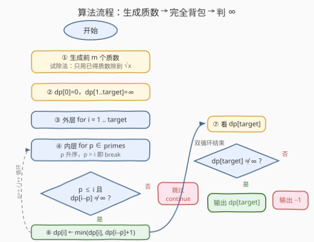

# 目标和所需的最小质数个数

- **题目名称**：目标和所需的最小质数个数
- **链接**：[3610. Minimum Number of Primes to Sum to Target](https://leetcode.cn/problems/minimum-number-of-primes-to-sum-to-target/)
- **难度**：中等
- **标签**：数组、数学、动态规划、数论

## 1. 题目概述

> ⚠️ 本题为 LeetCode 付费题，题意描述根据官方示例用例与 hints 重建，可能与官方题面有出入。

给定两个整数 `target` 和 `m`。取**前 `m` 个质数**构成集合 `[2, 3, 5, 7, 11, ...]`，每个质数**可以使用任意多次**。求最少需要多少个质数，使得它们的和**恰好等于** `target`；若无法凑出，返回 `-1`。

**示例 1**：

```text
输入：target = 10, m = 2
输出：4
解释：前 2 个质数为 [2, 3]。10 = 2 + 2 + 3 + 3，共 4 个（2 和 3 各用两次）。
```

**示例 2**：

```text
输入：target = 15, m = 5
输出：3
解释：前 5 个质数为 [2, 3, 5, 7, 11]。15 = 3 + 5 + 7，共 3 个。
```

**示例 3**：

```text
输入：target = 7, m = 6
输出：1
解释：前 6 个质数为 [2, 3, 5, 7, 11, 13]，7 本身就是其中之一，1 个即够。
```

**约束条件**（据示例与题意重建，具体上界以官方为准）：

- `1 <= target`，`1 <= m`，均为正整数；
- 官方测试量级下 `O(target × m)` 的动态规划可通过（hints 明示 DP + 生成前 `m` 个质数的做法）。

> 💡 **审题关键**：① 和要**恰好**等于 `target`，不是「至少」也不是「不超过」；② 每个质数可**重复使用**——这是「完全背包」而非 0-1 背包的信号；③ 大于 `target` 的质数永远用不上，内层循环可直接剪枝；④ `target = 1` 恒为 `-1`（1 不是质数，最小质数是 2）；⑤ `m = 1` 时只有质数 2 可用，奇数 `target` 均为 `-1`。

---

## 2. 解题思路

### 2.1 暴力思路：DFS 枚举组合 / 贪心取大质数

最直白的做法是递归枚举：从 `target` 出发，每一步任选一个质数 `p` 扣减，减到 0 记一次成功，取所有方案的最小长度。不做记忆化时，递归树的每个节点分出 `m` 个分支，深度可达 `target / 2`（全用 2），最坏规模是指数级。

另一种直觉是**贪心：每次优先扣最大的质数**。反例立刻出现：

```text
target = 6, m = 3（质数 {2, 3, 5}）
贪心：先扣 5 → 余 1，卡死（1 无法由任何质数凑出）→ 若不回溯会误判 -1
最优：6 = 3 + 3 → 只需 2 个
```

「当前最大」的局部选择会破坏后续的可分解性，贪心没有最优子结构，必须回溯或换框架。

> ⚠️ 瓶颈在于「凑出 i 的最少个数」被当成路径问题反复求解。突破口：**定义 dp[i] 一次性算清每个前缀和的答案**，大问题的解由小问题的解拼出——这正是硬币找零（322 零钱兑换）的完全背包模板。

### 2.2 核心观察：质数当硬币，完全背包求最少个数

![核心观察：前 m 个质数当硬币，dp[i] = min(dp[i−p] + 1) 的转移](../images/p3610_primes_coin_dp.svg)

**观察一：`dp[i]` 的定义天然覆盖所有子问题。** 设 $dp[i]$ 为「凑出和恰好为 $i$ 所需的最少质数个数」，$dp[0] = 0$（什么都不取），凑不出记为 $\infty$。若某个最优方案的最后一个质数是 $p$，则剩下的部分恰是「凑出 $i - p$」的最优方案——**枚举最后一枚硬币**即得转移：

$$dp[i] = \min_{p \in \texttt{primes},\ p \le i} \big( dp[i-p] + 1 \big)$$

**观察二：质数可重复使用 ⇒ 完全背包。** 转移里 $dp[i-p]$ 与 $dp[i]$ 同处一维数组且允许「自己更新自己的下游」，这正是完全背包的形态（对比 0-1 背包需倒序遍历避免复用）。求**最少个数**时，两层循环（外层容量、内层物品，或反过来）都正确——顺序只影响「哪些方案被重复计数」，而 $\min$ 运算对重复访问天然幂等。

**观察三：`∞` 哨兵统一「不可达」。** $dp[1] = \infty$（1 不是质数，无合法转移），所有依赖它的状态保持 $\infty$。最终 $dp[\text{target}] = \infty$ 即输出 $-1$——**用哨兵值代替显式的可行性判断**，转移方程不必分叉。

> 💡 一句话：本题 = 「生成前 `m` 个质数」+「322 零钱兑换」两件套。硬币面值恰好是质数只是换皮，考点在质数生成与完全背包的拼接。

### 2.3 算法流程图



**逻辑执行步骤**：

| 步骤 | 操作 | 说明 |
|------|------|------|
| ① 生成质数 | 从 2 起逐个候选，用**已生成的质数**试除到 $\sqrt{x}$ | 前 `m` 个即停；只需试除质因子，天然加速 |
| ② 初始化 | `dp[0] = 0`，`dp[1..target] = ∞` | ∞ 哨兵表示不可达 |
| ③ 外层 | `for i = 1 .. target` | 从小到大算每个和的最少个数 |
| ④ 内层 | `for p in primes`（升序），`p > i` 即 `break` | 质数升序存放，越界即可剪枝 |
| ⑤ 判定 | `dp[i-p] ≠ ∞`？ | 前驱不可达则本转移无效，跳过 |
| ⑥ 松弛 | `dp[i] = min(dp[i], dp[i-p] + 1)` | 完全背包核心转移 |
| ⑦ 收尾 | `dp[target] ≠ ∞` ? 输出 `dp[target]` : 输出 `-1` | ∞ 判定即可行性判定 |

> ⚠️ 步骤④的 `break` 依赖 `primes` **升序**这一不变量：一旦某个 `p > i`，后面的质数只会更大，整段剪掉。生成阶段按从小到大追加，天然有序，无需额外排序。

### 2.4 示例演算（示例 1：target = 10, m = 2）

可用质数为 `{2, 3}`，按 `i` 从小到大填表：

| i | 候选转移 | dp[i] | 最优拆解 |
|---|----------|-------|----------|
| 0 | —（边界） | 0 | 空集 |
| 1 | 无 p ≤ 1 | ∞ | 凑不出（1 不是质数） |
| 2 | dp[0]+1 | 1 | 2 |
| 3 | dp[1]+1(∞)、dp[0]+1 | 1 | 3 |
| 4 | dp[2]+1 | 2 | 2+2 |
| 5 | dp[3]+1、dp[2]+1 | 2 | 2+3 |
| 6 | dp[4]+1、dp[3]+1 | 2 | 3+3 |
| 7 | dp[5]+1、dp[4]+1 | 3 | 2+2+3 |
| 8 | dp[6]+1、dp[5]+1 | 3 | 2+3+3 |
| 9 | dp[7]+1、dp[6]+1 | 3 | 3+3+3 |
| **10** | **dp[8]+1 = 4、dp[7]+1 = 4** | **4** | **2+2+3+3** ✅ |

输出 `dp[10] = 4`，与示例一致。

---

## 3. 参考代码

### C++

```cpp
class Solution {
public:
    int minNumberOfPrimes(int target, int m) {
        vector<int> primes;
        for (int x = 2; (int)primes.size() < m; ++x) {
            bool ok = true;
            for (int p : primes) {
                if (1LL * p * p > x) break;
                if (x % p == 0) { ok = false; break; }
            }
            if (ok) primes.push_back(x);
        }

        const int INF = INT_MAX / 2;
        vector<int> dp(target + 1, INF);
        dp[0] = 0;
        for (int i = 1; i <= target; ++i) {
            for (int p : primes) {
                if (p > i) break;
                if (dp[i - p] + 1 < dp[i]) dp[i] = dp[i - p] + 1;
            }
        }
        return dp[target] >= INF ? -1 : dp[target];
    }
};
```

> 💡 **写法要点**：
> - 试除判质数**只用已生成的质数**除到 $\sqrt{x}$：合数必有不超过其平方根的**质**因子，而更小的质数都已在 `primes` 里——正确性与效率兼得。
> - `1LL * p * p > x` 防溢出：第 `m` 个质数可能很大，平方超出 `int`。
> - `INF` 取 `INT_MAX / 2` 而非 `INT_MAX`：`dp[i-p] + 1` 才不会溢出为负数，哨兵运算安全。
> - 内层 `p > i` 用 `break` 而非 `continue`：`primes` 升序，其后全超界。

### Python

```python
class Solution:
    def minNumberOfPrimes(self, target: int, m: int) -> int:
        primes = []
        x = 2
        while len(primes) < m:
            if all(x % p for p in primes if p * p <= x):
                primes.append(x)
            x += 1

        INF = float('inf')
        dp = [0] + [INF] * target
        for i in range(1, target + 1):
            for p in primes:
                if p > i:
                    break
                if dp[i - p] + 1 < dp[i]:
                    dp[i] = dp[i - p] + 1
        return dp[target] if dp[target] != INF else -1
```

> 💡 **写法要点**：
> - `all(x % p for p in primes if p * p <= x)` 一行判质数：生成器短路，遇到第一个能整除的质因子立即 `False`。
> - `[0] + [INF] * target` 初始化 `dp`，`dp[0] = 0` 语义一目了然。
> - `float('inf')` 参与加法不溢出，收尾一个三元表达式判 `∞` 即可。

---

## 4. 复杂度分析

| 维度 | 复杂度 | 说明 |
|------|--------|------|
| **时间复杂度** | $O(m \cdot \sqrt{P} + \text{target} \times m)$ | $P$ 为第 $m$ 个质数。生成阶段每个候选 $x$ 试除 $O(\pi(\sqrt{x}))$ 次（$\pi$ 为质数计数函数，粗界 $O(\sqrt{P})$）；DP 阶段双重循环，内层因升序 `break` 实际只访问 $p \le i$ 的质数 |
| **空间复杂度** | $O(\text{target} + m)$ | `dp` 数组 $O(\text{target})$ + 质数表 $O(m)$ |

> - DP 部分是瓶颈上界：最坏 `target × m` 次常数操作；实际内层只跑到 $p \le i$ 即 $O(\pi(i))$ 次，均摊远小于上界。
> - 若 `m` 很大而 `target` 不大，可只保留 $\le \text{target}$ 的质数参与 DP（生成阶段顺手截断），内层循环更短。

---

## 5. 扩展：质数生成的筛法与三种背包变体

**批量生成前 m 个质数：埃氏筛 + Rosser 上界。** 试除法逐个判适合 `m` 小的场景；`m` 大时可先用数论上界圈定筛的范围：对 $m \ge 6$，第 $m$ 个质数满足 $p_m < m(\ln m + \ln\ln m)$（Rosser 定理）。据此开数组做埃氏筛，复杂度 $O(P \log\log P)$，一次性产出全部质数后取前 `m` 个。

**同一个 dp 数组，三种问法对照**（以本题质数硬币为背景）：

| 变体 | 题目原型 | 关键差异 |
|------|----------|----------|
| 最少个数（本题） | 322 零钱兑换 | 求 $\min$，两层循环**顺序无关** |
| 方案计数 | 518 零钱兑换 II | 求和计数，必须**外层物品、内层容量**，否则「2+3」与「3+2」被重复计数 |
| 每个质数至多一次 | 0-1 背包 | 内层容量**倒序**遍历，防止同一物品被复用 |

**BFS 视角的最短路等价**：把每个 $0 \le i \le \text{target}$ 看作节点，向 $i + p$（$p \le \text{target} - i$）连一条边权为 1 的有向边，则「最少质数个数」= 节点 $0$ 到 $\text{target}$ 的**最短路**——边权全为 1，BFS 按层扩展的次序与 `dp` 按 $i$ 递增填表的次序完全同构。看到「最少步数凑到目标」类问题，DP 与 BFS 两把刀可以随时互换。

---

## 6. 面试要点

**Q1：求最少个数时，为什么两层循环的内外顺序可以交换？换成方案计数为什么不行？**

> 求 $\min$ 时每个 $dp[i]$ 只关心「所有可行转移的最小值」，重复访问同一状态不改变结果，顺序无关。计数时（518）每个方案被展开成一条转移路径，外层物品保证按「固定面值次序」组合、组合数不重；若外层容量，`2+3` 与 `3+2` 会被算作两个方案。

**Q2：`dp[1]` 为什么是 `∞`？哪些输入必然输出 `-1`？**

> 转移需要 $p \le 1$ 的质数，而最小质数是 2，故 `dp[1] = ∞`。必然 `-1` 的情形：`target = 1`（任何 `m`）；`m = 1` 且 `target` 为奇数（只有 2 可用）。其余 `m ≥ 2`、`target ≥ 2` 的情形一定能凑出：偶数 `target` 全用 2，奇数 `target ≥ 3` 用一个 3 加若干个 2。

**Q3：贪心「优先扣大质数」为什么错？举一个最小反例。**

> `target = 6, m = 3`：贪心扣 5 后余 1 卡死；最优是 `3 + 3`。原因是没有最优子结构——当前扣大数会破坏子问题的可分解性，这类「恰好凑和」问题必须 DP（或带记忆化的搜索）。

**Q4：试除法判质数为什么只需要用「已生成的更小质数」除到 √x？**

> 若 $x$ 是合数，必有一个质因子 $q \le \sqrt{x}$（两个都大于 $\sqrt{x}$ 的因子相乘超过 $x$）。而所有 $\le \sqrt{x}$ 的质数都已在 `primes` 中（它们比 $x$ 小、先生成），故逐一试除到 $p^2 > x$ 即可定论，无需试除合数因子。

**Q5：这道题与 279 完全平方数有什么异同？**

> 完全同构：279 的「硬币」是 $1, 4, 9, \dots$（完全平方数，可重复），本题是前 `m` 个质数（可重复），都是完全背包求最少个数，转移方程一模一样。差异只在硬币集合的生成方式——平方数是 $k^2$ 递推，质数需要试除或筛法。

> 💡 **一句话总结**：3610 = 质数生成（数论基本功）+ 完全背包最少个数（322 模板）。`∞` 哨兵统一可行性、升序 `break` 剪枝、`min` 对循环顺序免疫，是三个最值得带走的细节。

---

## 7. 同类练习题

- [322. 零钱兑换](https://leetcode.cn/problems/coin-change/)：完全背包求最少硬币个数的原型题，本题即其「质数面值」版
- [279. 完全平方数](https://leetcode.cn/problems/perfect-squares/)：硬币换成完全平方数，转移方程与本题逐字相同
- [518. 零钱兑换 II](https://leetcode.cn/problems/coin-change-ii/)：同一框架改求方案数，体会内外层顺序为何变得敏感
- [204. 计数质数](https://leetcode.cn/problems/count-primes/)：埃氏筛统计 `< n` 的质数个数，本题第 5 节筛法生成的对应练习
