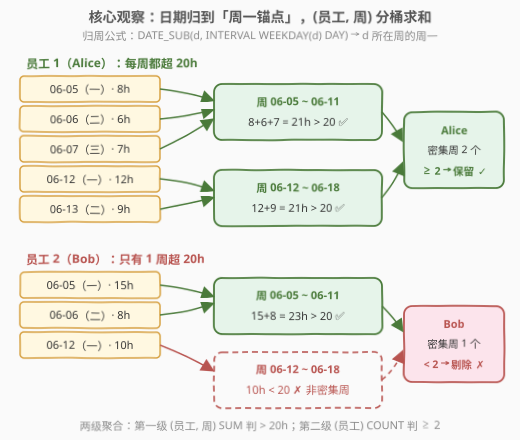
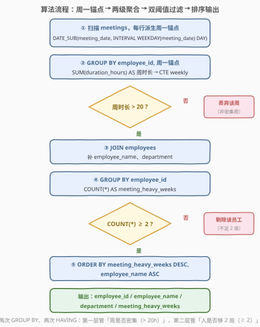

# LeetCode 查找超预订员工 题解

## 1. 题目概述

- **标题 / 题号**：查找超预订员工（#3611，medium）
- **链接**：https://leetcode.cn/problems/find-overbooked-employees/
- **难度**：中等
- **标签**：数据库、SQL、两级聚合、`GROUP BY` + `HAVING`、`WEEKDAY()`、`DATE_SUB()`、日期分桶、CTE、pandas

**表结构**：`employees` 表

| 列名 | 类型 |
|------|------|
| employee_id | int |
| employee_name | varchar |
| department | varchar |

- `employee_id` 是这张表的唯一主键。
- 每一行包含一个员工和他们部门的信息。

**表结构**：`meetings` 表

| 列名 | 类型 |
|------|------|
| meeting_id | int |
| employee_id | int |
| meeting_date | date |
| meeting_type | varchar |
| duration_hours | decimal |

- `meeting_id` 是这张表的唯一主键。
- 每一行表示一位员工参加的会议，`meeting_type` 可以是 `'Team'`、`'Client'` 或 `'Training'`。

**目标**：编写一个解决方案查找**会议密集型**员工——在任何给定周内，花费超过 50% 工作时间在会议上的员工。

- 假定一个标准工作周是 **40 小时**；
- 按每周（**周一至周日**）计算每位员工的**总会议小时数**；
- 某周会议总时长**超过 20 小时**（40 小时的 50%），该周即为一个**会议密集周**；
- 统计每位员工有多少个会议密集周，只保留**至少 2 个**密集周的员工；
- 返回 `employee_id`、`employee_name`、`department`、`meeting_heavy_weeks` 四列，按 `meeting_heavy_weeks` **降序**、再按 `employee_name` **升序**排列。

**示例 1**：

```text
输入：
employees 表:
+-------------+----------------+-------------+
| employee_id | employee_name  | department  |
+-------------+----------------+-------------+
| 1           | Alice Johnson  | Engineering |
| 2           | Bob Smith      | Marketing   |
| 3           | Carol Davis    | Sales       |
| 4           | David Wilson   | Engineering |
| 5           | Emma Brown     | HR          |
+-------------+----------------+-------------+

meetings 表:
+------------+-------------+--------------+--------------+----------------+
| meeting_id | employee_id | meeting_date | meeting_type | duration_hours |
+------------+-------------+--------------+--------------+----------------+
| 1          | 1           | 2023-06-05   | Team         | 8.0            |
| 2          | 1           | 2023-06-06   | Client       | 6.0            |
| 3          | 1           | 2023-06-07   | Training     | 7.0            |
| 4          | 1           | 2023-06-12   | Team         | 12.0           |
| 5          | 1           | 2023-06-13   | Client       | 9.0            |
| 6          | 2           | 2023-06-05   | Team         | 15.0           |
| 7          | 2           | 2023-06-06   | Client       | 8.0            |
| 8          | 2           | 2023-06-12   | Training     | 10.0           |
| 9          | 3           | 2023-06-05   | Team         | 4.0            |
| 10         | 3           | 2023-06-06   | Client       | 3.0            |
| 11         | 4           | 2023-06-05   | Team         | 25.0           |
| 12         | 4           | 2023-06-19   | Client       | 22.0           |
| 13         | 5           | 2023-06-05   | Training     | 2.0            |
+------------+-------------+--------------+--------------+----------------+

输出：
+-------------+----------------+-------------+---------------------+
| employee_id | employee_name  | department  | meeting_heavy_weeks |
+-------------+----------------+-------------+---------------------+
| 1           | Alice Johnson  | Engineering | 2                   |
| 4           | David Wilson  | Engineering | 2                   |
+-------------+----------------+-------------+---------------------+
```

**解释**：

- **Alice Johnson**：6/5–6/11 周 8+6+7=21h（>20 ✅），6/12–6/18 周 12+9=21h（>20 ✅），共 **2 个密集周** → 入选；
- **David Wilson**：6/5–6/11 周 25h（✅），6/19–6/25 周 22h（✅），共 **2 个密集周** → 入选；
- **Bob Smith**：6/5–6/11 周 15+8=23h（✅），6/12–6/18 周仅 10h（✗），只有 **1 个密集周** → 落选；
- **Carol Davis**（7h）、**Emma Brown**（2h）：没有任何密集周 → 落选；
- Alice 与 David 均为 2 个密集周（平局），按姓名升序 Alice 在前。

> 💡 **审题关键**：① 周的口径是**周一到周日**，不是「自然周编号」也不是「周日起始」；② 判定对象是「**同一员工同一周的会议总时长**」，先按周求和、再比 20，不是逐场会议比 20；③ 「超过 20 小时」是**严格大于**，恰好 20.0h 不算密集周；④ 「至少 2 周」是 **≥ 2**；⑤ 两个排序键方向相反：`meeting_heavy_weeks` 降序在前，`employee_name` 升序在后；⑥ 注意 David 的第二场会议在 6/19——它是**新一周的周一**，与 6/5–6/11 那周之间隔了整整一个无会议的周（6/12–6/18），说明密集周**不必连续**。

## 2. 解题思路

### 2.1 暴力思路：应用层逐员工逐周发查询 / SQL 硬编码日期区间

最直觉的做法是把「按周分桶」丢给应用层：先查出所有员工和全部会议，再在代码里两层循环——外层枚举员工，内层枚举周，对每个 `(员工, 周)` 组合发一条

```sql
SELECT SUM(duration_hours) FROM meetings
WHERE employee_id = ? AND meeting_date BETWEEN ? AND ?;
```

逐个判断是否超 20、再手工累加计数。员工数 × 周数条查询，每条都触发一次表扫描/索引探测，且分桶、计数、排序全在数据库外手工维护。

SQL 内的「暴力」变体是**硬编码每个周的日期区间**：`WHERE meeting_date BETWEEN '2023-06-05' AND '2023-06-11' OR ...` 把所有周写死——测试数据换一批日期就全部作废，且周数随时间增长，条件子句无限膨胀。

> ⚠️ 瓶颈在于把「周」当成**外部给定的常量**去逐个比对。突破口是让「周」变成**数据自己派生的列**——给每个日期算出它所在周的「规范化代表」（周一锚点），让 `GROUP BY` 自己完成分桶。

### 2.2 核心观察：周一锚点归周 + 两级聚合



**观察一：「同属一周」是等价关系，用周一锚点做规范代表。** 判定「两个日期是否在同一周（周一~周日）」需要一个**规范化的桶键**。MySQL 的 `WEEKDAY(d)` 返回 0（周一）~ 6（周日），于是：

$$\texttt{DATE\_SUB}(d,\ \texttt{INTERVAL WEEKDAY}(d)\ \texttt{DAY}) = d\ \text{所在周的周一}$$

同一 Mon–Sun 周内的所有日期，减去各自的 `WEEKDAY` 偏移后**落到同一个周一**；跨周日期落到不同周一。6/5、6/6、6/7 分别减 0、1、2 天都得到 6/5；6/12、6/13 得到 6/12。一个派生列把「日期」无损地翻译成「周编号」。

**观察二：两级聚合，每级 `HAVING` 管一层业务规则。** 题目有两层阈值——「周是否密集（> 20h）」作用在 `(员工, 周)` 上，「人是否入选（≥ 2 个密集周）」作用在 `员工` 上。恰好对应**嵌套的两层 `GROUP BY`**：

$$\underbrace{\texttt{GROUP BY (employee\_id, week\_start)}}_{\text{第一级：求周时长}} \xrightarrow{\ \texttt{HAVING SUM} > 20\ } \underbrace{\texttt{GROUP BY employee\_id}}_{\text{第二级：数密集周}} \xrightarrow{\ \texttt{HAVING COUNT} \ge 2\ } \text{输出}$$

**观察三：先过滤、后计数，顺序不可换。** 第二级 `COUNT(*)` 统计的必须是**经过第一级 `HAVING > 20` 筛剩的行**——先筛后数，数出来的才是「密集周个数」；若先 `COUNT` 全部周再想过滤，拿到的只是「有会议的周数」，语义就错了。这正是 SQL 执行顺序 `GROUP BY → HAVING →（外层）GROUP BY → HAVING` 的天然分工。

> 💡 一句话：**「周」用派生列归一，「阈值」用两层 `HAVING` 分层**——日期函数负责把连续时间切成桶，两级聚合负责把「周级事实」卷成「人级结论」。

### 2.3 算法流程图



**逻辑执行步骤**：

| 步骤 | 操作 | 说明 |
|------|------|------|
| ① 派生周锚点 | `DATE_SUB(meeting_date, INTERVAL WEEKDAY(meeting_date) DAY)` | 每行会议的日期翻译成所在周周一 |
| ② 第一级聚合 | `GROUP BY employee_id, week_start` + `SUM(duration_hours)` | 产出 `(员工, 周, 周时长)`，一行一个「员工周」 |
| ③ 周级过滤 | `HAVING SUM(duration_hours) > 20` | 只留密集周（严格大于，20.0 不算） |
| ④ 连接 | `JOIN employees USING (employee_id)` | 补 `employee_name`、`department` |
| ⑤ 第二级聚合 | `GROUP BY employee_id` + `COUNT(*)` | 每个员工一行，`COUNT` 即密集周个数 |
| ⑥ 人级过滤 | `HAVING COUNT(*) >= 2` | 「至少 2 周」= 大于等于 2 |
| ⑦ 排序 | `ORDER BY meeting_heavy_weeks DESC, employee_name ASC` | 双键排序，方向相反 |

> ⚠️ 两个 `HAVING` 各守一层：③ 里的 `HAVING` 作用在**第一级分组的组**（每个员工周）上，⑥ 里的作用在**第二级分组的组**（每个员工）上。把 `> 20` 错写到外层 `WHERE`（如 `WHERE total_hours > 20`）倒也等价，但把 `≥ 2` 写进第一级就是范畴错误——第一级的组里根本没有「周数」这个量。

### 2.4 示例演算

对示例数据跑两级聚合，第一级产出「员工周」（按周一锚点归周）：

| 员工 | 周（周一 ~ 周日） | 会议时长明细 | 周总时长 | > 20？ |
|------|------------------|--------------|---------|--------|
| Alice | 2023-06-05 ~ 06-11 | 8.0 + 6.0 + 7.0 | 21.0 | ✅ 密集 |
| Alice | 2023-06-12 ~ 06-18 | 12.0 + 9.0 | 21.0 | ✅ 密集 |
| Bob | 2023-06-05 ~ 06-11 | 15.0 + 8.0 | 23.0 | ✅ 密集 |
| Bob | 2023-06-12 ~ 06-18 | 10.0 | 10.0 | ✗ 丢弃 |
| Carol | 2023-06-05 ~ 06-11 | 4.0 + 3.0 | 7.0 | ✗ 丢弃 |
| David | 2023-06-05 ~ 06-11 | 25.0 | 25.0 | ✅ 密集 |
| David | 2023-06-19 ~ 06-25 | 22.0 | 22.0 | ✅ 密集 |
| Emma | 2023-06-05 ~ 06-11 | 2.0 | 2.0 | ✗ 丢弃 |

第二级按员工计数（只数 ✅ 的行）：

| 员工 | meeting_heavy_weeks | ≥ 2？ |
|------|---------------------|-------|
| Alice Johnson | 2 | ✅ 入选 |
| Bob Smith | 1 | ✗ 剔除 |
| Carol Davis | 0 | ✗ 剔除 |
| David Wilson | 2 | ✅ 入选 |
| Emma Brown | 0 | ✗ 剔除 |

收尾排序：Alice 与 David 同为 2，按 `employee_name` 升序 Alice Johnson 在前 → 输出 `Alice(2), David(2)`，与期望一致。注意 David 的两个密集周之间隔着空白的 6/12–6/18 周——**密集周不需要连续**，只数个数、不问位置。

## 3. 参考代码

### SQL（解法 A：CTE 两级聚合，推荐）

```sql
# Write your MySQL query statement below
WITH weekly AS (
    SELECT
        employee_id,
        DATE_SUB(meeting_date, INTERVAL WEEKDAY(meeting_date) DAY) AS week_start,
        SUM(duration_hours) AS total_hours
    FROM meetings
    GROUP BY employee_id, week_start
    HAVING SUM(duration_hours) > 20
)
SELECT
    e.employee_id,
    e.employee_name,
    e.department,
    COUNT(*) AS meeting_heavy_weeks
FROM weekly w
JOIN employees e ON e.employee_id = w.employee_id
GROUP BY e.employee_id, e.employee_name, e.department
HAVING COUNT(*) >= 2
ORDER BY meeting_heavy_weeks DESC, e.employee_name ASC;
```

> 💡 **写法要点**：
> - CTE `weekly` 完成第一级聚合：`GROUP BY` 里直接引用别名 `week_start`（MySQL 允许别名进 `GROUP BY`/`HAVING`），`HAVING SUM(...) > 20` 把非密集周就地筛掉；
> - 外层 `JOIN employees` 后做第二级聚合，`COUNT(*)` 数的就是筛剩的密集周；`GROUP BY` 把 `employee_name`、`department` 一并列入，兼容 `ONLY_FULL_GROUP_BY` 模式；
> - `ORDER BY meeting_heavy_weeks DESC` 引用的是 SELECT 别名（MySQL 允许），降序在前、姓名升序在后，两个方向相反的双键排序不能写反。

### SQL（解法 B：`YEARWEEK(d, 1)` 归周）

```sql
# Write your MySQL query statement below
SELECT
    e.employee_id,
    e.employee_name,
    e.department,
    COUNT(*) AS meeting_heavy_weeks
FROM (
    SELECT employee_id, SUM(duration_hours) AS total_hours
    FROM meetings
    GROUP BY employee_id, YEARWEEK(meeting_date, 1)
    HAVING SUM(duration_hours) > 20
) w
JOIN employees e ON e.employee_id = w.employee_id
GROUP BY e.employee_id, e.employee_name, e.department
HAVING COUNT(*) >= 2
ORDER BY meeting_heavy_weeks DESC, e.employee_name ASC;
```

> 💡 **写法要点**：
> - `YEARWEEK(d, 1)` 直接产出「年 + 周序号」整数（如 `202323`），**mode 1 表示周从周一起算**；同一 Mon–Sun 周内的日期得到相同值，跨年交接处也由「年 + 周」组合键兜住，不会错拼。
> - ⚠️ **mode 参数不能省**：`YEARWEEK(d)` 默认 mode 0 以**周日**为每周第一天，会把「周日」划给下一周，与本题「周一至周日」的口径直接冲突——这是本题最容易踩的口径坑。等价的周一锚点写法还有 `DATE_FORMAT(d, '%x-%v')`。
> - 与解法 A 相比只是「周键」的表达式不同：A 产出可读的周一日期，B 产出紧凑的年周整数，分组语义完全一致；B 用派生表代替 CTE，老版本 MySQL（不支持 `WITH`）也能跑。

### Python（pandas）

```python
import pandas as pd


def find_overbooked_employees(employees: pd.DataFrame, meetings: pd.DataFrame) -> pd.DataFrame:
    m = meetings.copy()
    m["meeting_date"] = pd.to_datetime(m["meeting_date"])
    m["week_start"] = m["meeting_date"] - pd.to_timedelta(m["meeting_date"].dt.weekday, unit="D")

    weekly = m.groupby(["employee_id", "week_start"], as_index=False)["duration_hours"].sum()
    heavy = weekly[weekly["duration_hours"] > 20]

    counts = (
        heavy.groupby("employee_id", as_index=False)
        .size()
        .rename(columns={"size": "meeting_heavy_weeks"})
    )
    counts = counts[counts["meeting_heavy_weeks"] >= 2]

    out = employees.merge(counts, on="employee_id")
    out = out.sort_values(["meeting_heavy_weeks", "employee_name"], ascending=[False, True])
    return out[["employee_id", "employee_name", "department", "meeting_heavy_weeks"]].reset_index(drop=True)
```

> 💡 **pandas 对照**：
> - `dt.weekday` 返回 0（周一）~ 6（周日），与 MySQL `WEEKDAY()` 完全同约定；`日期 - weekday 天` 即「周一锚点」，两行完成 SQL 里的 `DATE_SUB(... INTERVAL WEEKDAY ...)`；
> - 更地道的替代是 `m["meeting_date"].dt.to_period("W-SUN")`——`W-SUN` 表示「以周日收尾的周」，恰好就是 Mon–Sun 周，直接当分组键用；
> - `groupby(...).size()` 数的是**过滤后**每个员工的行数（密集周个数），对应第二级 `COUNT(*)`；
> - 若 `heavy` 为空（无人达标），`size()` 返回空表，merge 后输出空 DataFrame，行为正确。

## 4. 复杂度分析

| 维度 | 复杂度 | 说明 |
|------|--------|------|
| **时间复杂度** | $O(M + E)$ | 一趟扫描 `meetings`（$M$ 行）完成第一级哈希分组；产出至多 $G \le M$ 个「员工周」，第二级分组与 `JOIN employees`（$E$ 行）再各花线性时间 |
| **空间复杂度** | $O(G + E)$ | 第一级聚合结果 $G$ 个「员工周」行 + 输出至多 $E$ 行 |

> - 两级分组都是哈希聚合，代价与各自的输入行数成线性比；第一级的输出（密集周）通常远小于 $M$，第二级更便宜。
> - 若 `meetings (employee_id, meeting_date)` 上有复合索引，第一级分组可沿索引序完成，避免额外哈希表；纯判题场景无需考虑。

## 5. 扩展：窗口函数一趟写法与跨年周

**窗口函数版：第二级聚合不落地。** 第二级「按员工计数」也可以用 `COUNT/SUM OVER (PARTITION BY employee_id)` 在第一级结果的**每一行上**直接算出，免去外层再 `GROUP BY`：

```sql
WITH weekly AS (
    SELECT
        employee_id,
        DATE_SUB(meeting_date, INTERVAL WEEKDAY(meeting_date) DAY) AS week_start,
        SUM(duration_hours) AS total_hours
    FROM meetings
    GROUP BY employee_id, week_start
)
SELECT DISTINCT
    employee_id,
    employee_name,
    department,
    meeting_heavy_weeks
FROM (
    SELECT
        w.employee_id,
        e.employee_name,
        e.department,
        SUM(w.total_hours > 20) OVER (PARTITION BY w.employee_id) AS meeting_heavy_weeks
    FROM weekly w
    JOIN employees e ON e.employee_id = w.employee_id
) t
WHERE meeting_heavy_weeks >= 2
ORDER BY meeting_heavy_weeks DESC, employee_name ASC;
```

要点：MySQL 布尔表达式返回 `0/1`，`SUM(条件) OVER (PARTITION BY 员工)` 即「该员工的密集周个数」——注意这里**没有**先 `HAVING`，而是让窗口直接统计每个员工 `> 20` 的周数，一列同时完成「过滤 + 计数」；由于每个「员工周」都带着同样的计数值，最外层要 `DISTINCT` 把每周一行折叠回每人一行。

**跨年的周：锚点法天然正确。** 例如 2023-12-31 是周日，其周一锚点为 2023-12-25；2024-01-01 是周一，锚点即自身——两者分属不同的周，互不混桶。反之 2024-01-07（周日）与 2024-01-01（周一）锚点同为 2024-01-01，正确同桶。`YEARWEEK(d, 1)` 靠「年 + 周序号」组合键达到同样效果；若误用 `YEARWEEK(d)`（周日起始）或 `WEEK(d)`（丢掉年份），跨年边界处就会把不同周的会议混进同一个桶。

> 💡 选择建议：需要**可读的周标签**（报表里展示「哪一周」）用周一锚点日期；只需要**分组正确性**用 `YEARWEEK(d, 1)`。两者都切记 mode/口径要对齐「周一起始」。

## 6. 面试要点

**Q1：`WEEKDAY()` 和 `DAYOFWEEK()` 有什么区别？为什么 `DATE_SUB(d, INTERVAL WEEKDAY(d) DAY)` 能把日期归到所在周？**

> `WEEKDAY(d)` 周一返回 0、周日返回 6；`DAYOFWEEK(d)` 周日返回 1、周六返回 7（奥丁历约定）。两者都能判星期，但**编号约定不同**，混用会错位。归周用 `WEEKDAY`：日期 $d$ 减去 `WEEKDAY(d)` 天，恰好抵消掉「距本周周一的偏移」，同一 Mon–Sun 周内的所有日期都落到同一个周一日期上——这就是「规范化桶键」的思想（与 1454 活跃用户里 `DATE_SUB(日期, 间隔)` 归一连续日期同一招）。

**Q2：为什么必须两次 `GROUP BY`？一次能不能搞定？**

> 两层阈值作用的**粒度不同**：`> 20` 是「员工周」级的事实，`≥ 2` 是「员工」级的结论。一次 `GROUP BY employee_id, week` 只能得到每个员工周一行，无法在同层同时产出「按员工汇总的周计数」——除非借助窗口函数（见第 5 节），用 `SUM(...) OVER (PARTITION BY employee_id)` 在第一级结果的行上直接算计数，但那本质上是把第二次聚合改写成窗口投影，聚合逻辑仍然是两层。

**Q3：两个 `HAVING` 的条件互换位置会怎样？**

> 语义直接崩坏。`HAVING SUM > 20` 若不在第一级就地过滤，第二级 `COUNT(*)` 数到的是「有会议的周数」而非「密集周数」；而 `COUNT(*) >= 2` 若塞进第一级，则是在数「每个员工周的行数」（恒为 1），毫无意义。**过滤必须发生在它所对应粒度的那一层聚合上**——先筛后数，数出来的才是目标集合的大小。

**Q4：「超过 20 小时」和「至少 2 周」的边界怎么把握？**

> 「超过」= 严格大于（`> 20`），恰好 20.0h 的周不算密集；「至少」= 大于等于（`>= 2`），恰好 2 个密集周入选。中文题面里「超过 / 至少」是两把尺子，翻译成 SQL 时一个 `>` 一个 `>=`，不要顺手都写成同一个。本题数据里没有卡在 20.0 整的周，但边界写错在构造数据下必挂。

**Q5：pandas 里怎么复刻周一锚点？和 SQL 的约定一致吗？**

> `pd.to_datetime(s).dt.weekday` 返回 0（周一）~ 6（周日），与 MySQL `WEEKDAY()` 同约定；`s - pd.to_timedelta(s.dt.weekday, unit='D')` 即周一锚点。更简洁的惯用法是 `dt.to_period("W-SUN")`（以周日收尾的周，即 Mon–Sun 周），可直接作分组键。务必先 `to_datetime`——若列保持 `object` 字符串类型，`dt` 访问器会直接报错。

> 💡 **一句话总结**：3611 = 「日期 → 周一锚点」的日期分桶 + 「周级求和判 `> 20` → 人级计数判 `>= 2`」的两级 `GROUP BY`/`HAVING`。两个最值得带走的细节：**`YEARWEEK` 不带 mode 参数是周日起始的坑**；**过滤必须发生在对应粒度的聚合层，先筛后数**。

## 同类练习题

| # | 题目 | 与本题的关联 |
|---|------|-------------|
| 1843 | [可疑银行账户](https://leetcode.cn/problems/suspicious-bank-accounts/) | 同样是「先按 (账户, 月) 聚合判阈值，再二次聚合判定」的两级套路，本题的月版亲戚 |
| 1565 | [按月统计订单数与顾客数](https://leetcode.cn/problems/unique-orders-and-customers-per-month/) | 日期截断到月做分组键，体会「日期 → 周期桶」的通用范式 |
| 2298 | [周末任务计数](https://leetcode.cn/problems/tasks-count-in-the-weekend/) | `WEEKDAY`/`DAYOFWEEK` 判断星期的条件聚合入门，熟悉两套编号约定 |
| 1454 | [活跃用户](https://leetcode.cn/problems/active-users/) | `DATE_SUB` 日期归一 + 自连接判连续登录，「规范化日期键」技巧的进阶应用 |
| 2228 | [7天内两次购买的用户](https://leetcode.cn/problems/users-with-two-purchases-within-seven-days/) | 日期差比较的另一种玩法，与「固定周期分桶」互为补充 |
