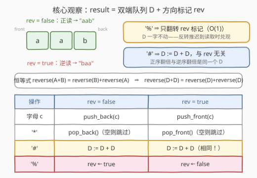
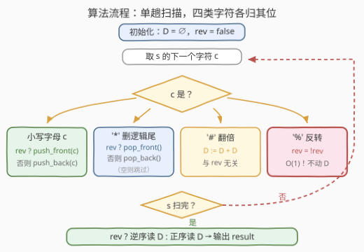

# LeetCode 用特殊操作处理字符串 I 题解

## 1. 题目概述

- **标题 / 题号**：用特殊操作处理字符串 I（#3612，medium）
- **链接**：https://leetcode.cn/problems/process-string-with-special-operations-i/
- **难度**：中等
- **标签**：字符串、模拟、双端队列

**题意**：给你一个字符串 `s`，由小写英文字母和三种特殊字符 `*`、`#`、`%` 组成。从左到右处理 `s` 中的每个字符，构造新字符串 `result`：

- **小写字母**：将其添加到 `result` 末尾；
- `'*'`：**删除** `result` 中的最后一个字符（如果存在）；
- `'#'`：**复制**当前 `result` 并追加到其自身后面，即 $result \leftarrow result + result$；
- `'%'`：**反转**当前 `result`。

处理完 `s` 中所有字符后，返回最终的 `result`。

**示例 1**：

```text
输入：s = "a#b%*"
输出："ba"
解释：
  i    s[i]    操作             当前 result
  0    'a'     添加 'a'         "a"
  1    '#'     复制 result      "aa"
  2    'b'     添加 'b'         "aab"
  3    '%'     反转 result      "baa"
  4    '*'     删除最后一个字符  "ba"
```

**示例 2**：

```text
输入：s = "z*#"
输出：""
解释：'z' 添加后为 "z"，'*' 删除后为 ""，'#' 复制空串仍是 ""。
```

**约束**：

- `1 <= s.length <= 20`
- `s` 只包含小写英文字母和特殊字符 `*`、`#`、`%`。

> 💡 **审题关键**：① `'*'` 作用在**空的** `result` 上是空操作——不报错、不引入字符，代码里 pop 前必须判空；② `'#'` 是**翻倍**，长度按 2 的幂增长：`"a"` 后跟 19 个 `'#'` 就有 $2^{19} \approx 5.2 \times 10^5$ 个字符，这个上界正是本题范围设定的灵魂；③ `'%'` 反转的是**当前整个** `result`，与后续操作叠加时极易看花眼——下文的「方向标记」就是治这个的。

## 2. 解题思路

### 2.1 直觉做法：可变数组直接模拟

把 `result` 放进可变数组（C++ 的 `string`、Python 的 `list`），逐字符照做：

| 字符 | 数组操作 | 单次代价 |
|------|----------|----------|
| 字母 | `push_back` / `append` | $O(1)$ 均摊 |
| `'*'` | `pop_back` | $O(1)$ |
| `'#'` | 整段自拼接 | $O(L)$ |
| `'%'` | 整段 `reverse` | $O(L)$ |

$n \le 20$、串长 $L \le 2^{19}$，最坏也只有 $n \cdot 2^{19} \approx 10^7$ 次字符操作，直接通过——**本题「模拟」标签的本意就是它**。

但要看清天花板：这套做法的时间是 $O(n \cdot 2^n)$ 量级（`'#'` 与 `'%'` 都要整段搬运），$n$ 一大就爆炸。续作 [3614（困难）](https://leetcode.cn/problems/process-string-with-special-operations-ii/) 把 $n$ 提到 $10^5$、`result` 长度提到 $10^{15}$，物化整个串的路彻底堵死。在那之前，先把本解法里"每次 `'%'` 都整段翻转"这个最扎眼的浪费修掉。

### 2.2 核心观察：双端队列 + 方向标记，把「反转」留给读的时候



用**双端队列 `D`** 存字符，再配一个布尔**方向标记 `rev`**：

- $rev = \text{false}$：逻辑串 `result` = `D` **从左往右**读；
- $rev = \text{true}$：逻辑串 `result` = `D` **从右往左**读，即 $result = \mathrm{reverse}(D)$。

**洞察一：`'%'` 不必真的翻转数据。** 反转一个"从右往左读"的串，等于把它改回"从左往右读"——**只翻转 `rev` 标记，`D` 一个字符都不动**，$O(1)$。这是「**惰性求值**」：把"反转"这个动作记账挂起，推迟到最终读取时才兑现，与线段树的 lazy tag 是同一思想。

**洞察二：`'#'` 翻倍与方向无关。** 只需一条恒等式（$A$、$B$ 为任意串）：

$$\mathrm{reverse}(A + B) = \mathrm{reverse}(B) + \mathrm{reverse}(A)$$

取 $A = B = D$ 得 $\mathrm{reverse}(D + D) = \mathrm{reverse}(D) + \mathrm{reverse}(D)$：**"正序串翻倍"与"逆序串翻倍"恰好是同一个 `D` 的两种读法**。所以无论 `rev` 取值如何，`'#'` 一律执行 $D \leftarrow D + D$，标记不动。

四种操作在两种方向下的映射：

| 操作 | $rev = \text{false}$ | $rev = \text{true}$ |
|------|----------------------|---------------------|
| 字母 `c` | `push_back(c)` | `push_front(c)` |
| `'*'` | `pop_back()`（空则跳过） | `pop_front()`（空则跳过） |
| `'#'` | $D \leftarrow D + D$ | $D \leftarrow D + D$（**完全相同**） |
| `'%'` | $rev \leftarrow \text{true}$ | $rev \leftarrow \text{false}$ |

两个"头尾互换"为什么是对的？以字母为例：$rev = \text{true}$ 时 $result = \mathrm{reverse}(D)$，追加 `c` 后

$$result' = \mathrm{reverse}(D) + c = \mathrm{reverse}(c + D)$$

（第二条等号正是上面的恒等式），故新的队列表示就是 $c + D$——`push_front(c)`。`'*'` 同理：逻辑串的"最后一个字符"在 $rev = \text{true}$ 时是 `D` 的**队头**，故 `pop_front()`。

收尾输出：$rev = \text{false}$ 从左往右读 `D`，$rev = \text{true}$ 从右往左读 `D`。

> 💡 一句话：**`result` 只是 `D` 的两种读法之一，`'%'` 不过是换一种读法**。四种操作全部坍缩成队列端点的 O(1) 原语（唯一例外是 `'#'` 的搬运，而那是输出本身的体积，躲不掉）。

### 2.3 算法流程图



**逻辑执行步骤**：

| 步骤 | 操作 | 说明 |
|------|------|------|
| ① 初始化 | `D` 为空，`rev = false` | 双端队列 + 方向标记 |
| ② 读字符 | 依次取 `s` 中每个 `c` | 单趟线性扫描 |
| ③ 字母 | `rev ? push_front(c) : push_back(c)` | 插到逻辑串尾端 |
| ④ `'*'` | 非空时 `rev ? pop_front() : pop_back()` | 删逻辑串尾端 |
| ⑤ `'#'` | `D := D + D` | 与 `rev` 无关 |
| ⑥ `'%'` | `rev = !rev` | O(1) 翻标记 |
| ⑦ 收尾 | `rev ? 逆序读 D : 正序读 D` | 得到最终 `result` |

### 2.4 示例演算（示例 1：`s = "a#b%*"`）

盯住 `D` 和 `rev` 两列，注意 `D` 里的字符自始至终**从未被搬动或翻转**：

| i | s[i] | 操作 | D | rev | 逻辑 result |
|---|------|------|-----|-----|-------------|
| 0 | `a` | 字母，`rev=false` → `push_back` | `[a]` | false | `"a"` |
| 1 | `#` | `D := D + D` | `[a, a]` | false | `"aa"` |
| 2 | `b` | 字母 → `push_back` | `[a, a, b]` | false | `"aab"` |
| 3 | `%` | **只翻转标记** | `[a, a, b]` | **true** | `"baa"` |
| 4 | `*` | `rev=true` → **`pop_front`** | `[a, b]` | true | `"ba"` |

最终 `rev = true`，从右往左读 `[a, b]` 得 `"ba"`，与示例一致。重点看第 3、4 步：`'%'` 一个字符没动；`'*'` 删的是**队头** `a`——因为在逆序视角下，队头才是逻辑串的"最后一个字符"。

## 3. 参考代码

### 方法一：直接模拟（$n \le 20$ 稳过，最贴合题意）

#### C++

```cpp
class Solution {
public:
    string processStr(string s) {
        string res;
        for (char c : s) {
            if (c == '*') {
                if (!res.empty()) res.pop_back();
            } else if (c == '#') {
                res += res;                       // 翻倍：自拼接
            } else if (c == '%') {
                reverse(res.begin(), res.end());
            } else {
                res.push_back(c);                 // 小写字母
            }
        }
        return res;
    }
};
```

> 💡 **写法要点**：`res += res` 对 `std::string` 自拼接是安全的（标准要求处理别名）；`pop_back` 前必须判空，对应题意"如果存在"。

#### Python

```python
class Solution:
    def processStr(self, s: str) -> str:
        res = []
        for c in s:
            if c == '*':
                if res:
                    res.pop()
            elif c == '#':
                res += res                        # 翻倍：自拼接
            elif c == '%':
                res.reverse()
            else:
                res.append(c)                     # 小写字母
        return ''.join(res)
```

> 💡 **写法要点**：用 `list` 而非 `str` 当 `result`——`str` 不可变，每次操作都要整段重建；`res += res` 是列表原地自拼接，`reverse()` 也是原地翻转。

### 方法二：双端队列 + 方向标记（`'%'` 与 `'*'` 降为 O(1)）

#### C++

```cpp
class Solution {
public:
    string processStr(string s) {
        deque<char> dq;
        bool rev = false;
        for (char c : s) {
            if (c >= 'a' && c <= 'z') {
                if (rev) dq.push_front(c);
                else     dq.push_back(c);
            } else if (c == '*') {
                if (!dq.empty()) {
                    if (rev) dq.pop_front();
                    else     dq.pop_back();
                }
            } else if (c == '#') {
                int n = dq.size();                // 按下标复制前半段：
                for (int i = 0; i < n; ++i)       // dq[i] 下标稳定，安全
                    dq.push_back(dq[i]);
            } else {                              // '%'
                rev = !rev;
            }
        }
        string ans;
        ans.reserve(dq.size());
        if (!rev) {
            for (char c : dq) ans.push_back(c);
        } else {
            for (auto it = dq.rbegin(); it != dq.rend(); ++it)
                ans.push_back(*it);               // 逆序读
        }
        return ans;
    }
};
```

> 💡 **写法要点**：
> - 翻倍不要写成 `for (char c : dq) dq.push_back(c)`——**尾插会使 deque 的迭代器失效**（但引用与下标稳定），按下标 `dq[i]` 访问则安全。
> - 读取阶段用反向迭代器 `rbegin()/rend()` 实现"从右往左读"。

#### Python

```python
from collections import deque

class Solution:
    def processStr(self, s: str) -> str:
        dq = deque()
        rev = False
        for c in s:
            if c == '*':
                if dq:
                    if rev: dq.popleft()
                    else:   dq.pop()
            elif c == '#':
                dq.extend(dq)                     # CPython 对自扩展有快照特判
            elif c == '%':
                rev = not rev
            else:                                 # 小写字母
                if rev: dq.appendleft(c)
                else:   dq.append(c)
        if rev:
            dq.reverse()                          # 统一成正序再拼接
        return ''.join(dq)
```

> 💡 **写法要点**：`dq.extend(dq)` 不是陷阱——CPython 的 `deque.extend` 检测到实参就是自身时，会先做一份 `list` 快照再追加（`Modules/_collectionsmodule.c` 中显式特判），任意规模实测正确；不放心可写 `dq.extend(list(dq))`。收尾 `dq.reverse()` 一把翻正，`join` 一次成型。

## 4. 复杂度分析

| 维度 | 复杂度 | 说明 |
|------|--------|------|
| 时间（方法一） | $O(n + \sum L_{\#} + \sum L_{\%})$，最坏 $O(n \cdot 2^n)$ | `'#'` 与 `'%'` 都要整段搬运；本题 $n \le 20$ 时约 $10^7$，轻松通过 |
| 时间（方法二） | $O(n + \sum L_{\#})$ | 字母、`'*'`、`'%'` 均为 $O(1)$；只剩 `'#'` 的复制，且其代价与串长增长同步，**输出敏感最优** |
| 空间（两法相同） | $O(\lvert result \rvert) \le 2^{19}$ | 串长上界 = 1 个字母 + 19 次 `'#'` 翻倍 $\approx 5.2 \times 10^5$ |

> ⚠️ 方法二的 `'#'` 仍是 $O(L)$——这不是缺陷而是下界：每次翻倍输出长度直接翻番，任何算法只要写出结果本身就至少要花 $O(L)$。方法二真正省掉的是 `'%'` 的整段翻转，以及朴素 `str` 模拟中的整段重建。

## 5. 扩展：3614 的倒推法——当 result 长到物化不了

[3614. 用特殊操作处理字符串 II](https://leetcode.cn/problems/process-string-with-special-operations-ii/)（困难）：规则一字不差，但 $n \le 10^5$、$\lvert result \rvert \le 10^{15}$、只问**下标 `k` 处的一个字符**。别提双端队列，连把 `result` 存下来都不可能。标准套路是**离线倒推**：

1. **正向扫长度**：每步操作对长度的影响是确定的——字母 $+1$、`'*'` 非空则 $-1$、`'#'` $\times 2$、`'%'` 不变。$O(n)$ 得到最终长度 $L$；若 $k \ge L$ 直接返回 `'.'`。
2. **逆向追位置**：维护"目标字符在当前串中的下标 `k`"，从最后一步往回走，每步把 `k` 映射回**上一个串**里的下标：
   - `'#'`（$S_i = S_{i-1} + S_{i-1}$）：若 $k \ge L_{i-1}$，令 $k \leftarrow k - L_{i-1}$（后半段是前半段的拷贝）；
   - `'%'`：$k \leftarrow L_i - 1 - k$（镜像）；
   - `'*'`：长度回涨 1，`k` 不变（被删的字符不可能存活到结尾，无需追踪）；
   - **字母**：若 $k = L_i - 1$，答案就是它，终止；否则长度 $-1$ 继续。

每步 $O(1)$，总 $O(n)$，全程不物化任何串。这与 [880. 索引处的解码字符串](../0801-0900/880_索引处的解码字符串.md) 是同一招：**正着模拟会指数爆炸时，把"位置"当状态倒着走**。

> 💡 若还想随时查询中间态，得上重武器：持久化平衡树（rope）+ 子树惰性翻转标记，拼接、翻转、随机访问都能 $O(\log)$——但对本题而言，倒推法轻得多。

## 6. 面试要点

**Q1：`'#'` 翻倍时为什么可以完全无视 `rev` 标记？**

> 由 $\mathrm{reverse}(A + B) = \mathrm{reverse}(B) + \mathrm{reverse}(A)$ 取 $A = B = D$，得 $\mathrm{reverse}(D + D) = \mathrm{reverse}(D) + \mathrm{reverse}(D)$：正序读的翻倍与逆序读的翻倍是同一个 `D` 的两种读法，故统一执行 $D := D + D$ 即可，标记不动。

**Q2：`rev = true` 时新字母为什么 `push_front` 而不是 `push_back`？**

> 此时逻辑串是 $\mathrm{reverse}(D)$，追加 `c` 后为 $\mathrm{reverse}(D) + c = \mathrm{reverse}(c + D)$，新表示恰是 `c` 拼在 `D` 前面，即 `push_front(c)`。同理，逻辑串的"最后一个字符"对应 `D` 的队头，故 `'*'` 执行 `pop_front()`。

**Q3：直接模拟就能过，学双端队列版有什么意义？**

> 本题 $n \le 20$ 暴力确实够；但 `'%'` 的 $O(L)$ 整段反转在长串上是性能杀手。"用标记记下反转、读取时才兑现"是通用武器：线段树的 lazy tag、[189. 轮转数组](https://leetcode.cn/problems/rotate-array/) 的三次翻转法，都是同一"惰性"思想。而 $n$ 大到物化都不可行时（3614），就得换倒推法。

**Q4：`'*'` 遇到空 `result` 该怎么处理？**

> 题意是"删除最后一个字符（如果存在）"——空串时是空操作。所有代码路径在 pop 前判空；漏判会空容器越界。

**Q5：`result` 的长度最坏能到多少？怎么估的？**

> $\le 2^{19}$：长度只在字母（$+1$）和 `'#'`（$\times 2$）时增长，20 个字符里用一个放字母、其余 19 个全放 `'#'`，得 $1 \times 2^{19} \approx 5.2 \times 10^5$。这也是评估各种模拟方案耗时上界的基准。

## 同类练习题

| # | 题目 | 与本题的关联 |
|---|------|-------------|
| 3614 | [用特殊操作处理字符串 II](https://leetcode.cn/problems/process-string-with-special-operations-ii/) | 规则相同的困难续作，$n$ 与串长爆炸，必须倒推第 `k` 位 |
| 844 | [比较含退格的字符串](https://leetcode.cn/problems/backspace-string-compare/)（[题解](../0801-0900/844_比较含退格的字符串.md)） | `'#'` 退格键即本题的 `'*'`，栈模拟招牌题 |
| 1047 | [删除字符串中的所有相邻重复项](https://leetcode.cn/problems/remove-all-adjacent-duplicates-in-string/)（[题解](../1001-1100/1047_删除字符串中的所有相邻重复项.md)） | 同样是"栈当 result 动态增删"的模拟 |
| 880 | [索引处的解码字符串](https://leetcode.cn/problems/decoded-string-at-index/)（[题解](../0801-0900/880_索引处的解码字符串.md)） | 扩展解码后求第 `k` 位，倒推法的原型 |
| 1598 | [文件夹操作日志搜集器](https://leetcode.cn/problems/crawler-log-folder/)（[题解](../1501-1600/1598_文件夹操作日志搜集器.md)） | 路径栈模拟，`"../"` 扮演 `'*'` |
