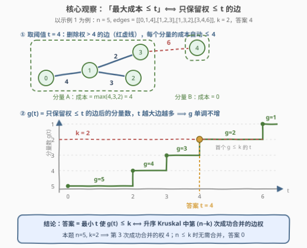
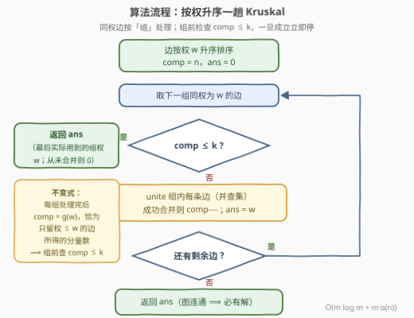

# LeetCode 最小化连通分量的最大成本 题解

## 1. 题目概述

- **标题 / 题号**：最小化连通分量的最大成本（#3613，medium）
- **链接**：https://leetcode.cn/problems/minimize-maximum-component-cost/
- **难度**：中等
- **标签**：并查集、图、排序、二分查找

**题意**：给定 $n$ 个节点（编号 $0$ 到 $n-1$）的**无向连通图**，`edges[i] = [u_i, v_i, w_i]` 表示连接 $u_i$ 与 $v_i$ 的无向边，权值为 $w_i$，另给整数 $k$。

可以移除任意数量的边，要求最终图中**至多**包含 $k$ 个连通分量。**连通分量的成本**定义为其内部边权的**最大值**（无边则成本为 $0$）。求所有分量中**最大成本的最小可能值**。

**示例 1**：

```text
输入：n = 5, edges = [[0,1,4],[1,2,3],[1,3,2],[3,4,6]], k = 2
输出：4
解释：移除权 6 的边 (3,4)，得到分量 {0,1,2,3}（成本 4）与 {4}（成本 0），
     最大成本为 4。
```

**示例 2**：

```text
输入：n = 4, edges = [[0,1,5],[1,2,5],[2,3,5]], k = 1
输出：5
解释：k = 1 要求保持全图连通，成本即保留边的最大权 5。
```

**约束**：

- $1 \le n \le 5 \times 10^4$
- $0 \le edges.length \le 10^5$
- $0 \le u_i, v_i < n$，$1 \le w_i \le 10^6$
- $1 \le k \le n$，输入图连通

> 💡 **读题关键**：典型的**「最小化最大值」**结构——删边越多、分量越散、成本越低，但分量数又被 $k$ 封顶。突破口在于把「成本上限 $t$」与「具体删哪些边」**解耦**：一旦发现「最大成本 $\le t$」可以等价翻译成「只保留权 $\le t$ 的边」（见 2.2 节），$2^m$ 的删边方案空间就塌缩成 $m+1$ 个阈值候选。

## 2. 解题思路

### 2.1 暴力思路：枚举删边子集

最直接：枚举 $2^m$ 个保留边子集，每个子集用一趟并查集算出分量数与各分量成本，在分量数 $\le k$ 的方案里取最大成本的最小值。$m \le 10^5$，$2^{10^5}$ 是天文数字。

稍「聪明」的方向是按权从大到小贪心删边，但「删哪条」互相牵连——删掉桥边分量数 $+1$、删掉非桥边成本可能下降，两者抢同一个预算 $k$，局部贪心没有显然的正确性。需要先建立一个**全局等价**，把搜索空间整个压掉。

### 2.2 核心观察：「最大成本 ≤ t」⟺「只保留权 ≤ t 的边」→ 升序 Kruskal 一趟



**观察一（等价转换，本题主菜）**：定义 $g(t)$ = **只保留权 $\le t$ 的边**后的连通分量数，则

$$\text{存在「分量数} \le k \text{ 且最大成本} \le t \text{」的删边方案} \iff g(t) \le k$$

- **（⇐）** 删光所有权 $> t$ 的边本身就是合法方案：分量数 $= g(t) \le k$，且每个分量内部的边权都 $\le t$，成本自然 $\le t$；
- **（⇒）** 任何成本 $\le t$ 的合法方案，保留的边全部满足 $w \le t$；把这些边**全部**加回来，分量只会「合并或不变」、数量只减不增，仍 $\le k$，即 $g(t) \le k$。

于是**答案 $= \min\{t : g(t) \le k\}$**——问题从「选边集」变成「选阈值」。

**观察二（单调性）**：$t$ 增大 ⟹ 保留边集扩大 ⟹ 分量只合不分 ⟹ $g(t)$ **单调不增**；且 $g$ 只在边权处跳变，故答案 $\in \{0\} \cup \{w_i\}$。这给了两条路：二分阈值（第 5 节），或者更妙的一趟扫描——

**观察三（Kruskal 视角，免二分）**：把边按权**升序**逐组并入并查集，`comp` 从 $n$ 出发、每成功合并一次减 1。持有不变式「处理完权 $\le w$ 的组后，`comp` 恰等于 $g(w)$」。于是 $g(t) \le k \iff$ 权 $\le t$ 的成功合并次数 $\ge n - k$，即

$$\boxed{\text{答案} = \text{升序 Kruskal 中第 } (n-k) \text{ 次成功合并的边权}}$$

（$n \le k$ 时无需任何合并，答案为 $0$。）直观地说：升序合并序列恰是 Kruskal 生成树的树边，第 $n-k$ 条树边就是「把图压到 $k$ 块」必须付出的最大代价。示例 1 中 $n - k = 3$，第 3 次成功合并是权 4 的边 $(0,1)$，答案 4。

> ⚠️ **易错点**：$k = 1$ 时答案**不是**全图最大边权，而是**最小生成树的最大边权**（瓶颈生成树）——非桥的贵边直接删掉并不增加分量数！例如三角形 $0\text{-}1(10)$、$1\text{-}2(1)$、$0\text{-}2(1)$，$k=1$ 的答案是 $1$ 而非 $10$。观察一的等价转换自动涵盖这一点：$g(1) = 1 \le 1$。

### 2.3 算法流程图



**逻辑执行步骤**：

| 步骤 | 操作 | 说明 |
|------|------|------|
| ① 初始化 | 边按 $w$ **升序**排序；`comp = n`，`ans = 0` | 同权边视作一组 |
| ② 组前检查 | `comp ≤ k ?` 成立 → 返回 `ans` | 已足够散，更贵的边全删 |
| ③ 整组合并 | `unite` 组内每条边，成功则 `comp−−`；`ans = w` | 自环/重边/冗余边被 `unite` 天然跳过 |
| ④ 循环/终止 | 还有组 → 回到 ②；边用尽 → 返回 `ans` | 图连通 ⟹ 终态 `comp = 1 ≤ k`，必有解 |

### 2.4 示例演算

以示例 1（$n=5$，$k=2$）演算，升序分组依次为 $[2], [3], [4], [6]$：

| 处理组 $w$ | 组内边 | 成功合并 | 合并后 `comp` | `ans` |
|-----------|--------|---------|--------------|-------|
| —（初始） | — | — | 5 | 0 |
| 2 | (1,3) | ✓ | 4 | 2 |
| 3 | (1,2) | ✓ | 3 | 3 |
| 4 | (0,1) | ✓ | 2 ≤ k → 下一组前停 | **4** |
| 6 | (3,4) | —（组前已停） | — | — |

- **示例 2**（$k=1$）：$n-k=3$，三条权 5 的边依次把 `comp` 压到 $4 \to 3 \to 2 \to 1$，第 3 次成功合并的权为 5，答案 5；
- 若 $k \ge n$：第一组前 `comp = n ≤ k`，直接返回 0（边全删光）。

## 3. 参考代码

### C++

```cpp
#include <numeric>

class Solution {
    vector<int> fa, sz_;
    int comp;

    int find(int x) {
        while (fa[x] != x) {
            fa[x] = fa[fa[x]];              // 路径压缩：隔代一跳
            x = fa[x];
        }
        return x;
    }
    void unite(int a, int b) {
        a = find(a); b = find(b);
        if (a == b) return;                 // 自环/重边/冗余边：天然跳过
        if (sz_[a] < sz_[b]) swap(a, b);    // 按大小合并
        fa[b] = a; sz_[a] += sz_[b];
        --comp;
    }

public:
    int minCost(int n, vector<vector<int>>& edges, int k) {
        sort(edges.begin(), edges.end(),
             [](auto& a, auto& b) { return a[2] < b[2]; });  // 权升序
        fa.resize(n);
        iota(fa.begin(), fa.end(), 0);
        sz_.assign(n, 1);
        comp = n;

        int ans = 0, i = 0, m = edges.size();
        while (i < m) {
            if (comp <= k) break;           // 已 ≤ k：更贵的边全删
            int w = edges[i][2];
            for (; i < m && edges[i][2] == w; ++i)  // 整组同权边
                unite(edges[i][0], edges[i][1]);
            ans = w;                        // 压到 ≤ k 的那一组权即答案
        }
        return ans;
    }
};
```

### Python

```python
class Solution:
    def minCost(self, n: int, edges: List[List[int]], k: int) -> int:
        fa = list(range(n))

        def find(a: int) -> int:
            while fa[a] != a:
                fa[a] = fa[fa[a]]           # 路径压缩：隔代一跳
                a = fa[a]
            return a

        edges.sort(key=lambda e: e[2])      # 权升序
        comp, ans, i, m = n, 0, 0, len(edges)
        while i < m:
            if comp <= k:                   # 已 ≤ k：更贵的边全删
                break
            w = edges[i][2]
            while i < m and edges[i][2] == w:   # 整组同权边
                a, b = find(edges[i][0]), find(edges[i][1])
                if a != b:                  # 自环/重边/冗余边天然跳过
                    fa[a] = b
                    comp -= 1
                i += 1
            ans = w                         # 压到 ≤ k 的那一组权即答案
        return ans
```

> 💡 上述解法已与暴力对拍验证：除两个官方示例外，$n \le 7$、$m \le 10$、$w_i \le 5$ 的 3000 组随机连通图（逐一枚举全部 $2^m$ 个保留边子集求最优）结果完全一致；用例中刻意混入自环、重边与高价非桥边等刁钻形态。

## 4. 复杂度分析

| 维度 | 复杂度 | 说明 |
|------|--------|------|
| 时间 | $O(m \log m + m\, \alpha(n))$ | 排序主导；并查集路径压缩 + 按大小合并，单次 `find/unite` 近似常数，$n \le 5\times10^4$、$m \le 10^5$ 瞬时完成 |
| 空间 | $O(n)$ | 并查集 `fa` / `sz` 数组（`edges` 原地排序，无额外拷贝） |

## 5. 扩展：二分答案版本（官方 hint 路线）

由观察二的**单调性**，也可以在值域 $[0, \max w_i]$ 上二分 $t$，判定函数 `check(t)` 用一趟并查集**只合并 $w \le t$ 的边**、数分量是否 $\le k$——与 3608 完全同款的「二分 + 并查集判定」骨架：

```python
class Solution:
    def minCost(self, n: int, edges: List[List[int]], k: int) -> int:
        def check(t: int) -> bool:          # 只留权 ≤ t 的边，分量数 ≤ k ？
            fa = list(range(n))

            def find(a: int) -> int:
                while fa[a] != a:
                    fa[a] = fa[fa[a]]       # 路径压缩：隔代一跳
                    a = fa[a]
                return a

            comp = n
            for u, v, w in edges:
                if w <= t:                  # 只并权 ≤ t 的边
                    a, b = find(u), find(v)
                    if a != b:
                        fa[a] = b
                        comp -= 1
            return comp <= k

        lo, hi = 0, max((e[2] for e in edges), default=0)
        while lo < hi:                      # 二分最小可行 t
            mid = (lo + hi) // 2
            if check(mid):
                hi = mid
            else:
                lo = mid + 1
        return lo
```

复杂度 $O(m\,\alpha(n) \log W)$，$W \le 10^6$ 约 20 轮（在排序去重后的边权 + 哨兵 0 上二分可降到 $\log m$ 轮）。与一趟 Kruskal 的 $O(m \log m)$ 渐进同阶，但 Kruskal 版把「排序」与「判定」融合成单趟扫描、常数更小且免每轮重建并查集——面试先讲等价转换与单调性（两种做法的共同根基），再落到一趟版本收尾最佳。

顺带一提，观察三还给出一个更省事的实现：不按「组」处理，直接数**成功合并次数**，第 $n-k$ 次成功合并发生时的边权即是答案（$n \le k$ 时返回 0），代码更短，只是把「组」的不变式隐式化了。

## 6. 面试要点

**Q1：为什么「最大成本 ≤ t」等价于「只保留权 ≤ t 的边」？**

> 分两向：（⇐）删光权 $> t$ 的边即合法方案，每个分量内部边权都 $\le t$，成本 $\le t$；（⇒）成本 $\le t$ 的方案其保留边全在 $\le t$ 内，把这些边**全部**加回只会让分量合并、数量只减不增，仍 $\le k$，故 $g(t) \le k$。这个等价把 $2^m$ 的方案空间压缩成 $m+1$ 个阈值候选，是全题的转折点。

**Q2：为什么可以一趟 Kruskal 而不用二分？**

> $g(t)$ 单调不增且只在边权处跳变。升序并入并查集时持有不变式「处理完权 $\le w$ 的组后 `comp` = $g(w)$」，`comp` 首次 $\le k$ 恰发生在第 $n-k$ 次成功合并所在的组，该组权即答案。二分的 $O(\log W)$ 轮「重建并查集 + 全量扫边」被一次排序 + 单趟扫描取代。

**Q3：k = 1 时答案是什么？为什么不是全图最大边权？**

> 是**最小生成树的最大边权**（瓶颈生成树）。非桥的贵边删掉不增加分量数；等价转换中 $g(t)$ 用的是「全部权 $\le t$ 的边」，自动剔除非必要贵边。反例：三角形边权 10/1/1，$k=1$ 答案是 1 而非 10。

**Q4：自环、重边、组内无效边怎么处理？**

> `unite` 时两端 `find` 相同直接跳过，天然无效化。同权按「组」处理的意义在于维持不变式「组后 `comp` = $g(w)$」；即使整组全是无效合并，`ans = w` 也无害——`comp` 没降，后续必然还要处理更贵的组并覆盖 `ans`；`comp` 一旦 $\le k$，下一组前即停。

**Q5：与 3608（包含 K 个连通分量需要的最小时间）是什么关系？**

> 同族镜像：3608 删边求「散到 $\ge k$ 块」、二分最小时刻、判定只并 `time > t` 的边；本题删边求「$\le k$ 块内的最小最大成本」、升序 Kruskal 一趟、只并 $w \le t$ 的边。两者都靠「保留边集 = 阈值子集」的单调性吃饭。

> 💡 **一句话总结**：「最大成本 $\le t$」⟺「只保留权 $\le t$ 的边」⟹ 答案 $= \min\{t : g(t) \le k\}$ = 升序 Kruskal 第 $(n-k)$ 次成功合并的边权；$k=1$ 时即最小生成树瓶颈。

## 同类练习题

| # | 题目 | 与本题的关联 |
|---|------|-------------|
| 1631 | [最小体力消耗路径](https://leetcode.cn/problems/path-with-minimum-effort/) | 同款「排序边 + 并查集」求瓶颈值，路径版的最小化最大边权 |
| 3608 | [包含 K 个连通分量需要的最小时间](https://leetcode.cn/problems/minimum-time-for-k-connected-components/) | 本题镜像——删到「至少 k 块」求最小时刻，二分 + 只并 `time > t` 的边 |
| 1101 | [彼此熟识的最早时间](https://leetcode.cn/problems/the-earliest-moment-when-everyone-become-friends/) | 升序 Kruskal 合并到 1 个分量的最经典骨架，即本题 $k=1$ 的「时间轴」版 |
| 778 | [水位上升的泳池中游泳](https://leetcode.cn/problems/swim-in-rising-water/) | 二分阈值 + 连通性判定的祖师爷，体会「二分版」与「Kruskal 一趟版」的互换 |
| 1489 | [找到最小生成树里的关键边和伪关键边](https://leetcode.cn/problems/find-critical-and-pseudo-critical-edges-in-minimum-spanning-tree/) | MST 结构专项，深挖「哪些树边不可替换」，与本题的瓶颈直觉互补 |
