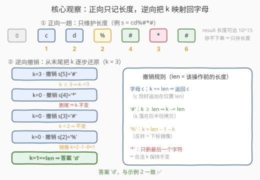
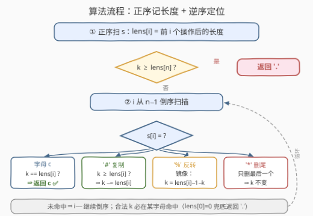

# 用特殊操作处理字符串II

- **题目名称**：用特殊操作处理字符串II
- **链接**：[3614. Process String with Special Operations II](https://leetcode.cn/problems/process-string-with-special-operations-ii/)
- **难度**：困难
- **标签**：字符串、模拟、逆向思维

## 1. 题目概述

给定一个字符串 `s`，由小写英文字母和特殊字符 `'*'`、`'#'`、`'%'` 组成，同时给定一个整数 `k`。请从左到右处理 `s` 的每个字符，构造字符串 `result`：

- **小写字母**：将其追加到 `result` 末尾；
- `'*'`：**删除** `result` 的最后一个字符（若存在）；
- `'#'`：把 `result` **复制一份**拼接到自身后面（长度翻倍）；
- `'%'`：**反转** `result`。

返回最终 `result` 中下标为 `k` 的字符（下标从 0 开始）；若 `k` 越界，返回 `'.'`。

**示例 1**：

```text
输入：s = "a#b%*", k = 1
输出："a"
解释："a" → "aa" → "aab" → "baa" → "ba"，下标 1 的字符是 'a'。
```

**示例 2**：

```text
输入：s = "cd%#*#", k = 3
输出："d"
解释："c" → "cd" → "dc" → "dcdc" → "dcd" → "dcddcd"，下标 3 的字符是 'd'。
```

**示例 3**：

```text
输入：s = "z*#", k = 0
输出："."
解释："z" → "" → ""，最终 result 为空串，k = 0 越界。
```

**约束条件**：

- $1 \le s.length \le 10^5$；
- `s` 只包含小写英文字母和 `'*'`、`'#'`、`'%'`；
- $0 \le k \le 10^{15}$；
- 处理 `s` 后得到的 `result` 的长度不超过 $10^{15}$。

> 💡 **审题关键**：① `result` 最长 $10^{15}$，**绝不可能把串真造出来**——`"a"` 后面跟 50 个 `'#'` 就有 $2^{50}$ 个字符；② 我们只要**一个字符**，不是整串；③ `k` 用 `long long`/`int` 溢出边界要第一时间警觉（$10^{15}$ 超 `int32`）。这是 3612（用特殊操作处理字符串 I，模拟版）的Hard 放大版：规则不变、规模爆炸，逼你放弃「正向造串」。

---

## 2. 解题思路

### 2.1 暴力思路：老老实实模拟

按题意正向维护 `result`：字母追加、`'*'` 弹出、`'#'` 自我拼接、`'%'` 反转。每次操作后长度变化为 $+1$、$-1$、$\times 2$、不变。

问题出在**规模**：$n = 10^5$ 个操作，最坏 `"a"` + 一串 `'#'` 让 `result` 长度以 $2^{\text{操作数}}$ 指数膨胀，第 50 次 `'#'` 就突破 $10^{15}$。时间与空间都是 $\Theta(|result|) = \Theta(10^{15})$——按每秒处理 $10^9$ 个字符算也要跑十几天，内存更是天文数字。

> ⚠️ 瓶颈在于「我们只关心一个位置，却构造了整串」。突破口：**字符的内容根本不用管，先把长度账算清楚；再从结果倒着走，把下标 `k` 一步步还原到某个原始字母上**。正向造不动的串，逆向每步都是 $O(1)$。

### 2.2 核心观察：正向只记长度，逆向把 k 映射回字母



**观察一：正向只需要长度序列。** 设 $lens[i]$ 为处理完 $s$ 前 $i$ 个字符后 `result` 的长度（$lens[0] = 0$），则每步转移是一行算术：

$$lens[i+1] = \begin{cases} lens[i] + 1 & s[i] \text{ 是字母} \\ \max(lens[i] - 1,\ 0) & s[i] = \texttt{*} \\ 2 \cdot lens[i] & s[i] = \texttt{\#} \\ lens[i] & s[i] = \texttt{\%} \end{cases}$$

长度上限 $10^{15} + 10^5$，`long long` 从容装下（为什么中间长度也不会爆，见第 6 节 Q4）。

**观察二：每个操作对「下标」的作用都可逆。** 最终串里的下标 `k`，在每个操作发生**之前**对应哪个下标？四种操作各有一条**撤销规则**（记 $len$ 为该操作发生前的长度）：

| 操作 | 正向效果 | 逆向撤销（把 `k` 映射回操作前） | 理由 |
|------|----------|--------------------------------|------|
| 字母 `c` | 追加 `c` 在末尾 | 若 $k = len$：**答案就是 `c`**，终止 | `c` 恰好落在位置 $len$ |
| `'#'` | $R \to R + R$ | 若 $k \ge len$：$k \mathrel{-}= len$ | 后半份是前半的拷贝，落后半就折回前半 |
| `'%'` | $R \to \text{rev}(R)$ | $k = len - 1 - k$ | 反转 = 下标沿中点**镜像** |
| `'*'` | 删掉最后一个字符 | `k` 不变 | 删的只是末位，合法 `k`（$< len-1$）指不到它 |

从 $i = n-1$ 倒序走到 $0$，每步用 $lens[i]$（该操作**前**的长度）套用上表；走到某个字母且 $k = lens[i]$ 时即命中答案。

**观察三：不变量保证必然命中。** 撤销过程始终维持 $0 \le k < lens[i+1]$（操作后串长）——每条规则都把 `k` 映射进 $[0, lens[i])$ 或直接终止。若一路走到 $i = 0$ 之前都没命中字母，则 `k` 将落入空串 $R_0$（$lens[0] = 0$）的合法下标集——空集，矛盾。故**合法 `k` 必在某字母处返回**，代码末尾的 `return '.'` 只是防御性兜底。

> 💡 一句话：**正向记账（长度），逆向查账（位置）**。「造不出来的大串」与「只想取一个字符」之间的落差，被 $O(n)$ 的两张表完全填平。

### 2.3 算法流程图



**逻辑执行步骤**：

| 步骤 | 操作 | 说明 |
|------|------|------|
| ① 正序记长度 | `lens[0] = 0`，按四则转移填满 `lens[1..n]` | 字母 +1、`*` −1（下截 0）、`#` ×2、`%` 不变 |
| ② 判越界 | `k >= lens[n]`？ | 是 ⇒ 返回 `'.'`（`k` 上限 $10^{15}$，须 64 位整数比较） |
| ③ 逆序扫描 | `i` 从 `n−1` 递减到 `0` | 每步看 `s[i]` 与 `lens[i]` |
| ④ 字母 | `k == lens[i]`？ | 命中 ⇒ 返回 `s[i]`；否则 `k` 本就指向更早的串 |
| ⑤ `'#'` | `k >= lens[i]`？ | 是 ⇒ `k -= lens[i]`（折回前半份）；否 ⇒ 不动 |
| ⑥ `'%'` | `k = lens[i] − 1 − k` | 中点镜像，无条件改写 |
| ⑦ `'*'` | 什么都不做 | 删尾不影响任何合法下标 |
| ⑧ 循环推进 | 未命中 ⇒ `i−−` 回到 ③ | 观察三保证必在字母处终止 |

> ⚠️ ④⑤⑥⑦ 用的都是 `lens[i]`（**操作前**的长度），不是 `lens[i+1]`——逆向走的是「撤销」，基准当然是操作发生之前的串长。这一步下标错位是本题最常见的实现 bug。

### 2.4 示例演算（示例 2：s = "cd%#*#"，k = 3）

**正向长度表**（初始 0）：

| i | 0 (c) | 1 (d) | 2 (%) | 3 (#) | 4 (*) | 5 (#) |
|---|-------|-------|-------|-------|-------|-------|
| lens | 1 | 2 | 2 | 4 | 3 | **6** |

`k = 3 < 6` 合法，开始逆向撤销：

| 步 | i | s[i] | len（操作前） | 撤销规则 | k 变化 |
|----|---|------|--------------|----------|--------|
| 1 | 5 | `'#'` | 3 | $k \ge 3 \Rightarrow k - 3$ | 3 → 0 |
| 2 | 4 | `'*'` | 4 | 删尾 ⇒ 不变 | 0 |
| 3 | 3 | `'#'` | 2 | $k < 2 \Rightarrow$ 不变 | 0 |
| 4 | 2 | `'%'` | 2 | $k = 2 - 1 - 0$ | 0 → 1 |
| 5 | 1 | `'d'` | 1 | $k = 1 = len \Rightarrow$ 命中 | **返回 'd'** ✅ |

与示例 2 的 `"dcddcd"[3] = 'd'` 一致。

---

## 3. 参考代码

### C++

```cpp
class Solution {
public:
    char processStr(string s, long long k) {
        int n = s.size();
        vector<long long> lens(n + 1, 0);
        for (int i = 0; i < n; ++i) {
            long long L = lens[i];
            char c = s[i];
            if (c >= 'a' && c <= 'z')      lens[i + 1] = L + 1;
            else if (c == '*')             lens[i + 1] = max(L - 1, 0LL);
            else if (c == '#')             lens[i + 1] = L * 2;
            else                           lens[i + 1] = L;   // '%'
        }
        if (k >= lens[n]) return '.';

        for (int i = n - 1; i >= 0; --i) {
            char c = s[i];
            long long pre = lens[i];       // 该操作之前的长度
            if (c >= 'a' && c <= 'z') {
                if (k == pre) return c;    // 命中：c 恰好追加在位置 pre
            } else if (c == '#') {
                if (k >= pre) k -= pre;    // 落在后半份拷贝 ⇒ 折回前半
            } else if (c == '%') {
                k = pre - 1 - k;           // 反转 = 下标镜像
            }
            // '*'：删的是最后一个字符，合法 k 不变，无需处理
        }
        return '.';                        // 防御性兜底（观察三保证走不到这里）
    }
};
```

> 💡 **写法要点**：
> - `lens` 与 `k` 一律 `long long`：$k \le 10^{15}$，`lens` 峰值 $\approx 10^{15} + 10^5$，`int` 直接溢出。
> - 判字母用 `c >= 'a' && c <= 'z'` 而非 `islower`：后者对 `char` 含负值的 UB 隐患（本题虽是 ASCII，习惯更好）。
> - `'#'` 撤销判的是 `k >= pre` 而非「前一半」：两份拷贝各长 `pre`，后半区间恰是 $[pre, 2 \cdot pre)$。
> - `'*'` 分支**空着**是刻意为之：删尾只影响最后一个位置，而合法 `k` 永远指向保留下来的前缀。

### Python

```python
class Solution:
    def processStr(self, s: str, k: int) -> str:
        n = len(s)
        lens = [0] * (n + 1)
        for i, c in enumerate(s):
            L = lens[i]
            if c.isalpha():
                lens[i + 1] = L + 1
            elif c == '*':
                lens[i + 1] = max(L - 1, 0)
            elif c == '#':
                lens[i + 1] = L * 2
            else:                          # '%'
                lens[i + 1] = L
        if k >= lens[n]:
            return '.'

        for i in range(n - 1, -1, -1):
            c, pre = s[i], lens[i]
            if c.isalpha():
                if k == pre:
                    return c
            elif c == '#':
                if k >= pre:
                    k -= pre
            elif c == '%':
                k = pre - 1 - k
        return '.'
```

> 💡 **写法要点**：
> - Python 整数无溢出之忧，`L * 2` 任由它涨（约束保证峰值 $\le 10^{15} + 10^5$）。
> - `c.isalpha()` 对 `'*'`/`'#'`/`'%'` 均为 `False`，四个分支互斥完备。
> - 逆向循环 `range(n - 1, -1, -1)` 与 C++ 的倒序 `for` 一一对应，`pre` 取 `lens[i]` 而非 `lens[i + 1]`。

---

## 4. 复杂度分析

| 维度 | 复杂度 | 说明 |
|------|--------|------|
| **时间复杂度** | $O(n)$ | 正向填 `lens` 一趟 $O(n)$；逆向每步 $O(1)$、至多 $n$ 步 |
| **空间复杂度** | $O(n)$ | `lens` 数组 $n + 1$ 个 64 位整数；逆向原地改 `k` |

> - 与 $|result|$（可达 $10^{15}$）**完全无关**——这就是把「造串」降维成「记账」的全部收益。
> - 若空间卡到 $O(1)$：`lens` 无法省（逆向需要任意前缀的长度），但可以只存「长度发生变化的操作」的稀疏表；本题 $n \le 10^5$ 无此必要。

---

## 5. 扩展：「逆向定位」一族与多查询变体

**同族问题对照**——「串大到造不出来，只问一个位置」是经典套路，逆向规则各有风味：

| 题目 | 正向操作 | 逆向核心规则 |
|------|----------|--------------|
| 880 索引处的解码字符串 | 重复展开 `k × 段` | $k \bmod len$（循环结构 ⇒ 取模回退） |
| 1545 第 N 个二进制串的第 K 位 | 反转 + 逐位取反 | $k = len - 1 - k$ 且翻转 0/1（镜像 + 取反） |
| 3307 第 K 个字符进阶游戏 II | 递归拼接 + 字符递增 | 逆操作序列逐步回退（回溯到种子） |
| 本题 3614 | 追加 / 删尾 / 翻倍 / 反转 | 四规则混合（见 2.2 表） |

**多查询变体**：若要回答 $q$ 个不同的 `k`，`lens` 只需构建一次，每个查询独立做一趟 $O(n)$ 逆向——总量 $O(nq)$；因撤销规则是分段线性/镜像映射，理论上还可对「操作段」做离线批量跳转优化到 $O(q \log n)$ 级别，但实现复杂度远超收益，面试口头提一句即可。

**与 I 版（3612）的关系**：I 版约束 `result` 长度很小，直接模拟即过；II 版把长度放大 10 个数量级，考的正是「识别出模拟失效、改用逆向定位」的转折点。规则相同、规模不同 ⇒ 算法范式切换，这是 LeetCode 出 Hard 的惯用手法（类比 54 螺旋矩阵 → 885 螺旋矩阵 III 的维度放大）。

---

## 6. 面试要点

**Q1：为什么不能直接模拟？瓶颈具体在哪一步？**

> `'#'` 让长度**翻倍**，连续 $t$ 个 `'#'` 就是 $2^t$ 膨胀，50 个就到 $10^{15}$；而 $n$ 可达 $10^5$。时间空间均为 $\Theta(|result|)$，不可行。本质矛盾：只要**一个字符**却构造**整串**——解法必须让工作量和 $n$ 而不是 $|result|$ 挂钩。

**Q2：逆向遇到 `'*'` 时 `k` 为什么不用改？有没有要小心的边界？**

> `'*'` 删的是**最后一个**字符。进入撤销时不变量保证 $k < len_{\text{后}} = len_{\text{前}} - 1$，即 `k` 指向保留下来的前缀内部，与被删的位置无关，故不变。唯一注意点：`len前 = 0` 时 `'*'` 是空操作（`max(L−1, 0)` 截断），但此时 `len后 = 0` 不存在合法 `k`，该分支天然走不到。

**Q3：`'#'` 的撤销为什么判 `k >= len` 就减 `len`，而不是减一半或别的？**

> `'#'` 的产物是 $R + R$：前半 $[0, len)$ 是原串本身，后半 $[len, 2 \cdot len)$ 是原串的完整拷贝。落在前半的 `k` 本来就是原串下标；落在后半的 `k` 减去 `len` 后恰好是它在前半的对应位置。这不是「减半」，是「模长折回」——与 880 的 $k \bmod len$ 同源。

**Q4：中间过程的长度会不会溢出 `long long`？题目只保证最终长度 ≤ 10^15。**

> 不会。设中途峰值长度为 $M$（在位置 $j$ 取到），从那以后**唯一能减长度的操作是 `'*'`，每次恰减 1**，故最终长度 $F \ge M - (\text{后续 '*' 个数}) \ge M - n$。于是 $M \le F + n \le 10^{15} + 10^5$，翻倍后 $\le 2 \times (10^{15} + 10^5)$，远小于 `int64` 上限 $9.2 \times 10^{18}$。这类「峰值受最终值 + 单次衰减量约束」的论证值得主动向面试官展示。

**Q5：如何确信逆向扫描一定会在某个字母处停下，而不是走完整个串？**

> 归纳维护不变量 $0 \le k < lens[i+1]$：字母分支要么终止要么得 $k < lens[i]$；`'#'` 分支折回后 $k \in [0, lens[i])$；`'%'` 镜像后 $k = lens[i] - 1 - k \in [0, lens[i])$；`'*'` 保持 $k < lens[i+1] \le lens[i]$。若全程未终止，最终得 $0 \le k < lens[0] = 0$，矛盾。故终止性由 $lens[0] = 0$（空串起点）免费提供。

> 💡 **一句话总结**：3614 = 正向长度 DP + 逆向位置还原。四条撤销规则（命中 / 折回 / 镜像 / 不动）+ 一条不变量（$0 \le k < len$）就是全部；所有下标、长度用 64 位整数，是拿满分前的最后一颗钉子。

---

## 7. 同类练习题

- [3612. 用特殊操作处理字符串 I](https://leetcode.cn/problems/process-string-with-special-operations-i/)：同一操作规则的小数据版，直接模拟即过，感受「规模决定算法」的切换点
- [880. 索引处的解码字符串](https://leetcode.cn/problems/decoded-string-at-index/)：扩张后取第 k 个字符的逆向走链原型，正向记长度 + 逆向取模回退
- [1545. 找出第 N 个二进制字符串中的第 K 位](https://leetcode.cn/problems/find-kth-bit-in-nth-binary-string/)：反转 + 取反的撤销恰是本题 `'%'` 镜像规则的单变量深化
- [3307. 找出第 K 个字符的进阶游戏 II](https://leetcode.cn/problems/find-the-k-th-character-in-string-game-ii/)：操作序列逆向回溯定位第 k 个字符，同款「倒着走」套路
