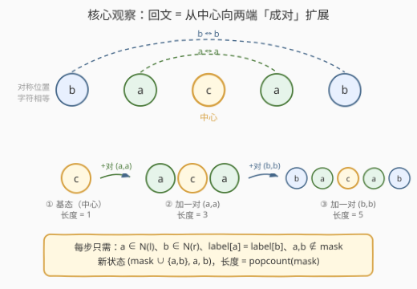
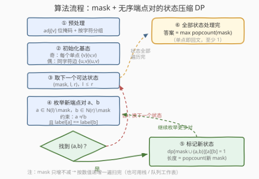
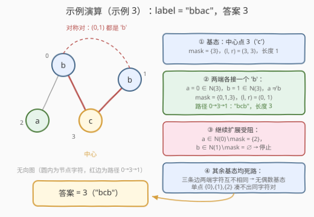

# LeetCode 图中的最长回文路径 题解

## 1. 题目概述

- **标题 / 题号**：图中的最长回文路径（#3615，hard）
- **链接**：https://leetcode.cn/problems/longest-palindromic-path-in-graph/
- **难度**：困难
- **标签**：位运算、图、动态规划、状态压缩、字符串

**题意**：给你一个整数 `n` 和一个包含 `n` 个节点的**无向图**，节点编号从 `0` 到 `n - 1`，以及一个二维数组 `edges`，其中 $edges[i] = [u_i, v_i]$ 表示节点 $u_i$ 和 $v_i$ 之间有一条边。再给你一个长度为 `n` 的字符串 `label`，其中 $label[i]$ 是节点 $i$ 上关联的字符。

你可以从任意节点出发，每次移动到相邻节点，每个节点**最多访问一次**（即走一条**简单路径**）。路径上节点的字符按访问顺序拼接成一个字符串。返回能拼出的**最长回文串**的长度。

**示例 1**：

```text
输入：n = 3, edges = [[0,1],[1,2]], label = "aba"
输出：3
解释：最长的回文路径是 0 → 1 → 2，形成字符串 "aba"，长度为 3。
```

**示例 2**：

```text
输入：n = 3, edges = [[0,1],[0,2]], label = "abc"
输出：1
解释：没有任何超过一个节点的路径能形成回文串，单节点构成长度为 1 的回文。
```

**示例 3**：

```text
输入：n = 4, edges = [[0,2],[0,3],[3,1]], label = "bbac"
输出：3
解释：最长的回文路径是 0 → 3 → 1，形成字符串 "bcb"，长度为 3。
```

**约束**：

- $1 \le n \le 14$
- $n - 1 \le edges.length \le \dfrac{n(n-1)}{2}$
- $0 \le u_i, v_i \le n - 1$，$u_i \ne v_i$，不存在重复边
- $label.length == n$，`label` 只包含小写英文字母

> 💡 **审题关键**：① $n \le 14$——教科书级的**状态压缩**信号；② 判定对象是**整条路径**拼接出的串本身是回文，而不是「路径中包含回文子串」；③ 单个节点是长度 1 的回文，答案下界为 1；④ **无向图**意味着路径可以整体反转后仍是合法路径——端点本质是**无序对**，这是本题能把状态数砍半的隐藏福利；⑤ 无自环、无重边，实现时无需特判。

## 2. 解题思路

### 2.1 暴力思路：枚举所有简单路径

最朴素的做法：从每个节点出发 DFS 枚举**全部简单路径**，对每条路径 $O(\text{len})$ 判回文，取最大值。但完全图上的简单路径数量是天文数字（自回避游走的计数随 $n$ 指数爆炸，$n = 14$ 的完全图可达 $10^{10}$ 量级以上），必然超时。

浪费的根源在于两条约束——**路径合法性**（相邻节点有边）与**回文性**（对称位置字符相同）——在逐条枚举中被反复从头验证，而每条路径真正有用的信息只有「**用了哪些点**」和「**当前两个端点是谁**」。$n \le 14$ 恰好提示：把「已用点集」压成一个 bitmask 当作 DP 状态。

### 2.2 核心观察：剥洋葱——回文 = 从中心向两端成对扩展



**观察一（剥洋葱）：回文的构造方向是「从中心向两端成对扩展」。** 回文路径 $v_1 \cdots v_k$ 的两端 $v_1$ 与 $v_k$ 字符相等，掐头去尾后 $v_2 \cdots v_{k-1}$ 仍是回文路径。反过来（构造方向）：设当前回文路径的两端为 $l$、$r$，在 $l$ 一侧接新点 $a$（$a \in N(l)$）、$r$ 一侧接新点 $b$（$b \in N(r)$），只要 $label[a] = label[b]$ 且 $a, b$ 都未用过，新路径仍是回文。奇数长度从「中心单点」出发，偶数长度从「一对相邻同字符点」出发。

**观察二（状态设计）：$dp[mask][l][r]$ 存「可达性」而非「最大值」。** 定义 $dp[mask][l][r]$：是否存在一条**恰好使用 `mask` 中的全部节点、两个端点为 $l$ 与 $r$** 的回文路径。由于路径恰好用完 `mask` 中的点，长度恒等于 $\text{popcount}(mask)$——状态里没有任何最优化语义，就是一张**可达性表**；答案即所有可达状态中最大的 $\text{popcount}(mask)$。

- **基态**（奇 / 偶两种长度）：
  - 奇数：每个单点 $v$，$dp[\{v\}][v][v] = 1$；
  - 偶数：每条满足 $label[u] = label[v]$ 的边，$dp[\{u,v\}][u][v] = 1$。
- **转移**：$dp[mask][l][r] = 1$ 且 $a \notin mask$、$b \notin mask$、$a \ne b$、$a \in N(l)$、$b \in N(r)$、$label[a] = label[b]$，则 $dp[mask \cup \{a,b\}][a][b] = 1$。

**观察三（端点无序）：只需存 $l \le r$。** 无向图中的路径可整体反转，节点集、合法性、回文性都不变，所以 $(mask, l, r)$ 与 $(mask, r, l)$ 完全等价——端点本质是**无序对**。扩展时也不必关心真实方向：$a$ 接 $l$ 侧、$b$ 接 $r$ 侧，若真实路径方向相反，用它的反转即可。状态数与转移数直接**减半**。

**观察四（遍历顺序）：mask 只增不减。** 转移只向 `mask` 置位，数值上 $mask \mid bits > mask$ 恒成立，不存在「回头边」——按 `mask` 从小到大扫一遍即完成全部转移；改用 BFS / 栈式 DFS 同样正确（每次转移 $\text{popcount}$ 恰好 $+2$）。

> ⚠️ **正确性的两个方向**：① 每个被标记「可达」的状态都对应真实回文路径——按构造规则归纳即可；② 每条回文路径都会被覆盖——反复掐头去尾（剥洋葱）最终必落到某个基态（单点或同字符相邻对），把剥的过程反过来就是一条从基态出发的转移链。两个方向合起来保证「最大 $\text{popcount}$ = 最长回文路径长度」。

### 2.3 算法流程图



**逻辑执行步骤**：

| 步骤 | 操作 | 说明 |
|------|------|------|
| ① 预处理 | 把邻接表压成位掩码 $adj[v]$；节点按字符分组 | 「邻居、未用过、同字符」三次过滤都能用位与一步完成 |
| ② 初始化基态 | 奇数：每个单点 $\{v\}(v,v)$；偶数：每条同字符边 $\{u,v\}(u,v)$ | 别漏偶数基态，否则丢掉所有偶数长度的回文 |
| ③ 取状态 | 依序取可达状态 $(mask, l, r)$，$l \le r$ | mask 从小到大一遍扫完（或工作栈） |
| ④ 枚举端点对 | $a \in N(l) \setminus mask$，$b \in N(r) \setminus mask$，$a \ne b$，$label[a] = label[b]$ | 用 $adj \,\&\, \sim mask \,\&\, \text{同字符组}$ 批量筛出候选 |
| ⑤ 标记新状态 | $dp[mask \cup \{a,b\}][\min(a,b)][\max(a,b)] = 1$ | 新长度 $= \text{popcount}(新\ mask)$，无需比较 |
| ⑥ 收尾 | 答案 $= \max\limits_{\text{可达}} \text{popcount}(mask)$，至少为 1 | 单点即回文，答案下界 1 |

### 2.4 示例演算（示例 3：n = 4, edges = [[0,2],[0,3],[3,1]], label = "bbac"）



邻接关系：$N(0) = \{2,3\}$，$N(1) = \{3\}$，$N(2) = \{0\}$，$N(3) = \{0,1\}$。逐状态演算：

| 步骤 | 当前状态 $(mask, l, r)$ | 操作 | 结果 |
|------|------------------------|------|------|
| ① | $(\{3\},\ 3,\ 3)$ | 基态：中心点 3（'c'） | 可达，长度 1 |
| ② | $(\{3\},\ 3,\ 3)$ | 枚举 $a, b \in N(3) \setminus mask = \{0,1\}$：取 $a=0, b=1$，'b' = 'b' ✓ | 新状态 $(\{0,1,3\},\ 0,\ 1)$，长度 3（路径 0→3→1，"bcb"） |
| ③ | $(\{0,1,3\},\ 0,\ 1)$ | $a \in N(0) \setminus mask = \{2\}$，但 $b \in N(1) \setminus mask = \varnothing$ | 右侧无候选，扩展终止 |
| ④ | 其余基态 | 三条边两端字符均不同 → 无偶数基态；单点 $\{0\},\{1\},\{2\}$ 的邻居中也凑不出同字符点对 | 均为死路 |
| 结论 | — | 最大可达 $\text{popcount} = 3$ | **答案 = 3** |

注意步骤 ② 的对称配对：节点 0 和节点 1 都与中心 3 相邻、字符都是 'b'，恰好构成外层的一对——这正是「从中心向两端成对扩展」的最小完整样例。

## 3. 参考代码

### C++

```cpp
class Solution {
public:
    int maxLen(int n, vector<vector<int>>& edges, string label) {
        vector<int> adj(n, 0);                       // adj[v]：邻居位掩码
        for (auto& e : edges) {
            adj[e[0]] |= 1 << e[1];
            adj[e[1]] |= 1 << e[0];
        }
        int full = 1 << n;
        // dp[mask][l][r]：是否存在「恰好用 mask 中节点、两端为 l 与 r（l <= r）」的回文路径
        vector<vector<vector<char>>> dp(full, vector<vector<char>>(n, vector<char>(n, 0)));

        for (int v = 0; v < n; ++v) dp[1 << v][v][v] = 1;          // 奇数长度基态
        for (auto& e : edges)                                       // 偶数长度基态
            if (label[e[0]] == label[e[1]]) {
                int a = min(e[0], e[1]), b = max(e[0], e[1]);
                dp[(1 << a) | (1 << b)][a][b] = 1;
            }

        int ans = 1;
        for (int mask = 1; mask < full; ++mask)
            for (int l = 0; l < n; ++l) {
                if (!(mask >> l & 1)) continue;
                for (int r = l; r < n; ++r) {
                    if (!(mask >> r & 1) || !dp[mask][l][r]) continue;
                    ans = max(ans, __builtin_popcount(mask));
                    for (int a = 0; a < n; ++a) {
                        if ((mask >> a & 1) || !(adj[l] >> a & 1)) continue;
                        for (int b = a + 1; b < n; ++b) {           // b > a：天然 a != b 且有序
                            if ((mask >> b & 1) || !(adj[r] >> b & 1)
                                || label[a] != label[b]) continue;
                            dp[mask | 1 << a | 1 << b][a][b] = 1;   // 新端点对 (a, b)，a < b
                        }
                    }
                }
            }
        return ans;
    }
};
```

> 💡 **写法要点**：
> - `dp` 用 `char` 三维数组：$2^{14} \times 14 \times 14 \approx 3.2$ MB，值只有 0/1，没有 max 语义。
> - 内层 `b` 从 `a + 1` 起枚举：一步同时保证 $a \ne b$ 与新端点对满足 $a < b$（规范化），省去 `min/max`。
> - 按 `mask` 数值递增遍历即合法拓扑序：置位只会让 `mask` 变大，不存在回头边。
> - 判定 `label[a] != label[b]` 放在最后短路——位掩码过滤先淘汰大部分候选。

### Python

```python
class Solution:
    def maxLen(self, n: int, edges: List[List[int]], label: str) -> int:
        adj = [0] * n                          # adj[v]：v 的邻居位掩码
        for u, v in edges:
            adj[u] |= 1 << v
            adj[v] |= 1 << u
        group = defaultdict(int)               # 按字符分组的节点位掩码
        for v, c in enumerate(label):
            group[c] |= 1 << v
        masks = list(group.values())

        seen = set()                           # 状态 (mask, l, r) 编码成一个整数
        stack = []
        ans = 1

        def push(mask: int, l: int, r: int) -> None:
            nonlocal ans
            state = mask << 8 | l << 4 | r
            if state not in seen:
                seen.add(state)
                stack.append(state)
                if mask.bit_count() > ans:
                    ans = mask.bit_count()

        for v in range(n):                     # 奇数长度基态：中心单点
            push(1 << v, v, v)
        for u, v in edges:                     # 偶数长度基态：同字符的相邻点对
            if label[u] == label[v]:
                push((1 << u) | (1 << v), min(u, v), max(u, v))

        while stack:                           # 栈式深搜：优先往深处冲大 popcount
            state = stack.pop()
            mask, l, r = state >> 8, state >> 4 & 15, state & 15
            A, B = adj[l] & ~mask, adj[r] & ~mask
            if not A or not B:
                continue
            for cmask in masks:                # 只在同一字符组内配对
                Ac, Bc = A & cmask, B & cmask
                if not Ac or not Bc:
                    continue
                aa = Ac
                while aa:
                    lb = aa & -aa              # 取最低位候选 a
                    a = lb.bit_length() - 1
                    aa ^= lb
                    bb = Bc & ~lb              # b 不能与 a 相同
                    while bb:
                        rb = bb & -bb
                        b = rb.bit_length() - 1
                        bb ^= rb
                        push(mask | lb | rb, min(a, b), max(a, b))
            if ans == n:                       # 已达上界 n，提前收工
                return ans
        return ans
```

> 💡 **写法要点**：
> - 状态编码成单个整数 $mask \ll 8 \mid l \ll 4 \mid r$，`set` 判重比 tuple 快不少。
> - 邻接与字符分组都用位掩码：`A & cmask` 一步筛出「邻居、未用过、同字符」三重条件。
> - 用**栈**（DFS）而非队列：优先往深处扩展，$\text{popcount}$ 上升快，「答案恰为 $n$」的稠密用例会被 `ans == n` 提前命中，从秒级降到毫秒级。
> - `int.bit_count()` 需要 Python 3.10+（LeetCode 环境满足）。

## 4. 复杂度分析

| 维度 | 复杂度 | 说明 |
|------|--------|------|
| **时间复杂度** | $O(2^n \cdot n^4)$ | 状态 $O(2^n \cdot n^2)$（$l \le r$ 规范化后约减半），每状态枚举端点对 $O(n^2)$；位掩码 + 同字符分组只降常数 |
| **空间复杂度** | $O(2^n \cdot n^2)$ | C++ 的 `dp` 数组约 3.2 MB（`char`）；Python 用哈希 `set` 只存可达状态 |

> - $n = 14$ 时理论上界约 $10^8$ 次基础操作，但「同字符配对」过滤在实际数据上砍掉绝大多数枚举：C++ 实测完全图全同字符的极端用例约 40 ms，Python 约 2–3 s（配合提前退出）。
> - 对比暴力：完全图上简单路径数为自回避游走计数，$n = 14$ 时远超 $10^{10}$，不可行。

## 5. 扩展：变体与关联套路

**变体一：有向图。** 若边有方向，路径不可整体反转，$(mask, l, r)$ 与 $(mask, r, l)$ 不再等价——必须去掉 $l \le r$ 规范化（状态翻倍），且扩展条件改为「存在边 $a \to l$ 与 $r \to b$」的方向约束。核心框架不变。

**变体二：输出具体路径。** 给每个可达状态额外记录前驱 $(prev\_mask, prev\_l, prev\_r)$，从最大 $\text{popcount}$ 的状态回溯到基态，即可还原整条路径（回溯时注意中心两侧节点的顺序与反转）。

**变体三：为什么 $n \le 14$？** $2^{20} \cdot n^2$ 的状态在 $n = 20$ 时已需 GB 级内存。$n \le 16$ 正是「mask + 端点」型状态压缩 DP 的甜点区；再大就要考虑折半搜索（meet in the middle）或利用问题结构的专属剪枝。

**关联套路。** 「$mask$ + 当前端点」的状态设计是一整族题的公共骨架：847（mask + 当前点求最短路）、943（mask + 串尾的拼接 DP）、996（mask + 末端的路径计数）。本题的增量在于端点变成**一对**，且转移要求两端**成对配对**——与 516（区间 DP 从两端向中间配对）在「回文 = 对称配对」这一点上同源。

## 6. 面试要点

**Q1：为什么状态里不需要记录「当前长度」或做 max 转移？**

> 路径恰好用完 `mask` 中的全部节点，长度恒等于 $\text{popcount}(mask)$，由状态唯一确定。于是「求最长」退化成「求可达状态的最大 popcount」，最优化问题被降维成可达性问题——想清楚这一点，代码会简单整整一圈。

**Q2：基态为什么有两类？漏掉一类会怎样？**

> 回文有奇偶两种：奇数长度剥到最后剩一个中心点；偶数长度剥到最后剩一对**相邻且同字符**的点对。漏掉偶数基态会丢掉所有偶数回文——例如两个相邻的同字符节点构成长度 2 的答案，会错误地返回 1。

**Q3：为什么可以只存 $l \le r$，扩展时不怕方向接反吗？**

> 无向图中路径可整体反转，$(mask, l, r)$ 与 $(mask, r, l)$ 等价，端点是**无序对**。扩展时从 $\{l, r\}$ 出发，$a$ 接 $l$ 侧、$b$ 接 $r$ 侧：若真实路径的方向恰好相反，取其反转（仍是同一条边的序列倒序）即可，$a$ 与 $l$ 相邻、$b$ 与 $r$ 相邻的边都存在。状态数与转移数直接减半。

**Q4：按 `mask` 数值从小到大遍历为什么一遍就够？**

> 转移只会向 `mask` 置位（增加节点），而置位在数值上严格增大，$mask \mid bits > mask$。递推图是一个 DAG 且 `mask` 本身就是拓扑序，一遍扫描即收敛，不需要 Bellman-Ford 式的重复松弛。

**Q5：这题的「状态压缩触发信号」是什么？如何迁移？**

> 三大信号齐备：① $n \le 20$（本题 14）；②「每个元素最多用一次」——天然对应 bitmask；③ 只关心集合与端点、不关心中间顺序。遇到 847、943、996 这类题时用同一套「$mask$ + 端点/末元素」模板即可快速破题。

> 💡 **一句话总结**：3615 = 「回文 = 从中心向两端成对扩展」的构造观察 + 「$mask$ + 无序端点对」的状态压缩可达性 DP。带走的三个细节：偶数基态别漏、端点无序可减半、长度就是 popcount。

## 同类练习题

| # | 题目 | 与本题的关联 |
|---|------|-------------|
| 847 | [访问所有节点的最短路径](https://leetcode.cn/problems/shortest-path-visiting-all-nodes/) | 「mask + 当前点」的 BFS 状态设计原型，体会状态如何吸收访问历史 |
| 996 | [正方形数组的数目](https://leetcode.cn/problems/number-of-squareful-arrays/) | 「mask + 末端」的哈密顿式路径 DP，转移同样只看新点与端点的关系 |
| 943 | [最短超级串](https://leetcode.cn/problems/find-the-shortest-superstring/) | 「mask + 串尾」的经典状态压缩 DP，本题状态机的直接近亲 |
| 980 | [不同路径 III](https://leetcode.cn/problems/unique-paths-iii/) | 哈密顿路径搜索题，可对照「暴力回溯 vs mask 记忆化」的取舍 |
| 516 | [最长回文子序列](https://leetcode.cn/problems/longest-palindromic-subsequence/) | 序列版「两端对称配对」思想（区间 DP），与本题的回文构造观互为镜像 |
