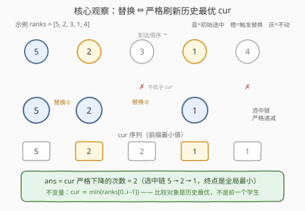
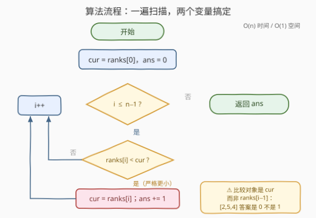

# LeetCode 学生替换人数 题解

## 1. 题目概述

- **标题 / 题号**：学生替换人数（#3616，medium）
- **链接**：https://leetcode.cn/problems/number-of-student-replacements/
- **难度**：中等
- **标签**：数组、模拟

> ⚠️ 本题为 LeetCode 付费题（🔒），官方接口不返回题面，以下题意依据官方示例用例、hints 与公开镜像整理，可能与官方题面有出入。

**题意**：给定一个整数数组 `ranks`，其中 `ranks[i]` 表示第 `i` 个**按顺序**到达的学生排名，数字越低表示排名**越好**。

最初，默认**选中**第一个学生。此后，当一名排名**严格更好**的学生到来时，会发生一次**替换**：新学生取代当前的选择。

返回替换的总数。

**示例 1**：

```text
输入：ranks = [4,1,2]
输出：1
解释：第一个排名 4 的学生被初始选中；排名 1 的学生更优，发生替换；
      排名 2 的学生不如当前选择（1），不替换。共 1 次替换。
```

**示例 2**：

```text
输入：ranks = [2,2,3]
输出：0
解释：排名 2、3 的学生都不严格优于当前选择（2）——排名相同不算更好。共 0 次替换。
```

**约束**：

- `1 <= ranks.length <= 10^5`
- `1 <= ranks[i] <= 10^5`

> 💡 **审题关键**：①「严格更好」= 严格小于，排名**相同**不触发替换（示例 2 的两个 2）；② 替换的比较对象是**当前选中的学生**（历史最优），不是前一个到达的学生；③ 第一个学生是初始选择，**不计**替换；④ 返回的是替换**次数**，不是最终选中了谁。

## 2. 解题思路

### 2.1 暴力思路：对每个学生重扫前缀

第 `i` 个学生是否触发替换，等价于判断 `ranks[i]` 是否严格小于 `ranks[0..i-1]` 全体的最小值。最直接的写法是内层重扫前缀：

```text
ans = 0
for i = 1 .. n-1:
    mn = +∞
    for j = 0 .. i-1:        # 重扫前缀求最小
        mn = min(mn, ranks[j])
    if ranks[i] < mn:        # 严格新纪录
        ans += 1
```

正确性没有问题，但 $O(n^2)$ 在 $n = 10^5$ 时约 $10^{10}$ 次比较，必然超时。浪费显而易见：算 `i` 时把 `[0..i-1]` 扫了一遍，算 `i+1` 时又几乎原样重扫——前缀只多了一个元素，旧的最小值原封不动可以继承。把「重复扫描」压成「边走边维护」，就是一遍 $O(n)$。

> ⚠️ 另一种似是而非的「暴力」：数**相邻下降**（`ranks[i] < ranks[i-1]` 的次数）。这是错的——比较对象搞错了，反例见 2.2。

### 2.2 核心观察：替换次数 = 前缀最小值的严格刷新次数



**观察一：cur 恒等于前缀最小值（归纳不变量）。** 设 `cur` 为当前选中学生的排名。初始时 `cur = ranks[0] = min(ranks[0..0])`；此后每遇 `ranks[i] < cur` 才更新 `cur = ranks[i]`——新值恰为新的前缀最小值，不更新时旧值依然是。于是对任意 `i`：

$$\texttt{cur} \equiv \min(\texttt{ranks}[0..i-1])$$

因此第 `i` 个学生触发替换 $\iff$ `ranks[i]` 严格小于它之前的**所有**元素，即 `ranks[i]` 是一个**严格前缀最小值**（新纪录）。

**观察二：选中链严格递减，终点是全局最小。** 每次替换 `cur` 都严格变小，最终停在 $\min(\texttt{ranks})$。于是：

$$\text{ans} = (\text{左到右最小值的个数}) - 1$$

（左到右最小值含首元素；首元素是初始选中，不占替换名额。）

**观察三：两个标量，一次扫描。** 只需 `cur` 与 `ans`，天然支持流式到达——不需要随机访问，甚至不需要存储整个数组。

> ⚠️ 两个高频坑，各配一个反例：
> ① **与相邻元素比较**（数下降次数）：`[2,5,4]` 中 `4 < 5` 会被误判为替换，但历史最优是 2，正确答案 0；
> ② **用 `<=` 代替 `<`**：`[2,2,3]` 中排名相同的第二个 2 不构成替换，正确答案 0。

### 2.3 算法流程图



**逻辑执行步骤**：

| 步骤 | 操作 | 说明 |
|------|------|------|
| ① 初始化 | `cur = ranks[0]`，`ans = 0` | 首个学生默认选中，不计替换 |
| ② 遍历 | `i` 从 `1` 到 `n-1` | 从第二个学生开始 |
| ③ 判定 | `ranks[i] < cur ?` | **严格**更小才替换 |
| ④ 更新 | `cur = ranks[i]`，`ans += 1` | 刷新历史最优，计一次替换 |
| ⑤ 收尾 | 返回 `ans` | — |

> ⚠️ 判定框里比较的是 `cur`（历史最优）而非 `ranks[i-1]`（前一个学生），这是本题唯一的知识点级坑位。

### 2.4 示例演算

用一个信息量更大的例子 `ranks = [5,2,3,1,4]` 走一遍（示例 1/2 同理）：

| $i$ | $\texttt{ranks}[i]$ | 判定前 cur | $\texttt{ranks}[i] < \texttt{cur}$ ? | 动作 | ans |
|-----|---------------------|------------|--------------------------------------|------|-----|
| 0 | 5 | — | — | 初始选中，cur = 5 | 0 |
| 1 | 2 | 5 | ✓ | 替换，cur = 2 | 1 |
| 2 | 3 | 2 | ✗ | 不动 | 1 |
| 3 | 1 | 2 | ✓ | 替换，cur = 1 | 2 |
| 4 | 4 | 1 | ✗ | 不动 | 2 |

`cur` 序列 5,2,2,1,1 恰是**前缀最小值数组**；`ans = 2` 即 `cur` 严格下降的次数。对照示例 1 `[4,1,2]`：`cur` 序列 4,1,1，`ans = 1` ✓；示例 2 `[2,2,3]`：`cur` 序列 2,2,2，`ans = 0` ✓。

## 3. 参考代码

### C++

```cpp
class Solution {
public:
    int totalReplacements(vector<int>& ranks) {
        int ans = 0;
        int cur = ranks[0];
        for (int i = 1; i < (int)ranks.size(); ++i) {
            if (ranks[i] < cur) {
                cur = ranks[i];
                ++ans;
            }
        }
        return ans;
    }
};
```

> 💡 **写法要点**：
> - `cur` 初始化为 `ranks[0]` 而非 `INT_MAX`：首个学生是「初始选中」而非「替换」；若初始化 `+∞` 且从 `i = 0` 计数，答案恒多 1。
> - 从 `i = 1` 开始遍历，与题面「默认选中第一个」严格对齐（从 `i = 0` 遍历也不错——`ranks[0] < ranks[0]` 为假——但语义上多绕一层）。
> - `n ≥ 1` 保证 `ranks[0]` 存在，无需空数组特判。

### Python

```python
class Solution:
    def totalReplacements(self, ranks: List[int]) -> int:
        ans, cur = 0, ranks[0]
        for x in ranks[1:]:
            if x < cur:
                cur = x
                ans += 1
        return ans
```

> 💡 **写法要点**：
> - `ranks[1:]` 会产生 $O(n)$ 的切片拷贝；追求严格 $O(1)$ 空间可换 `itertools.islice(ranks, 1, None)`，本题量级无感。
> - 判定、更新、计数三行一体，零嵌套分支——简单题就让它保持简单。

## 4. 复杂度分析

| 维度 | 复杂度 | 说明 |
|------|--------|------|
| **时间复杂度** | $O(n)$ | 每个学生恰好一次比较，一遍扫描 |
| **空间复杂度** | $O(1)$ | 仅 `cur` 与 `ans` 两个标量，天然支持流式处理 |

> - $n = 10^5$ 时约 $10^5$ 次比较，远低于时限；瓶颈只在读入。
> - 「单层循环 + 滚动标量」已是此类统计问题的理论下界形态：每个输入至少要看一眼（$\Omega(n)$），而维护统计量只需 $O(1)$。

## 5. 扩展：纪录数的概率画像与三个变体

**随机数据下答案只有 $O(\log n)$。** 若 `ranks` 是均匀随机排列，第 $i$ 个位置（1-indexed）成为新纪录的概率是 $1/i$——前 $i$ 个元素中每个都等概率地最小。于是期望纪录数（含首元素）为调和数：

$$\mathbb{E}[\text{records}] = \sum_{i=1}^{n} \frac{1}{i} = H_n \approx \ln n$$

即期望替换次数约 $\ln n$（$n = 10^5$ 时约 11 次）；最坏情形是**严格递减**输入，替换 $n-1$ 次。「纪录数期望 $O(\log n)$」这条结论在流式最小值维护、随机排序更新次数分析中反复出现，值得记一笔。

**三个变体一题吃透**：

| 变体 | 改动 | 解法变化 |
|------|------|----------|
| 「更好**或相等**也替换」 | `[2,2,3]` 答案 0 → 1 | 判定改 `<=`，`cur` 语义不变；等值连续段每个都计数 |
| 返回最终选中的**下标** | `[4,1,2]` 返回 1 | 替换时顺手 `idx = i`；初始 `idx = 0` |
| 学生可**中途离开**（动态集合） | 任意时刻报当前最优 | 滚动变量失效，转 `multiset` / `SortedList` 维护可删有序集合 |

**同族对照**：本题与 3502（输出每个前缀的 min）、121（滚动维护历史最小买入价）、2016（维护左侧最小值求最大差）共享同一个「滚动前缀最值」骨架；1299 则是镜像题——从右往左维护后缀最大值。

## 6. 面试要点

**Q1：为什么不能数「相邻下降」的次数？**

> 替换的比较对象是**历史最优** $\texttt{cur} \equiv \min(\texttt{ranks}[0..i-1])$，不是前一个学生。反例 `[2,5,4]`：`4 < 5` 是一次相邻下降，但 4 不优于历史最优 2，不触发替换，正确答案 0。

**Q2：`cur` 为什么初始化为 `ranks[0]` 而不是 `+∞`？**

> 首个学生是「初始选中」，不占替换名额。初始化 `+∞` 并从 `i = 0` 计数会把首元素也记成一次替换，答案恒多 1。（若坚持从 `i = 0` 遍历，配 `cur = ranks[0]` 也正确——`ranks[0] < ranks[0]` 为假。）

**Q3：答案的上界是多少？什么时候取到？**

> 每次替换 `cur` 严格变小且选中链元素互异，故 $\text{ans} \le n-1$，当且仅当 `ranks` 严格递减时取到（每个学生都是新纪录）；随机排列下期望仅约 $\ln n$。

**Q4：如果学生按流式到达（内存存不下整个数组），要怎么改？**

> 不用改：`cur` 与 `ans` 都是滚动标量，逐条读入逐条判定，$O(1)$ 空间天然支持流处理。但**不能提前终止**——全局最小可能最后一个才到，必须看完所有学生。

**Q5：本题与 3502「到达每个位置的最小费用」有什么异同？**

> 同一个「前缀最小值一遍扫描」骨架：3502 输出每个前缀的 min 本身（需 $O(n)$ 空间存答案数组），本题只统计 min 被刷新的次数（两个标量足矣）。输出需求决定保留多少中间状态——「要值还是要计数」是这类题的分叉点。

> 💡 **一句话总结**：3616 = 前缀最小值一遍扫描 + 严格比较两个细节（对象是历史最优、`<` 而非 `<=`）。选中链严格递减终于全局最小，答案即刷新次数。

## 同类练习题

| # | 题目 | 与本题的关联 |
|---|------|-------------|
| 3502 | [到达每个位置的最小费用](https://leetcode.cn/problems/minimum-cost-to-reach-every-position/) | 同族前缀最小值一遍扫描，输出每个前缀的 min 而非刷新次数 |
| 121 | [买卖股票的最佳时机](https://leetcode.cn/problems/best-time-to-buy-and-sell-stock/) | 滚动维护历史最小买入价，同一骨架求最大差 |
| 2016 | [增量元素之间的最大差值](https://leetcode.cn/problems/maximum-difference-between-increasing-elements/) | 维护左侧最小值，求与当前元素的最大差 |
| 1299 | [将每个元素替换为右侧最大元素](https://leetcode.cn/problems/replace-elements-with-greatest-element-on-right-side/) | 镜像题——从右往左维护后缀最大值，同样一遍扫描 |
