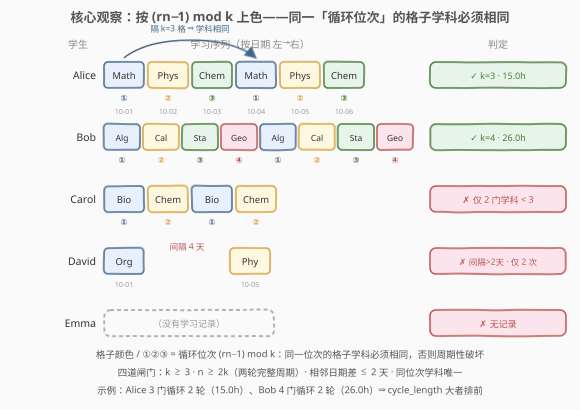
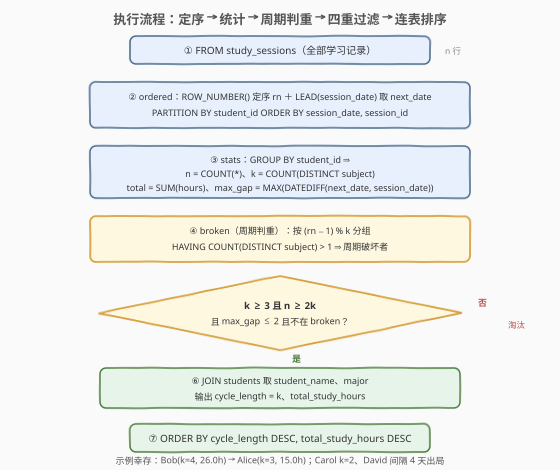

# LeetCode 查找具有螺旋学习模式的学生 题解

## 1. 题目概述

- **标题 / 题号**：查找具有螺旋学习模式的学生（#3617，hard）
- **链接**：https://leetcode.cn/problems/find-students-with-study-spiral-pattern/
- **难度**：困难
- **标签**：SQL、数据库、窗口函数、`ROW_NUMBER`、`LEAD`、自连接、取模分组、`DATEDIFF`

**题意**：两张表：`students` 记录学生信息，`study_sessions` 记录学习时段。编写一个解决方案，找出遵循**螺旋学习模式**的学生——即**以重复的顺序持续学习至少 3 个不同学科**、且模式**重复至少 2 个完整周期**的学生。返回 `student_id`、`student_name`、`major`、**循环长度** `cycle_length`（模式中不同学科数量）与**总学习时长** `total_study_hours`，按 `cycle_length` **降序**、再按 `total_study_hours` **降序**排序。

**表结构**：

```text
表: students
+--------------+---------+
| Column Name  | Type    |
+--------------+---------+
| student_id   | int     |   ← 主键
| student_name | varchar |
| major        | varchar |
+--------------+---------+
student_id 是这张表的唯一主键。
每一行包含有关学生及其学术专业的信息。

表: study_sessions
+---------------+---------+
| Column Name   | Type    |
+---------------+---------+
| session_id    | int     |   ← 主键
| student_id    | int     |   ← 指向 students.student_id
| subject       | varchar |
| session_date  | date    |
| hours_studied | decimal |
+---------------+---------+
session_id 是这张表的唯一主键。
每一行代表一个学生针对特定学科的学习时段。
```

**关键规则**：

1. **螺旋学习模式**：学生以重复的顺序学习**至少 3 个不同的学科**；
2. 模式必须重复**至少 2 个完整周期**（最少 6 次学习记录）；
3. 相邻两次学习记录必须是**间隔不超过 2 天**的连续日期；
4. **循环长度** $=$ 模式中不同学科的数量；
5. **总学习时长** $=$ 模式中所有学习记录的 `hours_studied` 之和。

**示例 1**：

```text
输入：
students 表:
+------------+--------------+------------------+
| student_id | student_name | major            |
+------------+--------------+------------------+
| 1          | Alice Chen   | Computer Science |
| 2          | Bob Johnson  | Mathematics      |
| 3          | Carol Davis  | Physics          |
| 4          | David Wilson | Chemistry        |
| 5          | Emma Brown   | Biology          |
+------------+--------------+------------------+

study_sessions 表:
+------------+------------+------------+--------------+---------------+
| session_id | student_id | subject    | session_date | hours_studied |
+------------+------------+------------+--------------+---------------+
| 1          | 1          | Math       | 2023-10-01   | 2.5           |
| 2          | 1          | Physics    | 2023-10-02   | 3.0           |
| 3          | 1          | Chemistry  | 2023-10-03   | 2.0           |
| 4          | 1          | Math       | 2023-10-04   | 2.5           |
| 5          | 1          | Physics    | 2023-10-05   | 3.0           |
| 6          | 1          | Chemistry  | 2023-10-06   | 2.0           |
| 7          | 2          | Algebra    | 2023-10-01   | 4.0           |
| 8          | 2          | Calculus   | 2023-10-02   | 3.5           |
| 9          | 2          | Statistics | 2023-10-03   | 2.5           |
| 10         | 2          | Geometry   | 2023-10-04   | 3.0           |
| 11         | 2          | Algebra    | 2023-10-05   | 4.0           |
| 12         | 2          | Calculus   | 2023-10-06   | 3.5           |
| 13         | 2          | Statistics | 2023-10-07   | 2.5           |
| 14         | 2          | Geometry   | 2023-10-08   | 3.0           |
| 15         | 3          | Biology    | 2023-10-01   | 2.0           |
| 16         | 3          | Chemistry  | 2023-10-02   | 2.5           |
| 17         | 3          | Biology    | 2023-10-03   | 2.0           |
| 18         | 3          | Chemistry  | 2023-10-04   | 2.5           |
| 19         | 4          | Organic    | 2023-10-01   | 3.0           |
| 20         | 4          | Physical   | 2023-10-05   | 2.5           |
+------------+------------+------------+--------------+---------------+

输出：
+------------+--------------+------------------+--------------+-------------------+
| student_id | student_name | major            | cycle_length | total_study_hours |
+------------+--------------+------------------+--------------+-------------------+
| 2          | Bob Johnson  | Mathematics      | 4            | 26.0              |
| 1          | Alice Chen   | Computer Science | 3            | 15.0              |
+------------+--------------+------------------+--------------+-------------------+
```

**解释**：

| 学生 | 学习序列（按日期） | 判定 | 结果 |
|------|------------------|------|------|
| Alice Chen | Math→Physics→Chemistry×2 轮 | 3 门学科循环 2 个完整周期，日期 10-01~10-06 无断档 | $k=3$，$2.5{+}3{+}2{+}2.5{+}3{+}2=15.0$h |
| Bob Johnson | Algebra→Calculus→Statistics→Geometry×2 轮 | 4 门学科循环 2 个完整周期，日期 10-01~10-08 无断档 | $k=4$，合计 26.0h |
| Carol Davis | Biology→Chemistry×2 轮 | 仅 2 门学科，不满足「至少 3 门」 | 淘汰 |
| David Wilson | Organic、Physical | 仅 2 次记录且间隔 4 天 | 淘汰 |
| Emma Brown | （无记录） | 无学习记录 | 淘汰 |

**约束**：

- `student_id`、`session_id` 分别是两表主键；`study_sessions.student_id` 指向 `students.student_id`
- 结果按 `cycle_length` **降序**、`total_study_hours` **降序**排序

> 💡 **读题关键**：① 把每人记录按日期排好序后，「重复的顺序」+「至少 2 个完整周期」合起来就是**周期性判定** $s_i = s_{i+k}$ 外加门槛 $n \ge 2k$——问题从模糊的「模式识别」坍缩成精确的「隔 $k$ 位比对」；② 循环长度 $k$ 题目直接给了定义：**不同学科数**；③ 「间隔不超过 2 天」是对**相邻记录**的约束，`LEAD` + `MAX(DATEDIFF)` 一趟搞定。三件事分别对应排序、自连接/取模、窗口位移三大 SQL 套路。

## 2. 解题思路

### 2.1 暴力思路：逐学生人肉验模式

过程式直觉：对每个学生，收集其全部学习记录按日期升序排列成序列 $s_1,\dots,s_n$（对应日期 $d_1,\dots,d_n$），令 $k$ 为不同学科数，逐条检查四道闸门：

```text
for each student e:
    s = e 的学习记录按 session_date 升序
    n = len(s);  k = s 中不同学科数
    if k < 3: skip                      # 闸门 1：至少 3 门学科
    if n < 2 * k: skip                  # 闸门 2：至少 2 个完整周期
    if 存在 i 使 d[i+1] − d[i] > 2: skip  # 闸门 3：相邻日期间隔 ≤ 2 天
    if 存在 i ≤ n−k 使 s[i] ≠ s[i+k]: skip # 闸门 4：隔 k 位学科必须相同（周期性）
    output(e, k, Σ hours)
sort output by cycle_length desc, total_study_hours desc
```

- **正确性**：四道闸门与题意一一对应，无遗漏；
- **效率**：每人一次排序 $O(m \log m)$（$m$ 为其记录数），总量 $O(n \log n)$（$n$ 为记录总行数），毫无压力；
- **表达方式**：瓶颈依旧不在效率而在**翻译**——「按日期定序」「隔 $k$ 位比对」「相邻日期作差」三个动作都没有过程式循环可用，要分别映射成**窗口编号**、**自连接/取模分组**、**LEAD 位移**，这正是本题困难的地方。

> ⚠️ 先记两个易错点：**闸门 4 的比对是「隔 $k$ 位」而不是「相邻位」**——$k$ 随学生变化，`LAG`/`LEAD` 的偏移量必须是常量，不能写 `LAG(subject, k)`；**MySQL 的窗口函数不支持 `COUNT(DISTINCT ...)`**——$k$ 只能用 `GROUP BY` 子查询单独算（见 5.2 节），直接写 `COUNT(DISTINCT subject) OVER (...)` 会报语法错误。

### 2.2 核心观察：编号取模定位 + 三件 SQL 兵器



把暴力思路的每个动作逐一翻译成 SQL：

| 业务语言 | SQL 语言 |
|----------|----------|
| 每人按日期给记录**定序** | `ROW_NUMBER() OVER (PARTITION BY student_id ORDER BY session_date, session_id)` |
| 相邻记录**间隔 ≤ 2 天** | `LEAD(session_date)` 取下一条日期，组内 `MAX(DATEDIFF(next, cur)) <= 2` |
| **循环长度** $k$ | `COUNT(DISTINCT subject)`——`GROUP BY student_id` 子查询算好后 JOIN 回来 |
| **至少 2 个完整周期** | `COUNT(*) >= 2 * k`（$k \ge 3$ 时自动蕴含 $n \ge 6$） |
| **隔 $k$ 位学科相同**（周期性） | 两种等价写法：① 自连接 `j.rn = o.rn + k` 逐对比对学科；② 按 `(rn - 1) % k` 分组，组内 `COUNT(DISTINCT subject) = 1` |
| **总学习时长** | `SUM(hours_studied)` |
| 双键排序 | `ORDER BY cycle_length DESC, total_study_hours DESC` |

> 💡 **周期性的「同余类」视角（本题题眼）**：$s_i = s_{i+k}\ (\forall i \le n-k)$ 等价于说——序列完全由前 $k$ 个元素**循环复制**而成，$s_i$ 只取决于它的「循环位次」$(i-1) \bmod k$。于是「隔 $k$ 位比对」可以整体坍缩成一次**分组判重**：按 `(rn - 1) % k` 把每人 $n$ 行分成 $k$ 组，**每组内不同学科数必须恰为 1**；任何一组出现 2 种学科，周期性即被破坏。这一步把 $O(n)$ 次逐对比较压成一次 `GROUP BY + HAVING`，是解法 B 免连接的关键。
>
> 💡 **日期连续性与 NULL 的默契**：`LEAD(session_date)` 在每人**最后一行**返回 NULL，`DATEDIFF(NULL, d)` 也是 NULL，而 `MAX` 聚合**天然忽略 NULL**——末行自动免检，一行特殊处理都不用写。唯一要兜底的是「单人单条记录」时全组皆 NULL、`MAX` 返回 NULL，`COALESCE(..., 0)` 补上即可。

### 2.3 算法流程图



**逻辑执行顺序**（以解法 B 为骨架，解法 A 仅第 ④ 步换成自连接）：

| 阶段 | 子句 | 作用 |
|------|------|------|
| ① | `FROM study_sessions` | 确定输入：全部学习记录 |
| ② | 窗口函数（CTE `ordered`） | 每人按日期定序 `rn`；`LEAD` 取相邻下一条日期 `next_date` |
| ③ | 分组聚合（CTE `stats`） | 每人算 `n`、`k`、总时长、最大日期间隔 |
| ④ | 周期校验（CTE `broken`） | 按 `(rn-1) % k` 分组，组内学科数 > 1 者记为「周期破坏者」 |
| ⑤ | 四重过滤 `WHERE` | $k \ge 3$、$n \ge 2k$、`max_gap <= 2`、不在 `broken` 中 |
| ⑥ | `JOIN students` | 取 `student_name`、`major` |
| ⑦ | `ORDER BY cycle_length DESC, total_study_hours DESC` | 双键排序收尾 |

> 💡 **窗口函数求值时机**：`ROW_NUMBER()`/`LEAD()` 晚于 `WHERE` 求值，不能在同一层里过滤 `rn`；且 `stats` 要用 `ordered` 的 `next_date` 做聚合、`broken` 要用 `stats` 的 `k` 做取模——三层 CTE **必须自上而下依次物化**，这也是窗口题的通用分层写法。

### 2.4 示例演算

对示例数据走一遍 ②→⑦ 链路（`rn` 按日期升序，`k` = 不同学科数，同余位次 = `(rn-1) % k`）：

| 学生 | n | k | 同余位次组（学科） | 最大间隔 | n≥2k？ | k≥3？ | 结果 |
|------|---|---|-------------------|----------|--------|-------|------|
| Alice | 6 | 3 | 位①{Math}、位②{Physics}、位③{Chemistry}，各组学科唯一 | 1 天 | $6 \ge 6$ ✓ | ✓ | $(3,\ 15.0)$ |
| Bob | 8 | 4 | 位①{Algebra}、位②{Calculus}、位③{Statistics}、位④{Geometry} | 1 天 | $8 \ge 8$ ✓ | ✓ | $(4,\ 26.0)$ |
| Carol | 4 | 2 | 位①{Biology}、位②{Chemistry} | 1 天 | $4 \ge 4$ ✓ | ✗ | 淘汰 |
| David | 2 | 2 | — | 4 天 | $2 < 4$ ✗ | ✗ | 淘汰 |
| Emma | 0 | — | — | — | — | — | 淘汰 |

- **② 阶段（定序）**：Alice 的 6 条记录编号 rn=1..6，末行（rn=6）的 `next_date` 为 NULL，自动免检；
- **④ 阶段（周期校验）**：Alice 的 6 行按 `(rn-1) % 3` 落入三个同余组，每组恰一种学科——等价于验证了 $s_1{=}s_4,\ s_2{=}s_5,\ s_3{=}s_6$；rn=4,5,6 的行**没有隔 3 位的伙伴**（$4+3>6$），天然不产生约束；
- **⑤ 阶段（四重过滤）**：Carol 栽在 $k=2<3$；David 三重不合格（$k=2$、$n=2<4$、间隔 4 天）；Emma 无记录根本不进 `stats`；
- **⑦ 阶段（排序）**：Bob（$k=4$）> Alice（$k=3$）→ `Bob, Alice`，与预期输出一致。

## 3. 参考代码

### SQL（解法 A：自连接逐对校验——$s_i = s_{i+k}$ 的直译）

```sql
WITH ordered AS (
    SELECT student_id, subject, session_date, hours_studied,
           ROW_NUMBER() OVER (PARTITION BY student_id
                              ORDER BY session_date, session_id) AS rn,
           LEAD(session_date) OVER (PARTITION BY student_id
                              ORDER BY session_date, session_id) AS next_date
    FROM study_sessions
),
stats AS (
    SELECT student_id,
           COUNT(*)               AS n,
           COUNT(DISTINCT subject) AS k
    FROM study_sessions
    GROUP BY student_id
),
per_student AS (
    SELECT o.student_id,
           MAX(st.k)  AS k,
           MAX(st.n)  AS n,
           SUM(o.hours_studied) AS total_hours,
           COALESCE(MAX(DATEDIFF(o.next_date, o.session_date)), 0) AS max_gap,
           SUM(CASE WHEN j.subject IS NOT NULL
                     AND j.subject <> o.subject THEN 1 ELSE 0 END) AS mismatch
    FROM ordered o
    JOIN stats st ON st.student_id = o.student_id
    LEFT JOIN ordered j
      ON j.student_id = o.student_id
     AND j.rn = o.rn + st.k
    GROUP BY o.student_id
)
SELECT s.student_id,
       s.student_name,
       s.major,
       p.k AS cycle_length,
       p.total_hours AS total_study_hours
FROM per_student p
JOIN students s ON s.student_id = p.student_id
WHERE p.k >= 3
  AND p.n >= 2 * p.k
  AND p.max_gap <= 2
  AND p.mismatch = 0
ORDER BY cycle_length DESC, total_study_hours DESC;
```

> 💡 **写法要点**：
> - **`LEFT JOIN ordered j ON j.rn = o.rn + st.k`**：给每行找「隔 $k$ 位」的伙伴行比学科。末尾 $k$ 行没有伙伴（$rn+k>n$），`j.subject` 为 NULL，`CASE` 归零——**多出的「半周期」不参与比对**，只要它自己继续守规矩（作为别人的伙伴行被比对）即可；
> - **`SUM` 不会重复计数**：`(student_id, rn)` 在 `ordered` 里唯一 ⇒ 每个 `o` 行至多匹配一个 `j` 行，连接结果与 `o` 行一一对应，`SUM(o.hours_studied)` 恰好每条记录计一次；
> - **`COALESCE(..., 0)`**：单人单条记录时 `next_date` 全组为 NULL、`MAX` 返回 NULL，兜底成 0；
> - **`stats` 单独算 $k$**：MySQL 窗口函数不支持 `COUNT(DISTINCT)`，只能 `GROUP BY` 子查询算好再 JOIN 回来（5.2 节的 `DENSE_RANK` 是免 JOIN 的替代）。

### SQL（解法 B：模 $k$ 同余分组——免连接的周期判重）

```sql
WITH ordered AS (
    SELECT student_id, subject, session_date, hours_studied,
           ROW_NUMBER() OVER (PARTITION BY student_id
                              ORDER BY session_date, session_id) AS rn,
           LEAD(session_date) OVER (PARTITION BY student_id
                              ORDER BY session_date, session_id) AS next_date
    FROM study_sessions
),
stats AS (
    SELECT student_id,
           COUNT(*)               AS n,
           COUNT(DISTINCT subject) AS k,
           SUM(hours_studied)     AS total_hours,
           COALESCE(MAX(DATEDIFF(next_date, session_date)), 0) AS max_gap
    FROM ordered
    GROUP BY student_id
),
broken AS (
    SELECT o.student_id
    FROM ordered o
    JOIN stats st ON st.student_id = o.student_id
    GROUP BY o.student_id, (o.rn - 1) % st.k
    HAVING COUNT(DISTINCT o.subject) > 1
)
SELECT s.student_id,
       s.student_name,
       s.major,
       st.k AS cycle_length,
       st.total_hours AS total_study_hours
FROM stats st
JOIN students s ON s.student_id = st.student_id
WHERE st.k >= 3
  AND st.n >= 2 * st.k
  AND st.max_gap <= 2
  AND st.student_id NOT IN (SELECT student_id FROM broken)
ORDER BY cycle_length DESC, total_study_hours DESC;
```

> 💡 **与解法 A 的差异**：周期性不再逐对自连接，而是**按 `(rn - 1) % k` 分组判重**——同一位次组内出现 2 种学科即周期破坏者，`NOT IN` 一刀切排除。全程无自连接、无行数膨胀风险，一次窗口排序 + 两次分组聚合收工；代价是「同余类」这层抽象需要向面试官讲清（这正是加分点）。两法取舍：**A 好验证**（条件与数学定义逐字对应）、**B 好扩展**（换成「隔 $k$ 位数值相等」的任何序列判重都一行不改）。

### Python（pandas）

```python
import pandas as pd

def find_study_spiral_pattern(students: pd.DataFrame, study_sessions: pd.DataFrame) -> pd.DataFrame:
    ss = study_sessions.copy()
    ss['session_date'] = pd.to_datetime(ss['session_date'])
    ss = ss.sort_values(['student_id', 'session_date', 'session_id'])

    rows = []
    for sid, g in ss.groupby('student_id', sort=False):
        n, k = len(g), g['subject'].nunique()
        subjects, dates = g['subject'].tolist(), g['session_date'].tolist()
        if (k >= 3 and n >= 2 * k
                and all((dates[i + 1] - dates[i]).days <= 2 for i in range(n - 1))
                and all(subjects[i] == subjects[i + k] for i in range(n - k))):
            rows.append((sid, k, g['hours_studied'].sum()))

    r = pd.DataFrame(rows, columns=['student_id', 'cycle_length', 'total_study_hours'])
    ans = students.merge(r, on='student_id', how='inner')
    ans = ans.sort_values(['cycle_length', 'total_study_hours'], ascending=False)
    return ans[['student_id', 'student_name', 'major',
                'cycle_length', 'total_study_hours']].reset_index(drop=True)
```

> 💡 **pandas 对照**：
> - `sort_values(['student_id', 'session_date', 'session_id'])` 一步完成「分区 + 组内按日期定序」，`groupby(sort=False)` 保持组内行序——对应 SQL 的 `ROW_NUMBER`；
> - `nunique()` 即 `COUNT(DISTINCT subject)`，pandas 无窗口 DISTINCT 限制；
> - 周期性检查 `subjects[i] == subjects[i + k]`：Python 下标天然支持变量偏移，正是 SQL `LAG` 做不到、只能自连接/取模的地方；
> - 日期间隔用 `datetime` 差的 `.days`，最后一行不进循环（`range(n-1)`），对应 `LEAD` 的 NULL 免检；
> - `merge(..., how='inner')` 对应 INNER JOIN，被淘汰的学生自然消失；`r` 为空表时 merge 仍保留全部列名。

## 4. 复杂度分析

设 $n$ = `study_sessions` 行数，$g$ = 单个学生的最大记录数，$k_{\max}$ = 最大循环长度，$r$ = 结果行数。

| 维度 | 复杂度 | 说明 |
|------|--------|------|
| **时间（解法 A）** | $O(n \log n)$ 起 | 窗口排序占大头；自连接若走哈希/排序连接为 $O(n)$，最坏（嵌套循环且无索引）退化为 $O(n \cdot g)$ |
| **时间（解法 B）** | $O(n \log n)$ | 一次窗口排序 + 两次分组聚合线性扫，无连接 |
| **空间** | $O(n)$ | CTE 物化 `ordered`（$n$ 行）+ `stats`（每学生一行） |
| **中间行数** | $O(n)$ | 解法 A 的连接结果与 `ordered` 等行数；解法 B 的同余组总数 $\le n$ |
| **是否需排序** | 是 | 窗口排序（隐式，必须——`rn` 依赖日期序）；结果 `ORDER BY` 只作用于 $r$ 行 |

> ⚠️ 解法 A 的 `LEFT JOIN` 键 `(student_id, rn + k)` 无索引时，MySQL 可能选嵌套循环，学生数多、记录数大时建议解法 B。面试中说清「排序定序是必须的主成本，周期判重解法 B 只需线性扫」即可。

## 5. 扩展

### 5.1 为什么 $k$ = 不同学科数 = 最小周期（口径自洽）

题面定义「循环长度 = 模式中不同学科数量」。对**通过全部闸门**的学生，这个 $k$ 恰好也是序列的最小周期：若存在更小的周期 $p < k$，则前 $k$ 个元素中必有重复（$s_i = s_{i+p}$），于是不同学科数 $< k$，与 $k$ 的取法矛盾。两个口径在合法数据上**天然合一**。

反过来，若序列的「周期块内部有重复」，如 $A, B, A, C, A, B, A, C$（最小周期 4、不同学科 3）：按本题口径 $k = 3$，但 $s_1 = A \ne s_4 = C$，闸门 4 直接判负——即**一个周期把 $k$ 门学科各学一遍**才是本题认可的螺旋模式，周期块内重复学科者出局。若面试官改口径为「最小周期」，需从 $k_{\text{distinct}}$ 到 $n$ 枚举找最小的满足 $s_i = s_{i+k}$ 的 $k$，SQL 表达要再套一层循环，复杂度明显上升——可以先问清口径再动手。

### 5.2 MySQL 窗口函数不支持 `COUNT(DISTINCT)`：`DENSE_RANK` 绕法

`COUNT(DISTINCT subject) OVER (PARTITION BY ...)` 在 MySQL 会直接报语法错误（窗口聚合不支持 DISTINCT）。除了本文的 `GROUP BY` 子查询 + JOIN，还可以用 `DENSE_RANK` 在同一趟窗口里算出每人的不同学科数：

```sql
WITH dense_subjects AS (
    SELECT student_id,
           DENSE_RANK() OVER (PARTITION BY student_id ORDER BY subject) AS dr
    FROM study_sessions
)
SELECT student_id, MAX(dr) AS k
FROM dense_subjects
GROUP BY student_id;
```

> 💡 原理：`DENSE_RANK` 按学科字典序排名，**相同学科同名次、见新学科才 +1 且不跳号**——组内最大名次恰等于不同学科个数。这招在 PostgreSQL 同样可用；而 PostgreSQL 本身支持 `COUNT(DISTINCT) OVER`，可直接写，跨库迁移时留意。

### 5.3 记录数不是 $k$ 的整数倍：多出的「半周期」怎么算

「至少 2 个完整周期」是**下界**不是上界：如 $M,P,C,M,P,C,M$（$n=7,\ k=3$）——第 7 条只要继续守模式（$s_4 = s_7$），四道闸门全过，**总时长计入全部 7 条**。若业务要求「只统计完整周期内的时长」，把 `SUM` 限制在最大整数倍行上即可（解法 A 中 `st` 已按行可用）：

```sql
SUM(CASE WHEN o.rn <= FLOOR(st.n / st.k) * st.k
         THEN o.hours_studied ELSE 0 END) AS total_hours
```

> 💡 `FLOOR(n / k) * k` 是不超过 $n$ 的最大 $k$ 倍数——$n=7,k=3$ 时取 6，第 7 条的时长被排除在统计外，但**闸门 4 的周期校验仍覆盖它**（它作为 $s_7$ 要与 $s_4$ 比对）。这体现了「判定全集」与「统计子集」可以解耦。

## 6. 面试要点

**Q1：「按固定顺序循环学习」这个周期性条件怎么落到 SQL？**

> 先 `ROW_NUMBER` 按日期定序，周期性 $\Leftrightarrow \forall i \le n-k:\ s_i = s_{i+k}$。两种实现：① **自连接**——`LEFT JOIN ordered j ON j.rn = o.rn + k`，比对两行学科，末尾 $k$ 行无伙伴自动免检；② **同余分组**——按 `(rn - 1) % k` 分组，组内 `COUNT(DISTINCT subject)` 必须为 1（同余类思想，免连接）。注意 `LAG/LEAD` 偏移量必须是常量，$k$ 因人而异所以用不了。

**Q2：为什么 $k$ 不能用 `COUNT(DISTINCT) OVER` 一趟算出？**

> MySQL 的窗口聚合不支持 DISTINCT，写了直接报错。三个绕法：`GROUP BY student_id` 子查询算好再 JOIN 回来（本文主用）；`DENSE_RANK() OVER (PARTITION BY student_id ORDER BY subject)` 取组内 MAX 当不同计数（免 JOIN）；或迁移到 PostgreSQL 直接支持。这个限制是窗口函数题的高频陷阱。

**Q3：日期连续性（间隔 ≤ 2 天）怎么查？末行为什么不用特殊处理？**

> `LEAD(session_date) OVER (PARTITION BY student_id ORDER BY ...)` 取相邻下一条日期，`DATEDIFF(next, cur)` 算天数差，组内 `MAX(...) <= 2` 一次判完。末行 `next_date` 为 NULL，`DATEDIFF` 得 NULL，`MAX` 聚合**自动忽略**——一行特判都不用。只有「单人单条」时全组皆 NULL 需 `COALESCE(..., 0)` 兜底。

**Q4：解法 A 的自连接会不会把 `SUM(hours_studied)` 算重？**

> 不会。连接键 `(student_id, rn + k)` 中 `(student_id, rn)` 在 `ordered` 里**唯一**（ROW_NUMBER 保证），所以每个左行至多匹配一个右行，连接结果与左表等行数、一一对应，`SUM` 恰好每条记录计一次。反之「多个左行指向同一右行」不影响左侧行数。会膨胀的反例：用 `session_date` 当连接键（日期可重复）——这才是自连接计数的经典坑。

**Q5：`cycle_length` 为什么敢直接取 `COUNT(DISTINCT subject)`？**

> 题面定义循环长度 = 模式中不同学科数。通过闸门 4（$s_i = s_{i+k}$）的学生，前 $k$ 个元素必互不相同（否则 distinct $< k$，$k$ 会变小），此时 $k$ 同时是最小周期，两个口径合一（见 5.1 的证明）。而周期块内含重复的序列（$A,B,A,C$ 型）会在闸门 4 被正确拒掉，不会产生「k 与实际周期不符」的脏结果。

> 💡 **一句话总结**：3617 = 窗口定序（`ROW_NUMBER`）+ 相邻日期检查（`LEAD` + `MAX(DATEDIFF) <= 2`）+ 周期判重（自连接 $s_i = s_{i+k}$ 或 `(rn-1) % k` 同余分组）+ 门槛过滤（$k \ge 3$、$n \ge 2k$）+ 双键排序。困难点全在「把模式识别翻译成集合操作」：变量偏移不能用 LAG、窗口 DISTINCT 不能用 COUNT、自连接要防行数膨胀——三个限制各对应一个绕法。

## 同类练习题

| # | 题目 | 与本题的关联 |
|---|------|-------------|
| 180 | [连续出现的数字](https://leetcode.cn/problems/consecutive-numbers/) | 连续 3 行相同值判定（`LAG`/自连接），本题「隔 $k$ 位比对」在 $k=1$ 时的最小单元 |
| 601 | [体育馆的人流量](https://leetcode.cn/problems/human-traffic-of-stadium/)（[站内题解](../0601-0700/601_体育馆的人流量.md)） | 连续 3 行窗口判定 + 条件聚合，练「邻行关系」的多种 SQL 表达 |
| 1225 | [报告系统状态的连续日期](https://leetcode.cn/problems/report-contiguous-dates/)（[站内题解](../1201-1300/1225_报告系统状态的连续日期.md)） | gaps-and-islands 连续日期分段，与本题「相邻间隔 ≤ 2 天」的连续性检查互补 |
| 197 | [上升的温度](https://leetcode.cn/problems/rising-temperature/) | `DATEDIFF` 相邻日期比较的最简版，本题日期闸门的原子操作 |
| 550 | [游戏玩法分析IV](https://leetcode.cn/problems/game-play-analysis-iv/)（[站内题解](../0501-0600/550_游戏玩法分析IV.md)） | 窗口 + 分组 + 连续日期判定的组合，与本题「CTE 分层物化」链路同构 |
